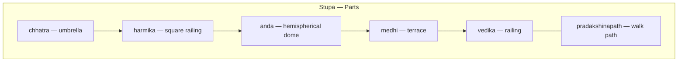

# Mauryan Art & Architecture

> GS-1 · Topic 01 · Mauryan art, architecture, technology

---

## PYQs

| Year | M | Words | Question (EN) | प्रश्न (HI) | ID |
|------|---|-------|---------------|-------------|-----|
| 2025 | 8 | 125 | Comment briefly on the development of art and technology during the Maurya period. | मौर्य काल में कला एवं प्रौद्योगिकी के विकास पर एक संक्षिप्त टिप्पणी कीजिए। | Q1 |
| 2022 | 8 | 125 | Describe the salient features of Mauryan Art and Architecture. | मौर्यकालीन कला एवं स्थापत्य कला की प्रमुख विशेषताओं का वर्णन कीजिए। | Q2 |

---

## Quick Revision

```
PERIOD: 322–185 BCE | Chandragupta → Bindusara → Ashoka (268–232 BCE peak)
PATRONAGE: Imperial court + Buddhist/Jain dhamma after Kalinga (261 BCE)

PILLARS: Chunar sandstone | Mauryan polish | Lotus bell base | Animal capital
  Sites: Sarnath, Rampurva, Lauriya Nandangarh, Allahabad-Kosam, Lauriya Araraj, Delhi-Topra
  Sarnath Lion Capital = 4 lions + dharmachakra = national emblem (1950)
  Edicts: Brahmi, Kharosthi, Greek, Aramaic | Feroz Shah Kotla pillar (Delhi)

YAKSHA-YAKSHI: Nature-deity sculptural tradition (pre-Mauryan roots → Mauryan polish)
  Parkham (Mathura) | Rampurva (yaksha figure) | Didarganj Yakshi (mirror polish, Patna Museum)
  Besnagar Yaksha | Patna Museum collection

STUPAS: Sanchi (UNESCO 1989 core), Bharhut | anda + harmika + chhatra + vedika + pradakshinapath
  ≠ CHAITYA: stupa = solid relic mound | chaitya = rock-cut prayer hall (stupa inside apse)
  Brick core + stone facing | Railings/toranas often later (Shunga)

ROCK-CUT: Barabar + Nagarjuni hills (Bihar) | Lomas Rishi, Sudama, Karan Chaupar, Gopi, Vadathika
  Polished granite | Horseshoe arch (Lomas Rishi) | Jain + Ajivika patronage | Ashoka + Dasharatha

SPREAD: Material culture → Odisha (Dhauli/Jaugada edicts) | AP/Karnataka (Maski, Brahmagiri, Udegolam)
  Kandahar/Kabul pillars (north-west) | wood → stone shift

WOOD: Megasthenes (Indica) — wooden Pataliputra palace (perishable; stone shift marks advance)

TECHNOLOGY: Mirror polish | Monolithic quarrying/transport | Stupa engineering | Edict engraving
  NBPW pottery link | Chunar quarry → Sarnath transport = civil engineering feat

CONTEMPORARY: ASI protected monuments | Art 49/51A(f) | Sanchi UNESCO | Buddhist Circuit tourism
  NEP 2020 IKS (Ashoka dhamma, early statecraft) | National emblem = living Mauryan symbol

TRAPS: Lion Capital = Mauryan NOT Gupta | 2025 = art + tech | Nagar ≠ Mauryan
  Stupa ≠ chaitya | Yakshi ≠ only terracotta folk art | All Sanchi carving ≠ Mauryan
```

---

## Content

### Context — why Mauryan art marks a civilizational turning point

The **Maurya Empire (c. 322–185 BCE)** was the first political structure to unite much of the Indian subcontinent under a single imperial administration stretching from **Afghanistan** through the **Gangetic heartland** to **Kalinga (Odisha)** and parts of the **Deccan**. Before the Mauryas, Indian building culture relied heavily on **perishable materials** — wood, thatch, bamboo, and baked brick without durable stone facing — so almost nothing of pre-Mauryan monumental architecture survives archaeologically. The Mauryan period therefore represents the **decisive shift from ephemeral construction to permanent stone and brick monumentality**, and it is the first phase in which art, architecture, and engineering were deliberately deployed as **instruments of imperial authority, religious patronage, and mass communication**.

**Chandragupta Maurya**, advised by **Chanakya (Kautilya)**, overthrew the **Nanda dynasty** and consolidated Magadhan power; his successor **Bindusara** extended influence southward; **Ashoka (r. c. 268–232 BCE)** reached the empire's zenith after the **Kalinga war of 261 BCE**, after which he publicly embraced **Buddhist dhamma** as a governing ethic. **Megasthenes**, the Greek ambassador of **Seleucus Nicator** at Chandragupta's court, describes in *Indica* (preserved in fragments through **Arrian** and **Strabo**) a magnificent **multi-storeyed wooden palace at Pataliputra** with gilded and silvered pillars — a description that proves court splendour existed but also underscores why Mauryan **stone** monuments matter: wood perished; stone endured. Patronage flowed from the **imperial court**, the **Buddhist sangha**, **Jain communities** (notably at **Barabar**), and the **Ajivika sect** — meaning Mauryan art simultaneously served **politics, religion, and imperial propaganda**, not aesthetic display alone.

### Monolithic pillars — imperial symbols and communication technology

The **Mauryan pillar** is the period's most distinctive artistic and technological achievement. Each pillar was carved from a single block of **Chunar sandstone** quarried near **Mirzapur (Uttar Pradesh)**, transported over hundreds of kilometres, erected upright, and finished with a **lotus bell base**, a **square or circular abacus**, and an **animal capital**. The shaft's **mirror-like polish** — a surface sheen unmatched in later Indian stone sculpture — required grinding and buffing techniques that archaeologists still debate and cannot fully replicate today; this polish is therefore both an **aesthetic signature** and a **technological marker** of Mauryan workshops.

**Ashoka** inscribed many pillars with **edicts** propagating **dhamma** — ethical governance, non-violence, tolerance among sects, respect for parents and elders, and animal welfare. Scripts varied by region: **Brahmi** on most pillars in the Gangetic and Deccan zones; **Kharosthi** in the north-west; **Greek and Aramaic** on bilingual pillars at **Kandahar** and related sites — proving the empire used art as **multilingual state communication**, not merely decoration. The **Sarnath Lion Capital** — four lions seated back-to-back on the abacus, with a **dharmachakra (wheel of law)** and reliefs of bull, horse, elephant, and lion on the abacus band — combines **Buddhist moral symbolism** with **imperial authority**; adopted as the **Republic of India's national emblem on 26 January 1950**, the original remains in the **Sarnath Archaeological Museum**. Other major pillar sites include **Rampurva** (famous **bull and lion capitals**), **Lauriya Nandangarh** and **Lauriya Araraj** (Bihar), **Allahabad-Kosam (Prayag)**, **Delhi-Topra** (re-erected at **Feroz Shah Kotla, Delhi** by Sultan **Feroz Shah Tughlaq** in the 14th century), and fragments in **Afghanistan (Kandahar, Kabul)** — demonstrating a **pan-imperial visual language** from the north-west frontier to the Ganga valley.

### Yaksha-yakshi sculpture — from folk deities to court refinement

**Yakshas** (male nature spirits) and **yakshis** (female fertility deities) belonged to an older **popular cult of tree-and-earth worship** that predates Mauryan imperial art, but under Mauryan patronage these figures received **court-level stone carving and mirror polish** — elevating folk iconography into state-sponsored sculpture. The **Parkham Yakshi** from the **Mathura region** is an early stone yakshi figure that anticipates the later **Mathura sculptural school** of the Kushan-Gupta periods. **Rampurva** in Bihar is associated with both **pillar capitals** and **yaksha sculpture** from the same cultural milieu. The **Didarganj Yakshi**, now in the **Patna Museum**, stands over two metres tall in **Chunar sandstone**, displays **high mirror polish** on her torso, naturalistic anatomy, and holds a **chauri (fly-whisk)** — widely regarded as the finest surviving Mauryan court sculpture. The **Besnagar Yaksha** near **Vidisha** shows the yaksha cult spreading beyond the Magadhan core into **Malwa**. The distinction between **polished stone yakshi** (elite court atelier work) and **terracotta mother-goddess figurines** (widespread among common people) reveals a **two-tier artistic economy** — imperial workshops serving dhamma and court prestige, while folk terracotta served household religion.

### Stupas — Buddhist relic architecture and engineering

The **stupa** is a hemispherical **relic mound (anda)** built over sacred remains of the Buddha or Buddhist saints, raised on a **medhi (terrace)**, crowned by a square **harmika (railing)** and **chhatra (umbrella)**, enclosed by a **vedika (railing)**, and surrounded by a **pradakshinapath (circumambulatory path)** for clockwise ritual walking. Mauryan stupas at **Sanchi (Madhya Pradesh)** and **Bharhut** used a **brick core faced with stone** — an engineering choice that combined lighter interior structure with durable exterior surfacing. **Sanchi's** core is Mauryan; its elaborate **toranas (gateways), railing reliefs, and narrative panels** were added largely under the **Shunga dynasty (2nd–1st c. BCE)** — a critical distinction because historians credit Mauryan **foundation** without attributing all visible carving to Ashoka's reign. **Sanchi** was inscribed as **UNESCO World Heritage in 1989** under "Buddhist Monuments at Sanchi," recognising the Mauryan-era stupa core as the architectural seed of later Buddhist monumentality.



**Stupa versus chaitya — why the distinction matters architecturally**

| Feature | **Stupa** | **Chaitya** |
|---------|-----------|-------------|
| Form | **Solid** relic mound | **Rock-cut hall** for congregational worship |
| Function | Enshrines bodily relics of Buddha or saints | Provides covered space for prayer and assembly |
| Interior | No usable congregational space inside the mound | Long nave with apse; often contains a **stupa at the far end** |
| Mauryan examples | **Sanchi, Bharhut** (free-standing brick-stone cores) | **Barabar-Nagarjuni** caves (earliest rock-cut); chaitya form matures at **Karle, Bhaja** later |
| Distinction | Solid relic mound — circumambulation outside | Covered hall — congregation inside; may contain stupa at apse |

### Rock-cut caves — the ancestor of Indian cave architecture

The **Barabar and Nagarjuni hills** in **Bihar** contain the **earliest surviving rock-cut caves in India**, excavated from **polished granite** for **Ajivika** and **Jain** monks. **Ashoka** donated several caves; his grandson **Dasharatha** continued the tradition — proving **two generations of imperial rock-cut patronage**. The **Lomas Rishi cave** is famous for its **horseshoe-shaped entrance facade** with an **elephant frieze**, anticipating the chaitya-arch form seen centuries later at **Karle**. Other caves include **Sudama, Karan Chaupar, Vishva Zopri, Gopi, and Vadathika**. Interior walls received the same **mirror polish** applied to pillars — the Mauryan state transferred its finishing technology from freestanding monuments to excavated spaces. These caves are the **direct architectural ancestor** of the entire Indian rock-cut line — **Ajanta, Ellora, Elephanta** — even though later caves used different stone, added frescoes, and served primarily Buddhist monastic communities.

### Sculpture, terracotta, and material culture beyond the Gangetic core

**Terracotta figurines** of mother goddesses, animals, and everyday subjects circulated among common people across Mauryan cities — a **folk/popular art tier** distinct from polished court sculpture. **Ring stones and disc stones** with decorative and fertility symbolism appear across Gangetic and Deccan sites. **Northern Black Polished Ware (NBPW)** — glossy-surfaced pottery associated with Mauryan urban centres — parallels the aesthetic of stone polish and signals **industrial-level ceramic production** in cities like **Pataliputra, Kaushambi, and Taxila**. Mauryan **imperial art language** reached regional peripheries through pillars, edicts, and craft styles: **Dhauli and Jaugada** rock edicts in **Odisha** (the Kalinga war region) carry Ashokan dhamma messages on hillsides; minor rock edicts at **Maski, Brahmagiri, Jalinga, Siddapur, and Udegolam** in **Karnataka/Andhra** prove Mauryan political-religious communication penetrated the deep south; **Kandahar and Kabul pillars** connect Mauryan India to the **Seleucid-Greek diplomatic world** through bilingual inscriptions. Material culture — NBPW, ring stones, terracotta types — spread across **Deccan and eastern India** even where pillars are absent, showing Mauryan influence as a **pan-Indian material idiom**, not a Magadhan monopoly.

### Ashoka's dhamma and the political use of art

After the **Kalinga war (261 BCE)**, Ashoka reframed art from pure imperial display into a **vehicle for ethical governance**. Pillars, rock edicts, and stupas carried messages of **non-violence (ahimsa)**, **tolerance among sects (pasanda), respect for parents and officials, and animal welfare** — including restrictions on slaughter on specific days. The **Sarnath Lion Capital** binds **dharmachakra (moral law)** to **lions (imperial power)** — art serving religion and state simultaneously. **Barabar cave donations** to **Jain and Ajivika** communities show dhamma as a **broad ethical policy**, not sectarian Buddhist art alone. Minor edicts across the south demonstrate that permanent monuments functioned as **India's earliest large-scale moral propaganda system** — a template later Gupta and regional dynasties adapted for royal self-presentation.

### Technology — how engineering made Mauryan monumentality possible

| Technology | Mauryan application | Why it mattered |
|------------|---------------------|-----------------|
| **Mirror polish** | Pillars, yakshi torsos, cave interior walls | Unique period signature; technique lost after Mauryas |
| **Monolithic quarrying and transport** | Chunar sandstone pillars to Sarnath, Rampurva, etc. | Tons-weight columns moved hundreds of km — civil engineering feat |
| **Brick-stone stupa core** | Sanchi, Bharhut | Planned geometry, concentric brick layers, stone veneer, drainage |
| **Rock excavation** | Barabar-Nagarjuni granite hills | Earliest precision rock-cut tradition; horseshoe arch prototype |
| **Multi-script engraving** | Brahmi, Kharosthi, Greek, Aramaic edicts | Imperial communication technology across linguistic zones |
| **NBPW pottery production** | Urban Mauryan centres | Industrial ceramic manufacture paralleling stone-finish aesthetics |

The shift from **Megasthenes' perishable wooden Pataliputra palace** to **durable stone pillars, stupas, and caves** marks a technological advance in building materials whose consequences still define India's visual identity — the **national emblem** derives directly from Mauryan stone carving.

### Significance and legacy — why Mauryan art endures

Mauryan art established the **first imperial art language** unifying diverse regions under one aesthetic-political idiom — pillars from **Kandahar** to **Karnataka** share polish, script, and dhamma vocabulary. It laid the foundation for the later **Buddhist monumental tradition**: stupa cores at **Sanchi** evolved into **Gandhara, Mathura, Amaravati, and Ajanta** sculptural schools. The **state-art relationship** Ashoka pioneered — using permanent monuments as **moral billboards** — influenced Gupta and regional dynasties for centuries. Today the **Sarnath Lion Capital** on every government document proves Mauryan visual culture is not museum dust but **living national identity**. **Barabar caves** stand at the head of India's **rock-cut architectural genealogy**, linking Ashoka's polished granite cells to the painted halls of **Ajanta** and the monolithic **Kailasa at Ellora** — different stone, different faiths, same excavating ambition begun under Mauryan engineers.

| Compare with | Mauryan position |
|--------------|------------------|
| **Harappan (Indus Valley)** | Brick cities, seals, no monolithic pillars or Buddhist stupas |
| **Gupta period** | Mauryan = pillars, early stupas, rock-cut beginnings; Gupta = mature **Nagara temples (Deogarh)**, classical sculpture (**Mathura/Sarnath schools**) |
| **Shunga dynasty** | Mauryan stupa **brick cores**; Shunga adds **railings, toranas, narrative reliefs** at Sanchi/Bharhut |
| **Barabar vs Ajanta** | Barabar = polished granite, no painting; Ajanta = basalt, frescoes — both rock-cut but different phases and purposes |

### Site and object reference — key monuments and sculptures

| Site / object | Significance |
|---------------|---------------|
| **Sarnath Lion Capital** | National emblem (1950); dharmachakra + four lions; finest capital |
| **Didarganj Yakshi** | Court yakshi; mirror polish; Chunar sandstone; Patna Museum |
| **Parkham Yakshi** | Early yakshi; Mathura sculptural school link |
| **Rampurva** | Bull/lion capitals; yaksha association |
| **Sanchi stupa (core)** | Mauryan origin; Shunga decoration later; UNESCO 1989 |
| **Bharhut stupa** | Early stupa remains; narrative art largely post-Mauryan |
| **Lomas Rishi cave** | Horseshoe facade; rock-cut pioneer |
| **Barabar caves** | Polished granite; Jain/Ajivika patronage |
| **Dhauli / Jaugada** | Odisha rock edicts; post-Kalinga dhamma |
| **Maski / Brahmagiri** | Southern minor rock edicts |
| **Ashokan rock edicts** | Dhamma propagation + multi-script communication |

### Contemporary relevance

- **UNESCO World Heritage — Buddhist Monuments at Sanchi (1989):** Global recognition of the Mauryan-era stupa core as the foundation of Buddhist monumental architecture; supports international pilgrimage and conservation funding.
- **ASI (Archaeological Survey of India):** Protects Mauryan pillars at **Sarnath, Lauriya Nandangarh, Rampurva**, rock edicts at **Dhauli and Jaugada**, and **Barabar-Nagarjuni caves**; ongoing conservation targets polish surfaces and edict legibility against weathering.
- **Constitutional heritage framework:** **Article 49** directs the state to protect monuments of national importance; **Article 51A(f)** makes it a fundamental duty of citizens to value and preserve rich heritage — Mauryan sites are primary examples in school heritage education.
- **National emblem:** The **Sarnath Lion Capital** adopted **26 January 1950** makes Mauryan art a **living national symbol** on currency, passports, government seals, and official documents.
- **NEP 2020 — Indian Knowledge Systems (IKS):** Ashokan **dhamma ethics**, the **state-art interface**, and Mauryan **engineering achievements** enter history and civics curricula as case studies in moral governance and early statecraft.
- **Tourism schemes:** **Swadesh Darshan** and **PRASAD** (Pilgrimage Rejuvenation and Spiritual Augmentation Drive) develop **Buddhist Circuit** infrastructure linking **Sarnath, Sanchi, Bodh Gaya** — connecting Mauryan heritage to pilgrimage economy.
- **Digital preservation:** ASI **National Mission on Monuments and Antiquities (NMMA)** and 3D scanning of pillars and stupas create records against vandalism and natural decay.
- **Soft power and diplomacy:** Mauryan Buddhist heritage supports **international Buddhist diplomacy** with **Japan, Sri Lanka, and Thailand**; Ashoka as a global icon of non-violence appears in UN peace discourse.
- **Museum access:** **Patna Museum** (Didarganj Yakshi) and **Sarnath Archaeological Museum** (Lion Capital) display Mauryan art under **Ministry of Culture** stewardship for public education.

### Limitations

- Surviving Mauryan **stone sculpture is limited** — much early art was perishable wood; Megasthenes' palace is known only from literary fragments, not archaeology.
- Religious bias toward **Buddhist and Jain imperial patronage** after Ashoka — **Hindu temple architecture** belongs to later Gupta and regional phases, not Mauryan.
- **Attribution debates** persist — some polished sculptures may be late Mauryan or early Shunga; not every Sanchi carving is Ashokan.
- **Polish technique is lost** — conservators cannot fully replicate Mauryan mirror finish; exposed pillars face ongoing surface degradation.
- **Geographic unevenness of survival** — pillars and edicts cluster in specific routes; absence of monuments in a region does not prove absence of Mauryan political control.

---

## Answers

### Q1: Comment briefly on the development of art and technology during the Maurya period. (2025, 8M, 125W)

**Opening:**
> The Maurya period marked a decisive leap — court-sponsored art fused with advanced stone-working technology under imperial patronage.

**Write these points:**
- Under Ashoka, art became an instrument of dhamma — polished pillars with edicts and early stupas like Sanchi.
- Technological breakthrough: **Mauryan polish**, quarrying and erecting monolithic sandstone columns across the empire.
- Stupa building used engineered brick cores and stone facing — architectural planning plus religious function.
- Rock-cut caves at Barabar-Nagarjuni show precision granite excavation; yaksha-yakshi and terracotta reflect art beyond court ateliers.
- Together, art and technology shifted building from perishable materials (Megasthenes' wooden Pataliputra palace) to permanent stone monuments and imperial communication — now protected under **ASI** and **Article 51A(f)** heritage duty.

**Conclusion:**
> Mauryan art and technology were inseparable — aesthetic ambition enabled by superior stone engineering that still defines India's national emblem and Buddhist heritage identity.

---

### Q2: Describe the salient features of Mauryan Art and Architecture. (2022, 8M, 125W)

**Opening:**
> Mauryan art and architecture represent India's earliest pan-imperial monumental tradition — pillars, stupas, caves, and court sculpture.

**Write these points:**
- **Pillars:** Monolithic Chunar sandstone, polished surface, lotus base, animal capitals — Sarnath lions finest example; edicts in Brahmi/Kharosthi/Greek/Aramaic.
- **Stupas:** Hemispherical relic mounds at Sanchi and Bharhut — anda, harmika, chhatra, vedika; simpler than later Shunga elaborations; distinct from **chaitya** prayer halls.
- **Sculpture:** **Didarganj Yakshi**, Parkham and Rampurva yaksha-yakshi tradition; terracotta among common people.
- **Rock-cut caves:** Barabar-Nagarjuni — polished interiors; Lomas Rishi horseshoe facade.
- Synthesis of Buddhist/Jain patronage, imperial ideology, and durable stone architecture — template for classical Indian art; **Sanchi UNESCO (1989)** and national emblem preserve this legacy today.

**Conclusion:**
> Mauryan monuments combined devotion, propaganda, and technical mastery that shaped later Indian visual culture and remains central to India's heritage framework.

---

### Q3 (Future variant): How did Ashoka use art and architecture to propagate dhamma? (8M, 125W)

**Opening:**
> After the Kalinga war, Ashoka transformed art from mere imperial display into a vehicle for ethical dhamma across the Mauryan empire.

**Write these points:**
- **Pillars and edicts** — Brahmi/Kharosthi/Greek/Aramaic inscriptions on polished sandstone pillars and rock faces carried messages of non-violence, tolerance, and righteous governance.
- **Stupas** — relic monuments at Sanchi/Bharhut linked Buddhist devotion to state patronage of dhamma.
- **Geographic reach** — edicts from Dhauli-Jaugada (Odisha) to Brahmagiri-Maski (Karnataka) show art as **pan-empire moral communication**.
- **Cave patronage** — Barabar-Nagarjuni donations to Jain/Ajivika monks demonstrate dhamma beyond sectarian narrowness.
- **Sarnath capital** — dharmachakra + lions symbolise moral law backed by imperial authority — now India's **national emblem** and **NEP 2020 IKS** teaching anchor.

**Conclusion:**
> Ashoka's dhamma art thus pioneered the use of permanent monuments as India's earliest large-scale ethical propaganda system — still honoured through UNESCO-listed Sanchi and national heritage policy.

---

## Traps

| Wrong | Correct |
|-------|---------|
| Lion Capital is Gupta | **Mauryan — Ashoka**, Sarnath |
| 2025 Q = art only | Must include **technology** (polish, quarrying, stupa engineering, edicts) |
| Mauryan art = only Hindu | Primarily **Buddhist/Jain** imperial patronage |
| All stupa carving is Mauryan | **Core** Mauryan; railings/toranas often **Shunga** |
| Stupa = chaitya | **Stupa** = solid relic mound; **chaitya** = rock-cut prayer hall |
| Nagar temple style = Mauryan | Nagar = **medieval** north Indian temples |
| Didarganj Yakshi = terracotta folk | **Polished stone** court sculpture |
| Yakshi only at Didarganj | Also **Parkham, Rampurva, Besnagar** tradition |
| Mauryan art only in Bihar | Edicts/pillars in **Odisha, Karnataka, AP, Afghanistan** too |
| Megasthenes describes stone palace | **Wooden** palace at Pataliputra — perished |
| Ashoka built Hindu temples | **Stupas, pillars, caves** — temple phase later |
| Sanchi not UNESCO | **UNESCO 1989** — Buddhist Monuments at Sanchi |

---

*Complete.*
