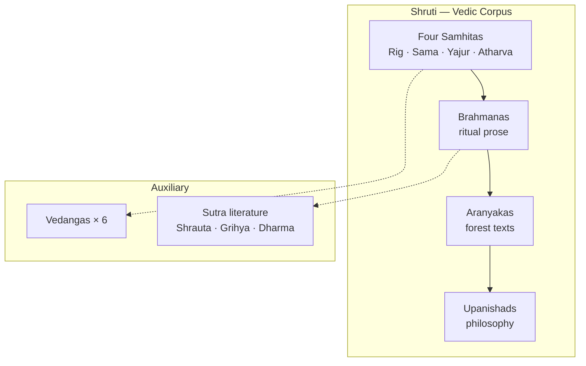
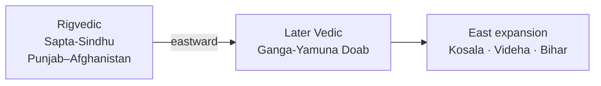

# Vedic Literature

> GS-1 · Topic 01 · Vedic literature — corpus, features, geographical knowledge

---

## PYQs

| Year | M | Words | Question (EN) | प्रश्न (HI) | ID |
|------|---|-------|---------------|-------------|-----|
| 2023 | 8 | 125 | Describe the salient features of Vedic literature. | वैदिक साहित्य की प्रमुख विशेषताओं का वर्णन कीजिए। | Q1 |
| 2021 | 8 | 125 | Discuss the geographical knowledge as reflected in the Vedic literature. | वैदिक साहित्य में निहित भौगोलिक ज्ञान की विवेचना कीजिए। | Q2 |
| — | 8 | 125 | *Likely:* Discuss Vedic society as reflected in Vedic literature. | *संभावित:* वैदिक साहित्य में प्रतिबिंबित वैदिक समाज की विवेचना कीजिए। | Q3 |

---

## Quick Revision

```
CORPUS (Shruti): Samhitas → Brahmanas → Aranyakas → Upanishads
  Rig (1500–1000 BCE, hymns) | Sama (melody) | Yajur (ritual prose) | Atharva (charms)
  Brahmanas = ritual commentary | Aranyakas = forest texts | Upanishads = philosophy (600 BCE)

RIGVEDA MANDALAS: II–VII = earliest (family books) | I, X = later additions
  Mandala X = Purusha Sukta (varna hymn) — late layer

SUTRA LAYER: Shrauta (public sacrifice) | Grihya (domestic rites) | Dharma sutras (law/custom)
  Sulva sutras = altar geometry | Kalpa vedanga umbrella

VEDANGAS (6): Shiksha, Kalpa, Vyakarana, Nirukta, Chhanda, Jyotisha

WOMEN RISHIS: Lopamudra (Rig I.179) | Ghosha (Rig X.39–40) | Apala, Vishvavara — rare but significant

FEATURES: Sanskrit | Oral → written | Layered compilation | Religious-ritual core
  No south of Vindhyas in early phase

GEOGRAPHY — RIG: Sapta-Sindhu (Punjab-Afghanistan) | Sindhu=Indus | Sarasvati=Naditama
  Kubha=Kabul | Vitasta=Jhelum | Asikni=Chenab | Parushni=Ravi | Vipash=Beas | Shutudri=Sutlej

GEOGRAPHY — LATER: Ganga-Yamuna Doab | Kuru-Panchala | Hastinapur | Kosala, Videha (Bihar)
  Expansion: Punjab → W UP → E UP → Bihar | No full pan-India map

SOCIETY IN TEXTS: jana/tribe → rajan | sabha, samiti | varna emergence | gavishthi (cattle raids)
  Later: kingdoms, ashvamedha, priestly dominance

CONTEMPORARY: UNESCO Vedic chanting (2008) | NEP 2020 IKS + Sanskrit | Sarasvati Heritage Project
  Art 49/51A(f) | ASI PGW site correlation | Rigveda manuscript preservation

TRAPS: Vedic lit ≠ epics/Puranas | Geography expands over time | Sarasvati debate
  Grihya ≠ Shrauta | Upanishads = knowledge over ritual | Education = separate file (05)
```

---

## Content

### Context — what Vedic literature is and why it matters

**Vedic literature** is the corpus of **Indo-Aryan Sanskrit texts** composed during the **Vedic age (c. 1500–500 BCE)** — the primary textual source for early Indian **history, society, religion, economy, and geography**. Classified as **Shruti** ("heard"/revealed), it stands apart from later **Smriti** (epics, Puranas, Dharmashastras) that belong to a remembered tradition rather than divine audition. For centuries before written fixation, Vedic texts were preserved through **oral transmission** with extraordinary precision using **padapatha** (word-by-word) and **kramapatha** (step recitation) systems — a pedagogical achievement recognised when **UNESCO listed Vedic chanting as Intangible Cultural Heritage in 2008**, with living recitation schools in **Kerala, Maharashtra, and Karnataka**. The language is **Vedic Sanskrit**, an older stage of classical Sanskrit, and the corpus grew **layer by layer** over centuries — meaning historians must apply **internal stratigraphy**, not read all Vedic texts as one uniform age.

### Structure of the Vedic corpus — from hymns to philosophy

| Layer | Text type | Nature | Historical utility |
|-------|-----------|--------|-------------------|
| **Samhitas** | Four Vedas | Hymns, prayers, ritual formulas | Early society, gods, geography, economy |
| **Brahmanas** | Prose attached to each Veda | Ritual explanation, sacrifice details | Social hierarchy, kingship rituals, customs |
| **Aranyakas** | "Forest books" | Mystical-ritual thought for hermits | Transition from external ritual to inner meaning |
| **Upanishads** | Philosophical appendices | Metaphysics — Atman, Brahman | Intellectual revolution; challenge to pure ritualism |
| **Sutra literature** | Shrauta, Grihya, Dharma sutras | Codified ritual and domestic law | Later Vedic social norms, household rites |



### The four Samhitas and Rigveda chronology

| Veda | Approx. date | Content / character | Notes |
|------|--------------|---------------------|-------|
| **Rigveda** | c. 1500–1000 BCE | **1028 hymns** to **Indra, Agni, Varuna, Soma** | **Oldest** Indo-Aryan text; **Mandalas II–VII earliest**, **I and X later** |
| **Samaveda** | c. 1000 BCE onward | Melodic rendering of Rig verses for **sacred chant** | Music in ritual performance |
| **Yajurveda** | c. 1000 BCE onward | **Prose + verse** ritual formulas for sacrifices | **Shukla (White)** and **Krishna (Black)** recensions |
| **Atharvaveda** | c. 1000 BCE onward | **Charms, spells, healing**, everyday magic | Popular religion; less "orthodox" than the other three |

Together the four Vedas form **Chaturveda**; historical reconstruction of the early period relies primarily on the **Rigveda**. Internal chronology matters: **Mandalas II–VII** (family books, c. 1500–1200 BCE) preserve core hymns of tribal society in **Sapta-Sindhu** geography; middle layers include **Mandala IX** (Soma hymns); **Mandalas I and X** (c. 1000 BCE onward) are composite and late — **Mandala X** contains the **Purusha Sukta** (varna-origin hymn) and philosophical compositions. Treating the entire Rigveda as one date produces false conclusions about society and geography.

### Brahmanas, Aranyakas, Upanishads, and Sutra literature

**Brahmanas** are prose commentaries explaining **yajna (sacrifice)** meaning and procedure — **Aitareya and Kaushitaki** (Rigveda), and the massive **Shatapatha Brahmana** (Yajurveda) document **Later Vedic** society with stronger priesthood, kingdoms, and royal consecration rituals (**rajasuya, ashvamedha**). **Aranyakas** ("forest treatises") bridge Brahmanas and Upanishads with esoteric ritual symbolism for forest-dwelling students — an inward turn in Vedic thought. **Upanishads** (from c. **600 BCE**, mainly in **Kuru-Panchala and Videha**) teach **Atman, Brahman, karma, moksha**, and the identity **Atman = Brahman** — a philosophical reaction against excessive ritualism that influenced **Buddhism and Jainism**; key texts include **Chhandogya, Brihadaranyaka, Isha, Katha, Mundaka, and Taittiriya**.

| Sutra type | Subject | Historical value |
|------------|---------|------------------|
| **Shrautasutras** | Rules for **grand public sacrifices** | State ritual, royal consecration procedures |
| **Grihyasutras** | **Domestic rites** — birth, marriage, funeral | Family structure, life-cycle customs, gender roles |
| **Dharma sutras** | Early **law and custom** — varna duties, penance | Proto-Dharmashastra; Later Vedic social norms |
| **Sulvasutras** | Geometry of fire altars | Early mathematics (Pythagorean triples) |

Sutras belong to the **Kalpa vedanga** — concise aphorisms codifying Brahmana-era ritual. **Grihya and Dharma sutras** bridge Vedic religion to classical **Smriti** law (**Manusmriti** etc.).

### Vedangas and women rishis

The six **Vedangas** auxiliary sciences support correct Vedic recitation and ritual: **Shiksha** (phonetics), **Kalpa** (ritual rules), **Vyakarana** (grammar — later systematised by **Panini**), **Nirukta** (etymology — **Yaska**), **Chhanda** (prosody), and **Jyotisha** (astronomy for fixing sacrifice dates). The corpus is overwhelmingly male-composed, yet the **Rigveda names women rishis (rishikas)**: **Lopamudra** (hymn **I.179**, dialogue with **Agastya**), **Ghosha** (**X.39–40**, daughter of **Kakshivat**), and others including **Apala and Vishvavara**. These are **exceptional within patriarchal ritual society** — cite them for women's early intellectual participation, but do not overstate gender equality.

### Salient features of Vedic literature as a whole

Vedic literature is **orally composed and transmitted** by rishis and reciter families before writing became common. Its **religious-ritual core** centres on **yajna**, nature gods (**Indra, Agni, Varuna**), and cosmic order (**Rita**). **Layered growth** over centuries means Rigveda mandalas, Brahmanas, and Upanishads belong to different phases. The corpus is the **Sanskrit literary foundation** for grammar, philosophy, and classical literature. Though not history writing, hymns embed **tribal names, rivers, occupations, and conflicts** — notably the **Battle of Ten Kings (Dasarajna)** on the **Parushni (Ravi)**. Tone shifts from **Rigvedic pastoral-tribal hymns** through **Later Vedic elaborate ritualism** to **Upanishadic philosophical critique**. The **elite male priestly perspective** means common people and groups called **dasa/dasyu/pani** appear through biased Aryan lenses.

### Vedic society as reflected in the texts

| Aspect | Rigvedic phase | Later Vedic phase |
|--------|----------------|-------------------|
| **Polity** | Tribes (**jana**), chiefs (**rajan**), assemblies (**sabha, samiti**) | Kingdoms (**Kuru, Panchala**); **rajasuya, ashvamedha** sacrifices |
| **Social order** | **Varna** ideas emerging; Arya/Dasa distinction | Fourfold varna crystallised (**Purusha Sukta**, Mandala X); jati beginnings |
| **Economy** | **Cattle wealth**, **gavishthi** (cattle raids); pastoral | Plough agriculture, **bali** tribute; crafts and trade |
| **Religion** | Nature gods; simple yajnas | Elaborate sacrifices; **brahmana** priestly dominance |
| **Technology** | Copper/bronze (**ayas**) | Iron (**shyama ayas/krishna ayas**) in later texts |
| **Women** | **Rishikas** (Lopamudra, Ghosha) | Increasing patriarchy in Grihya/Dharma sutras |

Literature alone cannot fix exact chronology — cross-check with **Painted Grey Ware (PGW)** and **Ochre Coloured Pottery (OCP)** archaeology.

### Historical value — what Vedic literature reconstructs

Used with **PGW and OCP archaeology**, Vedic literature reconstructs the **tribal-to-kingdom transition** in northern India: from **jana (tribe)** and **rajan (chief)** with **sabha/samiti assemblies** to **Kuru-Panchala kingdoms** performing **rajasuya and ashvamedha** sacrifices described in **Brahmanas**. It documents **economic change** from **gavishthi cattle raids** and pastoral wealth to plough agriculture, **bali tribute**, crafts, and trade. It maps **religious evolution** from **Indra-Agni nature worship** through elaborate **yajna ritualism** to **Upanishadic Atman-Brahman philosophy** that challenged brahmanical dominance and influenced **Buddhism and Jainism**. It preserves **technology vocabulary** — copper/bronze **ayas** in the Rigveda, iron **krishna ayas/shyama ayas** in later texts — correlating with archaeological metal phases. No other ancient Indian source pack covers this **intellectual arc** with equal depth.

**Mountains, frontiers, and what geography tells historians**

**Himalaya (Himavant)** forms the northern boundary and source of rivers in Vedic imagination. **Vindhya** appears in later texts as the southern limit of Aryan expansion — absent from the early Rigvedic core. **Samudra (sea)** in the Rigveda likely indicates the **Arabian Sea or Indus mouth**; later texts reference an **eastern sea** contact zone tied to trade and pilgrimage geography that survives today in **Kumbh Mela at Prayag** and **PRASAD** pilgrimage infrastructure. Historians use this geographic progression to confirm **gradual eastward settlement** from the Indus basin to the Ganga valley — not a single sudden conquest but centuries of movement reflected in shifting river centrality. **Place-name correlation** links **Kuru-Panchala** literary centres to **PGW archaeology** in the Doab; **OCP** on the fringe correlates with early Vedic layers. Rivers shift course — especially the drying **Sarasvati/Ghaggar-Hakra** — so hydrology, excavation, and the **Sarasvati Heritage Project** must accompany textual reading.

### Geographical knowledge — progressive eastward expansion

Vedic geography is **progressive**, not static. Earliest texts know **Sapta-Sindhu (land of seven rivers)** in the north-west; later texts show **eastward expansion** into the **Ganga-Yamuna Doab**, eastern UP, and **Bihar (Videha)**. The early Vedic corpus does **not** mention deep south (**Tamilakam**) or the full Deccan — confirming initial concentration in **Punjab–Afghanistan–western UP**. Geographic data comes from **river names, mountains, tribes, and kingdoms** — not systematic cartography.



**Rigvedic Sapta-Sindhu (c. 1500–1000 BCE)**

| # | Rigvedic name | Modern river |
|---|---------------|--------------|
| 1 | **Sindhu** | Indus |
| 2 | **Vitasta** | Jhelum |
| 3 | **Asikni** | Chenab |
| 4 | **Parushni** | Ravi |
| 5 | **Vipash** | Beas |
| 6 | **Shutudri** | Sutlej |
| 7 | **Sarasvati** | Ghaggar-Hakra (debated) |

**Sapta-Sindhu** covers **eastern Afghanistan, Pakistan Punjab, Indian Punjab**, and fringes of **western UP**. **Sarasvati** is called **Naditama** (best of rivers) — identified mainly with the **Ghaggar-Hakra** dry riverbed (Rajasthan-Haryana), though some scholars propose the **Helmand (Afghanistan)**. **Kubha** = **Kabul river**; **Gomati and Drishadvati** also appear. The **Dasarajna** battle on **Parushni** locates **Bharata-Puru** conflicts in the Punjab. Tribal names — **Bharatas, Purus, Anus, Druhyus, Turvasas, Yadus, Pakthas** — map north-west tribal geography.

**Later Vedic expansion (c. 1000–500 BCE)** moved from **Punjab → western UP → eastern UP (Ganga plain) → Bihar (Videha)**.

| Ancient name | Location / modern region | Significance |
|--------------|--------------------------|--------------|
| **Kuru-Panchala** | **Ganga-Yamuna Doab**, Haryana-Delhi | Political-literary centre; Brahmanas compiled here |
| **Hastinapur** | Meerut (Kuru capital) | Later Vedic urban settlement (archaeology) |
| **Kosala** | Eastern UP (Awadh) | Eastern expansion |
| **Videha** | North Bihar (Mithila) | Upanishadic centre — **King Janaka's** court |
| **Kaushambi** | Near Prayag | Kuru shift after Hastinapur flood tradition |

**Ganga and Yamuna** replace Sindhu centrality; **Sadānīra** and eastern tributaries mark continued eastward movement. **Narmada** appears only in **later Brahmanas/Upanishads** — gradual widening, not Rigvedic knowledge. **Himalaya (Himavant)** forms the northern boundary; **Vindhya** marks the southern limit in later texts. **Samudra (sea)** references in the Rigveda likely indicate the **Arabian Sea/Indus mouth**; later texts mention an **eastern sea** trade zone.

| Aspect | Rigvedic phase | Later Vedic phase |
|--------|----------------|-------------------|
| **Core region** | Sapta-Sindhu (Punjab–Afghanistan) | Ganga-Yamuna Doab + eastern UP–Bihar |
| **Main rivers** | Sindhu, Sarasvati | Ganga, Yamuna |
| **Political geography** | Tribes (jana) | Kingdoms (Kuru, Panchala, Kosala, Videha) |
| **South India** | Absent | Minimal/absent in core Vedic texts |
| **Key evidence** | Rigveda Mandalas II–VII | Yajurveda, Brahmanas, Upanishads |

Place-name correlation links literary tradition to **PGW culture** in the Doab (Later Vedic) and **OCP** on the fringe (early Vedic). Rivers shift course (**Sarasvati** drying); poetic exaggeration requires **excavation and hydrology** cross-check — notably the **Sarasvati Heritage Project** on **Ghaggar-Hakra**. Reading **Rigvedic Sapta-Sindhu** alongside **Later Vedic Kuru-Videha** expansion captures the full geographic arc; treating all Vedic texts as one static map misrepresents how the corpus grew eastward over centuries.

### Contemporary relevance

- **UNESCO Intangible Heritage (2008) — Vedic chanting:** Living recitation in **Kerala (Thirunavaya)**, Maharashtra, Karnataka preserves oral Vedic literature as active heritage.
- **NEP 2020 — IKS:** Vedic corpus taught **critically** — Upanishadic thought, **Sulva geometry**, **Jyotisha** astronomy as indigenous knowledge systems.
- **Sanskrit institutions:** **Central Sanskrit Universities**, **Rashtriya Sanskrit Sansthan**, CBSE Sanskrit — linguistic continuity from Vedic to classical Sanskrit.
- **Sarasvati Heritage Project:** ASI-supported **Ghaggar-Hakra** research correlates Rigvedic **Sarasvati (Naditama)** with hydrology and PGW sites.
- **Constitutional framework:** **Article 49** protects sites like **Hastinapur and Kurukshetra**; **Article 51A(f)** values Vedic heritage as civilizational identity.
- **Archaeological correlation:** **ASI excavations** at **Hastinapur, Atranjikhera, Alamgirpur** (PGW) validate Later Vedic geography.
- **Manuscript preservation:** **Bhandarkar Oriental Research Institute (Pune)**, **Adyar Library (Chennai)**, **National Manuscript Mission** digitisation.
- **Living ritual geography:** **Kumbh Mela at Prayag** — sacred **Ganga-Yamuna confluence** from Later Vedic texts remains active under **PRASAD scheme**.

### Limitations

- **Not a chronicle** — no dated events; hymns mythologise victories.
- **Geographic knowledge expands over time** — early texts ≠ full subcontinental map.
- **Religious bias** — Aryan perspective; opponents labelled **dasa/dasyu/pani**.
- **Interpolation** — especially **Rigveda Mandalas I and X** and later Brahmanas.
- **Sarasvati debate** — **Ghaggar-Hakra vs Helmand** identification unresolved.
- **Normative hymns** — **Purusha Sukta** describes ideal varna order; modern **IKS** teaches critical reading, not uncritical revival of hierarchy.

Vedic literature is **foundational** but must be read with **stratigraphy, archaeology, and critical edition** — not as a uniform chronicle or literal migration narrative alone.

---

## Answers

### Q1: Describe the salient features of Vedic literature. (2023, 8M, 125W)

**Opening:**
> Vedic literature forms the oldest extensive Sanskrit corpus of ancient India — orally composed Shruti texts spanning hymns, rituals, and philosophy from c. 1500–500 BCE.

**Write these points:**
- **Structure:** Four **Samhitas** (Rig, Sama, Yajur, Atharva) followed by **Brahmanas**, **Aranyakas**, and **Upanishads** — layered from ritual hymns to philosophical thought.
- **Rigveda** (oldest) contains hymns to Indra, Agni, Varuna; **Mandalas II–VII earliest**, I and X later; later Vedas and Brahmanas elaborate **sacrifice (yajna)**; Upanishads teach **Atman-Brahman**.
- **Oral tradition** precisely preserved before writing; **Vedic Sanskrit**; six **Vedangas** and **Shrauta/Grihya/Dharma sutras** codify ritual and domestic life.
- Historically reveals **tribal-to-kingdom transition**, varna formation, cattle-to-agriculture economy, and religious evolution — though elite priestly perspective.
- **UNESCO-recognised Vedic chanting (2008)** and **NEP 2020 IKS** preserve and teach this corpus as living civilizational heritage.

**Conclusion:**
> Vedic literature is thus the foundational textual bedrock of Indian civilization — ritualistic in origin yet philosophically transformative, preserved through oral mastery and modern conservation policy.

---

### Q2: Discuss the geographical knowledge as reflected in the Vedic literature. (2021, 8M, 125W)

**Opening:**
> Vedic literature preserves a progressively expanding geographical horizon — from the Sapta-Sindhu of the Rigveda to the Gangetic and Bihar regions of later texts.

**Write these points:**
- **Rigvedic phase:** Core area = **Sapta-Sindhu** (seven rivers) — Sindhu, Vitasta, Asikni, Parushni, Vipash, Shutudri, Sarasvati — covering Punjab, Afghanistan, western UP; **Sarasvati** as Naditama.
- Battles like **Dasarajna** on Parushni and tribal names (Bharatas, Purus) locate early Aryans in **north-western subcontinent**, not yet in deep south.
- **Later Vedic texts:** Eastward expansion to **Ganga-Yamuna Doab** — **Kuru-Panchala**, **Hastinapur**, then **Kosala** and **Videha** (Bihar); Ganga and Yamuna replace Sindhu centrality.
- Himalaya as northern limit; gradual mention of wider frontiers; geography tied to **political evolution** from tribes to janapadas.
- **Limits:** poetic not cartographic; Sarasvati debate; south largely absent — geography corroborated with **PGW archaeology** and **Sarasvati Heritage Project** today.

**Conclusion:**
> Vedic geographical knowledge thus maps the eastward civilizational movement of early Indo-Aryan society across the river systems of northern India — still studied through IKS and archaeological correlation.

---

### Q3: Discuss Vedic society as reflected in Vedic literature. (Likely PYQ)

**Opening:**
> Vedic literature embeds a evolving social portrait — from Rigvedic tribal pastoralism with assemblies and cattle wealth to Later Vedic kingdoms, varna hierarchy, and priestly ritual dominance.

**Write these points:**
- **Polity:** Early **jana** (tribe), **rajan** (chief), **sabha/samiti** (assemblies); later **Kuru-Panchala** kingdoms with **rajasuya, ashvamedha** sacrifices (Brahmanas).
- **Social order:** Varna ideas emerge in early hymns; **Purusha Sukta** (Rigveda X) codifies fourfold varna; **Dharma/Grihya sutras** later formalise household and legal norms.
- **Economy:** **Gavishthi** (cattle raids) and pastoral wealth in Rigveda; plough agriculture, tribute (**bali**), crafts and trade in Later Vedic texts; iron (**krishna ayas**) appears later.
- **Religion and gender:** Nature-god worship and yajnas; Upanishadic philosophical turn; rare **women rishis** — **Lopamudra, Ghosha** — within broadly patriarchal framework.
- **Limits:** Hymnic not sociological survey; elite brahmanical lens — corroborate with **PGW archaeology**; modern **NEP IKS** teaches critical reading, not uncritical revival of varna norms.

**Conclusion:**
> Vedic society, as read through its literature, charts the transition from tribal Gangetic fringe communities to the hierarchical kingdom culture that shaped classical Indian social order.

---

## Traps

| Wrong | Correct |
|-------|---------|
| Vedic literature = Mahabharata/Puranas | **Shruti corpus** — Samhitas to Upanishads; epics are Smriti/later |
| All Rigveda mandalas same age | **II–VII earliest**; **I and X later** (Purusha Sukta in X) |
| All Vedas same age as Rigveda | **Rigveda oldest**; Sama, Yajur, Atharva, Brahmanas later |
| Rigveda covers all India including south | Early Vedic = **north-west/Sapta-Sindhu**; south absent |
| Geography static in all Vedas | **Expands eastward** over time — Punjab → Doab → Bihar |
| No women in Vedic intellectual life | **Rishikas** — Lopamudra (I.179), Ghosha (X.39–40) — rare but real |
| Grihya sutras = public sacrifice manuals | **Grihya = domestic rites**; Shrauta = public yajnas |
| Sarasvati certainly = Ganga tributary | Main identification **Ghaggar-Hakra**; debate continues |
| Vedic texts = exact history book | **Hymnic/ritual** sources — need archaeology cross-check |
| Upanishads promote more sacrifices | Upanishads stress **knowledge over ritual** |
| Vedic education = this file's focus | **Gurukula/education** = separate subtopic (05) |
| NEP 2020 = uncritical revival of Purusha Sukta varna | **IKS = critical study** with archaeology and ethics |

---

*Complete.*
