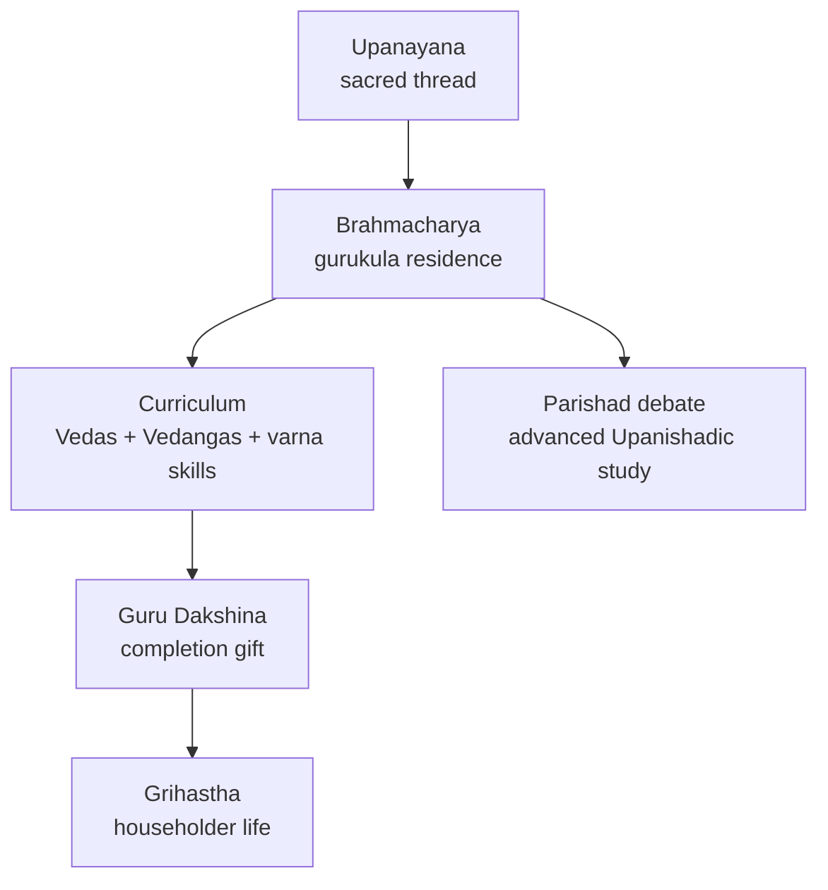

# Vedic Education System

> GS-1 · Topic 01 · Vedic education — gurukula, features, present relevance

---

## PYQs

| Year | M | Words | Question (EN) | प्रश्न (HI) | ID |
|------|---|-------|---------------|-------------|-----|
| 2019 | 8 | 125 | Describe the salient features of the Vedic education system and discuss its relevance in the present context. | वैदिक शिक्षा-प्रणाली की प्रमुख विशेषताओं का वर्णन कीजिए तथा वर्तमान संदर्भ में इसकी प्रासंगिकता की विवेचना कीजिए। | Q1 |

---

## Quick Revision

```
SYSTEM: Gurukula — Guru/Acharya + Shishyas at ashrama (forest/hermitage)
STAGE: Brahmacharya (1st ashrama) — student life, celibacy, discipline

ENTRY: Upanayana (sacred thread) = dvija ("twice-born")
  Allowed: Brahmana, Kshatriya, Vaishya | Denied: Shudra, women (Later Vedic onward)
  Age: ~8–12 (varna-wise variation in texts)

METHOD: Oral (shruti) | Memorization — padapatha, kramapatha | No fees; Guru Dakshina at end
SUBJECTS: Vedas, Vedangas, grammar, ethics, dharma, warfare (Kshatriya), agriculture (Vaishya)
VALUES: Character (sadachar), simplicity, service to guru, self-control

CENTRES: Guru's ashrama | Sandipani (Ujjain) | Janaka-Videha parishad | Kuru-Panchala
WOMEN: Early Rig Vedic — rishis (Apala, Lopamudra, Ghosha) | Later Vedic — formal access closed
  Upanishadic: Gargi, Maitreyi — philosophical debate, not formal gurukula

DHARMASHASTRA: Manu/Yajnavalkya — duties of guru, shishya, brahmacharya rules
LIMITS: Exclusionary (varna/gender) | Elite ritual focus | No mass literacy

CONTEMPORARY: Guru-shishya parampara | NEP 2020 IKS | Art 21A + RTE universal access
  UNESCO Vedic chanting (2008) | Rashtriya Sanskrit Sansthan | reject caste/gender exclusion

TRAPS: ≠ modern school/university | ≠ Nalanda/Takshashila (later, cosmopolitan, Buddhist)
  Takshashila = 6th c. BCE urban | Grihya sutras codify domestic education norms
```

---

## Content

### Context — education as transmission of sacred knowledge in the Vedic age

**Vedic education** was the institutional system through which **Shruti knowledge** — Vedas, ritual science, dharma, and auxiliary disciplines — was transmitted in ancient India during the **Vedic age (c. 1500–500 BCE)** and codified further in **Dharmashastra/Smriti** tradition. Unlike modern schools with textbooks and universal enrolment, Vedic learning was organised around the **gurukula** (the teacher's household or forest **ashrama**), where education was **inseparable from religion, ethics, and social role**. The system's purpose was to produce **learned dvijas** — twice-born initiates of the **Brahmana, Kshatriya, and Vaishya** varnas — versed in sacred recitation and righteous conduct (**sadachar**). Understanding this system requires grasping both its **pedagogical achievements** (the world's most precise oral literary tradition) and its **social exclusions** (denial of formal Vedic study to **shudras and women** in the Later Vedic period) — a balance essential when discussing **present relevance** under **NEP 2020** and constitutional rights.

### Gurukula institutions — guru, shishya, and ashrama

| Element | Details |
|---------|---------|
| **Guru / Acharya** | Teacher — typically a **brahmana** scholar; absolute moral and intellectual authority |
| **Shishya** | Resident pupil who lives with the guru |
| **Ashrama** | Forest hermitage or guru's dwelling — simple, disciplined environment |
| **Guru Dakshina** | Completion gift — not monthly tuition; could be cattle, service, or blessing |
| **Parishad (vidvat parishad)** | Assembly of learned scholars for advanced philosophical debate |

The gurukula was **residential and personal** — the **guru-shishya parampara (lineage bond)** mattered more than an institutional degree. Teaching was **free during the study period**; the pupil repaid through **seva** — collecting fuel, tending cattle, and household work — which simultaneously taught humility and self-reliance. Advanced philosophical education in the Later Vedic–Upanishadic phase moved from isolated ashramas to **royal courts and regional assemblies**, but remained **guru-led**, not degree-granting like later **Nalanda** or **Takshashila**.

### Named centres of Vedic learning

| Centre | Significance |
|--------|--------------|
| **Guru's ashrama** | Default unit — forest/hermitage; teacher-centred, not campus-based |
| **Sandipani (Ujjain)** | Guru **Sandipani** — tradition links **Krishna and Sudama** as pupils; western India Vedic centre |
| **Janaka's Videha parishad** | **King Janaka** of **Videha (Mithila)** hosted **vidvat parishads** — **Yajnavalkya–Gargi** debates in Upanishadic texts |
| **Kuru-Panchala region** | **Kuru (Delhi-Meerut)** and **Panchala (western UP)** — heartland where many **Brahmanas and Upanishads** were composed |



### Brahmacharya ashrama and Upanayana — entry into formal study

The first of the **four ashramas**, **Brahmacharya** was the student stage marked by **celibacy, austerity, and concentrated study**. Entry was through **Upanayana (sacred thread ceremony)**, which made the initiate a **dvija ("twice-born")**. Only the **three upper varnas** — **Brahmana, Kshatriya, Vaishya** — were eligible; **shudras and women** were denied Upanayana and formal Vedic education as **Later Vedic** society tightened social closure. Smriti texts prescribe Upanayana ages — roughly **8 for Brahmana, 11 for Kshatriya, 12 for Vaishya** (with variations). The student wore simple **deer skin or bark cloth**, carried a staff and **mekhala (girdle)**, and begged **bhiksha (alms)** to cultivate humility.

### Women in Early vs Later Vedic education

| Aspect | **Early Rig Vedic** | **Later Vedic** |
|--------|---------------------|-----------------|
| **Women scholars** | **Apala, Lopamudra, Vishvavara, Ghosha** — women rishis; composed hymns | Rare; **Gargi, Maitreyi** in Upanishadic debate — exceptional, not norm |
| **Upanayana** | Less rigid exclusion in earliest period (debated) | **Women denied** sacred thread and formal Vedic study |
| **Participation** | Some role in **sabha/samiti** discourse | Brahmanical monopoly; education reinforces **patriarchy + varna** |

The contrast is historically critical: women participated more in **Early Rig Vedic intellectual life**, but the **Later Vedic system formally excluded women from Vedic adhyayana**. **Gargi and Maitreyi** were **Upanishadic debaters**, not representative graduates of formal gurukula schooling.

### Curriculum, methods, and Dharmashastra codification

**Core curriculum for all dvija students** included **Veda adhyayana** (memorisation of one's **shakha/recension**) and the six **Vedangas** — **Shiksha, Chhanda, Vyakarana, Nirukta, Jyotisha, Kalpa**. **Varna-oriented additions** differentiated functional training:

| Varna | Emphasis |
|-------|----------|
| **Brahmana** | Ritual (yajna), Brahmanas, mantras, priestly duties |
| **Kshatriya** | **Dhanurvidya** (archery), warfare, statecraft, ethics of kingship |
| **Vaishya** | Agriculture, cattle, trade, accounting basics |

Higher learning covered **Upanishads** and **shastrartha (debate)** on ethics and dharma. **Teaching methods** relied on **oral transmission (shruti)** with rigorous **padapatha and kramapatha** memorisation to prevent textual corruption. The shishya listened, repeated, and questioned only when permitted — **learning by doing** through ritual chores and (for Kshatriyas) martial training. There was **no mass examination system**; the guru judged mastery and permitted transition to **Grihastha (householder)** life.

**Smriti texts (Manu, Yajnavalkya, Gautama)** codified education as **dharma**:

| Party | Duties (summary) |
|-------|-------------------|
| **Guru** | Teach without meanness; protect pupil like son; impart Vedas, dharma, self-control |
| **Shishya (Brahmacharin)** | Celibacy; serve guru (fuel, alms, cattle); study with concentration; truthfulness; no luxury |
| **Householder (after study)** | Support scholars; fund education; ensure son's Upanayana |

**Manusmriti** idealises **24 years** of Vedic study for a brahmana (shorter for kshatriya and vaishya in some recensions) — education as **moral duty**, not optional skill acquisition.

### Varna-differentiated training — functional specialisation explained

The gurukula did not teach identical curricula to every dvija. **Brahmana pupils** mastered **yajna procedure**, **Brahmana prose**, mantras, and priestly duties because their social function was **ritual mediation** between gods and community. **Kshatriya pupils** added **dhanurvidya (archery)**, chariot warfare, fortification basics, and the **ethics of kingship** — including when violence was dharma and when restraint was required — because their function was **protection and governance**. **Vaishya pupils** studied **agriculture, cattle management, weights, measures, and trade accounting** because their function was **production and exchange**. This **varna-differentiated syllabus** was not modern vocational choice but **hereditary role training** embedded in **Smriti law**; it simultaneously produced skilled social actors and **locked education into hierarchy** — the tension modern India resolves by adopting **holistic and skill-based learning (NEP 2020)** while rejecting **caste-based access barriers (Article 15)**.

### Salient features — summary of the system's character

The Vedic education system was **gurukula-based and residential**, built on the **guru-shishya parampara** with a **religious-ethical foundation** that treated character building and sacred knowledge as one project. It was **oral and memorisation-centric** — the **padapatha/kramapatha** systems preserved Vedic text across millennia with variant readings smaller than most written manuscript traditions, a feat **UNESCO recognised in 2008** through Vedic chanting heritage listing. Teaching was **free during study** with **Guru Dakshina at completion**, not commercialised monthly fees. The **varna-differentiated curriculum** trained priests, warriors, and producers for distinct social functions. Student life demanded **celibacy, frugality, and physical labour** through **seva** to the guru. Access was **exclusionary** — formal Vedic study restricted to upper three varnas; women and shudras largely excluded in the Later Vedic period. Regional centres in **Kuru-Panchala, Videha (Janaka's parishad), and Ujjain (Sandipani)** anchored the tradition geographically across the Gangetic plain and western India.

### Takshashila and Nalanda — essential contrast, not Vedic gurukula

**Takshashila (Taxila)** in **Gandhara** flourished mainly **6th c. BCE–5th c. CE** as a **cosmopolitan urban university** teaching medicine, grammar, polity, and warfare to **international students** under strong **Buddhist** influence later. **Nalanda** (mature **5th–12th c. CE**) was a large **Mahayana Buddhist monastic university** with libraries, formal admissions, and multi-subject curricula — patronised by **Gupta and Pala rulers** and visited by **Hiuen Tsang**. Neither equals the Vedic **gurukula**: gurukula was **oral, forest-based, dvija-focused, and pre-Buddhist** in its core; Takshashila and Nalanda were **later, urban, multi-subject, and wider-access** (including non-brahmin traditions). Confusing them erases the distinction between **sacred oral lineage training** and **later cosmopolitan higher education**.

### Social change and alternative education

Early Vedic society permitted relatively **open tribal learning** through assemblies (**sabha, samiti**). Later Vedic society saw **brahmanical monopoly** on Vedic lore, with education reinforcing **varna hierarchy**. **Buddhist pabbajja** and **Jain monastic education** offered alternatives open to wider sections including women — explaining why heterodox traditions gained ground among groups excluded from closed Vedic gurukulas. These monastic schools taught **Pali Tripitaka** or **Jain Angas** through communal living and debate, contrasting with the **dvija-only, forest ashrama, oral-Veda** model of the brahmanical gurukula. Understanding both systems clarifies why ancient Indian education was **plural** — not a single "gurukula for all" — even though Smriti texts present the brahmanical model as normative.

### Dharmashastra duties — guru, shishya, and householder obligations

Beyond curriculum lists, **Smriti law codes** defined education as reciprocal **dharma** binding three parties. The **guru** must teach without meanness, protect the pupil like a son, and impart **Vedas, self-control, and righteous conduct**. The **brahmacharin shishya** must observe **celibacy**, serve the guru through fuel-gathering and cattle-tending, study with concentration, speak truth, and avoid luxury — discipline designed to forge character before household responsibilities. The **householder** who completes study must support scholars, fund education, and ensure his son's **Upanayana** — continuing the parampara across generations. **Manusmriti** idealises long study durations (**24 years** for brahmana in some recensions), legalising the gurukula not as optional tutoring but as **sacred social obligation** embedded in the four-ashrama life scheme. The pupil's daily rhythm combined **pre-dawn recitation, daytime chores, evening revision, and strict dietary and social rules** — including avoidance of intoxicants, gambling, and contact with polluting substances during brahmacharya. Completion was marked not by a certificate but by the guru's permission to marry, enter household life, and perform one's varna duties — making education a **rite of passage** rather than a credential for employment in the modern sense.

### Contemporary relevance

Modern India's engagement with Vedic education is deliberately **selective**. **NEP 2020 — Indian Knowledge Systems (IKS)** integrates **Sanskrit, Ayurveda, yoga, astronomy, and philosophy** while mandating **21st-century skills**; it cites the gurukula for **holistic character formation, teacher-pupil bonding, and value-based learning** — visible also in **classical music guru-shishya parampara** and **ITI apprenticeship schemes**. **Guru-shishya parampara** persists in **research supervision**, **mentorship programmes**, and **vocational training** supported by **UNESCO-listed oral traditions**.

**Constitutional contrast — what modern India adopts vs rejects:**
- **Adopt:** Character education, teacher-student bond, Sanskrit/IKS heritage, discipline ethos, residential learning models in **AYUSH yoga/Ayurveda** programmes under **Ministry of AYUSH**.
- **Reject:** Caste/gender exclusion — **Article 15** (non-discrimination), **Article 21A** (right to education), **RTE Act 2009** mandate **universal free compulsory education** for ages **6–14**.

**Article 51A(f)** makes heritage valuation a citizen duty — studied **critically**, not revived as discriminatory Smriti access rules. **Institutional continuity** includes **Rashtriya Sanskrit Sansthan**, **Central Sanskrit Universities**, **Gurukul Kangri (Haridwar)**, and **IKS electives at IITs/IISERs**. **UNESCO Vedic chanting (2008)** preserves the **oral pedagogy** behind Vedic memorisation — proof of pedagogical mastery, not mass literacy. Vedic schools in **Kerala (Thirunavaya)**, Maharashtra, and Karnataka remain open to scholars and diaspora interest. **Balanced present-day view:** adopt dedication, holistic growth, and teacher-pupil bonding; reject discrimination and elitism; combine **IKS + STEM + universal access** under democratic constitutional rights — **reformist adaptation**, not restoration of a closed dvija-only ashrama system.

### Limitations

- **Narrow eligibility** — majority (**shudras, women**) denied formal Vedic study in Later Vedic period.
- **Ritual-religious bias** — little room for secular sciences and arts for non-elite.
- **No universal literacy** — education served a small priestly-ruling minority.
- **Oral dependence** — knowledge loss if lineages broke; limited geographic spread.
- **Conservative orientation** — preservation of tradition over innovation (though Upanishads show philosophical growth within the system).
- **Not a modern university** — no formal degrees, libraries, or multi-faith campuses like **Nalanda/Takshashila**.

Despite these limits, the gurukula model's **pedagogical legacy** — intimate mentorship, ethical formation, and oral precision preserved through **UNESCO-listed Vedic chanting** — remains intellectually significant when separated from its **exclusionary social architecture** and adapted to India's **constitutional commitment to universal, non-discriminatory education** under **Article 21A** and the **RTE Act 2009**. Modern policy thus inherits **method**, not **access rules**.

---

## Answers

### Q1: Describe the salient features of the Vedic education system and discuss its relevance in the present context. (2019, 8M, 125W)

**Opening:**
> Vedic education was a gurukula-based, oral, and ethics-centred system through which sacred knowledge was transmitted to dvija pupils during the Vedic age.

**Write these points:**
- **Institution:** **Gurukula** — pupils lived with **guru/acharya** in ashrama; **Brahmacharya** stage; entry via **Upanayana** (sacred thread) for Brahmana, Kshatriya, Vaishya; centres like **Kuru-Panchala**, **Janaka's Videha parishad**, **Sandipani (Ujjain)**.
- **Method & curriculum:** **Oral memorization** of Vedas and **Vedangas**; varna-specific skills — ritual for brahmins, warfare for kshatriyas, agriculture/trade for vaishyas; **guru dakshina** at completion, not commercial fees; **Dharmashastra** codified guru-shishya duties.
- **Values:** Discipline, celibacy, simplicity, seva to guru, truthfulness — education fused with **character building**.
- **Limits:** Excluded **shudras and women** (Later Vedic); Early Rig Vedic had **women rishis** — contrast important; elite ritual focus; not same as **Takshashila/Nalanda**.
- **Present relevance:** **Guru-shishya parampara**, holistic and value-based learning align with **NEP 2020 IKS** — but only with **universal access** under **Article 21A/RTE**, gender equality, and modern scientific curriculum.

**Conclusion:**
> Vedic education's enduring legacy lies in its moral depth and teacher-pupil tradition — relevant today only when stripped of exclusion and adapted to democratic, inclusive schooling under constitutional rights.

---

## Traps

| Wrong | Correct |
|-------|---------|
| Vedic education = Nalanda/Takshashila | **Gurukula** oral Vedic system; Nalanda/Takshashila = **later**, cosmopolitan, Buddhist-influenced |
| All varnas and women studied Vedas equally | **Dvija only**; shudras/women **excluded** in Later Vedic formal system |
| No women ever learned in Vedic India | **Early Rig Vedic** women rishis (Apala, Ghosha); decline in **Later Vedic** |
| Written textbooks were primary | **Oral shruti** — padapatha/kramapatha memorization |
| Paid monthly fees to guru | **Free study**; **Guru Dakshina** at end |
| Vedic education purely secular | **Religious-ritual** core — Vedas, yajna, dharma |
| Present relevance = restore varna-based access | Reject exclusion; adopt **values only** — NEP universal equity + **Article 21A** |
| Takshashila = Vedic gurukula | Takshashila = **later urban university**; different period, scope, access |
| Same as Vedic literature file topic | Literature = **texts**; this file = **education system/institution** |
| NEP 2020 = return to gurukula exclusion | NEP = **IKS + modern skills + inclusive access** |
| Gargi/Maitreyi = formal gurukula graduates | **Upanishadic debaters** — exceptional, not representative of formal Vedic schooling |
| UNESCO Vedic chanting = proves universal ancient education | Proves **oral pedagogy mastery** — not mass literacy or inclusive access |

---

*Complete.*
