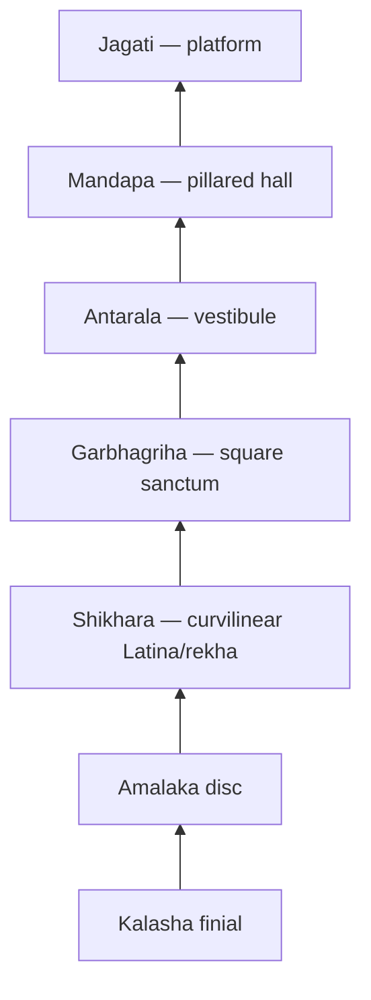
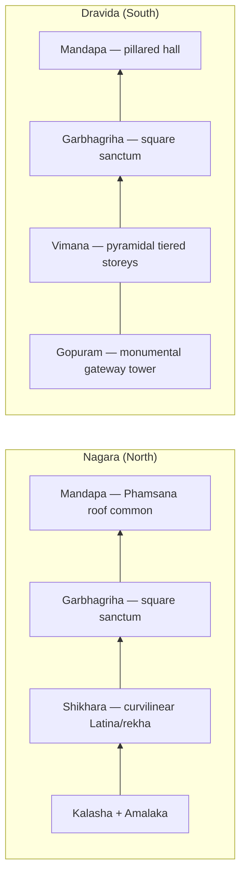

# Nagar Style Temple Architecture

> GS-1 · Topic 01 · Nagara (Nagar) style temple architecture — north India

---

## PYQs

| Year | M | Words | Question (EN) | प्रश्न (HI) | ID |
|------|---|-------|---------------|-------------|-----|
| 2023 | 8 | 125 | Describe the salient features of Nagar style of temple architecture. | नागर शैली की मंदिर वास्तुकला की प्रमुख विशेषताओं का वर्णन कीजिए। | Q1 |

---

## Quick Revision

```
STYLE: Nagara (Nagara) = NORTH Indian Hindu temple idiom | Curvilinear SHIKHARA (Latina/rekha)
NOT: Mauryan stupa | NOT Dravida pyramidal vimana (south) | NOT Vesara hybrid (Deccan)

TEXTS: Mayamata · Vishnudharmottara · Manasara · Brihat Samhita (temple proportions, vastu)
PARTS: Jagati (platform) → Garbhagriha (sanctum) → Antarala (vestibule) → Mandapa (hall)
  Shikhara above garbhagriha | Amalaka (disc) + Kalasha (finial pot) on top
  Pradakshina patha | Optional: ardha-mandapa, mahamandapa, torana, nandi-mandapa

SHIKHARA SUB-TYPES: Latina/rekha (curvilinear — sanctum) | Phamsana (pyramidal — mandapa roof)
  Valabhi (rectangular barrel vault — rare, e.g. Vaital Deul khakhara)

PLAN: Square sanctum common | Panchayatana = 1 main + 4 subsidiary shrines (corners)
  Nagara = curvilinear tower focus | Dravida = pyramidal vimana + monumental gopuram

MATERIAL: Stone (sandstone) later; early brick (Bhitargaon, Gupta) | Terracotta (Bengal)

REGIONS & PEAKS:
  Gupta early: Deogarh (Jhansi) · Bhitargaon (Kanpur brick) · Bhitari
  Chandelas: Khajuraho — Kandariya Mahadeva (c. 950–1050 CE) | UNESCO 1986
  Odisha: Lingaraja · Jagannath (Puri) · Konark Sun Temple (13th c.) | UNESCO 1984
  Gujarat: Modhera Sun Temple (Solanki) | Somnath tradition
  Bengal: Vishnupur char-chala · at-chala (Pala-Sena brick)
  Chalukya transitional: Aihole · Pattadakal (Nagara-Dravida blend → Vesara)
  Himalayan: Martand Sun Temple (Kashmir, Lalitaditya, 8th c.)

ODISHA DEUL: Rekha (curvilinear sanctum) · Pidha (pyramidal mandapa) · Khakhara (barrel vault)

FEATURES: Vertical Mount Meru axis | Rich sculptural walls (mithunas, dvara-shakhas)
  Khajuraho = peak Nagara sculpture + architecture

vs DRAVIDA: Nagara = curvilinear shikhara | Dravida = pyramidal vimana + gopuram gateway
  Aihole/Pattadakal = transitional | Vesara = Deccan hybrid (Hoysala Belur/Halebidu)

CONTEMPORARY: UNESCO — Khajuraho (1986) · Konark (1984) | ASI protected monuments
  Art 49 (state protect) · Art 51A(f) (citizen duty) | NEP 2020 IKS — Shilpashastra in curriculum
  PRASAD · Swadesh Darshan · Incredible India — temple tourism circuits
  Digital ASI documentation · craft revival (stone carving GI clusters)

TRAPS: Nagar ≠ Nagara spelling both OK | Odisha rekha deul = Nagara sub-school | Mauryan ≠ Nagar
  Phamsana ≠ sanctum shikhara | Aihole = transitional not pure Nagara | Khakhara ≠ rekha
  Bengal char-chala = regional Nagara not Dravida | Konark = Nagara not separate style
  Garbhagriha = sanctum not mandapa | Vesara ≠ same as Nagara | Kandariya = Nagara not Dravida
```

---

## Content

### Context — what is Nagara (Nagar) style

**Nagara** (also written **Nagar**) is the principal **north Indian** idiom of **Hindu temple architecture** that developed from the early historic period through the medieval era and dominated sacred building across the Gangetic plains, central India, Odisha, Gujarat, Rajasthan, Bengal, and the Himalayan foothills. The name derives from **Nagara desha** — the "north country" — as distinguished in classical **Shilpashastra** treatises such as **Mayamata**, **Vishnudharmottara Purana**, **Manasara**, and **Varahamihira's Brihat Samhita**, which codified temple proportions, cardinal orientation, and iconographic programmes for builders working north of the Vindhyas.

A Nagara temple is fundamentally a **vertical sacred machine** designed to house the deity's image and channel the worshipper's movement and gaze upward along a cosmic axis. Its mature form combines a **square sanctum (garbhagriha)** crowned by a **curvilinear shikhara** (tower), a preceding **mandapa** (pillared hall), often a raised **jagati** (platform), and a **pradakshina patha** (circumambulatory passage). The shikhara's inward-curving silhouette — the **Latina** or **rekha** type — is the style's defining visual signature; it symbolises **Mount Meru**, the axis mundi connecting earth and heaven in Hindu cosmology. Why does the tower curve rather than rise in flat tiers? Because Shilpashastra logic treats the sanctum as the deity's cosmic body and the shikhara as its crown — a single soaring curve concentrates spiritual energy at the summit where **amalaka** (ribbed disc) and **kalasha** (finial pot) complete the vertical ascent.

The Nagara tradition is inseparable from the expansion of **Brahmanical image-worship** from the **Gupta period** (5th–6th century CE) onward, when freestanding stone and brick temples replaced earlier rock-cut shrines and flat-roofed cells. Gupta builders at **Deogarh** and **Bhitargaon** established the foundational vocabulary — garbhagriha plus rekha shikhara plus mandapa — that later dynasties refined to monumental scale. Under **Chandela** patronage at **Khajuraho** (c. 950–1050 CE), **Ganga dynasty** builders in Odisha, **Solanki** rulers in Gujarat, and **Pala-Sena** patrons in Bengal, Nagara architecture reached regional peaks without abandoning its core rekha-shikhara identity. Proof of continuity lies in the persistence of the same component names, the same Mount Meru symbolism, and the same Shilpashastra texts across fifteen centuries of building from Jhansi to Kashmir.

### Core architectural components

Every Nagara temple is assembled from a fixed vocabulary of parts, each with a ritual function tied to how worship unfolds in space. The **garbhagriha** (literally "womb-house") is the sanctum sanctorum — a small, dark, usually square cella where the main deity image (murti) resides; its darkness emphasises the mystery of divine presence and its square plan reflects vastu prescriptions for cosmic order. Above the garbhagriha rises the **shikhara**, the curvilinear tower that is Nagara's hallmark — not to be confused with the pyramidal roof that often covers the mandapa. The **amalaka**, a large ribbed stone disc, sits at the shikhara summit and supports the **kalasha**, a finial pot symbolising abundance and cosmic completion.

Between sanctum and hall stands the **antarala** (vestibule), a transitional space where priest and worshipper move from public assembly to intimate darshan. The **mandapa** is the pillared prayer hall — subdivided into **ardha-mandapa** (porch) and **mahamandapa** (large hall) in mature temples — where devotees gather before approaching the deity. The entire complex often rests on a raised **jagati** (platform) that doubles as a circumambulation base and social gathering space. The **pradakshina patha** encircles the sanctum clockwise, allowing ritual circumambulation without entering the garbhagriha itself. Optional elements include **torana** (decorative gateways in early temples), **nandi-mandapa** (pillared pavilion for Nandi bull before Shaiva shrines, as at Khajuraho), and subsidiary shrines in **panchayatana** plans.

| Part | Function | Architectural role |
|------|----------|-------------------|
| **Garbhagriha** | Sanctum sanctorum — main deity image (murti); small, dark, square cella | Heart of worship; orientation fixed by vastu |
| **Shikhara** | Tower above garbhagriha — **curvilinear outline** (Nagara hallmark) | Vertical Mount Meru axis; not the mandapa roof |
| **Amalaka** | Large ribbed stone disk at shikhara summit | Supports kalasha finial; crowns the sacred axis |
| **Kalasha** | Finial pot on top of amalaka | Completes vertical sacred axis; auspicious symbol |
| **Antarala** | Vestibule between garbhagriha and mandapa | Ritual transition from public hall to private sanctum |
| **Mandapa** | Pillared assembly/prayer hall — ardha-mandapa, mahamandapa | Horizontal counterbalance to vertical shikhara |
| **Jagati** | Raised platform — circumambulation base | Social and ritual gathering space |
| **Pradakshina patha** | Circumambulatory passage around sanctum | Clockwise worship circuit |
| **Torana / Dwar** | Decorative gateway (early temples) | Later replaced by high enclosure walls |
| **Nandi-mandapa** | Pillared pavilion for Nandi bull (Shaiva temples) | e.g. before main shrine at Khajuraho |



### Shikhara sub-types (Nagara vocabulary)

Nagara architecture distinguishes three roof-and-tower forms, and confusing them obscures how a temple actually works. The **Latina** or **rekha** shikhara is a **curvilinear** tower with a single convex curve rising to the amalaka — it belongs exclusively over the **garbhagriha** and defines Nagara identity. **Deogarh**, **Kandariya Mahadeva** at Khajuraho, and the **Lingaraja rekha deul** in Odisha all demonstrate this form. **Phamsana** is a **pyramidal** roof with horizontal tiers or steps; it typically covers **mandapas** and subsidiary shrines rather than the sanctum — Khajuraho mandapa roofs and Odisha **pidha deul** halls use this profile. **Valabhi** (also called **khakhara** in Odisha) is a **rectangular barrel vault** resembling a wagon roof; it appears rarely for special shrines, most famously at **Vaital Deul** in Bhubaneswar.

Why does this vocabulary matter? Because the sanctum tower and the hall roof serve different ritual functions: the rekha shikhara concentrates divine presence vertically, while Phamsana spreads the assembly space horizontally beneath stepped tiers. Shilpashastra treats the vertical shikhara as Mount Meru — the cosmic axis — and draws the worshipper's gaze upward from mandapa to sanctum to finial, completing a journey from human congregation to divine intimacy.

| Sub-type | Form | Typical use | Key example |
|----------|------|-------------|-------------|
| **Latina / Rekha** | **Curvilinear** tower — single convex curve rising to amalaka | **Sanctum shikhara** — classic Nagara hallmark | Deogarh, Kandariya Mahadeva, Lingaraja rekha deul |
| **Phamsana** | **Pyramidal** roof with horizontal tiers/steps | **Mandapa roofs**, subsidiary shrines | Khajuraho mandapa roofs, Odisha pidha deul |
| **Valabhi** | **Rectangular barrel vault** (wagon-roof shape) | Rare — special shrines | Vaital Deul (khakhara type), some mandapas |

### Odisha deul types (regional Nagara)

Odisha developed one of the most distinctive regional expressions of Nagara architecture, naming its tower forms **deul** rather than shikhara but preserving the same sanctum-centred logic. The **rekha deul** carries a **curvilinear rekha/latina** shikhara over the sanctum — **Lingaraja** (11th century, Bhubaneswar) and **Jagannath Puri** are canonical examples sharing the curvilinear sanctum tower logic of Khajuraho and Deogarh. The **pidha deul** uses a **pyramidal pidha** profile with stepped tiers and typically roofs assembly halls (**jagamohana**) rather than the sanctum — it parallels Phamsana in function. The **khakhara deul** adopts a **barrel-vault / wagon-roof** form similar to Valabhi; **Vaital Deul** (8th century, Bhubaneswar) is the best-known example, often associated with **Shakta** worship.

The **Konark Sun Temple** (13th century, patron **Narasimhadeva I** of the Ganga dynasty) represents Odisha Nagara at its most ambitious: a massive **rekha deul** conceived as **Surya's chariot** with twenty-four carved wheels and seven stone horses, among India's most celebrated sacred monuments and a **UNESCO World Heritage Site (1984)**. Odisha's school is a **regional Nagara sub-tradition**, not a separate pan-Indian style — its rekha deul shares curvilinear sanctum logic with north Indian prototypes while adapting pidha and khakhara forms to local ritual and climatic needs.

| Deul type | Shikhara form | Example / note |
|-----------|---------------|----------------|
| **Rekha deul** | **Curvilinear rekha/latina** shikhara | **Lingaraja** (Bhubaneswar, 11th c.), **Jagannath Puri** — classic Nagara sanctum tower |
| **Pidha deul** | **Pyramidal pidha** (stepped tiers) | **Jagamohana** (assembly hall) roofs in Odisha complexes — parallels Phamsana |
| **Khakhara deul** | **Barrel-vault / wagon-roof** (valabhi-like) | **Vaital Deul** (Bhubaneswar, 8th c.) — rarer, often **Shakta** shrines |

### Bengal regional variants (Nagara family)

When stone became scarce in the Gangetic delta, Bengal builders adapted Nagara logic to **brick and terracotta**, producing roof forms unknown elsewhere in the tradition. **Char-chala** temples use **four sloping planes** meeting at an apex, creating a four-roofed silhouette common in medieval Bengal from the **Pala-Sena** period onward and flourishing at **Vishnupur/Mallabhum** (17th–18th century). **At-chala** adds four smaller roofs above a char-chala base, producing an eight-roofed (**at-chala**) tiered profile; **Rasmancha** at Vishnupur is a famous multi-arched pavilion in this idiom. The underlying plan — sanctum plus tower-roof plus mandapa — remains Nagara; only the material and roof geometry respond to alluvial soil, monsoon climate, and local patronage. **Terracotta panels** narrating **Ramayana, Mahabharata, and Krishna lila** substitute for stone carving, proving that Nagara is a spatial-ritual system adaptable across materials rather than a fixed stone template.

### Salient features of Nagara style

Eight interlocking features define Nagara architecture and distinguish it from every other Indian temple idiom. First, the **curvilinear shikhara (Latina/rekha)** — a tall tower with convex-to-inward curve over the garbhagriha — is the style's defining visual mark. Second, the **square garbhagriha** orients the deity for worship from the mandapa; its darkness and small scale emphasise divine mystery. Third, **vertical emphasis** makes the temple rise dramatically upward as a symbol of **Mount Meru**, contrasting with the horizontal spread of pillared halls. Fourth, **mandapa integration** balances the vertical shikhara — mandapas often carry **Phamsana** pyramidal roofs while the sanctum retains its rekha tower. Fifth, **rich sculptural decoration** covers walls, doorframes (**dvara-shakhas** with river-goddess figures Ganga and Yamuna), ceilings, **mithunas** (celestial couples), and narrative panels from epics and Puranas — Khajuraho represents the sculptural peak. Sixth, the **panchayatana plan** places one central shrine with four subsidiary shrines at the corners, as at the **Lakshmana temple, Khajuraho**. Seventh, **material evolution** runs from early **brick** (Gupta **Bhitargaon**, c. 5th century CE — among the oldest surviving brick temples) to mature **sandstone** at Chandelas, Odisha, and Rajasthan sites. Eighth, **regional sub-schools** adapt the same idiom to local stone, climate, and patron dynasties without losing rekha-shikhara identity over the sanctum.

### Regional schools and named examples

| Region / dynasty | Key temples | Period / notes |
|------------------|-------------|----------------|
| **Gupta (early Nagara)** | **Deogarh** (Jhansi, Vishnu temple), **Bhitargaon** (Kanpur, brick), **Bhitari** (Varanasi region) | **Earliest** structural temple forms; brick + stone; modest rekha shikhara — c. 5th–6th c. CE |
| **Chandelas — Khajuraho** | **Kandariya Mahadeva** (~31 m shikhara), Lakshmana, Vishvanatha, Parsvanatha (Jain) | **Peak** Nagara — tallest shikharas, famed sculpture (c. 950–1050 CE); **UNESCO 1986** |
| **Odisha — Ganga/Eastern Ganga** | Lingaraja (Bhubaneswar), Jagannath (Puri), **Konark Sun Temple** (13th c.) | **Rekha, pidha, khakhara deul** types; Konark **UNESCO 1984** |
| **Gujarat — Solanki** | **Modhera Sun Temple** (Surya, stepped tank), Somnath tradition | Stone carving; torana gateways; ratha (chariot) motifs |
| **Rajasthan / Malwa** | **Osian** (Osiya, 8th–12th c.), Nagda, Eklingji | Sandstone Nagara; Maru-Gurjara sub-style |
| **Bengal** | Vishnupur terracotta temples, **Bishnupur Rasmancha** | **Char-chala, at-chala** — brick Nagara variants |
| **Chalukya transitional** | **Aihole, Pattadakal** (Karnataka) | **Nagara-Dravida blend** — Lad Khan, Durga temple (Aihole); Virupaksha (Dravida), Papanatha (Nagara) at Pattadakal |
| **Himalayan / Kashmir** | **Martand Sun Temple** (Kashmir, 8th c., **Lalitaditya Muktapida**) | **Himalayan Nagara** — peristyle colonnade, central rekha shikhara |

### Aihole and Pattadakal — transitional architecture

The **Chalukyas** (6th–8th century CE) built at **Aihole** — often called the "cradle of Indian temple architecture" — and **Pattadakal** when **Nagara and Dravida** vocabularies were actively combined on Deccan soil. At Aihole, the **Lad Khan temple** (pillared hall type), **Durga temple** (apsidal experimental plan), and **Huchimalligudi** represent early Nagara shikhara experiments outside the Gangetic heartland. At Pattadakal, **Virupaksha** (Dravida-influenced vimana, built by queen **Lokamahadevi**) and **Papanatha** (Nagara shikhara) stand **side by side on the same site** — physical proof that both idioms coexisted before regional specialisation hardened. The Pattadakal group is a **UNESCO World Heritage Site (1987)**. These sites are not pure Nagara; they mark the **transition toward Vesara**, the Deccan hybrid idiom that would mature under the Hoysalas at Belur and Halebidu, demonstrating pan-Indian exchange of temple vocabulary across the Vindhyas.

### Himalayan Nagara — Martand (Kashmir)

**Martand Sun Temple** (8th century, patron **Lalitaditya Muktapida** of the Karkota dynasty) is the finest surviving example of **Kashmir Nagara**, now in ruins but recoverable in plan. It features a **peristyle courtyard**, central **garbhagriha** with **rekha-type shikhara**, and heavy limestone construction adapted to Himalayan snow-load and altitude. Martand proves that Nagara idiom travelled **beyond the Gangetic north** into Kashmir as a regional variant influenced by Gandharan and Gupta traditions rather than by Dravida forms from the peninsula. The temple's peristyle colonnade — unusual in plains Nagara — reflects local climatic and aesthetic adaptation while preserving the rekha sanctum tower as cosmic axis.

### Evolution and period chronology

Nagara architecture evolved through four identifiable phases, each building on the previous without breaking ritual continuity. Gupta builders (c. 5th–6th century CE) established simple **rekha shikhara** forms in brick and stone with single-cell garbhagriha plus mandapa at **Deogarh** and **Bhitargaon**. The transitional phase (c. 6th–8th century CE) saw **Aihole and Pattadakal** synthesise Nagara shikhara and Dravida vimana as stone replaced brick. Maturity (c. 8th–12th century CE) brought complex plans, towering shikharas, and elaborate sculpture at **Khajuraho, Lingaraja, and Modhera**. The medieval peak (c. 10th–13th century CE) fully developed regional sub-schools — **Konark**, Bengal char-chala, and the Martand legacy — before political fragmentation slowed new construction. Gupta architecture overall is less spectacular than Gupta sculpture and literature, but **Deogarh marks the crucial transition** from rock-cut and flat-roofed shrines to the classic Nagara vocabulary that dominated north India for a millennium.

| Phase | Period | Character | Landmark sites |
|-------|--------|-----------|----------------|
| **Origins** | c. 5th–6th c. CE (Gupta) | Simple **rekha shikhara**, brick temples, single-cell garbhagriha + mandapa | **Deogarh, Bhitargaon** |
| **Experimentation** | c. 6th–8th c. CE | **Aihole/Pattadakal** — Nagara-Dravida synthesis; stone replaces brick | Chalukya courts |
| **Maturity** | c. 8th–12th c. CE | Stone, complex plans, towering shikharas, elaborate sculpture | **Khajuraho, Lingaraja, Modhera** |
| **Medieval peak** | c. 10th–13th c. CE | Regional sub-schools fully developed; large temple complexes | **Konark**, Bengal char-chala, Martand legacy |

### Nagara vs Dravida vs Vesara (comparison)

Hindu temple architecture crystallised into three classical idioms that answer the same ritual question — how to house the deity and guide worship — through different spatial emphases. **Nagara** (north) crowns the sanctum with a **curvilinear Latina/rekha shikhara** and uses **torana** gateways or later enclosure walls; mandapas often carry **Phamsana** pyramidal roofs. **Dravida** (south) stacks a **pyramidal tiered vimana** over the sanctum and foregrounds the monumental **gopuram** gateway tower — which in later temples at Srirangam often exceeds the vimana in height. **Vesara** (Deccan) hybridises both, producing star-shaped Hoysala plans at Belur and Halebidu from the Chalukya legacy visible at Pattadakal.

| Feature | **Nagara** (North) | **Dravida** (South) | **Vesara** (Deccan) |
|---------|-------------------|---------------------|---------------------|
| **Tower** | Curvilinear **shikhara** (Latina/rekha) | Pyramidal **vimana** (tiered storeys) | **Hybrid** — combined features |
| **Region** | North & central India, Odisha, Bengal, Gujarat | Tamil Nadu, Karnataka, AP | Karnataka, Deccan plateau |
| **Entrance** | Torana / later enclosure walls | Monumental **gopuram** (gateway tower) | Mixed — often low vimana, ornate exterior |
| **Mandapa roof** | Often **Phamsana** (pyramidal) | Pyramidal or flat pillared | Mixed |
| **Vertical axis** | Single soaring shikhara | Vimana + increasingly dominant gopuram | Star-shaped plan (Hoysala) |
| **Examples** | Khajuraho, Deogarh, Konark, Martand | Brihadeshwara (Thanjavur), Kailasanatha (Kanchi) | Hoysala (Belur, Halebidu); Chalukya Pattadakal |



### Significance and civilizational legacy

Nagara architecture represents the **distinctive north Indian sacred skyline** — the visual identity of medieval Hindu polities from the **Chandelas** and **Ganga dynasty of Odisha** to the **Solankis** and **Palas**. Temples functioned as **cultural, economic, and social centres**: **devadana** land grants sustained priestly communities, festival economies circulated wealth, and craft patronage employed stone-carvers, sculptors, and musicians for generations. Khajuraho and Puri Jagannath remain active pilgrimage hubs proving continuity between medieval construction and living devotion. **Sculptural galleries** preserve iconography of **Vishnu, Shiva, Devi, Surya**, and Jain **tirthankaras** — indispensable evidence for art history and religious studies. Nagara rekha logic persisted in later **Rajput, Bengal, and Himalayan** building traditions at Bishnupur, Maru-Gurjara Rajasthan, and Kashmir stone temples. Today, the Khajuraho dance festival, Konark festival, and Puri Rath Yatra anchor **living heritage economies** rooted in Nagara-built sacred landscapes.

### Contemporary relevance

Nagara monuments anchor India's heritage conservation, education, and tourism frameworks today. **UNESCO World Heritage** listing of **Khajuraho Group of Monuments (1986)**, **Konark Sun Temple (1984)**, and **Pattadakal (1987)** creates international obligations under the World Heritage Convention and channels conservation funding and tourism revenue to Madhya Pradesh, Odisha, and Karnataka. The **Archaeological Survey of India (ASI)** monitors structural integrity at **Konark** (sandstone weathering), **Khajuraho** (water seepage on sculpture), **Deogarh**, and **Bhitargaon** — early Nagara sites face distinct conservation challenges from brick decay and root damage. **Article 49** of the Constitution directs the state to protect monuments of national importance; **Article 51A(f)** makes it a fundamental duty of citizens to value and preserve composite culture including temple heritage.

**NEP 2020's Indian Knowledge Systems (IKS)** integrates **Shilpashastra**, temple proportion geometry, and Nagara-Dravida comparison into art history, architecture, and heritage management curricula. Government schemes **PRASAD** (Pilgrimage Rejuvenation and Spiritual Augmentation Drive) and **Swadesh Darshan** develop connectivity and amenities at **Puri, Khajuraho, and Varanasi-region** circuits; **Incredible India** campaigns feature Konark and Khajuraho globally. **Craft revival and GI tags** link stone-carving clusters in **Khajuraho, Puri, and Rajasthan** to temple restoration workshops, sustaining heritage skills as livelihood; **terracotta craft** revival in Bengal ties to Vishnupur temple panels. ASI's **National Mission on Monuments and Antiquities (NMMA)** and 3D documentation create preservation records for endangered Nagara temples including **Martand** and **Bhitargaon**. **Puri Jagannath Rath Yatra**, **Konark Dance Festival**, and **Khajuraho Dance Festival** anchor annual cultural tourism worth crores to Odisha, Madhya Pradesh, and UP border region economies.

### Limits / balanced view

Nagara architecture is **not monolithic**. Odisha rekha/pidha/khakhara, Bengal **char-chala/at-chala**, Kashmir Martand, and Maru-Gurjara Rajasthan are **regional variants** under the broader Nagara family — not identical copies of Khajuraho. Early Gupta temples at **Deogarh** were **small and experimental**; attributing full medieval features such as panchayatana, thirty-metre shikharas, and mithuna galleries to them is historically inaccurate. **Phamsana** covers mandapas, not the main sanctum tower. **Aihole and Pattadakal** are transitional Chalukya sites blending Nagara and Dravida — neither pure Nagara nor pure Dravida. Nagara is **distinct from Buddhist stupa, chaitya, and vihara** traditions and from **Mauryan pillars and stupas** — it belongs to the post-Gupta Brahmanical structural temple tradition. Many Nagara sites including **Somnath** and Kashmiri temples suffered **medieval invasions and earthquakes**; present structures may represent **rebuilt or restored layers** rather than original medieval fabric. Understanding these limits prevents oversimplified comparisons and honours the diversity within the Nagara family.

---

## Answers

### Q1: Describe the salient features of Nagar style of temple architecture. (2023, 8M, 125W)

**Opening:**
> Nagara (Nagar) style is the classic north Indian Hindu temple architecture distinguished by a curvilinear rekha/latina shikhara rising above a square garbhagriha, integrated with mandapa halls on a raised platform.

**Write these points:**
- **Plan and parts:** **Garbhagriha** (sanctum) + **mandapa** (pillared hall), often **antarala** (vestibule) and **jagati** (platform); **pradakshina patha** for circumambulation; **panchayatana** plan in many medieval examples.
- **Shikhara types:** Main tower = **Latina/rekha** (curvilinear) over sanctum — crowned by **amalaka** and **kalasha**; **Phamsana** (pyramidal) for mandapa roofs; **Valabhi/khakhara** (barrel vault) in rare cases (Vaital Deul).
- **Sculpture and material:** Rich carved walls and **dvara-shakhas** — deities, mithunas, narrative panels; early **brick** temples (Bhitargaon, Gupta) to mature **sandstone** (Khajuraho, Odisha rekha deul).
- **Regional peaks:** Early Nagara at **Deogarh**; Chandela **Khajuraho** (UNESCO 1986); Odisha **Lingaraja/Konark** (rekha, pidha, khakhara deul; Konark UNESCO 1984); Bengal **char-chala/at-chala**; Himalayan **Martand** (Kashmir).
- Defines north Indian sacred landscape from **Gupta origins** through medieval period — vertical axis symbolising Mount Meru; temples as religious, artistic, and community centres protected today under **ASI** and **Art 49/51A(f)**.

**Conclusion:**
> Nagara style thus embodies the north Indian temple ideal — sanctum, curving rekha shikhara, and sculptural richness — forming a counter-tradition to Dravida architecture of the south and anchoring India's UNESCO-listed temple heritage.

---

### Q2: Compare Nagara and Dravida styles of temple architecture. (Future PYQ, 8M, 125W)

**Opening:**
> Nagara (north) and Dravida (south) represent the two classical poles of Hindu temple architecture — differing chiefly in tower form, gateway emphasis, and regional evolution.

**Write these points:**
- **Tower:** Nagara = **curvilinear Latina/rekha shikhara** over garbhagriha with **amalaka-kalasha** finial; Dravida = **pyramidal tiered vimana** over sanctum — horizontal storeys, not inward curve.
- **Gateway:** Nagara uses **torana** or later enclosure walls; Dravida foregrounds monumental **gopuram** (gateway tower) — often taller than vimana in later temples (e.g. Srirangam).
- **Plan and parts:** Both have **garbhagriha, mandapa, pradakshina** — but Nagara mandapas often have **Phamsana** (pyramidal) roofs; Dravida complexes integrate **gopuram-vimana-mandapa** axis.
- **Region and examples:** Nagara — **Khajuraho, Deogarh, Konark, Martand**; Dravida — **Brihadeshwara (Thanjavur), Kailasanatha (Kanchi)**; **Aihole/Pattadakal** shows transitional blend toward **Vesara**.
- **Significance:** Nagara = north Indian sacred skyline (Khajuraho/Konark UNESCO sites); Dravida = Tamil/Chola-Pallava idiom — together define pan-Indian temple heritage taught under **NEP 2020 IKS**.

**Conclusion:**
> The comparison turns on shikhara versus vimana and gopuram — two solutions to the same ritual need of housing the deity and guiding the worshipper's gaze upward.

---

### Q3: Trace the evolution of Nagara temple architecture from the Gupta period to the medieval era. (Future PYQ, 8M, 125W)

**Opening:**
> Nagara architecture evolved from modest Gupta brick experiments to towering medieval stone masterpieces — a trajectory from simple rekha shikhara to regional sub-schools across north and central India.

**Write these points:**
- **Gupta origins (5th–6th c.):** **Deogarh** (stone), **Bhitargaon** (brick) — earliest structural **garbhagriha + rekha shikhara + mandapa**; modest scale, foundational vocabulary codified later in Shilpashastras.
- **Transitional phase (6th–8th c.):** **Aihole and Pattadakal** (Chalukya) — Nagara shikhara and Dravida vimana experimented on same sites; bridge to **Vesara** hybrid idiom (Pattadakal UNESCO 1987).
- **Maturity (8th–12th c.):** Stone construction, **panchayatana** plans, taller shikharas, dense sculpture — **Khajuraho** (Chandelas) as north Indian peak (UNESCO 1986).
- **Medieval regional peaks (10th–13th c.):** Odisha **rekha/pidha/khakhara deul** (Lingaraja, Konark UNESCO 1984); Bengal **char-chala/at-chala** brick temples; **Martand** (Kashmir) as Himalayan Nagara.
- **Continuity:** Throughout — square sanctum, vertical sacred axis, mandapa integration, and Brahmanical worship context; change is in **scale, material, and regional roof/tower sub-types** — all now under **ASI/UNESCO** conservation frameworks.

**Conclusion:**
> From Gupta Deogarh to Chandela Khajuraho and Ganga-period Konark, Nagara architecture charts a clear evolution in grandeur while retaining the curvilinear shikhara as its defining mark across fifteen centuries of sacred building.

---

## Traps

| Wrong | Correct |
|-------|---------|
| Nagar style = Mauryan period | **Gupta onward** (5th c. CE+); Mauryan = stupas/pillars |
| Nagar = Dravida vimana | Nagara = **curvilinear rekha shikhara** (north); Dravida = **pyramidal vimana + gopuram** (south) |
| Shikhara = flat roof mandapa | **Shikhara = tower over garbhagriha**; mandapa often has **Phamsana** pyramidal roof |
| Phamsana = main sanctum tower | **Phamsana = pyramidal roof for mandapa**; sanctum = **Latina/rekha shikhara** |
| Khajuraho = Dravida/Chola | **Chandela — Nagara** (Madhya Pradesh); UNESCO 1986 |
| Konark/Odisha = non-Nagara separate style | Odisha **rekha deul** = **regional Nagara** sub-school; UNESCO 1984 |
| Khakhara deul = rekha deul | **Khakhara** = **barrel-vault/wagon-roof**; **rekha** = curvilinear |
| Aihole/Pattadakal = pure Nagara | **Transitional** Chalukya site — **Nagara-Dravida blend** toward Vesara |
| Bengal char-chala = Dravida | **Char-chala/at-chala** = **Bengal regional Nagara** (brick, sloping roofs) |
| Martand = Dravida temple | **Martand (Kashmir)** = **Himalayan Nagara** with peristyle and rekha shikhara |
| Garbhagriha = assembly hall | **Garbhagriha = sanctum**; mandapa = hall |
| Vesara = same as Nagara | Vesara = **Deccan hybrid** of Nagara + Dravida (Hoysala, Chalukya legacy) |
| Modhera = Nagara peak in Odisha | **Modhera** = **Gujarat** (Solanki Sun Temple) — Nagara, not Odisha |
| Kandariya Mahadeva = Buddhist chaitya | **Shaiva Brahmanical** Nagara temple at Khajuraho — not Buddhist |

---

*Complete.*
