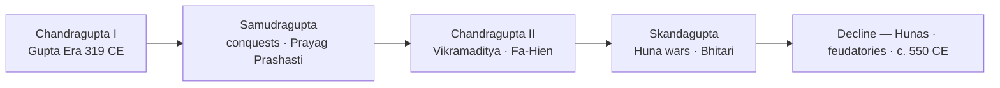
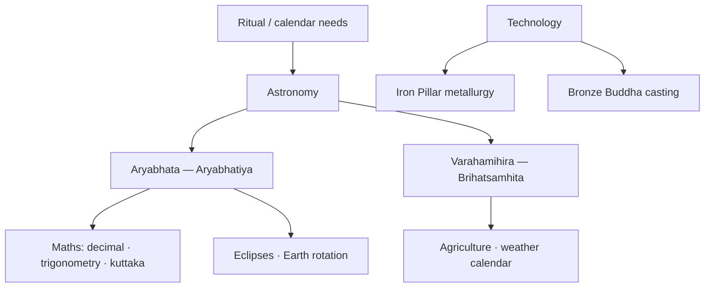

# Gupta Golden Age

> GS-1 · Topic 01 · Gupta period — Golden Age, literature, art, science

---

## PYQs

| Year | M | Words | Question (EN) | प्रश्न (HI) | ID |
|------|---|-------|---------------|-------------|-----|
| 2022 | 8 | 125 | Discuss why the Gupta period is regarded as the Golden Age of ancient India. | गुप्त काल को प्राचीन भारत का स्वर्ण युग क्यों माना जाता है? विवेचना कीजिए। | Q1 |
| 2021 | 8 | 125 | Discuss the scientific achievements during the Gupta period. | गुप्त काल में विज्ञान की उपलब्धियों की विवेचना कीजिए। | Q2 |

---

## Quick Revision

```
PERIOD: c. AD 275–550 | Gupta Era starts AD 319–20 (Chandragupta I)
RULERS: Chandragupta I → Samudragupta → Chandragupta II (Vikramaditya) → Skandagupta (last great)

POLITY: North India reunified | Prayagraj centre | Allahabad Pillar Inscription (Samudragupta, Harisena)
  Fa-Hien (399–414 CE) — Buddhist monasteries, prosperous Magadha under Chandragupta II
  Skandagupta — repelled Hunas | Bhitari inscription (defence against Hunas)

GOLDEN AGE = Art + Literature + Science + Classical Sanskrit + Religion (NOT full economic golden age)
  Kalidasa (Shakuntala, Meghaduta, Raghuvamsha) | Vishakhadatta (Mudrarakshasa) | Shudraka (Mrichchhakatika)
  Puranas compiled | Kamasutra (Vatsyayana) | Amarasimha (Amarakosha lexicon)

ART: Ajanta paintings (Gupta phase 5th–6th c.) | Sarnath/Mathura Buddha | Deogarh temple (early Nagara)
  Samudragupta on coin playing veena | Gupta dinara — gold coins (king + Lakshmi, horse/sash type)
  Amaravati (Andhra narrative relief) · Gandhara (Greco-Buddhist) — contemporary parallel schools

SCIENCE: Aryabhata (Aryabhatiya, c. 499 CE) — decimal, place value, eclipses, Earth rotation
  Varahamihira (Brihatsamhita, Panchasiddhantika) — astronomy, agriculture, weather
  Iron Pillar (Delhi, Mehrauli, 4th c.) — rust-resistant metallurgy | Nalanda (5th c. foundation)

FEUDALISM: Brahmadeya · agrahara · devadana land grants | Vishti (forced labour)
  Sati inscriptions (c. 510 AD, Eran) | RS Sharma — town/trade decline, emerging feudalism

DECLINE: Hunas after Skandagupta | Maukharis (Kanauj) · Pushyabhutis break away | c. 550 CE fragmentation

CONTEMPORARY: Ajanta UNESCO 1983 | Nalanda University revival (international) | NEP 2020 IKS
  ISRO Aryabhata satellite (1975) | Iron Pillar ASI protected | Art 49/51A(f) heritage duty
  Gupta dinara in National Museum · Sarnath ASI site museum

TRAPS: Golden age ≠ only politics/military | Aryabhata ≠ invented zero alone
  Sarnath ≠ Mathura style | Skandagupta ≠ founder | Gupta dinara ≠ punch-marked coins
  Fa-Hien ≠ Ashoka period | Bhitari = Skandagupta not Samudragupta | Vishwaguru = separate file (08)
```

---

## Content

### Context — period and political background

The **Gupta Empire** (c. **AD 275–550**) reunified **north India** after centuries of post-Mauryan fragmentation when Shungas, Kushans, and Satavahanas had declined by the mid-3rd century AD. The **Gupta Era** begins **AD 319–20** under **Chandragupta I**, who consolidated power through a marriage alliance with **Lichchhavi** princess **Kumaradevi** — a union celebrated on gold coins that survive as material proof of Gupta legitimacy. The empire's core lay in **eastern UP and Bihar** — **Prayag (Prayagraj)**, Magadha, and Pataliputra — expanding into Malwa, Gujarat, and Bengal fringes under **Samudragupta** and **Chandragupta II**. Historians debate Gupta origin (Vaishya title versus claimed Kshatriya lineage in inscriptions), but the political outcome is clear: a north Indian empire that patronised Sanskrit culture, Brahmanical religion, and Buddhist monasticism simultaneously. Prayagraj pillar, Sarnath Buddha, Bhitari inscription near Varanasi, Aryabhata's Pataliputra base, and a **448 AD** decimal inscription in the Prayagraj region anchor the Gupta story firmly in the Gangetic heartland.

| Ruler | Reign / period | Significance |
|-------|----------------|--------------|
| **Chandragupta I** | c. 319–335 CE | Founded Gupta Era; Lichchhavi alliance; expanded Magadha base |
| **Samudragupta** | c. 335–375 CE | Greatest conqueror — **Allahabad Pillar Inscription** (Prayag Prashasti) by **Harisena**; veena-player on coins; Ashvamedha type coins |
| **Chandragupta II (Vikramaditya)** | c. 375–415 CE | Peak — **Ujjain** second capital; **Navaratnas** tradition; **Fa-Hien** visited; defeated Shakas (Malwa, Gujarat) |
| **Skandagupta** | c. 455–467 CE | Last great ruler — repelled **Huna** invasions; **Bhitari inscription** records defence; fiscal strain begins |
| **Later Guptas** | Post-467 CE | Weakened empire; feudatories (**Maukharis**, **Pushyabhutis**) break away |



### Skandagupta, Hunas, and Bhitari inscription

The **Hunas** (Hephtalites) invaded northwest India in the **mid-5th century CE**, threatening Gupta frontiers after the empire's peak under Chandragupta II and exploiting the weakening of Kushan buffer states. **Skandagupta** (c. **455–467 CE**) was the last capable Gupta emperor; he **repelled Huna attacks** but at heavy cost to treasury and administration — some of his coins carry the reverse legend **"Kritartha"** (satisfied/accomplished), possibly commemorating victory. The **Bhitari inscription** (near **Varanasi**, Ghazipur district, UP) — a pillar inscription of Skandagupta — describes **defence against Hunas** and restoration of dharma, providing crucial epigraphic evidence for the late Gupta military crisis. After Skandagupta's death, **repeated Huna pressure**, loss of western provinces including Malwa and Gujarat fringes, and **feudatory independence** accelerated political decline toward c. 550 CE fragmentation.

### Why "Golden Age" — cultural high point

The Gupta period earns the title **Golden Age of ancient India** primarily for **culture, not uniform economic prosperity**. Political reunification under capable rulers created conditions for patronage of literature, art, science, and religion on a scale north India had not seen since the Mauryas. Classical **Sanskrit** matured into ornate, refined prose and poetry. Sculpture reached peaks in stone and bronze; **Ajanta** frescoes and Buddha images from **Sarnath** and **Mathura** define Gupta aesthetic classicism. Early **Nagara** brick and stone temples at **Deogarh** and **Bhitargaon** established the temple vocabulary that would dominate north India for a millennium. **Aryabhata** and **Varahamihira** advanced astronomy and mathematics; **Gupta dinara** gold coins reflect court prosperity; and **Nalanda Mahavihara** (c. 5th century CE foundation) became a great Buddhist intellectual centre.

| Domain | Achievements | Named examples |
|--------|--------------|----------------|
| **Literature** | **Classical Sanskrit** matures — ornate, refined prose/poetry | **Kalidasa**, Vishakhadatta, Shudraka, Puranas |
| **Art** | Peak sculpture (stone/bronze); **Ajanta** frescoes; Buddha images | **Sarnath, Mathura** schools |
| **Architecture** | Early **Nagara** brick/stone temples | **Deogarh, Bhitargaon** |
| **Science & maths** | **Aryabhata, Varahamihira**; decimal/place-value; astronomy | *Aryabhatiya*, *Brihatsamhita* |
| **Religion** | **Bhagavatism/Vaishnavism** under royal patronage; Buddhism strong | **Nalanda**, Fa-Hien's account |
| **Coins** | **Gupta dinara** — gold coins reflecting court prosperity | Samudragupta lyrist, Lakshmi reverse |
| **Music & court culture** | Samudragupta as **veena-player** on coins; Navaratnas tradition | Court at Ujjain/Pataliputra |

**Navaratnas** (tradition at Chandragupta II's court) include **Kalidasa** (*Abhijnanashakuntala*, *Meghaduta*, *Raghuvamsha*, *Kumarasambhava*) and, in court tradition, **Amarasimha** (*Amarakosha* lexicon), **Dhanvantari** (medicine), **Varahamihira** (astronomy), **Vararuchi**, **Shanku**, **Vetala Bhatta**, **Ghatakarpara**, and **Kshapanaka**. **Vishakhadatta** composed *Mudrarakshasa* (political drama on Chandragupta Maurya and Chanakya, written in Gupta-era composition). **Shudraka** wrote *Mrichchhakatika* (social drama). Major **Puranas** received compilation or redaction during the Gupta age across Vishnu, Shiva, and Bhagavata traditions. **Vatsyayana's Kamasutra** — a treatise on erotics and social conduct — belongs to this broad cultural milieu.

### Gupta art — sculpture and painting

Gupta sculpture refined two major Buddha schools that express different spiritual aesthetics through the same material — sandstone. The **Mathura school** (UP), continuing Kushan-Gupta continuity in **red sandstone**, produces robust, fuller-bodied figures with transparent clinging robes and less introspective faces — **Mathura = volume and vitality**. The **Sarnath school** (near Varanasi), working in fine-grained **Chunar sandstone**, achieves **slender, graceful** proportions with **sheer diaphanous sanghati** creating a "wet drapery" effect, **serene spiritualised** expressions with downcast eyes and subtle smiles, and refined halos with **dharmachakra** on the pedestal — **Sarnath = spiritual serenity**, the classic Gupta icon preserved in the Sarnath museum.

| Feature | **Mathura school** | **Sarnath school** |
|---------|-------------------|-------------------|
| **Region** | **Mathura** (UP) — Kushan-Gupta continuity | **Sarnath** (near Varanasi) — Gupta refinement |
| **Material** | **Red sandstone** | **Chunar sandstone** (fine-grained) |
| **Form** | Robust, fuller body; earlier Kushan influence | **Slender, graceful** proportions |
| **Drapery** | Transparent clinging robe; folds less refined | **Sheer diaphanous sanghati** — "wet drapery" effect |
| **Face/expression** | Less introspective | **Serene, spiritualised** — downcast eyes, subtle smile |
| **Halos/pedestal** | Lotus pedestal common | Refined halo; **dharmachakra** on pedestal |
| **Peak example** | Standing Buddha, Mathura museum | **Sarnath Buddha** (Sarnath museum) — classic Gupta icon |

**Ajanta** preserves the majority of surviving Gupta-phase paintings (5th–6th century) — narrative Jataka scenes with refined line and colour in Caves 1, 2, 16, and 17; the site is a **UNESCO World Heritage Site (1983)**. The **Iron Pillar of Delhi** (Mehrauli, 4th century CE) — seven metres of rust-resistant wrought iron, possibly associated with Chandragupta II (debated) — stands as **ASI-protected** proof of Gupta metallurgical mastery alongside bronze Buddha casting at Sarnath.

### Contemporary art context — Amaravati and Gandhara

Gupta north India did not monopolise subcontinental art. **Amaravati** (Andhra, Satavahana-Gupta phase) produced **narrative relief sculpture** on stupas with dynamic figures and floral motifs — a regional Andhra idiom contemporary with Gupta zenith but geographically distinct. **Gandhara** (northwest) developed **Greco-Buddhist** art showing Buddha in **Greek robe** with wavy hair and realistic folds during Kushan-Gupta overlap, demonstrating **pan-Indian Buddhist art diversity** during the same broad period. Recognising these parallel schools prevents overstating "Gupta art = all India" while confirming the Gupta age as a continent-wide moment of artistic vitality.

### Gupta dinara — coins

The **Gupta dinara** is the **gold coin** of Gupta emperors and marks a high point of ancient Indian coinage artistry, displayed today in the **National Museum, New Delhi** and **State Museum Lucknow**. Types include the **Standard type** (king standing, casting incense on altar), **Archer type** of Samudragupta (king with bow), **Ashvamedha type** commemorating horse sacrifice, **Lyrist type** showing Samudragupta playing **veena**, **Tiger-slayer/Lion-slayer** types, and **Chandragupta II** horseman/sash types. Reverse sides often depict **Lakshmi** seated on lotus — goddess of prosperity and symbol of Vaishnava imperial patronage. These coins reflect **elite prosperity**, royal ideology of conquest and sacrifice, and **controlled minting** — fundamentally different from earlier **punch-marked** silver coins of the Mahajanapada age.

### Fa-Hien's account (foreign corroboration)

Chinese pilgrim **Fa-Hien** visited India **AD 399–414** during **Chandragupta II's** reign, travelling through Pataliputra, Tamralipti, and the Ujjain region. He describes **prosperous Magadha**, flourishing Buddhist monasteries, relatively mild punishments, and active religious life; he notes the **absence of capital punishment** (accuracy debated). Fa-Hien provides external validation of Gupta **cultural-religious vitality** — not a detailed political chronicle, but a complementary witness to Indian epigraphic sources confirming that the empire's peak coincided with visible monastic prosperity and ordered social life.

### Scientific achievements (Gupta period)

Gupta science combined indigenous astronomical tradition with mathematical rigour and practical metallurgy, driven by ritual calendar needs, land measurement, and state administration. **Aryabhata** (c. **AD 476–500**, Pataliputra) composed **Aryabhatiya** (c. 499 CE) in 121 stanzas covering mathematics and astronomy. In mathematics he worked with the **decimal system**, **place-value** notation, trigonometry including sine tables (*jya*), area of triangle calculations, and the **kuttaka** method for linear indeterminate equations. In astronomy he proposed Earth's **rotation** on its axis, explained **eclipses** through shadow theory, calculated planetary periods, and estimated Earth's circumference at approximately **39,968 km** — remarkably close to modern measurement. Aryabhata used zero as placeholder and decimal notation but **did not alone "invent" zero**, which evolved from the 2nd century BCE onward through a long developmental process.

**Varahamihira** (6th century) authored **Brihatsamhita** and **Panchasiddhantika**, synthesising **Greek/Romaka** and indigenous siddhantas. He offered **heliocentric hints** (Earth revolves around Sun; Moon around Earth), classified plants and animals, developed **agricultural calendars**, predicted weather and seasons, advised on village site selection, and attempted earthquake prediction — applied science embedded in state and society.

| Area | Gupta achievement | Evidence |
|------|-------------------|----------|
| **Metallurgy** | **Iron Pillar of Delhi** — corrosion-resistant; large bronze Buddha images | ASI Mehrauli site; Sarnath casting |
| **Medicine** | Continued **Charaka-Sushruta** tradition; surgery, herbal pharmacopoeia | Dhanvantari in Navaratnas tradition |
| **Chemistry/crafts** | High-quality steel references; purple dye/silk trade | Roman silk learning c. 550 CE |
| **Astronomical tables** | **Romaka Siddhanta** — Greco-Roman influence acknowledged | Varahamihira's Panchasiddhantika |
| **Inscriptions** | **448 AD** Prayagraj area inscription — evidence of **decimal notation** | Epigraphic record |

**Nalanda Mahavihara** (c. **5th century CE** foundation under Gupta patronage) functioned as a great Buddhist **monastic university** attracting international students in logic, grammar, and Buddhist philosophy — part of the Gupta intellectual landscape and revived today as **Nalanda University** (21st-century international campus in Rajgir, Bihar).



### Land grants, feudalism, and social strains

Parallel to cultural brilliance, Gupta society experienced structural strains that historians such as **RS Sharma** interpret as early feudalisation. The crown transferred land and revenue rights through three main grant types. **Brahmadeya** gifted land to Brahmanas, often tax-free, creating Brahmana settlements with local authority. **Agrahara** granted entire villages or tracts with revenue rights to donees who collected taxes directly. **Devadana** assigned land to temples, making temples themselves landholders and economic centres. Each grant diverted revenue from the centre to local intermediaries, weakening central control — the **feudal trend** that marks transition toward early medieval polities.

**Vishti** — **forced labour** extracted from peasants for royal and public works — appears in Gupta inscriptions including **Eran**, signalling **peasant burden** that contradicts narratives of uniform prosperity. **Sati** receives its **earliest inscriptions** from **c. 510 AD** at **Eran** (Madhya Pradesh), indicating **hardening patriarchal norms** in the late Gupta phase. Women's status faced further restrictions in law and practice despite royal visibility — **Kumaradevi** appears on coins but general social equality did not follow.

| Term | Meaning | Effect |
|------|---------|--------|
| **Brahmadeya** | Land **gifted to Brahmanas** — often tax-free | Brahmana settlements; local authority |
| **Agrahara** | **Brahmana village/grant** — entire village or tract with revenue rights | Donees collect revenue; central state weakens |
| **Devadana** | Grants to temples — temple as landholder | Temple economies; priestly power |

### Limits of "Golden Age" label

Calling the Gupta period a Golden Age requires nuance. It was **not golden for the entire economy** — several **towns declined** (Pataliputra, Shravasti debated); **long-distance trade reduced** compared to the Kushan-Roman peak; archaeology records urban decay in some regions. **Emerging feudalism** through brahmadeya and agrahara grants, combined with **vishti** and peasant exploitation in the later Gupta phase, diverted revenue from the imperial centre. **Political decline** after Skandagupta — **Huna** invasions documented in the **Bhitari inscription**, feudatory independence of Maukharis and later Guptas of Magadha — ended north Indian unity by c. 550 CE. The label applies most accurately as a **cultural golden age** with **economic and political caveats** — analytical precision that honours both achievement and inequality.

### Decline of Gupta empire — factors

| Factor | Detail |
|--------|--------|
| **Huna invasions** | Repeated attacks after mid-5th c.; Skandagupta repulsed but empire weakened |
| **Feudatory breakaway** | Maukharis (Kanauj), Pushyabhutis, later Guptas of Magadha assert independence |
| **Land grants** | Revenue diverted to donees — fiscal base of centre eroded |
| **Administrative strain** | Large empire difficult to govern with growing local autonomy |
| **No strong successor** | Post-Skandagupta rulers unable to restore unity |

The empire **fragmented by c. 550 CE**, ushering north India into the **early medieval regional kingdom** phase under Harsha, Maukharis, and later Guptas — yet Gupta cultural forms persisted as the **"classical" benchmark** for subsequent dynasties.

### Mauryan vs Gupta comparison

| Aspect | Mauryan | Gupta |
|--------|---------|-------|
| **Empire** | First all-India scale | North India reunification |
| **Art** | Pillars, stupas, polish | Sculpture, temples, paintings |
| **Economy** | State-led, trade peak | Elite prosperity; town decline debate |
| **Religion** | Buddhist imperial (Ashoka) | Hindu revival + Buddhist centres |
| **Science** | Sulva geometry, statecraft | Aryabhata astronomy/maths |
| **Coins** | Punch-marked/pan-Mauryan | **Gupta dinara** gold |
| **Foreign account** | Megasthenes (Greek) | Fa-Hien (Chinese) |

### Significance and legacy

The Gupta age defined the **classical Indian civilizational template** — Sanskrit culture, Puranic Hinduism, Nagara temple idiom, and scientific texts referenced for centuries in India, Tibet, and Southeast Asia. Prayagraj pillar, eastern UP-Bihar heartland, Aryabhata and decimal inscriptions, Sarnath Buddha (ASI museum), Bhitari inscription, and Mathura school anchor the period in the Gangetic region. Gupta culture bridged toward **Harsha** (7th century) and early medieval kingdoms, but its forms remained the **classical standard** against which later art and literature measured themselves.

### Contemporary relevance

**Ajanta Caves (UNESCO 1983)** preserve Gupta-phase paintings as global heritage; conservation science including humidity control and pigment analysis links ancient art to modern **materials research** under **NEP 2020 IKS**. ASI protects **Sarnath** (site museum), **Iron Pillar (Mehrauli)**, **Deogarh temple**, and **Allahabad/Prayagraj pillar** under the **Ancient Monuments and Archaeological Sites and Remains Act, 1958**. **Article 49** directs state protection of monuments; **Article 51A(f)** makes heritage preservation a citizen duty. **NEP 2020 IKS** integrates Aryabhata's astronomy, Kalidasa's literature, and Gupta art history into curriculum, connecting classical achievement to contemporary **innovation identity**. **ISRO's Aryabhata satellite (1975)** — India's first satellite — names the Gupta mathematician-astronomer, symbolising science heritage flowing into the space programme. **Nalanda University revival** at **Rajgir, Bihar** (2010 onward) echoes Gupta-era **Nalanda Mahavihara** as a knowledge hub. Gupta **dinara** coins, Sarnath Buddha, and Ajanta copies in **National Museum Delhi** and **State Museum Lucknow** support heritage tourism under **Incredible India**. Critical balance remains essential: celebrate Gupta achievements while acknowledging **RS Sharma's feudalism thesis** and social inequalities — heritage pride must not erase **vishti, sati, and caste hierarchy** of the same period.

---

## Answers

### Q1: Discuss why the Gupta period is regarded as the Golden Age of ancient India. (2022, 8M, 125W)

**Opening:**
> The Gupta period (c. 4th–6th c. CE) is hailed as ancient India's Golden Age for unparalleled achievements in literature, art, science, and classical Sanskrit culture under imperial patronage — though the label applies chiefly to culture, not the entire economy.

**Write these points:**
- **Political unity** under Chandragupta I, **Samudragupta**, and **Chandragupta II (Vikramaditya)** reunited north India — **Allahabad Pillar Inscription** and **Fa-Hien** attest prosperity and Buddhist flourishing at peak.
- **Literature:** **Kalidasa** (*Shakuntala*, *Meghaduta*), Vishakhadatta (*Mudrarakshasa*), Puranic compilation — **classical Sanskrit** reaches refinement; **Navaratnas** tradition at Vikramaditya's court.
- **Art & architecture:** **Ajanta** paintings (UNESCO 1983); **Sarnath** (serene Buddha) and **Mathura** (robust Buddha) sculpture peaks; **Deogarh** early Nagara temple; **Gupta dinara** coins with royal/cultural motifs (veena-playing Samudragupta).
- **Science & institutions:** **Aryabhata** and **Varahamihira** advanced astronomy and mathematics; **Iron Pillar** demonstrates metallurgical mastery; **Nalanda** (5th c.) as intellectual centre (revived as international university today).
- **Caveat:** RS Sharma notes **economic limits** — urban/trade decline, **brahmadeya/agrahara** feudal grants, **vishti**, late **sati** inscriptions — "golden" applies chiefly to **culture and learning**.

**Conclusion:**
> Thus the Gupta Golden Age marks the classical zenith of ancient Indian civilization — artistic and intellectual brilliance within a politically unified north India, though not without economic, social, and later political strains.

---

### Q2: Discuss the scientific achievements during the Gupta period. (2021, 8M, 125W)

**Opening:**
> Gupta-period science combined indigenous astronomical tradition with mathematical rigour and practical metallurgy — best exemplified by Aryabhata and Varahamihira, supported by inscriptions and technological monuments.

**Write these points:**
- **Aryabhata** (*Aryabhatiya*, c. 499 CE): **decimal and place-value** system, trigonometry, area calculations; astronomy — **Earth's rotation**, **eclipse theory**, planetary periods, Earth circumference measurement.
- **Varahamihira** (*Brihatsamhita*, 6th c.): synthesised Greek and Indian astronomy in *Panchasiddhantika*; **heliocentric hints**; agricultural calendars, weather science, plant/animal classification for farming.
- **Technology:** **Iron Pillar of Delhi** (4th c.) — extraordinary **rust-resistant** iron (ASI protected); advanced **bronze** casting for Buddha images; Sulva tradition evolved into applied geometry.
- **Institutional context:** **Nalanda** and monastic centres fostered logic, grammar, medicine (Charaka-Sushruta legacy); **448 AD inscription** (Prayagraj region) confirms decimal usage.
- Science served **ritual calendars, tax/land measurement, temple building** — theory linked to state and society; legacy continues in **ISRO Aryabhata satellite** and **NEP 2020 IKS** curriculum.

**Conclusion:**
> Gupta science thus stands as a high watermark of ancient Indian rational inquiry — especially in astronomy and mathematics — whose texts influenced later Indian and Asian scholarship.

---

### Q3: Discuss the decline of the Gupta empire. (Future PYQ, 8M, 125W)

**Opening:**
> After the reign of Skandagupta, the Gupta empire entered a phase of political fragmentation driven by external invasions, fiscal strain, and internal feudalisation — ending north Indian unity by c. 550 CE.

**Write these points:**
- **Huna invasions:** **Hephtalite (Huna)** pressure from northwest from mid-5th c.; **Skandagupta** repelled them (recorded in **Bhitari inscription**) but at great cost — treasury and military exhausted.
- **Weak later rulers:** Post-Skandagupta emperors could not restore authority; **western and central provinces** lost; defensive posture replaced Samudragupta's expansionism.
- **Feudatory independence:** **Maukharis** (Kanauj), **Pushyabhutis**, and **later Guptas of Magadha** broke away — empire devolved into **regional kingdoms**.
- **Land grants and fiscal erosion:** **Brahmadeya/agrahara** grants transferred revenue to priests and temples — central state income declined; **vishti** (forced labour) signalled peasant distress.
- **Legacy:** Fragmentation paved way for **Harsha** and early medieval polities — but **classical cultural template** (Sanskrit, art, science) of Gupta age endured in **Ajanta, Sarnath, Aryabhatiya**.

**Conclusion:**
> The Gupta decline was thus political and fiscal rather than cultural — the Golden Age's intellectual and artistic legacy outlasted the empire that had patronised it.

---

## Traps

| Wrong | Correct |
|-------|---------|
| Golden Age = only military conquests | **Culture** — literature, art, science, Sanskrit |
| Gupta economy uniformly prosperous | **Town/trade decline** debated — cultural, not full economic, golden age |
| Aryabhata invented zero alone | **Decimal/place-value** user; zero evolved over centuries |
| Varahamihira wrote Aryabhatiya | **Aryabhata** = Aryabhatiya; **Varahamihira** = Brihatsamhita |
| Fa-Hien came during Ashoka | **Gupta age** — Chandragupta II (399–414 CE) |
| Gupta art = only Hindu | **Buddhist** Ajanta, Sarnath Buddha equally iconic |
| Sarnath Buddha = same as Mathura | **Sarnath** = serene/spiritual; **Mathura** = robust/volumetric |
| Iron Pillar = Mauryan Ashoka | **Gupta-period** metallurgy (c. 4th c. CE), Delhi Mehrauli |
| Skandagupta founded Gupta Era | **Chandragupta I** (319–20 CE); Skandagupta = **last great** ruler |
| Gupta coins = punch-marked | **Gupta dinara** = **gold** imperial coins; punch-marked = earlier age |
| Land grants strengthened central state | **Brahmadeya/agrahara** = **feudal trend** — revenue to local donees |
| Bhitari inscription = Samudragupta | **Bhitari** = **Skandagupta** — Huna defence |
| Allahabad Pillar = Skandagupta | **Prayag Prashasti** = **Samudragupta** (by Harisena) |
| Gupta science = same as 09 Scientific Heritage file | This file = **Gupta period only**; 09 = broader Indian heritage science |

---

*Complete.*
