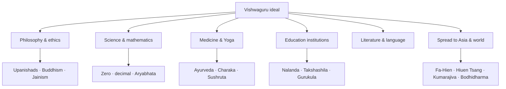

# Ancient Indian Knowledge & Vishwaguru

> GS-1 · Topic 01 · Ancient knowledge tradition and India as Vishwaguru

---

## PYQs

| Year | M | Words | Question (EN) | प्रश्न (HI) | ID |
|------|---|-------|---------------|-------------|-----|
| 2022 | 8 | 125 | Discuss the contribution of ancient Indian knowledge tradition in establishing India as Vishwaguru. | विश्वगुरु के संदर्भ में प्राचीन भारतीय ज्ञान परंपरा के योगदान की विवेचना कीजिए। | Q1 |

---

## Quick Revision

```
VISHWAGURU = "World teacher" — India as civilizational knowledge exporter, not only military/economic power
  Modern use: NEP 2020 IKS · yoga diplomacy · Nalanda revival · diaspora soft power

ANCIENT PILLARS:
  Philosophy: Upanishads (Atman-Brahman) | Buddhism/Jainism (ahimsa, anekantavada)
    Vasudhaiva Kutumbakam | Charvaka/Lokayata (materialist diversity)
  Science: Zero · decimal · Aryabhata · Varahamihira | Iron Pillar metallurgy | Sulvasutra geometry
  Numerals: India → Arabs (Al-Khwarizmi, c. 873 CE) → Europe (Fibonacci, 13th c.)
  Medicine: Ayurveda (Charaka, Sushruta) | Yoga (Patanjali) · meditation
  Education: Gurukula | Nalanda · Takshashila — Dvarapandita admission debate test
  Literature: Sanskrit · Panini Ashtadhyayi | epics · Puranas · Kalidasa
  Statecraft: Arthashastra (Kautilya)

CARRIERS: Kumarajiva · Bodhidharma · Fa-Hien · Hiuen Tsang · I-tsing
  Spread: Buddhism → Sri Lanka, China, Japan, SE Asia | Suvarnabhumi · Angkor Indianisation

SE ASIA: Suvarnabhumi (Mainland SE Asia) · Suvarnadvipa (Indonesia) · Angkor Wat · Sri Vijaya
  Sanskrit inscriptions · Ramayana traditions · temple cosmology

CONTEMPORARY: NEP 2020 IKS (curriculum integration) | International Day of Yoga (21 June, UN 2014)
  Nalanda University revival (Rajgir) | AYUSH ministry | GI tags (yoga, handloom, Ayurveda herbs)
  UNESCO: Yoga intangible heritage discourse | Art 49/51A(f) | PRASAD/Swadesh Darshan Buddhist circuit
  ISRO Aryabhata satellite | CSIR manuscript digitisation

BALANCED: Past glory + modern science | caste/gender limits | Vishwaguru = critical revival not slogan
  RS Sharma — cultural brilliance coexisted with inequality

TRAPS: ≠ only Gupta (07) | ≠ only science (09) | Zero ≠ single inventor | Nalanda ≠ Hindu-only
  Arabic numerals ≠ Arab invention | Kumarajiva = Indian/Kuchean monk | Bodhidharma = Indian not Chinese
```

---

## Content

### Context — what Vishwaguru means

**Vishwaguru** (विश्वगुरु) expresses the ideal of India as **world teacher** — a civilisation that shared knowledge, ethics, and wisdom with humanity across borders and centuries, not merely through military or economic dominance. The concept rests on documented **ancient Indian knowledge export**: philosophy from the Upanishads through Buddhism and Jainism; science including zero, decimal notation, and Aryabhata's astronomy; medicine through Ayurveda and yoga; formal education at Nalanda and Takshashila; and spiritual traditions that reached **Asia, the Arab world, and eventually Europe**. From **Vedic-Upanishadic** metaphysics through **Buddhist missionary expansion**, **Ayurveda and yoga**, **mathematical numerals**, and **university-scale institutions**, India functioned as a **knowledge civilisation** long before modern nation-states existed. Contemporary usage through **NEP 2020**, cultural diplomacy, and the **International Day of Yoga** invokes continuity between ancient heritage and 21st-century **soft power** — but the historical claim must rest on **specific ancient contributions** understood with critical balance, not slogan alone.

### Pillars of ancient Indian knowledge tradition

Ancient India's knowledge export rested on six interconnected pillars — philosophy, science, medicine, education, literature, and transcontinental spread — each producing transferable ideas that other civilisations could adopt, translate, and develop.



### Philosophy, ethics, and religion

The **Upanishads** (c. 8th–5th century BCE onward) established metaphysical foundations — **Atman, Brahman, karma, moksha** — that influenced Hindu, Buddhist, and Jain thought alike; texts such as **Isha, Katha, and Chandogya** remain central references. **Buddhism** exported **ahimsa**, the middle path, dependent origination, and logic (**pramana** theory) as **India's gift to Asia** — from Sri Lanka through Ashokan missions to China, Japan, Tibet, and Southeast Asia. **Jainism** contributed non-violence, **anekantavada** (multiplicity of truth), and **syadvada** (conditional predication) — ethical rigour that later influenced Gandhi's non-violence. **Charvaka/Lokayata** materialism, accepting only perception as valid knowledge, demonstrates **intellectual diversity** rather than monolithic orthodoxy. **Vasudhaiva Kutumbakam** ("the world is one family") from the **Maha Upanishad** articulates a civilizational ethic of global harmony — though social inequalities coexisted alongside this ideal.

| Tradition | Core teaching | Global reach |
|-----------|---------------|--------------|
| **Upanishadic** | Atman-Brahman unity, karma-moksha | Influenced neo-Vedanta, Western philosophers (Schopenhauer) |
| **Buddhist** | Ahimsa, middle path, meditation | Sri Lanka, China, Japan, Korea, Tibet, SE Asia |
| **Jain** | Anekantavada, ahimsa | Trade communities across India; ethical influence |
| **Charvaka** | Materialism, scepticism | Evidence of plural intellectual culture |

### Science, mathematics, and technology

Indian **zero and decimal place-value** numerals transformed global mathematics. The **Bakhshali manuscript** (c. 3rd–4th century CE) shows early zero use; the system enabled algebra, astronomy, and commerce at scales impossible with Roman numerals. Transmission followed the route **India → Arab world → Europe**: Arab scholars **Al-Fazari** and **Al-Khwarizmi** (c. **873 CE** and after) translated and applied Indian numerals in astronomical tables (*Zij al-Sindhind*); via Arabs, **"Arabic numerals"** reached Europe through **Fibonacci's Liber Abaci** (13th century) — actually **Indian origin**, a fact that must be stated precisely because the misnomer persists globally. **Aryabhata** (*Aryabhatiya*, c. 499 CE) advanced trigonometry, eclipses, and Earth's rotation; **Varahamihira** synthesised astronomy, calendars, and agriculture. **Sulvasutras** (Baudhayana, Apastamba) applied geometry to altar construction — practical engineering serving ritual needs. **Metallurgy** produced the rust-resistant **Iron Pillar of Delhi** and exported **Wootz steel** for Persian and Damascus swords. **Navigation** knowledge of monsoons (Arabic *mausim* from Sanskrit) linked Indian Ocean trade networks connecting **Suvarnabhumi** and **Suvarnadvipa**.

### Medicine, yoga, and wellness

**Ayurveda** — holistic health rooted in the **Atharvaveda** tradition — emphasises diet, cleanliness, and medicinal plants including **triphala** and **ashwagandha** (now GI and AYUSH focus). **Charaka Samhita** (internal medicine, c. 2nd century CE) and **Sushruta Samhita** (surgery, c. 2nd century CE) document **121 surgical instruments**, cataract treatment, and **rhinoplasty** — knowledge that later influenced European reconstructive surgery. **Yoga** as physical-mental-spiritual discipline appears in **Patanjali's Yoga Sutras** (c. 2nd century BCE–4th century CE) through **ashtanga yoga's** eight limbs. Today the **UN International Day of Yoga** (**21 June**, proclaimed **2014**, first observed 2015) represents global Vishwaguru export; the **AYUSH Ministry** (2014) institutionalises Ayurveda, yoga, unani, siddha, and homeopathy as living heritage systems.

### Education and learning institutions

The **Gurukula system** transmitted Vedic and classical knowledge through guru-shishya residential apprenticeship — oral, disciplined, and personalised over years rather than through mass classroom instruction. **Takshashila** (Taxila, Gandhara) functioned as an ancient centre of learning in polity, medicine, and grammar from c. **6th century BCE**, attracting international students; Chanakya/Kautilya is associated with it; destruction came c. 5th century CE during Huna invasions. **Nalanda Mahavihara** (Bihar, c. **5th century CE** foundation, peak under **Palas** 8th–12th century) operated as a **residential international university** teaching Buddhist philosophy, logic, grammar, medicine, and astronomy across subjects that a modern multidisciplinary university would recognise.

**Nalanda's Dvarapandita** admission system required entrants to defeat a gatekeeper scholar in **debate/logic** before entry — rigorous intellectual standard recorded by **Hiuen Tsang** and demonstrating that ancient Indian education valued argumentative competence over birth or wealth alone, at least within monastic contexts. **Varanasi (Kashi)** remained an ancient centre of **Sanskrit and philosophical debate** where later thinkers including Shankaracharya engaged adversarial scholarship; **Prayagraj** linked learning traditions to imperial courts from Gupta through later periods, showing how sacred geography and political patronage reinforced each other as knowledge hubs.

Why did these institutions matter for Vishwaguru? Because they were **exportable models** — Chinese, Tibetan, and Southeast Asian pilgrims did not merely visit India for relics; they came to study logic, medicine, and Buddhist philosophy under recognised masters and returned to establish scholastic traditions that persisted for centuries after Nalanda's destruction c. **1197 CE** by Bakhtiyar Khilji.

### Knowledge carriers — pilgrims, monks, translators

Individual carriers translated abstract knowledge into living cross-cultural exchange. **Fa-Hien** (4th–5th century CE), a Chinese monk, visited India during the **Gupta age**, recorded monasteries and Vinaya, and carried texts and practices back to China. **Hiuen Tsang (Xuanzang)** (7th century) studied at **Nalanda** under **Shilabhadra** and carried **657 Buddhist texts** to China for translation — a key primary source on Indian knowledge systems. **I-tsing** (7th century) studied at Nalanda and recorded monastic education, grammar, and Vinaya. **Kumarajiva** (344–413 CE), a **Kuchean-Indian** monk-scholar, translated **Mahayana sutras** into Chinese at Chang'an, bridging Indian philosophy and East Asian Buddhism. **Bodhidharma** (traditionally 5th–6th century CE), an Indian monk who travelled to **China**, is associated with **Chan/Zen** transmission of meditative knowledge. These figures prove India was not isolated — **active bidirectional knowledge flow** moved texts, methods, and teachers outward while Greek astronomy (Romaka Siddhanta) and Central Asian Buddhist schools flowed inward.

| Figure | Period | Role as knowledge carrier |
|--------|--------|---------------------------|
| **Fa-Hien** | 4th–5th c. CE | Chinese monk; visited India during **Gupta age**; recorded monasteries, Vinaya, Buddhist learning — took texts/practices back to China |
| **Hiuen Tsang (Xuanzang)** | 7th c. CE | Chinese pilgrim; studied at **Nalanda** under **Shilabhadra**; carried **657 Buddhist texts** to China; translated; key source on Indian knowledge |
| **I-tsing** | 7th c. CE | Chinese monk; studied at Nalanda; recorded monastic education, grammar, Vinaya |
| **Kumarajiva** | 344–413 CE | **Kuchean-Indian** monk-scholar; translated **Mahayana sutras** into Chinese at Chang'an — bridged Indian philosophy and East Asian Buddhism |
| **Bodhidharma** | trad. 5th–6th c. CE | Indian monk; travelled to **China**; associated with **Chan/Zen** transmission — Indian meditative knowledge to East Asia |

### Literature, language, and arts

**Sanskrit** reached scientific precision in **Panini's Ashtadhyayi** (c. 5th–4th century BCE) — a **generative grammar** with meta-rules admired by modern linguists and computer scientists. **Amarakosha** (Amarasimha) served as standard lexicon; classical literature including **Kalidasa**, epics, and Puranas spread with religion and trade. **Pali and Prakrit** carried Buddhist and Jain canonical texts to Sri Lanka and Southeast Asia. **Art and architecture** — Ajanta frescoes, Sarnath Buddha, Gandhara Greco-Buddhist sculpture, temple traditions — exported visual culture through Buddhism and Indian Ocean commerce. **Arthashastra** (Kautilya) on statecraft, economy, espionage, and welfare functions as early political science studied globally today.

### Southeast Asian Indianisation

**Indianisation** describes the spread of Sanskrit, Hindu-Buddhist ideas, art, law, and kingship models to Southeast Asia via **trade, monks, and emigrants** — not primarily military conquest. **Suvarnabhumi** ("Land of Gold") was the classical Indian name for **Mainland Southeast Asia** (Thailand, Myanmar, Cambodia region). **Suvarnadvipa** named the **Indonesia/Malay** archipelago. **Angkor Wat** (12th century, Cambodia) embodies Hindu-Buddhist temple architecture with Sanskrit inscriptions and Indian **Mount Meru** cosmology in urban planning. **Sri Vijaya** and **Funan** operated as Indianised maritime kingdoms; **Bali, Java, and Champa** preserve living Sanskrit-derived scripts and Ramayana/Mahabharata traditions. Southeast Asian Indianisation provides the strongest historical evidence for **Vishwaguru soft power** before modern diplomacy existed.

| Region / site | Indian knowledge influence |
|---------------|----------------------------|
| **Suvarnabhumi** ("Land of Gold") | Classical Indian name for **Mainland Southeast Asia** (Thailand, Myanmar, Cambodia region) — Buddhist-Hindu cultural zone |
| **Suvarnadvipa** | Indian name for **Indonesia/Malay** archipelago |
| **Angkor (Cambodia)** | **Angkor Wat** (12th c.) — Hindu-Buddhist temple architecture; Sanskrit inscriptions; Indian **Mount Meru** cosmology in urban planning |
| **Sri Vijaya, Funan** | Indianised maritime kingdoms — centres of Buddhist learning and trade |
| **Bali, Java, Champa** | Living Sanskrit-derived scripts, Ramayana/Mahabharata traditions, temple styles |

### Global spread — channels summary

| Channel | What spread | Direction |
|---------|-------------|-----------|
| **Buddhism** | Monasteries, art, Pali/Sanskrit texts | India → Central Asia, China, Korea, Japan, SE Asia |
| **Trade (Indian Ocean)** | Spices, textiles, numerals, ideas | India ↔ Suvarnabhumi/Suvarnadvipa |
| **Pilgrims & scholars** | Nalanda attracted Asian students | Bidirectional — also Greek astronomy into India |
| **Translators** | Kumarajiva, monks | Indian texts → Chinese/Tibetan |
| **Colonies & kingdoms** | Indianised states | Angkor, Sri Vijaya, Srivijaya maritime network |

### Significance — why Vishwaguru claim has historical depth

India was among the earliest civilisations to develop **formal grammar (Panini)**, **decimal mathematics**, **university-scale institutions (Nalanda)**, **surgical texts (Sushruta)**, and **missionary religions (Buddhism)** — all exportable knowledge forms rather than territorially bound achievements. What distinguishes Vishwaguru from mere nationalist pride is **documented transmission**: Indian numerals changed how the world calculates; Buddhist monastic networks changed how East Asia understood ethics and meditation; Ayurveda and yoga entered global wellness discourse; and Southeast Asian kingdoms adopted Sanskrit, temple cosmology, and Ramayana traditions as foundations of their own court cultures.

**Al-Biruni's Kitab-ul-Hind** (11th century) systematically recorded Indian sciences for the Islamic world, proving external recognition of Indian scholarly traditions by a rigorous observer who learned Sanskrit to access primary sources. **Colonial-era Orientalists** (Max Müller, Rhys Davids) translated Sanskrit and Pali, reviving global academic interest while carrying biases — yet confirming the **depth of ancient Indian knowledge archives** accessible to critical modern study. The Vishwaguru ideal thus rests not on isolation or superiority claims but on **demonstrable civilizational export** sustained over millennia through trade routes, pilgrim networks, and translation movements that other cultures acknowledged and incorporated.

### Contemporary relevance

**NEP 2020's Indian Knowledge Systems (IKS)** mandates integration of **Sanskrit, Ayurveda, yoga, astronomy, philosophy, and traditional crafts** into school and higher education — institutionalising Vishwaguru discourse into **curriculum reform** rather than rhetoric alone. The **International Day of Yoga (21 June)**, proclaimed by the UN General Assembly in **2014** and observed globally since **2015**, represents the largest soft-power export of ancient Indian **body-mind science**, led by the **AYUSH Ministry** and **Ministry of External Affairs** cultural diplomacy. **Nalanda University revival** at **Rajgir, Bihar** (2010 onward, Nalanda University Act 2010) pursues **educational diplomacy** echoing the ancient Mahavihara with partners including ASEAN nations, Australia, and China. The **AYUSH Ministry (2014)** provides policy framework for Ayurveda, yoga, unani, siddha, and homeopathy as **living heritage** health economies; the **WHO Traditional Medicine Strategy** recognises Ayurveda and yoga globally.

**UNESCO World Heritage** listing of **Ajanta/Ellora (1983)** and **Nalanda Mahavihara archaeological ruins (2016)** places ancient knowledge sites under global conservation. **Article 51A(h)** directs citizens to develop scientific temper; **51A(f)** to value composite culture; **Article 49** to protect monuments including Nalanda ruins, Sarnath, and Ajanta. **Swadesh Darshan** and **PRASAD** develop **Buddhist circuit, Krishna circuit, and Ramayana circuit** infrastructure — heritage knowledge routes as pilgrimage and tourism economies. **CSIR, IGNCA, and National Mission for Manuscripts** digitise Sanskrit and palm-leaf texts; **ISRO** named its first satellite **Aryabhata (1975)**, linking science heritage to space identity. **GI tags** on yoga-related wellness products, **Kashmir saffron, Darjeeling tea, and Banaras silk** connect living economic heritage to ancient knowledge systems. Vishwaguru is achievable in practice only if India invests simultaneously in **modern education, research, and equity** — ancient pride supports but cannot replace contemporary **STEM funding, social justice, and global collaboration**.

### Limits and balanced view

Ancient India also maintained **varna hierarchy, untouchability, gender discrimination, and sati** — the Vishwaguru ideal cannot claim a flawless social model. Many knowledge systems were **elite and brahmanical**, excluding shudras and women from formal Vedic education (with notable exceptions including Buddhist nuns and **Gargi Maitreyi** in Upanishadic dialogues). **Scientific claims** require precision — zero evolved over centuries; exaggeration that "India invented everything" undermines credibility as much as denial does. **Transmission was syncretic** — Indian astronomy absorbed **Greek (Romaka Siddhanta)** inputs; the Vishwaguru narrative must acknowledge **exchange**, not pure isolation. **RS Sharma's caution** remains valid: cultural brilliance coexisted with **economic inequality and feudal trends** in the late ancient period — Vishwaguru describes **intellectual leadership**, not uniform social utopia.

---

## Answers

### Q1: Discuss the contribution of ancient Indian knowledge tradition in establishing India as Vishwaguru. (2022, 8M, 125W)

**Opening:**
> The ideal of India as Vishwaguru rests on an ancient civilisation that exported philosophy, science, medicine, and learning across Asia — not merely military power but intellectual and ethical leadership sustained over millennia.

**Write these points:**
- **Philosophy & ethics:** Upanishadic thought, **Buddhism and Jainism** (ahimsa, anekantavada) spread to Sri Lanka, China, and Southeast Asia — India's earliest **soft power**; *Vasudhaiva Kutumbakam* speaks to global fraternity.
- **Science & medicine:** **Zero/decimal** (India → Arabs **873 CE** → Europe), Aryabhata's astronomy, Ayurveda (Charaka-Sushruta), **yoga** (Patanjali) — practical knowledge systems with lasting global impact.
- **Education & carriers:** **Nalanda** (Dvarapandita admission) and **Takshashila** attracted international scholars; **Fa-Hien, Hiuen Tsang, Kumarajiva, Bodhidharma** carried Indian knowledge to East Asia.
- **Indianisation:** **Suvarnabhumi, Angkor Wat** — Sanskrit, Buddhism, temple art spread to Southeast Asia — civilizational export beyond borders through trade and monks, not conquest alone.
- **Contemporary link:** **NEP 2020 IKS**, **International Day of Yoga (UN 2014)**, AYUSH, **Nalanda University revival**, **PRASAD Buddhist circuit** — with **balance** on social exclusions and need for modern scientific excellence.

**Conclusion:**
> Ancient Indian knowledge thus provides historical depth to the Vishwaguru vision — a civilisation that taught the world, provided its foundations are renewed with equity and contemporary innovation.

---

### Q2 (Future variant): Examine the role of Nalanda as a knowledge hub in ancient India. (8M, 125W)

**Opening:**
> Nalanda Mahavihara was among the world's earliest residential international universities — a knowledge hub where Indian learning attracted scholars from across Asia for nearly seven centuries.

**Write these points:**
- **Institutional scale:** C. **5th–12th c. CE**; thousands of monks; subjects included **Buddhist philosophy, logic (pramana), grammar, medicine, astronomy**.
- **International character:** Chinese pilgrims **Fa-Hien, Hiuen Tsang, I-tsing** studied/recorded Nalanda — proof of **global pull**; **Shilabhadra** as Hiuen Tsang's teacher.
- **Admission rigour:** **Dvarapandita** (gate scholar) tested entrants through **debate** — only the intellectually qualified entered; model of merit-based access.
- **Knowledge export:** Texts and teachers from Nalanda shaped **Tibetan, Chinese, Southeast Asian** Buddhist scholastic traditions; destroyed c. **1197 CE** (Bakhtiyar Khilji).
- **Legacy:** **UNESCO World Heritage (2016)** for archaeological ruins; revived as **Nalanda University** (Rajgir) — symbol of India's **educational diplomacy** and NEP 2020 IKS.

**Conclusion:**
> Nalanda embodied ancient India's role as Vishwaguru — a hub where knowledge crossed borders through rigorous scholarship, not conquest.

---

### Q3 (Future variant): How did ancient Indian numerals and mathematics contribute to global knowledge? (8M, 125W)

**Opening:**
> Ancient Indian numerals — especially zero and decimal place-value — represent one of India's most transformative global knowledge exports, enabling modern arithmetic, algebra, and astronomy worldwide.

**Write these points:**
- **Indian innovations:** **Zero (sunya)** as placeholder and number (c. 2nd c. BCE onward); **decimal place-value** system in **Aryabhatiya** and 448 AD inscriptions; **Baudhayana Sulvasutra** geometry.
- **Transmission:** **India → Arab scholars (Al-Khwarizmi, c. 873 CE) → Europe (Fibonacci, 13th c.)** — misnamed "Arabic numerals" are **Indian origin**.
- **Impact:** Enabled advanced calculation in **Islamic astronomy, European commerce, scientific revolution** — foundation of modern mathematics.
- **Broader context:** Part of Vishwaguru knowledge export alongside **Aryabhata's trigonometry, Varahamihira's calendars** — not isolated from philosophy and ritual needs.
- **Today:** **NEP 2020 IKS**, **ISRO Aryabhata satellite** — heritage legitimacy linked to contemporary STEM identity; avoid exaggeration that India alone "invented all maths."

**Conclusion:**
> Indian numerals demonstrate Vishwaguru in its most concrete form — ideas born on the subcontinent that became indispensable to global civilisation.

---

## Traps

| Wrong | Correct |
|-------|---------|
| Vishwaguru = only Gupta age | **Multi-period** heritage — Vedic to classical to early medieval |
| Vishwaguru = only Hindu religion | **Buddhism, Jainism, Charvaka** + secular sciences count |
| Only spirituality, no science | Include **math, astronomy, Ayurveda, metallurgy** |
| Arabic numerals invented by Arabs | **Indian origin** — transmitted via Arab scholars (873 CE onward) |
| Nalanda = open admission | **Dvarapandita** debate test required |
| Nalanda = only Hindu university | **Buddhist Mahayana** centre; international, not sectarian |
| Kumarajiva = Chinese only | **Indian/Kuchean** monk — translated Indian Buddhist texts to Chinese |
| Bodhidharma = Chinese figure | **Indian monk** who took meditation tradition to China (Chan/Zen) |
| Suvarnabhumi = Sri Lanka only | **Mainland Southeast Asia** (Thailand/Cambodia region) broadly |
| Same answer as 07 Gupta file | 07 = **Gupta period**; 08 = **Vishwaguru civilizational frame** |
| Same as 09 Scientific Heritage | 09 = **science focus**; 08 = **holistic knowledge + world teacher** |
| Zero invented by Aryabhata alone | **Long evolution**; Indian numerals via Arabs to world |
| Yoga Day = Indian domestic holiday only | **UN International Day of Yoga** — 21 June, proclaimed 2014 |
| Vishwaguru = no social criticism needed | Must note **caste, gender, inequality** limits for balanced Mains answer |

---

*Complete.*
