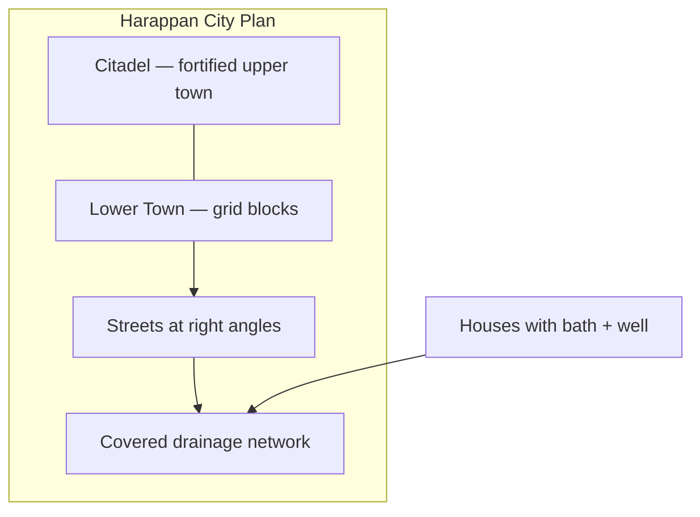

# Harappan Town Planning

> GS-1 · Topic 01 · Harappan / Indus Valley urban planning

---

## PYQs

| Year | M | Words | Question (EN) | प्रश्न (HI) | ID |
|------|---|-------|---------------|-------------|-----|
| 2020 | 8 | 125 | Describe the salient features of Harappan town planning. | हड़प्पा नगर नियोजना की प्रमुख विशेषताओं का वर्णन कीजिए। | Q1 |

---

## Quick Revision

```
PERIOD: Mature Harappan c. 2600–1900 BCE | Bronze Age | First urban India | Decline c. 1900 BCE
PHASES: Early Harappan (7000–2600 BCE) → Mature (2600–1900) → Late (1900–1300 BCE)
SITES: Mohenjo-daro · Harappa · Dholavira · Lothal · Kalibangan · Chanhudaro · Rakhigarhi · Banawali · Surkotada

PLAN: Citadel (upper fortified) + Lower Town (common people) | GRID streets (right angles)
DRAINAGE: Covered drains · house → street → main drain | bathrooms + wells in houses | manholes
BRICKS: Baked/burnt bricks (4:2:1 ratio) — superior to Egypt's sun-dried | standardised across 1000+ km

KEY STRUCTURES:
  Mohenjo-daro — Great Bath (11.88 × 7.01 m) | Harappa — granaries (6)
  Dholavira — 16+ reservoirs · signboard (10 symbols) | UNESCO 2021
  Lothal — dockyard (217 × 37 m) NOT reservoir | Kalibangan — ploughed field · fire altars (7)
  Chanhudaro — bead-making craft quarter (no citadel) | Rakhigarhi — largest Indian site (Haryana)

ECONOMY: Agriculture (wheat, barley, cotton) · pastoralism · craft · long-distance trade (Mesopotamia)
  Seals + weights standardised | Script UNDECIPHERED — limits governance/economy knowledge
  Meluhha in Mesopotamian texts = likely Indus region

DECLINE c. 1900 BCE: Ghaggar-Hakra drying · floods · tectonics · ecological stress
  Aryan migration NOT sole cause | Horse scarce in mature Harappan

COMPARISON: Harappan grid + drainage > Mesopotamia | Burnt brick > Egypt sun-dried
  Script undeciphered vs cuneiform/hieroglyph | Dholavira water > Nile/Irrigation model in arid zone

CONTEMPORARY: Dholavira UNESCO WH 2021 | Rakhigarhi excavation (Haryana) · ASI protection
  NEP 2020 IKS — archaeology, hydrology, urban planning curriculum
  Swachh Bharat · Smart Cities · AMRUT — Harappan drainage as sanitation model
  Art 49/51A(f) | National Museum Harappan gallery · Incredible India heritage tourism
  Jal Shakti — Dholavira rainwater harvesting studied by modern hydrologists

TRAPS: ≠ Vedic pastoral | Horse evidence doubtful | Dockyard ≠ reservoir
  Script unread | Great Bath = Mohenjo-daro not Harappa | Dholavira = inland not port
  Chanhudaro = no citadel craft town | Lothal = dockyard not reservoir city
```

---

## Content

### Context — Harappan civilization

The **Harappan (Indus Valley) Civilization** was **India's first urban civilization** — a **Bronze Age** culture (c. **2600–1900 BCE** mature phase) ranking among the **three earliest Old World urban civilisations** alongside Mesopotamia and Egypt. Also called **IVC** (Indus Valley Civilization), it flourished along the **Indus and Ghaggar-Hakra** (Saraswati) river systems across present-day **Pakistan, India, and Afghanistan**. Its extent ran from the **Siwaliks to the Arabian Sea** and from **Baluchistan to Meerut (UP)** — the largest ancient civilization by area (~**13 lakh sq km**) with over **1400 sites** identified including **5 major cities** and numerous towns and villages.

Development unfolded in phases: **Early Harappan** (c. 7000–2600 BCE) saw village growth and regional cultures; **Mature Harappan** (c. 2600–1900 BCE) produced fully planned cities; **Late Harappan** (c. 1900–1300 BCE) witnessed decentralisation and transformation. Major cities include **Mohenjo-daro** and **Harappa** (Pakistan); **Dholavira, Lothal, and Surkotada** (Gujarat); **Kalibangan, Banawali, and Rakhigarhi** (Rajasthan/Haryana — **Rakhigarhi** is the largest Indian site with ongoing ASI excavations); and **Chanhudaro** (Sindh — a craft specialist town). The civilization is **named after Harappa**, first discovered in 1921 by **R.D. Banerji** and **Sir John Marshall** of the ASI, though **Mohenjo-daro** ("Mound of the Dead") preserves among the best evidence for studying town planning principles. Understanding Harappan planning requires grasping why a Bronze Age society could coordinate standardised bricks, weights, and drainage across a thousand kilometres — evidence of administrative sophistication whose exact political form remains debated because the script is undeciphered.

### Salient features of Harappan town planning

Harappans achieved the **most advanced town planning of the ancient world** through **planned layout before construction** rather than organic growth — implying **central authority**, whether state or priestly administration (debated because the script remains unread). Seven interlocking features define this urban system.

**1. Citadel and lower town (dual settlement)**

Harappan cities divided into a raised **citadel (acropolis)** — fortified upper platform housing granaries, the Great Bath, and likely elite or administrative structures — and a larger **lower town** where common people lived in grid-arranged houses. This **horizontal social zoning** represents one of the earliest planned urban hierarchies in world history. The citadel often stood on the **west side** (Mohenjo-daro, Harappa), possibly for flood protection or ritual orientation. **Chanhudaro** is the exception — **no citadel**, functioning as a specialised **craft-production town** for bead-making and bangle industry.

| Part | Features | Examples |
|------|----------|----------|
| **Citadel (Acropolis)** | Raised **upper fortified** platform — granaries, Great Bath, assembly structures; likely **elite/administrative** zone | Mohenjo-daro, Harappa, Dholavira, Kalibangan |
| **Lower town** | Larger residential area for **common people** — grid of houses on flat ground east/west of citadel | All major cities |
| **Exception** | **Chanhudaro** — **no citadel**; specialised **craft-production town** | Bead-making, bangle industry |

**2. Grid pattern (street layout)**

Streets and lanes intersected at **right angles** in a **gridiron pattern** — predating Hippodamus of Miletus in Greece (c. 5th century BCE). **Main streets** ran **north-south** and **east-west**; Mohenjo-daro's main street measured ~**10 m** wide while side lanes were ~1.5–3 m. Blocks divided into **rectangular house plots** with uniform sizes showing **central planning authority** and standardised land division. **No encroachment** on streets during the mature phase suggests **municipal regulation** — unique for the Bronze Age.



**3. Drainage and sanitation (hallmark feature)**

The **most striking** aspect of Harappan urbanism is **covered drains** along streets with **house drains connected** to street channels leading to main outlets. Almost every house had a **bathroom** with sloping floor to drain and **wells** inside or nearby — Mohenjo-daro houses often combined private well and bathroom. **Manholes** at intervals allowed drain cleaning; brick-lined channels used **precise gradient** for self-flushing. This priority on **cleanliness and public health** surpassed contemporary Egypt and Mesopotamia in **systematic household-linked sanitation** — a principle later invoked in **Swachh Bharat and Smart Cities** discourse as historical precedent for planned urban hygiene.

**4. Burnt (baked) bricks**

Harappans standardised **burnt brick** in ratio **4 : 2 : 1** (length : breadth : thickness) — consistent across sites separated by 1000+ km. Unlike **Egypt** where sun-dried mud bricks dominated (stone reserved for elite monuments like pyramids), Harappan **fired bricks** survived millennia in the flood-prone Indus plains. Bricks built houses, drains, wells, the Great Bath, fortification walls, and the Lothal dockyard — **mass production** implying organised kiln industry fuelled by wood, with environmental cost debated as a factor in later decline.

**5. Domestic architecture**

Houses of **burnt brick** followed a **courtyard** plan with ground floor and sometimes upper storey (staircase evidence). **Private wells** and **bathrooms** were standard; many houses had **no windows on the street side** for privacy, coolness, and security. **Public wells** and **bathing platforms** served neighbourhoods; the **Great Bath** at Mohenjo-daro served communal ritual bathing. Room sizes suggest **middle-class uniformity** — fewer extreme palaces than Mesopotamia, and no clear "palace" identified.

**6. Public monumental structures — site-specific**

| Structure | Site | Significance |
|-----------|------|--------------|
| **Great Bath** | **Mohenjo-daro** | 11.88 × 7.01 m; waterproofed with bitumen; steps on north/south; **earliest public tank** — ritual bathing |
| **Granaries** | **Harappa** (6), Mohenjo-daro | Raised platforms with ventilation channels — **grain storage**, state/temple reserve |
| **16+ reservoirs (baolis)** | **Dholavira** (Kutch) | Sophisticated **rainwater harvesting** — channels, dams, **16–18 reservoirs**; survival in arid Rann of Kutch |
| **Signboard** | **Dholavira** | Large **10-symbol inscription** on stone — possibly **direction sign** to palace/administration; among longest Harappan texts |
| **Dockyard** | **Lothal** | Rectangular basin (**217 × 37 m**) linked to Sabarmati channel — **maritime trade** with Mesopotamia |
| **Ploughed field** | **Kalibangan** | **Earliest evidence of ploughed agricultural field** (pre-Harappan/Harappan) — furrow marks preserved |
| **Fire altars** | **Kalibangan** | **Seven fire altars** on citadel + **underground fire altars** in lower town — ritual urban planning |
| **Bead factory quarter** | **Chanhudaro** | **Craft-specialist town** — carnelian/faience **bead-making**, bangle factory, no citadel |
| **Assembly/ pillared hall** | Mohenjo-daro | Large public building — civic function debated (market, assembly, education?) |

**Dockyard vs reservoir (critical distinction)**

| Feature | **Lothal dockyard** | **Dholavira reservoirs** |
|---------|---------------------|----------------------------|
| Purpose | **Maritime trade** — ship berthing, cargo | **Freshwater storage** in arid zone |
| Location | Near **Sabarmati/Arabian Sea** coast (Gujarat) | Inland **Kutch** — no sea access |
| Structure | Rectangular **basin with inlet/outlet** to river channel | Series of **dams, channels, baolis** |
| Function | Export-import (beads, copper, cotton) | Rainwater harvesting for city survival |

**Lothal** is a **dockyard/basin for ships**, not a reservoir city. **Dholavira** is an inland **reservoir/rainwater** city in arid Kutch, not a port. No clear temple or palace like Mesopotamia has been identified — Harappan urbanism appears **secular/civic** with ritual importance through the **Great Bath** and **fire altars** rather than monumental ziggurat architecture.

**7. Town planning principles (summary)**

| Principle | Evidence |
|-----------|----------|
| **Pre-planned geometry** | Grid, standard brick, uniform block sizes |
| **Water integration** | Wells, baths, drains, Dholavira reservoirs |
| **Defence** | Citadel fortification; city walls at Dholavira, Kalibangan |
| **Craft zoning** | Chanhudaro bead-making; separate industrial areas |
| **Standardization** | Weights, measures, brick ratio across 1000+ km — strong administrative coordination |
| **Sanitation priority** | Covered drains, household bathrooms — public health engineering |

### Harappan economy and trade

Harappan economy combined **agriculture** (wheat, barley, **cotton** — the world's first cotton producers), **pastoralism** (cattle, sheep, goat, buffalo), **craft specialisation** (beads, seals, pottery, metallurgy), and **long-distance trade**. **Granaries**, standardised **weights** (binary system — 16, 64, 1600 units), and planned craft quarters at sites like Chanhudaro suggest **centralised state or temple administration**, though exact governance remains unknown because the script is undeciphered.

External trade linked Harappans to **Mesopotamia (Sumer)** — Harappan seals found at **Ur and Lagash**; Mesopotamian texts mention **Meluhha**, likely the Indus region. **Lothal dockyard** supported maritime export of beads, carnelian, and cotton; **Shortugai** (Afghanistan) served as a Harappan trading post on lapis lazuli and copper routes. Internal economy relied on **wheat, barley, and cotton** agriculture evidenced by the **Kalibangan ploughed field**, pastoral herds, and specialised craft quarters. **Seals** (steatite) with animal motifs (**unicorn bull**, elephant, rhinoceros, brahmani bull) likely functioned as trade or administration markers, but **~400 symbols of undeciphered script** prevent reading merchant names, ownership, or tax receipts — limiting governance and economic history to archaeological inference from granaries, weights, and workshop debris.

| Direction | Evidence | Goods |
|-----------|----------|-------|
| **Mesopotamia (Sumer)** | Harappan seals at **Ur, Lagash**; Mesopotamian texts mention **Meluhha** | Beads, carnelian, cotton, timber |
| **Afghanistan/Baluchistan** | **Shortugai** (Afghanistan) Harappan trading post | Lapis lazuli, copper routes |
| **Maritime (Arabian Sea)** | **Lothal dockyard** | Export beads, carnelian; import copper, shell |
| **Internal networks** | Standardised weights across sites | Inter-city commerce |

### Technology supporting urban life

| Technology | Application | Site evidence |
|------------|-------------|---------------|
| **Bronze** tools | Craft, construction | Copper + tin alloy; no iron in mature phase |
| **Potter's wheel** | Mass pottery | Red and black ware (Kalibangan) |
| **Cotton weaving** | Textile export | First cotton producers; spindle whorls |
| **Bead drilling** | Long carnelian beads | Chanhudaro micro-craft precision |
| **Metrology** | Trade standardisation | Cubical weights — binary system |
| **Faience** | Ornaments, tiles | Chanhudaro, Harappa |
| **Bitumen** | Waterproofing | Great Bath lining (Mohenjo-daro) |

### Comparison with contemporary civilizations

| Feature | Harappan | Mesopotamia | Egypt |
|---------|----------|-------------|-------|
| **Street grid** | Systematic right-angle grid | Less uniform | Nile-oriented, less grid |
| **Drainage** | Covered, house-linked | Inferior sanitation in many cities | Nile disposal, less urban drainage |
| **Bricks** | **Burnt** bricks standard | Mud/brick mix | Sun-dried mud brick (pyramids = stone) |
| **Monuments** | Great Bath, granaries | Ziggurats, temples | Pyramids, temples |
| **Script** | **Undeciphered** (~400 signs) | Deciphered cuneiform | Deciphered hieroglyph |
| **Water management** | Dholavira reservoirs | Tigris-Euphrates irrigation | Nile flood dependence |
| **Social hierarchy evidence** | Less extreme palace gap | Clear palaces, kings | Divine pharaoh |

Harappan urban planning **surpassed contemporary Mesopotamia and Egypt** in grid regularity, burnt-brick standardisation, and household-linked drainage — though lacked their deciphered scripts and monumental royal architecture.

### Significance and legacy

Harappan civilization marks the **beginning of urban India** — planned cities **4000+ years ago** forming the foundation for all later subcontinental urban traditions. It demonstrates **advanced civic engineering** — grid, hygiene, standardisation — relevant to modern **Smart Cities, AMRUT (sanitation), and Swachh Bharat** policy discourse as historical inspiration rather than direct technological replication. **Rakhigarhi** (Haryana — largest Indian Harappan site with ongoing DNA and settlement studies), **Kalibangan** (Rajasthan) with its ploughed field and fire altars, and the eastern limit near **Meerut** connect Harappan heritage to the Gangetic region and demonstrate that urban India did not begin with the Mauryas or Guptas but with Bronze Age planners who solved drainage, water storage, and craft zoning problems that modern cities still confront.

**Dholavira: A Harappan City** inscribed as **UNESCO World Heritage Site (2021)** validates international significance of Harappan town planning and water management — particularly the **16-reservoir system** that sustained a major city in the arid Rann of Kutch, proving regional adaptation within a shared planning vocabulary.

### Contemporary relevance

**Dholavira: a Harappan City** received **UNESCO World Heritage inscription (2021)**, recognising **16-reservoir water management**, the signboard inscription, and planned urban layout — creating ASI conservation obligations under the World Heritage Convention. **ASI excavations** continue at **Rakhigarhi** (Haryana), the largest Indian Harappan site, revealing cemetery lanes and jewellery; **Mohenjo-daro, Harappa, Lothal, and Dholavira** operate under ASI or state protection via the **Ancient Monuments Act 1958**. **Article 49** directs the state to protect monuments of national importance; **Article 51A(f)** makes preserving **India's first urban civilization** a citizen duty.

**NEP 2020 IKS** integrates Harappan **metrology, hydrology (Dholavira), urban grid planning, and bead technology** into archaeology, ancient history, and civil engineering curriculum — linking Bronze Age science to modern town planning education. Harappan **covered drainage and household bathrooms** are cited in **Swachh Bharat Mission, AMRUT, and Smart Cities Mission** discourse as historical precedent for **planned urban sanitation**. The Harappan gallery at **National Museum, New Delhi** and heritage circuits at **Dholavira and Lothal** support **Incredible India** archaeological tourism. **Dholavira rainwater harvesting** in arid Kutch is studied by **modern hydrologists and architects** for **water-scarce region planning**, informing **Jal Shakti and watershed management** discussions. Ongoing **computational linguistics and AI-assisted decipherment** attempts may eventually revolutionise understanding of Harappan governance — currently the **stable fact remains: script undeciphered**.

### Limits and decline (balanced view)

Harappan civilization **declined c. 1900 BCE** through **multi-causal factors**, not a single event. **Climate change** including **Ghaggar-Hakra (Saraswati) drying** and reduced monsoon (evidence from Kotla Dahar lake sediments) stressed agricultural bases. **Floods** forced Mohenjo-daro to rebuild multiple times. **Tectonic shifts** altered Indus courses; **ecological overexploitation** including deforestation for kiln fuel depleted resources. **Aryan migration** is **not proven** as sole cause — **horse** evidence in mature Harappan contexts is **doubtful/scarce**, distinguishing Harappan from later Vedic age material culture.

The **undeciphered script** (~400 signs) limits knowledge of governance, religion, language family, and full economic organisation — avoid over-confident claims about "Harappan kings" or "Harappan laws." The famous "priest-king" seal from Mohenjo-daro remains debated identification; without readable inscriptions, debates on **state versus merchant guild** control stay open. Not all sites were equally planned: village sites were simpler while mature cities (Mohenjo-daro, Dholavira) show full features; **regional variation** exists — Dholavira water-focused, Lothal trade-focused, Chanhudaro craft-focused. **No iron, no horse (mainly), no deciphered literature** mark Bronze Age urban limits compared to later historic periods, yet within those limits Harappans achieved planning sophistication that remains instructive four millennia later.

---

## Answers

### Q1: Describe the salient features of Harappan town planning. (2020, 8M, 125W)

**Opening:**
> Harappan town planning represents the earliest and most systematic urban design in ancient India — combining grid layout, burnt-brick construction, and advanced drainage in the Bronze Age.

**Write these points:**
- **Dual structure:** **Citadel** (fortified upper town with granaries, Great Bath) and **lower town** (residential grid) — planned social zoning at Mohenjo-daro, Harappa, Dholavira.
- **Grid pattern:** Streets intersecting at **right angles**; standardized **burnt bricks** (4:2:1); rectangular house blocks show central planning authority.
- **Drainage:** **Covered drains** — house bathrooms linked to street channels and main outlets; wells in houses; unmatched ancient sanitation priority — cited today in **Swachh Bharat/Smart Cities** discourse.
- **Site-specific works:** **Great Bath** (Mohenjo-daro), **Kalibangan** ploughed field and fire altars, **Dholavira** 16 reservoirs and signboard (**UNESCO 2021**), **Lothal dockyard**, **Chanhudaro** bead quarter.
- First **urban civilization of India** (c. 2600–1900 BCE) — decline debated but planning legacy remains historically significant under **ASI/NEP 2020 IKS** heritage framework.

**Conclusion:**
> Harappan cities thus stand as monuments to prehistoric urban engineering — where grid, hygiene, and standardization preceded much of the ancient world and continue to inform India's heritage and urban policy discourse.

---

### Q2 (Future variant): Discuss the economic life and trade of the Harappan civilization. (8M, 125W)

**Opening:**
> Harappan economy combined productive agriculture, specialised crafts, and long-distance trade — supported by urban planning and standardised weights, though script limits full understanding.

**Write these points:**
- **Agriculture & crafts:** Wheat, barley, cotton (first producers); **Kalibangan ploughed field**; **Chanhudaro** bead-making and bangle industry — craft specialisation within planned towns.
- **Internal organisation:** **Granaries**, standardised **weights** (binary system), planned craft quarters — suggests coordinated **state or guild** administration.
- **External trade:** Seals and goods link to **Mesopotamia (Meluhha)**; **Lothal dockyard** for maritime export of beads, cotton, carnelian; **Shortugai** (Afghanistan) trading post; imports of copper, shell.
- **Evidence limits:** **Script undeciphered** (~400 signs) — cannot read merchant/admin records; economic history reconstructed mainly from **archaeology** (workshops, dockyard, weights).
- **Significance:** Among earliest **international trading urban economies** of India — foundation for later subcontinental commerce; **Dholavira UNESCO 2021** recognises planned urban-economic integration.

**Conclusion:**
> Harappan economic life was urban, standardised, and outward-looking — a Bronze Age commercial civilisation whose full written record awaits script decipherment.

---

### Q3 (Future variant): Compare Harappan town planning with contemporary Mesopotamian and Egyptian urbanism. (8M, 125W)

**Opening:**
> Harappan urban planning surpassed contemporary Mesopotamia and Egypt in grid regularity, burnt-brick standardisation, and household-linked drainage — though lacked their deciphered script and monumental royal architecture.

**Write these points:**
- **Grid and sanitation:** Harappan **right-angle street grid** and **covered house-linked drains** more systematic than most Mesopotamian cities; Egypt relied on Nile, less urban drainage infrastructure.
- **Construction:** Harappan **burnt bricks (4:2:1)** vs Egyptian **sun-dried mud brick** (stone only for elite monuments like pyramids).
- **Monuments:** Mesopotamian **ziggurats**, Egyptian **pyramids** vs Harappan **Great Bath, granaries, Dholavira reservoirs** — civic/ritual rather than royal tomb focus.
- **Water management:** **Dholavira 16 reservoirs** in arid Kutch vs Mesopotamian irrigation and Nile flood dependence — region-specific engineering brilliance.
- **Knowledge gap:** Mesopotamian/Egyptian **deciphered scripts** vs Harappan **undeciphered** — limits comparison of governance models; Harappan planning inferred mainly from archaeology.

**Conclusion:**
> Harappan town planning thus represents a distinctive Bronze Age urban experiment — prioritising sanitation, standardisation, and grid geometry at a scale unmatched in its time, now recognised globally through **Dholavira UNESCO listing (2021)**.

---

## Traps

| Wrong | Correct |
|-------|---------|
| Harappan = Vedic city | **Bronze Age pre-Vedic** — c. 2600–1900 BCE mature phase |
| Horse central to Harappan | **Horse evidence doubtful/scarce** — major difference from Vedic age |
| Sun-dried bricks like Egypt | **Burnt/baked bricks** standard (4:2:1 ratio) |
| No drainage system | **Covered drains** = hallmark feature |
| Every site had dockyard | **Lothal only** — dockyard for maritime trade |
| Dholavira = port city | **Dholavira** = **reservoir/rainwater** city in arid Kutch (UNESCO 2021) |
| Lothal = reservoir system | **Lothal** = **dockyard/basin** for ships |
| Great Bath at Harappa | **Mohenjo-daro** (11.88 × 7.01 m) |
| Kalibangan = only fire altars | Also **earliest ploughed field** evidence |
| Chanhudaro = typical citadel city | **No citadel** — specialised **bead-making** town |
| Script tells us economy in detail | **Undeciphered** (~400 signs) — limits governance/trade text evidence |
| Town planning = only Mohenjo-daro | **Grid + drains** at multiple sites — Harappa, Dholavira, Kalibangan |
| Clear palace/temple like Egypt | **No definitive temple/palace** — civic structures debated |
| Aryan invasion alone caused decline | **Multi-causal** — climate, floods, tectonics; migration not sole cause |
| Rakhigarhi in Pakistan | **Rakhigarhi** = **Haryana, India** — largest Indian Harappan site |
| Dholavira not UNESCO | **UNESCO World Heritage 2021** — "Dholavira: a Harappan City" |

---

*Complete.*
