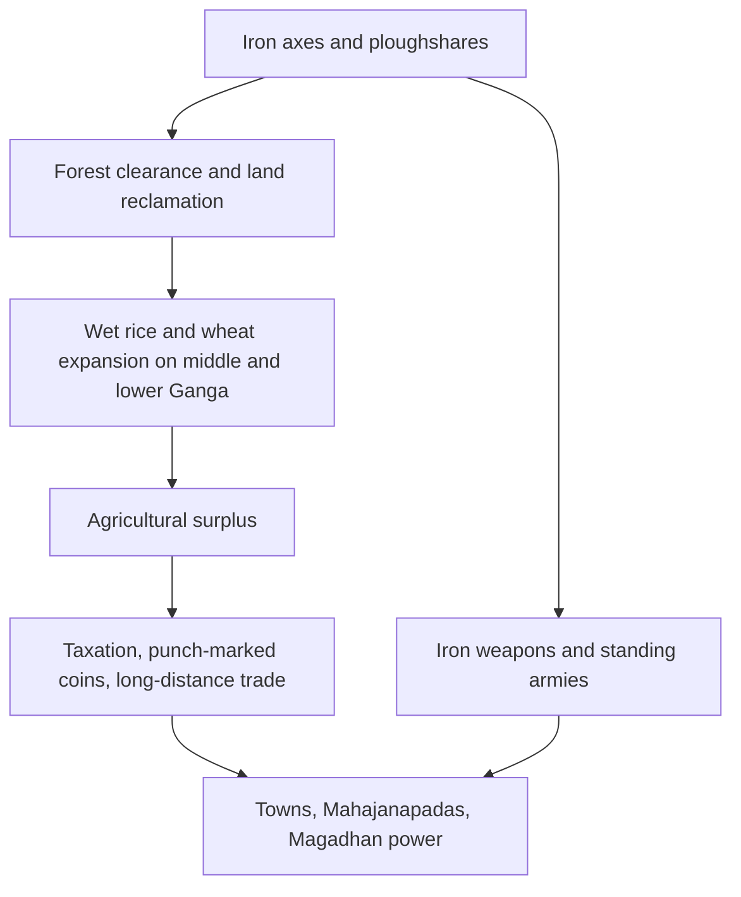

# Iron Age & Socio-economic Change (600–300 BCE)

> GS-1 · Topic 01 · Iron technology, second urbanisation, Mahajanapadas

---

## PYQs

| Year | M | Words | Question (EN) | प्रश्न (HI) | ID |
|------|---|-------|---------------|-------------|-----|
| 2019 | 8 | 125 | Discuss the role of iron in bringing socio-economic changes in India during c. 600–300 BCE. | 600–300 ई.पू. की अवधि में भारत में सामाजिक-आर्थिक परिवर्तनों में लोहे की भूमिका की विवेचना कीजिए। | Q1 |

---

## Quick Revision

```
PERIOD: c. 600–300 BCE | Age of Buddha (6th–5th c.) | Second Urbanisation
CONTEXT: Harappan decline c. 1900 BCE → ~1500 yr gap → iron enables Gangetic forest clearance

IRON TECH: Axe · ploughshare · sickle · adze · knife | Low-carbon steel c. 600 BCE
ORE: Singhbhum (Jharkhand) · Mayurbhanj (Odisha) | Sites: Kaushambi · Rajghat (Varanasi)

CAUSAL CHAIN: Iron tools → forest clearance → wet rice/wheat → surplus → coins · tax · towns
ARCHAEOLOGY: Black-and-Red → PGW (Doab) → NBPW (c. 500 BCE) + iron = urban marker
  Burnt brick · ring wells · punch-marked coins in NBPW layers

16 MAHAJANAPADAS (Anguttara Nikaya):
  Anga-Champa | Magadha-Rajgir→Pataliputra | Kashi-Varanasi | Vatsa-Kaushambi
  Kosala-Shravasti | Shurasena-Mathura | Panchala-Ahichhatra | Kuru-Indraprastha
  Matsya-Virat | Chedi-Shuktimati | Avanti-Ujjain | Gandhara-Taxila | Kamboja
  Asmaka-Potana | Malla-Kushinagar | Vajji-Vaishali (Lichchhavi confederacy)

MAGADHA RISE: Iron ore proximity · Ganga-Son-Punpun rivers · war elephants
  Bimbisara (alliances) · Ajatashatru (Kosala/Vajji) · Udayin (Rajgir→Pataliputra)
  Haryanka → Nanda (Mahapadma Nanda, 4th c. BCE) → Maurya foundation

ECONOMY: Punch-marked silver coins · shrenis (guilds) · gahapati (householder farmers)
  Town-village exchange · craft villages · Pali 500-plough deposit evidence
SOCIETY: Varna rigidity · Jainism/Buddhism (anti-cattle sacrifice) · Sutra literature codification
REGIONS: Eastern Gangetic = fastest iron urban growth | Doab = PGW first | South = later

UP/Bihar CITIES: Kaushambi · Shravasti · Ayodhya · Varanasi · Rajgir · Vaishali · Pataliputra

CONTEMPORARY: ASI excavations (Rajghat, Kaushambi) · Art 49/51A(f) · NEP 2020 IKS
  Swadesh Darshan Buddhist Circuit (Sarnath, Kushinagar, Shravasti) · heritage tourism

TRAPS: ≠ Harappan iron (bronze) | ≠ Early Rig Vedic pan-India | 2nd not 1st urbanisation
  16 not 18 mahajanapadas | Taxila = Gandhara not Kamboja | Nanda ≠ Maurya
```

---

## Content

### The gap between two urban worlds

When the Harappan cities of the Indus valley faded around 1900 BCE, India entered a long interlude of roughly fifteen centuries during which no comparable urban civilisation flourished on the subcontinent. Settlements remained largely rural, organised around pastoral and small-scale farming communities. Around 600 BCE, however, a new pattern of dense, fortified towns began to emerge along the middle and lower Ganga in eastern Uttar Pradesh and Bihar — a process historians call the **second urbanisation**. This phase coincides with what tradition remembers as the **Age of Buddha and Mahavira** (6th–5th century BCE), when Gautama Buddha and Vardhamana Mahavira preached in the very cities that iron technology was helping to build.

The geography explains why iron mattered so decisively here. Unlike the wheat-growing Doab of western Uttar Pradesh, which had already seen settlement expansion under **Painted Grey Ware (PGW)** culture, the eastern Gangetic belt was covered in dense monsoon forest growing on heavy, sticky alluvial soil. Copper axes could not fell mature sal and teak at scale; bronze remained scarce because tin was hard to obtain; and wooden ploughs shattered against the hard ground. **Iron**, by contrast, was harder, cheaper once smelting spread, and available from abundant ore deposits at **Singhbhum (Jharkhand)** and **Mayurbhanj (Odisha)**. Archaeological analysis of iron objects from **Rajghat (Varanasi)** confirms that smelters were already drawing ore from these eastern sources. By roughly 600 BCE, smiths were producing **low-carbon steel** — a significant advance over soft wrought iron — and forging the tool kit of an agrarian revolution: **ploughshares, axes, sickles, adzes, and knives**, many recovered from **Northern Black Polished Ware (NBPW)** layers at **Kaushambi** near Prayagraj.

| Metal tradition | What limited it | What iron changed |
|-----------------|-----------------|-------------------|
| **Chalcolithic copper** | Soft metal; tools bent or broke against hard wood and soil | Iron's hardness made mass forest clearance possible |
| **Harappan bronze** | Tin scarcity; bronze largely confined to elite weapons and ornaments | Iron ore was widespread; tools could reach ordinary farmers |
| **Early iron (c. 600 BCE onward)** | Initial smelting knowledge had to spread | Low-carbon steel, durable ploughshares, and cheap axes unlocked the Gangetic plain |

### How iron reshaped agriculture and settlement

The causal chain from technology to civilisation is among the best-documented in ancient Indian history. **Iron axes** cleared the forests that had blocked permanent agriculture; **iron ploughshares** turned soil that wooden implements could not penetrate; cleared land supported **wet rice** in the middle and lower Ganga while wheat and barley continued in the west. Surplus grain freed a portion of the population for crafts, trade, administration, and religious life — the structural precondition for cities. Pali Buddhist texts preserve a telling vignette: a village trader deposited **five hundred ploughs** with a town merchant, almost certainly iron shares, proving that rural producers and urban markets were already linked through agricultural hardware.

Archaeology corroborates the literary picture through a clear pottery sequence. **Black-and-Red Ware** gave way to **PGW** in the Doab, and then to **NBPW** from about **500 BCE** — a fine, glossy ware associated with wealthy urban households. NBPW layers consistently appear alongside **iron implements, burnt brick construction, ring wells, and punch-marked silver coins**. Excavations in the Kanpur district show settlement size multiplying: PGW sites were roughly three times larger than Black-and-Red settlements, and NBPW sites about two and a half times larger again. The pattern is not decorative pottery fashion but evidence of denser, richer, more complex communities.



| Dimension of second urbanisation | What the evidence shows |
|-----------------------------------|-------------------------|
| **Material base** | Iron tools enabled surplus production on previously uncultivated land |
| **Archaeological signature** | NBPW (c. 500 BCE) with iron, burnt brick, ring wells |
| **Economic life** | Punch-marked coins, shreni guilds, gahapati farmers, town-village exchange |
| **Political order** | Sixteen Mahajanapadas with taxation, bureaucracy, standing armies |
| **Social structure** | Hardening varna hierarchy alongside new urban classes |
| **Geographic core** | Eastern Gangetic plain — eastern UP and Bihar |
| **Chronological gap** | Roughly 1500 years after Harappan urban decline |

The cities that rose in this landscape are among the most storied in Indian history. **Kaushambi** (Prayagraj region), **Shravasti**, **Ayodhya**, and **Varanasi** in Uttar Pradesh; **Rajgir**, **Vaishali**, and eventually **Pataliputra (Patna)** in Bihar — all appear in both excavation reports and Buddhist-Jain literature as flourishing centres of trade, craft, and political rivalry.

### Economy beyond the village: coins, guilds, and householders

Surplus agriculture did not automatically produce cities; it had to be converted into exchange, storage, and taxation. The transition from subsistence to surplus farming altered social relations at every level. Land that yielded predictable harvests could be measured, assessed, and taxed — a fiscal revolution that transformed kin-based tribal polities into territorial states with permanent revenue systems. Craft specialisation accelerated because food surpluses freed labour from field work: potters who produced NBPW ware, smiths who forged iron shares, and weavers who supplied urban markets all depended on the agrarian base that iron tools made possible. **Punch-marked silver coins**, among the earliest Indian coinage, simplified long-distance trade beyond pure barter. **Shrenis** — guilds of craftsmen and merchants — regulated quality, price, and apprenticeship, giving artisans a corporate identity that could negotiate with kings and financiers. The **gahapati**, or prosperous householder-farmer recorded extensively in Pali and Jain texts, emerged as the pivotal rural figure: large landholder, tax payer, and patron of local ritual. Towns supplied iron tools, textiles, and finished goods; villages supplied grain, raw materials, and revenue — a reciprocal economy visible in specialised craft settlements of carpenters and chariot-makers clustered near urban markets. Rivers, especially the Ganga and its tributaries, functioned as highways linking the heartland to wider trade networks.

### Political transformation: the sixteen Mahajanapadas

As agriculture intensified, smaller tribal chiefdoms consolidated into **sixteen Mahajanapadas** — large territorial states with defined capitals, permanent taxation, professional armies, and administrative cadres. The Buddhist **Anguttara Nikaya** preserves the classic list:

| Mahajanapada | Capital |
|--------------|---------|
| **Anga** | **Champa** |
| **Magadha** | **Rajgir** (later **Pataliputra**) |
| **Kashi** | **Varanasi** |
| **Vatsa** | **Kaushambi** |
| **Kosala** | **Shravasti** |
| **Shurasena** | **Mathura** |
| **Panchala** | **Ahichhatra** |
| **Kuru** | **Indraprastha** |
| **Matsya** | **Virat (Viratnagar)** |
| **Chedi** | **Shuktimati** |
| **Avanti** | **Ujjain** |
| **Gandhara** | **Taxila** |
| **Kamboja** | Northwest frontier region |
| **Asmaka** | **Potana / Paithan region** |
| **Malla** | **Kushinagar** (and Pava) |
| **Vajji** | **Vaishali** (Lichchhavi confederacy) |

Iron weapons strengthened the military logic of these states. Magadha and Kosala rose to particular prominence because their resource base, geography, and leadership aligned with the new agrarian order.

### Why Magadha prevailed

Magadha's dominance was overdetermined — no single factor alone explains it, but the combination was formidable. Proximity to **Singhbhum iron ore** supplied both tools and weapons. The **Ganga, Son, and Punpun** rivers provided transport, irrigation, and communication. Forest tracts yielded **war elephants**, a decisive battlefield asset. Once iron axes cleared the land, the alluvial soil produced reliable agrarian surplus. Strategically, Magadha sat at the heart of the eastern Gangetic trade network.

| Magadhan advantage | Mechanism |
|--------------------|-----------|
| Iron ore access | Weapons and tools without long supply lines |
| River network | Movement of grain, troops, and revenue |
| War elephants | Military superiority over infantry-only rivals |
| Fertile alluvium | High surplus after deforestation |
| Central location | Control of Gangetic trade routes |

Leadership translated resources into empire. **Bimbisara** of the **Haryanka dynasty** expanded through matrimonial alliances and annexed **Anga**. His son **Ajatashatru** defeated **Kosala** and the **Vajji confederacy at Vaishali**, fortifying **Pataliputra** on the Ganga. **Udayin** moved the capital from the hill fort of **Rajgir** to **Pataliputra**, exploiting superior riverine commerce. The **Nanda dynasty** under **Mahapadma Nanda** in the 4th century BCE assembled a large army and treasury that the Mauryas would later inherit. Historian R.S. Sharma's influential formulation captures the structural logic: without iron-driven forest clearance, surplus agriculture in the Gangetic basin would have remained limited, urbanisation stunted, and Magadhan imperial unification impossible.

### Society, religion, and intellectual life

Material change rippled through social and cultural life. The **varna system** hardened into sharper birth-based hierarchy as settled agriculture made land ownership the basis of status. **Jainism and Buddhism**, both founded in the 6th century BCE, challenged the Vedic sacrificial order — especially **cattle slaughter**, which destroyed the bullocks essential to iron plough agriculture. New social groups crystallised: the **gahapati** farmer, the **shreni** artisan-merchant, and the urban **vaishya** trader. **Sutra literature** of the 600–300 BCE period codified ritual and law for a society now anchored in permanent fields and towns rather than semi-nomadic pastoralism.

Iron's spread was uneven. The **eastern Gangetic plain** moved from chalcolithic cultures directly into an iron-based agrarian order with the fastest urban growth. The **Doab** knew PGW settlement before iron became common. **South India** adopted iron later, during the megalithic phase; the full political consolidation of Chera, Chola, and Pandya power belongs chiefly to the early centuries CE. The 600–300 BCE revolution was therefore primarily a north Indian Gangetic story, even though iron would eventually reshape the entire subcontinent.

The long-term significance is civilizational. Iron transformed India from a landscape of villages into one of urban-centred territorial states — the direct foundation of Mauryan and later empires. Cities, coinage, philosophy, and statecraft of the Buddha age all rested on iron-enabled surplus. Archaeology at **Kaushambi, Rajghat, Shravasti, and Pataliputra** validates the literary world of Buddhist and Jain texts. Second urbanisation is the hinge connecting Harappan decline to Mauryan unification; iron is the technology that turned the hinge.

### Contemporary relevance

The Archaeological Survey of India continues active excavation and conservation at **Rajghat (Varanasi), Kaushambi, Shravasti, Vaishali, and Rajgir**, where iron implements, NBPW sherds, and burnt-brick structures document this transformation for visitors and researchers. **Article 49** of the Constitution directs the state to protect monuments of national importance; **Article 51A(f)** makes heritage preservation a fundamental duty of every citizen — both apply directly to Mahajanapada-era urban sites. **NEP 2020's Indian Knowledge Systems (IKS)** framework integrates ancient metallurgy, agrarian economy, and early state formation into university curricula, reconnecting technical history with political thought. **Swadesh Darshan** and the **Buddhist Circuit** schemes develop infrastructure at **Sarnath, Kushinagar, Shravasti, and Bodh Gaya** — cities whose pilgrimage economies revive the historical geography of the eastern Gangetic heartland. Museums at **Prayagraj, Patna, and Mathura** display NBPW pottery, punch-marked coins, and iron tools, translating academic reconstruction into public education. Traditional iron-smelting communities in tribal belts such as **Bastar and Singhbhum** preserve ethnographic continuity with ancient ore-source regions. The riverine growth of **Varanasi, Prayagraj, and Patna** today echoes patterns established during the second urbanisation, informing debates on Gangetic urban expansion and heritage conservation.

### Limits

Iron appears in later Vedic texts as *shyama ayas* (dark metal), but **widespread iron tools and the full social transformation they enabled belong chiefly to the 6th–5th century BCE onward** — the Early Rig Vedic period should not be labelled an Iron Age. Iron was a decisive factor, not the sole cause of change: geography, monsoon patterns, social conflict, and political innovation all contributed independently. Harappans worked in **bronze**, not iron; conflating the two urbanisations obscures fifteen centuries of distinct development. Sixteen, not eighteen, Mahajanapadas form the standard Anguttara list; **Taxila** was the capital of **Gandhara**, not Kamboja; the **Nandas** preceded the **Mauryas**; and the **gahapati** was a householder-farmer, not a guild member — distinctions that keep historical reconstruction precise.

---

## Answers

### Q1: Discuss the role of iron in bringing socio-economic changes in India during c. 600–300 BCE. (2019, 8M, 125W)

**Opening:**
> During c. 600–300 BCE, iron technology became the decisive material force transforming Gangetic India — enabling forest clearance, surplus agriculture, and the second urbanisation that produced the Mahajanapadas.

**Write these points:**
- **Technology:** **Iron axes and ploughshares** (ore from Singhbhum/Mayurbhanj) cleared forests and tilled hard alluvial soil — low-carbon steel c. **600 BCE**; tools at **Kaushambi** and **Rajghat**.
- **Agriculture & economy:** **Wet rice** expansion in middle/lower Ganga produced **surplus**; **punch-marked coins**, **shreni guilds**, **gahapati** farmers, and town-village trade in ploughs and craft goods.
- **Urbanisation:** **NBPW** (c. 500 BCE) marks **second urbanisation** — cities like **Kaushambi, Varanasi, Rajgir, Pataliputra** after post-Harappan gap.
- **Polity & society:** **16 Mahajanapadas**, permanent **tax and armies**; **Magadha's rise** (Bimbisara, Ajatashatru, Nanda) aided by iron ore, rivers, elephants; varna rigidity; **Jainism/Buddhism** in new agrarian-commercial milieu.
- Iron linked **production to state power** — agricultural surplus + iron weapons made territorial empires possible.
- **Present link:** **ASI-protected** Buddha-age cities and **NEP IKS** curricula keep this transformation visible in heritage tourism and education.

**Conclusion:**
> Thus iron was not merely a metal but the engine of socio-economic restructuring that laid the foundation of classical Indian civilization in the Gangetic heartland.

---

### Q2: Discuss the salient features of the second urbanisation in ancient India. (Future PYQ, 8M, 125W)

**Opening:**
> The second urbanisation (c. 600–300 BCE) marked the re-emergence of cities in the Gangetic plain after the Harappan decline — driven by iron technology, agricultural surplus, and the rise of territorial Mahajanapada states.

**Write these points:**
- **Historical gap:** ~**1500 years** after first (Harappan) urbanisation ended — new phase centred on **eastern UP and Bihar**, not Indus valley.
- **Archaeological markers:** **NBPW** (c. 500 BCE) with **iron tools**, burnt bricks, ring wells — follows **PGW** phase in Doab; settlement sizes expand sharply.
- **Economic features:** **Punch-marked coins** (silver), **shreni guilds**, **gahapati** householder-producers, specialised craft villages, and **town-village exchange** (e.g. iron plough trade).
- **Political features:** **16 Mahajanapadas** with capitals (Magadha-Rajgir/Pataliputra, Vatsa-Kaushambi, Kosala-Shravasti, etc.); standing armies, taxation, bureaucracy — **Magadha** eventually dominant.
- **Social-religious context:** Varna rigidity; rise of **Jainism and Buddhism**; cities as centres of trade, crafts, and new intellectual life.

**Conclusion:**
> Second urbanisation thus represents the material and political foundation of classical India — iron-enabled agriculture converting the Gangetic forest belt into the heartland of empires.

---

## Traps

| Wrong | Correct |
|-------|---------|
| Harappan used iron tools | **Bronze Age** — iron evidence doubtful at Harappan sites |
| Iron Age = Early Rig Vedic period | **Widespread iron tools** mainly from **6th–5th c. BCE** onward |
| First urbanisation in 600 BCE | **Second** urbanisation — first = **Harappan** |
| Iron alone created Buddhism | **Social/economic context** + religious reform; iron = material base |
| Same as Vedic Education PYQ (2019) | **Different 2019 question** — education vs iron/socio-economy |
| Same as Scientific Heritage (09) | 09 = **pan-heritage science**; 11 = **iron-driven historical change** |
| All India urbanised equally by 300 BCE | Core = **eastern Gangetic plain**; south later |
| PGW = iron urban marker | **NBPW + iron** = hallmark of second urbanisation; PGW earlier phase |
| No coinage in this period | **Punch-marked coins** appear — money economy begins |
| 18 Mahajanapadas in standard list | Buddhist/Anguttara tradition lists **16** — learn full table with capitals |
| Magadha capital always Pataliputra | Early capital **Rajgir**; **Udayin** shifted to **Pataliputra** |
| Gahapati = shreni guild member | **Gahapati** = prosperous **householder/farmer**; **shreni** = **craft/merchant guild** |
| Kamboja capital = Taxila | **Taxila** = **Gandhara** capital; **Kamboja** = northwest frontier region |
| Nanda dynasty = Mauryan | **Nandas** preceded **Mauryas** — Mahapadma Nanda (4th c. BCE) |

---

*Complete.*
