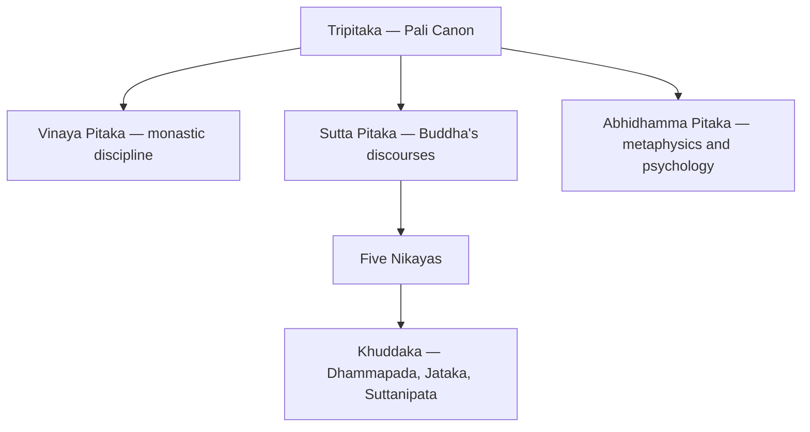
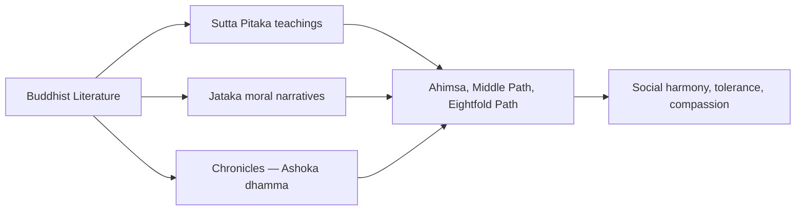

# Buddhist Literature

> GS-1 · Topic 01 · Buddhist texts — Tripitaka, Jataka, peace and ahimsa

---

## PYQs

| Year | M | Words | Question (EN) | प्रश्न (HI) | ID |
|------|---|-------|---------------|-------------|-----|
| 2018 | 8 | 125 | Discuss the salient features of Buddhist literature and its contribution to the promotion of peace. | बौद्ध साहित्य की प्रमुख विशेषताओं का वर्णन कीजिए तथा शान्ति के प्रचार में इसके योगदान की विवेचना कीजिए। | Q1 |
| — | 8 | 125 | *Likely:* Compare Buddhist and Jain literature as sources of ancient Indian history. | *संभावित:* प्राचीन भारतीय इतिहास के स्रोत के रूप में बौद्ध और जैन साहित्य की तुलना कीजिए। | Q2 |

---

## Quick Revision

```
CORE: Pali canon (Theravada) + later Sanskrit/Mahayana + chronicles
TRIPITAKA: Vinaya (monastic rules) · Sutta (discourses) · Abhidhamma (philosophy)

NIKAYAS (Sutta Pitaka): Digha (long) · Majjhima (middle) · Samyutta (connected)
  Anguttara (numerical) · Khuddaka (minor — Dhammapada, Jataka, Suttanipata, Therigatha)

COUNCILS: 1st Rajgriha (483 BCE, Upali+Ananda) | 2nd Vaishali (383 BCE, schism)
  3rd Pataliputra (250 BCE, Ashoka, Moggaliputta Tissa) — Theravada fixation
  4th Kashmir/Kanishka (Mahayana tradition — separate from Ashoka council)

MAHAYANA SUTRAS: Lotus (Saddharmapundarika) · Prajnaparamita · Vimalakirti
  Sanskrit spread to Central/East Asia via Kushan-Gupta routes

OTHER TEXTS: Jataka · Dhammapada · Dipavamsa/Mahavamsa · Ashokavadana
  Buddhacharita (Ashvaghosa) · Milindapanho (Menander-Nagasena debate)

LANGUAGE: Pali/Prakrit → masses | Sanskrit → Mahayana scholarly spread
THEMES: Ahimsa · Middle Path · Eightfold Path · Metta/Karuna · rejection of sacrifice

PEACE IN TEXTS: Non-violence code · Jataka compassion stories · Vinaya dispute resolution
  Ashoka dhamma narratives (tolerance, not imposed state Buddhism)

HISTORICAL VALUE: Buddha's life · Mahajanapadas · Magadha · urban economy · Ashoka missions
COMPARE JAIN: Tripitaka vs Angas | Middle Path vs extreme ahimsa | both Prakrit corpora

CONTEMPORARY: Bodh Gaya/Sarnath/Kushinagar UNESCO · Buddhist Circuit tourism
  NEP 2020 IKS · Art 49/51A(f) · Pali studies · ahimsa-Gandhi living heritage

TRAPS: ≠ all literary sources (02) | ≠ Jain extreme ahimsa | Dhamma ≠ state-imposed Buddhism
  Third Council = Pataliputra not Vaishali | Nikayas inside Sutta not separate pitaka
```

---

## Content

### What Buddhist literature is and why it matters

Buddhist literature is the accumulated written and oral record of the teachings attributed to **Gautama Buddha**, the rules governing his monastic order, the philosophical analyses of his disciples, and the legends and chronicles that grew around both. It began taking shape from the **5th century BCE** onward, when the Buddha preached in **Pali** and other **Prakrit** languages — the everyday speech of the Gangetic plain — rather than in the Sanskrit reserved for Vedic priests. This linguistic choice was deliberate: the dhamma (doctrine) was meant for farmers, artisans, and merchants, not only for brahmin elites. Later centuries added **Sanskrit** and **Buddhist Hybrid Sanskrit** texts, especially under **Mahayana** ("Great Vehicle") Buddhism, which carried Buddhist ideas along trade routes into Central and East Asia.

For historians, this corpus is far more than theology. It preserves detailed glimpses of **Mahajanapada politics, Magadhan statecraft, urban economy, guild organisation, and Ashokan missionary activity** in the eastern Gangetic region and beyond. Because Buddhist monks lived in cities and travelled trade routes, their texts embed social history within moral instruction — a combination that makes Buddhist literature one of the richest literary sources for ancient India.

### The Tripitaka: structure of the Pali canon

The foundational organisation of early Buddhist scripture is the **Tripitaka** — literally "Three Baskets." Each basket serves a distinct function in preserving and transmitting the tradition.

| Pitaka | Subject matter | What it preserves |
|--------|----------------|-------------------|
| **Vinaya Pitaka** | Monastic discipline | Rules for monks and nuns — conduct, penalties, ordination procedures, and sangha governance |
| **Sutta Pitaka** | Discourses of the Buddha | Sermons on ethics, meditation, cosmology, and social relations — the core teaching corpus |
| **Abhidhamma Pitaka** | Philosophical analysis | Systematic treatment of mind, karma, mental states, and ultimate reality |

The **Sutta Pitaka** subdivides into **five Nikayas**, each organising sermons by length, theme, or numerical scheme:

| Nikaya | Meaning | Content |
|--------|---------|---------|
| **Digha Nikaya** | Long discourses | Extended sermons to kings and brahmins on polity, ethics, and cosmology |
| **Majjhima Nikaya** | Middle-length discourses | Core doctrinal teaching; debates with rival teachers |
| **Samyutta Nikaya** | Connected themes | Grouped collections on aggregates, senses, and mental defilements |
| **Anguttara Nikaya** | Numerical gradations | Moral instruction arranged by lists of one to eleven items |
| **Khuddaka Nikaya** | Minor collection | Includes **Dhammapada**, **Jataka**, **Suttanipata**, **Therigatha** (nuns' verses) |

The **Dhammapada**, an anthology of 423 verses within the Khuddaka Nikaya, distils the entire ethical programme into memorable lines on mind control, anger, truthfulness, and non-violence. The canon was transmitted orally for centuries before being committed to writing in Sri Lanka around the **1st century BCE** — a long oral phase during which recitation accuracy was maintained through communal repetition at monastic assemblies.



### Councils, schisms, and the living canon

Buddhist literature did not arrive fully formed; it was fixed, debated, and expanded through a series of **councils** that reveal how scripture functioned as a living tradition.

| Council | Place | Date / patron | Outcome |
|---------|-------|---------------|---------|
| **First** | **Rajgriha** | c. **483 BCE**, after Buddha's parinirvana | **Upali** recited Vinaya rules; **Ananda** recited Suttas — oral fixation of core canon |
| **Second** | **Vaishali** | c. **383 BCE** | Dispute over monastic rules; schism between **Sthaviravada** (elders) and **Mahasanghika** (majority) |
| **Third** | **Pataliputra** | c. **250 BCE**, under **Ashoka** | Presided by **Moggaliputta Tissa**; **Theravada** orthodoxy affirmed; missions to Sri Lanka |
| **Fourth** | Kashmir / Jalandhar tradition | c. **1st–2nd c. CE**, under **Kanishka** | Mahayana text codification — distinct from Ashoka's Third Council |

The Second Council's schism between Sthaviravada and Mahasanghika foreshadowed the later split between **Theravada** (conservative, Pali canon) and **Mahayana** (Sanskrit sutras, bodhisattva ideal). The Third Council at **Pataliputra** — not Vaishali — under **Ashoka** is the critical Theravada milestone; confusing it with the Second Council is a common error.

### Mahayana sutras and the Sanskrit expansion

From roughly the **1st century CE**, Mahayana Buddhism produced a vast Sanskrit literature centred on the **bodhisattva** — the enlightened being who postpones final nirvana to save all sentient creatures. Three sutras became especially influential:

| Sutra | Central theme | Historical reach |
|-------|---------------|------------------|
| **Lotus Sutra** (*Saddharmapundarika*) | Universal Buddhahood; skillful means (*upaya*) | Most influential Mahayana text in China and Japan |
| **Prajnaparamita** (*Perfection of Wisdom*) | Emptiness (*shunyata*); transcendent wisdom | Philosophical foundation linked to **Nagarjuna** |
| **Vimalakirti Sutra** | Lay bodhisattva ideal | Social inclusiveness — enlightenment accessible outside monastic life |

Mahayana literature spread through **Kushan, Gupta, and Central Asian** trade corridors, complementing the Pali Theravada canon and creating a pan-Asian Buddhist textual civilisation.

### Beyond the canon: Jatakas, chronicles, and biographies

Important Buddhist texts extend well outside the Tripitaka framework:

| Text | Language / period | What it contains |
|------|-------------------|------------------|
| **Jataka tales** | Pali (Khuddaka Nikaya) | Stories of Buddha's **previous births** — morality, kingship, trade, urban vignettes |
| **Dipavamsa, Mahavamsa** | Pali chronicles (Sri Lanka) | History of Buddhism; **Ashoka's** missionary missions; dynastic chronology |
| **Ashokavadana, Divyavadana** | Sanskrit avadana literature | Legends of Ashoka's conversion and moral governance |
| **Buddhacharita** | Sanskrit — **Ashvaghosa** (c. 1st–2nd c. CE) | Epic biography — renunciation, enlightenment, teaching career |
| **Mahavastu** | Buddhist Hybrid Sanskrit | Mahayana biography and lore |
| **Milindapanho** | Pali dialogue | King **Menander (Milinda)** and monk **Nagasena** — rational philosophical debate |

The **Jataka** stories are particularly valuable for social history: they describe merchants, guilds, kings, and towns with the incidental detail of fiction, preserving economic and political texture that formal chronicles omit. The **Mahavamsa** links **Magadha, Ashoka, and Sri Lanka** in a continuous narrative of missionary expansion.

### Salient features: language, ethics, and social vision

Buddhist literature is distinguished by several interlocking characteristics. **Popular language** — Pali and Prakrit rather than Sanskrit — allowed the sangha to preach to traders, artisans, and peasants across the Gangetic cities. **Ethical and rational emphasis** replaced blind ritual authority: the tradition rejected **Vedic sacrificial killing**, insisting instead on personal conduct, logical debate (exemplified in the **Milindapanho**), and verifiable mental discipline. **Social inclusiveness**, at least in principle, appears in records of **women entering the sangha** and in teachings that challenged rigid caste barriers — the **Three Jewels** of Buddha (teacher), Dhamma (doctrine), and Sangha (community) offered an alternative identity to birth-based varna status.

The literature is also **historically embedded**: Jatakas name towns and professions; chronicles connect **Ashoka** to **Magadha**; and councils document sectarian evolution from a single teacher's oral legacy into multiple schools. Finally, the corpus displays **regional and sectarian diversity** — Theravada Pali canon versus Mahayana Sanskrit sutras — requiring the historian to identify which tradition a given text represents before drawing conclusions.

### Peace, ahimsa, and the civilizational ethic

Buddhist literature is India's most sustained ancient charter of **peace and non-violence** — not as abstract pacifism but as structured moral discipline binding individuals, communities, and (in idealised narratives) states.



The doctrinal foundations recorded in Sutta literature form a coherent peace programme:

| Teaching | Peace message |
|----------|---------------|
| **Four Noble Truths** | Suffering rooted in desire and attachment — including greed and aggression; liberation through restraint |
| **Eightfold Path** | Right Speech (no lies or abuse), Right Action (no killing or stealing), Right Livelihood (honest, non-harmful work) |
| **Middle Path (Madhyama Marga)** | Rejects luxury and harsh asceticism alike; moderate, sustainable, peaceful living |
| **Ahimsa** | Non-violence toward humans and animals; rejection of animal sacrifice central to Vedic ritual |
| **Metta and Karuna** | Loving-kindness and compassion toward all beings |
| **Panchashila** (lay code) | Five precepts: no killing, stealing, falsehood, intoxication, or sexual misconduct |

The **Dhammapada** teaches that hatred is never appeased by hatred — codifying psychological peace as civic virtue. **Jataka stories** model kings who choose forbearance over war and merchants who practise honesty. The **Vinaya Pitaka** resolves monastic disputes without violence, presenting the sangha as a community governed by rules rather than force. **Ashokavadana** and **Mahavamsa** portray **Ashoka** turning to **dhamma** after the **Kalinga war** — a narrative of state-level peace policy emphasising tolerance, compassion toward animals, and respect for all sects. **Dhamma**, in Ashokan usage, was an ethical code of social harmony, not an imposed state religion. **Buddhacharita** presents the archetype of the prince who abandons the path of warfare for enlightenment.

The historical impact was civilizational. Buddhist literature helped legitimise Ashoka's policy of religious tolerance and animal protection; it supported missionary spread to **Sri Lanka, Central Asia, and Southeast Asia**, carrying the non-violent ethic across cultures; and it offered an ideological alternative to the militarised, sacrifice-centred culture of the Mahajanapadas.

### Buddhist literature compared with Jain literature

Both traditions emerged in the same eastern Magadhan milieu and used Prakrit languages against Sanskrit brahminical monopoly, yet their corpora differ structurally and ideologically:

| Aspect | Buddhist literature | Jain literature |
|--------|----------------------|-----------------|
| **Core canon** | **Tripitaka** (Vinaya, Sutta, Abhidhamma) + five Nikayas | **Angas** (+ lost **Purvas**) |
| **Language** | Pali/Prakrit early; Sanskrit Mahayana later | **Ardhamagadhi/Prakrit** (Shvetambara); Maharashtri Prakrit |
| **Ahimsa** | **Middle Path** — moderate non-violence | **Extreme ahimsa** — even insects; strict asceticism |
| **Historical focus** | Buddha's life, sangha, Magadha, Ashoka missions | Tirthankaras, Jain kings, eastern Indian cosmology |
| **Social tone** | Egalitarian sangha; lay Panchashila | Ascetic rigour; monastic discipline in Kalpasutra |
| **Historian's use** | Urban economy (Jataka), Mauryan Buddhism | Magadha society, trade, Jain patronage networks |

Used together and cross-checked against **Ashokan edicts** and archaeology, both corpora provide the fullest literary picture of ancient India's heterodox age.

### Art, Asia, and enduring significance

Buddhist literature did not remain confined to text. It inspired the sculptural programmes of **stupas, chaityas, and viharas** — Jataka scenes at **Bharhut, Sanchi, and Ajanta** translate narrative literature into stone and paint. The Pali canon and Sanskrit Mahayana sutras shaped civilisations in **Sri Lanka, Tibet, China, Japan, and Southeast Asia**, making Buddhist literature India's oldest sustained export of ethical and philosophical soft power. Its peace discourse — ahimsa, compassion, tolerance — influenced later Indian thought, including **Gandhi's** modern reinterpretation of non-violent resistance.

### Contemporary relevance

**UNESCO World Heritage** sites — **Mahabodhi Temple at Bodh Gaya (2002)**, **Sanchi (1989)**, and the broader pilgrimage geography of **Sarnath and Kushinagar** — connect living worship to the textual tradition. The Archaeological Survey of India maintains sites at **Sarnath, Sanchi, and Bharhut**; manuscript collections at the **National Museum** and **Indian Museum, Kolkata** preserve material context. **Article 49** and **Article 51A(f)** frame state and citizen duties toward this heritage. **NEP 2020's IKS** integrates Buddhist philosophy, ethics, and peace studies into higher education; **Pali and Buddhist Studies** departments at **Delhi University** and **Nava Nalanda Mahavihara** continue academic transmission. **Swadesh Darshan — Buddhist Circuit** and **PRASAD** schemes develop infrastructure at **Bodh Gaya, Sarnath, Kushinagar, and Shravasti**. India hosts **Vesak Day** celebrations and supports the **International Buddhist Confederation (Delhi)**, grounding cultural diplomacy with **Japan, Sri Lanka, Thailand, and Myanmar** in literature's peace ethic. Digitisation of the **Tripitaka** and **Jataka** through university and **Buddhist Digital Resource Center** partnerships makes the corpus accessible without dependence on physical libraries.

### Limits

Buddhist literature **idealises** Buddha and Ashoka — it is religious canon, not neutral chronicle. Buddhism did not eliminate warfare in Indian history; kings could patronise the sangha while conducting military campaigns — the texts preach peace, but political practice varied. Jain literature's **extreme ahimsa** must not be conflated with the Buddhist **Middle Path**. The **Fourth Council** under **Kanishka** is a Mahayana tradition separate from **Ashoka's Third Council at Pataliputra**. **Avadana** texts contain miraculous elements requiring cross-verification with edicts and archaeology. Nikayas are subdivisions of the **Sutta Pitaka**, not a fourth pitaka. The early canon is mainly **Pali/Prakrit**, not Sanskrit — Mahayana Sanskrit literature came later.

---

## Answers

### Q1: Discuss the salient features of Buddhist literature and its contribution to the promotion of peace. (2018, 8M, 125W)

**Opening:**
> Buddhist literature — from the Pali Tripitaka to Jataka tales and Sanskrit biographies — combines accessible ethical teaching with a sustained message of non-violence and social harmony.

**Write these points:**
- **Corpus:** **Tripitaka** (Vinaya, Sutta, Abhidhamma) in **Pali** with **five Nikayas** (Digha, Majjhima, Samyutta, Anguttara, Khuddaka); **Jataka**, **Dhammapada**, **Mahavamsa**, **Buddhacharita** — oral then written tradition from Buddha age onward.
- **Features:** Popular language, **rational debate**, inclusiveness, rich data on **Mahajanapadas/Mauryan** society — not only theology.
- **Peace teachings:** **Ahimsa**, **Middle Path**, **Eightfold Path** (Right Speech/Action), **metta-karuna** — rejection of Vedic **animal sacrifice**.
- **Promotion of peace:** Jataka **moral tales**, Vinaya's **peaceful sangha discipline**, Ashoka **dhamma** narratives — tolerance, compassion, animal protection.
- Literature transmitted peace ethic to **Sri Lanka and Asia** — foundation of Buddhism as a **world religion of ethical restraint**.
- **Present link:** **UNESCO Buddhist sites**, **NEP IKS**, and **Buddhist Circuit tourism** keep textual peace ethics alive in policy and pilgrimage.

**Conclusion:**
> Thus Buddhist literature is both a historical archive and a civilizational charter of peace — shaping ancient India's moral imagination through text and missionary culture.

---

### Q2: Compare Buddhist and Jain literature as sources of ancient Indian history. (Likely PYQ)

**Opening:**
> Buddhist and Jain literatures are twin heterodox corpora documenting post-Vedic eastern India — both invaluable for social history yet differing in language, structure, and ideological emphasis.

**Write these points:**
- **Canon structure:** Buddhist **Tripitaka** (Vinaya-Sutta-Abhidhamma) with **Nikayas** vs Jain **Angas** and lost **Purvas** — both orally fixed before writing.
- **Language:** Buddhist **Pali/Prakrit** (later Sanskrit Mahayana — Lotus, Prajnaparamita) vs Jain **Ardhamagadhi/Prakrit** (Kalpasutra tradition).
- **Historical utility:** Both record **Magadha, urban economy, guilds, kings**; Buddhist **Jataka** and **Mahavamsa** especially rich on **Mauryan Ashoka**; Jain texts on **tirthankara lineage** and eastern Indian society.
- **Ideological contrast:** Buddhist **Middle Path ahimsa** vs Jain **extreme non-violence** — affects how each tradition portrays society and asceticism.
- **Limits:** Religious hagiography in both — cross-verify with **Ashokan edicts, archaeology, inscriptions**.

**Conclusion:**
> Used critically together, Buddhist and Jain literatures complement Brahmanical sources — offering the fullest literary picture of ancient India's heterodox age.

---

## Traps

| Wrong | Correct |
|-------|---------|
| Same as Literary Sources PYQ (02) | 02 = **all sources**; 12 = **Buddhist texts + peace** |
| Buddhist literature only Sanskrit | Early canon mainly **Pali/Prakrit**; Mahayana later Sanskrit |
| Tripitaka has four pitakas | **Three** — Vinaya, Sutta, Abhidhamma |
| Nikaya = separate pitaka | **Nikayas** are subdivisions of **Sutta Pitaka** (five) |
| Third Council at Vaishali | **Third = Pataliputra** under **Ashoka**; Second = Vaishali |
| Jain and Buddhist ahimsa identical | Jain = **extreme** ahimsa; Buddha = **Middle Path** |
| Ashoka imposed Buddhism via literature | **Dhamma** = ethical code; **tolerance** of all sects |
| Jataka = Buddha's final life only | **Previous births** — social/economic vignettes |
| Buddhist literature = only religious, no history | Records **cities, trade, Magadha, Ashoka** |
| All texts historically exact | **Avadana** legends — cross-check with **edicts** |
| Peace message = no warfare ever in Buddhist India | **Prescriptive ethics**; political reality more complex |
| Fourth Council = Ashoka's Third Council | **Fourth Council** = Kanishka tradition (Mahayana); Ashoka = **Third at Pataliputra** |
| Buddhist literature irrelevant to modern policy | **NEP IKS**, **Buddhist Circuit**, **UNESCO sites** — active contemporary links |

---

*Complete.*
