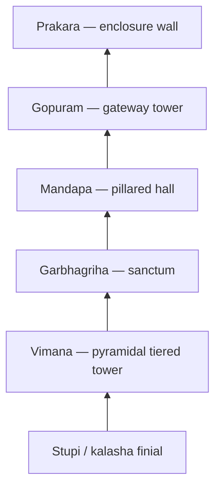

# Dravida Style Temple Architecture

> GS-1 · Topic 01 · Dravida (south Indian) temple architecture — vimana, gopuram, examples

---

## PYQs

| Year | M | Words | Question (EN) | प्रश्न (HI) | ID |
|------|---|-------|---------------|-------------|-----|
| — | 8 | 125 | *Likely:* Describe the salient features of Dravida style of temple architecture. | *संभावित:* द्रविड़ शैली की मंदिर वास्तुकला की प्रमुख विशेषताओं का वर्णन कीजिए। | Q1 |
| — | 8 | 125 | *Likely:* Compare Nagara and Dravida temple architecture. | *संभावित:* नागर और द्रविड़ मंदिर वास्तुकला की तुलना कीजिए। | Q2 |

---

## Quick Revision

```
STYLE: Dravida = SOUTH Indian Hindu temple idiom | Pyramidal tiered VIMANA
NOT: Nagara curvilinear shikhara (north) | NOT Mauryan stupa | Vesara = Deccan hybrid

PARTS: Garbhagriha (sanctum) → Vimana (pyramidal tower above) → Mandapa (hall)
  Gopuram = monumental GATEWAY tower (often taller than vimana in later temples)
  Prakara = enclosure wall | Pradakshina patha | Teppakulam (ritual tank)

PLAN: Square/square-derived sanctum | Complex = multiple shrines + gopurams + prakaras
MATERIAL: Granite (Tamil Nadu — Chola) | Sandstone (Pallava Kanchi) | Chloritic schist (Hoysala)

EVOLUTION:
  Pallava rock-cut (6th–8th c.) — Mahabalipuram rathas, Shore Temple
  Early structural (7th–9th c.) — Kailasanatha Kanchi, 58 subsidiary shrines
  Imperial Chola (10th–12th c.) — Brihadeshwara 216 ft granite vimana
  Vijayanagara/Nayak (14th–17th c.) — gopuram dominance (Meenakshi Madurai)

EXAMPLES:
  Brihadeshwara/Thanjavur (Rajaraja Chola, 11th c.) — UNESCO Great Living Chola Temples
  Kailasanatha/Kanchipuram (Pallava Narasimhavarman II, 8th c.)
  Shore Temple + Pancha Rathas/Mahabalipuram (Pallava, 7th–8th c.) — UNESCO 1984
  Gangaikonda Cholapuram (Rajendra I) | Airavatesvara/Darasuram (Chola)
  Meenakshi/Madurai (Nayak gopurams) | Srirangam (largest functioning complex)
  Hoysala Belur/Halebidu = Vesara hybrid — star-plan, NOT pure Dravida

vs NAGARA: Dravida = pyramidal vimana + gopuram | Nagara = curving shikhara + amalaka/kalasha
  Nagara mandapa = Phamsana roof | Dravida = concentric prakaras, granite mass

CONTEMPORARY: UNESCO Great Living Chola Temples (1987) · Mahabalipuram (1984)
  ASI + TN HR&CE · Art 49/51A(f) · NEP IKS vastushastra · Tamil Nadu temple tourism

TRAPS: Gopuram ≠ vimana | Brihadeshwara = Chola not Pallava | Kailasanatha Kanchi ≠ Ellora Kailasa
  Vesara ≠ pure Dravida | Gopuram dominance = later not Pallava origin | Shore Temple ≠ Nagara
```

---

## Content

### What Dravida temple architecture is

**Dravida** (Dravidian) architecture is the principal south Indian idiom of **Hindu temple building**, named in traditional **Vastushastra** texts for **Dravida desha** — the "south country" — in contrast to **Nagara** (north) and **Vesara** (Deccan hybrid). It evolved from the early historic period through the patronage of **Pallava, Chola, Pandya, Hoysala, Vijayanagara, and Nayak** dynasties across Tamil Nadu, Karnataka, Andhra Pradesh, and Kerala. Its mature form expresses a coherent sacred geography: a **square garbhagriha** (sanctum) crowned by a **pyramidal tiered vimana** (tower over the deity), surrounded by **mandapas** (pillared halls), enclosed within **prakara** (boundary walls) and entered through monumental **gopuram** (gateway towers).

Unlike the Nagara tradition of north India, where a **curvilinear shikhara** rises directly over the sanctum, Dravida architecture distributes vertical emphasis across the vimana and, in later centuries, across towering gopurams that often dominate the skyline more visibly than the sanctum tower itself. The style is not a single monolithic form but a continuous evolution from Pallava rock-cut experiments to Chola granite engineering to Vijayanagara-Nayak gateway grandeur.

### Core components and their functions

Every Dravida temple organises worship through a fixed vocabulary of architectural parts, each with ritual and structural logic:

| Component | Function |
|-----------|----------|
| **Garbhagriha** | Sanctum sanctorum — small, dark, square cella housing the main deity image (*murti*) |
| **Vimana** | Pyramidal tower above garbhagriha — tiered storeys (*talas*) with **karnas** (projections); the Dravida hallmark |
| **Shikhara** (Dravida sense) | Crowning **stupi/kalasha** finial atop the vimana — distinct from Nagara's curvilinear shikhara |
| **Mandapa** | Pillared hall for congregation — **maha-mandapa**, **artha-mandapa** (antechamber), **nritta-mandapa** (dance hall) |
| **Gopuram** | Monumental gateway tower at entrance — in later temples often taller and more ornate than the vimana |
| **Prakara** | Enclosure wall; may form multiple concentric rings around the sacred core |
| **Pradakshina patha** | Circumambulatory passage for clockwise ritual walking |
| **Teppakulam** | Ritual tank attached to the complex — characteristic of south Indian temple towns |



The vertical axis of the vimana symbolises **Mount Meru**, the cosmic mountain at the centre of the universe in Hindu and Jain cosmology. Devotees enter through the gopuram — passing from profane space into sacred enclosure — circumambulate the sanctum along the pradakshina patha, and receive *darshan* (vision) of the deity from the mandapa. The architecture thus encodes theology in stone.

### Salient features that define the style

Several characteristics distinguish Dravida from other Indian temple traditions. The **pyramidal vimana** rises in horizontal tiers that diminish upward, creating a stepped silhouette unlike the Nagara rekha (curving) profile. The **square garbhagriha** orients the deity for worship from the mandapa. **Sculptural richness** covers vimana tiers, gopuram faces, and mandapa pillars with narrative panels, **dvarapalas** (guardian doorkeepers), and niche deities. **Material choice** reflects regional geology: **granite** in Tamil Nadu under the Cholas; **sandstone** at Pallava **Kanchipuram**; **chloritic schist** for the intricate Hoysala temples of Karnataka.

A critical chronological nuance: **gopuram dominance** — the tendency for entrance towers to exceed the vimana in height and ornament — is a **later medieval feature** of the Vijayanagara and Nayak periods, not an original Pallava or early Chola characteristic. At the **Shore Temple (Mahabalipuram)** and **Brihadeshwara (Thanjavur)**, the vimana still commands the visual hierarchy.

| Sculptural element | Location | Function |
|--------------------|----------|----------|
| **Dvarapala** | Sanctum and mandapa doorways | Guardian figure marking sacred threshold |
| **Koshta deity** | Niches on vimana or gopuram faces | Cardinal directional gods (Brahma, Vishnu, Shiva, Durga) |
| **Narrative frieze** | Gopuram base and tiers | Puranic storytelling visible from street level |
| **Bronze utsava murti** | Processional worship | Mobile deity image during festivals |

**Chola lost-wax bronzes** — the **Nataraja** and **Parvati** icons — complement stone architecture; they were cast for temple processions and remain among the supreme achievements of Indian metalwork.

### Historical evolution: from rock-cut to gopuram grandeur

Dravida architecture passed through distinct phases, each building on the previous:

| Phase | Period | Character |
|-------|--------|-----------|
| **Rock-cut origins** | c. 6th–8th c. CE (Pallava) | Mahabalipuram caves and monolithic **Pancha Rathas** — architectural experiments in living rock |
| **Early structural** | c. 7th–9th c. CE | **Kailasanatha, Kanchipuram** — sandstone vimana with **58 subsidiary shrines** |
| **Imperial Chola** | c. 10th–12th c. CE | Granite vimanas at monumental scale — **Brihadeshwara** engineering |
| **Later medieval** | c. 14th–17th c. CE | Vijayanagara/Nayak — **gopuram** becomes tallest visual element |

The **Pallava** phase at **Mahabalipuram** produced both monolithic rock-cut **rathas** (chariot-shaped shrines — Dharmaraja, Arjuna, and others) and the structural **Shore Temple** by the sea, marking the transition from excavation to construction. The Shore Temple's location on the Coromandel coast exposed it to salt air and monsoon erosion — challenges that continue to inform ASI conservation strategy today. **Narasimhavarman II's Kailasanatha Temple at Kanchipuram** (8th century CE) established the Dravida vimana prototype with dozens of subsidiary shrines clustered around the main tower. Kanchipuram, one of the seven sacred cities (*sapta puri*) of Hindu tradition, became a laboratory where Pallava architects tested vimana proportions in sandstone before Chola builders scaled them in granite at Thanjavur.

The **Imperial Chola** period represents the engineering apex. **Rajaraja I's Brihadeshwara Temple (Rajarajesvaram) at Thanjavur** (11th century CE) rises **216 feet** in granite — a feat of quarrying, transport, and lifting whose ramp and leverage methods remain debated. Its monolithic **Nandi** bull (16 feet long, 13 feet high) sits before the sanctum. **Rajendra I** built **Gangaikonda Cholapuram** at rival scale; **Rajaraja II's Airavatesvara Temple at Darasuram** (Kumbakonam) displays intricate vimana sculpture. All three form the **UNESCO Great Living Chola Temples (1987)** — still active places of worship.

### Key monuments across dynasties

| Temple | Dynasty / period | Location | Distinguishing features |
|--------|------------------|----------|------------------------|
| **Shore Temple** | Pallava, 7th–8th c. CE | **Mahabalipuram** | Structural temple by sea; Shiva/Vishnu; Pallava transition from rock-cut |
| **Pancha Rathas** | Pallava, 7th c. CE | **Mahabalipuram** | Monolithic rock-cut rathas — architectural experiments |
| **Kailasanatha Temple** | Pallava (Narasimhavarman II), 8th c. CE | **Kanchipuram** | Sandstone; **58 subsidiary shrines**; vimana prototype |
| **Brihadeshwara (Rajarajesvaram)** | Chola (Rajaraja I), 11th c. CE | **Thanjavur** | **216 ft granite vimana**; monolithic Nandi; UNESCO site |
| **Gangaikonda Cholapuram** | Chola (Rajendra I) | Tamil Nadu | Rival scale to Brihadeshwara |
| **Airavatesvara (Darasuram)** | Chola (Rajaraja II) | Kumbakonam | UNESCO; intricate vimana sculpture |
| **Srirangam (Ranganathaswamy)** | Chola-Pandya-Vijayanagara layers | Trichy | Largest functioning temple complex; concentric prakaras |
| **Meenakshi Temple** | Pandya / Nayak | **Madurai** | Four painted gopurams — classic later Dravida emphasis |
| **Hoysaleswara** | Hoysala, 12th c. CE | **Halebidu** | **Vesara hybrid** — star-shaped plan, lathe-turned pillars |
| **Chennakesava (Belur)** | Hoysala, 12th c. CE | Karnataka | Vesara-Dravida blend; jewelled exterior carving |

### Vijayanagara and Nayak: the gopuram revolution

From the **14th through 17th centuries CE**, **Vijayanagara** and **Nayak** rulers enlarged gopurams to dominate the skyline — a political statement of renewed Hindu kingship after Delhi Sultanate incursions into the south. At **Hampi**, the **Virupaksha temple gopuram** and **Vitthala complex** demonstrate imperial scale in granite and brick. The **Madurai Nayaks** transformed **Meenakshi Temple** with four gopurams painted in vivid stucco, covered with puranic figures readable from street level — Ramayana, Mahabharata, and Shaiva/Vaishnava mythology rendered as public art. In this phase, the gopuram becomes the primary landmark; the vimana recedes visually. This is phase-specific: it cannot be projected backward onto Pallava or early Chola monuments.

### Temple as sacred town: economy, arts, and hydraulics

Dravida temples were never isolated shrines; they functioned as **economic and cultural hubs** of medieval south India. **Devadana** — land grants to temples — sustained Brahmin settlements, artisans, musicians, and temple servants, making the complex a landlord-institution controlling agricultural revenue. **Teppakulam** tanks stored monsoon water for ritual bathing and supplementary irrigation. **Utsavam** (festival) calendars drove pilgrimage, craft markets, and regional trade — **Madurai, Kanchipuram, Srirangam, and Rameswaram** operated as temple towns whose urban economy orbited the sanctum. **Bharatanatyam**, codified in the **Sadir** performance tradition, was performed in temple mandapas — performing arts and architecture were inseparable. Mandapa pillars carved with **yali** (leogriff), horse-mounted warriors, and dancing figures show how sculptural programme, ritual, and public spectacle converged.

### Dravida compared with Nagara and Vesara

The three classical pan-Indian temple idioms express the same Hindu worship logic through contrasting architectural vocabularies:

| Feature | **Nagara** (North) | **Dravida** (South) | **Vesara** (Deccan) |
|---------|-------------------|---------------------|---------------------|
| **Tower over garbhagriha** | Curvilinear **shikhara** | Pyramidal **vimana** (tiered) | **Hybrid** — combined features |
| **Entrance emphasis** | Torana / later walls | Monumental **gopuram** | Mixed — often ornate gateways |
| **Summit ornament** | **Amalaka + kalasha** | **Stupi** on vimana | Blended |
| **Region** | North and central India | Tamil Nadu, AP, Kerala | Karnataka (Hoysala) |
| **Material** | Sandstone (Khajuraho, Odisha) | Granite (Chola) | Chloritic schist (Hoysala) |
| **Examples** | Khajuraho, Konark, Deogarh | Brihadeshwara, Kailasanatha Kanchi | Belur, Halebidu |

**Vesara** architecture — flourishing under the **Hoysala dynasty** (11th–14th c. CE) — blends Nagara verticality with Dravida vimana tiers. Its **star-shaped (stellate) plan**, lathe-turned pillars, and exterior covered in continuous sculpture at **Belur, Halebidu, and Somnathpur** represent a Deccan hybrid, not pure Dravida — though it is often grouped with the south Indian tradition when contrasted with Nagara.

### Significance and enduring legacy

Dravida architecture defines the **south Indian sacred landscape**. Chola temples symbolised **imperial bhakti and state power** — Rajaraja's Brihadeshwara was as much a political monument as a religious one. The temple's scale communicated Rajaraja's authority over a maritime empire that traded with Southeast Asia; the 216-foot vimana visible across the Kaveri delta announced Chola sovereignty as clearly as any fortification. Pandya rulers at Madurai and Vijayanagara kings at Hampi and Srirangam continued this tradition of architecture-as-statecraft, each dynasty adding gopurams, mandapas, and prakaras that recorded their patronage in stone. The engineering achievement — quarrying and lifting granite to 216 feet without modern machinery — remains a benchmark of pre-industrial construction. Temples anchored the **bhakti movement** at Shaiva and Vaishnava centres: **Kanchi, Chidambaram, Srirangam, Madurai, Rameswaram**. The Dravida vimana-gopuram vocabulary is the standard south Indian counter-pole to Nagara rekha shikhara in every comparative study of Indian sacred architecture.

### Contemporary relevance

The **UNESCO Great Living Chola Temples (1987)** — **Brihadeshwara (Thanjavur), Gangaikonda Cholapuram, and Airavatesvara (Darasuram)** — remain active places of worship, demonstrating Dravida architecture as **living heritage**. The **Group of Monuments at Mahabalipuram (1984)** preserves Pallava rock-cut and structural transition under **ASI** management with coastal conservation challenges. Central **ASI** protects notified monuments while **Tamil Nadu Hindu Religious and Charitable Endowments (HR&CE)** administers many functioning temples — daily ritual continuity alongside conservation. **Article 49** and **Article 51A(f)** apply to Chola and Pallava complexes of national importance. **NEP 2020's IKS** integrates **Vastushastra, temple architecture, and iconography** into art-history and conservation programmes. **Tamil Nadu temple tourism** at Thanjavur, Madurai, Kanchipuram, and Rameswaram drives regional economy through **Swadesh Darshan** and state spiritual circuits. **Chola bronze casting** (lost-wax technique) and **Bharatanatyam** performance link medieval architecture to **living intangible heritage**. Conservation science addresses granite weathering, gopuram structural stability, and pigment loss through **ASI-INTACH** interventions.

### Limits

Dravida architecture is **not monolithic** — Pallava, Chola, Pandya, and Vijayanagara phases differ substantially. **Gopuram dominance is a later feature**, not present at Pallava Shore Temple or early Chola Brihadeshwara where the vimana still dominates. The tradition is **distinct from Buddhist chaitya halls, stupas, and Mauryan pillars**. **Kailasanatha at Kanchipuram** must not be confused with **Kailasa at Ellora** — the latter is a **Rashtrakuta rock-cut** monument, not a structural Dravida temple. **Hoysala Belur and Halebidu** are **Vesara hybrids**, not pure Dravida. **Srirangam** is the **largest functioning** Hindu temple complex, not a minor shrine. **Chola bronzes** were commissioned for the same temple worship programmes as the stone vimanas — they are integral, not separate, to Dravida artistic achievement.

---

## Answers

### Q1: Describe the salient features of Dravida style of temple architecture. (Likely PYQ)

**Opening:**
> Dravida style is the classic south Indian Hindu temple architecture distinguished by a pyramidal tiered vimana over the garbhagriha, enclosed within prakara walls and entered through monumental gopuram gateway towers.

**Write these points:**
- **Plan and parts:** **Garbhagriha** (sanctum) + **vimana** (pyramidal tower with talas/storeys) + **mandapa** (pillared halls); **prakara** (enclosure), **pradakshina patha**, ritual tanks.
- **Gopuram:** Monumental **gateway tower** — in later temples often taller than vimana — south Indian visual signature.
- **Material and examples:** Pallava **Kailasanatha (Kanchi)** and Mahabalipuram; Chola **Brihadeshwara (Thanjavur)** — 216 ft granite vimana; sculptural narrative panels and dvarapalas.
- **Evolution:** Pallava rock-cut (Mahabalipuram rathas) → structural granite Chola imperial temples → Vijayanagara gopuram grandeur.
- Temples as **bhakti, economic, and cultural centres** — land grants, festivals, performing arts.
- **Present link:** **UNESCO Chola Temples** and **Mahabalipuram** under **ASI** — living worship plus global heritage status.

**Conclusion:**
> Dravida architecture thus embodies the south Indian temple ideal — pyramidal vimana, gopuram gateway, and prakara-enclosed sacred complex — forming the counter-tradition to Nagara shikhara architecture of the north.

---

### Q2: Compare Nagara and Dravida temple architecture. (Likely PYQ)

**Opening:**
> Nagara and Dravida represent the two classical pan-Indian Hindu temple idioms — north emphasising curvilinear shikhara over the sanctum, south emphasising pyramidal vimana and gopuram gateways within prakara enclosures.

**Write these points:**
- **Tower form:** Nagara = **curvilinear shikhara** with **amalaka-kalasha** summit (Khajuraho, Konark); Dravida = **pyramidal tiered vimana** with stupi (Brihadeshwara, Kailasanatha Kanchi).
- **Entrance:** Nagara uses **torana**/walls; Dravida develops monumental **gopuram** — often dominant visual element in later period.
- **Plan:** Both use **garbhagriha + mandapa + pradakshina**; Dravida favours **concentric prakaras** and multiple subsidiary shrines; Nagara **panchayatana** (five-shrine) plan common in north.
- **Material/regional:** Nagara — sandstone (Khajuraho, Odisha); Dravida — **granite** (Chola Thanjavur), sandstone (Pallava Kanchi).
- **Vesara (Hoysala)** as Deccan **hybrid** — star-plan, intricate sculpture — bridges both traditions.
- **Heritage today:** **UNESCO Chola Temples** and **Mahabalipuram** exemplify Dravida legacy under **ASI** protection.

**Conclusion:**
> Together Nagara and Dravida map the regional sacred geography of medieval India — same Hindu worship logic expressed through contrasting architectural vocabularies.

---

## Traps

| Wrong | Correct |
|-------|---------|
| Dravida = curvilinear shikhara | Dravida = **pyramidal vimana**; curvilinear = **Nagara** |
| Gopuram = vimana | **Gopuram = gateway tower**; **vimana = tower over garbhagriha** |
| Brihadeshwara = Pallava temple | **Chola** (Rajaraja I, 11th c.) — Thanjavur granite |
| Kailasanatha = Ellora Kailasa | Kanchi = **Pallava structural**; Ellora = **Rashtrakuta rock-cut** |
| Dravida = only Chola period | **Pallava origins** (Mahabalipuram, Kanchi) → Chola → Vijayanagara |
| Hoysala = pure Dravida | **Vesara hybrid** — star-plan, Deccan blend |
| Shore Temple = Nagara | **Pallava Dravida** — Mahabalipuram |
| All south temples have tall gopurams | **Early Dravida** (Pallava/Chola vimana focus) — gopuram dominance = **later** |
| Dravida = Mauryan architecture | Mauryan = **stupas/pillars**; Dravida temples = **post-Gupta/Pallava** onward |
| Brihadeshwara not UNESCO | Part of **Great Living Chola Temples (UNESCO 1987)** |
| Mahabalipuram unrelated to Dravida | **Pallava Dravida** rock-cut origin — **UNESCO 1984** |
| Gopuram always taller than vimana | True mainly in **Vijayanagara/Nayak later phase** — not early Pallava/Chola |
| Dravida temples no longer functional | **Great Living Chola Temples** = active worship — living heritage |
| ASI irrelevant to south temples | **ASI** central protection + **TN HR&CE** local management |
| NEP has no architecture content | **NEP 2020 IKS** includes **vastushastra/temple architecture** |
| Srirangam = small shrine | **Largest functioning** Hindu temple complex — concentric prakaras |
| Chola bronzes unrelated to temples | **Lost-wax bronzes** commissioned for same **Dravida temple** worship |

---

*Complete.*
