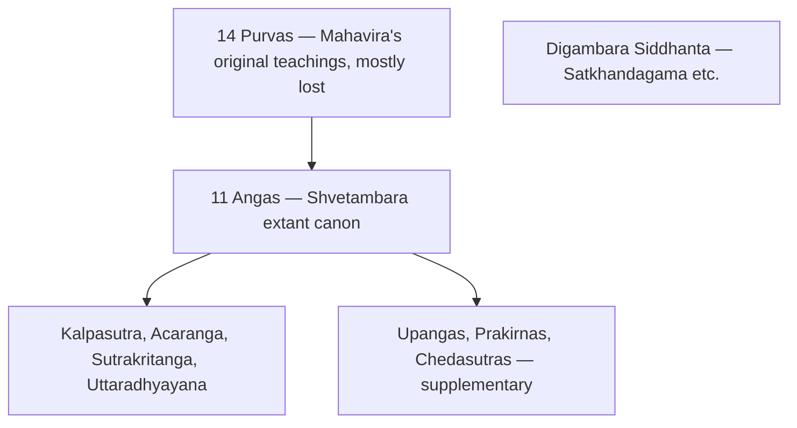
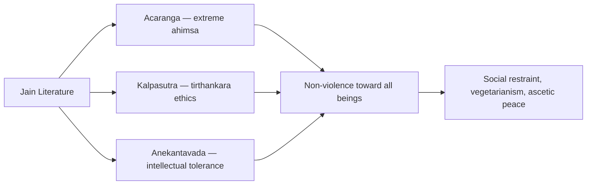

# Jain Literature

> GS-1 · Topic 01 · Jain texts — Angas, Purvas, Prakrit canon, historical value

---

## PYQs

| Year | M | Words | Question (EN) | प्रश्न (HI) | ID |
|------|---|-------|---------------|-------------|-----|
| — | 8 | 125 | *Likely:* Discuss the salient features of Jain literature and its historical value. | *संभावित:* जैन साहित्य की प्रमुख विशेषताओं और इसके ऐतिहासिक महत्व की विवेचना कीजिए। | Q1 |
| — | 8 | 125 | *Likely:* Compare Jain and Buddhist literature as sources of ancient Indian history. | *संभावित:* प्राचीन भारतीय इतिहास के स्रोत के रूप में जैन और बौद्ध साहित्य की तुलना कीजिए। | Q2 |

---

## Quick Revision

```
CORE: Angas (11 extant Shvetambara) + lost Purvas (14) | Digambara: Siddhanta texts
LANGUAGE: Ardhamagadhi · Maharashtri Prakrit — NOT Sanskrit elite (early canon)

KEY TEXTS:
  Acaranga Sutra (Anga 1) — oldest Jain text; extreme ahimsa, ascetic conduct
  Kalpasutra (Bhadrabahu) — Mahavira's life, tirthankara genealogy, Paryushana
  Sutrakritanga · Uttaradhyayana — ethics, debate with rival sects
  Chedasutras (6) — monastic discipline | Upangas · Prakirnas — supplementary

LOST PURVAS: 14 original teachings of Mahavira — basis of Angas; mostly lost after schism
SECTS: Shvetambara (white-clad, 11 Angas) | Digambara (sky-clad, Siddhanta — Satkhandagama)

CONTRAST BUDDHIST TRIPITAKA:
  Jain Angas vs Vinaya-Sutta-Abhidhamma | Both Prakrit/Pali | Both eastern Magadha
  Jain ahimsa = extreme (all life) | Buddhist = Middle Path
  Jain anekantavada/syadvada | Buddhist Middle Path pragmatism

HISTORICAL VALUE: Magadha society · Vaishali · Kundagrama (Mahavira birthplace)
  Trade/urban life · kings (Ajatashatru, Chandragupta) · Jain patronage networks
  Ashokan edicts mention Nirgranthas · Hathigumpha — Kharavela Jain patronage

PEACE/AHIMSA: Ahimsa paramo dharma · Anekantavada (intellectual tolerance)
  Lay anuvratas (five small vows) · vegetarianism · shravaka merchant ethics

CONTEMPORARY: Palitana · Ranakpur · Dilwara pilgrimage · Art 49/51A(f)
  NEP 2020 IKS (anekantavada) · Jain manuscript conservation · GI/craft revival

TRAPS: ≠ Buddhist Tripitaka | Purvas mostly LOST | Digambara ≠ Shvetambara canon
  Kalpasutra = Jain not Buddhist | Acaranga = oldest Anga not medieval
```

---

## Content

### What Jain literature is and why it matters

Jain literature is the canonical and supplementary textual tradition of the **shramana** movement founded by **Mahavira** (the 24th **tirthankara**) in the **6th century BCE**. It records the teachings of tirthankaras, monastic discipline, cosmology, ethics, and sectarian history across two millennia. Unlike the Sanskrit-dominated brahmanical corpus, the early Jain canon was composed deliberately in **Ardhamagadhi** and other **Prakrits** — the vernacular languages of eastern Magadha — making religious knowledge accessible outside priestly elites. This linguistic choice parallels Buddhist use of Pali and reflects the shared heterodox challenge to Vedic sacrificial orthodoxy in the Gangetic cities of the second urbanisation.

For historians, Jain literature documents **Magadha, Vaishali, Kundagrama** (Mahavira's birthplace near Vaishali), urban merchants, guild organisation, and Jain patronage networks from the Mahajanapada age through Mauryan and post-Mauryan centuries. Cross-checked with **Ashokan edicts** (which mention **Nirgranthas**, the Jain ascetics) and inscriptions such as the **Hathigumpha inscription of Kharavela** (1st century BCE, Udayagiri, Odisha), it forms an indispensable heterodox source for ancient eastern India.

### Structure of the Jain canon: Purvas, Angas, and sectarian splits

Jain scripture is organised differently from the Buddhist Tripitaka. Tradition holds that Mahavira's original teachings filled **14 Purvas** — texts now **largely lost** after sectarian schisms and oral transmission gaps. The surviving **Shvetambara** canon derives from these Purvas through **11 extant Angas** (the 12th Anga is lost), supplemented by **Upangas, Prakirnas, and Chedasutras**. The **Digambara** sect rejects the Shvetambara Angas as fully authentic and preserves its own **Siddhanta** literature, notably the **Satkhandagama** (a later compilation).

| Category | Status | Content |
|----------|--------|---------|
| **Purvas** | **14 texts — largely lost** | Original doctrinal corpus attributed to Mahavira's disciples; basis from which Angas derived |
| **Angas** | **11 extant** (12th lost) | Core canonical texts — ethics, cosmology, monastic life, legends |
| **Upangas** | 12 texts | Supplementary — geography, astronomy, narrative |
| **Prakirnas** | 10 texts | Mixed topics — conduct, stories |
| **Chedasutras** | 6 texts | Monastic discipline — parallel to Buddhist Vinaya Pitaka |



The two sects — **Shvetambara** ("white-clad," 45 texts including 11 Angas) and **Digambara** ("sky-clad," Siddhanta tradition) — preserve **different canons**, so "Jain literature" is not a single uniform corpus but a family of related textual traditions united by tirthankara theology and ahimsa ethics.

### Key texts and what each preserves

| Text | Nature | What it preserves |
|------|--------|-------------------|
| **Acaranga Sutra** | Oldest Jain text (Anga 1) | **Extreme ahimsa** — careful walking, straining water to avoid harming organisms; ascetic conduct code |
| **Kalpasutra** | Attributed to **Bhadrabahu** | **Mahavira's life**, genealogy of tirthankaras, monastic rules; recited at **Paryushana** festival |
| **Sutrakritanga** | Anga text | Debates with rival teachers; social and religious polemics |
| **Uttaradhyayana** | Anga text | Ethics, death contemplation, disciple instruction |
| **Nayadhammakahao** | Prakirna | Stories of merchants and kings — social vignettes |
| **Parisishtaparvana** (Hemachandra) | Later Sanskrit | **Kumarapala** (Gujarat) biography — medieval Jain patronage |

The **Acaranga Sutra** opens the Anga series and establishes Jainism's most distinctive ethical claim: non-violence toward **all living beings**, including insects and plants (conceptually), enforced through ascetic practices such as straining drinking water and sweeping the path before walking. Its opening books describe the ascetic's obligation to inspect the ground before each step — a literal embodiment of ahimsa that no other ancient Indian tradition codified with comparable rigour. The **Kalpasutra** provides the biographical backbone — Mahavira's birth at **Kundagrama** near **Vaishali**, renunciation at age thirty, twelve years of asceticism, enlightenment, and the lineage of prior tirthankaras — making it the Jain equivalent of Buddhist Jataka and Buddhacharita traditions combined. Recited annually during the **Paryushana** festival, the Kalpasutra binds living Jain communities to their textual past through ritual performance, not merely silent reading. **Sutrakritanga** preserves polemical debates with rival teachers, revealing the competitive religious marketplace of 6th–5th century BCE Magadha where shramana movements contested brahmanical authority on rational and ethical grounds rather than through sacrificial ritual alone.

### Salient features: language, ahimsa, and philosophical pluralism

Jain literature is defined by five interlocking characteristics. **Prakrit language**: early canon in **Ardhamagadhi** democratised religious knowledge against Sanskrit brahminical monopoly, exactly as Pali served Buddhism. Monks and nuns preached in the same vernacular they recorded, ensuring that ethical instruction reached merchant caravans and artisan quarters rather than remaining confined to priestly households. **Extreme ahimsa**: the Acaranga codifies non-violence toward every form of life — stricter than the Buddhist Middle Path, which permitted agriculture and moderate household living. **Anekantavada and Syadvada**: the doctrine of **many-sidedness of truth** and **conditional predication** ("in some respect, it is…") model intellectual tolerance — truth has multiple valid perspectives, and dogmatic absolutism is itself a form of violence. **Cosmological cyclical time**: texts describe **lokakasha** cosmology with **Mount Meru**, **bharata-kshetra**, and alternating **avasarpini/utsarpini** time cycles — rich for intellectual history though less useful for linear political chronology. **Historical embeddedness**: references to **Magadha kings** (Ajatashatru, Shrenika/Bimbisara), merchants, guilds, and urban professions appear throughout the Angas and Prakirnas.

### Peace, ahimsa, and the radical ethics of non-violence

Jain literature articulates India's most radical ancient peace ethic — ahimsa not as moderation but as **supreme duty** (*ahimsa paramo dharma*).

| Concept | Text / tradition | Peace message |
|---------|------------------|---------------|
| **Ahimsa paramo dharma** | Acaranga, all Angas | Non-violence as supreme duty — physical, verbal, and mental |
| **Anekantavada** | Philosophical sutras | Tolerance of multiple truths — reduces sectarian conflict |
| **Ascetic restraint** | Kalpasutra, Chedasutras | Self-discipline as foundation of social harmony |
| **Lay vows (anuvratas)** | Later texts | Five small vows for householders — scaled-down non-violence |



The peace ethic extends beyond physical non-killing. **Anekantavada** treats intellectual intolerance as violence — a framework for debate without dogmatic closure that contrasts sharply with absolutist religious claims. **Lay anuvratas** (five small vows) extend scaled-down non-violence to **shravaka** (householder) merchants, creating an ethical code for commercial life. Jain literature's peace ethic is **more radical** than Buddhist ahimsa — it influenced Indian **vegetarian food culture**, trading communities, and ideals of ethical commerce through the **shravaka** merchant networks that patronised Jain temples across western and southern India.

### Jain literature compared with Buddhist Tripitaka

Both traditions emerged in the same eastern Magadhan milieu as parallel Prakrit-language heterodox corpora:

| Aspect | Jain literature | Buddhist literature (Tripitaka) |
|--------|-----------------|--------------------------------|
| **Core structure** | **Angas** (+ lost **Purvas**) | **Vinaya, Sutta, Abhidhamma** + five Nikayas |
| **Language** | **Ardhamagadhi/Prakrit** | **Pali/Prakrit** early; Sanskrit Mahayana later |
| **Founder focus** | **24 Tirthankaras** — Mahavira central | **Gautama Buddha** — single historical founder |
| **Ahimsa** | **Extreme** — all life forms | **Middle Path** — moderate, practical |
| **Monastic rules** | **Chedasutras**, Kalpasutra | **Vinaya Pitaka** |
| **Historical utility** | Eastern India, trade, ascetic networks | Jataka urban life, Ashoka, Mauryan Buddhism |
| **Councils** | Jain councils at **Pataliputra** (3rd–4th c. CE) | Buddhist councils (Rajgriha, Vaishali, Pataliputra) |

Neither corpus is a neutral chronicle. Both require cross-verification with **edicts, inscriptions, and archaeology**. Used comparatively, they provide the richest literary window on post-Vedic **Magadha**.

### Historical value: polity, economy, religion, and art

Jain literature preserves geography and polity references to **Magadha, Vaishali, and Kundagrama** (Mahavira's birthplace). It documents **urban and economic life** — merchant ethics, **shreni** guilds, and banking traditions (later Jain **hundi** culture has roots in **shravaka** commercial values). The **Nayadhammakahao** contains merchant-king stories illuminating social hierarchy and trade practices. As religious history, Jainism parallels Buddhism as a **shramana** movement explaining the spread of heterodox ideas during second urbanisation.

The literature also connects to material culture. Jain patronage built temples at **Mathura, Khajuraho (Parsvanatha), Dilwara (Mount Abu), Ranakpur, and Palitana** — the textual **24 tirthankara** lineage explains iconographic programmes across these sites, where each tirthankara is depicted in a fixed posture (standing or seated) with identifying symbols such as the lion of Mahavira or the serpent of Parshvanatha. **Ashokan edicts** mention Nirgranthas; the **Hathigumpha inscription** records **Kharavela's** Jain patronage in Kalinga — inscriptional corroboration for literary claims about royal support of the shramana order.

Tradition associates **Chandragupta Maurya** with Jain affiliation (reputed migration to Shravanabelagola with Bhadrabahu), though this must be treated as tradition rather than confirmed history. **Kumarapala's** 12th-century Gujarat patronage appears in Hemachandra's **Parisishtaparvana**, documenting medieval Jain royal support. The **Chedasutras** — six texts governing monastic conduct — parallel the Buddhist Vinaya Pitaka in function but exceed it in austerity: Jain monks and nuns renounce even ownership of cloth in the Digambara tradition, a prescription recorded in textual form that shaped the visual identity of sky-clad ascetics across centuries. For the historian reconstructing ancient **Magadha society**, Jain Angas name kings (**Ajatashatru**, **Shrenika/Bimbisara**), describe urban professions, and reference the same guild (*shreni*) organisation that Buddhist Jataka tales document — providing independent corroboration for economic structures of the second urbanisation. The **Upangas** add geographic and astronomical knowledge, while **Prakirnas** preserve narrative vignettes of merchants navigating moral dilemmas — literary evidence that Jain ethics were designed for commercial communities, not only forest ascetics. When read alongside **Ashokan edicts** mentioning Nirgranthas and the **Hathigumpha inscription** of Kharavela (who restored Jain temples and patronised monks in 1st century BCE Kalinga), Jain literature forms part of a triangulated evidentiary base — text, inscription, and archaeology — for reconstructing heterodox religion in ancient India.

### Contemporary relevance

**Palitana (Gujarat)** — the sacred Shatrunjaya hill with hundreds of temples — **Ranakpur** and **Dilwara (Mount Abu)** marble temples, and **Shravanabelagola (Karnataka)** with the Gommateshwara monolith remain active pilgrimage sites rooted in tirthankara cosmology and ahimsa ethics. **ASI-protected monuments** — **Khajuraho Parsvanatha temple**, **Kankali Tila (Mathura)** Jain remains, **Hathigumpha (Udayagiri, Odisha)** — provide material evidence complementing literary sources under **Article 49** and **Article 51A(f)** heritage duties. **NEP 2020's IKS** teaches Jain **anekantavada** and **syadvada** as India's early pluralism and logic tradition. **Jain Manuscript Preservation Project**, **Bhandarkar Oriental Research Institute (Pune)**, and the **National Mission for Manuscripts** preserve Prakrit/Ardhamagadhi texts. Jain literature's **extreme non-violence** shaped Indian **vegetarian culture**, **animal welfare** discourse, and **ethical commerce** ideals. **GI-tagged crafts** in regions of historical Jain **shravaka** patronage connect medieval manuscript illumination and handloom traditions to contemporary craft economy. **Rajasthan Jain temple circuits** (Ranakpur-Dilwara), **Gujarat Palitana-Shatrunjaya**, and **Karnataka Shravanabelagola** sustain pilgrimage economies. **Anekantavada** is cited in modern **interfaith dialogue** and constitutional tolerance debates as an indigenous framework for pluralism.

### Limits

Jain literature's **cosmological framing** — tirthankara cycles spanning aeons — mixes history with mythology; genealogies cannot be read as precise chronology. The **14 Purvas are lost**; the 11 extant Angas are derivative compilations fixed in writing after centuries of oral transmission (chiefly **3rd–4th c. CE** Jain councils at Pataliputra). **Shvetambara and Digambara canons differ** — there is no single "Jain Bible." The corpus carries an **ascetic bias**: lay life and non-Jain communities appear less fully than monastic ideals. **Kalpasutra is Jain**, not Buddhist. **Acaranga** is the oldest Anga, not a medieval text. Jain **ahimsa** is **extreme**, not identical to the Buddhist **Middle Path**. All 14 Purvas are **not extant** — only the Anga derivatives survive.

---

## Answers

### Q1: Discuss the salient features of Jain literature and its historical value. (Likely PYQ)

**Opening:**
> Jain literature — composed mainly in Ardhamagadhi Prakrit — forms the canonical record of the shramana tradition founded by Mahavira, offering both a radical ethics of non-violence and a vital source for ancient eastern Indian history.

**Write these points:**
- **Corpus:** **11 Angas** (Shvetambara) derived from lost **14 Purvas**; key texts — **Acaranga Sutra**, **Kalpasutra**, **Sutrakritanga**; Digambara **Siddhanta** tradition separate.
- **Features:** **Prakrit** language; **extreme ahimsa**; **anekantavada** (non-absolutism); cosmological cyclical time; monastic **Chedasutras**.
- **Historical value:** Documents **Magadha, Vaishali**, urban merchants, guilds, kings; complements archaeology and **Ashokan** references to Nirgranthas.
- **Peace ethic:** Non-violence to all living beings — stricter than Buddhist Middle Path; shaped ascetic and lay **shravaka** culture.
- **Present link:** **Palitana/Ranakpur pilgrimage**, **NEP IKS anekantavada**, and **ASI Jain monuments** keep literature's ethics and history publicly alive.

**Conclusion:**
> Jain literature thus stands as an essential heterodox archive — preserving ancient India's ethical radicalism and eastern Gangetic social history alongside Buddhist and Brahmanical sources.

---

### Q2: Compare Jain and Buddhist literature as sources of ancient Indian history. (Likely PYQ)

**Opening:**
> Jain and Buddhist literatures are parallel Prakrit-language corpora documenting the shramana revolution in post-Vedic Magadha — equally vital yet structurally and ideologically distinct.

**Write these points:**
- **Structure:** Jain **Angas/Purvas** vs Buddhist **Tripitaka** (Vinaya, Sutta, Abhidhamma) with **five Nikayas** — both orally transmitted before writing.
- **Language and audience:** Both use **Prakrit** (Ardhamagadhi/Pali) for mass accessibility against Sanskrit brahmanical monopoly.
- **Historical data:** Both record **Mahajanapadas, urban economy, merchants**; Buddhist **Jataka/Mahavamsa** stronger on **Ashoka**; Jain texts on **tirthankara lineage** and Jain royal/merchant patronage.
- **Ideology:** Jain **extreme ahimsa** and **anekantavada** vs Buddhist **Middle Path** and **Eightfold Path** — different social prescriptions.
- **Method:** Neither is neutral chronicle — corroborate with **edicts, archaeology, inscriptions** (Kharavela, Ashoka).

**Conclusion:**
> Together they provide the richest literary window on ancient India's heterodox age — best read comparatively, not in isolation.

---

## Traps

| Wrong | Correct |
|-------|---------|
| Jain canon = Tripitaka | Jain = **Angas** (+ lost **Purvas**); Tripitaka = **Buddhist** |
| All 14 Purvas extant | **Purvas mostly LOST** — Angas are surviving derivative canon |
| Jain literature in Sanskrit originally | Early canon = **Ardhamagadhi/Prakrit** |
| Jain ahimsa = Buddhist ahimsa | Jain = **extreme** (all life); Buddhist = **Middle Path** |
| Shvetambara = Digambara same canon | **Different canons** — Shvetambara Angas vs Digambara Siddhanta |
| Kalpasutra = Buddhist text | **Jain** — Mahavira life, Bhadrabahu tradition |
| Jain texts = no historical data | Rich on **Magadha, trade, urban life** — use critically |
| Acaranga = later medieval text | **Oldest Jain Anga** — extreme ahimsa code |
| Jain literature = only religious | Also **social-economic** source for ancient eastern India |
| Only Mahavira in all texts | **24 Tirthankaras** — full cosmological lineage |
| Anekantavada irrelevant today | **NEP 2020 IKS** — pluralism/tolerance framework from Jain philosophy |
| Jain literature no pilgrimage link | **Palitana, Ranakpur, Dilwara** — active sites rooted in textual tradition |
| Hathigumpha unrelated to Jain texts | **Kharavela inscription** corroborates Jain patronage in literature |

---

*Complete.*
