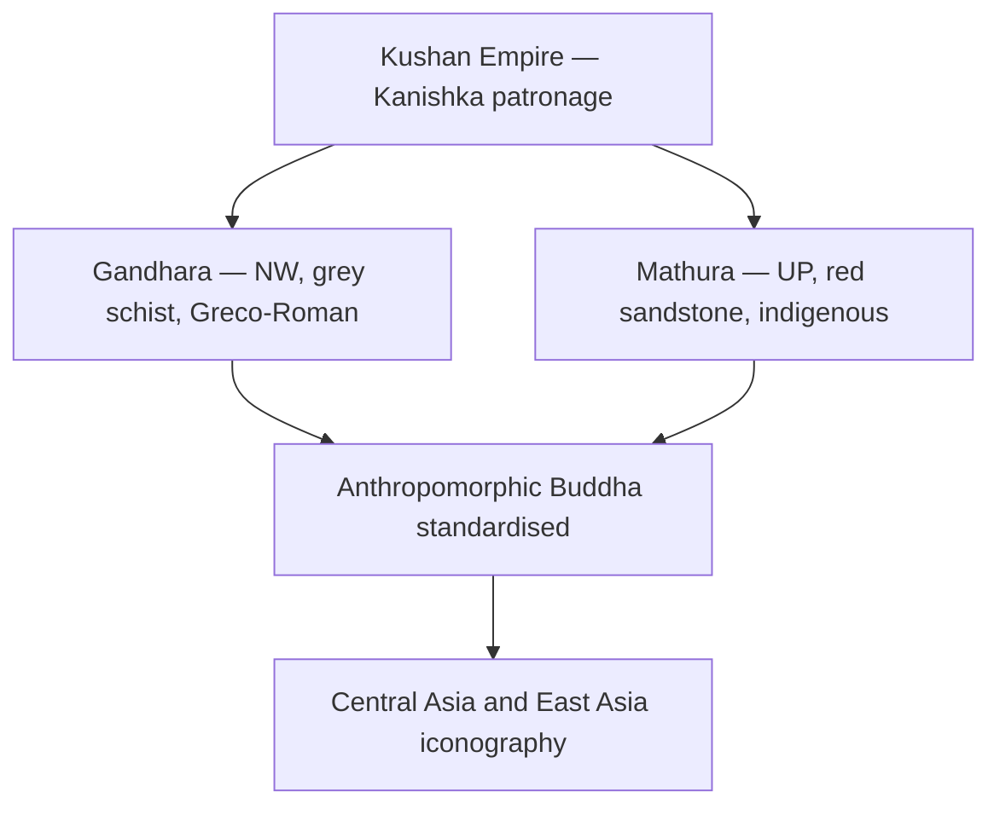

# Kushan Art — Gandhara & Mathura Schools

> GS-1 · Topic 01 · Gandhara vs Mathura art, Kanishka patronage, Mahayana link

---

## PYQs

| Year | M | Words | Question (EN) | प्रश्न (HI) | ID |
|------|---|-------|---------------|-------------|-----|
| — | 8 | 125 | *Likely:* Compare Gandhara and Mathura schools of art. | *संभावित:* गांधार और मथुरा कला शैलियों की तुलना कीजिए। | Q1 |
| — | 8 | 125 | *Likely:* Discuss the contribution of Kushan patronage to Indian art and religion. | *संभावित:* भारतीय कला और धर्म में कुषाण संरक्षण के योगदान की विवेचना कीजिए। | Q2 |

---

## Quick Revision

```
PERIOD: Kushan Empire c. 1st–3rd c. CE | Kanishka peak (c. 127–150 CE)
CAPITALS: Purushapura (Peshawar) · Mathura (UP) · Taxila region

TWO SCHOOLS: Gandhara (NW — Peshawar, Taxila, Swat, Hadda) | Mathura (UP — Yamuna)

GANDHARA: Grey schist / bluish-grey stone | Greco-Roman (Hellenistic) influence
  Wavy hair Buddha · Apollo-like face · toga-like sanghati · realistic anatomy
  Jataka reliefs · bodhisattvas (Maitreya, Avalokiteshvara) · Corinthian columns in background
  Silk Route transmission to Central Asia · China · Japan

MATHURA: Red sandstone (Sikri range quarries) | Indigenous Indian style
  Spiritual calm · fleshy/youthful body · transparent clinging drapery
  Buddhist + Jain + Hindu Yaksha/Yakshi · Kushan royal portraits (Kanishka, Huvishka)
  UP angle: Mathura = major Kushan workshop on Yamuna — imperial capital region

KANISHKA: 4th Buddhist Council (Kashmir/Jalandhar tradition) | Mahayana patronage
  Gold dinars — Buddha, Shiva, Nanaia syncretism | Grand stupas (Peshawar Kanishka stupa)

AMARAVATI (3rd school): Andhra · white/green limestone · Satavahana-Kushan overlap
  Dynamic narrative panels · tribhanga · lotus motifs — ≠ Gandhara/Mathura but exam-compared

ICONOGRAPHY SHIFT: Aniconic (wheel, footprints) → Anthropomorphic Buddha (Kushan standardisation)
  Mathura type → pan-India canonical | Gandhara type → Silk Route export

STUPA ART: Gandhara — narrative friezes, Corinthian columns | Mathura — railing reliefs, yaksha panels
  Kanishka stupa Peshawar (lost) — described by Xuanzang

GANDHARA SYNCretism: Herakles-Vajrapani · Atlas figures · stucco over brick (Hadda)
MATHURA MULTI-FAITH: Kankali Tila Jain · Yaksha/Yakshi · Kushan royal portraits on coins

CONTEMPORARY: Mathura Archaeological Museum (ASI) · Buddhist Circuit UP
  Art 49/51A(f) · NEP IKS art history · Gandhara repatriation debates · Incredible India

TRAPS: Gandhara ≠ Mathura material | Kanishka 4th ≠ Ashoka 3rd Council | Amaravati = south not NW
  Buddha Apollo-like = Gandhara only | Mathura = Jain+Hindu+Buddhist | Gandhara mostly outside modern India
```

---

## Content

### The Kushan world and the birth of the Buddha image

The **Kushan Empire** (c. **1st–3rd century CE**) stretched from Central Asia across the northwestern subcontinent into the Gangetic plain, with capitals at **Purushapura (Peshawar)**, **Mathura** in Uttar Pradesh, and the **Taxila** region. Under **Kanishka** (c. **127–150 CE**), the empire reached its zenith as a patron of Buddhism, art, and Silk Route commerce. The Kushan period marks the most consequential revolution in Indian religious art: the transition from **aniconic** representation of the Buddha (through symbols alone) to **anthropomorphic** images that would define Buddhist visual culture across Asia for two millennia.

Before the Kushan age, Buddhist art at sites like **Sanchi and Bharhut** depicted the Buddha through **footprints, wheels, thrones, and Bodhi trees** — never in human form. Kushan workshops at **Gandhara** in the northwest and **Mathura** on the Yamuna solved this representational problem simultaneously but differently, producing two distinct sculptural schools whose typologies would compete, merge, and propagate along trade routes from India to China and Japan.

### Gandhara and Mathura: two schools compared

| Feature | **Gandhara School** | **Mathura School** |
|---------|---------------------|-------------------|
| **Region** | Northwest — **Gandhara** (Peshawar, Taxila, Swat, Hadda) | **Mathura** (UP) — Yamuna basin |
| **Material** | **Grey schist** / bluish-grey stone | **Red sandstone** (Sikri range quarries) |
| **Style influence** | **Greco-Roman (Hellenistic)** — legacy of Alexander and Bactrian Greeks | **Indigenous Indian** — local sculptural tradition |
| **Buddha image** | Wavy hair, **Apollo-like face**, toga-like **sanghati**, realistic anatomy | **Spiritual calm**, fleshy/youthful body, **transparent drapery** clinging to body |
| **Other subjects** | Buddhist dominant; Greco-Buddhist syncretism | **Buddhist + Jain + Hindu** (Yaksha/Yakshi, Kushan royal portraits) |
| **Trade link** | **Silk Route**, Roman contact | Gangetic heartland, imperial capital zone |



### Gandhara school: Hellenistic naturalism on the Silk Route

Gandhara sculpture emerged in the Buddhist heartland of the northwest — a region shaped by centuries of **Indo-Greek, Bactrian, and Parthian** contact after Alexander's campaigns. Gandhara artists translated Buddhist narrative into stone using the visual language of **Greco-Roman naturalism**: realistic human anatomy, heavy drapery folds, and architectural backgrounds featuring **Corinthian columns**.

The Gandhara Buddha appears as a human god with wavy hair gathered in an **ushnisha** (cranial protuberance), sometimes a moustache in early examples, and a face modelled on the **Apollo** type of Hellenistic sculpture. The monastic **sanghati** (robe) falls in folds resembling a **Roman toga**. Narrative **relief panels** depict Jataka scenes, episodes from the Buddha's life, and **bodhisattvas** — **Maitreya** (future Buddha) and **Avalokiteshvara** (compassion deity) — with distinctly Hellenistic facial features.

Beyond schist, Gandhara workshops used **stucco (lime plaster)** over brick cores at sites like **Hadda and Taxila** — a cheaper, faster medium for monastery and stupa decoration. **Greco-Buddhist syncretism** produced remarkable hybrids: **Herakles-Vajrapani** as the Buddha's protector; **Atlas figures** supporting stupa bases; **Corinthian pilasters** framing Indian divine narratives. Chinese pilgrims **Faxian** and **Xuanzang** described **Kanishka's grand stupa at Peshawar** — literary corroboration for lost monumental architecture.

Gandhara's historical significance lies in transmission. Through the **Silk Route**, its naturalistic Buddha and bodhisattva types influenced **Central Asian mural traditions** (Kizil, Dunhuang) and carried Mahayana iconography into **China and Japan**. Gandhara is closely linked to **Mahayana** development — the bodhisattva cult and rich narrative panels visualise the theology of **Lotus and Prajnaparamita** sutra traditions. Stupa complexes at **Taxila, Jamalgarhi, and Butkara (Swat)** display narrative friezes in which Jataka stories unfold across multiple registers — a visual sermon for illiterate pilgrims who could "read" the Buddha's moral biography in stone before learning to read text. The **stucco tradition** at **Hadda** allowed mass production of Buddha heads and bodhisattva figures for monastery niches, democratising sacred art in ways that single schist blocks could not. Even after Kushan political decline, Gandhara workshops continued influencing Afghan and Central Asian sculpture well into the Gupta period, proving that the school's geographic reach exceeded its dynastic patron's lifespan.

### Mathura school: indigenous spirituality on the Yamuna

Mathura, on the Yamuna in **Uttar Pradesh**, was not a provincial workshop but a **major Kushan artistic and political centre** connecting the empire's northwestern and Gangetic zones. Its sculptors worked in **red sandstone** from the **Sikri quarries**, producing a warm-toned, fine-grained material ideal for large-scale figures and intricate relief.

The Mathura Buddha contrasts sharply with Gandhara. Where Gandhara pursued Hellenistic realism, Mathura pursued **spiritual serenity**: broad chest, fleshy youthful body, and **transparent clinging drapery** that reveals rather than conceals the form beneath. The canonical iconographic markers — **ushnisha, urna** (forehead mark), elongated earlobes, **abhayamudra** (gesture of fearlessness) — crystallised here and became the **standard Indian Buddha type**, refined further under the Guptas at **Sarnath** and copied across all later Asian Buddhist art.

Mathura's production was **multi-faith**. **Jain tirthankara** images (standing nude with **srivatsa** chest mark) and **Ayagapatas** (devotional tablets) come from **Kankali Tila**. The **Parkham Yakshi** and **Chauri-bearer Yakshi** demonstrate how pre-Buddhist fertility-cult imagery was absorbed into Kushan cosmopolitan art — yaksha figures that once guarded tree shrines now flanked Buddhist and Jain sanctuaries. This multi-faith workshop character distinguishes Mathura from Gandhara, where Buddhist subjects dominate. **Kushan royal portraits** of **Kanishka and Huvishka** on coins and in stone document imperial dress, fire-altar rituals, and multi-religious patronage. Finds from **Govindnagar and Jamalpur** confirm Mathura as a sustained Kushan-period workshop. The **Mathura Archaeological Museum** preserves this diversity: Kushan-period galleries display Buddha, bodhisattva, tirthankara, yaksha, and royal portrait sculptures side by side, documenting an imperial capital where religious patronage was simultaneously competitive and cooperative.

### The aniconic-to-iconic transition

Understanding Kushan art requires grasping what came before and what changed:

| Phase | Representation | Period | Example |
|-------|----------------|--------|---------|
| **Aniconic** | Wheel, footprints, throne, Bodhi tree | Pre-Kushan (Maurya onward) | **Sanchi, Bharhut** — Buddha not shown in human form |
| **Early iconic** | Anthropomorphic Buddha emerges | c. **1st c. CE** | Scattered experiments |
| **Kushan standardisation** | Full Buddha and bodhisattva images | **1st–3rd c. CE** | **Gandhara schist, Mathura sandstone** |
| **Gupta refinement** | Spiritualised canonical type | **4th–6th c. CE** | **Sarnath Buddha** — inherits Mathura lineage |

The Kushan period is the **decisive break**. Anthropomorphic images enabled **Mahayana visual theology** — bodhisattva cults, Jataka narrative panels, and devotional worship before a human-form Buddha — and made pan-Asian icon export possible.

### Kanishka's patronage: art, religion, and empire

Kanishka's patronage transformed both art and religion across the empire:

| Domain | Contribution |
|--------|--------------|
| **Buddhist Council** | **Fourth Buddhist Council** (tradition places it in **Kashmir/Jalandhar**, c. **1st–2nd c. CE**) — Mahayana texts codified; distinct from **Ashoka's Third Council at Pataliputra** |
| **Buddha image** | Imperial patronage standardised anthropomorphic Buddha at Gandhara and Mathura workshops |
| **Mahayana** | Promotion of **bodhisattva** cult — Maitreya, Avalokiteshvara sculptures |
| **Coinage** | Gold **dinar/stater** — Greek script with Indian deities; images of **Buddha, Shiva, Nanaia** (Persian goddess) — religious syncretism |
| **Architecture** | Grand **stupas** (Peshawar Kanishka stupa); monastery building across empire |
| **Trade** | Silk Route prosperity funded artistic production |

Kushan **coinage** is itself a historical source: gold dinars bearing Greek legends alongside images of Buddha, Shiva, and foreign deities document an empire that patronised multiple faiths simultaneously. The **Fourth Council** under Kanishka belongs to Mahayana tradition and must not be confused with Ashoka's Third Council two centuries earlier.

### Amaravati: the southern third school

A third major contemporary school flourished at **Amaravati** in Andhra Pradesh (lower Krishna valley), working in **white/green limestone** under **Satavahana** and Kushan-era overlap. Amaravati **stupa** relief panels at **Amaravati and Nagarjunakonda** display dynamic movement, **lotus motifs**, and **tribhanga** (three-bend) posture — less Hellenistic than Gandhara, more fluid and sensuous than Mathura's monumental solidity. The Amaravati stupa's railing panels narrate Buddha's life in continuous visual sequences comparable to Gandhara friezes but executed in an entirely indigenous sculptural idiom. Amaravati represents the **south Indian counterpart** in early historic Buddhist art.

| Aspect | Gandhara | Mathura | Amaravati |
|--------|----------|---------|-----------|
| **Region** | North-west | **UP (Mathura)** | Andhra (south-east) |
| **Stone** | Grey schist | **Red sandstone** | White/green limestone |
| **Foreign influence** | **Greco-Roman strong** | Indigenous | Indigenous (Dravidian zone) |
| **Buddha type** | Apollo-like, toga robe | Spiritual, clinging drapery | Slender, dynamic narrative |
| **Other religions** | Mainly Buddhist | Buddhist + Jain + Hindu | Mainly Buddhist |
| **Dynasty link** | Kushan (NW) | **Kushan (UP centre)** | Satavahana-Ikshvaku overlap |

### Significance and pan-Asian legacy

Kushan art solved the representational problem that had limited Buddhist devotion to symbolic worship. The **first Buddha image** enabled visual *darshan* — direct encounter with the enlightened one — and made Buddhism a **world religion of image, narrative, and temple** rather than stupa-symbol alone. **Gandhara** represents **Indo-Greek cultural synthesis** — proof that Indian art absorbed and transformed foreign idioms rather than merely resisting them. **Mathura** represents the **indigenous Indian spiritual aesthetic** that would dominate through Gupta Sarnath and all subsequent pan-Indian Buddhist iconography.

Coins, sculptures, and inscriptions from the Kushan period anchor debates about Kushan chronology (Kanishka's accession date remains contested, with proposals ranging from 78 CE to 127 CE). **Mathura red sandstone** heritage on the Yamuna — with Kushan, Gupta, and medieval layers — stands as a continuous thread of Uttar Pradesh's civilizational identity. Gandhara transmitted iconography via the Silk Route; Mathura type influenced the **Gupta Sarnath Buddha** and every subsequent Asian Buddhist tradition.

### Contemporary relevance

The **Mathura Archaeological Museum (ASI)** houses premier **Kushan red sandstone** Buddha, bodhisattva, Jain tirthankara, and Yaksha sculptures from **Govindnagar, Kankali Tila, and Jamalpur** — Uttar Pradesh's flagship ancient art collection. **Article 49** and **Article 51A(f)** frame heritage protection for these nationally important works. **NEP 2020's IKS** integrates **Gandhara-Mathura art history**, iconography, and Silk Route cultural exchange into fine-arts and archaeology programmes. **Mathura** on the Yamuna links historically to **Sarnath** (Gupta Buddha refinement) within the **Swadesh Darshan Buddhist Circuit**. **Gandhara heritage repatriation debates** — collections in Peshawar, Lahore, the British Museum, and the Met — highlight India's civilizational claim to **Greco-Buddhist synthesis** despite sites lying mainly in Pakistan and Afghanistan today. **Conservation science** addresses red sandstone weathering at Mathura and schist fragmentation at Gandhara sites through **ASI** chemical consolidation. Kushan Buddha images underpin India's **Buddhist diplomacy** with **Japan, Sri Lanka, and Thailand** through joint exhibitions and cultural agreements. **3D scanning** programmes create permanent digital records supporting research and virtual tourism.

### Limits

**Gandhara does not represent all Kushan art** — Mathura is equally central and must not be conflated with the northwestern school. **Kanishka's Fourth Council** date and location remain debated; it is a separate tradition from **Ashoka's Third Council at Pataliputra**. **Amaravati** is a distinct southern school — not a Gandhara subsidiary. Gandhara sites lie **mainly outside modern India** (Pakistan/Afghanistan) but remain integral to ancient Indian art history. **Anthropomorphic Buddha images were not standardised in the Mauryan age** — the Kushan period (1st–3rd c. CE) is the decisive phase. Not all Buddha images are Apollo-like — that typology is **Gandhara-specific**; Mathura produced the **indigenous spiritual type** that became pan-Indian canonical. **Sarnath Buddha is Gupta**, not Kushan Gandhara — it refines the Mathura lineage. Kanishka patronised **Mathura equally** with Gandhara — the red sandstone Yamuna workshop was an imperial centre, not a periphery.

---

## Answers

### Q1: Compare Gandhara and Mathura schools of art. (Likely PYQ)

**Opening:**
> Gandhara and Mathura — both flourishing under Kushan patronage — represent two distinct sculptural responses to the invention of the anthropomorphic Buddha image: Hellenistic naturalism in the north-west and indigenous Indian spirituality at Mathura in Uttar Pradesh.

**Write these points:**
- **Region and material:** Gandhara = **NW (Taxila, Peshawar)**, **grey schist**; Mathura = **UP Yamuna centre**, **red sandstone**.
- **Style:** Gandhara — **Greco-Roman** influence, Apollo-like Buddha face, toga-like sanghati, realistic anatomy; Mathura — **indigenous** spiritual calm, fleshy body, transparent clinging drapery.
- **Subject range:** Gandhara mainly **Buddhist** (Jataka, bodhisattvas); Mathura — **Buddhist + Jain + Hindu** Yaksha icons and Kushan royal portraits.
- **Historical role:** Both standardise **Buddha image** under **Kanishka**; Gandhara transmits via **Silk Route**; Mathura type becomes **pan-India canonical form**.
- **Heritage today:** **Mathura Museum (ASI)** and **NEP IKS** art-history modules preserve Kushan legacy for UP and national exams.

**Conclusion:**
> Together Gandhara and Mathura mark the Kushan artistic revolution — fusing external Hellenistic and indigenous Indian idioms into the foundational iconography of Buddhism and ancient Indian sculpture.

---

### Q2: Discuss the contribution of Kushan patronage to Indian art and religion. (Likely PYQ)

**Opening:**
> Kushan imperial patronage — especially under Kanishka — transformed ancient Indian art and religion by standardising the Buddha image, fostering Mahayana iconography, and linking Gangetic and north-western cultural zones.

**Write these points:**
- **Art schools:** Patronage of **Gandhara** (grey schist, Greco-Buddhist) and **Mathura** (red sandstone, indigenous) workshops — first systematic **anthropomorphic Buddha**.
- **Mahayana and councils:** **Fourth Buddhist Council** tradition; **bodhisattva** cult (Maitreya, Avalokiteshvara); visual theology supporting **Mahayana sutras**.
- **Religious syncretism:** Kushan **coinage** depicts Buddha, Shiva, Nanaia — multi-faith empire; Jain and Hindu sculpture at Mathura alongside Buddhist.
- **Trade and spread:** **Silk Route** prosperity funded monasteries and stupas; Gandhara art transmitted Buddhism to **Central and East Asia**.
- **UP relevance:** **Mathura** as Kushan capital-region centre — red sandstone heritage on Yamuna under **ASI museum protection**.

**Conclusion:**
> Kushan patronage thus stands at the crossroads of ancient Indian art history — converting Buddhism into a visually rich world religion while leaving enduring sculptural legacies at Gandhara and Mathura.

---

## Traps

| Wrong | Correct |
|-------|---------|
| Gandhara = red sandstone | Gandhara = **grey schist**; **Mathura = red sandstone** |
| Mathura school in Gandhara region | **Mathura = UP**; Gandhara = **NW (Pakistan/Afghanistan)** |
| Buddha images existed fully in Mauryan age | **Anthropomorphic Buddha standardised Kushan period** (1st–3rd c. CE) |
| Kanishka Council = Ashoka 3rd Council | Kanishka = **4th Council** (trad. Kashmir); Ashoka = **3rd at Pataliputra** |
| Gandhara art purely Indian | Strong **Greco-Roman/Hellenistic** influence |
| Mathura = only Buddhist | **Jain + Hindu** Yaksha/tirthankara icons too |
| Amaravati = Gandhara subsidiary | **Separate school** — Andhra, limestone, Satavahana context |
| Kushan art only in foreign territory | **Mathura (UP)** = major Kushan centre — UP PCS angle |
| All Buddha images Apollo-like | Apollo-like = **Gandhara**; Mathura = **indigenous spiritual type** |
| Gandhara and Mathura identical | **Contrast** = standard compare question format |
| Mathura Museum not ASI-managed | **Mathura Archaeological Museum** under **ASI** — premier Kushan collection |
| Gandhara irrelevant to modern India | **Gandhara-Mathura synthesis** in **NEP IKS**, museums, **Buddhist diplomacy** |
| Sarnath Buddha = Kushan Gandhara type | **Sarnath = Gupta refinement** of **Mathura-type** indigenous Buddha |
| Aniconic Buddha continued after Kushan | Kushan period marks shift to **dominant anthropomorphic** iconography |
| Kanishka only patronised Gandhara | **Mathura equally central** — red sandstone workshop on Yamuna |

---

*Complete.*
