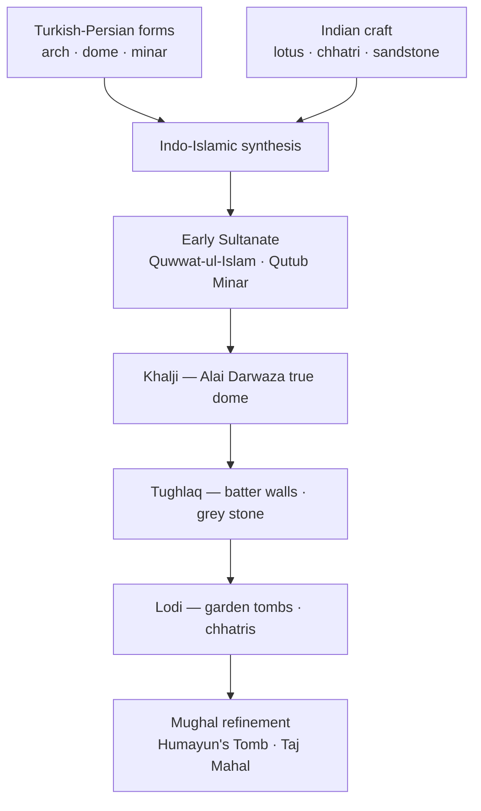

# Indo-Islamic & Delhi Sultanate Architecture

> GS-1 · Topic 01 · Sultanate architecture — arch, dome, synthesis

---

## PYQs

| Year | M | Words | Question (EN) | प्रश्न (HI) | ID |
|------|---|-------|---------------|-------------|-----|
| — | 8 | 125 | *Likely:* Describe the main features of Indo-Islamic architecture during the Delhi Sultanate. | *संभावित:* दिल्ली सल्तनत काल में भारतीय-इस्लामी वास्तुकला की प्रमुख विशेषताओं का वर्णन कीजिए। | Q1 |
| — | 8 | 125 | *Likely:* Discuss the evolution of Indo-Islamic architecture from the Sultanate to the Mughal period. | *संभावित:* सल्तनत से मुगल काल तक भारतीय-इस्लामी वास्तुकला के विकास की विवेचना कीजिए। | Q2 |

---

## Quick Revision

```
SYNTHESIS CORE: Turkish/Persian/Central Asian forms + Indian craftsmen/materials/motifs = Indo-Islamic
  NOT pure West Asian import | NOT mere temple destruction — composite craft tradition over centuries

NEW STRUCTURAL ELEMENTS (Turkish introduction, Indian mastery):
  TRUE ARCH (voussoir) · TRUE DOME (squinches/pendentives) · LIME MORTAR · MINAR · COURTYARD MOSQUE
  Route of arch: Rome → Byzantine → Arab world → India (Indians did NOT invent arch independently)

DECORATION RULE (religious buildings): No human/animal figures → geometry · arabesque · Quranic CALLIGRAPHY
  Indian motifs absorbed: LOTUS · BEL (creeper) · bell · swastika · CHHATRI · balcony · deep eaves

MATERIALS: Red/yellow SANDSTONE (Delhi-Agra belt) · MARBLE (increasing Lodi-Mughal) · Tughlaq GREY stone
  Early SPOLIA: temple columns reused in Quwwat-ul-Islam — conflict + synthesis both true

DELHI SULTANATE PHASES:
  Early 13th c. (Slave): Quwwat-ul-Islam · Qutub Minar (~71.4 m) · Arhai Din ka Jhonpra (Ajmer)
  Khalji: Alai Darwaza — FIRST scientific TRUE DOME in India · Siri capital (few remains)
  Tughlaq: BATTER (sloping) walls · Tughlaqabad · Hauz Khas · Kotla Firoz Shah · grey stone austerity
  Sayyid-Lodi: ARCH+ LINTEL hybrid · GARDEN TOMBS · octagonal tombs → direct Mughal precursor

KEY MONUMENTS (named for exam):
  Qutub Minar (Aibak start → Iltutmish complete) | Alai Darwaza (Khalji) | Ghiyasuddin Tughlaq tomb
  Lodi Gardens tombs (Delhi) | Atala Masjid Jaunpur | Adina Mosque Pandua (Bengal brick)
  Jama Masjid Ahmedabad | Gol Gumbaz Bijapur (Deccan — later, world's large dome)

REGIONAL SCHOOLS: Jaunpur Sharqi · Bengal (curved cornices, brick) · Gujarat (screen of domes)
  Deccan Bahmani/Adil Shahi · UP transition zone (Chunar, Jaunpur)

BRIDGE TO MUGHAL: Sher Shah Suri — Sasaram tomb · Purana Qila mosque → Humayun's Tomb → Taj

TRAPS: Qutub Minar ≠ for saint Qutbuddin Kaki | Arch ≠ Turkish invention | Alai Darwaza ≠ Mughal
  Indo-Islamic ≠ zero Indian influence | Batter walls = Tughlaq not all dynasties | Qutub = Delhi not UP

CONTEMPORARY: Qutub Minar complex UNESCO 1993 · ASI protection · Art 49/51A(f) · NEP 2020 IKS
  Delhi heritage city · PRASAD/Swadesh Darshan · Incredible India · Mehrauli Archaeological Park
```

---

## Content

### Context — what is Indo-Islamic architecture

Indo-Islamic architecture names the composite building tradition that emerged across the Indian subcontinent from roughly the thirteenth century onward, when Turkish, Persian, and Central Asian architectural forms — the true arch, dome, minar, courtyard mosque, and mihrab-oriented prayer hall — were executed by Indian artisans using local sandstone, brick, marble, and decorative vocabularies drawn from pre-existing Hindu, Jain, and regional craft lineages. The tradition is neither a pure West Asian import nor an unchanged continuation of nagara or dravida temple architecture; it is a synthesis produced over centuries through patronage shifts, artisan migration, and continuous technical experiment. The Delhi Sultanate (1206–1526) inaugurated the first large-scale pan–North Indian programme of congregational mosques, tombs, madrasas, forts, and urban quarters stretching from Delhi through Bengal, Gujarat, Jaunpur, and into the Deccan, establishing structural and decorative grammars that Mughal builders later refined to imperial scale.

Medieval Indian culture at court level was neither purely Hindu nor purely Islamic in its visual output. Sultanate monuments record interaction, adaptation, and innovation alongside episodes of conflict and temple-material reuse. Understanding Indo-Islamic architecture therefore requires holding two truths simultaneously: early mosques such as Quwwat-ul-Islam incorporated spolia from destroyed or repurposed temples, and the same buildings display lotus panels, bel motifs, and carving density inherited from Indian workshops. The arch itself did not originate in India independently; it travelled through the Roman–Byzantine–Arab chain before Indian masons mastered voussoir construction and, by the Khalji period, true dome technology on square plans.

### Structural elements — introduction and Indian mastery

| Element | What it is | How it works | Why it mattered |
|---------|------------|--------------|-----------------|
| **True arch** | Voussoir stones arranged in a curved span | Transfers load through compression along the curve | Wider prayer halls with fewer interior pillars |
| **True dome** | Spherical or conical vault on squinches or pendentives | Bridges square chamber to circular base of dome | Monumental enclosed worship and tomb spaces |
| **Lime mortar** | High-quality binding agent | Bonds masonry under arch and dome thrust | Enabled large spans impossible with dry stacking alone |
| **Minar** | Tall tower | Call to prayer, victory landmark, skyline marker | Qutub Minar (~71.4 m) became the iconic Sultanate form |
| **Arabesque and calligraphy** | Geometric-floral interlace and Quranic script | Replaces figural imagery forbidden in mosque decoration | Script itself becomes major visual art |
| **Courtyard mosque** | Open sahn with riwaq colonnade | Adapts West Asian plan to Indian climate | Quwwat-ul-Islam established the Delhi model |

Indian contributions transformed imported forms into a distinct idiom. Artisans integrated lotus, bel creeper, bell, and swastika motifs on tombs and gateways; retained corbel habits alongside true arches; and under the Lodis combined arch and lintel in hybrid engineering. Chhatris, balconies, and deep eaves from Rajasthan and Gujarat entered tomb and gateway design. Red and yellow sandstone from the Delhi–Agra–Rajasthan belt, increasing marble use from Lodi times onward, and Bengal's brick logic in eastern schools show that material choice followed regional geology as much as religious doctrine. Sultanate walls often carry carving across entire surfaces — the Iltutmish tomb tradition — proving that Indian aesthetic preference for visual saturation persisted within Islamic plans.



### Delhi Sultanate — period-wise architecture

**Early Sultanate (thirteenth century — Slave dynasty).** Quwwat-ul-Islam Mosque at Mehrauli, adjacent to the Qutub Minar, was Delhi's first congregational mosque and was built substantially from reused temple columns — documented spolia that records both conflict and craft continuity. The mosque's courtyard plan with riwaq colonnade adapted the West Asian sahn model to North Indian climate, while Hindu-carved columns carried lotus capitals beneath Islamic arches — visual proof of synthesis at the material level. Qutb-ud-Din Aibak began the Qutub Minar in 1199; Iltutmish completed and extended the tapering red sandstone tower with projecting balconies and calligraphic bands. At approximately 71.4 metres, it remains among the tallest brick minars in the world and functioned as both victory monument and call-to-prayer landmark linked to the Quwwat-ul-Islam complex, not as the shrine of Sufi saint Qutbuddin Bakhtiyar Kaki, whose dargah stands separately in Mehrauli. Arhai Din ka Jhonpra at Ajmer, converted under Aibak from a monastery structure within fourteen and a half days according to tradition, shows early synthesis of Hindu–Jain carving with Islamic plan on the Sultanate's western frontier. Iltutmish's tomb in Delhi displays dense ornament, lotus motifs, and horseshoe arches — Indian decorative saturation on an Islamic tomb type that set a precedent for fully carved surfaces on Sultanate monuments.

**Khalji period (1290–1320).** Alauddin Khalji's Alai Darwaza (1311), gateway to the Quwwat-ul-Islam enlargement, marks India's first true scientific dome executed with precise pointed arches, red sandstone, and white marble inlay — a milestone in dome-on-square technology that proved Indian masons could solve the geometric problem of transitioning from square chamber to circular dome without timber centring alone. The gateway's balanced proportions and arabesque panels demonstrate that Sultanate builders had moved beyond experimental arch insertion to confident structural design. Alauddin's Siri capital in Delhi survives only fragmentarily; his planned tower twice the Qutub's height was never built, though the unfinished Alai Minar attests Khalji architectural ambition and the economic limits of even the most powerful medieval patrons.

**Tughlaq period (1320–1414).** Ghiyasuddin Tughlaq's Tughlaqabad combined fort, palace, and artificial lake with distinctive batter — sloping defensive walls that became the dynasty's military aesthetic signature and spread to tomb platforms as well as fortifications. His tomb on an elevated platform with marble dome and sloping walls initiates the formal tomb-garden tradition that Lodis and Mughals refined. Muhammad bin Tughlaq's Daulatabad capital experiment left Delhi remains at Bijai Mandal and Adilabad, showing how architectural programmes followed unstable political geography. Firuz Shah Tughlaq (1351–1388) built Hauz Khas reservoir with madrasa complex — linking water infrastructure, education, and mosque in one urban ensemble — shifted an Ashokan pillar to Firoz Shah Kotla, and favoured grey stone with reduced ornament and lotus panels — an austerity phase distinct from Khalji opulence that some historians read as economic retrenchment after earlier expansion.

**Sayyid and Lodi period (1414–1526).** Late Sultanate builders used arch and lintel together — a transitional structural habit visible across tombs and mosques that reveals masons hedging between corbel tradition and fully arched construction. Garden tombs on high platforms in Lodi Gardens — Muhammad Shah Sayyid tomb, Sikandar Lodi tomb, Bara Gumbad, Shish Gumbad — established octagonal and square plans with chhatris that directly prefigure Humayun's Tomb (1565) and the Taj Mahal. Moth ki Masjid and the Mosque of Jamali Kamali show Lodi decorative refinement in domestic-scale urban architecture. This phase is the immediate architectural precursor to Mughal tomb architecture because it solved the problem of combining Islamic tomb typology, Indian chhatri ornament, and garden setting within one compositional formula.

### Regional Indo-Islamic schools

| Region | Key monument | Distinctive features |
|--------|--------------|---------------------|
| **Jaunpur (Sharqi Sultanate)** | Atala Masjid (1377), Jami Masjid | Massive propylon gateway; Hindu–Buddhist–Jain craft continuity; independent of Delhi style |
| **Bengal** | Adina Mosque, Pandua (14th c.) | Brick construction, curved cornices, pointed vaults — local material logic |
| **Gujarat** | Jama Masjid, Ahmedabad (Ahmed Shah, 1424) | Screen of domes, Hindu artisan carving, corner minars |
| **Malwa** | Jami Masjid, Mandu | Afghan–Malwa fusion; large domes, austere grandeur |
| **Deccan (Bahmani → Adil Shahi)** | Gol Gumbaz, Bijapur (1656) | Among world's largest domes; whispering gallery; later date but same Indo-Islamic lineage |
| **UP transition belt** | Chunar fort, Jaunpur | Sharqi and Mughal overlap zone |

Regional schools prove Indo-Islamic architecture was never monolithic. Bengal's brick cornices respond to alluvial geology and high rainfall where stone was scarce; Adina Mosque at Pandua, once among the largest mosques in the subcontinent, deploys pointed brick vaults and curved cornices that translate arch-dome vocabulary into baked clay. Jaunpur's Sharqi sultanate developed a propylon gateway tradition at Atala Masjid (1377) and Jami Masjid that exceeds Delhi gateways in scale and integrates Hindu–Buddhist–Jain carving workshops local to eastern Uttar Pradesh. Gujarat's Jama Masjid at Ahmedabad (1424), built under Ahmed Shah, presents a screen of domes and corner minars shaped by maritime trade wealth and Hindu artisan participation. Malwa's Mandu mosques show Afghan–Malwa fusion with austere grandeur on the Vindhya plateau. Gol Gumbaz at Bijapur (1656), though seventeenth-century Deccan, belongs to the same Indo-Islamic dome lineage with its whispering gallery and one of the world's largest domes — a reminder that Sultanate innovations radiated far beyond Delhi chronologically and geographically.

### Salient characteristics — integrated view

Indo-Islamic architecture defines itself through arch and dome vocabulary contrasted with post-and-lintel Hindu temple construction. Mosques and tombs favour geometric arabesque and Quranic calligraphy over figural sculpture. Complexes integrate minar, mihrab, qibla orientation, courtyard, and water tank for ablution. The red sandstone and marble contrast palette intensifies from Lodi through Mughal phases. Tomb architecture evolves from simple grave markers through elevated platforms to char-bagh garden settings and, under Mughals, double domes. Cultural synthesis remains visible in lotus, chhatri, and Indian carving density applied to Islamic plans. Sufi khanqahs and madrasas such as Hauz Khas linked building programmes to education and spiritual life, not only to military commemoration.

### Evolution toward Mughal architecture

| Sultanate contribution | Mughal development | Example chain |
|------------------------|-------------------|---------------|
| True dome (Alai Darwaza, 1311) | Double dome, bulbous profile | Buland Darwaza, Taj Mahal inner and outer shells |
| Garden tomb (Tughlaq, Lodi) | Char-bagh symmetry, platform tomb | Humayun's Tomb, Taj Mahal |
| Chhatri, balcony, eaves | Imperial fusion ateliers | Fatehpur Sikri, Agra Fort |
| Iqta-era court culture | Imperial karkhana workshops | Unified manuscript and building crafts |
| **Sher Shah Suri interregnum (1540–45)** | Bridge from Sultanate to Mughal revival | Sasaram tomb, Purana Qila mosque → Humayun's Tomb |

Sher Shah Suri represents the climax of pre-Mughal and the opening of Mughal architectural idiom. Humayun's Tomb (1565, architect Mirak Mirza Ghiyas) — first major Mughal garden tomb on UNESCO list — explicitly builds on Lodi tomb-garden vocabulary. The continuity from Alai Darwaza through Lodi platforms to Humayun and the Taj is structural and aesthetic, not merely chronological.

### Significance and legacy

Sultanate architecture established the first visible pan-Indian Islamic building tradition at scale — mosques, tombs, madrasas, and forts from Delhi to Bengal, Gujarat, and the Deccan. It demonstrates that Indian craftsmen, not imported labour alone, mastered dome technology and adapted it to local materials. The tradition foundations Taj Mahal, Red Fort, and Jama Masjid Delhi. Jaunpur, Bengal, and Gujarat schools confirm regional identity persisted within shared vocabulary. Historiography must acknowledge both temple spolia and synthesis — romanticising conquest or erasing Indian craft contribution both distort the record.

### Contemporary relevance

Qutub Minar and its Monuments at Delhi received UNESCO World Heritage inscription in 1993, covering Qutub Minar, Quwwat-ul-Islam Mosque, Alai Darwaza, Alai Minar, and the Iron Pillar — obligating ASI custodianship, structural monitoring including Qutub tilt surveys, and lime-mortar restoration matching Sultanate technique. Article 49 and Article 51A(f) frame state protection and citizen heritage duty for composite Indo-Islamic monuments. NEP 2020 IKS integrates Sultanate architecture into art-history, archaeology, and craft curricula — arch-dome engineering, calligraphy, and synthesis historiography linked to conservation science. Delhi's Mehrauli Archaeological Park anchors Incredible India and Dekho Apna Desh campaigns; Swadesh Darshan and PRASAD fund heritage infrastructure at cultural circuits. Ahmedabad's UNESCO World Heritage City status (2017) extends Sultanate-era craft legacy into urban heritage policy. Light-and-sound programmes, craft bazaars, and guide training around the Qutub complex show heritage functioning as soft power and local livelihood. Contemporary debates on monument protection versus urban development in Delhi ridge and Mehrauli buffer zones require accurate Sultanate history — neither conquest-only nor harmony-only narratives suffice.

### Limits

Early Sultanate construction involved documented temple destruction and spolia reuse; balanced historiography must acknowledge conflict alongside synthesis. Indo-Islamic buildings are not stylistically identical — Bengal brick, Tughlaq grey austerity, Lodi garden tombs, and Jaunpur gateways are distinct sub-styles requiring precise attribution. Many monuments carry multiple patrons across dynasties: Qutub Minar progressed from Aibak through Iltutmish to later repairs. Gol Gumbaz at Bijapur (1656) belongs to seventeenth-century Deccan Adil Shahi patronage, not thirteenth-century Delhi Sultanate chronology, though it shares the Indo-Islamic dome tradition. Batter walls characterise Tughlaq military architecture, not every Sultanate dynasty. Qutub Minar stands in Delhi's Mehrauli, not in Uttar Pradesh — a geographic precision that matters for regional heritage policy. Finally, presenting Indo-Islamic as uniformly anti-figural overlooks secular and palace contexts where decorative programmes could differ from mosque norms.

---

## Answers

### Q1: Describe the main features of Indo-Islamic architecture during the Delhi Sultanate. (Likely, 8M, 125W)

**Opening:**
> Delhi Sultanate architecture marks India's first large-scale Indo-Islamic synthesis — combining true arch, dome, and minar with Indian materials, motifs, and craftsman traditions executed across mosques, tombs, and forts.

**Write these points:**
- **Structural forms:** **True arch, true dome, lime mortar** — wider prayer halls; landmark **Qutub Minar** (~71.4 m); **Quwwat-ul-Islam** courtyard mosque model; **Alai Darwaza (1311)** — first scientific true dome in India.
- **Decoration:** **Arabesque** geometry, floral patterns, **Quranic calligraphy** — avoiding figural imagery in religious buildings; Indian **lotus, bel, chhatri** motifs integrated on gateways and tombs.
- **Materials and phases:** **Red/yellow sandstone, marble**; early **spolia** from temples; **Tughlaq batter walls** and **grey stone** austerity; **Lodi garden tombs** — high platform + char-bagh precursor.
- **Regional diversity:** Beyond Delhi — **Atala Masjid (Jaunpur)**, **Adina Mosque (Bengal brick)**, **Ahmedabad Jama Masjid** — same vocabulary, local materials.
- **Synthesis:** Turkish/Persian plans executed by **Indian craftsmen** — neither purely imported nor purely indigenous; foundation for later **Mughal** refinement.

**Conclusion:**
> Sultanate architecture thus established the vocabulary — arch, dome, minar, tomb-garden — that Mughal builders perfected from Humayun's Tomb to the Taj Mahal.

---

### Q2: Discuss the evolution of Indo-Islamic architecture from the Sultanate to the Mughal period. (Likely, 8M, 125W)

**Opening:**
> Indo-Islamic architecture evolved from experimental Sultanate mosques and tombs to the refined imperial style of the Mughals — a continuous arc of structural mastery, garden planning, and decorative synthesis.

**Write these points:**
- **Sultanate base (13th–15th c.):** **Qutub Minar**, **Alai Darwaza** (true dome), Tughlaq **batter forts** and **Hauz Khas**, Lodi **garden tombs** with chhatris and arch-lintel hybrid.
- **Bridge figure:** **Sher Shah Suri** — **Sasaram tomb**, **Purana Qila mosque** — pre-Mughal climax linking Sultanate to Mughal revival.
- **Mughal Akbar:** **Red sandstone**, **Fatehpur Sikri**, **Buland Darwaza** — fusion of Gujarat, Bengal, Rajput, Persian elements; imperial **karkhana** ateliers.
- **Jahangir–Shah Jahan:** **Marble**, **pietra dura**, **Taj Mahal** — double dome, char-bagh, minarets — zenith of tomb architecture building on **Lodi-Humayun** garden-tomb lineage.
- **Continuity theme:** Arch-dome-tomb-garden vocabulary from **Alai Darwaza → Humayun's Tomb → Taj** — same synthesis tradition matured with imperial scale.

**Conclusion:**
> The evolution shows growing confidence — from spolia mosques to the Taj Mahal — as Indo-Islamic architecture became India's most recognisable medieval visual language, now protected as UNESCO and ASI heritage.

---

### Q3 (Future variant): Compare Indo-Islamic architecture of Delhi Sultanate with regional schools. (Likely, 8M, 125W)

**Opening:**
> While Delhi Sultanate monuments established the arch-dome-minar vocabulary of Indo-Islamic architecture, regional schools in Jaunpur, Bengal, Gujarat, and the Deccan adapted it to local materials and craft traditions.

**Write these points:**
- **Delhi core:** Stone **sandstone**, **Alai Darwaza** true dome, **Tughlaq batter**, **Lodi garden tombs** — imperial capital sequence.
- **Jaunpur Sharqi:** **Atala Masjid** — massive **propylon gateway**, Hindu-Jain carving continuity; independent of Delhi stylistically.
- **Bengal:** **Adina Mosque, Pandua** — **brick**, curved cornices, pointed vaults — climatic and material adaptation.
- **Gujarat:** **Ahmedabad Jama Masjid** — **screen of domes**, Hindu artisan work; maritime trade patronage.
- **Shared + distinct:** All share **arch-dome-calligraphy** grammar; differ in **material (brick vs stone)**, **ornament density**, and **gateway vs dome emphasis**.

**Conclusion:**
> Regional Indo-Islamic schools prove the tradition was a **pan-Indian synthesis network**, not a single Delhi import — a point essential for balanced heritage and exam answers.

---

## Traps

| Wrong | Correct |
|-------|---------|
| Qutub Minar built for saint Qutbuddin Kaki | **Victory/minar** linked to **Quwwat-ul-Islam** mosque; saint's dargah is separate |
| Arch invented by Turks in India | Transmitted via **Roman-Byzantine-Arab** chain; Indians **mastered** it locally |
| Indo-Islamic = no Indian influence | **Lotus, chhatri, bel**, Indian stone-carving tradition are **central** |
| All Sultanate buildings use batter walls | **Tughlaq** feature; Firuz Shah grey-stone phase differs |
| Alai Darwaza = Mughal monument | **Alauddin Khalji (1311)** — Sultanate; first true scientific dome |
| Indo-Islamic allows figural sculpture in mosques | **Geometric/calligraphic** decoration dominant in religious buildings |
| Sultanate architecture unrelated to Taj Mahal | **Lodi garden tombs** → **Humayun's Tomb** = direct precursor chain |
| Qutub Minar located in UP | **Delhi** (Mehrauli); not Agra or Lucknow |
| Gol Gumbaz = Delhi Sultanate period | **1656, Bijapur (Adil Shahi)** — Deccan; same dome tradition, later date |
| Quwwat-ul-Islam built without temple spolia | Early mosque used **reused temple columns** — spolia documented |
| Hauz Khas built by Alauddin Khalji | **Firuz Shah Tughlaq** — lake + madrasa complex |
| Indo-Islamic = only mosques | Also **tombs, forts, madrasas, gateways, minars** |
| Qutub Minar height ~100 m | Approximately **71.4 m** — do not confuse with unbuilt Alai Minar plan |
| Atala Masjid is in Delhi | **Jaunpur (Sharqi Sultanate, UP)** — not Delhi Sultanate capital work |

---

*Complete.*
