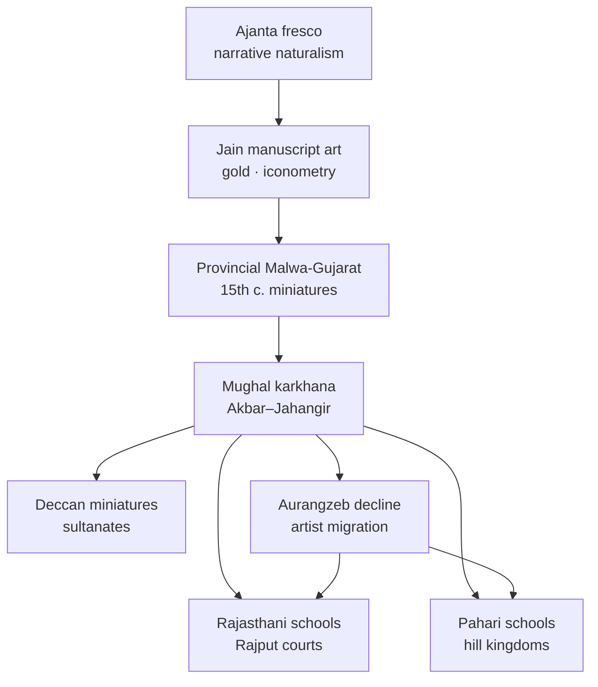

# Medieval Indian Painting

> GS-1 · Topic 01 · Miniature schools — Mughal, Rajasthani, Pahari, Jain

---

## PYQs

| Year | M | Words | Question (EN) | प्रश्न (HI) | ID |
|------|---|-------|---------------|-------------|-----|
| — | 8 | 125 | *Likely:* Describe the main features of Mughal miniature painting. | *संभावित:* मुगल लघुचित्रकला की प्रमुख विशेषताओं का वर्णन कीजिए। | Q1 |
| — | 8 | 125 | *Likely:* Discuss the Rajasthani and Pahari schools of painting. | *संभावित:* राजस्थानी और पहाड़ी चित्र शैलियों की विवेचना कीजिए। | Q2 |
| — | 8 | 125 | *Likely:* Trace the evolution of Indian painting from Ajanta to Mughal and regional schools. | *संभावित:* अजंता से मुगल और क्षेत्रीय शैलियों तक भारतीय चित्रकला के विकास का सिलसिला प्रस्तुत कीजिए। | Q3 |

---

## Quick Revision

```
LINEAGE: Ajanta FRESCO (Gupta-Vakataka, 5th–6th c.) → Jain palm-leaf (8th c.+) → Sultanate provincial (Malwa/Gujarat 15th c.)
  → Mughal karkhana (Akbar–Jahangir peak) → post-Aurangzeb dispersal → Rajasthani + Pahari + Deccan

MINIATURE DEFINITION: Small-scale detailed OPAQUE WATERCOLOUR on PAPER/CLOTH — NOT "small subject only"
  Features: fine brush · profile/portrait · border decoration · manuscript illustration · album (muraqqa)

MUGHAL (imperial court):
  Humayun → Persian masters (Mir Sayyid Ali, Abdus Samad) | Akbar karkhana: Daswant · Basawan · Mansur
  Akbarnama · Baburnama · Mahabharata/Ramayana illustrated | Jahangir: portrait peak · Mansur ANIMALS · foreshortening
  Realism · natural history · European perspective (Portuguese) | Decline Aurangzeb → Rajput courts

RAJASTHANI SCHOOLS (post-Mughal dispersal, 17th–19th c.):
  Mewar (Udaipur) · Marwar (Jodhpur/Bikaner) · Bundi-Kota (Hadoti) · Kishangarh (Bani Thani) · Amber/Jaipur
  Themes: Krishna-Radha · Ragamala · Barahmasa · court · hunting · heroism
  Style: bold colour · decorative landscape · bhakti emotion > Mughal documentary realism
  Fusion: Jain manuscript tradition + local bardic themes + Mughal technique

PAHARI (Himalayan foothills — Himachal, J&K fringe):
  Basohli (bold colour, bold lines, early 18th c.) → Guler (softness, Mughal influence)
  → Kangra (late 18th c. PEAK — lyrical Krishna-Radha, nature, romance)
  Themes: Vaishnav bhakti · Gita Govinda · nature · monsoon · Ragamala
  Artists: Nainsukh · Manaku (familial ateliers)

OTHER: Deccan miniatures (Ahmednagar · Bijapur · Golconda · Hyderabad) — Persian influence, vibrant colour, distinct
JAIN: Kalpasutra · Kalkacharya Katha — marginal paintings, gold, strict Tirthankara iconometry

COMPARE: Mughal = realism/history/portraiture | Rajasthani = heroic/bhakti/bold | Pahari = lyrical/soft/nature

TRAPS: Ajanta = mural fresco NOT miniature | Mughal ≠ only Persian | Rajasthani ≠ one school
  Pahari ≠ Punjab plains only | Kangra = Pahari NOT Rajasthani | Mansur = Mughal NOT Rajasthani
  Miniature ≠ merely tiny size | Deccan ≠ identical to Mughal

CONTEMPORARY: National Museum Delhi · CSMVS Mumbai · NEP 2020 IKS art history · GI craft tags
  Museum digitisation · Kangra/Rajasthani folk revival · Incredible India cultural tourism · ASI manuscript care
```

---

## Content

### Context — evolution of Indian painting

Indian painting history spans monumental murals to portable court miniatures — a continuous thread of narrative ambition, colour mastery, and patronage adaptation across changing mediums and political centres. The lineage begins at Ajanta with buon fresco Jataka narratives whose naturalism and mineral-pigment chemistry set a figure-and-colour standard that later manuscript artists inherited indirectly. Jain palm-leaf manuscripts from the eighth century onward carried marginal miniatures with gold, strict Tirthankara iconometry, and decorative borders. Fifteenth-century Malwa and Gujarat provincial schools on paper prepared the ground for Mughal imperial karkhanas. After Aurangzeb's contraction of court patronage, artists dispersed to Rajput desert courts and Himalayan foothill kingdoms, producing Rajasthani and Pahari schools whose bhakti themes and bold palettes define popular imagery of Krishna-Radha art today. Deccan sultanates maintained parallel Persianate miniature traditions at Ahmednagar, Bijapur, Golconda, and Hyderabad.

| Phase | Medium | Period | Hallmarks |
|-------|--------|--------|-----------|
| **Ajanta** | Fresco on cave walls | 2nd c. BCE–7th c. CE | Jataka narratives, naturalism, Gupta–Vakataka peak (Caves 1, 2, 16, 17) |
| **Jain manuscripts** | Palm-leaf, later paper | 8th c. onward | Marginal miniatures, gold, strict Tirthankara iconography |
| **Sultanate provincial** | Paper | 15th c. | Malwa, Gujarat — pre-Mughal miniature tradition |
| **Mughal** | Paper, imperial karkhana | 16th–17th c. | Realism, portraiture, court history, natural history |
| **Rajasthani and Pahari** | Paper, court ateliers | 17th–19th c. | Bhakti themes, Ragamala, post-Mughal dispersal |
| **Deccan** | Paper | 16th–17th c. | Persianate sultanate courts — distinct palette and themes |



### What miniature painting is

Miniature painting denotes small-scale, highly detailed opaque watercolour on paper or cloth — the term describes technique and manuscript-album format, not merely tiny subject matter. Pigments mixed with gum arabic produce layered washes; squirrel-hair brushes with single-hair tips render facial detail. Miniatures differ from Ajanta mural fresco by portable medium and court-album patronage context. Common elements include decorative floral or gold borders, calligraphy, early profile views evolving toward shaded modelling under Mughal influence, and formats such as manuscript illustration (Akbarnama folios), album leaves (muraqqa), Ragamala series visualising musical raga as human figures, and Barahmasa sets depicting twelve months of seasonal love poetry.

### Mughal miniature painting — institution and development

Humayun brought Persian masters Mir Sayyid Ali and Abdus Samad from the Safavid court after exile, establishing on return circa 1555 the atelier model Akbar formalised as the imperial karkhana recruiting artists by talent regardless of faith or region.

Akbar-era masters include Daswant, Basawan, Farrukh Beg, Mukund, Kesu Das, and Lal. Major works encompass Akbarnama's historical chronicle of battles and court life, Baburnama, Hamzanama's early large cloth folios — among the earliest monumental painted cloth projects in the karkhana — and Persian translations of Ramayana and Mahabharata that placed Sanskrit epic narrative inside Islamic court visual language. Style features narrative crowd scenes, Indian landscape backgrounds with monsoon clouds, peacock blue and Indian red palette, and emerging three-dimensional facial modelling. Syncretic themes — Islamic court illustrating Hindu epics — document composite manuscript culture where religious identity of artist and textual source did not determine patronage exclusion.

Jahangir's reign (1605–1627) marks the golden age. Portrait perfection with named subjects and psychological depth reflects imperial taste. Mansur produced supreme animal and bird studies — zebra, falcon, chameleon — with natural-history accuracy. Bichitr experimented with self-portraiture and European absorption. Album tradition (muraqqa) collected leaves with finer brushwork and exquisite borders than Akbar's era. Portuguese Jesuits introduced foreshortening, linear perspective, and shading visible in carpets, globes, and throne scenes.

Under Aurangzeb, imperial patronage declined and master artists migrated to Rajput courts at Amber, Bikaner, Bundi, and Mewar and to Pahari hill kingdoms — directly seeding regional schools. Yet imperial albums continued in reduced volume, and artists trained in Akbar's and Jahangir's karkhanas carried technique — shading, portrait likeness, border decoration — into Rajput ateliers where it merged with local colour fields and devotional programmes.

### Ragamala, Barahmasa, and manuscript formats

Beyond court chronicles, miniature painters produced thematic series that linked visual art to music and seasonal poetry. Ragamala sets visualised raga and ragini musical modes as human figures in landscape — a raga such as Megha depicted as a warrior or lover against monsoon clouds — proving interdisciplinary patronage across music, literature, and painting. Barahmasa series illustrated twelve months of seasonal change through lovers separated or united by rain, heat, or harvest, drawing on bardic and Sufi-inflected poetry traditions. Manuscript illustration remained the primary format for Akbarnama and Baburnama folios, while Jahangir-era muraqqa albums collected individual leaves with calligraphic and floral borders as luxury objects for imperial viewing rather than sequential reading. Understanding these formats clarifies why "miniature" denotes a craft tradition bound to book and album culture, not merely small image size.

### Rajasthani schools — origin, sub-schools, and style

Rajasthani painting fuses Jain manuscript tradition from western India, local bardic and heroic themes, and Mughal technique absorbed after late-seventeenth-century artist dispersal. It privileges emotion, devotion, and decorative landscape over Mughal documentary realism.

| Sub-school | Centre | Features |
|------------|--------|----------|
| **Mewar** | Udaipur | Bold colours, heroic themes, Ragamala, Krishna lore, Battle of Haldighati scenes |
| **Marwar** | Jodhpur, Bikaner | Robust figures, hunting, court processions; strong Mughal influence at Bikaner |
| **Bundi-Kota** | Hadoti | Lush nature, Krishna-Bhagavata themes, fine detail, rich greens |
| **Kishangarh** | Kishangarh (Ajmer district) | Radha-Krishna devotion; Bani Thani portrait style — elongated features, poetic romance (Nihal Chand, Savant Singh patronage) |
| **Amber/Jaipur** | Jaipur | Later Mughal-Rajput blend; court portraits, festivals |

Common themes include Krishna-Radha lilas, Barahmasa seasonal poetry, Ragamala musical visualisation, court processions, hunting, and related folk narrative traditions such as Pabuji phad. Style traits: vibrant Indian palette (orange, ultramarine, gold), stylised trees and architecture, bhakti emotion over documentary accuracy, flat or shallow perspective compared to Mughal depth. Mewar artists documented Rajput resistance and court ceremony with bold colour fields; Bikaner absorbed Mughal-trained masters producing hybrid precision; Kishangarh under Savant Singh and Nihal Chand refined Radha-Krishna romance into the elongated, poetic Bani Thani portrait type that has become among the most reproduced images of Indian miniature art globally.

### Pahari schools — geography and evolution

Pahari painting flourished in Himalayan foothill kingdoms — Basohli in Jammu, Guler, Kangra, Mandi, Garhwal — not in Punjab plains. Hill rajas and Vaishnav devotional courts patronised Gita Govinda and Bhagavata Purana programmes.

| Phase | Centre | Style |
|-------|--------|-------|
| **Early bold** | Basohli (c. 1700–1730) | Intense red, yellow, blue; bold outlines; static figures; strong iconography |
| **Mughal softening** | Guler (mid-18th c.) | Softer faces, Mughal modelling influence, refined line |
| **Lyrical peak** | Kangra (c. 1770–1810) | Graceful figures, detailed nature, romantic Krishna-Radha — Kangra Valley School zenith |

Kangra features soft colours, graceful elongated figures, detailed natural settings with mango trees, lotus ponds, and monsoon clouds. Themes draw from Jayadeva's Gita Govinda, Bhagavata Purana, Ragamala, and Barahmasa. Artist families including Nainsukh and Manaku worked under Raja Sansar Chand of Kangra, producing folios where landscape is not background decoration but emotional analogue to divine love — rain clouds mirror separation anxiety, flowering trees signal union. The Guler phase mid-eighteenth century softened Basohli's bold outlines by absorbing Mughal facial modelling, creating the stylistic bridge that made Kangra lyrical naturalism possible. Mandi and Garhwal workshops adapted the same Vaishnav programmes with regional costume and architecture, proving Pahari painting was a network of hill ateliers rather than a single court monopoly.

### Deccan and Jain traditions

Deccan miniatures at Ahmednagar, Bijapur, Golconda, and Hyderabad sultanates show Persian influence, rich colour, erotic and portrait themes, stylisation, vibrant palette, simpler backgrounds, and sultanate costume distinct from Mughal court idioms. Najm al-Din and Bijapur school album traditions ran parallel to Mughal workshops under politically independent patronage, preserving Persianate aesthetics after Mughal expansion into Deccan politics. Ahmednagar portraits of Sultan Husain Nizam Shah and Bijapur's lyrical Ragamala sets demonstrate that regional sultanates were not provincial backwaters but active centres of manuscript luxury production.

Jain miniatures in Kalpasutra and Kalkacharya Katha manuscripts from Gujarat and Rajasthan use gold, red, and blue palette with strict Tirthankara iconometry — no deviation from canonical proportions because religious regulation governed form. This continuity links medieval Jain art to Rajasthani colour boldness and explains why western Indian workshops supplied both religious manuscript art and later Rajput court painting after Mughal dispersal.

### Mughal versus Rajasthani versus Pahari

| Feature | **Mughal** | **Rajasthani** | **Pahari** |
|---------|------------|----------------|------------|
| **Patron** | Imperial Mughal court | Rajput desert/thar courts | Hill rajas (Himachal/Jammu) |
| **Theme** | History, portraiture, nature study | Heroic, Krishna, Ragamala, court | Bhakti romance, Gita Govinda, nature |
| **Style** | Realism, perspective, modelling | Bold, decorative, flat perspective | Lyrical, soft, nature-integrated |
| **Period peak** | Jahangir (1605–27) | 17th–19th c.; Kishangarh 18th c. | Kangra late 18th c. |
| **Key artist** | Mansur, Basawan | Nihal Chand (Kishangarh) | Nainsukh, Manaku |

### Bengal School bridge to modern art

Late nineteenth- and early twentieth-century Bengal School artists including Abanindranath Tagore and Nandalal Bose consciously revived Ajanta line, Mughal refinement, and Pahari softness against academic European realism — proof that medieval painting lineage remained active in modern Indian art nationalism rather than ending with colonial encounter. The wash technique Abanindranath employed directly quoted Mughal and Pahari colour restraint, while Nandalal's linocut and mural programmes adapted miniature border ornament to modern political communication.

### Significance and legacy

Medieval painting demonstrates continuity from Ajanta colour naturalism to paper miniatures through medium shift rather than civilisational break. The same narrative impulse — Jataka ethics, court chronicle, bhakti romance — persists while support shifts from wet plaster to palm-leaf to album leaf. Kangra and Rajasthani styles influence folk art (phad, pichwai), calendar imagery, textile design, and contemporary illustration, proving miniature idioms remain commercially and culturally active. National repositories — National Museum New Delhi, CSMVS Mumbai, Government Museum Chennai, Indian Museum Kolkata — preserve folios that anchor global understanding of Indian visual culture and supply digitisation projects under NEP-aligned museum-education partnerships.

### Contemporary relevance

NEP 2020 IKS integrates medieval painting into fine arts, art history, and design curricula — pigment chemistry of lapis and gold leaf, brush technique, and Ragamala music-painting interdisciplinarity linking court ateliers to cultural education. Museum digitisation through National Museum, CSMVS, and Google Arts & Culture partnerships provides high-resolution Mughal album and Kangra folio access without handling fragile originals, supporting Incredible India cultural diplomacy. Article 51A(f) and Article 49 frame citizen duty and state protection for institutions housing collections. Rajasthani miniature workshops in Jaipur and Udaipur and Kangra painting's Himachal Pradesh GI tag sustain livelihood craft through Hunar Haat and Ek Bharat Shreshtha Bharat exchanges. City Palace Udaipur, Mehrangarh Jodhpur, and Kangra Fort museum displays anchor Swadesh Darshan cultural circuits. INTACH and museum climate-controlled storage with Raman spectroscopy pigment analysis on Mughal folios connect medieval technique to conservation science. National Mission on Manuscripts legacy programmes catalogue illustrated texts beyond ASI monument mandate.

### Limits

Regional school labels simplify diverse workshops; artist migrations from Mughal courts to Bikaner and from Guler to Kangra blur rigid boundaries. Colonial-era Company paintings (eighteenth–nineteenth century) form a separate hybrid category of Indian artists serving European patrons — not collapsible into Mughal or Rajasthani schools. Dating and attribution remain uncertain for many folios; "Kangra school" may span neighbouring states. Aurangzeb decline narrative is broadly accurate but some imperial painting continued — Mughal painting did not vanish overnight. Ajanta remains fresco mural, not miniature; Mansur was Mughal court artist, not Rajasthani; Basohli lies in Jammu region, not Rajasthan; Bani Thani belongs to Kishangarh, not Mughal portraiture; Jain miniatures depict Tirthankaras, not Krishna lilas; Ragamala visualises raga musical modes, not instruments.

---

## Answers

### Q1: Describe the main features of Mughal miniature painting. (Likely, 8M, 125W)

**Opening:**
> Mughal miniature painting combined Persian manuscript discipline with Indian themes and observation — creating a distinctive court art of realism, historical illustration, and natural history under imperial karkhana patronage.

**Write these points:**
- **Institution:** Imperial **karkhana** from **Akbar**; **Humayun** brought **Persian masters**; artists **Daswant, Basawan, Mansur** from diverse backgrounds.
- **Themes:** **Court life, battles, hunting, Akbarnama, Baburnama**, illustrated **Mahabharata/Ramayana** — documentary and narrative historical painting.
- **Technique:** Fine brushwork, **portraiture** with individual likeness, Indian colours (peacock blue, Indian red), **3D modelling**; Jahangir-era **animal studies** (Mansur).
- **Influence:** Persian miniature format + **Indian palette** + **European foreshortening** (Portuguese Jesuit contact) — depth and scientific observation.
- **Legacy:** Court realism dispersed after **Aurangzeb** — seeded **Rajasthani/Pahari schools**; folios preserved in **National Museum** and global collections today.

**Conclusion:**
> Mughal miniatures remain the most refined court visual archive of medieval India — bridging Persian, Indian, and European techniques into a composite painting tradition.

---

### Q2: Discuss the Rajasthani and Pahari schools of painting. (Likely, 8M, 125W)

**Opening:**
> Rajasthani and Pahari schools flourished after Mughal atelier dispersal — channelling bhakti devotion and regional identity into vibrant miniature traditions distinct from imperial documentary realism.

**Write these points:**
- **Rajasthani:** Multiple courts — **Mewar, Marwar, Bundi-Kota, Kishangarh**; themes **Krishna-Radha, Ragamala, Barahmasa**, hunting and heroism; bold colour, Jain-Mughal fusion; **Bani Thani (Kishangarh)** iconic romantic portrait style.
- **Pahari:** Himalayan foothills — **Basohli** (bold colour/lines) → **Guler** (Mughal softness) → **Kangra** (late 18th c. lyrical peak); **Gita Govinda**, nature, monsoon romance.
- **Artists:** **Nainsukh, Manaku** (Kangra); **Nihal Chand** (Kishangarh) — familial atelier tradition.
- **Contrast with Mughal:** Less documentary realism — more **emotion, devotion, decorative landscape**; shallower perspective, bolder palette.
- **Living heritage:** **Kangra GI tag**, Rajasthani workshops, museum collections — **NEP IKS** and tourism sustain medieval idioms today.

**Conclusion:**
> Together Rajasthani and Pahari painting extended India's miniature heritage beyond the imperial Mughal court into regional bhakti aesthetics that define popular images of Krishna-Radha art.

---

### Q3: Trace the evolution of Indian painting from Ajanta to Mughal and regional schools. (Likely, 8M, 125W)

**Opening:**
> Indian painting evolved from Ajanta's monumental frescoes to paper miniatures under Mughal and Rajput patronage — a continuous thread of narrative richness, colour mastery, and adapting court cultures.

**Write these points:**
- **Ajanta (Gupta-Vakataka murals):** **Fresco** Jataka narratives — naturalism, emotion, mineral pigments on wet plaster — foundation of Indian **colour and figure tradition**.
- **Medieval bridge:** **Jain palm-leaf** manuscripts (gold, iconometry); **Malwa/Gujarat** pre-Mughal miniatures (15th c.) on paper.
- **Mughal phase:** **Akbar–Jahangir karkhana** — realism, portraiture, **Akbarnama**, European perspective; apex under **Jahangir** and **Mansur**.
- **Regional phase:** Post-**Aurangzeb** dispersal → **Rajasthani** (heroic/Krishna/bold) and **Pahari/Kangra** (lyrical bhakti/nature); **Deccan** parallel Persianate schools.
- **Pattern:** Medium shifts **wall → palm-leaf → paper**; patron shifts **monastery → empire → Rajput/hill courts**; themes shift **Buddhist Jataka → court history → bhakti romance**.

**Conclusion:**
> This evolution shows Indian painting adapting to new patrons and mediums while retaining narrative and chromatic brilliance — now preserved through museums, IKS curricula, and living craft revival.

---

### Q4 (Future variant): Compare Mughal and Rajasthani schools of miniature painting. (Likely, 8M, 125W)

**Opening:**
> Mughal and Rajasthani miniature traditions share Persian-derived technique but diverge in patronage, theme, and aesthetic — imperial documentary realism versus Rajput devotional boldness.

**Write these points:**
- **Mughal:** Imperial court; **Akbarnama**, portraits, **Mansur** natural history; **perspective, modelling, foreshortening**; Jahangir golden age.
- **Rajasthani:** Rajput courts post-Mughal dispersal; **Krishna-Radha, Ragamala, Barahmasa**, heroism; **bold flat colour**, decorative landscape.
- **Technique:** Mughal finer **3D modelling**; Rajasthani stronger **line and colour field**, less European perspective.
- **Patron intent:** Mughal = **history and imperial record**; Rajasthani = **bhakti, dharma, regional identity**.
- **Continuity:** Rajasthani artists absorbed **Mughal-trained masters** — synthesis, not isolation.

**Conclusion:**
> The comparison illustrates how one Indo-Persian miniature vocabulary split into imperial realism and regional devotional schools — both now celebrated as composite Indian heritage.

---

## Traps

| Wrong | Correct |
|-------|---------|
| Ajanta = miniature painting | **Fresco mural** on cave walls — miniatures are later on **paper** |
| Mughal painting purely Persian | **Indian artists, themes, colours** (Daswant, Basawan) essential |
| Rajasthani = single uniform style | **Many sub-schools** — Mewar, Marwar, Bundi, Kishangarh, Jaipur |
| Pahari = only Punjab plains | **Himachal/Jammu hill states** — Kangra, Basohli, Guler, Mandi |
| Kangra belongs to Rajasthani school | **Pahari** school — geographically and stylistically distinct |
| Mansur = Rajasthani painter | **Mughal** court artist — famous for **animal/nature** studies |
| Miniature = only small-sized pictures | Means **detailed manuscript/album art tradition** on paper/cloth |
| Deccan painting = Mughal identical | **Separate sultanate** Persianate tradition (Bijapur, Golconda) |
| Basohli is in Rajasthan | **Jammu region** — early Pahari, not Rajput desert school |
| Mughal painting ended completely under Aurangzeb | **Patronage declined**; artists migrated — some court work continued |
| Jain miniatures show Krishna lilas | **Tirthankara** iconometry — strict Jain canonical subjects |
| Ragamala = musical instrument painting | Visualises **raga** (musical modes) as human figures/scenes |
| Bani Thani = Mughal portrait | **Kishangarh school** (Nihal Chand) — Rajput devotional romance |
| Bengal School = medieval school | **Modern** (early 20th c.) revival movement — Abanindranath Tagore |

---

*Complete.*
