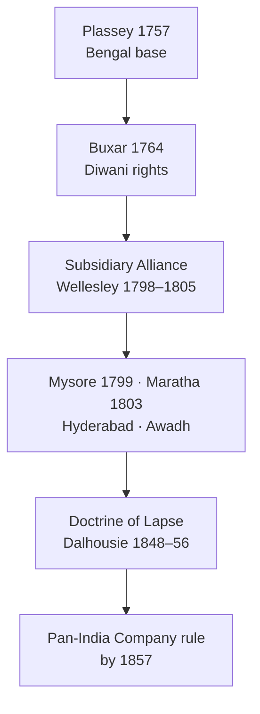
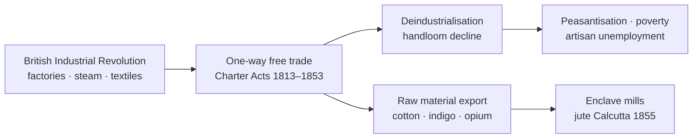

# British Expansion & Economic Impact

> GS-1 · Topic 02 · British conquest (1757–1857), colonial economy, deindustrialisation, drain of wealth

---

## PYQs

| Year | M | Words | Question (EN) | प्रश्न (HI) | ID |
|------|---|-------|---------------|-------------|-----|
| 2020 | 12 | 200 | Discuss the expansion of British rule in India during Governor Generalship of Lord Wellesley. | भारत में गवर्नर जनरल लॉर्ड वेलेजली के काल में ब्रिटिश शासन के प्रसार की विवेचना कीजिए। | Q1 |
| 2019 | 8 | 125 | Critically examine the effects of British Industrial Revolution on India's Economic life. | ब्रिटेन की औद्योगिक क्रांति का भारत के आर्थिक जीवन पर पड़ने वाले प्रभावों का आलोचनात्मक परीक्षण कीजिए। | Q2 |
| 2018 | 12 | 200 | "The spine of Indian Economy was badly injured during the 200 years of British Rule." Explain. | "200 वर्षों के ब्रिटिश शासन ने भारतीय अर्थव्यवस्था का मेरुदंड क्षतिग्रस्त कर दिया था।" व्याख्या कीजिए। | Q3 |

---

## Quick Revision

```
1757 PLASSEY (Clive) → Bengal foothold | 1764 BUXAR → Diwani rights (Bengal, Bihar, Orissa)
1765 DUAL GOVT (Clive) → Company Diwan + Nawab nizamat | 1772–73 famine Bengal

EXPANSION TOOLS:
  Subsidiary Alliance (Wellesley 1798–1805): Nizam 1798 · Mysore 1799 (Tipu) · Awadh 1801 · Peshwa 1802
  Doctrine of Lapse (Dalhousie 1848–56): Satara · Jhansi · Nagpur · Awadh annexed 1856
  Wars: Anglo-Mysore (Hyder/Tipu) · Maratha (Wel. 1803) · Anglo-Sikh (Ranjit Singh heirs) · Afghan

WELLESLEY (1798–1805): Subsidiary Alliance architect | Mysore IV war → Seringapatam 1799
  Maratha defeat 1803 | Ceylon from Dutch | Fort William College 1800

ECONOMIC COLONISATION:
  Permanent Settlement 1793 (Cornwallis, Bengal) → zamindars fixed revenue
  Ryotwari (Munro, Thomas Munro, Madras/Bombay) | Mahalwari (NW provinces)
  Commercialisation of agri → indigo, cotton, opium, jute for export

DEINDUSTRIALISATION: Handloom decline (Dacca muslin, Murshidabad silk) | Charter Act 1813 → one-way free trade
  Manchester cloth floods India post-1820s | Artisans → landless labour

DRAIN OF WEALTH: Dadabhai Naoroji — "Poverty & Un-British Rule" (1901)
  Home charges · salaries · pensions · trade surplus to Britain · no capital reinvestment
  RC Dutt "Economic History of India" (1901–03) — tribute thesis

INDUSTRIAL REVOLUTION IMPACT ON INDIA:
  Britain = factory goods exporter | India = raw material supplier + captive market
  Railways 1853 (Thane) — trade extraction + famine grain export debate
  Tea (Assam 1830s) · jute mills (Calcutta 1855) — enclave modern industry

POSITIVE (limited): Unified market · modern admin · census · codified law · English education (1835 Macaulay)
  Railways/post/telegraph — infrastructure but profit-oriented

CONTEMPORARY: Azadi Ka Amrit Mahotsav · economic nationalism · Atmanirbhar Bharat echo of swadeshi
  Drain debate → post-1947 planning · FDI vs colonial extraction comparison in academia
  Art 49 heritage of colonial buildings (Victoria Memorial, Rajpath) · NEP 2020 critical history

TRAPS: Plassey ≠ full conquest of India | Wellesley ≠ Doctrine of Lapse
  Permanent Settlement ≠ all India | Drain theory ≠ only Naoroji coined phrase
  Railways built for Indian welfare primarily — FALSE (commercial/military)
  Industrial Revolution helped Indian industry — FALSE (deindustrialisation)
```

---

## Content

### Context — from trade to territorial empire (1757–1857)

Modern Indian history conventionally opens with the **Battle of Plassey (1757)**, when **Robert Clive** and the **English East India Company** defeated **Siraj-ud-Daulah**, Nawab of Bengal. Plassey did not conquer India overnight; it gave the Company a **political foothold in Bengal** by placing a pliant nawab on the throne and securing commercial privileges. The decisive shift from merchant-trader to revenue ruler came at the **Battle of Buxar (1764)**, where the Company defeated a coalition of **Mir Qasim**, **Shuja-ud-Daulah**, and the Mughal emperor **Shah Alam II**. The **Treaty of Allahabad (1765)** granted the Company **Diwani**—the right to collect revenue in **Bengal, Bihar, and Orissa**—while the Mughal emperor remained a nominal sovereign. The Company thus became India's revenue collector without yet governing the whole subcontinent.

Between **1765 and 1857**, two parallel processes unfolded: **territorial expansion** through wars, subsidiary alliances, and annexations, and **economic restructuring** through land revenue systems, one-way trade, and the integration of India into Britain's industrial economy. Nationalist historians such as **Dadabhai Naoroji**, **Romesh Chunder Dutt**, and **Bipan Chandra** argued that political conquest and economic exploitation were inseparable—the empire was built to extract surplus, not to develop India. Understanding this linkage is essential because every expansion instrument (Subsidiary Alliance, Doctrine of Lapse, Charter Acts) had direct economic consequences for peasants, artisans, and merchants.

| Phase | Period | Key events / instruments |
|-------|--------|--------------------------|
| **Bengal foundation** | 1757–1772 | Plassey, Buxar, **Dual Government (1765)**, Bengal famine **1770** |
| **Regulating Act era** | 1773–1793 | **Regulating Act 1773**, Pitt's India Act **1784**, Cornwallis as Governor-General |
| **Wellesley expansion** | 1798–1805 | **Subsidiary Alliance**, Fourth Anglo-Mysore War, Second Anglo-Maratha War, Ceylon |
| **Consolidation** | 1813–1856 | Charter Acts, **Dalhousie's Doctrine of Lapse**, Punjab annexation **1849** |
| **1857 watershed** | 1857 | Revolt; transfer to Crown rule **1858** |

### Dual Government and the failure of indirect revenue rule

After obtaining Diwani, **Clive** introduced the **Dual Government (1765–1772)**: the Company held **Diwani** (revenue) while **Nizamat** (police and judicial functions) nominally remained with the Nawab. **What** this meant in practice was that the Company controlled Bengal's wealth without bearing administrative responsibility for its people. **How** it operated: Company agents maximised revenue collection through corrupt middlemen while the Nawab's administration collapsed. **Why** it failed: there was no incentive to invest in agriculture or famine relief when profit came from extraction alone. **Proof**: the **Bengal famine of 1770** killed an estimated **one-third of the population**; revenue demands continued even as cultivators starved. **Warren Hastings** abolished the dual system in **1772**, bringing revenue and administration under closer Company control—but the logic of revenue maximisation persisted in later land settlements.

### Subsidiary Alliance — Wellesley's instrument of controlled dependence

**Richard Colley Wellesley**, Governor-General **1798–1805** (brother of the **Duke of Wellington**), was the architect of the **Subsidiary Alliance**. Under this system, an Indian ruler accepted a **British Resident**, maintained a **British subsidiary force** (paid by the ruler or through ceded territory), and surrendered **foreign policy** to the Company. Rulers kept titular sovereignty but lost real independence—hence **"controlled independence."**

**Why** Wellesley adopted this method: full annexation was expensive; subsidiary states provided military buffers and revenue without direct administration costs. **How** it spread: the **Nizam of Hyderabad (1798)** was the first ally, ceding the **Northern Circars** to pay for subsidiary troops. The **Fourth Anglo-Mysore War (1798–99)** eliminated **Tipu Sultan**, who had allied with the French; Tipu fell at **Seringapatam (4 May 1799)**, and **Krishna Raja Wodeyar IV** was restored under subsidiary terms. The **Second Anglo-Maratha War (1803–05)** followed the **Treaty of Bassein (1802)** with **Peshwa Baji Rao II**, making the Maratha confederacy a subsidiary; victories at **Assaye (1803)** and treaties of **Deogaon** and **Surji-Anjangaon** broke **Daulat Rao Scindia** and **Raghuji Bhonsle**. **Awadh (1801)** ceded half its territory to clear subsidiary arrears. **Ceylon**, taken from the Dutch, secured Indian Ocean routes. **Fort William College (1800)** trained Company servants in **Persian, Sanskrit, Bengali, Hindi, Marathi, and Telugu**, producing the linguistic intermediaries an expanded empire required.

By **1805**, British paramountcy extended over the **Deccan, Mysore, and much of Maratha territory**—not yet Punjab or Awadh's full annexation, but political hegemony was unmistakable. Wellesley was recalled in **1805** partly because subsidiary payments **bankrupted princely states** (Awadh's debt became chronic) and expansion strained Company finances.

**Strategic vision in full**: Wellesley entered office when **French Revolutionary wars** made **French-aligned Indian rulers**—especially **Tipu Sultan**—existential threats. **What** he sought: eliminate rival European influence, ring British territories with **dependent states**, and make the Company **supreme power**. **How** he executed it: wars when necessary (**Fourth Anglo-Mysore, Second Anglo-Maratha**), alliances when cheaper (**Hyderabad 1798**), and administrative training (**Fort William College 1800**; **College of Fort St George, Madras, from 1816**). **Why** historians credit him as the greatest expansionist before **Dalhousie**: by his recall, **Hyderabad, Mysore, and much of Maratha land** acknowledged Company **paramountcy**—the **1813–1857** phase of annexation and economic colonisation built on this foundation. **Carnatic, Tanjore, and Surat** were also brought under closer control during and after his tenure.



### Doctrine of Lapse, wars, and annexation after Wellesley

**Lord Dalhousie (1848–56)** shifted from indirect control to direct annexation. The **Doctrine of Lapse** held that if a ruler died without a **natural heir** (adopted heirs were rejected), his state lapsed to the Company. **Satara (1848), Jhansi, Nagpur, and Sambalpur** were annexed under this doctrine. **Awadh (1856)** was annexed on grounds of **misgovernance**—a major political grievance before **1857**. After **Ranjit Singh's death (1839)**, the **Anglo-Sikh Wars** led to **Punjab's annexation (1849)**. Campaigns in **Afghanistan, Sind, and Burma** extended frontiers for strategic buffers and commercial access. Wellesley used **Subsidiary Alliance**; Dalhousie used **annexation**—both served the same goal of Company supremacy, but the latter dispossessed indigenous rulers outright.

### Land revenue systems — restructuring agrarian India

Colonial land revenue was not a neutral fiscal reform; it was designed to **maximise transferable surplus** for the Company and the British treasury while converting agriculture toward **export-oriented commercialisation**.

| System | Introduced by | Region | Features | Consequences |
|--------|---------------|--------|----------|--------------|
| **Permanent Settlement (1793)** | **Lord Cornwallis** | Bengal, Bihar, parts of Orissa; later Madras | **Zamindars** as permanent proprietors; **fixed revenue** forever | Zamindar landlordism; peasant insecurity; loyal zamindar gentry |
| **Ryotwari** | **Thomas Munro**, **Alexander Read** | Madras, Bombay, Assam | Direct settlement with **ryot (cultivator)**; periodic revision | Peasant bore all risk; push toward commercial crops |
| **Mahalwari** | **Holt Mackenzie (1819)**; revised under **Dalhousie** | NW Provinces, Punjab, Central India | Revenue assessed on **village/mahal** collectively | Village headmen as intermediaries |

**Why** three systems existed: Cornwallis believed fixed zamindari revenue would encourage investment (it mainly enriched intermediaries); Munro distrusted zamindars and dealt directly with cultivators; Mackenzie sought village-level assessment for the Gangetic heartland. **How** they converged: all three raised revenue demands and pushed **indigo (Champaran, Bihar)**, **cotton, opium (Malwa–Bengal to China)**, **jute**, and **tea (Assam plantations from the 1830s)** at the expense of food grains. **Proof** of peasant distress: the **indigo revolt (1859–60)** and Gandhi's **Champaran satyagraha (1917)** both arose from planter coercion rooted in colonial commercial agriculture.

### British Industrial Revolution and India's economic transformation

From the late eighteenth century, Britain underwent the **Industrial Revolution**—**James Watt's steam engine**, **Spinning Jenny**, **Power Loom**, factory production, and the coal–iron complex made Britain the **"workshop of the world"** by the mid-nineteenth century. India was integrated into this system not as an equal partner but as **raw material supplier and captive market**.

| Channel | Mechanism | Effect on India |
|---------|-----------|-----------------|
| **One-way free trade** | **Charter Act 1813** ended Company trade monopoly; **1833** and **1853** Acts further opened India; **low tariffs** | **Manchester cloth** undersold **Dacca muslin, Murshidabad silk, Surat textiles** |
| **Deindustrialisation** | Mass factory production in Lancashire | Artisan unemployment; **peasantisation** of weavers |
| **Raw material drain** | India supplied **cotton, jute, indigo, wheat** cheaply | Agriculture skewed to export; food security weakened |
| **Enclave industry** | Investment in **railways, ports, plantations**—not broad Indian manufacturing | **Jute mills (Rishra/Calcutta 1855)**; later Bombay cotton mills under foreign/comprador capital |
| **Captive market** | India as major destination for British manufactures | Handicraft sector collapse—the **deindustrialisation thesis** (debated by **Amiya Bagchi** vs **Morris D. Morris**) |

The **Charter Act of 1813** allowed private British traders and missionaries into India—an ideological and economic opening. The **1833 Act** stripped the Company of commercial functions, making it a purely administrative body; **Macaulay's Minute (1835)** promoted English education to create a clerical class serving colonial needs. The **1853 Act** introduced competitive examinations for the Indian Civil Service. Together, these laws **institutionalised free-trade imperialism**: India could not protect its handloom industry while British goods entered freely. A consolidated reading clarifies their cumulative effect: **1813** ended the Company's trade monopoly (except China tea/opium) and kept **Indian tariffs low**; **1833** ended all Company commercial functions and opened plantations and trade to **British private capital**; **1853** further liberalised trade and introduced **competitive ICS examinations**—strengthening **bureaucratic capacity**, not **Indian industrial sovereignty**. Congress later demanded **tariff autonomy**, achieved only after **1947**.

**Railways** began with **Bombay–Thane (1853)** and expanded rapidly by the **1880s**. Official justification cited market integration and famine relief. **Naoroji** and **RC Dutt** argued that railways were built with **Indian capital**, guaranteed **British profits**, and primarily served **military control, raw material export, and grain movement during famines** (notably **1876–77 Deccan** and **1896–97**). Limited positives—**post, telegraph (1850s), ports, administrative unification**, and a new merchant class among **Parsis, Marwaris, and Bhatias** in opium and cotton trade—existed, but they served colonial extraction first and Indian development only incidentally.



### The injured spine — deindustrialisation, drain, and peasant impoverishment

The metaphor of India's economic **"merudand" (spine)** injured captures how colonial rule systematically weakened a **self-sufficient rural–urban economy** linking **agriculture, handicrafts, and merchant capital**. This was not accidental underdevelopment but a **structural outcome** of policy.

**Deindustrialisation**: **Dhaka muslin** and **Bengal textiles** lost domestic and global markets to British mill cloth after the **1820s–40s**. **Lord William Bentinck's reports (1830s)** documented weavers' distress; **RC Dutt's statistics** show Indian textile exports falling while British cotton piece-goods imports rose sharply mid-century.

**Drain of wealth**: **Dadabhai Naoroji** in **"Poverty and Un-British Rule in India" (1901)** formulated the **drain theory**—a substantial portion of India's wealth transferred to Britain without equivalent return. Components included **Home charges** (India paying for the India Office in London), **salaries and pensions** of British officials, **interest on railway debt**, **trade surplus** appropriation, and **"gentlemen capitalism"** profits. **Romesh Chunder Dutt's "Economic History of India" (1901–03)** documented high land revenue and food/raw material exports during famines.

**Peasant impoverishment**: High revenue under all three land systems, preference for **commercial over food crops**, and **moneylender–trader dominance** produced debt bondage. Famines of **1770 (Bengal), 1876–77 (Deccan), and 1896–97** saw grain exported while peasants starved—a pattern nationalist historians treat as proof of colonial priorities.

**Broken economic linkages**: Pre-colonial coordination between **artisan, merchant, and royal patronage** collapsed; Indian traders often became **agents of British firms**. **Finance imperialism** through the **sterling area**, gold/silver drain, and exchange-rate debates in early Congress completed the picture of structural dependency.

**Historiographical note**: The nationalist school (Naoroji, Dutt, Bipan Chandra) treats colonialism as the primary cause of underdevelopment. Revisionists (**Morris D. Morris, Tirthankar Roy**) emphasise internal limits and some productivity gains. The evidence supports **substantial injury** with specific examples, while acknowledging infrastructure and enclave industry as **limited, non-Indian-controlled** benefits.

### Significance — political conquest and economic nationalism

The roots of Indian poverty debated in the **early Congress (from 1885)** lie in this colonial economic order—**economic nationalism preceded mass political nationalism**. **Swadeshi (1905)** and **Gandhi's khadi (1920s)** directly responded to deindustrialisation. **Post-1947 planning (Nehru, Mahalanobis)** pursued **import-substitution industrialisation** to reverse free-trade dependency. In **Uttar Pradesh**, **Awadh's annexation**, **Champaran indigo**, and **zamindari under Permanent Settlement extensions** connected colonial extraction to later peasant movements.

### Contemporary relevance

**Azadi Ka Amrit Mahotsav (2021–2025)** reframes two centuries of colonial rule through narratives of struggle and economic self-reliance, reviving **drain** and **deindustrialisation** themes in public history and **ICHR/NCERT** discourse. **Atmanirbhar Bharat (2020)** echoes historical **swadeshi** language—historical analogy, not identical policy—by emphasising reduced import dependency. **NEP 2020's Indian Knowledge Systems (IKS)** encourages critical study of colonial economic history alongside indigenous crafts; **handloom GI tags** and **KVIC** represent living responses to mill-cloth dominance. **Article 49** mandates protection of monuments including colonial-era buildings (**Victoria Memorial, India Gate**) as contested **memory sites**; **Article 51A(f)** asks citizens to value freedom-struggle heritage including its economic dimension. Debates over **WTO openness versus protection** revisit **Charter Act free trade**; **UNESCO Mountain Railways** heritage embodies the dual narrative of integration and extraction. **Swadesh Darshan/PRASAD** circuits at **Kolkata, Murshidabad, and Seringapatam** turn former extraction centres into heritage economies. Digitised **National Archives of India** and **British Library India Office Records** enable primary-source research on the drain without textbook dependency.

### Limits and balanced view

India did not have uniform pre-industrial modernity before **1757**—regional variation and **Mughal decline** preceded full colonial impact. The **railway–famine link** is strong for market-enabled export but not the sole cause of mortality (crop failure and administrative failure mattered too). **Naoroji's drain figures** remain debated in magnitude though the direction of transfer is broadly accepted. **Wellesley** expanded through subsidiary states; **Dalhousie** annexed them—distinct instruments, same imperial logic. Supposed positives—English law, census, unified market—benefited **colonial administration first**; Indian access was **unequal and delayed**. Plassey gave a **Bengal foothold**, not instant all-India rule; the **Industrial Revolution did not modernise Indian industry broadly**—it deindustrialised handlooms while creating **enclave mills** only. **Tipu Sultan** fell in the **Fourth Anglo-Mysore War (1799)**, not the Third—**Seringapatam** marks Wellesley's decisive southern victory.

---

## Answers

### Q1: Discuss the expansion of British rule in India during Governor Generalship of Lord Wellesley. (2020, 12M, 200W)

**Opening:**
> Lord Wellesley (1798–1805) transformed the East India Company from a dominant regional power into the paramount authority over much of India through the Subsidiary Alliance and decisive wars against Mysore and the Marathas.

**Write these points:**
- **Subsidiary Alliance:** Indian rulers kept titular power but accepted **British troops, Residents, and loss of foreign policy** — **Nizam (1798)** first; model for **indirect control**.
- **Fourth Anglo-Mysore War (1799):** Defeat and death of **Tipu Sultan** at **Seringapatam**; large Mysore territory absorbed — removed **French-aligned rival** in south.
- **Second Anglo-Maratha War (1803–05):** **Treaty of Bassein (1802)** with **Peshwa**; victories over **Scindia and Bhonsle** — Maratha confederacy subordinated; British hegemony in **central and western India**.
- **Awadh (1801)** territory ceded for subsidiary dues; **Ceylon** secured; **Fort William College (1800)** strengthened administrative grip over expanded domains.
- **Significance:** By 1805, **Hyderabad, Mysore, much of Maratha land** under Company paramountcy — foundation for later **Dalhousie annexations** and **1857 empire**.

**Conclusion:**
> Wellesley's expansion was less about immediate annexation than creating a ring of dependent states — yet it decisively made the Company the supreme political power in India before 1857.

---

### Q2: Critically examine the effects of British Industrial Revolution on India's Economic life. (2019, 8M, 125W)

**Opening:**
> Britain's Industrial Revolution (late 18th–19th century) integrated India into an imperial economic order as a supplier of raw materials and consumer of factory goods — with devastating consequences for indigenous industry.

**Write these points:**
- **One-way free trade** after **Charter Acts (1813, 1833)** — **low Indian tariffs**; **Manchester textiles** flooded markets, **underselling handlooms** (Dacca muslin, Bengal weavers).
- **Deindustrialisation:** Mass **artisan unemployment** and **peasantisation** — Indian economy shifted from **balanced craft-agriculture** to **colonial agrarian export**.
- **Commercial agriculture:** **Indigo, cotton, opigo, tea, jute** grown for **British industry/consumption** — food security and peasant debt weakened.
- **Limited enclave industry:** **Jute mills (1855 Calcutta)** etc. emerged but **foreign/comprador capital** dominated — not broad-based Indian industrialisation.
- **Critical balance:** **Railways, ports, telegraph** aided market integration but primarily served **extraction and British profit** (Naoroji, RC Dutt).

**Conclusion:**
> The Industrial Revolution's impact on India was asymmetric — modern infrastructure without sovereign industrial development, structurally injuring India's handicraft "spine" while binding it to imperial trade.

---

### Q3: "The spine of Indian Economy was badly injured during the 200 years of British Rule." Explain. (2018, 12M, 200W)

**Opening:**
> Two centuries of colonial rule (c. 1757–1947) dismantled India's self-reliant pre-colonial economic structure through deindustrialisation, heavy land revenue, and systematic drain of wealth to Britain.

**Write these points:**
- **Deindustrialisation:** Decline of **textile centres (Dhaka, Murshidabad, Surat)** after **British mill cloth imports** post-1820s — weavers impoverished; **"injured spine"** = destroyed craft-manufacturing backbone.
- **Exploitative land revenue:** **Permanent Settlement (1793), Ryotwari, Mahalwari** — high extraction; **commercial crops** prioritised over food; peasant debt to **moneylenders**.
- **Drain of wealth:** **Dadabhai Naoroji** and **RC Dutt** documented **tribute** via **Home charges, salaries, pensions, trade surplus** — capital not reinvested in Indian industry.
- **Famines and export:** **1770, 1876–77, 1896–97** — grain and raw material **export during scarcity** exposed colonial priorities (nationalist historiography).
- **Structural dependency:** India reduced to **raw material appendage** of British economy — **Charter Act free trade** prevented protective industrialisation until late nationalist pressure.
- **Limited counterpoints:** **Railways, unified market, English education** brought partial modernisation — but **subordinate to imperial interest**, not balanced national development.

**Conclusion:**
> The metaphor of an injured "merudand" captures how colonialism crippled indigenous production and drained surplus — laying the economic foundations for poverty that nationalist movements and post-1947 planning sought to reverse.

---

### Q4: *Likely:* Analyse the role of Charter Acts (1813, 1833, 1853) in transforming India's economic relationship with Britain. (Future variant, 8M, 125W)

**Opening:**
> The Charter Acts progressively opened India to private British trade and ended the Company's commercial monopoly — legally embedding the one-way economic integration that followed Britain's Industrial Revolution.

**Write these points:**
- **1813:** End of Company **trade monopoly** (except China tea/opium); **Indian tariffs kept low** — British manufactures entered freely.
- **1833:** Company lost **commercial functions** entirely; became **administrative ruler**; opened path for **British private capital** in plantations, trade.
- **1853:** Further **liberalisation**; **competitive ICS** — strengthened **bureaucratic** not **Indian industrial** capacity.
- Combined effect: India as **captive market + raw material source** without **protective industrial policy**.
- **Congress critique later:** **Economic nationalism** demanded **tariff autonomy** — achieved only post-1947.

**Conclusion:**
> Charter Acts institutionalised free-trade imperialism — the legal complement to deindustrialisation described by Naoroji and Dutt.

---

## Traps

| Wrong | Correct |
|-------|---------|
| Battle of Plassey (1757) gave British direct rule over all India | Plassey gave **Bengal foothold**; pan-India empire evolved over **a century** |
| Wellesley introduced Doctrine of Lapse | **Doctrine of Lapse = Lord Dalhousie (1848–56)**; Wellesley used **Subsidiary Alliance** |
| Permanent Settlement applied to all of India | **Cornwallis 1793 — mainly Bengal/Bihar/Orissa**; **Ryotwari (Madras/Bombay), Mahalwari (North)** elsewhere |
| Subsidiary Alliance meant immediate annexation | Rulers kept **titular sovereignty** but lost **defence and foreign policy** |
| Industrial Revolution modernised Indian industry broadly | Caused **deindustrialisation of handlooms**; limited **enclave mills** only |
| Railways were built primarily for Indian welfare | Built for **military, admin, and commercial extraction**; Indian capital with **guaranteed British profits** |
| Drain of wealth theory invented by Gandhi | Formulated by **Dadabhai Naoroji**; documented by **RC Dutt** — Gandhi came later |
| Tipu Sultan defeated in Third Anglo-Mysore War | **Fourth Anglo-Mysore War (1799)** — Seringapatam |
| Charter Act 1813 strengthened Indian tariff protection | It **opened India** to British private trade — **weakened** indigenous industry |
| Dual Government was successful admin reform | **1765–1772 failure** — led to famine and Hastings' reforms |
| Buxar (1764) only a military battle | Led to **Diwani rights (1765)** — revenue foundation of empire |
| British land revenue systems protected peasant rights | High **fixed/extractable revenue** — peasant distress, commercial crop coercion |
| 200-year injury claim has no scholarly support | **Nationalist historiography strongly supports**; magnitude **debated** but structural harm **widely accepted in UPPCS answers** |

---

*Complete.*
