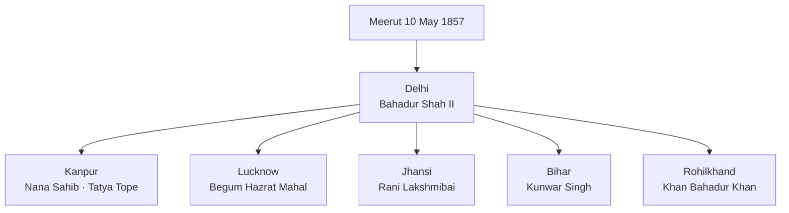
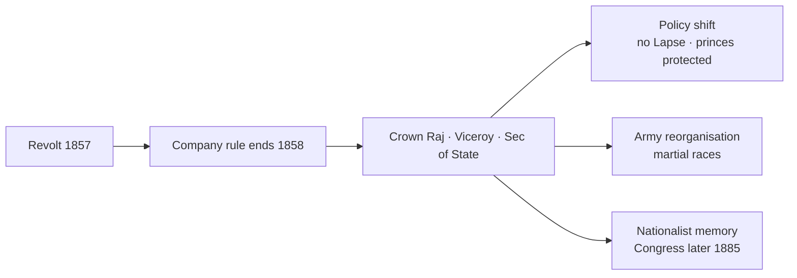

# Revolt of 1857

> GS-1 · Topic 02 · Uprising of 1857 — causes, centres, leaders, ideology, turning point

---

## PYQs

| Year | M | Words | Question (EN) | प्रश्न (HI) | ID |
|------|---|-------|---------------|-------------|-----|
| 2023 | 12 | 200 | Underline ideological dimensions of the uprising of 1857. | 1857 के स्वतंत्रता संग्राम के वैचारिक आयामों की रेखांकित कीजिए। | Q1 |
| 2018 | 12 | 200 | "Revolt of 1857 was a turning point in Indian History". Analyse. | "1857 का विद्रोह भारतीय इतिहास में एक निर्णायक मोड़ था।" विश्लेषण कीजिए। | Q2 |

---

## Quick Revision

```
1857 = UPRISING / REVOLT / FIRST WAR OF INDEPENDENCE (Savarkar 1909)
  Trigger: Meerut 10 May → Delhi 11 May (Bahadur Shah II proclaimed)
  Spread: Delhi · Kanpur · Lucknow · Jhansi · Bareilly · Bihar · Assam fringes

CAUSES:
  Military: Enfield greased cartridges (cow/pig fat rumour) · Barrackpore Mangal Pandey (29 Mar 1857)
  Religious: Missionary activity · Religious Disabilities Act 1850 · interference in customs
  Political: Doctrine of Lapse (Dalhousie) · Awadh annexed 1856 · Mughal humiliation · Subsidiary Alliance
  Economic: Land revenue · taluqdars displaced (Awadh) · peasant-artisan distress · deindustrialisation

CENTRES & LEADERS:
  Delhi — Bahadur Shah II · Bakht Khan · General Bakht Khan (Fatehpuri mosque HQ)
  Kanpur — Nana Sahib · Tatya Tope · Azimullah Khan
  Lucknow — Begum Hazrat Mahal · Birjis Qadr
  Jhansi — Rani Lakshmibai (d. Gwalior 1858) · joined by Tatya Tope
  Bihar — Kunwar Singh (Jagdispur, 80+ age)
  Bareilly — Khan Bahadur Khan · Banaras — Maulvi Ahmadullah Shah
  Faizabad — Maulvi Ahmadullah · Rohilkhand — Fazl-e-Haq Khairabadi

BRITISH SUPPRESSION: Delhi recaptured Sep 1857 (John Nicholson died) · Lucknow 1858 · Jhansi fell ·
  Gwalior June 1858 · Kunwar Singh died Apr 1858 · Bahadur Shah exiled Rangoon (d. 1862)

IDEOLOGICAL DIMENSIONS:
  Restorationism: Bahadur Shah as symbol — NOT modern nationalism but Mughal-Indian sovereignty
  Hindu-Muslim unity: joint fight at Delhi, Lucknow — "unity in adversity" (limited, regional)
  Anti-foreign / anti-Christian missionary · anti-British rule — NOT anti-modernity uniformly
  Peasant-talukdar-grievance · military sepoy identity · regional kings (Nana, Begum, Rani)
  NO unified programme · NO all-India organisation · NO post-1857 economic ideology

TURNING POINT:
  End of Company rule → Govt of India Act 1858 (Crown rule) · Queen's Proclamation Nov 1858
  Doctrine of Lapse withdrawn · Religious non-interference pledged · Indian rulers protected
  Army reorganisation: British ratio increased · recruitment from "martial races" (Punjab, Gurkha)
  Racial arrogance ↑ · ICS · Railways/telegraph expansion · Congress only 1885 (28 yrs later)

HISTORIOGRAPHY:
  British: "Sepoy Mutiny" (law-and-order) | Nationalist: V.D. Savarkar "First War of Independence"
  R.C. Majumdar: limited + not planned national revolt | S.B. Chaudhuri / Bipan Chandra: broader than mutiny

CONTEMPORARY: 1857 memorials · Red Fort museum · Azadi Ka Amrit Mahotsav · Art 49/51A(f)
  NEP 2020 critical history · UP sites: Lucknow Residency · Jhansi fort · Meerut

TRAPS: 1857 ≠ planned national independence war (exam nuance) | NOT all India participated
  Cartridge ONLY cause — FALSE | Savarkar ≠ contemporary leader | Bahadur Shah ≠ active organiser
  Unity ≠ permanent communal harmony thesis | Lapse ended AFTER 1857 | Rani ≠ only woman leader
```

---

## Content

### Context — what the Revolt of 1857 was

The **Revolt of 1857**—called by British officials the **Sepoy Mutiny**, by **V.D. Savarkar (1909)** the **First War of Independence**, and by modern historians an **uprising** or **rebellion**—was a major armed challenge to the **English East India Company** lasting from **May 1857 to mid-1858**. It erupted in **north and central India**, with limited echoes in Assam and elsewhere, but never became a coordinated all-India war. The conventional chronology begins **10 May 1857**, when sepoys at **Meerut** mutinied, marched to **Delhi**, and on **11 May** proclaimed the aged **Bahadur Shah II** as symbolic emperor. Suppression was largely complete by **June 1858** after the fall of **Gwalior**. **Uttar Pradesh** bore the revolt's heaviest weight: **Delhi, Kanpur, Lucknow (Awadh), Bareilly, Faizabad**, and linked corridors formed the rebellion's core geography.

The revolt matters because it ended **Company rule**, reshaped **colonial policy and army structure**, and became a **foundational martyrdom narrative** in Indian nationalism—yet it was **not** modern mass nationalism and **did not** bring freedom. Its causes, ideology, and consequences must be read together.

### Immediate trigger — cartridges, honour, and the Meerut march

The new **Enfield rifle** cartridge (1857) was rumoured to be greased with **cow and pig fat**, offending **Hindu and Muslim sepoys** alike because biting the greased paper violated **dharma** and **imaan**. **Mangal Pandey** of the **34th Native Infantry at Barrackpore (29 March 1857)** attacked British officers over this issue, was court-martialled, and hanged **8 April 1857**—becoming an early martyr symbol. At **Meerut**, **85 sepoys of the 19th Native Infantry**, court-martialled **9 May** for refusing cartridges, were released by mutineers on **10 May**, who killed British officers and marched to **Delhi**.

**Why** sepoys led but others joined: sepoys were a **peasant-artisan soldier class** whose grievances extended beyond cartridges—**low pay**, loss of **bhatta** (field allowances), the **General Service Enlistment Act 1856** (compulsory overseas service violating caste pollution rules), and discrimination versus **European soldiers**. **How** the revolt generalised: when civil populations—**talukdars, peasants, dispossessed princes' followers**—saw Company authority waver, they seized the chance to reverse **annexations, revenue settlements, and humiliations**. The cartridge was the **trigger**, not the **cause**.

### Causes — political, economic, religious, and military accumulation

| Dimension | Grievances | Concrete examples |
|-----------|------------|-------------------|
| **Political** | Annexation, lapse, dynastic humiliation | **Awadh annexed Feb 1856**; **Jhansi** under **Doctrine of Lapse**; **Nana Sahib** denied Peshwa pension; **Mughal succession** restricted (**1856** plan threatening **Bahadur Shah II**) |
| **Economic** | Revenue extraction, displacement, artisan decline | **Permanent Settlement** pressure; **Awadh taluqdars** displaced by **Summary Settlement**; **deindustrialisation** |
| **Religious** | Missionary activity, legal interference | **Religious Disabilities Act 1850**; protected **Christian missionaries**; fear of **conversion**; **cow protection** sentiment |
| **Military** | Service conditions, caste violation | **Enfield cartridges**; **General Service Enlistment Act 1856**; pay disparities |

**Lord Dalhousie (1848–56)** had annexed **Satara, Jhansi, Nagpur, and Sambalpur** under the **Doctrine of Lapse** (rejecting adopted heirs). **Awadh's annexation (1856)** on **misgovernance** charges displaced **nawabi elite and talukdars**, making **Lucknow** a rebel stronghold under **Begum Hazrat Mahal**. The Company's interference in **Mughal succession**—ordering **Bahadur Shah II** to exclude certain heirs—was read as an attack on **dynastic legitimacy**. These political fuse-lines explain **why** civil and military discontent converged in the Gangetic heartland.

### Spread — centres, leaders, and regional character



| Centre | Leader(s) | Role and significance |
|--------|-----------|----------------------|
| **Delhi** | **Bahadur Shah II**, **Bakht Khan** | **Badshah-e-Hind** as symbolic sovereignty; **Bakht Khan** (from Bareilly) organised sepoy–civil administration; HQ near **Fatehpuri mosque** |
| **Kanpur** | **Nana Sahib**, **Tatya Tope**, **Azimullah Khan** | Siege of **Wheeler's entrenchment**; **Bibighar massacre** (contested accounts); guerrilla resistance after fall |
| **Lucknow** | **Begum Hazrat Mahal**, **Birjis Qadr** | **Awadh** resistance; **Residency** siege; **talukdar–peasant** coalition |
| **Jhansi** | **Rani Lakshmibai** | Annexation grievance; fought with **Tatya Tope**; died **17 June 1858** at **Kotah-ki-Serai, Gwalior** |
| **Bihar** | **Kunwar Singh** (Jagdispur) | Landed leader aged **80+**; wounded in battle; died **26 April 1858** |
| **Bareilly/Rohilkhand** | **Khan Bahadur Khan** | Mughal lineage claim; operations around **Shahjahanpur** |
| **Faizabad belt** | **Maulvi Ahmadullah Shah** | **Ulama** leadership; anti-British idiom in some **jihad** frameworks |
| **Assam (limited)** | **Kandapareshwar Singh**, **Maniram Dewan** | Localised rising; **Maniram Dewan** executed |

Participation was **strong** in the **Gangetic plain, Awadh, Rohilkhand, Bihar, Delhi region, and parts of Central India**. It was **weak or absent** in **Punjab** (recently annexed; **Sikh chiefs largely sided with British** under **John Lawrence**), **Sind**, most of **south India**, **eastern Bengal**, and the **Bombay Presidency**. The revolt was a **regional constellation** under a **loose Delhi Mughal umbrella**, not a centrally planned national war.

### Course of the revolt and British suppression

At **Delhi**, rebels held the **Red Fort** area with **Bahadur Shah** as nominal head. The **siege of Delhi (June–September 1857)** ended when **John Nicholson** led the assault; **Delhi fell 20 September 1857**; Nicholson died; **Bahadur Shah** was captured. At **Kanpur (June–July 1857)**, **Nana Sahib** besieged **Wheeler's entrenchment**; after surrender came **Bibighar killings** of British women and children—followed by **extreme British reprisals** documented in colonial records. The Kanpur cycle illustrates **why** the revolt's memory became polarised: rebel violence and **British collective punishment** (**village burning, blowing from guns**) mutually deepened hatred, making post-1857 reconciliation impossible and **Crown takeover** inevitable. At **Lucknow**, the **Residency** was besieged; **Henry Lawrence** died; relief came through **Havelock, Outram, and Campbell**; the city was recaptured **March 1858**. **Rani Lakshmibai** captured **Gwalior** with **Tatya Tope**; **Hugh Rose** defeated her; she was killed **June 1858**; **Gwalior fell** soon after.

A **guerrilla phase** followed: **Tatya Tope** fought until **April 1859** (captured and executed); **Kunwar Singh** and **Maulvi Ahmadullah Shah** conducted mobile resistance until death. **Fazl-e-Haq Khairabadi**, a **Deobandi scholar**, issued anti-British writings and was **exiled** after suppression—proof that **ulama** intellectual leadership extended beyond the battlefield.

**Women in the revolt**: **Rani Lakshmibai** refused submission after **Jhansi's lapse**, led military resistance, and died fighting at **Gwalior (June 1858)**. **Begum Hazrat Mahal** proclaimed her son **Birjis Qadr**, held **Lucknow** with **talukdar support**, and after defeat **exiled herself to Nepal**—she was not the only woman leader, but patriarchal military culture still dominated rebel ranks. British suppression employed **collective punishment, village burning, and blowing from guns**—deepening racial antagonism and destroying Company legitimacy. **Bahadur Shah** was **exiled to Rangoon** and died **1862**, ending the Mughal dynasty. Suppression's brutality directly prompted **transfer of power to the Crown**.

### Ideological dimensions — ideas that gave the revolt meaning

The revolt's ideology was **not** modern **Congress-style nationalism** (no democratic constitution, no swaraj programme, no permanent organisation). It was a layered set of **symbols, motivations, and restorationist visions** that made the uprising more than a military mutiny.

| Ideological strand | What believers sought | Evidence and limits |
|--------------------|----------------------|---------------------|
| **Restoration of indigenous sovereignty** | **Bahadur Shah II** as **Badshah-e-Hind**; pre-Company political order restored | **Delhi manifestos**, **coinage in Bahadur Shah's name**; not republican nationalism |
| **Hindu–Muslim unity (conjunctural)** | Joint Hindu–Muslim fight at **Delhi, Lucknow, Kanpur** | **Bakht Khan** at Mughal court; **Begum + talukdars**; tactical, regional—not a permanent programme |
| **Anti-foreign / anti-Company rule** | Rejection of **annexations, subsidiary humiliation, missionary protection** | Clearly anti-British; rebels were **not uniformly anti-technology** (used firearms, understood telegraph) |
| **Religious idiom** | Defence of **dharma/imaan** against **Christianisation** | **Maulvi Ahmadullah Shah**, **Fazl-e-Haq Khairabadi** (Deobandi scholar, exiled); religious language ≠ war against Hindus |
| **Feudal-bureaucratic restoration** | **Talukdars, dispossessed princes** reclaim old authority | **Socially conservative**; no land redistribution; **Nana Sahib, Rani, Kunwar Singh** fought for dynastic rights |
| **Sepoy honour** | Military self-respect violated by cartridges and overseas service | **General Service Enlistment Act 1856** threatened **caste pollution** |
| **Regional patriotism** | **Awadh, Jhansi, Maratha Peshwa** loyalties | **Nana Sahib** = Peshwa claim; **Begum** = Awadh autonomy |

**Historiography** frames the ideology debate: British officials called it **"Sepoy Mutiny"** (disciplinary breach); **Savarkar (1909)** reclaimed it as **War of Independence**; **R.C. Majumdar** stressed **limited extent and planning**; **S.B. Chaudhuri** and **Bipan Chandra** argued for **broader anti-colonial, multi-class character**. None of these labels erase the revolt's **restorationist, not revolutionary**, social content.

**Azimullah Khan**, **Nana Sahib's** adviser, had travelled in Europe and still chose rebellion—showing that exposure to **Western modernity** did not automatically produce **loyalty to Company rule**. Rebels issued **farmans and proclamations** at Delhi invoking **pre-colonial sovereignty**; they did not draft a **modern constitution** or **equal citizenship programme**—the gap that later **Congress nationalism** would attempt to fill.

### Why 1857 was a turning point — political, military, and memorial transformation

**What changed immediately**: The **Government of India Act 1858** dissolved the Company; a **Secretary of State for India** entered the British cabinet; the Governor-General became **Viceroy**. **Queen Victoria's Proclamation (1 November 1858)**, read by **Lord Canning at Allahabad**, pledged **non-annexation of states**, **religious non-interference**, **equal protection under law**, and gradual Indian participation in administration.

| Pre-1857 (Company) | Post-1857 (Crown) |
|--------------------|-------------------|
| **Doctrine of Lapse** actively used | **Lapse withdrawn**; princes as **protected allies** |
| Aggressive annexation (**Awadh 1856**) | **Paramountcy** and indirect rule emphasis |
| Perceived missionary zeal | Pledged **religious neutrality** (partially observed) |
| Mixed-recruitment army | **"Martial races"** theory; **Punjab/Gurkha** recruitment up; **Bengal/Brahmin** recruitment down |

**Why** this constitutes a turning point: British rule **did not end**, but its **form and logic** changed—from an expanding **merchant-state** to an **imperial Crown bureaucracy** with stabilised **princely buffers**, hardened **racial arrogance**, and accelerated **control infrastructure** (**railways, telegraph, canals, forest laws**). The **Indian Councils Act 1861** introduced nominal Indian presence—not democracy, but a new constitutional track.

**What did not change immediately**: India did not become free; the **Indian National Congress** was founded only in **1885**, **28 years later**. Martyrs—**Mangal Pandey, Rani Lakshmibai, Kunwar Singh, Tatya Tope**—entered **nationalist folklore** from the **1880s onward**. Peasant struggles continued (**indigo revolt 1859–60, Deccan Riots 1875**). In **Awadh**, British **partially rehabilitated talukdars** post-1857 to pacify the region, altering land politics. **Delhi–Calcutta telegraph** lines, restored for military use during the revolt, symbolised how **infrastructure expansion** would serve **control** under Crown rule. The turning point lies in **colonial restructuring and anti-colonial memory**, not liberation.



### Significance — failure on the battlefield, transformation in history

In the **short term**, the revolt **failed militarily**; British victory brought **mass reprisals** and the **Mughal dynasty's end**. In the **long term**, it **restructured colonial India**, formalised the **princely-state system**, and supplied nationalist historiography with a **foundational martyrdom narrative**. Women leaders—**Rani Lakshmibai** and **Begum Hazrat Mahal** (who proclaimed **Birjis Qadr** and later **exiled to Nepal**)—proved the revolt exceeded sepoy mutiny, yet operated within **patriarchal, restorationist** frameworks.

**Punjab's loyalty to British** under **John Lawrence** demonstrates **regional variation**: recently annexed **Sikh chiefs** saw the Company as a **lesser evil** than restored Mughal or Maratha dominance—and were rewarded through post-1857 **canal colonies and "martial race" recruitment**, reshaping **colonial military geography** for a century.

**Indigo revolt (1859–60)**, immediately after suppression, shows **continuity** between pre-1857 economic grievances and post-1857 peasant resistance: the revolt did not end exploitation—it **transformed the colonial state** that would continue extracting surplus until the **national movement** inherited both **1857's memory** and **1859's peasant anger**.

**Nana Sahib's** claim as **Peshwa heir** and **Azimullah Khan's** diplomatic background illustrate how **dispossessed Maratha sovereignty** merged with **sepoy grievance** at **Kanpur**—regional ideologies layered atop the **Delhi Mughal symbol** without fusing into one programme. **Entire Indian army did not mutiny**—**Punjab and Gurkha units** largely remained loyal, which is **why** British survival was possible despite **Delhi's symbolic challenge**.

### Contemporary relevance

**Azadi Ka Amrit Mahotsav (2021–2025)** commemorates **1857 heroes**—**Rani Lakshmibai, Mangal Pandey, Kunwar Singh**—in curricula and public exhibitions. **Museums and memorials** at **Red Fort (1857 museum), Lucknow Residency (ASI), Jhansi Fort, and Meerut Shaheed Smarak** are protected under **Article 49**. **Article 51A(f)** makes valuing freedom-struggle heritage a citizen duty; **1857** is taught as the **first major pan-regional anti-colonial upsurge**. **NEP 2020** promotes **multi-perspective critical history**—mutiny versus war-of-independence debate without dogma. **Swadesh Darshan/PRASAD** tourism circuits link **Awadh, Jhansi, and Meerut** to heritage economies. **1857 Hindu–Muslim cooperation** is cited in secular nationalism discourse, though historians insist it was **context-specific**, not a permanent harmony model. Digitised **Mutiny records** at the **National Archives of India** and **British Library** enable evidence-based study.

### Limits and balanced view

The revolt was **not all-India**—**Punjab, the south, and much of the east** stayed quiet. It had **no central command** after **Bakht Khan's Delhi administration** fragmented. Socially, it was an **elite-led restoration** with mass participation, **not a peasant revolution**. **Hindu–Muslim cooperation** was real at major centres but **limited and tactical**; post-suppression **communal recruitment policy** altered army composition. **Savarkar did not lead 1857**—his **1909** book was retrospective nationalist reclamation. **Bahadur Shah II** was a **reluctant symbolic head**, not an organiser. **Doctrine of Lapse ended after 1857**, not before. Rebels **lost**; the turning point is in **British policy and memory**, not immediate freedom. **Mangal Pandey rebelled at Barrackpore (29 March 1857)**, not Meerut—**Meerut's march (10 May)** followed his execution as **martyr-symbol**.

---

## Answers

### Q1: Underline ideological dimensions of the uprising of 1857. (2023, 12M, 200W)

**Opening:**
> The Revolt of 1857 was not a mere military mutiny but expressed layered ideologies — restoration of indigenous sovereignty, religious honour, anti-foreign rule, and conjunctural Hindu-Muslim unity — even though it lacked modern nationalist organisation.

**Write these points:**
- **Restorationist sovereignty:** Proclamation of **Bahadur Shah II** as **Badshah-e-Hind** — ideology of **restoring pre-Company Indian political order**, not republican nationalism.
- **Anti-colonial / anti-Company:** Resistance to **annexations (Awadh, Jhansi)**, **Doctrine of Lapse**, **subsidiary humiliation** — **Nana Sahib, Begum Hazrat Mahal, Rani Lakshmibai** fought for **dispossessed indigenous authority**.
- **Religious idiom:** **Greased cartridges**, **missionary activity**, **Religious Disabilities Act 1850** — revolt framed as defence of **dharma/imaan**; **Maulvi Ahmadullah**, **Fazl-e-Haq Khairabadi** used **Islamic legitimacy** in some regions.
- **Hindu-Muslim unity (tactical):** Joint sepoy-civil struggle at **Delhi, Lucknow, Kanpur** — **Bakht Khan** and Mughal court; **talukdar-Muslim-Hindu coalitions in Awadh** — unity **against British**, not a permanent secular programme.
- **Sepoy honour and caste:** **General Service Enlistment Act 1856**, pay, **foreign service** — **military self-respect** ideology among **peasant-soldiers**.
- **Limits:** **No unified manifesto**, **regional loyalties** (Awadh, Maratha, Jhansi) dominated; **Savarkar's "War of Independence"** is **later nationalist reading** — **R.C. Majumdar** cautions on **extent and planning**.

**Conclusion:**
> Ideologically, 1857 combined restorationist, religious, and anti-colonial strands with remarkable but regional Hindu-Muslim cooperation — a precursor spirit to later nationalism, not yet modern mass ideology.

---

### Q2: "Revolt of 1857 was a turning point in Indian History". Analyse. (2018, 12M, 200W)

**Opening:**
> The Revolt of 1857 failed militarily but fundamentally altered India's colonial trajectory — ending Company rule, reshaping British policy, army structure, and nationalist memory.

**Write these points:**
- **Political turning point:** **Government of India Act 1858** — **Company rule ended**; **British Crown** direct rule; **Viceroy + Secretary of State for India** — new **imperial administrative system**.
- **Queen's Proclamation (1858):** **Doctrine of Lapse withdrawn**, pledge of **non-annexation of states**, **religious non-interference** — **princely states** integrated as **subordinate allies** (new paramountcy system).
- **Military reorganisation:** Indian army restructured — **"martial races" recruitment** (Punjab, Gurkha); reduced **Bengal/Brahmin** sepoys; **British racial distrust** hardened after mutiny.
- **State strengthening:** Post-1857 expansion of **railways, telegraph, canals, forest laws** — **colonial control infrastructure** accelerated.
- **Nationalist memory:** Martyrs **Mangal Pandey, Rani Lakshmibai, Kunwar Singh, Tatya Tope** became **freedom struggle icons** — **Savarkar (1909)** called it **First War of Independence**; **Congress (1885)** came later but drew on **1857 legacy**.
- **Limits of "turning point":** **Not independence** — British rule **deepened** for **90 more years**; revolt **not all-India**; **immediate outcome** was **stronger empire**.

**Conclusion:**
> 1857 marks the decisive transition from Company mercantile expansion to Crown imperialism and planted anti-colonial memory — a turning point in colonial structure and nationalist consciousness, not in immediate liberation.

---

### Q3: *Likely:* Discuss the causes of the Revolt of 1857. (Future variant, 12M, 200W)

**Opening:**
> The Revolt of 1857 erupted from accumulated political, economic, religious, and military grievances under Company rule — with the greased cartridge incident as trigger, not sole cause.

**Write these points:**
- **Political:** **Doctrine of Lapse**, **Awadh annexation (1856)**, **Jhansi**, denial of **Nana Sahib's pension**, threat to **Mughal succession**.
- **Economic:** **Land revenue systems**, **Awadh talukdar displacement**, **peasant indebtedness**, **deindustrialisation** — artisan and rural distress.
- **Religious:** **Missionary activity**, **Religious Disabilities Act 1850**, fear of **conversion** and **interference in customs**.
- **Military:** **Enfield cartridges**, **General Service Enlistment Act 1856**, pay and caste violations — **Mangal Pandey (March 1857)**, **Meerut (May 1857)**.
- **Immediate spark:** **85 sepoys Meerut** → **Delhi 11 May** — **Bahadur Shah** proclaimed.

**Conclusion:**
> Multi-causal in origin, 1857 expressed a crisis of legitimacy of Company rule across classes and regions of north India — far exceeding a simple sepoy mutiny.

---

### Q4: *Likely:* Evaluate the role of Rani Lakshmibai and Begum Hazrat Mahal in the Revolt of 1857. (Future variant, 8M, 125W)

**Opening:**
> Rani Lakshmibai of Jhansi and Begum Hazrat Mahal of Awadh embodied regional resistance led by dispossessed indigenous rulers — women who became national icons of 1857.

**Write these points:**
- **Rani Lakshmibai:** Jhansi annexed under **Doctrine of Lapse**; refused submission; captured **Gwalior** with **Tatya Tope**; died fighting **June 1858** — symbol of **defiance and military leadership**.
- **Begum Hazrat Mahal:** Led **Awadh** resistance after **Nawab exiled**; proclaimed **Birjis Qadr**; held **Lucknow** with **talukdar support**; exiled to **Nepal** after defeat.
- **Significance:** Both transformed **personal/dynastic grievance** into **mass anti-British movements** in their regions.
- **Limit:** **Regional**, not **all-India command**; post-1857 **British gendered and racial policies** still patriarchal.

**Conclusion:**
> Their roles prove 1857 was broader than sepoy mutiny — yet remained rooted in restorationist regional politics later canonised by nationalist memory.

---

## Traps

| Wrong | Correct |
|-------|---------|
| 1857 was a planned national war of independence across all India | **Regional uprising** — strong in **north/central**; **Punjab largely pro-British**; **not fully coordinated** |
| Greased cartridges were the only cause | **Trigger**, not sole cause — **annexations, revenue, religion, army policies** accumulated |
| Savarkar led the 1857 revolt | **Savarkar wrote in 1909** — **retrospective nationalist interpretation** |
| Bahadur Shah II actively planned the revolt | **Sepoys proclaimed him** at Delhi — he was **reluctant symbolic head** |
| Revolt succeeded in ending British rule | **British won by 1858** — outcome was **Crown rule**, not freedom |
| Doctrine of Lapse continued after 1857 | **Withdrawn** in **Queen's Proclamation 1858** |
| 1857 had modern secular nationalism like Congress | **Restorationist + religious + anti-Company** — **not 1885-style nationalism** |
| Hindu-Muslim unity in 1857 proves permanent communal harmony | **Conjunctural alliance** against British — **do not overgeneralise** |
| Mangal Pandey rebelled at Meerut | **Barrackpore, 29 March 1857** — Meerut was **10 May 1857** |
| Rani Lakshmibai was the only woman leader | Also **Begum Hazrat Mahal** and others — **multiple women leaders** |
| Transfer of power to Crown meant democracy for Indians | **Imperial bureaucracy** — **1861 Councils** had **nominal Indian presence only** |
| Entire Indian army mutinied | **Many regiments stayed loyal** — especially **Punjab, Gurkha** units |
| 1857 immediately led to Indian National Congress | **Congress founded 1885** — **28 years later** |

---

*Complete.*
