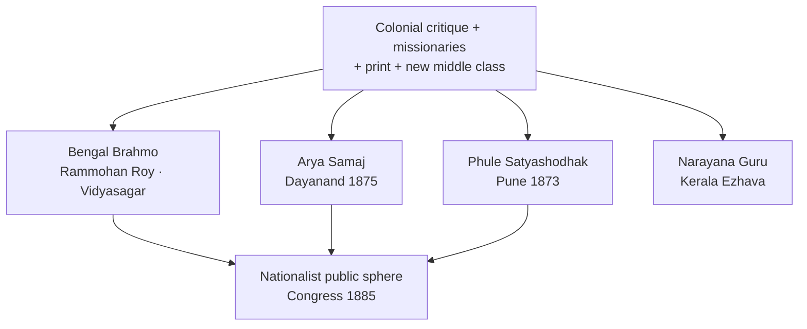
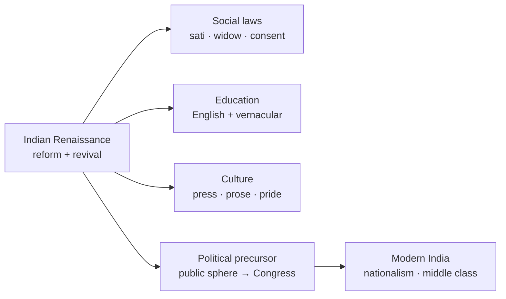

# Socio-Religious Reform Movements

> GS-1 · Topic 02 · 19th-century reform, Indian Renaissance, women, caste, education

---

## PYQs

| Year | M | Words | Question (EN) | प्रश्न (HI) | ID |
|------|---|-------|---------------|-------------|-----|
| 2025 | 8 | 125 | "Women's issue was a major concern in the socio-religious reform movements of 19th century India". Explain. | "उन्नीसवीं शताब्दी के भारतीय सामाजिक-धार्मिक सुधार आंदोलनों में महिलाओं के मुद्दे एक प्रमुख चिंता का विषय थे"। स्पष्ट कीजिए। | Q1 |
| 2021 | 12 | 200 | How did Indian Renaissance Movement of 19th Century help in the development of India? Describe. | 19वीं सदी के भारतीय पुनरुद्धार आंदोलन ने भारत के विकास में किस प्रकार सहयोग दिया? वर्णन कीजिए। | Q2 |

---

## Quick Revision

```
19th C REFORM = response to COLONIAL CRITIQUE + MISSIONARIES + INTERNAL CRISIS
  Colonial: "Oriental despotism, sati, child marriage, idolatry" | Internal: caste rigidity, purdah, illiteracy
  NOT one movement — Brahmo · Arya Samaj · Prarthana · Ramakrishna-Vivekananda · Aligarh · Sikh/Nanak panth reform

INDIAN RENAISSANCE (c.1800–1900): Bengal leads → spreads west/south
  Features: Rationalism · monotheism · vernacular press · English-educated elite · revival + reform dialectic
  Raja Rammohan Roy (1772–1833): Brahmo Samaj 1828 · sati abolition 1829 · Vedantic monotheism
  Ishwar Chandra Vidyasagar: Widow Remarriage Act 1856 · Bengali prose · girls' schools
  Swami Dayanand Saraswati: Arya Samaj 1875 · "Back to Vedas" · shuddhi · women's education
  Jyotirao Phule: Satyashodhak Samaj 1873 · anti-Brahmin · girls' school with Savitribai 1848
  Sri Narayana Guru (Kerala): caste equality · "One caste, one religion, one God"
  Syed Ahmad Khan: Aligarh — modern education (separate file 03.3) · social reform limited

WOMEN'S ISSUES — REFORM AGENDA:
  Sati (1829 Reg V) · widow remarriage (1856 Bengal Act, Vidyasagar) · child marriage opposition
  Purdah/zenana · female infanticide · education ( Bethune School 1849 · SNDT · Arya Kanya pathsalas)
  Age of Consent Act 1891 (Rukhmabai case) · legal property rights limited
  Women as agents: Savitribai Phule · Pandita Ramabai · Sarojini Naidu (later) · Tarabai Shinde "Stri Purush Tulana" 1882

CAUSES OF REFORM:
  British utilitarian critique (Macaulay, Benthamites) · Christian missionaries · Orientalist rediscovery
  Print culture (Samachar Darpan 1818) · railways/telegraph · 1857 aftermath caution on religious interference
  New middle class — bhadralok, Parsi, Marathi intelligentsia

CONTRIBUTION TO INDIA'S DEVELOPMENT:
  Social: humanised customs · legal abolitions · education spread · caste challenge (Phule, Guru)
  Cultural: Bengali/Marathi/Gujarati prose · theatre · historical consciousness
  Political precursor: public sphere · nationalist critique · unity symbols (not yet mass Congress)
  Economic: technical/modern education · merchant reformists (Parsi)

LIMITS: Elite-led · partial geography · women "protection" not full equality · caste reform uneven
  Revivalism (Arya Samaj shuddhi) also had exclusionary side · no peasant land reform

CONTEMPORARY: NEP 2020 Beti Bachao · Article 15 · anti-sati law legacy · widows' rights
  ICHR/NCERT reform narratives · Art 51A(e) dignity of women · UNESCO intangible (Baul, Vedic chant parallel)

TRAPS: Renaissance ≠ European copy | Roy ≠ abolished sati alone (Bentinck + law)
  Reform ≠ all India same time | Arya Samaj ≠ Brahmo (Vedic revival vs monotheism)
  Women issue central BUT patriarchal reform frame | Phule ≠ Brahmo Samaj
```

---

## Content

### Context — the Indian awakening in a colonial century

**Socio-religious reform movements** of the nineteenth century (roughly **1800–1900**) were organised efforts by **Indian intellectuals, religious leaders, and social activists** to critique and transform Hindu, Muslim, Sikh, and Parsi social practices. They arose partly in response to **British colonial critique** of Indian society, **Christian missionary activity**, and an **internal crisis** of caste rigidity, gender oppression, ritual excess, and illiteracy. Historians often call this period the **Indian Renaissance** or **Indian awakening**—**not** a copy of the European Renaissance but a label for **intellectual regeneration**, **rational religion**, and **social modernisation** pursued within Indian frameworks.

**What** distinguished these movements: they combined **scriptural reinterpretation**, **legal petitioning**, **vernacular publishing**, and **voluntary associations (samaj/sabha)** to change society without yet launching mass political independence struggle. **How** they spread: Bengal led (**Calcutta**), then **Bombay, Pune, Madras, Punjab, Kerala, and parts of UP**—uneven in timing and character. **Why** they matter: they **humanised cruel customs**, spread **education**, challenged **caste orthodoxy** in places, and created the **public sphere** that **Congress (1885)** later inherited. **Proof** of impact: **legal abolitions (sati 1829, widow remarriage 1856)**, girls' schools from **1848 onward**, and constitutional descendants in **Articles 14–15 and 17 (1950)**.

### Causes — why reform arose when it did

| Cause | How it operated | Examples |
|-------|-----------------|----------|
| **Colonial critique** | British utilitarians attacked "superstition" to justify empire | **William Bentinck**; **sati abolition 1829** after **Rammohan Roy's** petitions |
| **Missionary activity** | Schools, hospitals, and conversion challenged orthodoxy | **Serampore missionaries (Carey)**, **Alexander Duff**—provoked **defensive reform** |
| **Orientalist rediscovery** | Sanskrit/Persian scholarship revived pride and selective revival | **William Jones**, **Asiatic Society (1784)**; **Dayanand's "Back to Vedas"** |
| **New middle class** | English education and print created reformist intelligentsia | **Bhadralok**, **Parsi reformers (Dadabhai Naoroji, Behramji Malabari)** |
| **Print culture** | Vernacular newspapers spread ideas | **Samachar Darpan (1818)**, **Sambad Kaumudi (Rammohan Roy)** |
| **Post-1857 caution** | Crown pledged religious non-interference—Indians led social legislation | **Widow Remarriage Act 1856**, **Age of Consent 1891** |

**Why** reform was neither purely indigenous nor purely colonial: Indians **internalised** British criticism of sati and child marriage but **rebutted** civilisational inferiority through **scriptural argument** and **cultural pride**. **Macaulay's Minute (1835)** created an **English-educated elite** who became both **collaborators** and **critics** of colonial rule.

### Major movements and leaders — a multi-stream Renaissance

| Movement / leader | Founded | Region | Key ideas and work |
|-------------------|---------|--------|-------------------|
| **Raja Rammohan Roy** | **Brahmo Samaj (1828)** | Bengal | **Monotheism**, anti-idolatry, **anti-sati campaign**, **freedom of press**, Persian–Arabic–Sanskrit scholarship |
| **Debendranath Tagore, Keshab Chandra Sen** | Brahmo phases | Bengal | Rational religion; **Keshab's** radical social reform; **Brahmo Marriage Act 1872** |
| **Ishwar Chandra Vidyasagar** | Institutional reform | Bengal | **Widow Remarriage Act 1856** campaign; **Bengali prose**; **Sanskrit College** reform; **girls' schools** |
| **Swami Dayanand Saraswati** | **Arya Samaj (1875)** | Punjab/North | **"Go back to Vedas"**, **shuddhi**, **cow protection**, **women's education**, **DAV schools** |
| **Prarthana Samaj** | **1867** (Atmaram Pandurang) | Bombay | Theistic reform—**Ranade**, **Gopal Hari Deshmukh ("Lokhitwadi")** |
| **Jyotirao & Savitribai Phule** | **Satyashodhak Samaj (1873)** | Pune | **Anti-caste**, **Shudra–Ati-Shudra uplift**, **first girls' school (1848)**, *Gulamgiri* (1873) |
| **Sri Narayana Guru** | **SNDP / Aruvippuram (1888)** | Kerala | **"One caste, one religion, one God"**—**Ezhava** dignity, **temple entry** |
| **Ramakrishna–Vivekananda** | **Ramakrishna Mission (1897)** | Bengal | **Practical Vedanta**, social service, **Chicago 1893** |
| **Syed Ahmad Khan** | **Aligarh (1875 MAO College)** | North | **Modern Muslim education**, *Tahzib-ul-Akhlaq*—social reform **limited** |
| **Parsi reform** | Rahnumai Mazdayasnan | Bombay | Marriage/inheritance reform, women's education |



**How Brahmo and Arya Samaj differed**: **Brahmo Samaj** drew on **Upanishadic monotheism**, rejected idolatry, and appealed to **Bengali bhadralok** elite. **Arya Samaj** asserted **Vedic infallibility**, promoted **shuddhi** (reconversion), and reached **Punjab/North** vernacular audiences. Both supported **women's education** and opposed **sati**; only **Arya Samaj** combined reform with **militant revivalism** and **cow protection**.

**Ramakrishna and Vivekananda** represent a third synthesis: **Ramakrishna's** experiential pluralism and **Vivekananda's Ramakrishna Mission (1897)** translated **Vedanta into social service**, famine relief, and **global Hindu self-confidence**—especially after the **Chicago Parliament of Religions (1893)**. **Cornelia Sorabji**, first woman advocate, worked on **zenana legal access**—showing reform also produced **professional women** entering colonial institutions.

### Women's issues — why they became central and what changed

Colonial and missionary discourse singled out **sati, child marriage, purdah, female illiteracy, and infanticide** as proof of Indian "backwardness." Indian reformers **accepted the humanitarian critique** but rejected civilisational slurs, arguing through **scripture and reason** that true religion required **women's dignity**—often within a **patriarchal protection frame**, not full gender equality.

| Issue | Pre-reform practice | Reform action | Leader / law |
|-------|---------------------|---------------|--------------|
| **Sati** | Widow immolation | Campaign + legislation | **Rammohan Roy**; **Bengal Sati Regulation 1829** (**Bentinck**) |
| **Widow remarriage** | Social ban, penury | Legalisation | **Vidyasagar**; **Widow Remarriage Act 1856** |
| **Child marriage** | Early marriage norm | Agitation, legal age | **Age of Consent Act 1891** (age **12**); **Malabari**; **Rukhmabai case (1884–88)** |
| **Female education** | Exclusion | Girls' schools | **Savitribai Phule (1848)**, **Bethune School Calcutta (1849)**, **Arya Kanya Pathshala**, **Ramabai's Sharada Sadan (1889)** |
| **Purdah / zenana** | Seclusion | Zenana education, medical access | **Pandita Ramabai**, **Cornelia Sorabji** |
| **Female infanticide** | Killing infant girls | Regulation | **Female Infanticide Prevention Acts (1870s)** |
| **Domestic patriarchy** | Subordination | Literary critique | **Tarabai Shinde**, *Stri Purush Tulana* (1882) |

**Women as agents, not objects**: **Savitribai Phule**—India's first woman teacher at Pune **1848**—fought **caste–gender double oppression**. **Pandita Ramabai** opened **Sharada Sadan** and later **Mukti Mission**, challenging scriptural patriarchy. **Tarabai Shinde** attacked male hypocrisy after the **Vijayalakshmi suicide case**. **Keshab Chandra Sen** promoted women's education and **consent-based marriage** via the **Brahmo Marriage Act**. **Dayanand** in *Satyarth Prakash* opposed **child marriage** and supported **female education** on Vedic grounds.

**Why legal change outran social change**: The **1856 Widow Remarriage Act** permitted remarriage but villages **ostracised** widows who used it for decades. **Age of Consent 1891** raised age to **12**, not **18**—incremental, not modern feminism. **Married Women's Property Act 1874** gave limited property rights—a partial legal gain, not economic emancipation. **Muslim women's reform** lagged in **Aligarh's** male-education focus; **Begum Rokeya** (early twentieth century) shows parallel struggles beyond core nineteenth-century male-led reform. **Sati** was never universal—it concentrated in **Bengal, Bihar, and Rajputana**—yet reformers treated its abolition as civilisational proof.

### Indian Renaissance — reform and revival in dialectic

**What** historians mean by **Indian Renaissance**: intellectual and social regeneration through **rational critique of tradition**, **recovery of classical texts**, **vernacular literary flowering**, and **ethics of service**. **How** reform and revival interacted: **Brahmo monotheism** reformed Hinduism through Upanishads; **Dayanand** revived Vedas to purify later "corruption"; **Vivekananda** synthesised **neo-Hinduism** with **practical Vedanta** and global appeal.

| Feature | Manifestation |
|---------|---------------|
| **Rational religion** | Monotheism, anti-superstition—**Roy, Brahmo, Prarthana Samaj** |
| **Scriptural reinterpretation** | Sati not sanctioned; Vedas support education—**Roy, Dayanand, Phule's anti-Brahmanic reading** |
| **Vernacular literature** | **Bengali prose (Vidyasagar)**, **Marathi satire (Phule)**, Gujarati tracts |
| **Education modernisation** | English + vernacular, scientific outlook, female schools |
| **Press and associations** | **Samaj/sabha** model before Congress |
| **Caste critique** | **Phule, Narayana Guru, Arya Samaj shuddhi**—uneven, sometimes exclusionary |

| Stream | Emphasis | Example |
|--------|----------|---------|
| **Reformist-modernist** | Change via reason + law | **Brahmo Samaj, Vidyasagar, Phule** |
| **Revivalist-reformist** | Purify religion from corruption | **Arya Samaj—Dayanand** |
| **Neo-Hindu synthesis** | Universal Vedanta + service | **Vivekananda, Ramakrishna Mission** |
| **Communal-modernist (Muslim)** | Modern education within Islamic identity | **Aligarh—Syed Ahmad Khan** |

### How the Renaissance contributed to India's development

**Social development**: **Legal abolitions**—**sati (1829)**, **widow remarriage (1856)**, **infanticide laws**, **Age of Consent (1891)**—reduced extreme gender violence and created precedent for social legislation. **Caste challenge** from **Phule's Satyashodhak Samaj**, **Narayana Guru's Aruvippuram temple entry (1888)**, and **Arya Samaj shuddhi** weakened rigid orthodoxy regionally—though **shuddhi later communalised** relations.

**Cultural and intellectual development**: **Vernacular modern prose** in **Bengali, Marathi, Tamil, and Gujarati** enabled mass communication later harnessed by nationalism. Reformers rediscovered **Ashoka and ancient science**, seeding **nationalist pride** (extended by **Bankim Chandra**). **Scientific temper** seeds appeared in **Brahmo and Prarthana Samaj** rationalism and **Parsi** embrace of Western science.

**Political precursor**: Reform associations trained **petitioning, press debate, and platform oratory** before **Congress (1885)**. **Roy's political liberalism** and **Ranade's moderation** linked social reform to **public sphere** politics. **Vivekananda's Chicago address (1893)** boosted **Hindu self-confidence** globally. **Dadabhai Naoroji** and **G.V. Joshi** bridged social reform to **drain-of-wealth economic nationalism**. Most early reformers remained **loyal to British rule** (**Roy, Syed Ahmad Khan**)—**political nationalism was a separate phase**.

**Bankim Chandra Chattopadhyay** and the literary **revival of Anandamath/Bande Mataram** (1882) show how **cultural nationalism** grew from **Reform-era historical consciousness**—reformers rediscovered **Ashoka and ancient science**, later novelists turned pride into **mass political symbols** used by **Extremists after 1905**.

**Educational development**: **Hindu College (1817)**, **Presidency colleges**, **Phule schools**, **DAV schools**, and **Aligarh** created the **Indian middle class** leading the national movement and modern professions. **Women's education**—**Savitribai, Vidyasagar, Ramabai**—slowly expanded female literacy and human capital.

**Phule's distinctive democratisation**: **Jyotirao Phule** in *Gulamgiri* (1873) compared **Shudra status to slavery**, opened **wells for Dalits**, and through **Satyashodhak Samaj (1873)** made **caste equity** central in ways **Bengal Brahmo elite** often did not. **Sri Narayana Guru's Aruvippuram (1888)**— installing a **Shiva idol** as **Ezhava temple entry**—proved ritual equality could be asserted against caste Hindu exclusion. **Parsi reform** through **Rahnumai Mazdayasnan** modernised **marriage and inheritance**, showing reform was **multi-religious**, not Hindu-only.

**Legal-administrative modernisation**: Reformers used **British courts and statutes** to codify change—a model later visible in **Gandhian satyagraha** and **constitutionalism**.



### Significance and legacy — from reform to Constitution

Without nineteenth-century reform, **Congress mass mobilisation** would lack **social base**—it inherited **educated elites, press networks, and partial women's awakening**. The **Constitution (1950)**—**Article 17 (anti-untouchability)**, **Articles 14–15 (equality)**—extends a long arc from reform campaigns, though **Ambedkar** brought **radical Dalit perspective** beyond upper-caste reform. **Regional diversity**—**Bengal Brahmo, Punjab Arya Samaj, Maharashtra Phule, Kerala Guru**—produced **composite Indian modernity**, not a single blueprint.

**Behramji Malabari's** campaign against **child marriage** and the **Rukhmabai case (1884–88)**—where a Hindu woman challenged **conjugal rights in court**—show how **legal modernity** entered homes through reform litigation, not only through **samaj preaching**. **Female Infanticide Prevention Acts (1870s)** in **Punjab and Bombay** linked **colonial administration** with **Indian social reformers** in ways that foreshadowed later **welfare state** logic, however patriarchal its framing.

**Prarthana Samaj (1867)** under **Atmaram Pandurang**, with **Mahadev Govind Ranade** and **Gopal Hari Deshmukh (Lokhitwadi)**, spread **moderate theistic reform** in western India—proving the Renaissance was **not Bengal-only** but a **network of regional awakenings** converging on **education, widow welfare, and rational worship**.

**Keshab Chandra Sen's Brahmo Marriage Act (1872)** introduced **consent and minimum age** into marriage law for Brahmo converts—a **legal–religious hybrid** showing how reformers used **colonial statute** to enforce **reinterpreted scripture**, a method later nationalists would extend to **civil disobedience** and **constitutional demand**. **Vivekananda did not found Brahmo Samaj**—he led **Ramakrishna Mission (1897)**, a distinct **neo-Hindu service** path.

### Contemporary relevance

**Article 15** prohibits sex discrimination; **Article 21** protects dignity—legal descendants of nineteenth-century social legislation. **Article 51A(e)** requires renouncing practices **derogatory to women**, echoing **anti-sati and anti-infanticide** reform logic. **Beti Bachao Beti Padhao (2015)** continues **female education and infanticide prevention** themes—**Savitribai Phule and Vidyasagar** appear in government campaigns. **NEP 2020** emphasises **gender inclusion, girls' education, and critical history** of reform without uncritical glorification. **Commission of Sati (Prevention) Act 1987** shows **1829 abolition** remains living law—the **Roop Kanwar case (1987, Rajasthan)** proved the agenda unfinished. **Widow maintenance laws and pensions** trace to **1856** and **Ramabai's** institutions. **ICHR museums** and **Azadi Ka Amrit Mahotsav** present reformers as **freedom precursors**. **Article 49** protects **Brahmo buildings, Arya Samaj halls, Phule wada (Pune)** as local heritage.

### Limits and balanced view

Reform was **elite-led**: **bhadralok, Chitpavan, upper castes** dominated; **Dalit women** remained outside Brahmo/Arya benefits until **Ambedkarite** movements. **Geographic gaps** persisted in **north-east, tribal belts, and much of rural UP**. **Revivalism's dark side**: **Arya Samaj shuddhi** later fed **communal politics**; **Dayanand's anti-idolatry** alienated popular Hinduism. Many reforms **required British law**—reformers were **not revolutionaries**; **Syed Ahmad Khan opposed Congress nationalism**. **Women's gains were partial**: **purdah, dowry, and labour exploitation** persisted into twentieth-century feminism (**Women's India Association 1917**, **Sarojini Naidu**). **Roy campaigned; Bentinck enacted sati abolition**—reform was **collaborative with colonial state**, not purely indigenous. **Savitribai Phule's Pune girls' school (1848)** predates **Bethune School Calcutta (1849)**—both matter, but **Phule** democratised **caste–gender access** first. **Age of Consent 1891** set age at **12**, not modern **18**—reform was **incremental**, not revolutionary feminism. **Phule was not a Brahmo Samaj member**—his **Satyashodhak Samaj** pursued **anti-Brahmanic** equality distinct from **Calcutta elite reform**. **Widow Remarriage Act** did not end suffering; **Indian Renaissance was not a European copy** but **reform + revival within colonial modernity**.

---

## Answers

### Q1: "Women's issue was a major concern in the socio-religious reform movements of 19th century India". Explain. (2025, 8M, 125W)

**Opening:**
> Nineteenth-century socio-religious reform movements placed women's condition at the centre of their agenda — responding to colonial critique and internal patriarchal customs through legislation, education, and scriptural reinterpretation.

**Write these points:**
- **Issues targeted:** **Sati, widow ban, child marriage, purdah, female infanticide, illiteracy** — seen as obstacles to a **rational, humane society**.
- **Key campaigns/laws:** **Rammohan Roy** — anti-sati → **Regulation 1829**; **Vidyasagar** — **Widow Remarriage Act 1856**; **Age of Consent Act 1891** after **Malabari/Rukhmabai** agitation.
- **Women's education:** **Savitribai Phule (1848 girls' school)**, **Bethune School (1849)**, **Pandita Ramabai's Sharada Sadan (1889)**, **Arya Kanya pathsalas** — **Dayanand, Brahmo Samaj** supported learning.
- **Women as agents:** **Savitribai, Ramabai, Tarabai Shinde (*Stri Purush Tulana* 1882)** — not passive recipients but **writers, teachers, organisers**.
- **Limit:** Reform framed as **"protection" within patriarchy** — **legal gains** (sati, widow marriage) **outran village custom**; **full equality** came later.

**Conclusion:**
> Women's issues were indeed a major reform concern — producing landmark social laws and education experiments that laid groundwork for later constitutional gender equality, though within elite and patriarchal limits.

---

### Q2: How did Indian Renaissance Movement of 19th Century help in the development of India? Describe. (2021, 12M, 200W)

**Opening:**
> The 19th-century Indian Renaissance — a cluster of socio-religious reform and intellectual awakening movements — helped modernise Indian society, culture, and public life, creating foundations for nationalism and constitutional India.

**Write these points:**
- **Social development:** Campaigns abolished or restricted **sati (1829)**, legalised **widow remarriage (1856)**, combated **infanticide**, raised **age of consent (1891)** — **humanised social relations**.
- **Caste and equality:** **Jyotirao Phule (Satyashodhak Samaj)**, **Sri Narayana Guru (Kerala)**, **Arya Samaj** challenged **Brahmanical orthodoxy** — expanded **social justice discourse**.
- **Education and middle class:** **Schools, colleges** (Hindu College, **DAV**, **Aligarh**, Phule schools) — **English + vernacular** literacy created **modern professionals** and **nationalist leadership**.
- **Cultural awakening:** **Bengali/Marathi prose**, rational religion (**Brahmo, Prarthana Samaj**), **Vivekananda (1893 Chicago)** — **self-confidence and global Hindu-Buddhist pride**.
- **Political precursor:** **Press, sabhas, petition politics** before **Congress (1885)** — **Rammohan Roy's liberalism**, **Ranade's moderation**; link to **economic nationalism (Naoroji)**.
- **Women's development:** **Female schools, widow homes, legal reforms** — began **long-term gender modernisation** (Savitribai, Vidyasagar, Ramabai).
- **Limits:** **Elite-led, regionally uneven**, often **loyal to British** early — **not independence movement itself** but **enabler of modern Indian nation**.

**Conclusion:**
> Indian Renaissance thus helped India's development by legally and culturally dismantling regressive customs, spreading education, and forging a critical public sphere — the social infrastructure on which later political freedom and constitutional democracy were built.

---

### Q3: *Likely:* Distinguish between Brahmo Samaj and Arya Samaj as reform movements. (Future variant, 8M, 125W)

**Opening:**
> Both Brahmo Samaj (1828) and Arya Samaj (1875) sought religious and social reform, but differed in scriptural authority, social base, and methods.

**Write these points:**
- **Founders:** **Rammohan Roy / Debendranath Tagore** vs **Swami Dayanand Saraswati**.
- **Theology:** **Brahmo** — **Upanishadic monotheism**, reject idolatry; **Arya Samaj** — **"Back to Vedas"**, **Vedic infallibility**.
- **Social work:** Both supported **women's education, anti-sati**; **Arya Samaj** added **shuddhi, cow protection, gurukul/DAV schools**.
- **Character:** **Brahmo** — **Bengali bhadralok elite**; **Arya Samaj** — **Punjab/North Hindu revivalism**, wider **vernacular reach**.

**Conclusion:**
> Brahmo Samaj represented rationalist-modernist reform; Arya Samaj combined social reform with militant Vedic revival — together illustrating the dual reform-revival nature of Indian Renaissance.

---

### Q4: *Likely:* Assess the contribution of Jyotirao Phule to social reform. (Future variant, 8M, 125W)

**Opening:**
> Jyotirao Phule (1827–1890) was Maharashtra's foremost social revolutionary — linking caste oppression with gender and colonial exploitation in the Satyashodhak Samaj.

**Write these points:**
- **Satyashodhak Samaj (1873):** **Truth-seeking society** against **Brahmanical dominance** — **Shudra and Dalit uplift**.
- **Education:** With **Savitribai**, opened **India's first girls' school (1848)** — **anti-caste + pro-women**.
- **Writings:** ***Gulamgiri* (1873)** — slavery metaphor for **Shudra status**; opened **wells** for **Dalits**.
- **Legacy:** Precursor to **Ambedkarite movement**; **broader than elite Brahmo reform**.

**Conclusion:**
> Phule democratised the Renaissance — making caste and gender equity central to India's development in ways elite Bengal reform often did not.

---

## Traps

| Wrong | Correct |
|-------|---------|
| Rammohan Roy alone abolished sati by law | **Roy campaigned**; **Bentinck's Regulation XII 1829** enacted abolition |
| Indian Renaissance = exact copy of European Renaissance | **Indian-specific** — **reform + revival** within **colonial context** |
| All reform movements supported Indian nationalism | Many early reformers **loyal to British** (**Roy, Syed Ahmad Khan**) — **Congress came later** |
| Brahmo Samaj and Arya Samaj identical | **Brahmo = monotheism/Upanishads**; **Arya Samaj = Vedic revival/shuddhi** |
| Widow Remarriage Act 1856 ended widow suffering | **Legal permission ≠ social acceptance** for decades |
| Women's reform achieved gender equality in 19th century | **Partial legal/educational gains** — **patriarchal frame**; **full political equality later** |
| Phule was part of Brahmo Samaj | **Phule = Satyashodhak Samaj, Pune** — **anti-Brahmin**, distinct tradition |
| Reform movements covered all India uniformly | **Strong in Bengal, Bombay, Punjab, Kerala** — **weak in many tribal/rural belts** |
| Age of Consent Act 1891 fixed marriage at 18 | Raised to **12** in 1891 — **incremental**, not modern 18 |
| Vivekananda founded Brahmo Samaj | **Ramakrishna Mission 1897** — ** disciple of Ramakrishna**, not Brahmo founder |
| Social reform automatically weakened caste | **Elite reforms often retained caste**; **Phule/Guru** more radical — **shuddhi could communalise** |
| Sati was universal across India before 1829 | **Regional practice** — **Bengal/Bihar/Rajputana** concentration; **not all regions** |
| Savitribai Phule started Bethune School | **Bethune School 1849 Calcutta** — **Savitribai's school Pune 1848** (India's first girls' school by Phules) |

---

*Complete.*
