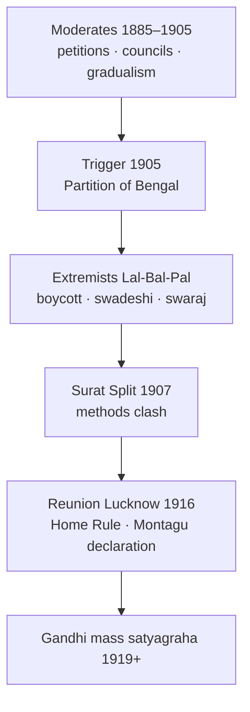

# Extremists vs Moderates

> GS-1 · Topic 02 · Congress factions (1885–1917) — Moderates, Extremists, Surat split, methods

---

## PYQs

| Year | M | Words | Question (EN) | प्रश्न (HI) | ID |
|------|---|-------|---------------|-------------|-----|
| 2025 | 8 | 125 | 'Extremism was a reaction against the ideas and modus operandi of the moderates'. Critically explain this statement. | 'उग्रवाद उदारवादियों के विचारों और कार्य-प्रणाली के विरुद्ध एक प्रतिक्रिया थी'। इस कथन की आलोचनात्मक व्याख्या कीजिए। | Q1 |
| — | 12 | 200 | *Likely:* Analyse the causes and consequences of the Surat Split (1907). | *संभावित:* सूरत विभाजन (1907) के कारणों और परिणामों का विश्लेषण कीजिए। | Q2 |

---

## Quick Revision

```
CONGRESS PHASES:
  1885–1905 Moderate dominance | 1905–1917 Extremist rise | 1917+ Gandhi era (Home Rule bridge)

MODERATES ("Early Nationalists"):
  Leaders: Dadabhai Naoroji · Gopal Krishna Gokhale · Surendranath Banerjea · Feroze Shah Mehta · Pherozeshah Mehta
  Period: c.1885–1905 (dominant till Surat 1907)
  Ideas: British rule beneficial if reformed · faith in British justice · gradualism · constitutional agitation
  Methods: Petitions · prayers · resolutions · legislative councils (1892, 1909) · economic critique (drain theory)
  Achievements: Indian Councils Act 1892 · spread nationalism · unity · expose colonial exploitation
  Limits: No mass mobilisation · no boycott · failed to prevent Partition of Bengal 1905

EXTREMISTS ("Assertive Nationalists"):
  Leaders: Bal Gangadhar Tilak · Bipin Chandra Pal · Lala Lajpat Rai (LAL-BAL-PAL) · Aurobindo Ghosh
  Rise: post-1905 Swadeshi · dissatisfaction with Moderate failure
  Ideas: Self-government swaraj NOW · reject "political mendicancy" · pride in Indian civilisation · passive resistance
  Methods: Boycott · swadeshi · national education · mass meetings · festivals (Ganesh/Gokulashtami — Tilak)
  Milestones: Swadeshi movement 1905 · Surat Split Dec 1907 · Tilak trials · deportation of Lala Lajpat Rai 1907

EXTREMISM AS REACTION TO MODERATES:
  Against IDEAS: Lost faith in British fairness after Curzon Partition 1905 · Lyallpur 1907 deportations
  Against MODUS OPERANDI: Petitions failed → boycott/swaraj · council work insufficient → mass mobilisation
  Against TIMELINE: Moderates wanted slow reform → Extremists wanted immediate self-respect action

CRITICAL NUANCE (exam):
  Extremism NOT purely negative — constructive swadeshi, education, cultural nationalism
  Moderates NOT useless — laid intellectual/foundation (Naoroji drain, Gokhale education)
  Both shared goal: Indian self-rule — differed on means and speed
  Surat 1907 = clash methods + personal/communal undertones · reunited 1916 Lucknow Pact

SURAT SPLIT 1907: Moderates wanted accept Minto-Morley reforms · Extremists rejected
  Rash Behari Ghosh president issue · Tilak denied presidency · physical clash · Congress weakened temporarily

POST-EXTREMIST: Tilak Home Rule 1916 · Gandhi absorbs mass satyagraha · Revolutionary terrorism parallel (separate file)

CONTEMPORARY: Art 51A(a) sovereignty · constitutional methods debate · NEP 2020 freedom struggle curriculum
  Azadi Ka Amrit Mahotsav — Lal-Bal-Pal icons · Partition museum narratives

TRAPS: Moderates ≠ pro-British loyalists only | Extremists ≠ armed revolutionaries (mostly)
  Surat ≠ permanent split (Lucknow 1916) | Tilak ≠ Moderate | Gandhi ≠ Extremist of 1905 type exactly
  Partition 1905 caused Extremist rise — key trigger | Councils Act 1892 Moderate win but insufficient
```

---

## Content

### Context — nationalism's first strategic divide inside Congress

After the **Indian National Congress** was founded in **1885**—with **A.O. Hume**, **Dadabhai Naoroji**, **Gopal Krishna Gokhale**, and others—nationalist politics for two decades centred on **constitutional petitioning** and **moral persuasion** of the British. **Moderates** dominated until **1905**, when **Lord Curzon's Partition of Bengal**, rising **economic nationalism**, and **cultural awakening** produced an **Extremist** challenge led by **Lal-Bal-Pal** (**Lala Lajpat Rai, Bal Gangadhar Tilak, Bipin Chandra Pal**) and **Aurobindo Ghosh**.

**What** divided them: not the goal of Indian self-rule in broad terms, but **faith in British institutions**, **timeline**, and **methods of agitation**. **How** Extremism emerged: Moderate **petitions and council speeches** failed to reverse **Partition (1905)**; **1907 deportations** and **sedition trials** convinced radicals that **"political mendicancy"** (Tilak's phrase) was futile. **Why** the divide matters: it transformed Congress from an **elite club** toward **mass politics**, directly preceding **Gandhi's satyagraha (1919+)**. **Proof**: **Swadeshi movement (1905)**, **Surat Split (1907)**, and **Lucknow reunion (1916)** mark the arc from rupture to synthesis.

### Moderates (1885–1905) — faith, method, and achievements

**Who they were**: **Dadabhai Naoroji** ("Grand Old Man of India") formulated **drain-of-wealth theory**, presided over Congress in **1886 and 1893**, and sat in the **British House of Commons**. **Gopal Krishna Gokhale** founded the **Servants of India Society (1905)** and mentored a generation including **Gandhi**. **Surendranath Banerjea** led the **Indian Association (1876)**, edited the **Indian Mirror**, and opposed **Partition** but through Moderate methods. **Pherozeshah Mehta** and **Feroze Shah Mehta** dominated **Bombay** municipal politics. **W.C. Bonnerjee** was the first **Congress president (1885)**.

**Ideas Moderates held—and Extremists later rejected**:
- **Faith in British liberalism**: They believed **British public opinion** and **Parliament** would grant **gradual self-government** if Indians presented rational evidence of colonial injustice.
- **Reformable empire**: Independence was not the immediate demand; **greater representation**, **civil rights**, and **economic justice** within the empire came first.
- **Gradualism**: Change through **petitions, memoranda, prayers, and resolutions**—what Tilak condemned as **political mendicancy**.
- **Legal-constitutional path**: Work through the **Imperial Legislative Council**; treat the **Indian Councils Act 1892** as a meaningful victory.

**Modus operandi**: Annual **Congress sessions** passed resolutions on **civil rights, Indianisation of civil service, military expenditure, and drain of wealth**. **English-language press** addressed colonial officials and British audiences. There was **no mass boycott**, **no swadeshi weaponisation** before **1905**, and **no festival-based mobilisation** at national scale. Early Congress **collaborated with reform-minded British** allies like **Hume and Wedderburn**.

**What Moderates achieved**: They built **national awakening** among elites, unified regional leadership, and supplied **economic critique** (**Naoroji, RC Dutt**) exposing colonial exploitation. The **Indian Councils Act 1892** expanded nomination and indirect representation—a **Moderate gain** Extremists found **inadequate**. **Gokhale** worked on **education and famine relief**; **Banerjea** raised **public grievances**. **What they could not do**: prevent **Partition of Bengal (1905)**; mobilise masses; stop **Lyallpur deportations (1907)** and **Press Acts**.

### Partition of Bengal (1905) — the trigger Extremism needed

**What Curzon did**: On **16 October 1905**, **Lord Curzon** divided **Bengal** into **East Bengal and Assam** (Muslim-majority east) and **West Bengal** (Hindu-majority west), ostensibly for **administrative efficiency**. **Why** Indians rejected this: they read it as **divide et impera**—using **religious census categories** to weaken **Bengali nationalist unity**, then the strongest regional voice in Congress. **How** Moderates responded: **Surendranath Banerjea** led **meetings, petitions, and the Rakhi Bandhan** protest—but **no Partition reversal** came. **How** Extremists responded: **boycott of British goods**, **swadeshi**, **national schools**, and **Bande Mataram** as a mobilising cry. **Proof** of Moderate failure as trigger: the same leaders who had celebrated **1892 Councils Act** now watched **imperial policy ignore constitutional protest**—discrediting **faith in British fairness** and validating **Tilak's anti-mendicancy critique**.

### Extremists (1905–1917) — swaraj, self-reliance, and mass line

**Leaders**: **Bal Gangadhar Tilak (1856–1920)** edited **Kesari** and **Maratha**, popularised **"Swaraj is my birthright"**, and politicised **Ganesh and Gokulashtami festivals** from the **1890s onward**. **Bipin Chandra Pal (1858–1932)** led **New India** and preached **boycott–swadeshi**. **Lala Lajpat Rai (1865–1928)**, Punjab's lion, combined **social reform with nationalism**, was **deported in 1907 under Minto**, and died in **1928** protesting the **Simon Commission**. **Aurobindo Ghosh** ran **Bande Mataram**, headed **Bengal National College**, was acquitted in the **Alipore bomb case (1909)**, then **retired to Pondicherry (1910)**.

**Ideas Extremists advanced**:
- **Rejection of British justice**: **Curzon's Partition (1905)** proved appeals useless; **imperialism was exploitative**, not benevolent.
- **Swaraj as immediate self-respect**: Not distant gradual reform but **swadeshi, national education, and boycott** now.
- **Positive nationalism**: Pride in **ancient civilisation**—**Tilak's Gita interpretation**, **Pal's cultural nationalism**—versus Moderate imitation of British constitutionalism.
- **Anti-mendicancy**: Replace **prayer and petition** with **self-reliant action**.

| Moderate method | Extremist alternative |
|-----------------|----------------------|
| Petitions to Viceroy/Secretary of State | **Mass meetings, hartals, boycott** |
| Council speeches | **Street mobilisation, politicised festivals** |
| Faith in British law | **Passive resistance**; violate unjust laws (seeds of **Gandhi**) |
| Elite English discourse | **Vernacular press**—**Kesari, Bande Mataram, New India** |
| Wait for reforms | **Swadeshi movement (1905)** as immediate action |

**Constructive programme—Extremism was not mere negation**: **Swadeshi** promoted **khadi, handloom, indigenous industry**. **National education**—**Bengal National College (Aurobindo as principal)**, **Tilak's schools**—boycotted government colleges. **Samiti networks** like **Anushilan Samiti** and **Swadesh Bandhab Samiti (Ashwini Coomar Dutt)** ran **relief, arbitration, and physical culture**—some drifted toward **revolutionary terrorism**, a **separate strand** from **Lal-Bal-Pal mass Extremism**.

**Swadeshi in practice**: **What** it meant—reject **Manchester cloth**, **foreign salt and sugar**, and **Colonial imports**; promote **indigenous mills, handlooms, and national capital**. **How** it spread—**picketing**, **bonfires of foreign cloth**, **marches**, and **merchant pledges** in **Calcutta, Bombay, and Punjab**. **Why** it mattered economically—it translated **Naoroji's drain theory** into **popular action**, prefiguring **Gandhi's khadi campaigns**. **Why** it mattered politically—it gave Congress a **mass-visible weapon** petitions lacked. **Ashwini Kumar Dutt's Swadesh Bandhab Samiti** in **Barisal** combined **arbitration courts, famine relief, and swadeshi propaganda**—showing Extremism's **constructive**, not merely destructive, face.



### Extremism as reaction — ideas, methods, and critical evaluation

**Reaction against Moderate ideas**:

| Moderate idea | Extremist reaction | Evidence |
|---------------|-------------------|----------|
| British justice is fair | Imperialism is **exploitative** | **Partition 1905**; **Minto's repression 1907** |
| Gradual self-government | **Swaraj now**—national dignity | **Tilak's Kesari**, **Pal's speeches** |
| Empire beneficial if reformed | **Swadeshi** as economic weapon | **Boycott of Manchester cloth** |
| Constitutional loyalty | **Cultural revival** via mass festivals | **Tilak's Ganesh utsav** as nationalist platform |

**Reaction against Moderate modus operandi**: The **1906 six-point petition to Morley** brought **no Partition reversal**. **1892 Councils Act** offered **no real power**. Extremists reached **students, artisans, and partial peasant layers** through **vernacular press and festivals** where Moderates spoke only to **lawyer-elites**. At **1905 Benares Congress**, Moderates hesitated on full boycott; at **1906 Calcutta**, under **Naoroji's presidency**, **swaraj resolution** emerged with compromise wording—**"self-government like colonies"**—under **Extremist pressure**.

**Critical evaluation—the statement is substantially true but incomplete**:
- **True**: Extremism grew from **Moderate failure** within the **same nationalist stream**; **1905 Partition** was the decisive trigger; methods genuinely inverted from **mendicancy to self-help**, **elite to mass attempts**.
- **Incomplete**: Extremists **did not discard all Moderate work**—they still used **Congress platform**, **drain theory**, and **legal idioms**. **Tilak** later bridged phases through **Home Rule (1916)** with **Annie Besant**; **Gokhale and Tilak** respected each other despite differences. **Surat Split (1907) weakened the movement**—Congress was largely **inactive 1908–1916**. Some Extremist methods had **communal edges** (**Bande Mataram** controversies, **shuddhi** overlaps). **Revolutionary terrorism** (**Khudiram Bose, Alipore bomb 1908**) was a **separate strand**—not identical to **Lal-Bal-Pal**.

| Shared nationalist ground | Moderate contribution | Extremist addition |
|---------------------------|----------------------|-------------------|
| Anti-colonial economic critique | **Naoroji's drain theory**, **RC Dutt** | **Swadeshi boycott** as popular weapon |
| Congress as platform | Founded **1885**, annual resolutions | **Mass sessions, hartals, festivals** |
| Constitutional vocabulary | **1892 Councils Act** lobbying | **Passive resistance**, law violation |
| All-India symbolism | Elite unity across presidencies | **Bande Mataram**, **vernacular press** |

### Surat Split (1907) — causes and consequences

**Background**: **1906 Calcutta Congress** under **Dadabhai Naoroji** passed a **Swaraj resolution**; Extremists gained strength. **1907 session at Surat** proposed **Rash Behari Ghosh** (Moderate) as president; **Extremists wanted Tilak**.

**Issues at Surat (December 1907)**:
- **Morley–Minto reforms**: Moderates inclined to **work councils**; Extremists **rejected inadequate reforms**.
- **Boycott resolution wording**: Moderates feared **illegality and repression**; Extremists demanded **stronger swadeshi/boycott** language.
- **Personal rivalry**: **Mehta vs Tilak**—**Bombay–Pune tensions**.

**Outcome**: **Physical clash** on the platform; **Congress split**; **1908 Madras session** was **Moderate-only**; Extremists held **parallel meetings**. **Government repression** followed: **Tilak sentenced (1908)** to **six years in Mandalay (Burma)** for **seditious writings**; **Aurobindo acquitted (1909)** then withdrew to **Pondicherry**.

**Consequences**: Temporary **weakening of united nationalist front**; partial **Bengal Extremist drift toward underground revolution**; eventual **Lucknow Pact reunion (1916)** through **Tilak–Besant Home Rule** and the **Montagu declaration (1917)** opening a new phase.

### From rupture to synthesis — Home Rule and Gandhi

**Why reunion became possible**: By **1916**, both wings recognised that **British constitutional offers** (**Montagu declaration 1917** promising gradual self-government) required a **united front**. **Tilak's Home Rule League (1916)** and **Annie Besant's league** mobilised masses through **constitutional–radical hybrid** tactics—petition plus **mass meeting**—bridging Moderate institutionalism and Extremist mobilisation. **Lucknow Pact (1916)** reunited Congress and paired with **Muslim League** demands, showing **Surat was not permanent**. **Gandhi (from 1919)** then synthesised streams: **Moderate moral constitutionalism** (appeals to justice, law-breaking only with **truth/non-violence**) with **Extremist mass boycott and swadeshi**—surpassing both in **geographic reach** (**Champaran 1917, Rowlatt 1919, Non-Cooperation 1920–22**). Extremism was therefore a **necessary intermediate explosion** after Moderate deadlock, not the final form of nationalism.

### Comparison — Moderates versus Extremists

| Aspect | **Moderates** | **Extremists** |
|--------|---------------|----------------|
| **Period** | **1885–1905** dominant | **1905–1917** rise |
| **Leaders** | **Naoroji, Gokhale, Banerjea, Mehta** | **Tilak, Pal, Lajpat Rai, Aurobindo** |
| **Goal (stated)** | Reforms, gradual self-government | **Swaraj**, immediate self-respect |
| **British faith** | **High** initially | **Rejected** post-1905 |
| **Methods** | **Petition, council, prayer** | **Boycott, swadeshi, mass mobilisation** |
| **Social base** | **Elite, English-educated** | **Broader vernacular middle class, students** |
| **Press** | Moderate English papers | **Kesari, Bande Mataram, New India** |
| **Assessment** | **Foundation builders** | **Massifiers—with split costs** |

### Significance and legacy — toward Gandhi and constitutional India

The **Extremist phase** pushed Congress from **elite club** toward **mass politics**—a **direct precursor** to **Gandhi's satyagraha (1919+)**. **Swadeshi (1905)** reappeared in **Non-Cooperation** and **Civil Disobedience**. **Moderate legacy**—**constitutionalism, economic critique, Naoroji's UK lobbying**—shaped **independent India's parliamentary culture** through **Indian Councils Acts**, **1919/1935 Acts**, and the **Constitution (1950)**. Post-**1916 synthesis**: **Tilak + Besant Home Rule**; **Gandhi** combined **Moderate moral law** with **Extremist mass action**. **Banerjea opposed Partition** with Moderate methods but failed—proving the **trigger** for Extremist rise.

**Government response under Minto (1907)**—**deportation of Lala Lajpat Rai**, **Press Acts**, **Tilak's sedition trial**—confirmed Extremist claims that **constitutional loyalty invited repression, not reform**. **Aurobindo's acquittal in the Alipore bomb case (1909)** showed jury sympathy in Bengal, yet he **retired to Pondicherry**, symbolising how **state pressure** could neutralise even acquitted radicals while driving others toward **underground revolution**.

**Muslim League's Simla deputation (1906)**—seeking separate electorates—developed **alongside** Extremist Hindu mobilisation, not inside it: **communal politics** and **Extremist nationalism** were **parallel responses** to **Curzon's Partition**, reminding us that **anti-Moderate reaction** was not a single unified bloc but a **fracturing field** of strategies.

**Dadabhai Naoroji as Congress president (1906 Calcutta)** embodies the **overlap**: a **Moderate** presiding over a **Swaraj resolution** pressed by **Extremists** proves the reaction was **internal to nationalism**—a family quarrel over **speed and method**, not over whether **British rule was ultimately legitimate**. **Surat did not permanently destroy Congress**—**Lucknow 1916** reunited wings before **Gandhi's** all-India campaigns. **Gandhi (1919+)** was **not a 1905 Extremist**—he **synthesised** Moderate ethics with **mass satyagraha**, exceeding both earlier phases in **scale and moral framing**. **Tilak was not a Moderate**—he led **Extremist** politics before **Home Rule (1916)** bridged tactics.

### Contemporary relevance

**Article 51A(a)**—duty to abide by the **Constitution**—echoes enduring debate over **constitutional versus extra-constitutional** methods (Moderate legacy versus mass agitation). **Article 51A(f)** mandates valuing **freedom-struggle heritage**; **Azadi Ka Amrit Mahotsav** commemorates **Lal-Bal-Pal** alongside **Gandhi–Nehru**. **NEP 2020** teaches **Moderate, Extremist, Gandhian, and Revolutionary** phases as **critical history**. **Parliamentary democracy** traces institutional continuity from **Moderate council work** through **1919/1935 Acts** to **1950**. **Swadeshi–Atmanirbhar** analogies cite **1905 boycott** in contemporary **economic nationalism** discourse (historical parallel, not identical policy). **Partition of Bengal memory** informs **heritage exhibitions** and **India–Bangladesh cultural links**. **Tilak's sedition trials** prefigure **Article 19(1)(a)** free-speech debates.

### Limits and balanced view

The **Moderate–Extremist binary oversimplifies**: **Tilak** moved from **Extremist to Home Rule moderate**; **Banerjea** was **Moderate yet anti-Partition**. **Extremists did not win swaraj immediately**—**repression succeeded** short term. Their **mass base remained limited** compared to **Gandhi (1919–1942)**—Extremism was an **intermediate phase**. **Regional variation** mattered: Extremism was strongest in **Bengal, Maharashtra, and Punjab**; **Madras stayed more Moderate (Rajagopalachari)**. **Communal undertones** in **Bande Mataram** and **religious festivals** raise **inclusivity debates**; the **Muslim League's Simla deputation (1906)** followed a **separate trajectory**. **Moderates were nationalists**, not traitors—they sought **self-government** through **British institutions**. **Surat did not permanently destroy Congress**—**Lucknow 1916 reunited** it. **Naoroji remained Moderate** even while presiding over **1906** under Extremist pressure. **"Political mendicancy"** was **Tilak's critique of Moderate petition politics**, not Extremist praise. **Extremists did not uniformly use bombs**—**Khudiram Bose** represents **revolutionary terrorism**, a **separate strand** from **Lal-Bal-Pal boycott politics**.

---

## Answers

### Q1: 'Extremism was a reaction against the ideas and modus operandi of the moderates'. Critically explain this statement. (2025, 8M, 125W)

**Opening:**
> Extremism in the Indian National Congress (c.1905–1917) emerged largely as a reaction against Moderate faith in British justice and their petition-based methods — yet it built upon Moderate economic and political foundations rather than rejecting nationalism itself.

**Write these points:**
- **Against Moderate ideas:** Extremists (**Tilak, Pal, Lajpat Rai**) rejected belief that **British rule would grant self-government through appeals** — **Partition of Bengal (1905)** and **1907 repression** proved **"political mendicancy"** futile.
- **Against Moderate modus operandi:** Shift from **petitions, prayers, council speeches** to **boycott, swadeshi, national education, mass meetings, vernacular press (Kesari, Bande Mataram)**.
- **Positive Extremist content:** Not mere negation — **constructive swadeshi**, **cultural nationalism (Tilak's festivals)**, demand for **swaraj** as **self-respect**.
- **Critical nuance:** Extremism **reacted to Moderate failure** but **continued Congress platform**; **Naoroji (1906)** bridged both; **Moderates laid drain theory, legal awareness** — **not worthless**.
- **Limits:** **Surat Split (1907)** **weakened movement**; **Extremists did not win swaraj**; some methods had **communal edges** — reaction was **necessary but incomplete**.

**Conclusion:**
> The statement is substantially true — Extremism was a methodological and ideological revolt against Moderate gradualism after 1905 — yet a critical view recognises Moderate contributions and Extremism's own shortcomings, culminating in later Gandhian synthesis.

---

### Q2: *Likely:* Analyse the causes and consequences of the Surat Split (1907). (Future variant, 12M, 200W)

**Opening:**
> The Surat Split of December 1907 marked the open rupture between Moderate and Extremist wings of the Indian National Congress over methods of agitation and acceptance of colonial reforms.

**Write these points:**
- **Causes — ideological:** **Extremists** rejected **Moderate faith** in **Morley-Minto reforms**; demanded **boycott and swaraj** vs **gradual constitutionalism**.
- **Causes — immediate:** **Rash Behari Ghosh vs Tilak** presidency dispute; **1905 Partition** legacy — **Extremists** felt **Moderates too soft**; **1907 deportations (Lajpat Rai)** fuelled radicalism.
- **Causes — procedural:** Wording of **swadeshi/boycott resolutions**; **fear of illegality** among Moderates (**Mehta, Banerjea**).
- **Event:** **Physical clash at Surat session** — **Congress split**; **1908 Moderate-only session**.
- **Consequences — negative:** **Weakened united nationalist front**; **government repression** (**Tilak Mandalay 1908**); **some Bengal Extremists → revolutionary terrorism**.
- **Consequences — long term:** **Extremist methods** (boycott, mass line) **influenced Gandhi**; **reunion Lucknow 1916** — **Home Rule League phase**.

**Conclusion:**
> Surat Split was both culmination of the Moderate–Extremist reaction and a temporary setback — its consequences nonetheless shaped the mass character of later Indian nationalism.

---

### Q3: *Likely:* Compare the methods of Moderates and Extremists in the Indian freedom struggle. (Future variant, 8M, 125W)

**Opening:**
> Moderates (1885–1905) relied on constitutional petitioning and council work, while Extremists (post-1905) adopted boycott, swadeshi, and mass mobilisation — reflecting a shift from elite persuasion to self-reliant agitation.

**Write these points:**
- **Moderates:** **Petitions, prayers, annual resolutions**, **Imperial Legislative Council (1892 Act)**, **English press**, **economic critique (Naoroji drain)**.
- **Extremists:** **Boycott foreign goods**, **swadeshi**, **national schools**, **vernacular newspapers**, **public festivals (Tilak)**, **hartals**.
- **Goal difference:** **Gradual reform** vs **immediate swaraj/self-respect**.
- **Assessment:** Moderates **built awareness**; Extremists **widened participation** — **Gandhi later combined both**.

**Conclusion:**
> Methodological divergence defined the two phases — Extremism reacting against Moderate modus operandi while sharing the broader anti-colonial objective.

---

## Traps

| Wrong | Correct |
|-------|---------|
| Moderates were pro-British traitors | **Nationalists seeking reform/self-gov** — **faith in British institutions**, not betrayal |
| Extremists always used bombs and violence | **Main Lal-Bal-Pal line = boycott, swadeshi, press**; **terrorism = separate revolutionary strand** |
| Surat Split permanently destroyed Congress | **Reunited 1916 Lucknow**; **Home Rule movement** bridged gap |
| Tilak was a Moderate | **Tilak = foremost Extremist** — later **Home Rule 1916** moderated tactics, not ideology fully |
| Partition of Bengal unrelated to Extremist rise | **1905 Partition = key trigger** for **swadeshi and Extremism** |
| Extremists rejected Congress entirely after Surat | **Continued parallel work**; **Tilak rejoined unified Congress** |
| Gandhi was an Extremist of 1905 type | **Gandhi (1919+)** — **distinct mass satyagraha**; synthesised earlier streams |
| Indian Councils Act 1892 satisfied Extremists | **Moderate gain** — **Extremists saw as inadequate** |
| Only Bengal had Extremists | **Strong in Bengal, Maharashtra, Punjab** — **regional variation** |
| Extremism had no constructive programme | **Swadeshi, national education, arbitration samitis** — **constructive content** |
| Naoroji was an Extremist | **Naoroji = Moderate** — presided **1906** under **Extremist pressure** on swaraj wording |
| Moderates opposed Partition of Bengal | **Banerjea opposed** — but **Moderate methods failed** to reverse it |
| "Political mendicancy" praised by Extremists | **Tilak's critique OF Moderate petition politics** — **not praise** |

---

*Complete.*
