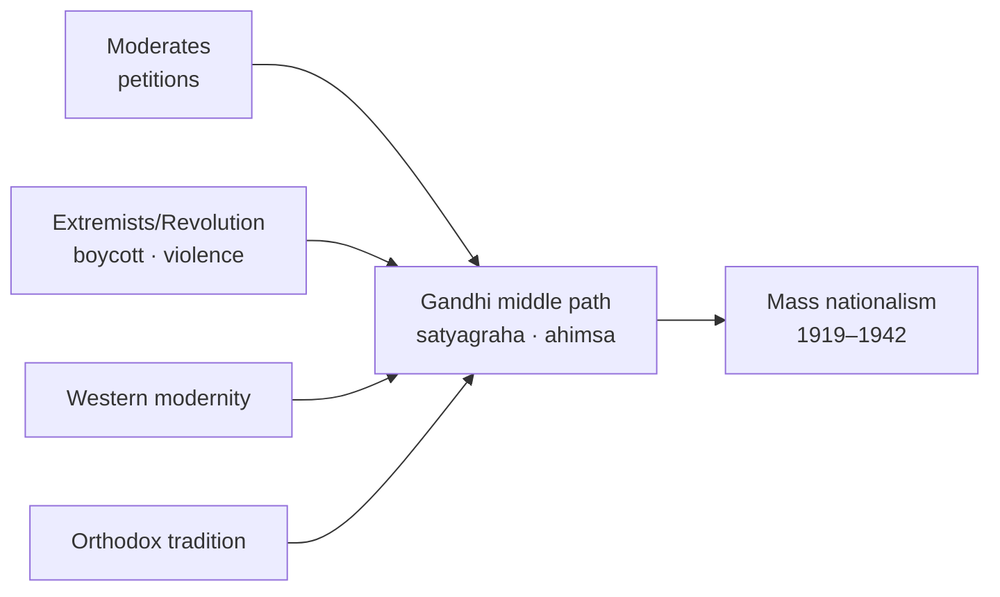
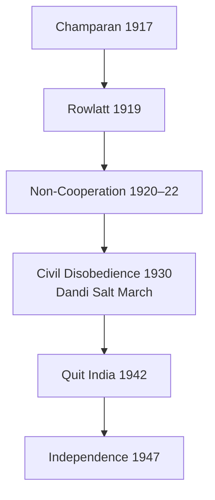

# Gandhi & National Movement

> GS-1 · Topic 02 · Gandhian ideology, satyagraha, middle path, varna, mass movements (1917–1942)

---

## PYQs

| Year | M | Words | Question (EN) | प्रश्न (HI) | ID |
|------|---|-------|---------------|-------------|-----|
| 2018 | 8 | 125 | Mahatma Gandhi represents the middle path approach in Indian Politics. Give logical explanation. | महात्मा गांधी भारतीय राजनीति के मध्यम मार्ग दृष्टिकोण का प्रतिनिधित्व करते हैं। तर्कपूर्ण व्याख्या कीजिए। | Q1 |
| 2020 | 8 | 125 | Evaluate the views of Gandhi on the Varna system. | वर्ण व्यवस्था पर गाँधी के विचारों का मूल्यांकन कीजिए। | Q2 |
| — | 12 | 200 | *Likely:* Discuss Gandhi's role in the Indian freedom struggle. | *संभावित:* भारतीय स्वतंत्रता संग्राम में गांधी की भूमिका की विवेचना कीजिए। | Q3 |
| — | 8 | 125 | *Likely:* Examine the significance of the Non-Cooperation Movement. | *संभावित:* असहयोग आंदोलन के महत्व का परीक्षण कीजिए। | Q4 |

---

## Quick Revision

```
GANDHI IN INDIA: 1915 (from S.Africa) → Champaran 1917 → Kheda 1918 → Rowlatt 1919
  Non-Cooperation 1920–22 · Civil Disobedience 1930–34 · Quit India 1942

IDEOLOGY CORE:
  Satyagraha = truth-force · ahimsa · swaraj (self-rule moral + political)
  Trusteeship · sarvodaya · antyodaya · swadeshi/khadi · village republics
  Ram Rajya ideal · religion = ethics not ritual supremacy

MIDDLE PATH (Madhyam Marg — PYQ 2018):
  Between Moderates (petitions) ↔ Extremists (radical boycott) → satyagraha mass legal-moral
  Between violence (revolutionary) ↔ passivity → non-violent direct action
  Between Western modernity ↔ blind tradition → selective Indian village civilisation
  Between Hindu majoritarianism ↔ Western secularism → sarva dharma sambhava
  Between capitalism ↔ state socialism → trusteeship of property
  Between cooperation ↔ full rupture with British → phased non-cooperation

SATYAGRAHA METHODS: Hartal · boycott foreign cloth · picketing · salt march · fasting
  Constructive: khadi · charkha · harijan uplift · prohibition · village industries

MAJOR MOVEMENTS:
  Champaran (1917) indigo · Kheda (1918) famine tax · Ahmedabad mill strike (1918)
  Rowlatt Satyagraha 1919 · NCM 1920 (Khilafat alliance) · CDM 1930 (Dandi Salt March 6 Apr)
  Gandhi-Irwin Pact 1931 · Second CDM · Quit India 8 Aug 1942 "Do or Die"

VARNA (PYQ 2020):
  Supported varna as DIVISION OF LABOUR by aptitude — NOT birth-based caste (jati)
  Opposed untouchability — "sin against Hinduism" · renamed Dalits "Harijan" (debated term)
  No inter-dining/marriage initially · manual scavenging abolition campaign
  Critics: Ambedkar — varna theory impractical; preserves hierarchy symbolically
  Poona Pact 1932 — reserved seats for depressed classes vs separate electorate

ORGANISATIONS: Sabarmati · Sevagram · Harijan Sevak Sangh · All India Spinners Association
  Young India · Harijan (journal) · Indian Opinion (S.Africa)

CONTEMPORARY: Art 51A(a)(f) · KVIC/khadi GI · NEP 2020 Gandhi heritage · Swachh Bharat (cleanliness)
  UN International Day of Non-Violence 2 Oct · Sabarmati Ashram UNESCO tentative

TRAPS: Gandhi ≠ invented satyagraha concept alone (Tolstoy/Ruskin influence)
  Middle path ≠ compromise always | Varna ≠ caste support (nuance!) | Khilafat ≠ permanent alliance
  Chauri Chaura → NCM withdrawn | Gandhi ≠ Quit India organiser in jail
  Harijan term ≠ universally accepted today
```

---

## Content

### Context — Gandhi and the transformation of Indian nationalism

Mohandas Karamchand Gandhi (1869–1948) returned to India in January 1915 after two decades in South Africa, where he had developed and tested satyagraha against racist legislation between 1906 and 1914. What he brought was not merely a technique of protest but an entire political philosophy that would reshape how Indians understood freedom itself. Before Gandhi, Indian nationalism had largely remained an affair of educated elites who petitioned the British Parliament, debated in English, and operated within the narrow channels of colonial constitutionalism. After his arrival, the Congress became a vehicle for peasants, artisans, women, and the urban poor — people who had never before imagined themselves as political actors in a national struggle.

The Gandhian era, roughly 1917 to 1947, spans a continuous arc from the Champaran indigo satyagraha to the Quit India Movement. During these three decades, Gandhi transformed the Indian National Congress from a debating society into a mass organisation capable of mobilising millions through non-violent direct action. His method rested on the conviction that British rule in India survived not primarily through military force but through the cooperation of Indians themselves — in courts, schools, councils, and markets. Withdraw that cooperation through disciplined boycott and constructive work, he argued, and the Raj would collapse under its own moral illegitimacy. This was a radically different proposition from both Moderate constitutionalism, which sought reform within the empire, and revolutionary terrorism, which sought to shock the state through violence.

Gandhi's political thought cannot be separated from his social vision. For him, swaraj — self-rule — meant simultaneously political independence from Britain and moral self-discipline among Indians. A nation that won freedom through violence would reproduce violence in its governance; a nation that won freedom while tolerating untouchability would remain spiritually enslaved. This integrated vision explains why Gandhi linked salt tax defiance with khadi spinning, why he fasted against communal violence as readily as against British laws, and why he insisted that the means of struggle must embody the ends sought.

### Gandhian ideology — the conceptual architecture

Gandhi's political vocabulary drew from diverse sources that he synthesised into something distinctly his own. Leo Tolstoy's *The Kingdom of God Is Within You* convinced him that non-violence was not weakness but the highest form of moral courage. John Ruskin's *Unto This Last* taught him that all honest labour — including manual work — possessed equal dignity, a principle he called bread labour. Henry David Thoreau's essay on civil disobedience provided the intellectual framework for breaking unjust laws while accepting punishment. The Bhagavad Gita, read through his own interpretive lens, supplied the concept of nishkama karma — action without attachment to results — which allowed satyagrahis to suffer imprisonment without bitterness. Gopal Krishna Gokhale, his political mentor and founder of the Servants of India Society, instilled the ethic of public service that Gandhi carried into every ashram he established.

The core concepts of Gandhian thought form an interconnected system rather than isolated slogans. Satyagraha — literally "holding fast to truth" — is soul-force applied against injustice. It is active, not passive: the satyagrahi deliberately violates an unjust law, accepts arrest willingly, and converts the opponent through suffering rather than coercion. Ahimsa, non-violence, extends beyond physical harm to include hatred, ill-will, and the refusal to dehumanise even one's oppressor. Swaraj encompasses both political self-rule and individual self-control — the capacity to govern oneself before governing a nation. Swadeshi, the use of home-produced goods, particularly khadi, connects economic autonomy to political freedom: every thread spun on the charkha was an act of resistance against colonial economic exploitation. Trusteeship proposes that the wealthy hold property as trustees for society rather than as absolute owners, offering a middle path between unregulated capitalism and state expropriation. Sarvodaya — welfare of all — prioritises the last person (antyodaya) in any policy calculation. Sarva dharma sambhava — equal respect for all religions — grounds communal harmony in mutual recognition rather than enforced secular indifference.

| Concept | What it means | How Gandhi applied it |
|---------|---------------|----------------------|
| **Satyagraha** | Soul-force; holding fast to truth against injustice | Champaran, Salt March, individual fasts against communal violence |
| **Ahimsa** | Active non-violence; love even for the opponent | Movement withdrawals after Chauri Chaura; refusal to hate the British |
| **Swaraj** | Moral self-discipline + political self-rule | Poorna Swaraj resolution (1929); constructive programme alongside boycott |
| **Swadeshi** | Economic self-reliance through home products | Khadi, charkha, village industries, boycott of foreign cloth |
| **Trusteeship** | Wealth held in trust for society | Alternative to both capitalism and state socialism |
| **Sarvodaya** | Welfare of all; last person first | Antyodaya in village uplift, harijan campaigns |
| **Sarva dharma sambhava** | Equal respect for all faiths | Khilafat alliance, prayer meetings with multi-faith readings |

### Gandhi as the middle path in Indian politics

The concept of madhyam marg — the middle path — captures Gandhi's distinctive position in Indian political thought. He did not invent compromise for its own sake; rather, he identified the destructive extremes on either side of every major political debate and constructed a third position that preserved what was valuable in each while rejecting what was destructive. This was not fence-sitting but a principled synthesis grounded in the belief that truth is complex and that political action must be calibrated to the moral capacity of the masses.

The most fundamental polarity Gandhi bridged was between Moderate constitutionalism and Extremist or revolutionary violence. Moderates like Gokhale believed that patient petitioning and reasoned argument would eventually persuade Britain to grant self-government. Extremists like Tilak and revolutionaries like Bhagat Singh concluded that British rule would never yield to persuasion alone — it required either mass boycott or armed struggle. Gandhi adopted the Extremist emphasis on boycott, swadeshi, and mass mobilisation but rejected violence absolutely. Satyagraha was civil disobedience with a self-imposed moral ceiling: break unjust laws, but do not harm persons or property. The Salt March of 1930 exemplified this synthesis — it was illegal, mass-based, and globally visible, yet scrupulously non-violent.

| Extreme pole A | Extreme pole B | Gandhi's middle path |
|----------------|----------------|----------------------|
| Moderate petition politics | Extremist/revolutionary violence | Satyagraha — mass civil disobedience within ahimsa |
| Western industrial modernity | Blind traditionalism | Village-centred swadeshi + selective modern hygiene and education |
| Complete cooperation with Britain | Immediate armed revolt | Phased non-cooperation + negotiation (Gandhi-Irwin Pact 1931) |
| Majoritarian Hindu politics | Western secular indifference to religion | Religious idiom for masses + sarva dharma sambhava |
| Capitalist accumulation | State socialism/Marxism | Trusteeship — voluntary sharing, not expropriation |
| Untouchability status quo | Separate Dalit political identity | Temple entry and harijan uplift within Hindu reform — Poona Pact 1932 |
| Full law-breaking anarchy | Legalistic passivity | Break specific unjust laws (salt tax) while respecting broader order |

The economic dimension of the middle path rejected both uncritical Westernisation and rigid orthodoxy. Gandhi did not oppose railways, modern medicine, or legal education per se; he opposed an economic system that destroyed village handicrafts, concentrated wealth in cities, and reduced India to a supplier of raw materials for British factories. His alternative — decentralised village republics centred on the charkha — was not a call to return to the past but a selective modernity that preserved India's social fabric while adopting what was genuinely beneficial from the West.

On the question of British rule, Gandhi's position evolved but always maintained the middle path. He served in the Boer and Zulu wars in South Africa, wore a medal during the Empire Day celebrations, and initially hoped to win British sympathy through moral appeal. When that failed — most decisively after the Jallianwala Bagh massacre of 1919 — he launched non-cooperation. Yet even during the Non-Cooperation Movement, he remained willing to negotiate: the Gandhi-Irwin Pact of March 1931 suspended Civil Disobedience in exchange for prisoner releases and Round Table Conference participation. Critics on the Left saw this as retreat; Gandhi saw it as the natural rhythm of satyagraha — confrontation when the opponent is intransigent, negotiation when a genuine opening appears.

The proof of the middle path thesis lies in Gandhi's concrete political decisions. The Non-Cooperation Movement (1920–22) was radical in scope — boycott of courts, schools, councils, titles, and foreign cloth — yet Gandhi withdrew it entirely after the Chauri Chaura incident of February 1922, when a mob burned a police station and killed twenty-two policemen in Gorakhpur district, UP. He chose ahimsa over momentum, accepting demoralisation among cadres rather than condoning violence. The Khilafat-Congress alliance of 1920 attempted Hindu-Muslim unity on an anti-British platform through Maulana Shaukat Ali and Muhammad Ali; when the alliance dissolved in disillusion by 1924, it demonstrated pragmatic rather than dogmatic coalition-building. At the Round Table Conferences (1930–32), Gandhi participated despite imprisonment and negotiated the Poona Pact with Ambedkar in September 1932 — a compromise on depressed classes representation that satisfied neither man fully but prevented permanent political segregation. Quit India (1942) was Gandhi's most radical demand — "Do or Die" — yet even then he did not authorise armed insurrection; the movement remained within the broad Gandhian ethos of mass disorder without coordinated violence.



### Gandhi on the varna system — theory, practice, and the Ambedkar debate

Gandhi's views on caste constitute one of the most debated aspects of his legacy. He distinguished sharply between varna and jati: varna, in his ideal formulation, was a four-fold division of labour (Brahmin, Kshatriya, Vaishya, Shudra) based on aptitude and choice, with equal spiritual dignity for all roles and theoretical interchangeability between them. Jati, by contrast, was the hereditary, birth-based caste system that had hardened over centuries into a hierarchy of oppression. Gandhi opposed jati-based discrimination absolutely, calling untouchability a "great sin in Hinduism" and demanding the abolition of manual scavenging. Yet he retained the varna vocabulary, arguing that a reformed division of labour by merit — not birth — could organise society without the violence of caste annihilation.

In practice, Gandhi launched extensive campaigns against untouchability. He organised Harijan uplift weeks, supported temple entry movements including Guruvayur and Vaikom satyagraha, founded the Harijan Sevak Sangh in 1932, and edited the journal *Harijan*. He coined the term "Harijan" (children of God) for Dalits — a term intended to dignify but later rejected by Dalit activists as patronising. He initially opposed inter-dining and inter-marriage as too radical for orthodox Hindu society, a position that preserved symbolic hierarchy even while attacking its most extreme manifestations.

The decisive confrontation came in 1932 over the Communal Award, which granted separate electorates to depressed classes. Gandhi undertook a fast unto death against this provision, arguing that separate electorates would permanently segregate Dalits from the Hindu community. B.R. Ambedkar, who had demanded separate electorates as the only guarantee of genuine political representation, was pressured into the Poona Pact of September 1932: reserved seats for depressed classes within a joint Hindu electorate. Ambedkar accepted reserved seats but regarded the fast as moral coercion; Gandhi regarded it as preventing political fragmentation.

| Gandhi's position | Supporting evidence | Critical counter (Ambedkar and others) |
|-----------------|---------------------|--------------------------------------|
| Varna = division of labour by aptitude, not birth | Scriptural reformist reading; direct attack on untouchability | Historical varna was always birth-based; ideal divorced from practice |
| End untouchability within the Hindu fold | Reached mass Hindu audience through religious idiom | Subsumed Dalit identity; denied separate political voice until Poona Pact |
| Gradualism on inter-dining/marriage | Strategic accommodation of orthodox society | Preserved social separation; hierarchy continued symbolically |
| "Harijan" terminology | Dignifying intent | Patronising; Dalits prefer self-chosen names and identities |
| Fast against separate electorate | Prevented permanent political segregation | Coercive use of moral authority against depressed classes |

Ambedkar's counter-thesis was structural: caste was not a misinterpretation of varna but its historical realisation, and no amount of varna redefinition would annihilate caste without destroying the categories themselves. Political rights — separate electorate, reservation, legal abolition — must precede social reform. The constitutional outcome of this debate tilted toward Ambedkar: Article 17 of the Constitution abolishes untouchability; Articles 15 and 16 provide for non-discrimination and reservation. Yet Gandhi's moral crusade against untouchability among Hindu middle classes prepared social ground that made Article 17 conceivable. Both men were necessary; neither was sufficient alone.

### Major Gandhian movements — chronology and significance

Gandhi's political career in India followed a clear escalation from local grievances to national campaigns. Each movement tested and refined satyagraha while expanding the social base of nationalism.

| Year | Movement | Issue | Significance |
|------|----------|-------|--------------|
| **1917** | Champaran | Indigo tinkathia system | First satyagraha in India; peasant mobilisation model |
| **1918** | Kheda | Land revenue during famine | Patidar peasant alliance; revenue suspension won |
| **1918** | Ahmedabad mill strike | Textile workers' wages | Industrial satyagraha; partial wage increase |
| **1919** | Rowlatt Satyagraha | Repressive Rowlatt Act | Nationwide hartal; Jallianwala Bagh aftermath |
| **1920–22** | Non-Cooperation | Punjab/Khilafat wrongs | Mass boycott; Congress becomes mass party |
| **1930–34** | Civil Disobedience | Salt tax, poorna swaraj | Dandi March (12 Mar–6 Apr 1930); global publicity |
| **1942** | Quit India | Immediate independence | "Do or Die"; leaderless mass upsurge after arrests |

**Rowlatt and Jallianwala Bagh (1919):** The Rowlatt Act permitted detention without trial, provoking Gandhi's first nationwide satyagraha. On 13 April 1919, General Dyer ordered troops to fire on an unarmed crowd at Jallianwala Bagh, Amritsar, killing hundreds. Rabindranath Tagore renounced his knighthood; the Hunter Commission investigated but failed to satisfy Indian outrage. For many nationalists, Jallianwala Bagh destroyed whatever faith remained in British justice and created the emotional conditions for Non-Cooperation.

**Non-Cooperation Movement (1920–22):** Triggered by Punjab wrongs, the Khilafat issue (the Ottoman Caliph's authority), and the swaraj demand, the movement's programme included boycott of courts, schools, councils, and foreign cloth; surrender of titles; picketing; and khadi promotion. The Khilafat-Congress alliance under Maulana Shaukat Ali and Muhammad Ali represented the most ambitious Hindu-Muslim unity attempt of the era. Gandhi suspended the entire movement after Chauri Chaura (February 1922), when violence in Gorakhpur district, UP, killed twenty-two policemen — proof that ahimsa was not rhetoric but operational principle.

**Civil Disobedience Movement (1930–34):** The Lahore Congress (December 1929) under Jawaharlal Nehru declared poorna swaraj and fixed 26 January 1930 as Independence Day. When Lord Irwin ignored Gandhi's eleven demands, the Salt March began on 12 March 1930 from Sabarmati to Dandi, where Gandhi broke the salt law on 6 April — a globally televised act of defiance. The movement spread through forest law violations, foreign cloth boycotts, and no-tax campaigns in Bardoli (Sardar Patel), UP, and Bengal. Sarojini Naidu led the Dharasana raid. The Gandhi-Irwin Pact (March 1931) suspended the movement in exchange for prisoner releases and Round Table participation — a negotiated pause that critics called retreat. The Second Civil Disobedience phase (1932) coincided with Gandhi's Poona Pact fast and renewed repression.

**Quit India (1942):** The AICC resolution of 8 August 1942 at Gowalia Tank Maidan, Bombay, demanded immediate British withdrawal with Gandhi's "Do or Die" mantra. Leaders were arrested on 9 August; the movement became spontaneous and leaderless, with parallel governments in Ballia (UP), Tamluk (Bengal), and Satara (Maharashtra). Gandhi was in jail and did not organise the ground-level upsurge, yet the movement bore his ideological imprint.



### Gandhi's role in the freedom struggle — synthesis

Gandhi's contribution to Indian independence operated on four interconnected levels. First, he expanded the social base of nationalism: peasants in Champaran and Kheda, mill workers in Ahmedabad, women from Sarojini Naidu to Kasturba, and the urban poor entered political life through khadi, hartals, and constructive work. Second, he internationalised the struggle — the Salt March generated global media coverage that embarrassed Britain's claim to moral governance while fighting fascism in Europe. Third, he institutionalised non-violent resistance as a repeatable method: Non-Cooperation provided the template for Civil Disobedience and Quit India, proving that British rule required Indian consent and that consent could be withdrawn peacefully. Fourth, he embedded social reform within political struggle — harijan uplift, prohibition, and village industries were not side projects but integral to his conception of swaraj.

The limits are equally important. Gandhi could not prevent Partition in 1947, the communal problem that his sarva dharma sambhava sought to dissolve. His movement withdrawals after Chauri Chaura (1922) and during Civil Disobedience (1934) demoralised cadres who felt momentum was sacrificed to principle. His caste approach, while revolutionary in its attack on untouchability, remained structurally insufficient for Dalit emancipation as Ambedkar demonstrated. His ashram rules reflected patriarchal norms despite mass women's participation. He was not the sole architect of independence — revolutionaries, Subhas Chandra Bose and the INA, peasant movements, the Second World War, and the post-war Labour government in Britain all contributed decisively.

### Contemporary relevance

The UN observes 2 October — Gandhi Jayanti — as the International Day of Non-Violence, recognising ahimsa as a global ethical resource. Article 51A(a) of the Constitution obliges citizens to abide by the Constitution and respect its ideals, while Article 51A(f) requires cherishing the heritage of the freedom struggle — both clauses trace conceptual lineages to Gandhian satyagraha and constructive citizenship. The Khadi and Village Industries Commission (KVIC), khadi's GI tagging, and the charkha as national symbol institutionalise swadeshi economics. NEP 2020 references Gandhian basic education (Nai Talim) within the Indian Knowledge Systems framework, emphasising craft-centred pedagogy. The Swachh Bharat Mission invokes Gandhi's lifelong obsession with cleanliness as a national sanitation programme. Sabarmati Ashram's restoration and Sevagram's status as protected heritage under Article 49 anchor cultural tourism and civic education. The Ambedkar-Gandhi debate on caste continues to frame contemporary politics around reservation, temple entry, and dignity — Articles 15 and 17 embody constitutional resolutions that neither man fully anticipated.

### Limits

The middle path is sometimes misread as inconsistency — alternating between confrontation and negotiation without fixed principle, when in fact the principle was ahimsa itself, applied contextually. Gandhi's varna idealism, however morally sincere, proved historically inadequate to annihilate caste; Ambedkar's structural critique remains valid. Despite mass women's participation, ashram norms and Gandhian discourse retained patriarchal assumptions. Gandhi's use of religious idiom mobilised Hindu masses effectively but could not prevent the Muslim League's separate trajectory toward Pakistan. Independence required multiple streams — Gandhian, revolutionary, military, constitutional, and international — and reducing 1947 to one man's achievement distorts historical reality.

---

## Answers

### Q1: Mahatma Gandhi represents the middle path approach in Indian Politics. Give logical explanation. (2018, 8M, 125W)

**Opening:**
> Gandhi's politics synthesised opposing extremes — between Moderate petitioning and violent revolution, Western modernity and blind tradition, cooperation and rupture with Britain — through satyagraha, ahimsa, and constructive swadeshi.

**Write these points:**
- **Method:** Between **Moderate legalism** and **Extremist/revolutionary violence** — **satyagraha**: **mass civil disobedience** with **self-imposed ahimsa** (e.g. **Salt March 1930**, **NCM 1920**).
- **Economy/society:** Between **industrial Westernisation** and **rigid orthodoxy** — **village swadeshi, khadi, trusteeship** — not **Marxist expropriation** nor **unregulated capitalism**.
- **British rule:** Between **loyal cooperation** and **immediate armed revolt** — **non-cooperation phases** + **negotiation (Gandhi-Irwin Pact 1931)**; **withdrew NCM after Chauri Chaura (1922)** when **violence broke out**.
- **Communal politics:** Between **majoritarianism** and **rootless secularism** — **sarv dharma sambhava**, **Khilafat unity attempt**, **religious idiom with inclusivity aim**.
- **Limit:** Middle path **not always successful** — **Partition 1947**, **Ambedkar/Bhagat Singh critics** — yet **defined mass constitutional nationalism**.

**Conclusion:**
> Gandhi's madhyam marg thus logically bridged India's political polarities — making nationalism moral, inclusive, and mass-based without fully embracing any single extreme.

---

### Q2: Evaluate the views of Gandhi on the Varna system. (2020, 8M, 125W)

**Opening:**
> Gandhi distinguished varna as ideal division of labour by aptitude from birth-based jati, fiercely opposed untouchability, yet his framework drew substantial criticism from Ambedkar for preserving hierarchical categories.

**Write these points:**
- **Gandhi's varna theory:** **Four varnas** as **equal, complementary occupations** chosen by **merit** — **not hereditary caste**; spiritual equality of **all labour (bread labour ideal)**.
- **Anti-untouchability:** Called untouchability **sin against Hinduism**; **Harijan campaigns, temple entry, Harijan Sevak Sangh (1932)** — **practical reform focus**.
- **Poona Pact (1932):** **Fast against separate electorate** — compromise **reserved seats for depressed classes in joint electorate** with **Ambedkar**.
- **Positive evaluation:** **Mobilised Hindu society** against **untouchability** at **mass scale** — **prepared social ground** for **Article 17 abolition**.
- **Critical evaluation:** **Ambedkar** — varna concept **idealistic**, **historically birth-based**; **Harijan term patronising**; **no inter-dining/marriage** early — **hierarchy persisted**; **annihilation of caste** needed, not **varna reinterpretation**.

**Conclusion:**
> Gandhi's varna views were progressive on untouchability but conservatively framed — morally transformative yet politically and structurally insufficient for Dalit emancipation, as Ambedkar argued.

---

### Q3: *Likely:* Discuss Gandhi's role in the Indian freedom struggle. (Future variant, 12M, 200W)

**Opening:**
> Gandhi (1915–1947) transformed the Indian freedom struggle into a mass movement through satyagraha, linking peasant grievances, swadeshi economics, and moral anti-colonialism.

**Write these points:**
- **Early satyagrahas:** **Champaran (1917), Kheda (1918), Ahmedabad (1918)** — **peasant-worker alliances**, proof of **method**.
- **Mass movements:** **Rowlatt (1919), Non-Cooperation (1920–22), Civil Disobedience (1930–34), Quit India (1942)** — **Congress as mass party**.
- **Methods:** **Boycott, hartal, salt march, khadi, constructive programme** — **non-violent direct action**.
- **Political achievements:** **Poorna swaraj resolution (1929)**, **global moral pressure**, **widened participation (women, peasants)**.
- **Social agenda:** **Harijan uplift, prohibition, village industries** — **freedom as moral reconstruction**.
- **Limits:** **Withdrawals after violence**, **could not prevent Partition**, **caste/gender limits** — **not solitary architect of independence**.

**Conclusion:**
> Gandhi's role was pivotal in making nationalism mass-based and moral — the central architect of non-violent resistance, even if independence also required other streams and historical contingencies.

---

### Q4: *Likely:* Examine the significance of the Non-Cooperation Movement. (Future variant, 8M, 125W)

**Opening:**
> The Non-Cooperation Movement (1920–22) was Gandhi's first all-India mass campaign — transforming Congress into a people's party through boycott and constructive programme, though withdrawn after Chauri Chaura.

**Write these points:**
- **Mass expansion:** **Boycott of courts, schools, councils, foreign cloth** — **peasants, students, women** entered **national politics**.
- **Khilafat alliance:** **Hindu-Muslim joint struggle** — **temporary unity** on **anti-British platform**.
- **Constructive work:** **Khadi, national schools, tribal uplift** — **economic side of swaraj**.
- **Withdrawal at Chauri Chaura (1922):** **Principled ahimsa** — **also slowed momentum** — **debated significance**.
- **Legacy:** **Template for CDM and Quit India** — **proved British rule needed Indian consent**.

**Conclusion:**
> Non-Cooperation marked the decisive shift from elite petition politics to mass satyagraha — a watershed even in its suspension.

---

## Traps

| Wrong | Correct |
|-------|---------|
| Gandhi invented all ideas without influence | Influenced by **Tolstoy, Ruskin, Thoreau, Gita, Gokhale** |
| Middle path = weak compromise always | **Strategic self-limitation (ahimsa)** — **Chauri Chaura withdrawal** was **principled**, not cowardice |
| Gandhi supported caste/varna as birth system | **Supported ideal varna by aptitude** — **opposed untouchability**; **still criticised by Ambedkar** |
| Gandhi and Ambedkar fully agreed on caste | **Poona Pact 1932** = **negotiated compromise** after **fast** — **deep ideological differences** |
| Non-Cooperation continued after 1922 | **Suspended after Chauri Chaura violence (Feb 1922)** |
| Salt March = Quit India | **Salt March = Civil Disobedience 1930**; **Quit India = 1942** |
| Gandhi led Quit India from forefront | **Arrested 9 Aug 1942** — movement largely **leaderless at local level** |
| Khilafat alliance permanently unified Hindus-Muslims | **Temporary (1920–24)** — **communal tensions returned** |
| Harijan is universally accepted term today | **Patronising** — **Dalit/Bahujan self-naming preferred** |
| Gandhi was purely religious politician | **Used religious idiom** but **political goals (swaraj, salt tax)** |
| Gandhi rejected all Western ideas | **Selective** — **law, hygiene, railways** acknowledged; **rejected exploitative modernity** |
| Varna views = same as Manusmriti orthodoxy | **Reformist reinterpretation** — **equal dignity of labour** — **still insufficient for caste annihilation** |
| Gandhi single-handedly won independence | **Mass movement + WWII + other leaders/revolutionaries** contributed |

---

*Complete.*
