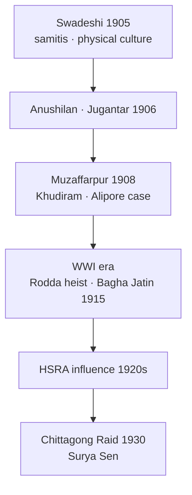

# Revolutionary Movement

> GS-1 · Topic 02 · Revolutionary terrorism, Bengal samitis, Bhagat Singh, HSRA philosophy

---

## PYQs

| Year | M | Words | Question (EN) | प्रश्न (HI) | ID |
|------|---|-------|---------------|-------------|-----|
| 2024 | 12 | 200 | Outline the development of revolutionary movement in Bengal. | बंगाल में क्रांतिकारी आंदोलन के विकास की रेखांकित कीजिए। | Q1 |
| 2022 | 12 | 200 | Throw light on the 'Revolutionary Philosophy' formulated by Bhagat Singh. | भगत सिंह द्वारा प्रतिपादित 'क्रांतिकारी दर्शन' पर प्रकाश डालिए। | Q2 |

---

## Quick Revision

```
REVOLUTIONARY TERRORISM (1905–1934): Armed propaganda · individual heroism · NOT mass army revolt
  Trigger: Swadeshi failure + Surat 1907 + repression → youth disillusioned with Moderate/early Gandhi methods

BENGAL PHASES:
  1905–08 Swadeshi samitis → Anushilan (Dacca 1906) · Jugantar (1906, Bhupendranath Dutt)
  1908: Khudiram Bose · Prafulla Chaki → Muzaffarpur bomb (Kingsford) | Alipore Bomb Case (Aurobindo)
  1908–14: Dacca Anushilan · Maniktala · Barin Ghosh networks · Yugantar journal
  WWI: Ghadar overlap · Bagha Jatin (Jatin Mukherjee) · German Plot 1914–15 (Balasore)
  1920s: HSRA (Hindustan Socialist Republican Association) · Kakori 1925 · Chittagong Armoury Raid 1930 (Surya Sen)

BENGAL LEADERS:
  Aurobindo Ghosh · Barindra Kumar Ghosh · Khudiram Bose · Prafulla Chaki · Bagha Jatin
  Surya Sen (Masterda) · Pritilata Waddedar · Bina Das · Jatindranath Mukherjee

BHAGAT SINGH (1907–1931):
  Naujawan Bharat Sabha · HSRA · Lahore conspiracy
  1928: Lala Lajpat Rai death (Simon protest) → Saunders avenging (Dec 1928)
  1929: Central Assembly bomb (NOT to kill — "to make the deaf hear") · hunger strike Lahore jail
  1931: Hanged 23 March with Rajguru · Sukhdev

REVOLUTIONARY PHILOSOPHY (Bhagat Singh — PYQ):
  Beyond mere violence → socialist revolution · class analysis · atheism (Why I Am an Atheist)
  Political aim: complete independence + social-economic revolution (not just British swap)
  Method: "Propaganda by deed" + pamphlets (Inquilab Zindabad) · organised party not lone anarchism
  Critique of Gandhi/Chamber of commerce nationalism · mass mobilisation ideal but used dramatic acts
  Martyrdom as consciousness-raising — "Inquilab Zindabad" · "Samrajyavad ka naash"

ALL-INDIA LINKS:
  Punjab: HSRA · Ram Prasad Bismil · Ashfaqullah · Kakori conspiracy 1925
  Maharashtra: Savarkar (Abhinav Bharat, London) · Chaphekar brothers
  UP: Chandrashekhar Azad · Hindustan Republican Association (1924)

GOVT RESPONSE: Rowlatt · Defence of India Act · CID infiltration · executions · Andaman Cellular Jail

CONTEMPORARY: Shaheed memorials · Hussainiwala · Cellular Jail UNESCO · Art 51A(f) · NEP 2020
  Azadi Ka Amrit Mahotsav — Bhagat Singh, Khudiram icons

TRAPS: Bengal rev ≠ only bombs from day one (samiti physical culture first)
  Aurobindo ≠ lifelong revolutionary (retired 1910 Pondicherry) | Bhagat Singh ≠ anarchist only
  HSRA = socialist · earlier Anushilan more nationalist-mystical | Gandhi opposed methods NOT all goals
  Chittagong 1930 ≠ 1857 | Kakori ≠ Bengal
```

---

## Content

### Context — what the revolutionary movement was and why it arose

The revolutionary movement in India — often termed revolutionary terrorism in historiography — represents a distinct stream of anti-colonial resistance that operated parallel to, and sometimes in tension with, the Congress-led Gandhian mass struggle. Between roughly 1905 and 1934, underground networks of young nationalists employed political violence — assassinations, bombings, and robberies to fund operations — against British officials and colonial institutions. Their core conviction was straightforward: Britain would never voluntarily relinquish India through petitions or moral appeals; only armed struggle and heroic sacrifice (balidan) could awaken the nation and force the imperial power to retreat.

This movement must be distinguished from three other forms of anti-colonial action. The Revolt of 1857 was an army-led mass uprising with restorationist aims, not a programme of modern nationalism. Gandhian satyagraha deliberately rejected violence as both method and end. Extremist politics under leaders like Tilak employed legal mass boycott and swadeshi agitation within constitutional bounds. Many revolutionaries, however, began their political lives in swadeshi samitis — the voluntary associations created during the anti-Partition agitation of 1905 — before turning underground when legal channels closed under repression.

The movement arose from a specific historical conjuncture. The Swadeshi agitation of 1905–07, triggered by Curzon's Partition of Bengal, raised nationalist consciousness to unprecedented levels but failed to reverse colonial policy decisively. The Surat Split of 1907 fractured the Congress into Moderate and Extremist wings, leaving radical youth without an institutional home. Tilak's imprisonment in 1908, deportations of leaders, and press censorship under the Vernacular Press Act and Section 124A IPC closed the space for open agitation. Simultaneously, international models — Irish nationalism, Russian nihilists and narodniks, Italian Carbonari, and Japan's victory over Russia in 1905 — demonstrated that even powerful empires could be challenged through organised resistance and individual heroism. The Bhagavad Gita's ethos of selfless action and the cult of Bande Mataram provided a spiritual vocabulary for martyrdom as national regeneration.

### Bengal — the development of revolutionary nationalism

Bengal was the cradle and strongest theatre of Indian revolutionary terrorism. The movement evolved through three distinct phases, each building on the previous while adapting to changing political conditions.

**Phase I: From Swadeshi samitis to secret societies (1905–1908)**

The Swadeshi movement of 1905 created voluntary associations across Bengal that combined relief work, arbitration, and physical culture — lathi training and drill — with nationalist propaganda. These samitis were the seedbed from which secret revolutionary societies emerged. The Anushilan Samiti, founded in 1906 in Dacca (Dhaka) under Pulin Behari Das, established branches in Calcutta and Chittagong, combining paramilitary training with revolutionary literature. The Jugantar (Yugantar) group, linked to Barindra Kumar Ghosh and Bhupendranath Dutt, published the journal *Jugantar* with fiery nationalist rhetoric. Aurobindo Ghosh, principal of Bengal National College and editor of *Bande Mataram*, provided spiritual-nationalist ideology while his brother Barin Ghosh operated a bomb factory in the Maniktala garden of Calcutta.

The first major action came on 30 April 1908, when Khudiram Bose (eighteen years old) and Prafulla Chaki threw a bomb at a carriage in Muzaffarpur intended for the unpopular judge Kingsford. The bomb hit the wrong carriage, killing two British women. Chaki committed suicide when cornered; Khudiram was hanged on 11 August 1908, becoming the youngest martyr icon of the movement. The Alipore Bomb Conspiracy Case (1908–09) exposed Barin Ghosh's network; Aurobindo was acquitted for lack of evidence, but Barin was sentenced to transportation to the Andaman Islands. Despite the moral ambiguity of the Muzaffarpur targeting error, popular sympathy for Khudiram galvanised Bengali youth and established the martyrdom cycle that would sustain the movement for decades.

**Phase II: Networks, dacoities, and the First World War (1908–1918)**

The Dacca Anushilan Samiti became the largest structured revolutionary body, organised in hierarchical cells with oath-bound membership. In 1914, revolutionaries executed the Rodda company arms heist in Calcutta, stealing 202 Mauser pistols — the largest arms coup of the pre-independence era. Bagha Jatin (Jatindranath Mukherjee), the Jugantar leader, attempted a more ambitious operation during the First World War: the German arms conspiracy of 1914–15, which sought to land German weapons on the Orissa-Balasore coast with links to the Zimmermann telegram and Mahendra Pratap's international efforts. The plot failed; Jatin died fighting British troops in 1915. The Ghadar Party overlap from Punjab (founded 1913 among diaspora Sikhs) created some Bengal-Punjab revolutionary contact during the wartime anti-British opportunity, though the movements remained largely regionally distinct.

**Phase III: Interwar renewal and the socialist turn (1919–1934)**

The Non-Cooperation Movement (1920–22) briefly drew some revolutionaries toward Gandhi's mass platform, but his suspension after Chauri Chaura disillusioned those who believed non-violence could never succeed against an armed empire. The Hindustan Republican Association (1924), operating primarily in North India, executed the Kakori train robbery conspiracy in 1925, involving Ram Prasad Bismil, Ashfaqullah Khan, and Chandrashekhar Azad. In 1928, the organisation renamed itself the Hindustan Socialist Republican Association (HSRA), explicitly adopting a socialist programme that influenced Bengali youth as well.

In Bengal, the most dramatic interwar action was the Chittagong Armoury Raid of 30 April 1930, led by Surya Sen (Masterda). The revolutionaries captured the police armoury, hoisted the Indian flag, and waged guerrilla warfare in the surrounding hills before being hunted down. Pritilata Waddedar led the Pahartali European Club attack in 1932, dying by cyanide rather than surrender. Bina Das shot at Governor Stanley Jackson in 1932; Kalpana Dutt (Joshi) participated in the Chittagong raid. Surya Sen was hanged in 1934, closing the most active phase of Bengal's armed struggle.



| Feature | Bengal revolutionary pattern |
|---------|------------------------------|
| **Social base** | Bhadralok youth, students; limited peasant/tribal participation except Chittagong |
| **Organisation** | Samiti cells, oaths, physical culture training |
| **Ideology (early)** | Nationalist-mystical (Aurobindo, Bande Mataram cult) |
| **Ideology (later)** | Socialist (HSRA influence, Surya Sen's programme) |
| **Methods** | Bombs, assassinations, dacoities, guerrilla raids |
| **Geography** | Calcutta, Dacca, Chittagong, Midnapore |

### Bhagat Singh and revolutionary philosophy

Bhagat Singh (1907–1931) represents the intellectual maturation of Indian revolutionary thought — the transition from nationalist martyrdom to an articulated ideology of socialist revolution. Born in Lyallpur, Punjab, he was influenced by the Ghadar movement's diaspora radicalism and joined the Naujawan Bharat Sabha in 1926 before entering the Hindustan Republican Association, which became the HSRA in 1928.

The trajectory of his actions reveals a deliberate political strategy rather than impulsive violence. When Lala Lajpat Rai was injured during the Simon Commission protest in Lahore and died on 17 November 1928, Bhagat Singh, Rajguru, and Chandrashekhar Azad planned the assassination of Saunders, the police officer they held responsible — an act of retributive justice on 17 December 1928. On 8 April 1929, Bhagat Singh and Batukeshwar Dutt threw low-intensity smoke bombs in the Central Legislative Assembly in Delhi — deliberately non-lethal — to protest the Public Safety Bill and Trade Disputes Bill, scattering pamphlets declaring "It takes a loud voice to make the deaf hear." The Assembly bomb was political theatre designed for the courtroom, not the graveyard. During the Lahore Conspiracy Case, Bhagat Singh undertook a hunger strike in jail (1929–30) demanding political prisoner status; Jatin Das died on hunger strike in September 1929. Bhagat Singh, Rajguru, and Sukhdev were hanged in Lahore jail on 23 March 1931, provoking nationwide mourning.

**Components of Bhagat Singh's revolutionary philosophy:**

| Element | Content |
|---------|---------|
| **Complete independence** | Full severance from British imperialism — not dominion status or gradual self-government |
| **Socialist revolution** | HSRA aim of a socialist republic liberating workers and peasants, not merely swapping elite rulers |
| **Class analysis** | Critique of capitalism and feudalism; "Inquilab Zindabad" popularised revolutionary socialism |
| **Atheism and rationalism** | *Why I Am an Atheist* (jail essay) rejected religious fatalism; science and reason guide action |
| **Propaganda by deed + literature** | Bombs as alarm bells, not terror for its own sake; pamphlets, court statements, *Kirti* journal |
| **Organised party discipline** | HSRA constitution — centralised revolutionary party, not individual anarchism |
| **Martyrdom as consciousness** | "It is easy to kill individuals but not ideas" — sacrifice educates the masses |
| **Critique of Gandhism** | Non-violence insufficient alone; mass movement needed but revolutionary vanguard has a role |

Bhagat Singh read Lenin, Marx, Bakunin, and Trotsky in jail notebooks, placing him intellectually beyond the nationalist-mystical framework of early Bengal revolutionaries like Aurobindo. His slogans — "Inquilab Zindabad" (Long live revolution), "Samrajyavad ka naash ho" (Down with imperialism) — entered permanent nationalist and Left discourse.

| Aspect | Early Bengal (1908–15) | Bhagat Singh / HSRA (1928–31) |
|--------|------------------------|-------------------------------|
| **Ideology** | Nationalist, spiritual (Aurobindo) | Socialist, atheist, rational |
| **Target selection** | Officials, bombs | Symbolic actions + political messaging |
| **Organisation** | Samiti cells | HSRA party with written programme |
| **Social vision** | Vague swaraj | Explicit socialist republic |

### All-India revolutionary network and British suppression

Revolutionary activity was not confined to Bengal. Maharashtra produced the Abhinav Bharat society (1904, V.D. Savarkar) and the Chaphekar brothers' assassinations (1897). Punjab hosted the Ghadar Party (1913), the HSRA, and the martyrs Bhagat Singh, Sukhdev, Rajguru, and Chandrashekhar Azad. Uttar Pradesh was the site of the Kakori conspiracy (1925) involving Ram Prasad Bismil and Ashfaqullah Khan — notable for Hindu-Muslim revolutionary cooperation at a time when communal politics was sharpening elsewhere. The Hindustan Republican Association (1924) renamed HSRA (1928) marks the generational shift from Bismil's nationalist republicanism to Bhagat Singh's explicit socialism — a trajectory that connected Bengal's samiti tradition to Punjab's party-based revolution.

British response was systematic and severe. The Defence of India Act (1915), Rowlatt Act (1919), and special tribunals enabled fast trials and executions. Andaman Cellular Jail housed revolutionary prisoners including Savarkar and Barin Ghosh. CID infiltration broke many networks after spectacular individual actions. The movement did not achieve independence militarily, but it sustained a revolutionary nationalist mythology, pushed the colonial state toward a security apparatus, and forced Congress mass movements to compete for youth loyalty.

Gandhi condemned revolutionary violence consistently, yet nationalist memory honoured martyrs — creating a dual tradition in which Bhagat Singh and Khudiram are celebrated alongside Gandhi in textbooks, memorials, and public culture. Post-1947, the revolutionary socialism strand influenced Left parties; Shaheed Diwas (23 March) and Hussainiwala border memorials institutionalise this legacy.

### Contemporary relevance

Shaheed Bhagat Singh memorials at Khatkar Kalan (Punjab) and Hussainiwala border embody Article 51A(f)'s mandate to cherish freedom struggle heritage. Cellular Jail in Port Blair serves as a national memorial and appears on UNESCO's World Heritage tentative list, anchoring Andaman tourism under the Swadesh Darshan scheme. Azadi Ka Amrit Mahotsav featured Khudiram Bose, Surya Sen, and Bhagat Singh in exhibitions and digital archives. NEP 2020's emphasis on critical history teaches multiple streams — Gandhian and revolutionary — without uncritical glorification of violence. "Inquilab Zindabad" continues in democratic movements, its meaning evolved from HSRA socialism to general anti-establishment idiom. Women revolutionaries — Pritilata Waddedar, Bina Das, Kalpana Joshi — are increasingly central to gender history and public memory. Academic and policy discourse distinguishes colonial revolutionary nationalism from contemporary terrorism — a distinction essential for balanced historical understanding.

### Limits

The revolutionary movement operated with a small cadre — it was never a mass revolution comparable to 1857 or Gandhian satyagraha. Violence frequently proved counter-productive, triggering repression without securing swaraj. Early Bengal revolutionaries employed a Hindu nationalist idiom with limited Muslim participation, though the HSRA phase with Ashfaqullah Khan represented significant intercommunal cooperation. Aurobindo Ghosh left active politics in 1910 for spiritual seclusion in Pondicherry — he was not a lifelong revolutionary. Extremists like Tilak must not be conflated with revolutionaries: Tilak operated through legal mass boycott, not underground bomb networks. Bhagat Singh's philosophy was intellectually advanced but his mass base remained an elite youth cadre — the gap between revolutionary ideals and organisational capacity was never closed.

---

## Answers

### Q1: Outline the development of revolutionary movement in Bengal. (2024, 12M, 200W)

**Opening:**
> The Bengal revolutionary movement evolved from Swadeshi-era samitis into structured secret societies and interwar guerrilla actions — using political violence against British rule from 1905 to the mid-1930s.

**Write these points:**
- **Origins (1905–08):** **Swadeshi physical culture samitis** → **Anushilan Samiti (1906, Dacca)** and **Jugantar group** — **Aurobindo, Barin Ghosh** — **training, nationalist press (Jugantar, Bande Mataram)**.
- **Martyrdom phase:** **Muzaffarpur bomb (1908)** — **Khudiram Bose, Prafulla Chaki**; **Alipore Conspiracy Case** — **Maniktala bomb factory** exposed; **youth martyrdom** galvanised sympathy.
- **Organisation (1908–15):** **Dacca Anushilan** hierarchical cells; **Rodda arms heist (1914)**; **Bagha Jatin (Jatin Mukherjee)** — **German Plot (1915, Balasore)** — **WWI anti-British attempt**.
- **Interwar:** Brief **Gandhi phase**; renewed **underground** — **HSRA socialist influence**; **Chittagong Armoury Raid (1930, Surya Sen)** — **guerrilla, flag hoisting**; **Pritilata Waddedar, Bina Das** — **women revolutionaries**.
- **Character:** **Elite student-youth base**, **bombs/assassinations/dacoities**, shift from **mystical nationalism (Aurobindo)** toward **socialist ideas (1930s)**.
- **Outcome:** **Suppressed by British CID/trials** — **Andaman sentences** — but **enduring martyrdom legacy** in **Bengal freedom narrative**.

**Conclusion:**
> Bengal's revolutionary movement thus developed in phases from Swadeshi samitis to armed propaganda and guerrilla raids — failing militarily but permanently shaping India's revolutionary nationalist memory.

---

### Q2: Throw light on the 'Revolutionary Philosophy' formulated by Bhagat Singh. (2022, 12M, 200W)

**Opening:**
> Bhagat Singh's revolutionary philosophy, articulated through HSRA and his jail writings, went beyond individual terrorism to advocate socialist revolution, rational atheism, and propaganda combining action with ideas.

**Write these points:**
- **Political goal:** **Complete independence** — not **dominion status** — plus **socialist republic** addressing **workers, peasants, capitalism and feudalism** (**HSRA manifesto 1928**).
- **Method — propaganda by deed:** **Assembly bomb (1929)** with **leaflets** — **"make the deaf hear"** — **symbolic violence**, **court statements as public education**; **Inquilab Zindabad**.
- **Rationalism/atheism:** ***Why I Am an Atheist*** — reject **religious fatalism**; **science, reason, materialist history** guide revolution — **distinct from mystical early revolutionaries**.
- **Organised party:** **HSRA discipline** — **centralised revolutionary organisation**, not **anarchy** — **pamphlets, *Kirti* journal**, **youth mobilisation (Naujawan Bharat Sabha)**.
- **Martyrdom theory:** **Sacrifice inspires masses** — **"easy to kill individuals, not ideas"** — **conscious balidan (23 March 1931)**.
- **Critique:** **Gandhi's non-violence insufficient alone**; **mass movement + vanguard action** needed — yet **cadre remained limited** — **philosophy advanced, mass base incomplete**.

**Conclusion:**
> Bhagat Singh's revolutionary philosophy thus fused socialist goals, atheist rationalism, and propaganda-by-deed — elevating Indian revolution from heroic terrorism to an articulated ideology of social transformation.

---

### Q3: *Likely:* Compare early Bengal revolutionaries with HSRA under Bhagat Singh. (Future variant, 8M, 125W)

**Opening:**
> Early Bengal revolutionaries (1905–15) emphasised nationalist martyrdom and samiti secrecy, while HSRA under Bhagat Singh (1928–31) explicitly adopted socialist, atheist, and party-based revolutionary philosophy.

**Write these points:**
- **Ideology:** **Aurobindo/spiritual nationalism** vs **Bhagat Singh's socialism + atheism**.
- **Organisation:** **Anushilan/Jugantar cells** vs **HSRA central programme**.
- **Actions:** **Assassinations (Khudiram, Bagha Jatin)** vs **symbolic Assembly bomb + court propaganda**.
- **Social vision:** **Vague swaraj** vs **workers-peasants republic**.

**Conclusion:**
> HSRA represented ideological maturation of Indian revolutionary thought — though both phases shared anti-colonial armed resistance against British rule.

---

## Traps

| Wrong | Correct |
|-------|---------|
| Bengal revolutionary movement began with Khudiram bomb only | **Evolved from 1905 Swadeshi samitis** — **Anushilan/Jugantar 1906** |
| Aurobindo remained active revolutionary till independence | **Retired to Pondicherry spirituality (1910)** after **Alipore acquittal** |
| Bhagat Singh's Assembly bomb aimed to kill many | **Low-intensity symbolic bomb + leaflets** — **propaganda, not mass killing** |
| Bhagat Singh was anarchist with no ideology | **HSRA socialist programme**, ***Why I Am an Atheist***, **class analysis** |
| All Extremists (Tilak) were revolutionaries | **Extremists = legal mass boycott**; **revolutionaries = underground violence** — **overlap but distinct** |
| Chittagong Armoury Raid was in 1928 | **30 April 1930** — **Surya Sen** |
| Kakori conspiracy was Bengal event | **Kakori (1925) — UP/Punjab** — **HRSA/Bismil, Ashfaqullah** |
| Revolutionary movement won swaraj | **Failed militarily** — **legacy ideological/moral** |
| HSRA ignored mass mobilisation entirely | **Advocated mass + vanguard** — **could not achieve mass base like Gandhi** |
| Khudiram targeted Kingsford successfully | **Bomb hit wrong carriage** — **Khudiram hanged anyway at 18** |
| Women absent in Bengal revolution | **Pritilata Waddedar, Bina Das, Kalpana Dutt** — **active participants** |
| Gandhi and Bhagat Singh shared same method | **Shared anti-colonial goal** — **Gandhi rejected violent means** |
| Early revolutionaries were all socialist | **Socialism explicit in HSRA phase** — **early Bengal more nationalist-mystical** |

---

*Complete.*
