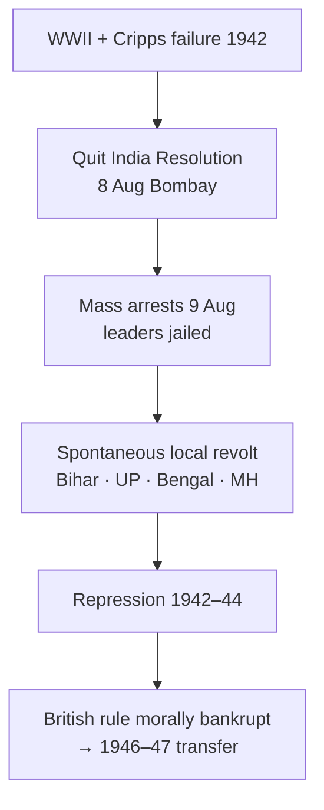

# Quit India & Late Nationalism

> GS-1 · Topic 02 · Quit India 1942, WWII phase, Cripps, INA, transfer of power build-up

---

## PYQs

| Year | M | Words | Question (EN) | प्रश्न (HI) | ID |
|------|---|-------|---------------|-------------|-----|
| 2019 | 12 | 200 | Examine the role of Quit India Movement in the freedom movement of India. | भारत के स्वतंत्रता आंदोलन में भारत छोड़ो आंदोलन के योगदान का परीक्षण कीजिए। | Q1 |
| — | 12 | 200 | *Likely:* Discuss the significance of the Quit India Resolution (1942). | *संभावित:* भारत छोड़ो प्रस्ताव (1942) के महत्व की विवेचना कीजिए। | Q2 |

---

## Quick Revision

```
LATE NATIONALISM (1939–47): WWII · Congress ministries resign 1939 · Cripps 1942 · Quit India · INA trials · 1946 RIN mutiny

QUIT INDIA 1942:
  Trigger: WWII — India forced into war · Cripps Mission failure (Mar 1942) · Japanese advance in Burma
  Resolution: 8 Aug 1942 Bombay (Gowalia Tank) · "Do or Die" · Gandhi · AICC
  Arrests: 9 Aug — Gandhi, Nehru, Patel, Azad, all top leaders → LEADERLESS revolt
  Spread: Bihar · UP · Bengal · Maharashtra · Karnataka — parallel govts (Ballia, Tamluk, Satara)
  Methods: Hartals · sabotage · telegraph/rail disruption · student-workers-peasants · NOT army mutiny (mostly)
  Repression: Mass shootings · fines · village burning · 94000+ arrests · army occupation
  Outcome: Suppressed by 1944 · BUT British moral authority destroyed · "August Revolution"

ROLE IN FREEDOM STRUGGLE (PYQ):
  Peak mass upsurge after 1919–42 Gandhian phases · proved British can't rule without consent
  Forced post-war settlement · Wavell Plan · Cabinet Mission 1946 · accelerated independence
  Youth/women/peasants radicalised · underground (Usha Mehta Congress Radio, Jayaprakash Narayan)
  Communal violence ↑ during vacuum · Muslim League strengthened separate Pakistan demand
  Complement: INA trials 1945–46 · RIN mutiny Feb 1946 · post-war Labour govt in Britain

CRIPPS MISSION (Mar 1942): Dominion status after war · provinces could secede · rejected by Congress
  Gandhi: "post-dated cheque on failing bank" · Hindu Mahasabha/Muslim League also dissatisfied

PARALLEL LATE NATIONALISM:
  Subhas Bose · INA · Azad Hind Govt (1943) · "Delhi Chalo" · Imphal/Kohima 1944
  Rajaji formula 1944 · Wavell Plan 1945 · Cabinet Mission 1946 · Direct Action Day 1946

CONTEMPORARY: 8 Aug Quit India Day · Art 51A(f) · Red Fort trials memory · NEP 2020
  Azadi Ka Amrit Mahotsav · August Kranti memorial Mumbai

TRAPS: Quit India ≠ Gandhi led on ground (in jail) | NOT immediate independence 1942
  Cripps ≠ offered full independence now | INA ≠ same as Quit India but complementary
  Ballia/Tamluk parallel govts ≠ all-India gov | Movement suppressed ≠ failure
  Muslim League did NOT lead Quit India — separate Pakistan politics
```

---

## Content

### Context — late nationalism and the final confrontation with colonial rule

The period from 1939 to 1947 represents the terminal phase of India's freedom struggle — a compressed era in which the accumulated contradictions of ninety years of colonial rule erupted simultaneously through mass civil disobedience, military challenge, constitutional negotiation, and communal violence. The Quit India Movement of August 1942 stands at the centre of this phase as the final Gandhian mass upsurge, but it cannot be understood in isolation from the Second World War's imperial context, the failure of the Cripps Mission, the parallel trajectory of Subhas Chandra Bose and the Indian National Army, the INA trials of 1945–46, the Royal Indian Navy mutiny of February 1946, and the Cabinet Mission that led, through Direct Action Day and the Mountbatten Plan, to Independence and Partition on 15 August 1947.

Late nationalism differs from earlier Gandhian phases in one crucial respect: the Congress leadership was arrested within hours of launching the struggle, transforming a centrally directed satyagraha into a spontaneous, leaderless, locally varied revolt. This decentralisation was simultaneously the movement's greatest strength — demonstrating that anti-colonial sentiment had penetrated deep into peasant and student communities — and its greatest weakness, as local violence and communal polarisation undermined Gandhi's non-violent discipline.

### Background — why Quit India arose (1939–42)

When Britain declared war on Germany in September 1939, Viceroy Linlithgow committed India to the war effort without consulting Indian political leaders. Congress provincial ministries, which had been elected under the Government of India Act 1935 and formed governments in seven provinces including UP under Govind Ballabh Pant, resigned in October–November 1939 in protest. This rupture ended the constitutional experiment of provincial autonomy and returned Indian politics to confrontation mode.

Nationalist frustration intensified through 1940–41. The Individual Satyagraha campaigns, the Atlantic Charter's promise of self-determination (which Churchill explicitly excluded from applying to India), and the fall of Burma to Japan in 1942 created a sense that Britain would fight to the last Indian while reserving freedom for after the war — if at all. Japanese advance toward the Imphal-Kohima frontier raised the spectre that Britain might abandon India after extracting wartime resources, leaving it defenceless.

| Factor | Detail |
|--------|--------|
| **WWII (1939)** | Linlithgow declared India at war without Congress consent; provincial ministries resigned |
| **Nationalist frustration** | 1935 Act insufficient; war sacrifices without freedom promise |
| **Japanese threat** | Fall of Burma (1942); fear British would abandon India after using its resources |
| **Cripps Mission failure (March 1942)** | Dominion status after war, provinces could secede — rejected by Congress |
| **Gandhi's conviction** | British presence invited Japanese invasion; "Do or Die" for orderly withdrawal |

The Cripps Mission of March 1942 was the last major constitutional negotiation before open mass struggle. Sir Stafford Cripps, sent by the Labour-dominated war cabinet, offered dominion status after the war, election of a Constituent Assembly, and the right of provinces to secede from the federation. Congress rejected the offer unanimously: Gandhi called it a "post-dated cheque on a crashing bank" because it provided no immediate self-government, retained British control of defence during the war, and the provincial secession clause was read as an embryo of Pakistan. The Muslim League also rejected Cripps — it wanted explicit recognition of Pakistan, not a vague secession option. With the constitutional outlet exhausted, Quit India became the Congress's inevitable response.

### Quit India Resolution and launch (8 August 1942)

The All India Congress Committee met at Gowalia Tank Maidan, Bombay, on 7–8 August 1942. Jawaharlal Nehru moved the resolution; Narendra Deva seconded it. The resolution demanded immediate end to British rule in India, authorised Gandhi to lead mass struggle on the widest possible scale, and adopted Gandhi's mantra: "Do or Die" (Karenge ya marenge) — non-violent in intent but total in commitment.

Operation Zero Hour followed at dawn on 9 August 1942. All top leaders — Gandhi, Nehru, Patel, Azad, Rajagopalachari, Abdul Ghaffar Khan — were arrested and imprisoned at Ahmednagar Fort, Yerwada, and other sites. The Congress was banned. With no central command, the movement passed to local leaders, students, peasants, and underground networks.



### Course and character of the movement

The movement's geographic spread revealed where anti-colonial sentiment ran deepest. Bihar was the strongest theatre — students and peasants in Muzaffarpur and Patna engaged in sustained resistance, with Jayaprakash Narayan operating underground. In eastern UP, Ballia saw a parallel government under Chittu Pandey for a brief period. Bengal's Tamluk region in Midnapore witnessed the Tamralipta Jatiya Sarkar — a parallel administration providing relief, courts, and schools, associated with Satish Chandra Samanta and the martyrdom of Matangini Hazra during a 1942 procession. Maharashtra's Satara district produced the Prati Sarkar (1942–44) under Nana Patil — the longest-sustained parallel rule anywhere in India. Karnataka saw peasant upsurge and sabotage; Bombay and Delhi witnessed strikes, hartals, and Usha Mehta's secret Congress Radio broadcasting on 42.34 metres from 14 August to 27 October 1942.

| Region | Features |
|--------|----------|
| **Bihar** | Strongest theatre; students, peasants; Jayaprakash Narayan underground |
| **Eastern UP** | Ballia parallel government (Chittu Pandey) |
| **Bengal** | Tamluk Tamralipta Jatiya Sarkar; Matangini Hazra martyrdom |
| **Maharashtra** | Satara Prati Sarkar (1942–44) under Nana Patil — most sustained |
| **Karnataka** | Peasant upsurge, sabotage |
| **Bombay, Delhi** | Strikes, hartals; Usha Mehta's Congress Radio |

Methods varied by locality. Hartals, demonstrations, and processions mobilised students and workers. Sabotage of railway lines and telegraph wires denied British communication networks — mass decentralised action, not coordinated terrorist bombing. Attacks on police stations and treasuries occurred where local anger overwhelmed Gandhi's non-violence call. Parallel institutions — people's courts, volunteer corps, famine relief — represented experiments in alternative governance, most developed in Satara's Prati Sarkar.

The underground leadership sustained morale when the Congress was banned. Jayaprakash Narayan, Ram Manohar Lohia, and Aruna Asaf Ali — who hoisted the Congress flag at Gowalia Tank when leaders were arrested — operated clandestine networks. Social composition was wider than earlier urban Congress phases: peasants, students, workers, and tribals in parts of Bihar and Orissa participated. Women were prominently active — Usha Mehta, Aruna Asaf Ali, Matangini Hazra. Muslim participation was limited in League-dominated areas because the Muslim League opposed Quit India and cooperated with the British during 1942–45, sharpening communal politics.

### British repression and suppression

British response was military in scale. By end-1942, 572 battalions were deployed; collective fines and village burning occurred in Madhya Pradesh and Bihar. Massacres at Patna, Gorakhpur, and Delhi involved firing on unarmed crowds. Approximately 94,000 or more were arrested — over 60,000 in Bihar alone by some accounts. Press blackout and censorship accompanied military occupation. The movement was largely suppressed by 1943–44 in most areas, though Satara's Prati Sarkar persisted until 1944. Gandhi undertook a fast in 1943 at Aga Khan Palace, Pune; his health declined severely and Kasturba Gandhi died there in 1944. The personal cost of leadership during repression — imprisonment, fasting, bereavement — underscored how Quit India consumed the Gandhian leadership even as it operated without their direct command on the ground.

### Significance — the August Revolution thesis

Nationalist historiography labels Quit India the "August Revolution" — the largest short-term mass rebellion against British authority since 1857, though fundamentally different in character. Where 1857 was army-led and restorationist, 1942 was Congress-inspired, decentralised, and oriented toward immediate independence rather than Mughal revival. The psychological turning point mattered as much as the military suppression: by 1945, British elites across party lines accepted that exit was inevitable, and Attlee's 1947 statement explicitly referenced the combined pressures of 1942 mass rebellion, INA trials, naval mutiny, and wartime exhaustion.

Quit India functioned as the culmination of Gandhian mass nationalism. After Non-Cooperation (1920–22), Civil Disobedience (1930–34), and Individual Satyagraha (1940–41), the 1942 movement proved that rejection of colonial rule was mass-based, not elite. It destroyed British moral legitimacy: Linlithgow's repression during a war fought ostensibly for democracy invited international criticism, and post-war British consensus held that India was ungovernable without Indian consent. Prime Minister Attlee acknowledged in 1947 that Quit India, the INA trials, and naval mutinies contributed to the decision to leave.

The movement accelerated post-war constitutional settlement through a direct chain: Wavell Plan (1945), Simla Conference failure, Cabinet Mission (1946), Constituent Assembly elections in which Congress won a massive victory — all flowed from the 1942 breakdown of negotiation. It radicalised a generation: JP, Lohia, and the socialist wing shaped post-independence politics through their 1942 underground experience. Peasant militancy in post-1947 land movements partly rooted in the 1942 awakening.

Yet Quit India did not operate alone. Subhas Chandra Bose's Azad Hind Government (1943) and INA, with "Delhi Chalo" and the Imphal-Kohima campaign of 1944, posed a military challenge. INA trials at Red Fort (November 1945–46) of Sehgal, Dhillon, and Shah Nawaz provoked mass protests. The Royal Indian Navy mutiny of February 1946 in Bombay and Karachi — armed personnel revolt with nationalist sympathy — further eroded colonial confidence. The post-war Labour government under Attlee, imperial economic exhaustion, and the Second World War together secured 1947 — not Quit India in isolation.

| Event | Year | Significance |
|-------|------|--------------|
| **Azad Hind Govt / INA** | 1943–45 | Subhas Bose; Imphal/Kohima 1944; INA trials unified sentiment 1945–46 |
| **Rajaji formula** | 1944 | Congress-League coexistence attempt — failed |
| **Wavell Plan / Simla Conference** | 1945 | Executive Council expansion — Jinnah-Congress deadlock |
| **INA Red Fort trials** | Nov 1945–46 | Mass protests for Sehgal, Dhillon, Shah Nawaz |
| **RIN Mutiny** | Feb 1946 | Sailors' strike — nationalist sympathy |
| **Cabinet Mission** | 1946 | Three-tier plan; Constituent Assembly elected |
| **Direct Action Day** | 16 Aug 1946 | Calcutta killings — Partition trajectory |
| **Mountbatten Plan** | June 1947 | Partition + independence (15 Aug 1947) |

The movement's limits must be stated clearly. It did not achieve immediate independence — suppression by 1944, freedom only in 1947 with Partition. Leaderless violence in pockets diluted Gandhi's non-violence and provided British propaganda material. The Muslim League strengthened as "loyal opposition" during 1942–45, hardening the Pakistan demand. No unified alternative government emerged at the national level — parallel governments in Ballia, Tamluk, and Satara were local and temporary. British official histories emphasised lawlessness; nationalist histories emphasised moral victory — responsible analysis holds both truths simultaneously.

### Contemporary relevance

August Kranti Diwas (8 August) is nationally observed; Gowalia Tank — now August Kranti Maidan in Mumbai — hosts a memorial and museum. Article 51A(f) mandates cherishing freedom struggle heritage, with Quit India central to school, NCC, and NEP narratives. Azadi Ka Amrit Mahotsav recreated Usha Mehta's Congress Radio and curated exhibitions of 1942 martyrs. Aga Khan Palace in Pune, where Gandhi was interned and Kasturba died, is a national memorial protected under Article 49. NEP 2020 teaches Quit India's successes and communal costs together as critical history. The tension between 1942's leaderless upsurge and 1947's constitutional transfer remains foundational to debates about republican legitimacy. JP's Total Revolution (1974) traces intellectual lineage to his 1942 underground socialism.

### Limits

Quit India did not produce immediate freedom — five years elapsed before Independence, and Partition accompanied it. The Muslim League's opposition means the movement cannot be claimed as unified communal struggle. Violence and sabotage in many localities departed from Gandhian ahimsa, a fact both British records (emphasising lawlessness) and nationalist records (emphasising moral victory) interpret differently — balanced history requires both. INA trials and the RIN mutiny were separate but complementary pressures; crediting Quit India without acknowledging these factors distorts causation. Eastern UP (Ballia) and the Bihar border remain sites of regional memorial pride, but regional heroism must not obscure the movement's national limits and communal costs.

---

## Answers

### Q1: Examine the role of Quit India Movement in the freedom movement of India. (2019, 12M, 200W)

**Opening:**
> The Quit India Movement (August 1942) was the final Gandhian mass upsurge against British rule — leaderless after top arrests, suppressed by 1944, yet decisive in destroying colonial moral authority and accelerating India's path to independence in 1947.

**Write these points:**
- **Context and launch:** After **Cripps Mission failure (1942)** and **WWII imposition**, **AICC Quit India resolution (8 Aug, Gowalia Tank)** with **"Do or Die"** — **immediate arrest of Gandhi, Nehru, Patel (9 Aug)** — **spontaneous nationwide revolt**.
- **Mass character:** **Students, peasants, workers** in **Bihar, UP (Ballia), Bengal (Tamluk), Maharashtra (Satara Prati Sarkar)** — **hartals, sabotage of railways/telegraphs**, **parallel local governments** — **widest social participation since 1919**.
- **Underground role:** **JP, Lohia, Usha Mehta (Congress Radio), Aruna Asaf Ali** — **sustained morale** when **Congress banned**.
- **Repression and moral defeat of British:** **94000+ arrests**, **massacres, village fines** — **Allied war for democracy vs Indian firing** — **post-war British consensus: exit necessary**.
- **Link to 1947:** Combined with **INA trials (1945–46), RIN mutiny (1946), Cabinet Mission, 1946 elections** — **Quit India proved India ungovernable without consent** — **Attlee acknowledged 1942 pressures**.
- **Limits:** **Not immediate freedom**; **Muslim League opposed** — **Pakistan demand hardened**; **some violence** beyond **Gandhi's non-violence** — **movement suppressed militarily by 1944**.

**Conclusion:**
> Quit India's role was pivotal as the climactic mass rejection of British rule — morally bankrupting the Raj and forcing post-war constitutional settlement, even though independence came in 1947 through a broader convergence of forces including INA, mutinies, and imperial exhaustion.

---

### Q2: *Likely:* Discuss the significance of the Quit India Resolution (1942). (Future variant, 12M, 200W)

**Opening:**
> The Quit India Resolution of 8 August 1942 marked Congress's formal demand for immediate British withdrawal and authorised the largest mass struggle of the Gandhian era.

**Write these points:**
- **Content:** **Immediate independence**; **Gandhi to lead struggle**; **"Do or Die"** slogan — **non-violent in intent**.
- **Historical moment:** **Post-Cripps breakdown** — **last constitutional hope exhausted**.
- **Consequence of arrests:** **Leaderless decentralised revolt** — **unexpected mass scale**.
- **Significance:** **August Revolution** label; **parallel govts**; **British repression exposed**.
- **Legacy:** **Direct path to 1946–47 negotiations**; **radicalised youth (JP, Lohia)**.

**Conclusion:**
> The resolution transformed wartime impasse into open mass confrontation — its significance lies in unleashing spontaneous nationwide resistance that made continued colonial rule politically impossible after WWII.

---

### Q3: *Likely:* Why did the Cripps Mission fail and how did it lead to Quit India? (Future variant, 8M, 125W)

**Opening:**
> The Cripps Mission (March 1942) failed because its offer of post-war dominion status with provincial secession satisfied neither Congress's demand for immediate self-government nor the Muslim League's Pakistan demand — directly triggering Quit India.

**Write these points:**
- **Cripps offer:** **Dominion status after war**, **Constituent Assembly**, **provinces may secede**, **British control defence during war**.
- **Congress rejection:** **Gandhi** — **post-dated cheque**; **no real transfer now**.
- **League rejection:** **No explicit Pakistan** — **insufficient**.
- **Link:** **Negotiation dead end** → **8 Aug Quit India resolution** — **"Do or Die"**.

**Conclusion:**
> Cripps failure closed the constitutional outlet during WWII, making Quit India the inevitable Congress response to colonial intransigence.

---

## Traps

| Wrong | Correct |
|-------|---------|
| Gandhi personally led Quit India on the ground in 1942 | **Arrested 9 Aug 1942** — movement **leaderless/spontaneous** |
| Quit India achieved independence immediately | **Suppressed by 1944** — **independence 1947** after **multiple factors** |
| Muslim League led Quit India | **League opposed** — **cooperated with British** during **1942–45** |
| Cripps offered immediate full independence | **Dominion status after war** only — **defence under British during war** |
| Quit India was purely non-violent everywhere | **Gandhi's call non-violent** — **sabotage, clashes** occurred **locally** |
| INA and Quit India are the same movement | **Separate streams** — **complementary** pressure on British (Bose vs Gandhi methods) |
| Parallel governments ruled all India | **Local and temporary** — **Ballia, Tamluk, Satara** — **not national government** |
| British welcomed Quit India negotiations | **Mass repression** — **Congress banned** |
| Quit India alone caused 1947 | Also **WWII, INA trials, RIN mutiny 1946, Labour Attlee govt, economic exhaustion** |
| August Kranti was in Delhi | **Resolution at Bombay (Gowalia Tank)** — **8 August 1942** |
| All Congress leaders free during movement | **Top leadership in Ahmednagar/Yerwada** — **underground second line active** |
| Cripps satisfied Congress partially | **Congress unanimously rejected** — **Gandhi, Nehru, Azad** |
| Movement had central command after arrests | **Decentralised local initiative** — **strength and weakness** |

---

*Complete.*
