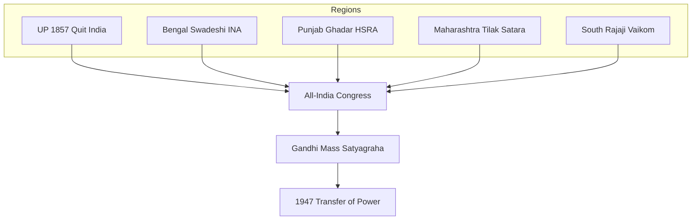

# Regional Contributors — Freedom Struggle

> GS-1 · Topic 03 · Bengal, UP, Punjab, Maharashtra, South — leaders and movements by region

---

## PYQs

| Year | M | Words | Question (EN) | प्रश्न (HI) | ID |
|------|---|-------|---------------|-------------|-----|
| — | 12 | 200 | *Likely:* Highlight contributions of different regions to the freedom struggle. | *संभावित:* स्वतंत्रता संग्राम में विभिन्न क्षेत्रों के योगदान पर प्रकाश डालिए। | Q1 |

---

## Quick Revision

```
UP (UPPCS priority):
  1857: Begum Hazrat Mahal (Lucknow) · Rani Lakshmibai (Jhansi) · Kunwar Singh (Bihar border)
  Peasant: Eka 1921–22 (Awadh) · Bardoli linked Patel not UP · Quit India Ballia parallel govt
  Leaders: Motilal/Jawaharlal Nehru (Allahabad) · Purushottam Das Tandon · Govind Ballabh Pant
  Muslim: Maulana Shaukat Ali · Hakim Ajmal Khan (Khilafat)

BENGAL: Partition 1905 swadeshi · Anushilan/Jugantar · Surya Sen Chittagong · Subhas Bose
  Bipin Pal · C.R. Das · Surendranath Banerjea · Quit India Tamluk Tamralipta Sarkar

PUNJAB: Lala Lajpat Rai · Bhagat Singh · HSRA · Komagata Maru 1914 · Jallianwala 1919
  Ghadar Party (1913) · Akali movement linked · Partition trauma 1947

MAHARASHTRA: Tilak (Extremist) · Savarkar · Prati Sarkar Satara 1942 · Ambedkar (social)
  Gandhi base Sabarmati/ Yerwada · Revolutionary Chapekar

SOUTH: Rajaji (Madras) · K. Kelappan (Vaikom) · Andhra Rampa 1922–24 · Kerala Mapilla 1921
  Periyar self-respect (social, overlaps Dravidian)

TRAPS: Regional ≠ isolated — all-India Congress connected | UP 1857 ≠ only Rani Jhansi
  Bengal revolution ≠ only violence | South ≠ absent in nationalism
```

---

## Content

### Context — regional diversity within a national struggle

India's freedom struggle was nationwide in aspiration but regionally textured in practice. Leaders, methods, social bases, and grievances varied across provinces — Bengal's revolutionary samitis differed from Punjab's Ghadar diaspora radicalism, which differed again from South India's constitutional Congress tradition and UP's combination of 1857 rebellion, peasant movements, and Quit India parallel government. Understanding regional contribution means mapping how local grievances fed into the all-India Congress framework that Gandhi, above all, integrated into mass satyagraha.

Regional struggles were never isolated. Congress operated as a national spine with provincial branches; sessions rotated across cities; leaders like Nehru (Allahabad), Bose (Bengal), Patel (Gujarat), and Rajaji (Madras) rose through provincial politics to national roles. Revolutionary regionalism in Bengal, Punjab, and UP fed an all-India martyrdom narrative without replacing Congress's mass base. Partition ultimately cut Punjab and Bengal — regional contribution includes this tragic territorial division as much as heroic resistance.

### Uttar Pradesh — the pivotal heartland

Uttar Pradesh occupies a central place in the freedom narrative because it combined every major form of anti-colonial action — military revolt, peasant unrest, constitutional leadership, revolutionary conspiracy, and Quit India radicalism — within a single geographic canvas.

In 1857, Awadh was the revolt's primary theatre. Begum Hazrat Mahal led resistance in Lucknow after the annexation of Awadh (1856) stripped the Nawab's authority. Rani Lakshmibai of Jhansi became the iconic military leader who died fighting at Gwalior. Nana Sahib's role at Kanpur and Maulvi Ahmadullah Shah's leadership from Faizabad extended the revolt across the Doab. Meerut, where sepoys mutinied on 10 May 1857, marks the conventional starting point — now a national memorial site.

The Congress era centred on Allahabad — home to Motilal Nehru's Anand Bhawan and Swaraj Bhawan, hosting sessions in 1888 and 1892. Jawaharlal Nehru emerged from this base to become Congress president and India's first Prime Minister. Govind Ballabh Pant served as UP premier after Congress won the 1937 provincial elections under the 1935 Act. Purushottam Das Tandon led the Hindi-Hindustani debate, shaping linguistic nationalism.

Peasant politics found expression in the Eka movement (1921–22) in Awadh, where tenants led by figures including Madhari Pasi united against talukdar exploitation — a movement distinct from but contemporary with Gandhi's Non-Cooperation. Chauri Chaura (1922, Gorakhpur district) — where a mob burned a police station killing twenty-two policemen — triggered Gandhi's withdrawal of Non-Cooperation, demonstrating UP peasant anger's intensity and its consequences for all-India strategy.

Revolutionary activity included the Kakori train robbery conspiracy (1925) involving Ram Prasad Bismil, Ashfaqullah Khan, and Chandrashekhar Azad — a landmark of Hindu-Muslim revolutionary cooperation in the Shahjahanpur-Bareilly-Rampur belt. During Civil Disobedience (1930–34), eastern UP saw no-tax campaigns and forest satyagraha integrated with the all-India salt march.

Quit India brought the Ballia parallel government (1942) under Chittu Pandey — among the most celebrated UP episodes. Khilafat-Non-Cooperation saw strong Muslim participation through Maulana Shaukat Ali and Hakim Ajmal Khan.

| Phase | Contribution | Leaders / sites |
|-------|--------------|-----------------|
| **1857** | Awadh centre; Lucknow siege; Jhansi | Begum Hazrat Mahal, Rani Lakshmibai, Nana Sahib |
| **Congress era** | Allahabad sessions; Nehru base | Motilal Nehru, Jawaharlal Nehru |
| **Khilafat-NCM** | Strong Muslim participation | Maulana Shaukat Ali, Hakim Ajmal Khan |
| **Peasant** | Eka movement (1921–22 Awadh) | Madhari Pasi and local leaders |
| **Revolutionary** | Kakori conspiracy (1925) | Ram Prasad Bismil, Ashfaqullah Khan |
| **Quit India** | Ballia parallel government (1942) | Chittu Pandey |
| **Constitutional** | UP premier 1937 | Govind Ballabh Pant; Purushottam Das Tandon |

### Bengal — swadeshi, revolution, and Subhas Bose

Bengal's contribution spans the entire nationalist spectrum from Moderate constitutionalism through Swadeshi boycott, revolutionary terrorism, Gandhian mass action, and Subhas Chandra Bose's military nationalism.

Surendranath Banerjea founded the Indian Association (1876) and represented early Congress Moderate leadership. The 1905 Partition of Bengal provoked the Swadeshi movement — boycott of foreign goods, national schools, rakhi bandhan, and Bande Mataram — led by Bipin Chandra Pal, Aurobindo Ghosh, and C.R. Das. Constructive swadeshi created the National Council of Education (1906) and Bengal National College, linking nationalist education to political resistance.

Revolutionary samitis — Anushilan and Jugantar — produced Khudiram Bose (1908), Bagha Jatin (1915), and Surya Sen's Chittagong Armoury Raid (1930), with women revolutionaries Pritilata Waddedar and Bina Das. Subhas Chandra Bose served as Congress president (1938, 1939), formed the Forward Bloc, and led the Azad Hind Government and INA. Quit India saw the Tamralipta Jatiya Sarkar at Tamluk (Midnapore) under Satish Chandra Samanta — a parallel government providing relief, courts, and schools.

| Phase | Contribution | Leaders / events |
|-------|--------------|------------------|
| **Moderate era** | Early Congress leadership | Surendranath Banerjea, Indian Association |
| **1905 Swadeshi** | Partition protest, boycott | Bipin Pal, Aurobindo, C.R. Das |
| **Revolutionary** | Anushilan, Jugantar, Chittagong | Khudiram, Surya Sen, Pritilata |
| **1930s–40s** | Bose, INA, Forward Bloc | Subhas Chandra Bose |
| **Quit India** | Tamralipta Jatiya Sarkar (Tamluk) | Satish Chandra Samanta |

### Punjab — martyrs, Ghadar, and Jallianwala

Punjab combined Extremist leadership, revolutionary martyrdom, diaspora radicalism, and the trauma of 1947 Partition. Lala Lajpat Rai — Lal of Lal-Bal-Pal — was injured during the Simon Commission protest in Lahore and died on 17 November 1928, his death provoking Bhagat Singh's retributive action. Jallianwala Bagh (13 April 1919) in Amritsar — where General Dyer fired on an unarmed crowd — became the national symbol of colonial brutality. The Ghadar Party (1913) organised revolutionary diaspora among Sikhs in North America. HSRA martyrs Bhagat Singh, Sukhdev, Rajguru, and Chandrashekhar Azad defined Punjab's revolutionary canon. The Komagata Maru incident (1914) protested racist immigration policy. Partition divided Punjab between India and Pakistan with mass violence and migration.

### Maharashtra — Extremism, parallel rule, and Ambedkar

Bal Gangadhar Tilak pioneered Extremist politics through Ganesh utsav nationalism and the Kesari-Maratha press in Pune. The Chaphekar brothers (1897) conducted early political assassinations. V.D. Savarkar founded Abhinav Bharat and endured Andaman imprisonment. Quit India produced the Satara Prati Sarkar (1942–44) under Nana Patil — the longest-sustained parallel government in India. Gandhi's ashrams at Sabarmati, Yerwada, and Aga Khan Palace anchored national politics in Maharashtra. B.R. Ambedkar's Mahad satyagraha (1927) and role in the Poona Pact (1932) added the social dimension of caste emancipation to the region's political history.

### South India — constitutional Congress and social satyagraha

C. Rajagopalachari (Rajaji) led Madras Congress, participated in the salt march, and became independent India's first Indian Governor-General. K. Kelappan's Vaikom satyagraha (1924–25) in Kerala fought for temple road access for lower castes. Alluri Sitarama Raju's Rampa rebellion (1922–24) mobilised Andhra tribals. The Malabar Mapilla rebellion (1921) had complex Khilafat-linked communal dimensions requiring nuanced treatment. Periyar's Self-Respect Movement ran parallel to nationalism as Dravidian social reform. Annie Besant's Home Rule League (1916) used her Theosophical Madras network to bridge South India to mass politics. Rajaji led the southern salt satyagraha at Vedaranyam (1930) as counterpart to Gandhi's Dandi March.

### Gujarat and Rajasthan — Gandhian base and princely loyalism

Gujarat supplied Gandhi's most sustained political laboratory: Kheda satyagraha (1918) over famine-era revenue, Bardoli (1928) under Sardar Patel against tax hikes, and the Dandi Salt March (1930) that launched Civil Disobedience. The Gandhi-Patel partnership rooted all-India mass strategy in Gujarati peasant communities. Rajasthan's experience was different — most princely rulers remained loyal to the British in both 1857 and 1942, though limited revolts occurred at Kota and Awagarh in 1857. The Bijolia movement (1916–20) against feudal dues in Rajasthan presaged agrarian politics that would continue after independence, demonstrating that even princely-state territories experienced anti-feudal unrest independent of ruler loyalty to the Raj.

### Delhi, North-West, and eastern belt

Delhi's 1857 siege made Bahadur Shah II the revolt's symbolic centre. The 1911 capital shift from Calcutta consolidated imperial symbolism. Rowlatt satyagraha (1919) made Delhi a national protest hub. Khan Abdul Ghaffar Khan — the Frontier Gandhi — led the Khudai Khidmatgar non-violent movement in the North-West Frontier Province. Bihar contributed Champaran (1917), Kunwar Singh's 1857 leadership, Quit India's strongest theatre, and Jayaprakash Narayan's underground networks. Odisha's Utkal Sammilani (1903) under Madhusudan Das combined regional province demand with nationalism. Assam's Gopinath Bordoloi linked Congress politics to tea garden labour and later became Chief Minister.

Khan Abdul Ghaffar Khan — the Frontier Gandhi — led the Khudai Khidmatgar non-violent movement among Pathans in the North-West Frontier Province, demonstrating that Gandhian satyagraha had regional variants beyond the Hindi heartland. His arrest alongside Congress leaders on 9 August 1942 confirmed the all-India scope of Quit India's repression. The Punjab-Delhi corridor linked Jallianwala Bagh (1919) to 1947 Partition violence — the North-West remained a high-intensity theatre across the entire ninety-year period.

### Bombay — business elite, press, and labour

The 1885 Congress first session in Bombay reflected Moderate merchant elite leadership through Pherozeshah Mehta and Dinshaw Wacha. Bombay textile strikes (1919–21) through the Girni Kamgar Union connected urban working classes to Rowlatt and Non-Cooperation. Usha Mehta's Congress Radio (1942) sustained underground communication. Mani Bhavan and August Kranti Maidan (Gowalia Tank) anchor Gandhi's national politics in Bombay.

### Women across regions

| Leader | Region | Role |
|--------|--------|------|
| **Rani Lakshmibai** | Jhansi (UP) | 1857 military leadership |
| **Begum Hazrat Mahal** | Lucknow (UP) | Awadh resistance |
| **Pritilata Waddedar** | Bengal | Chittagong raid, Pahartali attack |
| **Aruna Asaf Ali** | Delhi/Bombay | Quit India flag hoisting |
| **Usha Mehta** | Bombay | Congress Radio 1942 |
| **Matangini Hazra** | Bengal | Quit India procession martyr |

### Princely states — loyalism and exceptions

Most princely rulers remained loyal to the British in 1857 and 1942, but peasant and tribal unrest often erupted regionally regardless. Kota and Awagarh in Rajasthan saw limited 1857 participation. Hyderabad's Nizam resisted accession until 1948; the Communist-led Telangana peasant revolt (1946–51) rooted in colonial agrarian order continued post-1947. Travancore's progressive reforms connected to Vaikom and temple entry movements. Kashmir's Sheikh Abdullah began activism in the 1930s as a regional autonomy strand.

### How regions connected — synthesis

Congress functioned as the national integrator: provincial leaders rose through its branches, sessions rotated across cities, and Gandhi's method converted local grievances — Champaran indigo, Kheda revenue, Bardoli tax — into all-India campaigns. Revolutionary regionalism in Bengal, Punjab, and UP fed martyrdom mythology without displacing Congress's mass base. Communal geography meant Partition cut Punjab and Bengal — regional contribution includes this division as part of the freedom struggle's outcome.



| Region | Primary strength | Signature method |
|--------|------------------|------------------|
| **UP** | 1857, Quit India, Congress leadership | Peasant + political |
| **Bengal** | Swadeshi, revolution, Bose | Boycott + underground |
| **Punjab** | Martyrs, Ghadar, HSRA | Revolutionary + agrarian protest |
| **Maharashtra** | Extremism, parallel govts | Cultural nationalism + satyagraha base |
| **South** | Constitutional Congress, social reform | Satyagraha on social issues |

### Contemporary relevance

Heritage tourism under Swadesh Darshan connects Jhansi Fort, Lucknow Residency, Anand Bhawan, and 1857 memorials at Meerut. Article 51A(f) mandates cherishing freedom struggle heritage, with regional martyrs embedded in state curricula. Azadi Ka Amrit Mahotsav created region-wise freedom fighter databases. UP-specific initiatives like Rani Lakshmibai Gaurav Yatra institutionalise state heritage tourism around 1857 and Quit India sites.

### Limits

Regional struggles were interconnected, not isolated — avoid regional chauvinism that claims exclusive credit. Some movements carry communal complexity — Mapilla 1921, Partition violence — requiring nuanced treatment rather than heroic simplification. Princely states were mostly loyal to the British; peasant unrest within them does not equate to princely participation in nationalism. South India's contribution, often underrepresented, was significant through Rajaji, Vaikom, Rampa, and Besant's Home Rule. Revolutionary violence in Bengal must not overshadow Gandhian mass mobilisation — both streams coexisted and complemented each other within a broader national narrative.

---

## Answers

### Q1: *Likely:* Highlight contributions of different regions to the freedom struggle. (Future variant, 12M, 200W)

**Opening:**
> India's freedom struggle drew strength from regional centres — each contributing distinct leaders, movements, and methods to the all-India anti-colonial campaign.

**Write these points:**
- **UP:** **1857 (Begum Hazrat Mahal, Rani Lakshmibai)**, **Nehru leadership**, **Eka peasant (1921)**, **Ballia Quit India (1942)**.
- **Bengal:** **1905 Swadeshi**, **revolutionary samitis**, **Subhas Bose/INA**, **Tamluk parallel govt**.
- **Punjab:** **Jallianwala 1919**, **Lala Lajpat Rai**, **Ghadar, Bhagat Singh/HSRA**.
- **Maharashtra:** **Tilak's Extremism**, **Satara Prati Sarkar**, **Savarkar revolutionary legacy**.
- **South:** **Rajaji, Vaikom, Rampa tribal revolt** — **Congress + social satyagraha**.
- **Synthesis:** **Regional diversity enriched national movement** — **Gandhi integrated peasant-regional grievances into mass satyagraha**.

**Conclusion:**
> Regional contributions prove the freedom struggle was truly subcontinental — with UP, Bengal, and Punjab among the most decisive theatres shaping 1947.

---

### Q2: *Likely:* Discuss the contribution of Uttar Pradesh to the Indian freedom struggle. (Future variant, 12M, 200W)

**Opening:**
> Uttar Pradesh was a pivotal theatre of the freedom struggle — from 1857 revolt centres through Congress leadership to Quit India parallel government at Ballia.

**Write these points:**
- **1857:** **Lucknow (Begum Hazrat Mahal), Jhansi (Rani Lakshmibai), Kanpur (Nana Sahib), Faizabad (Maulvi Ahmadullah)**.
- **Congress era:** **Allahabad base of Nehrus**; **1888, 1892 sessions**; **Pant as UP premier 1937**.
- **Peasant:** **Eka movement (1921–22 Awadh)** against **talukdar exploitation**.
- **Revolutionary:** **Kakori conspiracy (1925)** — **Bismil, Ashfaqullah Khan**.
- **Quit India:** **Ballia parallel government (Chittu Pandey, 1942)** — **among strongest UP episodes**.
- **Khilafat-NCM:** **Shaukat Ali, Hakim Ajmal Khan** — **Hindu-Muslim joint participation**.

**Conclusion:**
> UP combined princely rebellion, peasant unrest, constitutional leadership, and Quit India radicalism — making it indispensable to India's freedom narrative.

---

## Traps

| Wrong | Correct |
|-------|---------|
| Freedom struggle only in Bengal and Maharashtra | **UP, Punjab, South all major** — **1857, 1919, 1942 peaks nationwide** |
| Regional leaders worked only locally | **Nehru, Bose, Tilak, Gandhi** — **national impact from regional bases** |
| South India absent in struggle | **Rajaji, Kelappan, Alluri Sitarama Raju** — **significant contributions** |
| UP contribution only 1857 Jhansi | Also **Awadh 1857, Nehrus, Eka, Ballia 1942, Pant, Kakori** |
| Princely states did not participate in struggle | **Most loyal to British** — **exceptions and post-1947 integration** |
| Women only in Bengal revolution | **Rani, Begum, Usha Mehta, Matangini Hazra, Pritilata** — **multi-region** |
| Kakori was Bengal event | **1925 UP** — **HRSA/Bismil** |
| Chauri Chaura was Bengal | **1922 Gorakhpur district, UP** — **NCM withdrawal context** |
| Tamralipta Sarkar was UP | **1942 Bengal (Midnapore)** — **not Ballia** |
| Regional struggle = separatism from India | **Regional bases fed all-India Congress/nationalism** |
| Frontier Gandhi was from Punjab | **Khan Abdul Ghaffar Khan — NWFP (now Khyber Pakhtunkhwa)** |
| Bombay only Moderate, no Extremism | **Chapekar 1897, labour strikes, Quit India Radio** |

---

*Complete.*
