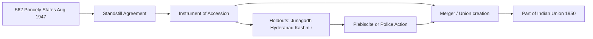

# Sardar Patel — Integration of Princely States

> GS-1 · Topic 04 · Unification of India 1947–65 — Patel, Menon, accession, Operation Polo, Goa

---

## PYQs

| Year | M | Words | Question (EN) | प्रश्न (HI) | ID |
|------|---|-------|---------------|-------------|-----|
| 2025 | 12 | 200 | Critically analyse the role of Sardar Vallabhbhai Patel in the Unification of India after Independence. | स्वतन्त्रता पश्चात् भारत के एकीकरण में सरदार पटेल की भूमिका का आलोचनात्मक विश्लेषण कीजिए। | Q1 |
| 2023 | 8 | — | Discuss the role of Sardar Patel in the unification of India after independence. | स्वतंत्रता प्राप्ति के उपरांत भारत के एकीकरण में सरदार पटेल की भूमिका की विवेचना कीजिए। | Q2 |
| 2018 | 8 | 125 | Explain the role of Sardar Vallabhbhai Patel in the integration of Princely States of India. | सरदार वल्लभभाई पटेल की भारतीय रियासतों के विलीनीकरण में भूमिका को स्पष्ट कीजिए। | Q3 |

---

## Quick Revision

```
PATEL (1875–1950): "Iron Man of India" · Home Minister + Minister of States (1947–50)
  Partner: V.P. Menon (Secretary, States Department) · Mountbatten (transition diplomacy)

CONTEXT Aug 1947:
  562 princely states · ~40% area · ~23% population · Paramountcy LAPSED (not transferred to India)
  British provinces → India/Pakistan · Rulers theoretically free → Patel integrated into Indian Union

POLICY TOOLS:
  1 Standstill Agreements (Aug 1947) — interim status quo
  2 Instrument of Accession (IoA) — defence, foreign affairs, communications to Dominion
  3 Merger / integration — smaller states into unions (Rajasthan, PEPSU, Saurashtra, Madhya Bharat)
  4 Plebiscite — Junagadh (Feb 1948 → India)
  5 Police action — Hyderabad Operation Polo (Sept 1948)

KEY CASES:
  Junagadh — Muslim ruler acceded Pakistan Oct 1947 · Indian blockade · plebiscite 1948 → India
  Kashmir — Maharaja Hari Singh IoA Oct 1947 · Pakistan invasion · UN/ war 1947–48 · UNRESOLVED
  Hyderabad — Nizam delayed · Razakars · Operation Polo 13–18 Sept 1948 · annexed
  Travancore — initial independence talk (CP Ramaswami) · acceded later
  Bhopal, Jodhpur — hesitation · Patel-Menon persuasion

CHRONOLOGY:
  July 1947 States Department · 15 Aug Independence · Nov 1947 Junagadh issue peaks
  Jan 1948 Gandhi assassination · Feb 1948 Junagoth plebiscite · Sept 1948 Hyderabad
  1949–50 major mergers · Patel died 15 Dec 1950 · Goa Portuguese till Dec 1961 (Operation Vijay)

SIGNIFICANCE: Prevented Balkanisation · single map for Republic 1950 · Art 1 "Union of States"
LIMITS (critical): Kashmir unfinished · force in Hyderabad criticized · Menon operational credit
  Privy purses abolished 1971 (post-Patel) · some accession terms debated (Art 370 era)

TRAPS: Patel ≠ sole actor (Menon, Mountbatten, Nehru) | 562 ≠ all by same method
  IoA ≠ full merger immediately | Hyderabad 1948 not 1947 | Goa 1961 not Patel (died 1950)
  Integration ≠ identical to present state boundaries (reorganisation 1956 later)
```

---

## Content

### Context — why integration was existential (1947)

When India became independent on 15 August 1947, British paramountcy over 562 princely states did not pass to the new Dominion—it simply lapsed. Overnight, rulers who had owed allegiance to the Crown became legally sovereign over territories covering roughly 40 percent of the subcontinent's area and 23 percent of its population. British India itself had been partitioned into the Dominions of India and Pakistan, so the political map that emerged at midnight was fragmented in three directions at once: two new nation-states, hundreds of theoretically independent princely kingdoms, and European colonial pockets still held by Portugal and France.

The Congress leadership had spent decades imagining a united, secular, democratic India. That vision could not survive if princes chose independence, acceded to Pakistan against local demographic realities, or bargained endlessly while central authority remained hollow. Balkanisation was not a distant fear—it was the default legal outcome of independence unless someone built a new framework of accession from scratch. Sardar Vallabhbhai Patel, as Deputy Prime Minister, Home Minister, and Minister of States, supplied the political will and final authority for that project. V.P. Menon, Secretary of the newly created States Department (July 1947), supplied the legal drafts, negotiation maps, and phased merger plans. Lord Mountbatten, as Governor-General, lent transitional leverage through personal persuasion of princes who still respected imperial ceremony. The Patel–Menon partnership—not Patel alone—became the operational core of unification.

What made the crisis acute was timing. Partition had already unleashed refugee flows and communal violence; the army was split with Pakistan; food and currency systems were under strain. A protracted standoff with Hyderabad or Kashmir could paralyse defence planning and foreign policy before the Constituent Assembly finished its work. Integration was therefore not a secondary administrative task—it was the condition under which a single Union could hold elections, write a constitution, and speak with one voice internationally.

### Legal instruments — how accession worked

Because paramountcy had lapsed rather than transferred, accession could not rest on inherited treaty law alone. Menon and constitutional advisers devised a ladder of instruments, each step transferring more sovereignty while giving rulers time to save face and income.

| Instrument | Purpose | Key subjects transferred to Dominion |
|------------|---------|--------------------------------------|
| **Standstill Agreement (Aug 1947)** | Interim status quo—existing services and arrangements continue pending final decision | No full accession yet; buys time and prevents administrative vacuum |
| **Instrument of Accession (IoA)** | Ruler accedes to Dominion of India as a bilateral act under the Indian Independence Act 1947 | Defence, foreign affairs, and communications—the three "central" subjects |
| **Merger Agreement (1948–50)** | Full integration—ruler cedes remaining sovereignty | State becomes part of Indian Union; privy purse and titles often guaranteed |
| **Integration Agreement** | Gradual absorption into provinces or unions of states | Administrative unification while preserving interim autonomy on local subjects |

The Instrument of Accession was signed by the ruler and accepted by the Governor-General, functioning as a treaty. It ceded only three subjects; all others—taxation, police, land revenue, education—remained with the state until merger. This is why signing an IoA in August 1947 did not mean immediate disappearance of the princely state from the map. Most rulers who acceded early entered a hybrid phase: Indian control of defence and external relations, local dynastic administration otherwise, followed by merger into unions or provinces between 1948 and 1950.

Article 1 of the Constitution (1950)—"India, that is Bharat, shall be a Union of States"—was the legal culmination of this process. Part B of the original constitution listed princely territories; the States Reorganisation Act (1956) later redrew boundaries on linguistic lines, but sovereignty had already been unified under Patel's watch. The staged design—IoA first, merger second—reduced the risk of simultaneous revolt across Rajputana and central India by sequencing concessions (privy purses, gun salutes, titles) alongside central control.



### Patel's strategy — persuasion, pressure, and force

Patel's method combined moral appeal, legal clarity, economic pressure, and selective coercion. He wrote personally to rulers, warning that popular movements inside their states would sweep them aside if they did not accede voluntarily. The All-India States' Peoples Conference amplified democratic pressure from below. Privy purse guarantees and retention of ceremonial privileges served as carrots; the blockade of Junagadh and police action in Hyderabad proved that the Dominion would not tolerate indefinite delay.

**Phase 1 — Diplomatic consolidation (August–December 1947).** The majority of rulers signed Standstill Agreements and then Instruments of Accession between August and November 1947. Travancore, whose Dewan C.P. Ramaswami Iyer had briefly explored separate independence, acceded in July 1947 after Patel–Menon pressure and internal agitation. Bhopal, Indore, and Jodhpur, among others, hesitated but yielded to firm diplomacy backed by Congress networks in their states.

**Phase 2 — Problem states.** Four cases tested whether law and negotiation alone could finish the map.

| State | Problem | Patel's response | Outcome |
|-------|---------|------------------|---------|
| **Junagadh (Kathiawar)** | Muslim Nawab acceded to Pakistan (15 Sept 1947) despite Hindu majority and geographic contiguity with India | Economic blockade; Provisional Government (Arzi Hukumat) under Samaldas Gandhi; plebiscite | February 1948 plebiscite—over 99% for India |
| **Kashmir** | Maharaja Hari Singh undecided; Pathan tribal invasion from Pakistan (Oct 1947) | IoA signed 26 Oct 1947; Indian troops airlifted to Srinagar; Sheikh Abdullah's National Conference supported accession | Acceded to India but dispute with Pakistan—UN involvement, 1947–48 war, Line of Control—unfinished |
| **Hyderabad (Deccan)** | Nizam Osman Ali sought independence; Razakar militia (Qasim Razvi) committed atrocities | Negotiations failed; Operation Polo (13–18 Sept 1948)—police action by Indian Army under Gen. J.N. Chaudhari | Annexed as Hyderabad State; later merged into Andhra Pradesh (1956) |
| **Travancore** | Dewan explored separate independence | Patel–Menon pressure plus popular agitation | Acceded July 1947 |

**Phase 3 — Structural merger (1948–1950).** Small and medium states were grouped into unions to make administration viable: Saurashtra (Kathiawar peninsula), Rajasthan (Rajputana—Jodhpur, Jaipur, Udaipur, Bikaner, among others), Madhya Bharat (Gwalior, Indore, Malwa), Vindhya Pradesh (Bundelkhand cluster, later merged into Madhya Pradesh in 1956), PEPSU (Patiala, Kapurthala, Faridkot in Punjab), and Travancore–Cochin (1949, precursor to Kerala). By Patel's death on 15 December 1950, princely integration was largely complete except for Kashmir's special constitutional status and territories still held by European powers.

### V.P. Menon and Mountbatten — shared credit

Patel held political authority—final decisions on force, coordination with Nehru and the Congress Working Committee, and the moral weight to overrule hesitation. Menon drafted the Instrument of Accession, negotiated with rulers room by room, and designed the merger roadmap recorded in his memoir *The Integration of Indian States* (1956). Mountbatten persuaded princes who still responded to viceregal prestige and supplied the Standstill template at the moment of transfer. Nehru, as Prime Minister, shaped Kashmir's internationalisation through UN reference and was sometimes more cautious about visible force than Patel—historians note tension over Hyderabad's timing, though both agreed on non-fragmentation as the goal.

| Actor | Role |
|-------|------|
| **Sardar Patel** | Political authority, final decisions, approval of Operation Polo, coordination with Congress |
| **V.P. Menon** | Drafted IoA and merger agreements, negotiated with rulers, designed phased integration |
| **Lord Mountbatten** | Governor-General—persuaded hesitant princes, Standstill template, transition diplomacy |
| **Jawaharlal Nehru** | PM—Kashmir foreign policy, UN reference; more cautious on force than Patel in some accounts |

Crediting Patel's indispensability does not require erasing Menon's operational genius or Mountbatten's transitional role. The integration was a collaborative architecture, not a one-man show.

### Kashmir — integration success and limit

Kashmir illustrates both Patel's decisiveness and the limits of territorial unification. Maharaja Hari Singh signed the Instrument of Accession on 26 October 1947 after tribal invaders supported from Pakistan entered the state. Indian troops were airlifted to Srinagar; Sheikh Abdullah and the National Conference supported accession to secular India rather than communal Pakistan. Patel secured the legal fact of accession—the same three-subject IoA other states used—but Nehru's decision to take the dispute to the United Nations internationalised it. The first Indo-Pak war (1947–48) ended with a ceasefire in January 1949 and a Line of Control that divided the former princely state. Kashmir remained India's most complex integration challenge: acceded in law, contested in diplomacy and on the ground, and governed for decades through asymmetric arrangements (Article 370 until its abrogation in 2019) that reflected the original conditions of accession under war.

### Hyderabad — Operation Polo (1948)

Hyderabad was the largest princely state—a wealthy Nizam ruling over a predominantly Hindu population who sought union with India. The Nizam delayed accession, funded the Razakar militia led by Qasim Razvi, and tolerated communal violence and economic blockade of Indian territory. After standstill violations and failed negotiations, Patel ordered police action. Between 13 and 18 September 1948 the Indian Army under General J.N. Chaudhari entered the state and ended Nizam's rule. The operation removed the biggest secessionist threat on the Deccan plateau and unified the peninsula administratively, but it also drew criticism for human cost. The Sundarlal Report on post-action violence remained unreleased for decades, fuelling debate about whether alternatives short of force existed. Patel's pragmatism here was clear: unity trumped pure pacifism when negotiations collapsed.

### Junagadh — plebiscite model

Junagadh followed a different path. Nawab Muhammad Mahabat Khanji acceded to Pakistan on 15 September 1947 even though the state was geographically surrounded by Indian territory and had a Hindu majority. India rejected the accession as absurd, imposed an economic blockade, and recognised a Provisional Government (Arzi Hukumat) led by Samaldas Gandhi. A plebiscite on 20 February 1948 returned an overwhelming vote for India—over 99 percent—providing democratic legitimacy that Hyderabad's military integration lacked. Junagadh became the model for resolving ruler choices that contradicted geography and demography; Kashmir, by contrast, was resolved initially through accession under invasion, not plebiscite.

### Major unions, milestones, and European enclaves

| Union / entity | Constituent princely states (examples) | Significance |
|----------------|----------------------------------------|--------------|
| **Saurashtra** | Kathiawar peninsula states | Western India consolidation |
| **Rajasthan (Rajputana)** | Jodhpur, Jaipur, Udaipur, Bikaner | Largest union by area—patient negotiation |
| **Madhya Bharat** | Gwalior, Indore, Malwa | Central India integration |
| **Vindhya Pradesh** | Bundelkhand princely cluster | Later merged into Madhya Pradesh (1956) |
| **PEPSU** | Patiala, Kapurthala, Faridkot | East Punjab Sikh states |
| **Travancore–Cochin** | 1949 merger | South Indian union—later Kerala (1956) |

| Milestone | Year | Note |
|-----------|------|------|
| States Department created | July 1947 | Patel–Menon machinery begins |
| Major princely accession | 1947–48 | IoA wave and standstills |
| Hyderabad annexed | 1948 | Operation Polo |
| Constitution commencement | 26 Jan 1950 | "Union of States" (Art 1) |
| Patel's death | 15 Dec 1950 | Integration largely done |
| States Reorganisation Act | 1956 | Linguistic states—reorganisation, not secession |
| Goa liberation (Operation Vijay) | 19 Dec 1961 | Portuguese exit—after Patel's death |
| Privy purses abolished | 1971 (26th Amendment) | End of princely privileges |

Patel nearly completed princely integration, but European enclaves remained. Goa, Daman, and Diu stayed Portuguese until Operation Vijay in December 1961; Pondicherry, Karaikal, Yanam, and Mahe transferred from France by 1962 (Chandernagore earlier, in 1951). Sikkim remained a protectorate until its merger in 1975. These cases show that territorial consolidation continued after Patel, though the princely-state problem—the core of his ministry—was essentially solved by 1950.

### Integration models and significance

| Model | Example | When used |
|-------|---------|-----------|
| Voluntary IoA + gradual merger | Most Rajputana and Central India states | Default preferred path |
| Plebiscite after provisional government | Junagadh (1948) | Ruler acceded to wrong dominion |
| Police action / military integration | Hyderabad (1948) | Last resort when negotiations failed |
| Accession under war conditions | Kashmir (1947) | Invasion forced IoA—internationalised |
| Negotiation with European power | Goa (1961) | Post-Patel—not princely model |

Unlike Bismarck's wars of German unification, Patel mixed law (IoA), diplomacy (Menon), economic pressure, and limited force—a federal compromise that bought princely loyalty with privy purses while building a single market and defence establishment. The significance was structural: a single Union could hold general elections (1951–52), enact a constitution, and project unified foreign policy. Hyderabad and Junagadh prevented communal enclaves aligned with Pakistan or perpetual independence. Railways, currency, and communications came under one centre. The 1950 map differed from the 1956 map, but sovereignty was unified—a prerequisite for the Republic.

The IoA model also carried a democratic deficit: popular consent was not mandatory in the instrument's text; integration was ruler-led except where plebiscite followed (Junagadh). Jammu and Kashmir's IoA included special conditions that later became Article 370— asymmetric federalism rooted in 1947. Privy purses guaranteed in merger agreements preserved feudal compromise until abolition in 1971.

### Contemporary relevance

The Statue of Unity at Kevadia, Gujarat—the world's tallest statue—commemorates Patel as national integrator and anchors a tourism circuit tied to Rashtriya Ekta Diwas (31 October, his birth anniversary), observed since 2014. Articles 1–4 of the Constitution enshrine the "Union of States"—the legal legacy of 1947–50 integration. The Jammu and Kashmir Reorganisation Act (2019) reopened public debate over the 1947 accession and special status, showing how unfinished Kashmir remains politically live. North-eastern integration (Naga, Mizo, and other movements) continued long after Patel; his era started consolidation but did not complete it everywhere. Article 51A(c) casts unity of the nation as a fundamental duty—a constitutional echo of the integration ethic Patel embodied.

### Limits

Kashmir remains the clearest limit: IoA secured in October 1947, but dispute with Pakistan persists—not full unification in the lived sense. Hyderabad's force carried human cost and alternatives remain debated. Menon's role is underplayed in popular memory compared with Patel, though historiography credits the duo. Some scholars argue Mountbatten and British advisers shaped IoA terms, so negotiation was not wholly indigenous. Privy purses bought princely loyalty—a patriarchal compromise reversed only in 1971. Goa stayed Portuguese for fourteen years after independence. Northeastern and tribal belts required ongoing integration beyond 1950. Democratic consent was uneven—ruler-centric accession without mass plebiscite in most states. Patel was indispensable and largely successful, yet critical analysis must acknowledge unfinished Kashmir, coercive episodes, collaborative architecture, and the long tail of territorial consolidation after his death.

---

## Answers

### Q1: Critically analyse the role of Sardar Vallabhbhai Patel in the Unification of India after Independence. (2025, 12M, 200W)

**Opening:**
> Sardar Patel, as Home and States Minister (1947–50), led the political integration of 562 princely states into the Indian Union — combining diplomacy, legal instruments, and selective force to prevent Balkanisation, though with unresolved limits in Kashmir and contested methods in Hyderabad.

**Write these points:**
- **Context:** **Paramountcy lapsed Aug 1947** — **~40% territory** at risk; **Patel-Menon States Department** created **Standstill Agreements** and **Instrument of Accession (defence, foreign affairs, communications)**.
- **Diplomatic success:** **Most rulers acceded 1947** through **persuasion, privy purse guarantees**, **Mountbatten's leverage** — **mergers into unions (Rajasthan, PEPSU, Saurashtra)**.
- **Decisive cases:** **Junagadh plebiscite (Feb 1948)** after **Pakistan accession rejected**; **Hyderabad Operation Polo (Sept 1948)** ended **Razakar threat**; **Kashmir IoA (Oct 1947)** during **invasion**.
- **Significance:** **Single Union for 1950 Constitution (Art 1)** — **avoided fragmentation** — **"Iron Man"** narrative of **national unity**.
- **Critical limits:** **Kashmir dispute unfinished**; **Hyderabad force — human rights concerns**; **Menon/Mountbatten shared credit**; **ruler-centric IoA, not mass plebiscite everywhere**; **Goa freed only 1961**.

**Conclusion:**
> Patel's integration was indispensable and largely successful — yet critical analysis must acknowledge unfinished Kashmir, coercive episodes, and the collaborative Patel-Menon architecture behind India's unified map.

---

### Q2: Discuss the role of Sardar Patel in the unification of India after independence. (2023, 8M)

**Opening:**
> After Independence, Sardar Patel as Minister of States orchestrated the accession and merger of princely states — transforming a fragmented subcontinent into the Union of India through legal accession and firm statecraft.

**Write these points:**
- **Problem:** **562 princely states** with **lapsed paramountcy** — **threat of Balkanisation**.
- **Methods:** **Standstill Agreements**, **Instrument of Accession**, **merger into unions**, **plebiscite (Junagadh)**, **police action (Hyderabad 1948)**.
- **Partnership:** **V.P. Menon** negotiated; **Mountbatten** assisted transition.
- **Key outcomes:** **Hyderabad, Junagadh, Kashmir accession**; **majority states merged by 1950**.
- **Legacy:** **Enabled Constitution and democratic elections** on **unified territory**.

**Conclusion:**
> Patel's role was central to India's territorial unity — the foundation on which the Republic of India was built.

---

### Q3: Explain the role of Sardar Vallabhbhai Patel in the integration of Princely States of India. (2018, 8M, 125W)

**Opening:**
> Sardar Patel integrated over 500 princely states into India after 1947 through accession instruments, negotiations, and when necessary, military action — securing a united India for the new Dominion.

**Write these points:**
- **Minister of States** with **V.P. Menon** — **IoA on defence, foreign affairs, communications**.
- **Most states acceded peacefully 1947**; **Junagadh resolved by plebiscite 1948**.
- **Hyderabad integrated via Operation Polo (1948)** after **Razakar violence**.
- **Kashmir IoA (Oct 1947)** during **Pakistani invasion**.

**Conclusion:**
> Patel's firm diplomacy and decisive action on holdouts made princely integration the crowning achievement of post-Independence consolidation.

---

### Q4: *Likely:* Discuss the contribution of V.P. Menon in the integration of princely states. (Future variant, 8M, 125W)

**Opening:**
> V.P. Menon, as Secretary of the States Department under Sardar Patel, was the chief architect of accession negotiations and merger plans that integrated 562 princely states into India.

**Write these points:**
- **Drafted Instrument of Accession** and **merger agreements** — **operational brain to Patel's political authority**.
- **Negotiated with rulers** — **phased integration roadmap** — **unions like Rajasthan, PEPSU**.
- **Handled Junagadh, Kashmir, Hyderabad files** alongside Patel.
- **Authored *The Integration of Indian States* (1956)** — **primary source**.

**Conclusion:**
> Menon's administrative genius complemented Patel's leadership — together they achieved India's territorial unification.

---

## Traps

| Wrong | Correct |
|-------|---------|
| Patel integrated all 562 states alone | **Patel + V.P. Menon + Mountbatten** — **team effort** |
| Instrument of Accession = full merger immediately | **IoA = 3 subjects first** — **full merger later (1948–50)** |
| All states joined peacefully | **Hyderabad = Operation Polo (1948)** — **force used** |
| Junagadh acceded to India voluntarily | **Nawab acceded to Pakistan first** — **plebiscite Feb 1948** reversed it |
| Kashmir fully integrated in 1947 | **IoA signed Oct 1947** — **war, LOC, long dispute** — **special status history** |
| Patel liberated Goa | **Goa = Operation Vijay Dec 1961** — **Patel died 1950** |
| Paramountcy transferred to India automatically | **Paramountcy LAPSED** — **Patel created new legal accession** |
| Hyderabad integrated in 1947 | **Operation Polo September 1948** |
| Integration finished exactly on 15 Aug 1947 | **Process continued till 1950+** — **1956 linguistic reorganisation later** |
| Privy purses ended with Patel | **Guaranteed in merger** — **abolished 1971 (26th Amendment)** |
| Standstill Agreement = permanent accession | **Interim only** — **pending IoA/merger** |
| Travancore never threatened secession | **CP Ramaswami explored independence** — **later acceded** |
| Sikkim integrated by Patel | **Sikkim = protectorate** — **merged 1975** — **outside Patel phase** |
| All princes happily volunteered merger | **Many needed pressure** — **privy purse carrot essential** |

---

*Complete.*
