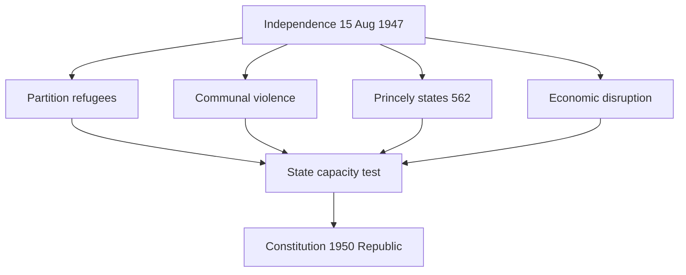

# Post-1947 Challenges — Immediate After Independence

> GS-1 · Topic 04 · Refugees, Partition, economy, princely states, Constitution, 1947–48 war (till 1965 frame)

---

## PYQs

| Year | M | Words | Question (EN) | प्रश्न (HI) | ID |
|------|---|-------|---------------|-------------|-----|
| 2024 | 8 | 125 | Give an account of the challenges faced by India immediately after Independence. | स्वतंत्रता के तुरंत बाद भारत के समक्ष चुनौतियों का लेखा-जोखा प्रस्तुत कीजिए। | Q1 |

---

## Quick Revision

```
IMMEDIATE CHALLENGES (Aug 1947 – ~1950):
  1 PARTITION & REFUGEES — ~10–14 million displaced · communal riots · Punjab/Bengal bloodshed
     Hindu-Sikh west → India · Muslims east → Pakistan · camps · rehabilitation · minority insecurity

  2 COMMUNAL VIOLENCE — Delhi, Punjab, Bengal massacres · Gandhi's peace missions (died 30 Jan 1948)
     State had to restore law and order · integrate divided society

  3 PRINCELY STATES — 562 states · paramountcy lapsed · Balkanisation risk
     → Patel-Menon integration (see 04.1): Junagadh · Kashmir · Hyderabad

  4 KASHMIR & FIRST WAR — IoA Oct 1947 · tribal invasion · 1947–48 Indo-Pak war · UN ceasefire · LOC

  5 ECONOMIC — Partition of assets/liabilities · British war debt share · food shortage · inflation
     Refugee burden · ruined industries in Punjab · zamindari/agriculture disruption

  6 ADMINISTRATIVE — New Dominion machinery · Constituent Assembly framing Constitution
     Integration of ICS · refugee ministries · law and order with limited police/military

  7 CONSTITUTION-MAKING — Dec 1946 – Nov 1949 draft · 26 Jan 1950 Republic · unity in diversity

  8 MINORITIES & NATIONAL UNITY — Muslim minority in India · Scheduled Castes/Tribes integration
     Linguistic diversity · demand for language states (seed of 1956)

  9 FOREIGN POLICY START — Non-Alignment seed · Pakistan hostility · China on horizon

CONTEMPORARY: Partition Horrors Remembrance Day (14 Aug) · Citizenship debates · Art 1 Union
  Refugee rehabilitation legacy in Punjab/Delhi/Bengal demographics

TRAPS: Challenges ≠ only economic | "Immediate" = 1947–50 not 1962 China war primarily
  Partition violence both sides · Patel integration = challenge AND response
  Constitution not ready on 15 Aug 1947 — Dominion first
```

---

## Content

### Context — what "immediately after Independence" means

India at midnight on 15 August 1947 was free but unfinished. It was a Dominion under the British Crown—not yet the Republic proclaimed on 26 January 1950—governed through adapted imperial institutions while a Constituent Assembly still debated fundamental law. Freedom arrived fused with Partition: two states were born from one colony, and the border drawn by Cyril Radcliffe in Punjab and Bengal became one of the bloodiest human frontiers of the twentieth century. The "immediate" post-independence period therefore spans roughly 1947 to 1950—the years when survival, unity, and constitutional identity had to be secured simultaneously, before longer crises such as the 1962 war with China or the 1965 war with Pakistan matured.

Understanding this phase requires seeing challenges as interconnected. Refugee flows strained food and finance; communal violence threatened the secular pledge Nehru voiced; princely fragmentation threatened defence; Kashmir pulled a newborn army into war while civil servants were still changing letterheads. The new state had to absorb trauma and build institutions at once—a test of capacity rare in modern history.

### Challenge 1 — Partition and refugee crisis

Partition displaced an estimated ten to fourteen million people—the largest recorded migration—and killed hundreds of thousands in communal violence. Punjab and Bengal were bisected along lines drawn in haste; Hindu and Sikh families fled westward from Pakistani Punjab while Muslims moved east from India; Bengal saw parallel movements and massacres in Noakhali, Kolkata, and across the eastern border.

| Aspect | Detail |
|--------|--------|
| **Scale** | Est. 10–14 million displaced—largest migration in recorded history |
| **Geography** | Punjab and Bengal bisected—Radcliffe Line (August 1947)—hasty and controversial |
| **Direction** | Hindus/Sikhs from West Punjab → India; Muslims from east → Pakistan |
| **Violence** | Massacres, abductions, looting on both sides—trains attacked |
| **State response** | Refugee camps, Evacuee Property Acts, Ministry of Rehabilitation |
| **Legacy** | Demographic transformation—Punjab refugee enterprise, Delhi expansion |

The Indian state responded with camps, the Ministry of Rehabilitation, Evacuee Property legislation to manage abandoned homes and shops, the East Punjab Refugees Act (1948) for land allotment, and planned townships such as Lajpat Nagar and Rajinder Nagar in Delhi. Exchange-of-population agreements with Pakistan were attempted but incompletely implemented. Over decades, refugees became entrepreneurs and professionals who reshaped Delhi, Haryana, and Punjab—but in 1947–48 the crisis was fiscal, humanitarian, and political all at once. Partition was simultaneously liberation and trauma, testing whether the state could restore order and belonging.

### Challenge 2 — Communal violence and national unity

Communal riots that had erupted from 1946—in Noakhali, Rawalpindi, Lahore, and elsewhere—continued into independence. September 1947 saw severe violence in Delhi against Muslim neighbourhoods; curfews and police action could contain but not heal fear. Muslims who remained in India (roughly 10–12 percent of the population) faced migration pressure and insecurity even as the leadership pledged secular citizenship—a pledge later encoded in Articles 14 and 15 of the Constitution.

Mahatma Gandhi, holding no office, undertook peace missions and a fast in Delhi in January 1948 demanding protection for Muslims, restoration of mosques, and honouring financial obligations to Pakistan. His assassination on 30 January 1948 by Nathuram Godse removed the moral arbiter who had restrained mass sentiment; the state alone now bore the burden of unity. Building secular democratic nationalism after a partition defined by religion was the defining social challenge of the era—without success, India could not claim moral distinction from the communal logic of Partition itself.

### Challenge 3 — Integration of princely states

British paramountcy over 562 princely states lapsed at independence, leaving rulers legally sovereign over some 40 percent of territory. Travancore, Hyderabad, Bhopal, Junagadh, and Kashmir among others contemplated independence or accession to Pakistan. Without integration, India faced Balkanisation—565 or more fragments when European enclaves are counted—making defence, railways, and a single market impossible.

Sardar Patel and V.P. Menon answered with Standstill Agreements, Instruments of Accession, mergers into unions (Rajasthan, PEPSU, Saurashtra), plebiscite in Junagadh, and Operation Polo in Hyderabad (1948). This was both a challenge and a response: the princely question threatened territorial integrity; Patel-Menon statecraft resolved most of it by 1950. Kashmir and northeastern regions remained partially unsettled, but the core map was secured in time for the Republic.



### Challenge 4 — Kashmir and external security (1947–48)

Maharaja Hari Singh of Kashmir delayed accession until a Pathan tribal invasion from Pakistan in October 1947 forced his hand. He signed the Instrument of Accession to India on 26 October; Indian troops were airlifted to Srinagar. The first Indo-Pak war (1947–48) followed, ending with UN mediation and a ceasefire in January 1949 that left a Line of Control dividing the former princely state. India had to fight a war while building civilian institutions—a defence challenge layered on every domestic crisis above. Kashmir remained unsettled for decades, anchoring hostile relations with Pakistan rooted in Partition.

### Challenge 5 — Economic and food challenges

Colonial India bequeathed an extractive, partially deindustrialised economy; Partition then split assets, industries, railways, and cash reserves between India and Pakistan, provoking bitter negotiations. Food shortages from 1946–47 famine conditions and disrupted supply lines forced imports and rationing pressure. War-economy inflation and refugee demand raised urban living costs. Rehabilitation of millions imposed fiscal burdens on a treasury already weak.

| Problem | Cause | Impact |
|---------|-------|--------|
| Partition of assets | British India split—industries, railways, cash divided | Negotiations with Pakistan—persistent tension |
| Food shortage | 1946–47 famine conditions, disrupted supply lines | Import dependence, rationing |
| Inflation | War economy legacy, refugee demand | Urban cost-of-living rise |
| Refugee rehabilitation | Millions to resettle | Fiscal burden on new state |
| Deindustrialisation legacy | Colonial economic structure | Planning discourse → Planning Commission (1950) |

Building a self-sustaining economy from this base required more than relief—it required a planning vision that crystallised in the Planning Commission (1950) and Nehruvian development strategy, but the immediate years were about stabilisation and survival.

### Challenge 6 — Administrative and constitutional tasks

Dominion status meant Governor-General Mountbatten and Prime Minister Nehru operated through adapted British apparatus while the Constituent Assembly (convened December 1946) continued its work. The draft Constitution was adopted on 26 November 1949 and came into force on 26 January 1950, transforming India into a Republic. Debates over federalism, minority rights, language policy, property, and fundamental rights ran parallel to princely integration. The Indian Civil Service transitioned toward IAS/IPS; many Muslim officers left for Pakistan, creating vacancies filled by hurried promotion. Universal adult franchise—chosen for the first general election of 1951–52—posed a logistical challenge of staggering scale for a largely illiterate electorate. Constitution-making and election preparation were not background tasks; they were how the state legitimised its claim to represent everyone it governed.

### Challenge 7 — Social and regional diversity

Independence did not dissolve social hierarchy or regional difference—it intensified political claims. B.R. Ambedkar ensured constitutional safeguards for Scheduled Castes and Tribes and the abolition of untouchability (Article 17). Linguistic diversity produced early demands for states based on language—seeds visible by 1947, erupting in Potti Sriramulu's fast for Andhra in 1952. Tribal and northeastern regions saw incomplete integration; Naga unrest began in the late 1940s. Debates over Hindu Code Bills continued social reform from the colonial era, touching women's property and marriage rights. Holding "unity in diversity" was not rhetoric alone—it was an active negotiation under stress.

### Challenge 8 — Foreign relations beginning

Pakistan emerged as a hostile neighbour bound to India by Partition disputes—Kashmir immediately, Indus waters later. Nehru's refusal to join Cold War blocs planted the seed of Non-Alignment, formalised later at Bandung (1955). The Chinese revolution of 1949 raised border questions that would become acute by 1962—beyond the immediate 1947–50 window but visible on the horizon. Foreign policy at birth was defensive and principled: secure borders, avoid bloc entanglement, and claim moral leadership in a decolonising world while still dependent on food imports and refugee aid. Nehru's broadcast on independence night promised that India would speak to all nations in freedom's voice—but that voice had to be backed by rice imports and functioning ministries in the same week refugees arrived in Delhi camps.

### Institutional responses and material continuity

| Challenge | Response (1947–50) |
|-----------|---------------------|
| Refugees | Camps, rehabilitation, Evacuee Property laws, East Punjab Refugees Act |
| Communalism | Police, curfew, Gandhi's peace mission, secular Constitution framing |
| Princely states | Patel–Menon accession, mergers, Operation Polo |
| Kashmir war | Military defence, UN diplomacy, ceasefire 1949 |
| Economy | Food imports, currency consolidation, planning discourse |
| Governance | Constituent Assembly → Republic 1950, election preparation |

Indian Union banknotes from August 1947 pursued monetary continuity across acceding states. The British Indian Army split with Pakistan, leaving officer shortages just as Kashmir demanded deployment. Railways and telegraph lines severed by Partition required urgent rerouting. Rupee, rail, army, and bureaucracy were the skeleton of the state; without them, refugee camps and constitutional debates could not function. The Constituent Assembly's debates on fundamental rights and federal structure proceeded while Patel integrated states and the army fought in Kashmir—proof that nation-building was simultaneous warfare, law-making, and humanitarian relief, not sequential phases.

| Measure | Purpose |
|---------|---------|
| Ministry of Rehabilitation | Central coordination of refugee resettlement |
| Evacuee Property Acts | Manage abandoned property—prevent legal chaos |
| East Punjab Refugees Act (1948) | Land allotment to Punjabi refugees |
| Integrated townships | Delhi colonies (Lajpat Nagar, Rajinder Nagar) |
| Exchange agreements | Minority protection with Pakistan—incomplete |

### Contemporary relevance

Partition Horrors Remembrance Day (14 August), declared in 2021, institutionalises memory of 1947 trauma. Citizenship Amendment Act debates (2019) reconnect public discourse to Partition-era refugee narratives. Article 1's "Union of States" embodies the answer to 1947 fragmentation. Contemporary refugee policy occasionally draws parallels—imperfect but instructive—to 1947 rehabilitation. India–Pakistan relations remain rooted in Partition and Kashmir. Gandhi's final fast and assassination remind citizens that communal peace requires active protection, not assumption.

### Limits

Not all challenges were solved by 1950—poverty, literacy, and public health persisted for decades. Partition violence harmed both communities; historical account must avoid one-sided blame. Patel's integration solved the princely question but not Kashmir or the Northeast fully. The 1962 China war and 1965 Indo-Pak war belong to later phases—they emerged from seeds visible by 1949–50 but were not the central immediate crisis of 1947–48. The state met survival tests—refugees housed, most princes acceded, a constitution adopted—but at enormous human cost and with unresolved fault lines that shape India still.

The Planning Commission (1950) and First Five-Year Plan (1951) lay just beyond the immediate window yet responded directly to 1947 economic dislocation—they institutionalised the lesson that independence without development would fail refugees and citizens alike. Linguistic reorganisation (1956) answered demands audible from 1947, showing how immediate crises seeded medium-term state restructuring. The newborn republic survived its first years, but the human and territorial costs of that survival shaped Indian politics for generations.

---

## Answers

### Q1: Give an account of the challenges faced by India immediately after Independence. (2024, 8M, 125W)

**Opening:**
> Independent India in August 1947 inherited freedom alongside a cascade of crises — Partition, mass refugee influx, communal violence, economic disruption, and the urgent task of integrating princely states into one Union.

**Write these points:**
- **Partition and refugees:** **~10–14 million displaced**; **Punjab/Bengal riots**; **rehabilitation camps** — **social and fiscal strain**.
- **Communalism:** **Hindu-Muslim violence**; **minority insecurity**; **Gandhi's assassination (Jan 1948)** — **unity challenge**.
- **Princely states:** **562 states**, **paramountcy lapsed** — **Balkanisation risk** — **Patel-Menon integration (Junagadh, Hyderabad, Kashmir)**.
- **External security:** **Kashmir invasion 1947**, **Indo-Pak war 1947–48**, **UN ceasefire** — **defence while building state**.
- **Economy:** **Partition of assets**, **food shortage**, **inflation**, **refugee resettlement costs** — **colonial legacy**.
- **Governance:** **Dominion → Republic (1950)** — **Constituent Assembly**, **new Constitution**, **administrative integration**.

**Conclusion:**
> The immediate post-1947 period tested India's state capacity at birth — meeting Partition trauma, territorial consolidation, and economic survival while framing a democratic Constitution.

---

### Q2: *Likely:* How did the Partition of 1947 create administrative and humanitarian challenges for India? (Future variant, 8M, 125W)

**Opening:**
> Partition simultaneously created India and Pakistan but imposed massive humanitarian and administrative burdens on the new Indian state through mass migration and communal violence.

**Write these points:**
- **Humanitarian:** **Millions of refugees**, **camp housing**, **disease, trauma, abducted persons recovery**.
- **Administrative:** **Evacuee Property management**, **new border policing**, **rehabilitation ministries**.
- **Communal:** **Riots in Delhi, Punjab** — **law and order stretched thin**.
- **Long-term:** **Changed demographics** — **Punjab, Delhi, Bengal** permanently reshaped.

**Conclusion:**
> Partition's refugee and communal crisis was among the gravest immediate challenges — shaping India's early social policy and national identity.

---

### Q3: *Likely:* Discuss the economic challenges India faced after Independence till 1950. (Future variant, 8M, 125W)

**Opening:**
> Post-1947 India faced economic dislocation from Partition, food scarcity, and inherited colonial underdevelopment — requiring urgent stabilisation before planning-era growth.

**Write these points:**
- **Partition:** **Division of railways, industries, cash reserves** with **Pakistan** — **negotiation disputes**.
- **Food:** **Shortages and imports** — **famine memory of 1943 Bengal** still fresh.
- **Refugees:** **Resettlement, housing, employment** — **state expenditure surge**.
- **Legacy:** **Deindustrialisation, low literacy** — **Planning Commission (1950)** as institutional response.

**Conclusion:**
> Economic challenges after Independence demanded immediate relief and long-term planning — laying groundwork for Nehruvian development strategy.

---

## Traps

| Wrong | Correct |
|-------|---------|
| India was a Republic on 15 Aug 1947 | **Dominion 1947** — **Republic 26 Jan 1950** |
| Only Pakistan faced refugee crisis | **Both states** — **~10–14 million displaced total** |
| Princely states automatically joined India | **Paramountcy lapsed** — **Patel-Menon negotiated accession** |
| Immediate challenges = only economic | **Political, communal, territorial, external security** equally core |
| Kashmir resolved in 1947 | **IoA Oct 1947** — **1947–48 war**, **LOC**, **long dispute** |
| Gandhi led government after 1947 | **No official role** — **moral peace missions** — **died Jan 1948** |
| Constitution ready before Independence | **Adopted Nov 1949**, **effective Jan 1950** |
| Partition violence only in Punjab | **Bengal (Noakhali, Kolkata), Delhi** also severely affected |
| All princely states integrated by 15 Aug 1947 | **Majority acceded 1947** — **Hyderabad 1948**, **mergers till 1950** |
| 1962 China war = immediate 1947 challenge | **Emerging by 1949–50** — **acute from 1959** — **1962 beyond "immediate"** |
| No ministry for refugees | **Ministry of Rehabilitation established** — **central resettlement policy** |
| Gandhi prevented all post-1947 riots | **Riots occurred** — **Gandhi mitigated Delhi situation** — **assassinated Jan 1948** |

---

*Complete.*
