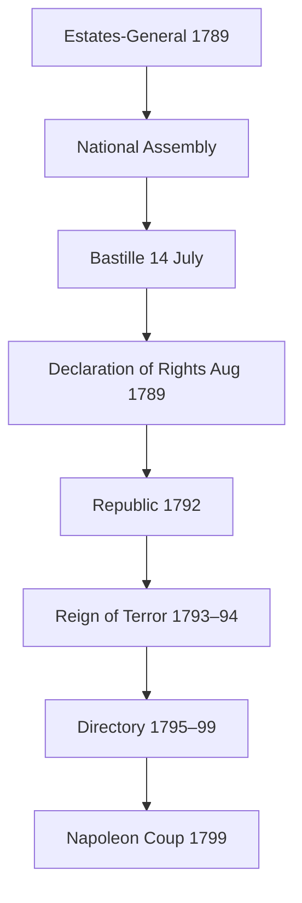

# French Revolution & Napoleon (1789–1815)

> GS-1 · Topic 05 · Enlightenment, 1789 Revolution, Jacobins, Napoleon — forms and societal impact

---

## PYQs

| Year | M | Words | Question (EN) | प्रश्न (HI) | ID |
|------|---|-------|---------------|-------------|-----|
| 2024 | 12 | 200 | "The French Revolution was a great result of enlightenment period." – Comment. | "फ्रांस की क्रांति प्रबोधनकाल का सुफलायन थी।" – टिप्पणी कीजिए। | Q1 |
| 2024 | 8 | 125 | "Napoleon was the son of the Revolution." – Explain. | "नेपोलियन क्रांति का पुत्र था।" – व्याख्या कीजिए। | Q2 |
| 2020 | 12 | 200 | Who were Jacobins? What was their role in the French Revolution? | जैकबिन कौन थे? फ्रांसीसी क्रांति में उनकी क्या भूमिका थी? | Q3 |

---

## Quick Revision

```
PERIOD: Old Regime (Ancien Régime) → 1789 Revolution → 1792 Republic → Terror → Directory → Napoleon → 1815 Waterloo

OLD REGIME PROBLEMS:
  Louis XVI + Marie Antoinette | Estates-General (1789) | 1st Clergy · 2nd Nobility · 3rd Commoners (98% tax burden)
  Financial crisis (American War cost) | Bread riots | Enlightenment critique of privilege

ENLIGHTENMENT → REVOLUTION LINK:
  Voltaire (tolerance, reason) | Rousseau (social contract, general will) | Montesquieu (separation of powers)
  Encyclopedists (Diderot) | Locke (natural rights) | Ideas: liberty, equality, reason vs divine-right monarchy

1789 KEY EVENTS:
  5 May — Estates-General | 17 June — National Assembly | 14 July — Bastille stormed
  4 Aug — feudal privileges abolished | 26 Aug — Declaration of Rights of Man and Citizen
  1791 Constitutional monarchy | 1792 — Republic declared | 1793 — Louis XVI executed

PHASES / GROUPS:
  Girondins (moderates, provinces) vs Jacobins (radicals, Paris sans-culottes)
  Jacobins — Robespierre, Danton, Marat | Club at Jacobin convent | Montagnards in Convention
  Reign of Terror (1793–94) — Committee of Public Safety | Law of Suspects | guillotine
  Thermidor 1794 — Robespierre executed | Directory 1795–99 (5 directors, corrupt, weak)

NAPOLEON (1769–1821):
  Corsican | 1799 Coup of 18 Brumaire → Consulate → 1804 Emperor
  Son of Revolution: Civil Code 1804, meritocracy, ended feudalism, spread revolutionary ideas
  Betrayal of Revolution: crowned himself, restricted press, restored nobility titles, wars of conquest
  1812 Russia disaster | 1814 exile Elba | 1815 Hundred Days → Waterloo (Wellington + Blücher) → St Helena

SOCIETAL IMPACT:
  End feudalism + Church land | secular state trend | nationalism | metric system | women's limited gains then rollback
  Fear in Europe → conservatism (Metternich) | inspired 1830, 1848, later anti-colonial nationalism

CONTEMPORARY: Liberty-Equality-Fraternity → Indian Preamble ethos | UN Human Rights Declaration lineage
  Bastille Day · French Republican values · secularism debates · museum of revolutions worldwide

TRAPS: Revolution ≠ only 1789 one day | Jacobins ≠ only Robespierre from day one
  Napoleon ≠ pure revolutionary OR pure reactionary — BOTH | Bastille ≠ many prisoners (7 only)
  Third Estate ≠ proletariat (included bourgeoisie) | Declaration 1789 ≠ gave women vote
```

---

## Content

### Context — why France exploded in 1789

Eighteenth-century France under Louis XVI (r. 1774–1792) was an absolute monarchy resting on a social order called the Ancien Régime. Society was legally divided into Three Estates. The First Estate—the Catholic clergy—owned roughly ten percent of land and was largely tax-exempt. The Second Estate—the nobility—enjoyed feudal dues, offices, and exemption from most direct taxation. The Third Estate encompassed everyone else: peasants, artisans, urban workers, and the bourgeoisie (lawyers, merchants, officials). The Third Estate paid the taille (land tax), the gabelle (salt tax), and corvée (forced road labour) while carrying the demographic weight of the kingdom—yet in the Estates-General each order counted as one vote, allowing clergy and nobility to outvote the Third every time.

By the 1780s this structure collided with fiscal collapse. French participation in the American War of Independence (1778–83) added to a debt the monarchy could not service. Finance ministers Jacques Necker and Charles Alexandre de Calonne attempted reforms—broader taxation including nobles—but court and privileged orders blocked them. Bad harvests in 1788–89 sent bread prices soaring in Paris and the provinces; sans-culottes (working-class Parisians named for their trousers rather than silk breeches) and starving peasants made hunger political. Meanwhile the Enlightenment (Siècle des Lumières) had undermined the moral authority of privilege, superstition, and arbitrary royal rule. The revolution that followed was therefore neither pure ideas nor pure hunger—it was political breakdown when a state could neither reform nor repress.

### Enlightenment — thinkers, ideas, and link to 1789

The Enlightenment supplied vocabulary and legitimacy for radical change. It did not mechanically cause the Bastille to fall—no philosophe ordered the crowd—but it educated the bourgeois lawyers who led the Third Estate and framed the Declaration of the Rights of Man and of the Citizen (26 August 1789).

| Thinker | Key work / idea | Revolutionary relevance |
|---------|-----------------|-------------------------|
| **Voltaire** (1694–1778) | *Candide*; attack on Church dogma and intolerance | Freedom of thought, religious tolerance—undermined First Estate authority |
| **Montesquieu** (1689–1755) | *Spirit of the Laws* (1748)—separation of powers | Constitutional limits on king; influenced US and French reforms |
| **Jean-Jacques Rousseau** (1712–1778) | *Social Contract* (1762)—"general will", popular sovereignty | National Assembly claimed to represent the nation, not estates |
| **Denis Diderot** | *Encyclopédie* (1751–72) | Spread scientific reason and criticism of feudalism |
| **John Locke** (English) | Natural rights—life, liberty, property | Vocabulary of the Rights of Man |

Enlightenment thought had limits. Many philosophes were elitist; women's rights were largely absent until Olympe de Gouges challenged them in 1791. Voltaire admired "enlightened despots." Ideas that seem moderate today were revolutionary against divine-right monarchy—but they did not extend democracy to women, colonised peoples, or the poorest sans-culottes.

### French Revolution — chronology and phases

| Date | Event | Significance |
|------|-------|--------------|
| **5 May 1789** | Estates-General meets at Versailles | Deadlock over voting—one vote per estate |
| **17 June 1789** | Third Estate declares National Assembly | Claims to represent the nation |
| **20 June 1789** | Tennis Court Oath | Vows not to disperse until constitution written |
| **14 July 1789** | Storming of the Bastille | Symbol of royal tyranny destroyed; only 7 prisoners freed |
| **4 August 1789** | Abolition of feudal privileges | Night of 4 August—dues renounced under pressure |
| **26 August 1789** | Declaration of Rights of Man and Citizen | Liberty, property, security, resistance to oppression |
| **1791** | Constitutional monarchy | Legislative Assembly; Civil Constitution of the Clergy |
| **1792** | First Coalition; 10 August attack on Tuileries | Monarchy collapses |
| **21 Sept 1792** | First French Republic | Universal male suffrage in parts of period |
| **21 Jan 1793** | Execution of Louis XVI | Republic radicalised |
| **1793–1794** | Reign of Terror | ~40,000 executed; counter-revolution suppressed |
| **1794** | Thermidorian Reaction (27 July) | Robespierre guillotined—Terror ends |
| **1795–1799** | Directory | Five-man executive; corruption, war fatigue |
| **9 Nov 1799** | Coup of 18 Brumaire—Napoleon | Consulate replaces radical republic |

The constitutional prelude matters: Estates-General (May 1789), National Assembly (June), and Tennis Court Oath preceded the Bastille. The Great Fear (July–August 1789)—peasant attacks on châteaux and burning of feudal records across the countryside—proved revolution was not a Paris elite affair alone; it forced the Night of 4 August abolition of feudalism. Abbé Sieyès's pamphlet *What Is the Third Estate?* (1789) captured the social grievance: the Third was "everything" in the nation but treated as nothing in politics.

| Cause type | Details |
|------------|---------|
| **Social** | Three Estates—98% in Third paid taxes; nobility/clergy exempt |
| **Economic** | Bankruptcy; American War cost; 1788–89 crop failure → bread riots |
| **Political** | Weak Louis XVI; Estates-General deadlock; Necker dismissed July 1789 |
| **Intellectual** | Enlightenment—rights, reason, popular sovereignty |
| **Immediate** | Bastille 14 July; Great Fear—rural revolution parallel to Paris |



### Jacobins — who they were and their role

Jacobins were members of the Jacobin Club—originally Breton deputies meeting at the Dominican convent of St Jacques ("Jacobins") in Paris—who evolved into the Revolution's most radical political society. Key figures included Maximilien Robespierre, Georges Danton, Jean-Paul Marat (*L'Ami du peuple*), Louis Antoine de Saint-Just, and Camille Desmoulins. In the National Convention (1792–95), Jacobin Montagnards ("the Mountain") fought Girondins—moderates from the Gironde who favoured provincial federalism and feared Parisian mob power.

Jacobins pushed republicanism when Girondins still hesitated over abolishing monarchy; they executed Louis XVI in January 1793. Under the Committee of Public Safety (1793), they centralised revolutionary government through representatives on mission, the levée en masse (mass conscription—the first modern total-war mobilisation), and the Reign of Terror (June 1793–July 1794): Law of Suspects, Revolutionary Tribunal, de-Christianisation campaigns (though Robespierre later promoted the Cult of the Supreme Being), and price controls (Maximum) for sans-culottes. They abolished slavery in French colonies in 1794 (reversed by Napoleon in 1802), sold Church lands, and laid groundwork for the metric system.

Jacobins embodied radical equality and emergency dictatorship "for virtue"—a template later revolutionaries studied closely. Their downfall came at Thermidor (July 1794): Terror excesses, Robespierre's purges (Danton executed), and middle-class fear of sans-culottes economic radicalism ended Jacobin dominance. Approximately 40,000 died in the Terror; the revolution's most contested chapter.

| | **Girondins** | **Jacobins** |
|---|-------------|--------------|
| **Base** | Provincial bourgeoisie, ports | Paris, sans-culottes alliance |
| **Monarchy** | Constitutional monarchy initially | Republic—execute king |
| **Terror** | Opposed escalation | Led Committee of Public Safety |
| **Fate** | Purged 1793 | Thermidor 1794—Robespierre fell |

### Napoleon — "son of the Revolution" and its contradictions

Napoleon Bonaparte (b. 1769, Ajaccio, Corsica) rose as an artillery officer who saved the Directory with a "whiff of grapeshot" against royalists in 1795, won fame in Italy (1796–97) and Egypt (1798–99), and seized power in the Coup of 18 Brumaire (9 November 1799), becoming First Consul and then Emperor (1804).

As heir of the Revolution, Napoleon preserved its legal and administrative modernity. The Napoleonic Code (1804) established equality before law, abolition of feudal privileges, religious toleration, property rights, and secular civil marriage—exported across Europe via conquest. Careers opened to talent in army and bureaucracy; prefects, the Bank of France (1800), and lycées continued Revolutionary centralisation. Citizen-army, Tricolour, and *La Marseillaise* embodied nationalism above king; the Code Napoléon undermined local feudal and clerical courts from Italy to the Rhine.

As betrayer, he crowned himself Emperor at Notre-Dame with Pope Pius VII present—restoring hereditary power symbolism. He restricted press freedom, employed political police (Fouché), closed Jacobin clubs, restored slavery in colonies (1802), created new nobility, and signed the Concordat (1801) with the Church—stability over secular radicalism. Wars of conquest—the Continental System, Peninsular War, invasion of Russia (1812)— killed millions for empire, not liberty. After the Grande Armée's destruction in Russia, he abdicated (1814), returned during the Hundred Days, and was finally defeated at Waterloo (18 June 1815) by Wellington and Blücher; exiled to St Helena, he died in 1821.

He was the Revolution's "son" in destroying feudalism and codifying rights, but its "stepfather" in authoritarian empire—a dialectical legacy.

### Societal impact — France and the world

| Domain | Change |
|--------|--------|
| **Feudalism** | Legally ended in France—dues, serfdom, provincial privileges |
| **Church** | Land nationalised; Civil Constitution; Concordat compromise under Napoleon |
| **Law** | Uniform codes replaced local customary law—modern civil law tradition |
| **Nationalism** | People's war, citizen identity—model for German/Italian unification, anti-colonial movements |
| **Women** | Olympe de Gouges—*Declaration of Rights of Woman* (1791), executed 1793; no voting rights |
| **Economy** | Metric system; internal trade barriers reduced; war inflation |
| **Europe** | Congress of Vienna (1815), Metternich—monarchs restored, but ideas spread |

Revolutionary violence was structural—the Vendée civil war, Terror—not only heroic progress. The bourgeoisie benefited more than the poorest peasants long-term; women and slaves saw reversal under Napoleon. Conservative reaction at Vienna tried to restore legitimacy of monarchs, yet revolutions of 1830 and 1848 showed ideas could not be bottled. Rights discourse influenced later colonial nationalist vocabulary worldwide, including Indian debates on liberty and equality.

### Contemporary relevance

Liberty, Equality, Fraternity inscribed on French institutions echo in India's Preamble ("justice, liberty, equality") and the UN Universal Declaration of Human Rights (1948), which sits in lineage of the 1789 Declaration. French laïcité (1905 separation of Church and state) traces to Revolutionary anti-clericalism; headscarf laws and secularism debates remain live. Bastille Day (14 July) is a global symbol of people against tyranny. The Napoleonic Code still shapes civil law from France to Louisiana. For democracies, emergency powers, terror in the name of virtue, and personality cult (Napoleon) offer cautionary governance lessons.

### Limits

Enlightenment inspired but did not single-handedly cause revolution—material crisis was essential. Revolution benefited bourgeoisie more than poorest peasants; women gained no political equality; slavery abolition of 1794 was reversed in 1802. Napoleon must be judged dialectically—carrier and gravedigger of Revolutionary ideals. Violence of Terror and Vendée cannot be erased from any balanced account. The comment that revolution was Enlightenment's "culmination" holds intellectually, but only alongside fiscal collapse, estate inequality, and rural uprising.

Revolutions of 1830 and 1848, Italian and German unification, and later anti-colonial movements borrowed Revolutionary symbols—tricolours, declarations of rights, citizen armies—even when their social bases differed. Congress of Vienna restored monarchs but could not restore pre-1789 mentalities; nationalism and constitutionalism had entered European politics permanently. For India, the French Revolution's indirect legacy lies in universal rights language that Indian nationalists adapted against colonial subjecthood—a global circulation of ideas the philosophes themselves never fully intended.

---

## Answers

### Q1: "The French Revolution was a great result of enlightenment period." – Comment. (2024, 12M, 200W)

**Opening:**
> The French Revolution of 1789 was deeply shaped by Enlightenment ideas of reason, rights, and popular sovereignty, though it also arose from fiscal collapse and social conflict — making it the political "culmination" (sufalayan) of the Enlightenment, not its automatic product.

**Write these points:**
- **Enlightenment thinkers** — **Voltaire** (tolerance), **Rousseau** (social contract, general will), **Montesquieu** (separation of powers) — attacked **divine-right monarchy** and **feudal privilege** that the **Ancien Régime** embodied.
- **Third Estate leaders** (lawyers, bourgeois) used **Enlightenment language** in **Tennis Court Oath (1789)** and **Declaration of the Rights of Man (26 Aug 1789)** — **liberty, property, security, resistance to oppression**.
- **Encyclopédie** and **salons** spread **scientific rationality** undermining **Church-state alliance** of the **First Estate** — context for **Civil Constitution of the Clergy (1790)**.
- **Material triggers** were equally vital — **bankruptcy**, **bread riots**, **American War debts** — Enlightenment alone did not storm the **Bastille (14 July 1789)**.
- **Radical phase (1792–94)** went **beyond** moderate Enlightenment — **Terror**, **de-Christianization** — showing **revolutionary excess** not fully scripted by philosophes.
- **Legacy:** Spread **constitutional nationalism** across Europe; **Congress of Vienna (1815)** tried to reverse gains but **could not erase ideas**.

**Conclusion:**
> Comment must affirm the **strong intellectual lineage** from Enlightenment to Revolution while noting **economic-social causation** — together they transformed France from feudal monarchy toward modern **nation-state and rights discourse**.

---

### Q2: "Napoleon was the son of the Revolution." – Explain. (2024, 8M, 125W)

**Opening:**
> Napoleon Bonaparte both inherited and distorted the French Revolution — he consolidated its legal and administrative modernity while crowning himself Emperor and restoring slavery.

**Write these points:**
- **Preserved:** **Napoleonic Code (1804)** — **equality before law**, **abolition of feudal privileges**, **property rights**, **religious toleration** — exported across **Europe**.
- **Preserved:** **Merit-based careers**, **centralized prefectoral state**, **citizen nationalism**, **secular civil institutions** — continuation of **1789–99** centralization.
- **Betrayed:** **Self-coronation (1804)**, **new nobility**, **press censorship**, **Concordat with Pope**, **re-imposition of slavery (1802)** in colonies.
- **Wars of conquest** replaced **revolutionary liberation** — yet **Code and nationalism** outlived his **1815 Waterloo** defeat.

**Conclusion:**
> He was the Revolution's **"son"** in **destroying feudalism and codifying rights**, but its **stepfather** in **authoritarian empire** — a dialectical legacy examiners expect.

---

### Q3: Who were Jacobins? What was their role in the French Revolution? (2020, 12M, 200W)

**Opening:**
> The Jacobins were the radical republican political club of the French Revolution, led by figures like Robespierre and Danton, who pushed the revolution from constitutional monarchy to republic and directed the Reign of Terror (1793–94).

**Write these points:**
- **Origin:** **Jacobin Club** — deputies at **St Jacques convent**, Paris; became **Montagnard** faction in **National Convention (1792)** against **Girondins**.
- **Republic:** Led **abolition of monarchy (1792)**, **trial and execution of Louis XVI (Jan 1793)**.
- **Committee of Public Safety:** **Robespierre**, **Saint-Just** — **levée en masse**, **price controls**, **Revolutionary Tribunal** — **Reign of Terror** against **counter-revolutionaries and Girondins**.
- **Social impact:** **Church lands sold**, **feudal dues ended**, **1794 abolition of slavery** (later reversed); mobilized **sans-culottes** of Paris.
- **Excess and fall:** **~40,000 executions**; **Danton and Robespierre** themselves guillotined — **Thermidor Reaction (July 1794)** ended Jacobin dominance.
- **Legacy:** Model of **revolutionary vanguard** and **emergency revolutionary dictatorship** — influenced **19th–20th century radical politics** globally.

**Conclusion:**
> Jacobins were the **engine of radical republican transformation** — decisive in destroying Old Regime monarchy, but their **Terror** remains the revolution's most contested chapter.

---

### Q4 (Future variant): Discuss the causes of the French Revolution of 1789. (Likely, 12M, 200W)

**Opening:**
> The French Revolution resulted from the intersection of **Ancien Régime structural inequality**, **state fiscal bankruptcy**, **Enlightenment political culture**, and **immediate food crisis**.

**Write these points:**
- **Social:** **Three Estates** — **Third Estate** (98% population) bore taxes; **clergy/nobility** exempt — **feudal dues** burdened peasants.
- **Economic:** **Cost of American War (1778–83)**, ** inefficient tax farming**, **1788–89 harvest failure** → **bread riots**.
- **Political:** **Louis XVI's weakness**, **Estates-General deadlock (May 1789)**, **Tennis Court Oath** — **legitimacy crisis**.
- **Intellectual:** **Enlightenment** — **Rousseau, Montesquieu, Voltaire** — **rights, reason, popular sovereignty**.
- **Immediate triggers:** **Dismissal of finance minister Necker**, **storming of Bastille (14 July 1789)**, **Great Fear** in countryside — **feudal châteaux attacked**.

**Conclusion:**
> Multi-causal explanation — **material grievance plus ideological challenge** — distinguishes serious answers from "only Enlightenment" or "only hunger" one-liners.

---

### Q5 (Future variant): Discuss the impact of the French Revolution on Europe and the world. (Likely, 12M, 200W)

**Opening:**
> The French Revolution (1789–99) and Napoleonic wars exported ideas of nationalism, citizenship, and legal equality — triggering both democratic aspirations and conservative reaction across Europe.

**Write these points:**
- **End of feudalism in France** — **Declaration of Rights (1789)**, **Napoleonic Code (1804)** spread via **French conquests** — **modern civil law states**.
- **Rise of nationalism** — **citizen army**, **mass mobilization** — model for **German/Italian unification (1870s)** and later **anti-colonial movements**.
- **Conservative reaction:** **Congress of Vienna (1815)**, **Metternich** — **restore monarchies**, **suppress liberal revolts** — yet **could not erase ideas**.
- **Revolutions of ** **1830 and 1848** — **liberal-national uprisings** inspired by **1789**.
- **Women/slaves:** **Limited gains reversed** — **Olympe de Gouges executed**; **Napoleon restored slavery 1802** — **impact uneven and contradictory**.
- **India/world:** **Rights discourse** influenced **later colonial nationalist vocabulary** (liberty, equality) — **global political modernity**.

**Conclusion:**
> French Revolution ** dissolved Old Regime in France** and **permanently changed international politics** — **liberation and war**, **progress and terror** — **foundational event of modern world history**.

---

## Traps

| Wrong | Correct |
|-------|---------|
| French Revolution started only with Bastille — no prior politics | **Estates-General (May 1789)** and **National Assembly (June)** were constitutional prelude |
| Enlightenment alone caused Revolution | **Bankruptcy + famine + estate inequality** were necessary conditions |
| Third Estate = industrial working class only | Included **bourgeois lawyers, merchants, peasants** — diverse |
| Bastille held hundreds of political prisoners | Only **7 prisoners** — **symbolic** fortress of royal power |
| Jacobins always led from 1789 | **Jacobin radical dominance** peaked **1792–94**, not from day one |
| Robespierre was first revolutionary leader | Earlier leaders: **Mirabeau, Lafayette, Brissot (Girondin)** |
| Napoleon was purely anti-revolutionary | **Napoleonic Code** preserved core **Revolutionary legal reforms** |
| Napoleon fully continued Revolution | **Emperor title, slavery restored 1802, censorship** — reversals |
| Women gained equal political rights in Revolution | **Olympe de Gouges executed 1793** — **no voting rights** for women |
| French Revolution had no global impact | Inspired **1848 revolutions, nationalism, Latin American independence waves, rights discourse** |
| Reign of Terror = entire revolution period | Terror = **~1793–94** only — phases before/after differ |
| Girondins and Jacobins were identical republicans | **Girondins** opposed **Paris-centric Terror** — **purged 1793** |
| Great Fear = unrelated peasant panic | **July–Aug 1789** — **drove feudal abolition (4 Aug)** — **linked to Revolution** |
| Necker was a revolutionary leader | **Royal finance minister** — **popular with Third Estate**, **dismissal triggered unrest** |

---

*Complete.*
