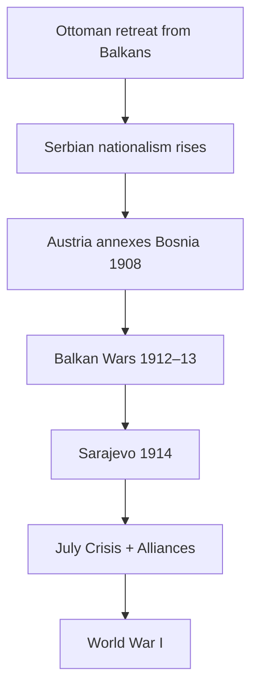

# World Wars, Boundaries & Decolonization (1914–1945+)

> GS-1 · Topic 05 · WWI, WWII, Balkan crisis, Hitler, peace efforts, boundary redraw, colonialism and its end

---

## PYQs

| Year | M | Words | Question (EN) | प्रश्न (HI) | ID |
|------|---|-------|---------------|-------------|-----|
| 2021 | 12 | 200 | What do you understand by the Balkan Crisis? What was its role in the First World War? | बालकन संकट से आप क्या समझते हैं? प्रथम विश्व युद्ध में इसकी क्या भूमिका थी? | Q1 |
| 2019 | 12 | 200 | Describe the efforts made for world peace after the second world war on global level. | द्वितीय विश्वयुद्ध के पश्चात वैश्विक स्तर पर विश्व शांति के लिए किए गए प्रयासों का वर्णन कीजिए। | Q2 |
| 2018 | 12 | 200 | Discuss the role of Hitler in bringing about the Second World War. | द्वितीय विश्व युद्ध को अवश्यम्भावी बनाने में हिटलर की भूमिका की विवेचना कीजिए। | Q3 |

---

## Quick Revision

```
WWI (1914–18): "Great War" | Central Powers (Germany, Austria-Hungary, Ottoman, Bulgaria)
  vs Allies (France, UK, Russia → USA 1917, Italy, Japan)
  Trigger: Sarajevo 28 June 1914 — Gavrilo Princip kills Archduke Franz Ferdinand (Austria)

BALKAN CRISIS = "Powder keg of Europe":
  Ottoman decline → independent Balkan states (Serbia, Bulgaria, Greece, Romania)
  Pan-Slavism (Russia backs Serbia) vs Austro-Hungarian empire (Slavs in Bosnia)
  Balkan Wars 1912–13 — territorial scramble | Austria annexed Bosnia 1908 — angered Serbia
  Role in WWI: Sarajevo → Austria ultimatum to Serbia → alliance chain → general war

WWI FEATURES: Trench warfare, Verdun, Somme | Total war | Chemical weapons | Collapse: Russia 1917, Ottoman, AH
  Treaty of Versailles 1919 — Germany "war guilt", reparations, lost Alsace-Lorraine, colonies stripped

INTERWAR: League of Nations (1920) — weak | Great Depression | Appeasement (Munich 1938)
  Rise: Mussolini 1922, Hitler 1933, Japanese militarism

WWII (1939–45): 1 Sept 1939 Germany invades Poland
  Axis: Germany, Italy, Japan | Allies: UK, USSR (1941), USA (1941), France, China
  Hitler role: remilitarize Rhineland, Anschluss Austria, Sudetenland, Poland invasion, Barbarossa USSR 1941
  Holocaust — 6 million Jews | Total ~70–85 million dead | Atomic bombs Hiroshima/Nagasaki Aug 1945

POST-WWII PEACE EFFORTS:
  UN (1945 San Francisco) — Security Council, General Assembly, ICJ
  Bretton Woods: IMF, World Bank | Nuremberg + Tokyo trials — war crimes precedent
  NATO 1949 / Warsaw Pact 1955 | Universal Declaration Human Rights 1948
  Decolonization: India 1947, Indonesia, Africa 1950s–60s | Non-Aligned Movement 1961

BOUNDARY REDRAW:
  Versailles — new Poland, Czechoslovakia, Yugoslavia | Mandate system (Middle East)
  Yalta/Potsdam 1945 — Germany divided, Oder-Neisse border, Cold War lines

COLONIALISM END: WWII weakened Europe | Atlantic Charter self-determination | UN Charter Ch XI
  Bandung 1955 | Suez 1956 symbol | French Indochina, Algeria wars

CONTEMPORARY: UN peacekeeping · ICC · Russia-Ukraine = sovereignty norm tests · UN Security Council reform debate
  India's UN contribution · Geneva Conventions · nuclear non-proliferation (NPT)

TRAPS: WWI ≠ only Sarajevo cause | USA entered WWI 1917 not 1914 | USSR entered WWII 1941 not 1939
  League ≠ same as UN | Hitler ≠ sole cause WWII (structural Versailles, appeasement) but decisive accelerator
  Decolonization ≠ complete by 1950 — Algeria to 1962, Portugal later
```

---

## Content

### Context — Europe from 1914 to 1945

Two world wars within thirty years killed tens of millions, destroyed European economic dominance, redrew maps, ended four empires (German, Austro-Hungarian, Ottoman, Russian tsarist), accelerated decolonization, and produced the United Nations and Cold War order. Understanding this arc requires linking Balkan nationalism to 1914, Versailles grievances to Hitler's rise, Allied victory to UN peace architecture, and weakened European metropoles to Asian and African independence. Boundaries drawn in 1919 and 1945 remain live—from Kashmir to Palestine to Ukraine—because they encoded great-power bargains as much as self-determination.

### First World War — causes and nature

Long-term causes combined militarism, alliances, imperialism, and nationalism. Anglo-German naval rivalry (Dreadnoughts) and universal conscription normalised arms culture. The Triple Alliance (Germany, Austria-Hungary, Italy*) faced the Triple Entente (France, Russia, Britain)—so a Balkan incident could become continental war. Imperial competition—Moroccan crises (1905, 1911), Scramble for Africa—heightened distrust. Nationalism, especially Pan-Slavism and irredentism, poisoned the Balkans.

The immediate trigger was Sarajevo, 28 June 1914: Gavrilo Princip, a Bosnian Serb nationalist, assassinated Archduke Franz Ferdinand, heir to Austria-Hungary. The July Crisis followed—Austria's ultimatum to Serbia, Russian mobilisation to support Slavic kin, Germany's Schlieffen Plan against France, Britain's entry over Belgian neutrality. What might have stayed a regional conflict became world war through alliance machinery.

| Factor | Detail |
|--------|--------|
| **Militarism** | Arms race, conscription, Anglo-German Dreadnought rivalry |
| **Alliances** | Triple Alliance vs Triple Entente—local war becomes continental |
| **Imperialism** | Moroccan crises, colonial competition |
| **Nationalism** | Pan-Slavism, Balkans, irredentism |

War's nature was "total": Western Front trench warfare at Somme (1916) and Verdun; Eastern Front mobility ending in Russian collapse after 1917 revolutions; home-front rationing, propaganda, women in factories; poison gas, tanks (1916), aircraft, U-boats (Lusitania sinking helped bring USA in April 1917). Armistice came 11 November 1918; Treaty of Versailles with Germany was signed 28 June 1919.

### Balkan Crisis — definition and role in WWI

The Balkans—Southeast Europe—were the frontier where Ottoman retreat left competing nation-states (Serbia, Bulgaria, Greece, Romania, later Albania) and ethnic minorities trapped inside Austria-Hungary (Bosnia, Croatia). Metternich's order had suppressed national revolt after 1815; Ottoman decline reopened the puzzle of who ruled which Slavs.

| Year | Crisis | Effect |
|------|--------|--------|
| **1878** | Congress of Berlin | Austria-Hungary allowed to administer Bosnia |
| **1908** | Bosnian Annexation Crisis | Austria formally annexed Bosnia—Serbia furious |
| **1912–13** | Balkan Wars | Ottoman Europe expelled—Serbia gained but blocked from Adriatic by Austria |
| **1914** | Sarajevo assassination | Spark for July Crisis |

Russia styled itself protector of Pan-Slav Serbia; Austria sought to crush Serbian nationalism before it unravelled the Habsburg Empire. Balkan nationalism did not alone cause WWI—militarism and alliances pre-existed—but it supplied the detonator that converted assassination into general war. The "powder keg" metaphor captures how regional ethnic conflict embedded in imperial rivalry exploded a militarised continent.



### Treaty of Versailles and boundary redraw (1919–20)

Paris Peace Conference (Big Three: Clemenceau, Lloyd George, Wilson) imposed Article 231 "war guilt" on Germany, reparations, military limits, loss of Alsace-Lorraine, Polish Corridor, Saar, demilitarised Rhineland, and colonial mandates. New or enlarged states—Poland, Czechoslovakia, Yugoslavia, Baltic republics—embodied principle of nationality imperfectly applied. Austria-Hungary dissolved into separate states; Ottoman partition created mandates in the Middle East whose borders still shape conflict. League of Nations (1920) promised collective security but lost credibility when USA never joined.

### Interwar period — road to WWII

Weimar Germany suffered hyperinflation (1923) and Great Depression unemployment—fuel for Nazi votes. Appeasement culminated in Munich (1938) handing Sudetenland to Hitler without preventing war. Italy invaded Ethiopia (1935); Japan seized Manchuria (1931) and warred on China (1937)—showing League impotence beyond Europe.

### Second World War — Hitler's role and course

Hitler was not sole cause—Versailles humiliation, League failure, Depression, and other aggressors created context—but his ideology and decisions made general European war likely and uniquely barbaric.

| Year | Action | Significance |
|------|--------|--------------|
| **1933** | Chancellor → Führer | Nazi dictatorship—secret rearmament |
| **1935** | Saar plebiscite, conscription | Breaks Versailles military limits |
| **1936** | Remilitarization of Rhineland | Western powers no response |
| **1938** | Anschluss, Sudetenland (Munich) | German expansion |
| **March 1939** | Czechoslovakia occupied wholly | Ends appeasement credibility |
| **Sept 1939** | Invasion of Poland | Britain & France declare war |
| **1940** | Blitzkrieg—France falls | Axis dominance |
| **1941** | Barbarossa (USSR); Pearl Harbor → USA enters | Global war |
| **1942–45** | Holocaust industrialised; Stalingrad | Genocide + turning point |
| **1945** | Berlin falls; Hitler suicide 30 April | German surrender 8 May |

Lebensraum ideology, racial war of annihilation, and Wannsee Conference (1942) systematised murder of six million Jews plus Roma, disabled, Slavs, and opponents. War dead totalled roughly 70–85 million; atomic bombs on Hiroshima (6 August) and Nagasaki (9 August 1945) forced Japan's surrender.

### Post-WWII efforts for world peace (global level)

| Institution / effort | Year | Purpose |
|---------------------|------|---------|
| **United Nations** | **1945 (San Francisco Charter)** | Collective security—GA, Security Council, ICJ, Secretariat |
| **UN specialized agencies** | 1940s+ | WHO, UNESCO, FAO—health, culture, food |
| **Universal Declaration of Human Rights** | **1948** | Global rights norm—Genocide Convention (1948) |
| **Nuremberg Trials** | **1945–46** | Individual criminal responsibility for war crimes |
| **Tokyo Trials** | **1946–48** | Japanese leadership accountability |
| **Bretton Woods system** | **1944** | IMF, World Bank—economic stability |
| **NATO** | **1949** | Western collective defence |
| **Warsaw Pact** | **1955** | Eastern bloc counterpart |
| **UN Peacekeeping** | **1948 onwards** | Blue helmets—interposition, observation |
| **NPT (1968)** | | Nuclear arms control |
| **ECSC → EU** | **1951+** | Franco-German reconciliation |
| **Decolonization under UN** | **1940s–60s** | Self-determination (Charter Chapter XI) |

UN architecture learned from League failure: US participation, broader membership, economic institutions, human-rights law, peacekeeping practice. Cold War veto paralysis, Korea, Vietnam, Rwanda, and Bosnia nonetheless showed limits—prevented direct WWIII among superpowers but not all wars.

### Colonialism and its end (mid 20th century)

Industrial powers (Britain, France, Belgium, Netherlands, Portugal) had ruled through direct administration, protectorates, and mandates—extracting resources and imposing cultural dominance. WWII weakened European metropoles; Atlantic Charter (1941) affirmed self-determination colonies interpreted as independence promise; Japanese victories (1942) shattered myth of white invincibility in Asia; UN Charter and Non-Aligned Movement delegitimised empire.

| Region | Illustrative cases | Approx. independence |
|--------|-------------------|----------------------|
| **South Asia** | India, Pakistan (1947), Ceylon, Burma | 1947–48 |
| **Southeast Asia** | Indonesia (1945–49), Indochina/Vietnam | 1945–54+ |
| **Middle East** | Mandates → Israel 1948, Jordan, Syria | 1940s–50s |
| **Africa** | Ghana (1957), wave 1960s, Algeria (1962) | 1950s–70s |
| **Caribbean/Pacific** | Jamaica, Fiji | 1960s–70s |

Formal independence did not end structural inequality—neocolonialism critiques (Fanon, Nkrumah) noted economic dependency persisting after flags changed. Decolonization wave lasted decades—Algeria to 1962, Portuguese Africa into 1970s.

### Boundary redraw after WWII (Yalta & Potsdam)

Yalta (February 1945) agreed divided Germany, Poland's western shift to Oder-Neisse line, and tacit Soviet influence in Eastern Europe. Potsdam (July–August 1945) addressed denazification, demilitarisation, reparations, and de facto Cold War lines—Churchill's "Iron Curtain" (1946). Mandate exits in Middle East, Kashmir, and Palestine left disputes including 1947 UN partition plan for Palestine. Germany was divided; Berlin became Cold War symbol. The principle of self-determination promised at Versailles and Atlantic Charter collided with great-power spheres—creating states whose borders still generate conflict because they encoded imperial convenience as much as ethnic geography.

### WWI and WWII compared — structural continuity

| Theme | WWI (1914–18) | WWII (1939–45) |
|-------|---------------|----------------|
| **Trigger logic** | Alliance escalation from regional crisis | Aggressive revisionism + prior appeasement |
| **War type** | Trench attrition, empires collapse | Mechanised blitzkrieg, global theatres, genocide |
| **Peace settlement** | Versailles humiliation, League weak | UN, Nuremberg, Bretton Woods—stronger but Cold War split |
| **Colonial impact** | Indian troops; expectations raised | Weakened Europe accelerates decolonization |
| **Boundary legacy** | New East European states | Oder-Neisse, divided Germany, mandate transitions |

Both wars destroyed European dominance, transferred power toward USA and USSR, and proved that industrial civilisation could mass-produce death as efficiently as goods—a moral shock that shaped human-rights law after 1945.

### Hitler's role — agency within structure

Hitler did not create Versailles, the Depression, or Japanese expansion, but he exploited them with ideological clarity and risk-taking that other authoritarians lacked. Remilitarising the Rhineland (1936) tested Western resolve; Munich (1938) handed Sudetenland; full occupation of Czechoslovakia (March 1939) ended appeasement's credibility. Poland's invasion (1 September 1939) triggered declarations from Britain and France; Blitzkrieg (1940) defeated France; Operation Barbarossa (1941) and Pearl Harbor globalised war. Holocaust was not collateral—it was policy: Nuremberg Laws stripped citizenship; Kristallnacht (1938) signalled terror; Wannsee Conference (1942) coordinated industrial murder. Balanced analysis credits structural interwar failure while insisting Nazi leadership made total war and genocide probable rather than accidental.

League of Nations (1920) failed when USA stayed out, sanctions lacked teeth, and aggressors learned impunity—Ethiopia (1935) and Manchuria (1931) were rehearsals for WWII. UN (1945) added economic pillars, human-rights law, and peacekeeping, yet veto politics, proxy wars, and delayed responses in Rwanda and Bosnia show peace institutions evolve without guaranteeing peace. Decolonization under UN framework affirmed self-determination while leaving economic dependency—neocolonialism critiques remind that political independence after 1947 did not automatically redistribute global power.

### Contemporary relevance

India seeks permanent UN Security Council membership—reform debates rooted in 1945 power map; India is among largest troop contributors to peacekeeping. International Criminal Court (2002) extends Nuremberg principles; Russia-Ukraine war renews accountability and territorial integrity debates (2014/2022). Geneva Conventions (1949) govern humanitarian law. Nuclear NPT and IAEA connect to Hiroshima legacy; India is not an NPT signatory but maintains no-first-use policy. Decolonization memory shapes Global South diplomacy, NAM legacy, reparations discourse, and Bandung Spirit in G-77 and BRICS forums.

### Limits

WWI causation requires structure plus Balkan trigger—not one alone. Hitler was accelerator and ideologue, not exclusive explanation. UN prevented direct superpower war but not proxy wars, genocides, or civil conflicts. Decolonization was uneven—settler colonies and Portuguese empire lasted longer; neocolonial economics persisted. USA entered WWI in 1917, not 1914; USSR entered WWII in 1941 after Barbarossa, though it invaded Poland under Molotov-Ribbentrop in 1939. Post-WWII peace was not only UN—Bretton Woods, Nuremberg, UDHR, NATO, EU roots, and NPT together formed the architecture.

Separate peace treaties after WWI—not one document for all Central Powers—show how boundary redraw was piecemeal: Treaty of St Germain with Austria, Trianon with Hungary, Sèvres (later revised) with Ottoman Turkey. Each redistributed territory and minorities, often leaving ethnic Germans in Sudetenland, Poles in disputed corridors, and Ottoman Arabs under mandates—fault lines Hitler and later Middle Eastern conflicts exploited. WWII's Yalta and Potsdam similarly traded populations and shifted Poland westward, demonstrating that twentieth-century "self-determination" repeatedly meant great-power negotiation over people's homes.

---

## Answers

### Q1: What do you understand by the Balkan Crisis? What was its role in the First World War? (2021, 12M, 200W)

**Opening:**
> The Balkan Crisis refers to chronic instability in Southeast Europe as Ottoman power declined and rival nationalisms clashed under Austro-Russian great-power competition — it acted as the detonator of World War I through the Sarajevo assassination and July Crisis of 1914.

**Write these points:**
- **Definition:** **Balkans** — **Serbia, Bulgaria, Greece, Romania, Bosnia etc.** — **ethnic fragmentation**, **Ottoman retreat**, **pan-Slav vs Austro-Hungarian imperial control**.
- **Key episodes:** **Bosnian annexation (1908)**, **Balkan Wars (1912–13)** — **Serbia blocked from Adriatic**, **resentment against Austria**.
- **Sarajevo (28 June 1914):** **Gavrilo Princip** killed **Archduke Franz Ferdinand** — **Austria blamed Serbia**, **ultimatum**, **declaration of war (28 July)**.
- **Alliance escalation:** **Russia mobilized** to support **Serbia** → **Germany vs Russia/France** → **Schlieffen Plan** → **Britain over ** **Belgian neutrality**.
- **Role:** Balkan **nationalism supplied immediate spark** in **already militarized alliance system** — **"powder keg"** metaphor — **not sole cause** but **critical pathway**.
- **Outcome:** **Four empires collapsed**, **Versailles redrew Eastern Europe** — **Yugoslavia, Czechoslovakia** created.

**Conclusion:**
> Balkan Crisis = **regional nationalist conflict embedded in imperial rivalry**; its role was to **convert a Balkan assassination into general European war** via **entangling alliances**.

---

### Q2: Describe the efforts made for world peace after the second world war on global level. (2019, 12M, 200W)

**Opening:**
> After 1945, victor powers and the international community built multilateral institutions for collective security, economic stability, human rights, and decolonization — learning from the League of Nations' failure.

**Write these points:**
- **United Nations (1945):** **Charter at San Francisco** — **General Assembly, Security Council, ICJ, Secretariat** — **collective security** and **dispute settlement**.
- **Legal accountability:** **Nuremberg and Tokyo trials** — **individual responsibility** for **war crimes, crimes against humanity, genocide** — **precedent for ICC later**.
- **Human rights:** **Universal Declaration (1948)**, **Genocide Convention (1948)** — **global normative framework**.
- **Economic peace:** **Bretton Woods — IMF, World Bank (1944)** — **prevent Depression-style instability** feeding extremism.
- **Collective defence & arms control:** **NATO (1949)**, later **Warsaw Pact**, **NPT (1968)**, **partial test bans** — **manage Cold War risk**.
- **European integration:** **ECSC (1951) → EEC → EU** — **Franco-German reconciliation**.
- **Decolonization & peacekeeping:** **UN trusteeship/self-determination**, **peacekeeping missions from 1948** — **blue helmets** in conflict zones.

**Conclusion:**
> Post-1945 architecture combined **security (UN), law (HR conventions), economics (Bretton Woods), and regional integration (EU)** — imperfect but **prevented a third world war among great powers for decades**.

---

### Q3: Discuss the role of Hitler in bringing about the Second World War. (2018, 12M, 200W)

**Opening:**
> Adolf Hitler and Nazi Germany were central in making World War II inevitable through aggressive revision of Versailles, rapid rearmament, and expansionist wars — though structural failures of interwar order also created the permissive context.

**Write these points:**
- **Ideology:** **Lebensraum**, ** racial hierarchy**, **abolition of Treaty of Versailles** — **war as policy**, not accident.
- **Timeline:** **Rhineland (1936)**, **Anschluss & Sudetenland (1938)**, **Czech takeover (1939)**, **Poland invasion (1 Sept 1939)** — **Britain/France declare war**.
- **Blitzkrieg & European domination (1940)** — **France falls** — **Britain alone** until **1941**.
- **Globalization of war:** **Operation Barbarossa (1941)** vs **USSR**; **alliance with Japan** — **US entry after Pearl Harbor** — **world war in full sense**.
- **Holocaust:** **Industrial genocide** — **6 million Jews** — **war of annihilation** in East.
- **Context factors:** **Versailles resentment, appeasement, Depression, weak League** — **enabled** but **Hitler's decisions** were **decisive accelerators**.

**Conclusion:**
> Hitler **transformed interwar crisis into total war and genocide** — exam answer must balance **personal/agency (Nazi leadership)** with **structural causes (Versailles, economic crisis)**.

---

### Q4 (Future variant): How did the Treaty of Versailles redraw national boundaries in Europe? (Likely, 8M, 125W)

**Opening:**
> The Treaty of Versailles (1919) dismantled empires and created new nation-states in Europe while punishing Germany — reshaping the map but planting future grievances.

**Write these points:**
- **Germany lost:** **Alsace-Lorraine (France)**, **Polish Corridor**, **Danzig (Free City)**, **Saar**, **colonies → mandates**.
- **New states:** **Poland restored**, **Czechoslovakia, Yugoslavia**, **Baltic republics** from **Russian/German/Austrian collapse**.
- **Austria-Hungary dissolved:** **Austria, Hungary, Czechoslovakia, Yugoslavia, Romania gains**.
- **Principle of nationality** applied **inconsistently** — **German minorities in Sudetenland**, **Polish corridor** — ** Hitler exploited later**.

**Conclusion:**
> Versailles **redrew boundaries on nationalist logic** but **humiliated Germany** — **interwar instability** linked to **WWII origins**.

---

### Q5 (Future variant): Discuss the causes of the First World War. (Likely, 12M, 200W)

**Opening:**
> World War I resulted from long-term militarism, alliance blocs, imperial rivalry, and nationalism — triggered by the Sarajevo assassination and July Crisis of 1914.

**Write these points:**
- **Militarism:** **Arms race**, **general staffs**, **Schlieffen Plan** — **war plans treated conflict as feasible**.
- **Alliances:** **Triple Alliance** (Germany, Austria-Hungary, Italy*) vs **Triple Entente** (Britain, France, Russia) — **chain reaction**.
- **Imperialism:** **Moroccan crises (1905, 1911)**, **colonial competition** — **great-power friction**.
- **Nationalism:** **Balkans "powder keg"** — **Serbia vs Austria-Hungary**, **Pan-Slavism**, **Russian backing of Serbia**.
- **Immediate:** **Sarajevo 28 June 1914** — **Austria's ultimatum**, **Russia mobilizes**, **Germany vs France**, **Britain over Belgium**.
- **Nature reminder:** **Total war** — **trenches, gas, empires collapse** — **not limited 19th-century war**.

**Conclusion:**
> **Structural causes + Balkan spark** — avoid **single-cause** answers; **Versailles (1919)** ended war but **planted WWII seeds**.

---

## Traps

| Wrong | Correct |
|-------|---------|
| Balkan Crisis = only 1914 events | **Series from 1878 Congress of Berlin through Balkan Wars** |
| Sarajevo assassin was Serbian government agent officially | **Princip** linked to **nationalist groups**; **Austria used as pretext** — **evidence debated** |
| Russia started WWI alone | **Alliance chain** — **multiple actors** |
| USA fought WWI from 1914 | **Entered April 1917** |
| Treaty of Versailles signed with all Central Powers in one doc | **Separate treaties** — **St Germain (Austria), Trianon (Hungary), etc.** |
| League of Nations = United Nations | **League (1920)** failed — **UN (1945)** successor, **stronger design** |
| WWII began when Germany invaded USSR | **Began Sept 1939 — Poland**; **USSR invaded Poland too (Molotov-Ribbentrop)** |
| Hitler declared war on USA first in all accounts | **Germany declared war on US Dec 1941** after **Pearl Harbor** — **Japan attacked US** |
| UN prevented all wars after 1945 | **Many conflicts** — **Korea, Vietnam, Middle East, Africa** — **no WWIII direct great-power war** |
| Decolonization finished immediately in 1945 | **Wave lasted decades** — **Algeria 1962, Portuguese Africa 1970s** |
| Post-WWII peace = only UN | Also **Bretton Woods, Nuremberg, UDHR, NATO, EU roots, NPT** |
| Boundary redraw = only after WWI | **Also Yalta/Potsdam 1945**, **mandate → state transitions in Middle East** |

---

*Complete.*
