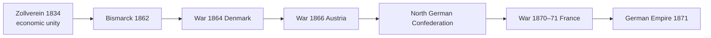

# German & Italian Unification — Nationalism vs Realpolitik

> GS-1 · Topic 05 · Bismarck, blood and iron, Zollverein, Cavour, Garibaldi, Mazzini — international implications

---

## PYQs

| Year | M | Words | Question (EN) | प्रश्न (HI) | ID |
|------|---|-------|---------------|-------------|-----|
| 2025 | 12 | 200 | The Unification of Germany is considered as a symbol of the contradiction between the 'ideal of nationalism' and the 'realities of power politics'. In this context, critically examine the paths of unification and its international implications. | जर्मनी का एकीकरण 'राष्ट्रवाद के आदर्श' और 'यथार्थवादी शक्ति-राजनीति' के अंतर्विरोध का प्रतीक माना जाता है। इस सन्दर्भ में एकीकरण के मार्गों और उसके अंतर्राष्ट्रीय निहितार्थों का आलोचनात्मक परीक्षण कीजिए। | Q1 |
| 2023 | 12 | — | Evaluate the role of Bismarck in the unification of Germany. | जर्मनी के एकीकरण में बिस्मार्क की भूमिका का मूल्यांकन कीजिए। | Q2 |

---

## Quick Revision

```
NATIONALISM (ideal): Shared language/culture/history → self-determination → unified nation-state
  German: 1848 Frankfurt Parliament failed | Italian: Mazzini "Young Italy" 1831 — romantic nationalism

POWER POLITICS (realities): Alliances, wars, dynastic interest, Realpolitik — Bismarck model

GERMAN UNIFICATION PATH:
  Pre-1815: 300+ states → 1815 Congress of Vienna → German Confederation (39 states) under Austrian influence
  Zollverein (1834) — Prussia-led customs union — economic unity without political unity
  1862 Bismarck PM of Prussia — "blood and iron" speech 1862
  Three wars of unification:
    1864 vs Denmark (Schleswig-Holstein)
    1866 Austro-Prussian War — Königgrätz — Dissolves German Confederation → North German Confederation
    1870–71 Franco-Prussian War — Ems Telegram provocation → German Empire proclaimed Versailles 18 Jan 1871
  Bismarck: Realpolitik, alliances, exclude Austria (Kleindeutschland — "small Germany")

ITALIAN UNIFICATION (Risorgimento):
  Before 1850: Metternich called Italy "mere geographical expression"
  Mazzini — republican nationalism (Young Italy)
  Cavour — PM Piedmont-Sardinia — diplomacy + economy (1852+)
  Garibaldi — "Red Shirts" — Expedition of the Thousand 1860 (Sicily, Naples)
  1859 war vs Austria (with France Napoleon III help) — Lombardy
  1861 Kingdom of Italy proclaimed — Victor Emmanuel II — capital Rome only 1871
  Venetia 1866 (Austro-Prussian war side deal) | Rome 1870 (French troops left — Papal States taken)

CONTRADICTION nationalism vs power politics:
  National rhetoric (unity) BUT achieved via war, manipulation, elite deals — not pure popular will
  Germany: liberal 1848 failed; conservative Prussian militarism succeeded
  Italy: north-led; south integrated by force; plebiscites but limited democracy

INTERNATIONAL IMPLICATIONS:
  Shift European balance — new powerful central European empire
  France lost Alsace-Lorraine → revanchism → WWI seed
  Austria weakened → dual monarchy 1867 | Italy rival
  Bismarck alliance system post-1871 — isolate France ( Dreikaiserbund, Reinsurance)
  Italian unification — end of papal temporal power crisis; great-power bargaining

CONTEMPORARY: EU integration vs nationalist separatism (Scotland, Catalonia) | Ukraine self-determination
  German reunification 1990 | nationalism + Realpolitik in IR studies

TRAPS: Germany unified 1871 not 1848 | Bismarck excluded Austria (Kleindeutsch not Grossdeutsch)
  Garibaldi ≠ unified Italy alone (Cavour diplomacy critical) | Italy complete Rome 1871 not 1861
  Unification ≠ purely bottom-up popular revolution
```

---

## Content

### Context — nationalism in 19th-century Europe

After the Congress of Vienna (1815), Prince Metternich's conservative order tried to suppress liberal-national revolutions across Europe. Yet industrial capitalism, print culture, railways, and wars gradually fuelled the nation-state ideal: one people, one language, one government. Italy before unification was, in Metternich's phrase, "a mere geographical expression"—a patchwork of kingdoms, duchies, and Austrian-controlled Lombardy-Venetia. Germany comprised over 300 states reduced to 39 in the German Confederation (Deutscher Bund), presided over by Austria but rivalled by Prussia.

National unification in Italy (1861, completed 1871) and Germany (1871) redrew Europe's map and shifted the balance of power. The central intellectual tension is between romantic nationalism—the belief that shared culture demands self-rule—and Realpolitik, where dynastic war, alliance manipulation, and economic integration decide borders. Unification was achieved more by statecraft and blood than by the failed liberal parliaments of 1848.

### Germany before unification

The Holy Roman Empire's legacy fragmented sovereignty. The Zollverein (1834)—a Prussia-led customs union with free trade among members and common external tariff—created economic Germany before political Germany and deliberately excluded Austria, foreshadowing the Kleindeutsch (small Germany) solution. The Frankfurt Parliament of 1848 in St Paul's Church dreamed of a unified constitutional Germany but collapsed over Schleswig-Holstein, royal refusal, and bourgeois fear of popular unrest. The lesson nationalists drew: unity required army and chancellor, not speeches alone.

### Bismarck and German unification — path and methods

Otto von Bismarck (1815–1898), a conservative Junker, became Prime Minister of Prussia in 1862 during a constitutional crisis over army reforms. His "blood and iron" speech declared that great questions would be settled by military strength, not parliamentary debate. His Realpolitik meant practical power over ideology—limited wars, shifting alliances, and exploitation of nationalist sentiment without submitting to democratic nationalism.

| War | Year | Opponent | Outcome |
|-----|------|----------|---------|
| **Schleswig-Holstein** | **1864** | **Denmark** | Prussia + Austria take duchies—later dispute between them |
| **Austro-Prussian (Seven Weeks' War)** | **1866** | **Austria** | Prussia wins at Königgrätz (Sadowa)—dissolves German Confederation—North German Confederation (1867)—Austria excluded |
| **Franco-Prussian War** | **1870–71** | **France (Napoleon III)** | Ems Telegram provocation—French defeat at Sedan—German Empire proclaimed at Versailles 18 January 1871—Alsace-Lorraine annexed |



After 1871 Bismarck pursued Kulturkampf against the Catholic Church, anti-socialist laws against the SPD while introducing early social insurance (1880s), and a alliance web—Dreikaiserbund, Dual Alliance with Austria-Hungary (1879), Reinsurance Treaty with Russia—to isolate France. He presented himself as a "satiated power" seeking peace tactically, but Alsace-Lorraine poisoned Franco-German relations and seeded revanchism leading to World War I.

Bismarck was architect of unity through calibrated warfare and federation under Prussian Hohenzollern monarchy—not the republic 1848 liberals wanted. Prussian army under Moltke, Zollverein economics, and south German patriotic surge after 1870 all mattered; he was indispensable but not alone.

### Italian unification (Il Risorgimento)

Three figures embody different nationalist paths:

| Leader | Approach | Role |
|--------|----------|------|
| **Giuseppe Mazzini** | Republican romantic nationalism—Young Italy (1831) | Moral inspiration; failed 1848 revolutions—idealist pole |
| **Count Camillo di Cavour** | Liberal monarchist Realpolitik—PM Piedmont-Sardinia (1852–61) | Modernised Piedmont; Plombières pact with Napoleon III (1858); 1859 war vs Austria—Lombardy |
| **Giuseppe Garibaldi** | Popular military hero—Red Shirts | Expedition of the Thousand (1860)—Sicily & Naples—handed conquests to Victor Emmanuel II |

Chronology: 1859 France–Piedmont war against Austria gained Lombardy; central Italian duchies voted to join Piedmont. Garibaldi landed at Marsala in 1860, took Sicily and Naples, but yielded to monarchy—not Mazzini's republic. Kingdom of Italy proclaimed 17 March 1861 with capital Turin then Florence; Rome remained papal with French garrison until Franco-Prussian War (1870) pulled French troops away—Italy captured Rome 20 September 1870, making it capital 1871. Venetia came in 1866 when Italy allied with Prussia against Austria.

Contradictions: northern Piedmontisation of the south met brigandage and repression; north–south divide persists. Papal temporal power ended, leaving Church hostility until Lateran Pacts (1929). Plebiscites under occupation masked elite bargains.

### Nationalism vs power politics — critical synthesis

| **Nationalist ideal** | **Power-political reality** |
|----------------------|----------------------------|
| Self-determination of "German/Italian people" | Prussian army and Piedmont diplomacy decided borders |
| 1848 popular parliaments | Failed—1860s–70s conservative states won |
| Cultural unity (language, history) | Excluded minorities—Poles in German east, Sudeten Germans, marginalised southerners |
| Peaceful union | Three wars (Germany); multiple wars (Italy) |
| Republican brotherhood (Mazzini) | Monarchical kingdoms—Kaiser William I, Victor Emmanuel II |

Germany especially symbolises the contradiction: national unification is celebrated, but Kleindeutsch unity subordinated liberal nationalists to Junker-military statecraft; annexation of Alsace-Lorraine traded short-term triumph for long-term European instability.

### International implications

The German Empire became continental Europe's largest economy and army by 1900, shattering French supremacy and weakening Austria—forcing the 1867 Dual Monarchy. Alsace-Lorraine fuelled French revanchism—a central chain to WWI; Versailles (1919) returned provinces to France. Bismarck's alliance system (1879 Austro-German alliance, 1882 Triple Alliance with Italy) modelled pre-1914 bloc politics.

Italy traded Nice and Savoy to France at Plombières for military help—nationalism bargaining away territory. Post-unification colonial grabs—Eritrea, Libya (1911)—offered imperial compensation for perceived weak great-power status.

Unified nation-states inspired Slavic nationalisms, Young Turks, and anti-colonial movements—but terrified conservative empires (Ottoman, Habsburg, Romanov) where nationalism meant disintegration. Balkan crises partly stem from the same nationality principle applied unevenly after 1878.

| Feature | **Germany** | **Italy** |
|---------|-------------|-----------|
| **Lead state** | Prussia | Piedmont-Sardinia |
| **Master strategist** | Bismarck | Cavour |
| **Popular hero** | Army institution | Garibaldi |
| **Wars** | 1864, 1866, 1870–71 | 1859, 1860, 1866, 1870 |
| **Excluded power** | Austria (Kleindeutsch) | Austria from north initially |
| **Capital** | Berlin clear | Rome delayed to 1870 |
| **Completed** | 1871 Versailles | 1871 Rome |

Garibaldi's popularity proved that nationalist emotion could mobilise volunteers across Sicily, yet Cavour's decision to restrain him from marching on Rome in 1860 showed Realpolitik trumping romantic revolution—the hero was useful only so long as he served Piedmont's monarchy. Bismarck similarly manipulated nationalist fervour after Sedan to bring south German states into empire while excluding Austria permanently—a strategic choice about which "nation" would exist.

Italy traded Nice and Savoy to France for military aid—nationalism literally bargaining away co-nationals for state advantage. Post-unification, Italy pursued colonies in Eritrea and Libya (1911) as imperial compensation for late entry into great-power club—Risorgimento's domestic unity did not satisfy great-power ambition.

Germany embodies the contradiction between nationalist ideal and Realpolitik: Goethe's cultural Germany unified by Prussian wars; Frankfurt liberals sidelined; Kleindeutsch chosen over Grossdeutsch; Alsace-Lorraine annexed against inhabitants' will. National rhetoric legitimised power politics; power politics defined which nation would exist and who would suffer for it.

### Cavour, Garibaldi, and Mazzini — roles revisited

Mazzini's Young Italy (1831) kept republican idealism alive when Metternich suppressed revolt, but his insurrections failed because they lacked state apparatus. Cavour modernised Piedmont's economy and army, signed the secret Plombières agreement with Napoleon III (1858) trading Nice and Savoy for French troops against Austria, and annexed central duchies through plebiscites managed by diplomacy. Garibaldi's Expedition of the Thousand (1860) conquered Sicily and Naples with Red Shirt volunteers, yet he handed territory to Victor Emmanuel II rather than proclaim Mazzini's republic—proving that military charisma served monarchical Realpolitik. Rome remained papal until French garrison withdrawal in 1870; only then did unification acquire its symbolic capital.

### Evaluate Bismarck — synthesis

Bismarck resolved Prussia's constitutional crisis by securing army reform funding, then used that army instrumentally in three wars whose objectives were limited each time—never simultaneous enemies on all fronts. Excluding Austria (1866) defined Kleindeutschland; provoking France (1870) brought south German states into empire through shared victory rather than coercion alone. Domestically he balanced repression (anti-socialist laws, Kulturkampf) with concession (social insurance) to stabilise the new Reich. His dismissal by Kaiser Wilhelm II (1890) ended careful alliance management; historians debate how far Bismarck's system—not his personality alone—contributed to 1914. Indispensable architect yes; democrat no; peacemaker after 1871 tactically, but Alsace-Lorraine annexation planted long war.

Wilhelm I was proclaimed German Emperor in the Hall of Mirrors at Versailles—a deliberate humiliation of France that fused national unification with dynastic triumph. The 1871 constitution created a federal Reich where Prussia dominated military and foreign policy while south German states retained some autonomy—a compromise between Kleindeutsch nationalism and princely particularism.

### Contemporary relevance

European Union ironically reverses the logic of 1871—nation-states that warred now share supranational institutions; Brexit revives nationalism-vs-interdependence tension. German reunification (1990) achieved Wiedervereinigung through diplomacy within NATO/EU frameworks—modern Realpolitik. UN Charter self-determination debates (Kosovo, Ukraine) echo plebiscite logic of the 1860s—when is secession legitimate? India's Patel-era integration combined national ideal with coercion and diplomacy—a useful comparative frame for how unity and power politics intertwine across continents.

### Limits

Bismarck did not create Prussian military or Zollverein alone; personal diplomacy ended when Kaiser Wilhelm II dismissed him (1890), contributing to 1914 but not solely causing it. Italian political unity did not homogenise society—mass emigration, regional inequality, and north-south divide persisted. Nationalism was liberating and destructive—unified states later pursued imperialism and WWI. Unification was not bottom-up revolution: plebiscites under occupation were managed democracy. Grossdeutsch including Austria failed; Italy "completed" in 1861 without Rome until 1871. Franco-German Alsace-Lorraine grievance shows political unification did not equal justice—the contradiction between nationalist ideal and Realpolitik endures in European politics today.

Compare Germany and Italy in one frame: both achieved unity between 1861 and 1871 through war and diplomacy; both excluded Austria from leadership; both produced monarchical not republican outcomes despite Mazzini and Frankfurt liberals; both shifted European balance and fed imperial competition. Germany's three wars under Bismarck were sequential and limited; Italy's Risorgimento combined Cavour's cabinets with Garibaldi's volunteers and French bayonets—different methods, same Realpolitik logic. International implications—revanchism, alliance blocs, colonial scramble—outlasted unification ceremonies by decades.

The Zollverein teaches that economic integration can precede and prepare political unity—customs union without single government lowered trade barriers, aligned commercial law, and habituated German states to cooperation under Prussian leadership before Bismarck's wars. Italian unification lacked equivalent economic depth initially; Piedmont's reforms were regional, and southern integration brought fiscal burden and brigandage rather than shared prosperity. Nationalism's ideal promised one people; Realpolitik's reality left uneven citizenship inside new borders—a contradiction neither Germany nor Italy resolved in the nineteenth century.

Garibaldi remains the human face of Risorgimento—volunteer enthusiasm that Cavour channelled and restrained. Bismarck has no Garibaldi equivalent because Prussian unity rested on army and bureaucracy rather than popular crusade; south German attachment after 1870 was patriotic but managed from above. The contrast illustrates how "nationalism" could mean street heroism in one peninsula and staff-officer calculation in another—same era, different social energy, equally Realpolitik in outcome for the European balance of power.

---

## Answers

### Q1: The Unification of Germany… contradiction between 'ideal of nationalism' and 'realities of power politics'… critically examine paths and international implications. (2025, 12M, 200W)

**Opening:**
> German unification (1871) fulfilled the cultural dream of a united German nation, yet was engineered by Bismarck's Realpolitik, dynastic wars, and exclusion of Austria — embodying tension between nationalist ideals and power politics with far-reaching European consequences.

**Write these points:**
- **Nationalist ideal:** **Shared language, literature (Goethe), liberal hopes of 1848 Frankfurt Parliament** — **self-determination for German people**.
- **Power-political path:** **Bismarck (1862+)** — **"blood and iron"** — **1864 Denmark**, **1866 Austria (Königgrätz)**, **1870–71 France** — **not popular revolution but ** **Prussian military-diplomatic statecraft**.
- **Kleindeutsch vs Grossdeutsch:** **Excluded Austria** — **nationalism subordinated to ** **Prussian hegemony**, **Hohenzollern monarchy** — **1848 liberals sidelined**.
- **Zollverein (1834):** **Economic unity** preceded **political** — **nationalism via trade + war**, not speeches alone.
- **International implications:** **German Empire shifts balance** — **France loses Alsace-Lorraine** → **revanchism** → **WWI**; **Bismarck alliance system (1879 Dual Alliance)** shapes **pre-1914 blocs**; **Austria weakened**, **Italian rivalry**.
- **Critical view:** **Unification modernized Germany** but **embedded militarism, authoritarianism, irredentism** — **national ideal corrupted by power means**.

**Conclusion:**
> Germany 1871 proves **nationalism and Realpolitik are intertwined** — **ideal gave legitimacy**, **power politics gave form** — **international order destabilized for decades**.

---

### Q2: Evaluate the role of Bismarck in the unification of Germany. (2023, 12M)

**Opening:**
> Otto von Bismarck was the decisive architect of German unification through Realpolitik, three calculated wars, and federation under Prussia — yet he was a conservative dynast, not a liberal nationalist.

**Write these points:**
- **Appointment 1862** as **Prussian PM** — **resolved constitutional crisis** — ** army reforms** funded — **power base for wars**.
- **1864 Schleswig-Holstein:** **Joint with Austria then engineered conflict** — **national issue instrumentally used**.
- **1866 vs Austria:** **Dissolved German Confederation**, **North German Confederation** — **excluded Austria (Kleindeutsch)** — **decisive strategic choice**.
- **1870–71 vs France:** **Ems Telegram manipulation** — **south German states joined north** — **Empire proclaimed Versailles Jan 1871**.
- **Domestic consolidation:** **Constitution of 1871**, **Kulturkampf**, **anti-socialist laws**, **social insurance** — **strong centralized Reich**.
- **Limits:** **Not democrat** — ** crushed 1848 ideals**; **Alsace-Lorraine annexation** sowed **WWI**; **dependent on ** **army, king** — **personal diplomacy ended with Kaiser Wilhelm II dismissal (1890)**.

**Conclusion:**
> Bismarck ** indispensable for timing, war calibration, and diplomatic isolation of opponents** — **greatest Realpolitiker** — but **unification's costs (militarism, revanchism)** partly his legacy too.

---

### Q3 (Future variant): Discuss the role of Cavour and Garibaldi in Italian unification. (Likely, 12M, 200W)

**Opening:**
> Italian unification combined Cavour's diplomatic Realpolitik from Piedmont with Garibaldi's popular military campaigns — Mazzini's republican ideal largely sidelined.

**Write these points:**
- **Cavour:** **Modernized Piedmont**, **alliance with France (1859)**, **Lombardy from Austria**, **diplomatic annexation of central duchies**.
- **Garibaldi:** **Expedition of the Thousand (1860)** — **Sicily and Naples** — **Red Shirts' popular nationalism**.
- **1861 Kingdom under Victor Emmanuel** — **Garibaldi yielded to monarchy** — **Cavour's statecraft dominant**.
- **Rome 1870** — **French withdrawal** — **capital moved** — **completion**.
- **Contradiction:** **National hero vs elite bargain** — **south integrated with repression**.

**Conclusion:**
> **Cavour gave structure; Garibaldi gave passion** — together **Risorgimento succeeded where 1848 failed**.

---

### Q4 (Future variant): Compare the unification of Germany and Italy. (Likely, 12M, 200W)

**Opening:**
> Both Germany (1871) and Italy (1871) unified fragmented regions into nation-states through Realpolitik and war — yet differed in lead states, heroes, and international bargains.

**Write these points:**
- **Common:** **Nationalism after 1815**; **1848 failures**; **war + diplomacy**, not pure popular revolution; **monarchical outcome** ( **Kaiser William I**, **Victor Emmanuel II** ).
- **Germany:** **Prussia-led**, **Bismarck**, **three wars (1864, 1866, 1870–71)**, **Zollverein first**, **excluded Austria (Kleindeutsch)**.
- **Italy:** **Piedmont-led**, **Cavour's diplomacy + Garibaldi's Red Shirts (1860)**, **French help (1859)**, **Rome capital delayed to 1870**.
- **Contradiction both:** **National ideal** vs **elite militarism** — **Alsace-Lorraine grievance (Germany)**, **north-south divide (Italy)**.
- **International effect:** **New powers shift balance** — **Franco-German rivalry**, **Italian colonial compensations (Libya)**.

**Conclusion:**
> **Same era, same tools (war, alliances)** — **different personalities and geography** — **both symbols of nationalism married to power politics**.

---

## Traps

| Wrong | Correct |
|-------|---------|
| Germany unified in 1848 | **1848 Frankfurt Parliament failed** — **unity 1871** |
| Bismarck was a liberal nationalist | **Conservative Junker** — **Realpolitik**, **anti-1848** |
| Grossdeutschland including Austria was outcome | **Kleindeutsch** — **Austria excluded 1866** |
| Italian unification finished 1861 with Rome | **1861 proclaimed** but **Rome capital only 1871** |
| Garibaldi alone unified Italy | **Cavour's diplomacy + Piedmont state essential** |
| Mazzini led unified Italy politically | **Republican idealist** — **monarchy won** |
| Unification was peaceful plebiscite only | **Multiple wars**, **Garibaldi's campaigns**, **Austrian defeats** |
| Zollverein included Austria | **Excluded Austria** — **Prussian economic leadership** |
| Alsace-Lorraine irrelevant later | **Core Franco-German grievance** → **WWI** |
| Italian unification had no colonial aftermath | **Italy pursued ** **Libya/Eritrea** — ** imperial compensation** |
| Bismarck caused WWI directly | **Died 1898** — **system he built + Wilhelm II's policy** contributed to **1914** |
| Nationalism always democratic | **1871 Germany = semi-authoritarian monarchy** |

---

*Complete.*
