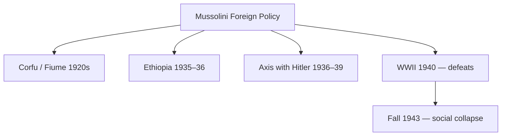

# Fascism, Nazism & Socialism — Ideologies and Social Impact

> GS-1 · Topic 05 · Mussolini, Hitler, Marx, Soviet model — forms, features, effect on society (18th c.–mid 20th c.)

---

## PYQs

| Year | M | Words | Question (EN) | प्रश्न (HI) | ID |
|------|---|-------|---------------|-------------|-----|
| 2020 | 8 | 125 | Write a critical note on the Foreign Policy of Mussolini, the leader of Fascism in Italy. | इटली में फासीवाद के नेता मुस्सोलिनी की विदेश नीति पर समीक्षात्मक टिप्पणी लिखिए। | Q1 |

---

## Quick Revision

```
IDEOLOGIES SYLLABUS: Socialism · Communism · Fascism · Nazism — forms + societal impact

SOCIALISM (broad):
  Critique of industrial capitalism inequality | Public/community ownership of means of production
  Utopian: Owen, Saint-Simon, Fourier — model communities
  Scientific: Marx & Engels — historical materialism, class struggle, dictatorship of proletariat
  Revisionist: Bernstein — evolutionary socialism | Fabians in Britain

COMMUNISM (Marxist-Leninist form):
  1917 Russian Revolution — Lenin, Bolsheviks | Soviets | Red Army civil war
  Stalin (1928+) — Five-Year Plans, collectivization, Great Purge | command economy + totalitarian state
  Society: literacy up, women legal equality formal, atheism promoted; terror, gulags, famine (Holodomor debate)

FASCISM (Italy — Mussolini):
  March on Rome 1922 | Duce | Corporate state — syndicates under state
  Features: ultra-nationalism, one-party, cult of leader, anti-communist, anti-liberal, violence
  Society: youth leagues (Opera Nazionale Balilla), censorship, church deal (Lateran 1929), women as mothers of nation

NAZISM (Germany — Hitler):
  National Socialism ≠ Italian fascism exactly — added biological racism, Lebensraum, antisemitism
  Nuremberg Laws 1935 | Kristallnacht 1938 | Holocaust 1941–45
  Hitler Youth, Gleichschaltung (coordination), total mobilization, war economy

MUSSOLINI FOREIGN POLICY (PYQ):
  Revise imperial prestige — Corfu 1923 | Fiume (D'Annunzio) context
  Ethiopia invasion 1935–36 — League sanctions weak | Albania 1939
  Axis with Hitler — Pact of Steel 1939 | entered WWII June 1940 — disastrous
  Critical: imperial ambition > capacity; subordinate to Hitler; colonies poor; regime fell 1943

SOCIETAL IMPACT COMPARE:
  Socialism/Communism: reduced formal class privilege (USSR), welfare, education; also repression, famine
  Fascism/Nazism: crushed labour rights, militarized youth, gender traditionalism; genocide (Nazism)
  All: mass politics, propaganda, state control of culture — end of 19th c. liberal optimism

CONTEMPORARY: Rise of populism studies | UN anti-fascism resolution | Holocaust education (Yad Vashem)
  ICC genocide prosecutions | India's fight against colonialism aligned with anti-fascist WWII
  Communism collapse 1991 vs China model | extremism deradicalization policies

TRAPS: Fascism ≠ all dictatorships | Nazism ≠ same as Italian Fascism (race core in Nazism)
  Mussolini ≠ always Hitler's equal partner — junior ally | Socialism ≠ only USSR
  Stalinism ≠ Marx's democratic vision as interpreted by critics | Foreign policy ≠ only Ethiopia
```

---

## Content

### Context — age of mass ideologies (late 19th – mid 20th century)

The Industrial Revolution and World War I shattered nineteenth-century liberal confidence that progress, free trade, and constitutional monarchy would spread peacefully. Mass politics—universal male suffrage, political parties, cheap newspapers, radio—allowed ideologies to compete for state power on an unprecedented scale. Three families dominated: socialism and communism on the left, seeking to end capitalist inequality; fascism and Nazism on the radical right, seeking national rebirth through authoritarian unity; and weakened liberal democracy in the centre. Each reshaped class relations, gender roles, culture, and violence. Understanding them requires comparing forms (doctrine, institutions) with societal effects—not biography alone.

### Socialism — origins, forms, social impact

Socialism arose from critique of industrial capitalism: wage workers (proletariat) produced profit for owners of factories and mines while facing insecure employment and urban poverty. The goal was collective ownership of means of production and social equality. Marx and Engels's *Communist Manifesto* (1848) argued historical materialism and class struggle would lead capitalism to destroy itself, passing through dictatorship of the proletariat toward classless communism. The First International (1864) and Second International (1889) organised socialist parties across Europe.

| Type | Figures | Features |
|------|---------|----------|
| **Utopian socialism** | Robert Owen, Saint-Simon, Charles Fourier | Model communities, moral persuasion—pre-Marx |
| **Revolutionary Marxism** | Marx, Engels, Lenin | Violent revolution, smash bourgeois state |
| **Revisionist / democratic socialism** | Eduard Bernstein, Fabian Society (UK) | Parliamentary path, gradual reform |
| **Syndicalism** | Georges Sorel | General strike, trade-union power |

Where socialism influenced policy without revolution, trade unions gained legal recognition, eight-hour-day campaigns advanced, and Bismarck's German social insurance (1880s) partly responded to socialist pressure from below. Clara Zetkin linked labour and women's rights—International Women's Day (1910). Workers' education circles spread literacy demands. Socialism was never monolithic—democratic socialists rejected Bolshevik violence; syndicalists distrusted parliament.

### Communism — Soviet model and society

Russia's February 1917 revolution forced Tsar Nicholas II to abdicate; the Provisional Government continued war. October 1917 brought Lenin and Bolsheviks to power with "All power to Soviets" and exit from WWI via Treaty of Brest-Litovsk (1918). Civil war (1918–21) between Reds and Whites saw War Communism and then NEP (1921).

Stalin's era (1928–53) pursued "socialism in one country" through Five-Year Plans—forced industrialisation and collectivisation that "eliminated kulaks as a class." Gulag forced labour and Great Purge (1936–38) killed millions; famine (1932–33, Ukraine Holodomor debated as genocide) accompanied grain requisition.

Society transformed in contradictory ways: mass literacy, female workforce participation, official gender equality laws, secularisation, and rapid urbanisation coexisted with loss of political freedom, informer culture, and cult of Stalin. Comintern exported revolution—Indian CPI founded 1925. After 1945, Cold War bifurcation and Western welfare states partly responded to communist appeal.

### Fascism — Italian form (Mussolini)

Post-WWI Italy felt "mutilated victory"—economic crisis, Biennio Rosso (1919–20) socialist unrest, elite fear of Bolshevism. Benito Mussolini (1883–1945), ex-socialist, formed Fasci di Combattimento (1919)—nationalist anti-communist squads (Blackshirts). March on Rome (28 October 1922) led King Victor Emmanuel III to appoint Mussolini PM—legal seizure with monarchical veneer. By 1925–26 dictatorship consolidated through press laws and OVRA secret police.

Doctrine: ultra-nationalism, myth of Roman imperial revival, anti-liberalism, anti-communism, cult of violence and youth. Corporate State (1930s) organised economy into state-controlled syndicates—neither free market nor socialist—plus autarky. Lateran Accords (1929) with Pope Pius XI created Vatican City and Catholicism as state religion, buying Church acquiescence.

Societal impact: Opera Nazionale Balilla militarised youth; "battle for births" pushed women into domestic pro-natal roles; censorship and fascist architecture (EUR district, Rome) shaped culture; Antonio Gramsci imprisoned; strikes crushed and unions subordinated to corporations.

### Nazism — German form (Hitler)

Nazism shared fascism's one-party leader cult but added biological racism, Lebensraum, and antisemitism as core—not peripheral. NSDAP under Hitler, Goebbels (propaganda), Himmler (SS), Göring pursued Führerprinzip and revanche against Versailles.

Gleichschaltung (1933–34) coordinated society—trade unions abolished May 1933, parties banned, Reichstag Fire Decree, Enabling Act. Nuremberg Laws (1935) stripped Jews of citizenship. Hitler Youth and League of German Girls mobilised youth totally. Women pushed toward "Kinder, Küche, Kirche" with medals for mothers. Rearmament and autarky reduced unemployment partly through military spending and hidden deficit; Strength Through Joy (KdF) offered leisure as control.

Holocaust industrialised genocide—six million Jews plus Sinti-Roma, disabled, Slavs, political prisoners—through bureaucracy, businesses, camps, Einsatzgruppen shootings, and ghettos. Society complicity ranged from active participation to bystander silence—the deepest rupture of modern moral order.

| Feature | **Italian Fascism** | **Nazism** | **Soviet Communism** |
|---------|---------------------|------------|----------------------|
| **Leader** | Mussolini (Duce) | Hitler (Führer) | Stalin (General Secretary) |
| **Race doctrine** | Secondary until 1938 laws | Central—biological antisemitism | Official internationalism; Russification in practice |
| **Economy** | Corporate state, autarky | War economy, business complicity | Command planning, collectivization |
| **Class policy** | Crush labour, co-opt capital | Same + camp slavery | Abolish bourgeoisie legally |
| **Religion** | Lateran pact with Church | Positive Christianity then persecution | State atheism |
| **Gender** | Pro-natalist traditional roles | Racial breeding ideology | Formal equality, double burden |
| **Violence scale** | Political opponents, Ethiopia | Holocaust + WWII | Purges, gulag, famine |

### Mussolini's foreign policy — critical assessment

Mussolini sought imperial prestige to compensate for domestic economic weakness—propaganda often exceeded capacity.

| Phase | Action | Assessment |
|-------|--------|------------|
| **1920s prestige** | Corfu incident (1923), Fiume context (D'Annunzio) | Asserted power despite weak economy |
| **Colonial empire** | Libya pacification, Somalia/Eritrea | Costly, limited gain |
| **Ethiopia (1935–36)** | Invasion with mustard gas; weak League sanctions | Temporary prestige—isolated Italy |
| **Spanish Civil War (1936–39)** | Supported Franco | Anti-communist crusade—drained resources |
| **Axis alignment** | Rome-Berlin Axis (1936), Pact of Steel (1939), Anti-Comintern Pact | Subordinated Italy to Hitler |
| **WWII entry (June 1940)** | Greece, North Africa—defeats | Overreach—regime fell 1943; Mussolini executed 1945 |

Ethiopia exposed League impotence—a lesson for appeasement. Alliance with Hitler dragged Italy to disaster; Mussolini was junior partner, not equal. Initial domestic popularity (1920s order) gave way to war fatigue, bombing, and partisan resistance—fascism's social contract broke.



### Societal impact — cross-cutting themes

Mass politics and propaganda—radio, rallies, cinema—created identity over rational debate (Goebbels, Soviet agitprop, Mussolini's balcony speeches). Class and labour: communism abolished capitalist class legally but created nomenklatura elite; fascism and Nazism destroyed independent unions. Gender: fascist/Nazi traditionalism vs communist formal equality with persistent patriarchy. Culture: book burnings (Germany 1933), fascist art, socialist realism; exiles like Einstein and Thomas Mann versus prisoners like Gramsci. Minorities: Nazism's Holocaust most extreme; Fascist racial laws 1938 under German pressure; Soviet deportations of Chechens and Crimean Tatars (1944).

### Contemporary relevance

UN International Holocaust Remembrance Day (27 January), Yad Vashem, and Auschwitz-Birkenau UNESCO site anchor "never again" education. International Criminal Court prosecutes crimes against humanity—lineage from Nuremberg Principles (1946). India contributed 2.5 million soldiers against fascism in WWII—alongside complex Azad Hind narrative linking anti-colonial and anti-fascist wars. Soviet collapse (1991) versus China's market-Leninism fuels debates on inequality and authoritarian efficiency. Populism studies compare twenty-first-century tactics (us-vs-them, media control) to 1920s fascist methods—requiring careful distinction, not casual labelling.

### Liberal democracy in crisis — why ideologies competed

Between the wars, Weimar Germany and post-WWI Italy showed liberal institutions vulnerable when depression, war guilt, and social unrest delegitimised centrist parties. Fascism and Nazism offered emotional community and order; communism offered class justice; liberals appeared weak. The societal impact of this competition was not only who ruled but how citizens experienced time—rally schedules, propaganda newsreels, youth camps replacing voluntary association. India's parallel trajectory—anti-colonial nationalism drawing on liberal and socialist idioms while fighting fascism in WWII—shows global interconnection of these ideological struggles.

### Comparing societal impact — summary table

| Dimension | Socialism/Communism | Fascism/Nazism |
|-----------|---------------------|----------------|
| **Class** | Formal abolition of capitalist privilege (USSR); new party elite | Unions destroyed; capital co-opted |
| **Gender** | Legal equality, employment; patriarchy persisted | Domestic reproduction, racial breeding (Nazism) |
| **Youth** | Pioneers, ideological education | Balilla, Hitler Youth—militarised identity |
| **Minorities** | Deportations, Russification | Holocaust, racial laws |
| **Culture** | Socialist realism | Censorship, book burnings |
| **Outcome** | Cold War bloc; 1991 Soviet collapse | WWII defeat; denazification; EU "never again" |

Fascism's Corporate State claimed to harmonise labour and capital through syndicates; in practice it destroyed independent unions and subordinated workers to nationalist production targets—similar to Nazi Gleichschaltung though without Holocaust scale until Italy adopted racial laws (1938) under German pressure. Soviet communism promised class emancipation but produced party dictatorship, gulag, and famine—democratic socialists in Europe explicitly rejected Bolshevik methods while retaining egalitarian goals. Understanding these distinctions prevents collapsing all twentieth-century authoritarianisms into one label and clarifies why societies experienced them differently—Italian middle classes initially welcomed fascist order; German society was mobilised for racial war; Soviet citizens lived under terror and industrial modernisation simultaneously.

Mussolini's foreign policy critical note: imperial prestige (Corfu, Ethiopia) temporarily boosted domestic legitimacy but isolated Italy diplomatically; alliance with Hitler subordinated Italian interests; WWII defeats collapsed regime in 1943—foreign adventures without economic base destroy the social contract fascism claimed to offer. Critical assessment must weigh ambition against failure, not merely list invasions. Nazism's "socialism" was rhetorical—it allied with big business and crushed labour. Societal impact—not politics alone—is what matters: how ordinary people lived, worked, worshipped, and died under these systems.

### Limits

Fascism label is overused—define by one-party rule, violence, anti-liberalism, ultra-nationalism; not every authoritarian regime qualifies. Italian Fascism was not antisemitic at core until 1938 German influence. Socialism is broad—do not equate all socialists with Stalin's terror. Mussolini was junior partner to Hitler, not equal. Stalinism's relation to Marx is contested—dictatorship of proletariat became party dictatorship. Holocaust included camps, ghettos, and Einsatzgruppen shootings. Communist formal gender equality did not end double burden or party patriarchy.

The Russian Revolution of 1917 (February and October) belongs in the same chapter: Lenin's Bolsheviks seized power promising peace, land, and bread; Stalin's later industrialisation and terror show how revolutionary socialism could modernise society while crushing the freedoms revolutionaries claimed to defend. Indian communists (CPI 1925) and trade unions absorbed these models selectively—debating whether Soviet path fit colonial conditions. These ideologies reorganised how millions experienced work, family, faith, and fear across three decades of crisis. March on Rome (1922) used legal appointment, not pure coup—reminding that fascism often entered through weakened democratic doors rather than only through outright invasion. Comparing forms and societal impact together prevents reducing Mussolini to foreign policy alone or Marx to theory alone—both shaped everyday life under mass politics. Each ideology offered a total vision of society; that totality is why their legacy remains contested a century later.

---

## Answers

### Q1: Write a critical note on the Foreign Policy of Mussolini, the leader of Fascism in Italy. (2020, 8M, 125W)

**Opening:**
> Mussolini's foreign policy sought to revive Roman imperial glory and domestic legitimacy through colonial expansion and alignment with Hitler — achieving short-term propaganda wins but ending in national catastrophe.

**Write these points:**
- **Aims:** **Prestige dictatorship**, **deflect economic weakness**, **anti-communist crusade**, **Mediterranean empire ("Mare Nostrum")**.
- **1920s–30s:** **Corfu (1923)**, **Libya consolidation**, **Ethiopia invasion (1935–36)** — **League sanctions weak** — ** exposed international order limits**.
- **Axis:** **Rome-Berlin Axis (1936)**, **Pact of Steel (1939)**, **Spanish Civil War support to Franco** — ** tied Italy to Nazi Germany**.
- **WWII (1940):** **Greece and North Africa campaigns failed** — **Italy occupied, Mussolini deposed 1943** — **social collapse, partisan war**.
- **Critical balance:** **Temporary popularity from empire** but **overreach, moral cost (gas in Ethiopia), subordination to Hitler** — **foreign policy destroyed fascist regime**.

**Conclusion:**
> Mussolini's diplomacy was **aggressive, propaganda-driven Realpolitik without economic base** — **critical note must stress imperial illusion and WWII disaster**, not merely list invasions.

---

### Q2 (Future variant): Compare Fascism and Nazism as ideologies and their impact on society. (Likely, 12M, 200W)

**Opening:**
> Italian Fascism and German Nazism shared ultra-nationalism, one-party dictatorship, and anti-communism, but Nazism's biological racism and Holocaust made its societal destruction qualitatively worse.

**Write these points:**
- **Common forms:** **Single party**, **leader cult**, ** crushed unions**, **youth militias**, ** censorship**, ** militarized gender roles**.
- **Fascism (Mussolini):** **Corporate state**, **Lateran Pacts with Church**, ** imperialism in Ethiopia** — **antisemitism escalated late (1938)**.
- **Nazism (Hitler):** **Nuremberg Laws**, **Holocaust**, **Lebensraum**, ** Gleichschaltung** — **genocide as state policy**.
- **Social impact Italy:** **Order for middle class 1920s**, **later war misery** — **limited racial genocide scale**.
- **Social impact Germany:** **Total mobilization**, **complicity of bureaucracy/industry**, ** destruction of Jewish society**, ** WWII devastation**.
- **Legacy:** **Post-war denazification**, ** EU born from ** **"never again"** — **fascism studies as warning**.

**Conclusion:**
> **Family resemblance** in **form of mass authoritarian nationalism** — **Nazism distinguished by racial extermination and global war scale**.

---

### Q3 (Future variant): Discuss the impact of socialism and communism on society in the 19th–20th centuries. (Likely, 12M, 200W)

**Opening:**
> Socialism and communism challenged capitalist inequality, reshaping labour politics, welfare, and — where revolutionary communism took power — entire social structures through industrialization and repression.

**Write these points:**
- **Socialist movements:** **Trade unions**, **8-hour day**, ** women's labour activism (Zetkin)**, ** democratic socialist parties in Europe**.
- **Marxist theory:** **Class consciousness**, ***Communist Manifesto (1848)** — **intellectual framework for parties**.
- **Soviet model:** **Literacy**, **female workforce**, ** secularization**, **urbanization** via **Five-Year Plans**.
- **Costs:** **Stalinist terror**, **gulag**, **famines**, ** loss of political freedom** — **dictatorship of proletariat became party dictatorship**.
- **Global:** **Welfare capitalism response**, **decolonization socialist variants**, **Cold War** — **Indian communists in trade unions, Kerala model debates**.

**Conclusion:**
> **Dual legacy** — **social justice impulses and mass organization** alongside **authoritarian perversions where revolution conquered state power**.

---

### Q4 (Future variant): What are the main features of Fascism? Discuss its impact on society. (Likely, 12M, 200W)

**Opening:**
> Fascism (exemplified by Mussolini's Italy) was an ultra-nationalist, anti-liberal, one-party ideology using violence and mass propaganda — reshaping society through corporatism, youth mobilization, and suppression of dissent.

**Write these points:**
- **Political features:** **One-party state**, **cult of Duce/leader**, **anti-communist**, **anti-parliamentary liberalism**, **violence (Blackshirts)**.
- **Economic form:** **Corporate state (1930s)** — **syndicates under state**, **neither free market nor socialist**, **autarky**.
- **Social impact:** **Youth leagues (Balilla)**, **censorship**, **women as mothers (pro-natalism)**, **crushed trade unions**.
- **Church deal:** **Lateran Accords (1929)** — **stability via religion** — **limited pluralism**.
- **Foreign policy link:** **Imperial prestige (Ethiopia 1935–36)**, **Axis with Hitler** — **war destroyed regime 1943**.
- **Contrast Nazism:** **Italian Fascism** — **race laws mainly from 1938**; **Holocaust scale smaller** than **Nazism**.

**Conclusion:**
> Fascism **mobilized mass society for nationalist discipline** — **short-term order, long-term war and repression** — **societal impact = militarized culture + lost freedoms**.

---

### Q5 (Future variant): Evaluate the impact of the Russian Revolution (1917) on society. (Likely, 12M, 200W)

**Opening:**
> The Russian Revolutions of 1917 (February and October) overthrew tsarism and established Bolshevik rule — transforming class relations, education, and gender laws while imposing one-party dictatorship.

**Write these points:**
- **February 1917:** **Tsar Nicholas II** abdicates — **Provisional Government** — **end of Romanov dynasty**.
- **October 1917:** **Lenin, Bolsheviks** — **"Peace, Land, Bread"** — **Treaty of Brest-Litovsk (1918)** exits WWI.
- **Social gains:** **Mass literacy campaigns**, **formal gender equality**, **secularization**, **workers' state rhetoric**.
- **Stalin era (1928+):** **Five-Year Plans**, **collectivization**, **gulag**, **Great Purge** — **industrial power at human cost**.
- **Global:** **Comintern**, **Cold War**, **welfare capitalism response in West** — **Indian CPI (1925)**.

**Conclusion:**
> 1917 **shattered old elite society** — **equality and terror intertwined** — **defining model of 20th-century communism**.

---

## Traps

| Wrong | Correct |
|-------|---------|
| Fascism and Nazism are identical | **Shared traits** but **Nazism adds scientific racism, Holocaust centrality** |
| Mussolini seized power by full military coup 1922 | **March on Rome** + **King's appointment** — **legal veneer** |
| Italian Fascism always antisemitic from 1922 | **Major racial laws 1938** — **partly German influence** |
| Nazism means "socialist" like welfare state | **"Socialism" in name only** — ** allied with big business, crushed labour** |
| Stalin fulfilled Marx's free communist society | **Command state, class repression** — **debated relation to Marx** |
| All socialism = Soviet dictatorship | **Democratic socialism, Fabians, trade unions** — ** diverse tradition** |
| Mussolini's Ethiopia war was universally approved | **League sanctions**, **international criticism** — **weak enforcement** |
| Mussolini remained equal to Hitler in WWII | **Junior partner** — **Italian defeats, dependency** |
| Holocaust was only death camps | Also **Einsatzgruppen shootings**, **ghettos, starvation** |
| Communist states eliminated gender inequality fully | **Formal laws yes** — **double burden, party patriarchy persisted** |
| Foreign policy PYQ = only list invasions without critique | **Must evaluate success/failure** — **critical note directive** |
| Ideologies had no effect beyond politics | **Deep effects on ** **gender, youth, culture, labour, genocide** — syllabus asks societal impact |

---

*Complete.*
