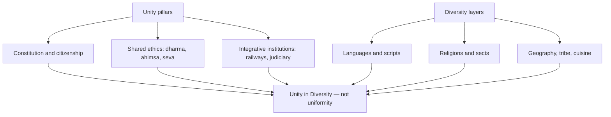

# Salient Features of Indian Society & Culture

> GS-1 · Topic 06 · Indian society, culture, unity in diversity, continuity & change

---

## PYQs

| Year | M | Words | Question (EN) | प्रश्न (HI) | ID |
|------|---|-------|---------------|-------------|-----|
| 2024 | 8 | 125 | Describe the main characteristics of Indian culture. | भारतीय संस्कृति की प्रमुख विशेषताओं का वर्णन कीजिए। | Q1 |
| 2024 | 12 | 200 | Indian society is known for its uniqueness and cultural diversity. Discuss. | भारतीय समाज अपनी विशिष्टता और सांस्कृतिक विविधता के लिए जाना जाता है। चर्चा कीजिए। | Q2 |
| 2023 | 12 | — | How did Indian culture affect the world during Corona pandemic period? | कोरोना महामारी काल में भारतीय संस्कृति ने विश्व को किस प्रकार से प्रभावित किया? | Q3 |
| 2022 | 12 | — | Throw light on the factors of continuity and change in Indian Society. | भारतीय समाज में निरंतरता एवं परिवर्तन के कारकों पर प्रकाश डालिए। | Q4 |
| 2022 | 12 | — | Caste alliances emanate from secular and political factors and do not spring from primordial identities. Discuss. | जातीय गठबंधन धर्मनिरपेक्ष तथा राजनीतिक कारकों से उत्पन्न होते हैं न कि आदिम पहचान से। चर्चा कीजिए। | Q5 |
| 2020 | 8 | 125 | Describe the advantages of India being a composite culture society. | भारत के एक संयुक्त/समग्र सांस्कृतिक समाज होने के लाभों का वर्णन कीजिए। | Q6 |
| 2019 | 12 | 200 | 'Indian Culture is the symbol of Unity in Diversity.' Analyse the statement logically by giving suitable illustrations. | 'भारतीय संस्कृति विविधता में एकता का प्रतीक है।' उपयुक्त उदाहरण देते हुए इस कथन का तार्किक विश्लेषण कीजिए। | Q7 |

---

## Quick Revision

```
INDIAN SOCIETY = Plural · Hierarchical · Continuity-heavy · Regionally diverse · Syncretic

CULTURE (exam): Shared values + rituals + language + art + worldview — NOT only religion
  Core traits: SPIRITUAL (moksha/dharma) | TOLERANT (live & let live) | SYNCRETIC (Bhakti-Sufi)
  | CONTINUITY (caste, joint family, rituals survive modernity) | REGIONAL (22+ languages, food, dress)
  | ORAL-WRITTEN (Vedas → folk) | FESTIVAL ECONOMY | FAMILY-CENTRIC (joint → nuclear shift)

UNITY IN DIVERSITY (Nehru, Tagore, Gandhi):
  Unity = constitutional citizenship, shared civilizational ethos (dharma, ahimsa, hospitality)
  Diversity = language (Eighth Schedule), religion, tribe, cuisine, dress, dance forms
  Illustrations: Kumbh (all castes/regions) | Diwali/Eid shared spaces | Classical + folk (Bharatanatyam/Bhangra)
  | Composite culture = Hindu-Muslim-Sikh-Christian-Jain-Buddhist synthesis in art, music, food

COMPOSITE CULTURE advantages: Social cohesion | Creative synthesis (Indo-Islamic, Ganga-Jamuni tehzeeb)
  | Soft power/tourism | National integration | Resilience against extremism | Innovation from cross-fertilization

CONTINUITY factors: Sacred texts (Vedas, Gita) | Caste/jati endogamy | Joint family ideal
  | Ritual calendar (Kumbh, festivals) | Village panchayat memory | Sanskrit/Pali cultural substratum
  | Colonial resistance reinforced tradition (Gandhi's swadeshi)

CHANGE factors: British modern institutions (education, law, press) | Reform movements (Raja Rammohun, Phule, Ambedkar)
  | Constitution (equality, FRs) | Urbanization/LPG | Technology/media | Women's education & work
  | Legal reforms (Hindu Marriage Act 1955, anti-dowry) | Globalization of youth culture

CASTE ALLIANCES (political sociology — M.N. Srinivas, Rajni Kothari):
  Primordial = birth jati identity (fixed ritual status)
  Political alliance = vote-bank arithmetic, post-Mandal OBC mobilization, NOT pure ritual hierarchy
  Secular factors: development delivery, patronage, candidate winnability, class within caste
  Example: UP/Bihar mahagathbandhan, Dalit-Brahmin experiments — strategic, not ancient jati merger

COVID & INDIAN CULTURE → WORLD:
  Yoga/ pranayama global adoption | Ayurveda/immunity discourse (Ministry of AYUSH guidelines)
  | Vasudhaiva Kutumbakam / Atithi Devo Bhavah in aid diplomacy (vaccine Maitri)
  | Digital diaspora festivals online | Community kitchen (langar/seva) model copied globally
  | Work-from-home + joint family care model debated | Namaste over handshake

CONTEMPORARY: Art 51A(f) | Preamble "unity + integrity" | Ek Bharat Shreshtha Bharat
  | NEP 2020 IKS | UNESCO Kumbh intangible heritage | GI tags for crafts | Incredible India

TRAPS: Diversity ≠ disunity always | Indian culture ≠ only Hindu | Caste ≠ only Hindu (Sikh/Jain/Christian Dalits)
  | Continuity ≠ no change | Composite ≠ homogeneous | Unity in diversity ≠ uniformity
  | Caste alliance ≠ endogamous merger | COVID culture = not only yoga — include seva/diplomacy
```

---

## Content

### Context — What Indian society and culture are

Indian society is the web of institutions through which roughly 1.4 billion people organize life on the subcontinent: family and kinship, caste (jati) and tribe, village and city, religion and class, gender and generation. This structure accumulated over five millennia — from Harappan urbanism through Vedic ritual society, Mauryan and Gupta empires, Bhakti and Sufi movements, Mughal synthesis, British colonial reordering, and the constitutional republic inaugurated in 1950. What makes Indian society analytically distinctive is that ancient institutions survive alongside modern ones: a software engineer in Noida may video-call her grandmother in a Bihar village for a wedding ritual on the same day she submits a quarterly report to a multinational firm.

Indian culture is the shared meaning system that gives those institutions moral and aesthetic grammar. It encompasses philosophy (dharma, karma, moksha, ahimsa), languages and literatures, festivals and life-cycle rituals, dietary and dress codes, music-dance-architecture, and ethical ideals such as *atithi devo bhava* and *vasudhaiva kutumbakam*. Culture here is not synonymous with Hinduism alone: Islam, Christianity, Sikhism, Jainism, Buddhism, Zoroastrianism, Judaism, and hundreds of tribal cosmologies are constitutive threads. Sociologists from G.S. Ghurye to M.N. Srinivas, André Béteille, and Louis Dumont converge on one paradox: India is simultaneously hierarchical and plural, ritual-centric and syncretic, astonishingly continuous and yet undergoing accelerated change since the nineteenth century.

### Salient characteristics of Indian culture

**Spiritual and philosophical depth.** Indian civilization has never treated religion as a compartment separate from ethics, art, or daily conduct. The Upanishads pose ultimate questions about Brahman and Atman; Buddhism articulates the Four Noble Truths; Jainism insists on ahimsa and anekantavada (many-sided truth); Bhakti and Sufi traditions democratize devotion through vernacular poetry. The purusharthas — dharma (righteous duty), artha (material pursuit), kama (desire), moksha (liberation) — frame a balanced life visible in the Mahabharata, Ramayana, and countless folk morality tales. This is why Indian culture feels simultaneously worldly and transcendent: a merchant in Varanasi may begin the day with Ganga arati and end it negotiating commodity prices.

**Religious pluralism and syncretism.** India is the birthplace of Hinduism, Buddhism, Jainism, and Sikhism, and has hosted Islam, Christianity, Zoroastrianism, and Judaism for centuries alongside tribal animist traditions. These faiths coexist, sometimes contest, and often intermix. The Bhakti–Sufi movements of the fourteenth to sixteenth centuries — Kabir, Guru Nanak, Nizamuddin Auliya, Chaitanya, Mirabai — rejected rigid orthodoxy, composed in Awadhi, Braj, and Punjabi, and created the Ganga-Jamuni tehzeeb especially visible in Uttar Pradesh. Proof of syncretism is architectural and musical: the Qutub Minar complex layers Islamic and pre-Islamic stonework; Hindustani classical music blends Persian and Indic scales.

**Continuity with antiquity.** Unlike many civilizations where ancient and modern are severed, India maintains living links to Harappan urbanism, the Vedic corpus, Mauryan and Gupta art, classical Sanskrit, and Tamil Sangam literature. The Kumbh Mela — inscribed as UNESCO Intangible Cultural Heritage in 2017 — connects mythic time to mass contemporary participation at Prayagraj, Haridwar, Nashik, and Ujjain. A pilgrim in 2024 performs rituals whose textual references are millennia old.

**Regional and linguistic diversity.** The Eighth Schedule recognizes 22 languages; hundreds of dialects exist beyond that list. Food cultures range from sattvic vegetarianism to coastal seafood, Mughlai feasts, and tribal foraging traditions. Classical dance forms include Bharatanatyam, Kathak, Odissi, Manipuri, Kuchipudi, Mohiniyattam, and Sattriya; folk forms include Bhangra, Garba, Bihu, and Lavani. Unity operates through shared festivals, cricket, cinema (Bollywood plus regional industries), and constitutional citizenship — not through linguistic uniformity.

**Family-centric social organization.** The joint family ideal — multi-generational, patrilineal, with collective responsibility and elder authority — remains influential though nuclear families rise in metros. Marriage functions as sacrament (sanskar) and alliance between kin networks; arranged marriage persists alongside self-choice, demonstrating continuity and change in the same institution.

**Art, craft, and aesthetic continuity.** Ajanta-Ellora, Khajuraho, Taj Mahal, Hampi, and Konark trace an architectural timeline; living crafts — Banarasi silk, Chikankari of Lucknow, Varanasi metalwork — carry GI tags linking heritage to livelihood. Music gharanas preserve Hindustani and Carnatic traditions; Bollywood functions as a modern folk epic consumed across classes.

**Tolerance and coexistence ethos.** Gandhi's *sarva dharma sambhava* (equal respect for all faiths) expresses a civilizational ideal that the Constitution institutionalized through secularism (Preamble, Articles 25–28). History records partition violence and communal riots, yet the dominant cultural ideal remains inclusive coexistence — visible when gurdwaras serve langar to all regardless of faith.

### Indian society — uniqueness and diversity

| Dimension | Unique / diverse feature | Illustration |
|-----------|-------------------------|--------------|
| Civilizational depth | Unbroken 5000+ year cultural layers | Harappa seals → Vedic fire altars → Mughal miniatures |
| Social structure | Caste (jati) + tribe + class overlap | Srinivas's sanskritization; Ambedkar's annihilation-of-caste critique |
| Religion | Multi-religious, syncretic shrines | Ajmer Sharif, Vrindavan, Golden Temple langar |
| Language | No single national language | UP: Hindi heartland plus Awadhi, Bhojpuri, Braj |
| Rural–urban | 65%+ rural (Census 2011); diverse agrarian cultures | Khadar/Bangar doabs; terrace farming in NE; tank irrigation in Deccan |
| Tribe (Adivasi) | 8.6% population (2011); distinct kinship | Gond, Santhal, Bhil, Naga — PESA 1996 protects gram sabha culture |
| Gender | Patrilineal norms vs goddess worship | Rani Lakshmibai, Lata Mangeshkar, Kalpana Chawla |
| Diaspora | 32 million+ overseas Indians | Diwali public holidays abroad; yoga globalized |

India's uniqueness lies in scale plus diversity plus simultaneous modernity and tradition — mobile phones alongside temple rituals, IT hubs alongside arranged-marriage portals. Amartya Sen highlights the political uniqueness: universal adult franchise from 1950 despite low per-capita income and mass illiteracy — democracy sustained before prosperity, unlike the Western sequence.

### Composite culture — meaning and advantages

Composite culture means cultures blend without erasing distinct identities. Indo-Islamic architecture (Qutub Minar, Taj Mahal), Urdu-Hindi rekhta, biryani and pulao, Hindustani classical (Khayal, thumri), and Sikh gurdwara seva traditions exemplify synthesis. The Ganga-Jamuni tehzeeb of Lucknow, Varanasi, and Delhi shows Shia–Sunni and Hindu–Muslim neighbourhoods sharing Holi colours and Muharram processions.

| Advantage | Mechanism | Proof |
|-----------|-----------|-------|
| Social cohesion | Cross-cutting ties reduce sectarian isolation | Mixed mohallas in Varanasi-Lucknow belt |
| Creative synthesis | Interaction produces new art, music, cuisine | Indo-Islamic architecture; Hindustani music |
| National integration | Shared symbols atop diversity | Tricolour, Constitution, cricket unify without homogenizing |
| Soft power | Global appeal of yoga, Bollywood, cuisine | UNESCO Yoga (2016); International Day of Yoga (UN 2014) |
| Resilience | Composite memory counters exclusive nationalism | Bhakti-Sufi saints as dialogue precedent |
| Economic tourism | Heritage circuits monetize plural heritage | PRASAD/Swadesh Darshan: Sufi, Buddhist, Ramayana trails |
| Conflict management | Constitutional FRs plus syncretic tradition | Articles 25–28; langar/seva ethics |

### Unity in Diversity — analytical framework

Unity operates at three levels: political (single citizenship, Union of States), civilizational (ethos of dharma, tolerance, ahimsa), and institutional (Parliament, judiciary, All India Services, railways). Diversity spans religion, language, ethnicity, cuisine, dress, folklore, and ecology-adapted lifestyles. The Constitution transforms diversity from an imperial administrative problem into a democratic resource through federalism, linguistic states (States Reorganisation Act 1956), minority rights (Articles 29–30), and SC/ST protections.



Illustrations: Kumbh Mela draws millions across regions and castes to one sacred geography; Independence Day is celebrated nationally with locally distinctive performances; the three-language formula promotes pluralism with link languages; armed forces recruit regiments from all regions; during COVID-19, gurdwaras, temples, and mosques ran community kitchens demonstrating unity in service.

Logical analysis of the statement "Indian Culture is the symbol of Unity in Diversity": Premise one — immense pluralism (22 languages, six major religions, tribal cultures) protected by Articles 29–30. Premise two — unity through citizenship, Preamble fraternity, federal Union, shared festivals. Logical link — diversity becomes democratic resource when institutions guarantee equal dignity; counter-evidence (Partition, riots, linguistic disputes) shows unity is an ongoing project, not automatic — which strengthens the need for the ideal.

### Continuity and change — factors

| Continuity factors | Change factors |
|--------------------|----------------|
| Sacred texts and ritual calendar (Vedas, Puranas, Islamic lunar calendar) | Colonial modernity: English education, railways, census codifying caste |
| Endogamous jati marriage norms (strong in rural UP) | Social reform: Rammohun Roy (1829 sati ban), Phule, Periyar, Ambedkar |
| Joint family ideal and elder authority | Urban nuclear families, women workforce, double-income households |
| Village community memory: panchayat, cooperative irrigation | Green Revolution, MGNREGA, migration remittances |
| Sanskrit/Persian cultural prestige | Mass media: Ramayan (1987 TV effect), social media, OTT |
| Gandhi's swadeshi reinforced indigenous pride | LPG 1991: consumer culture, MNCs, global fashion |
| Caste-based occupation memory | Constitution Articles 14–17, reservations |
| Oral tradition: folk tales, bhajans, qawwali | Legal reforms: Hindu Code Acts, Special Marriage Act, anti-dowry laws |
| Pilgrimage networks unchanged for centuries | Digital India: UPI, e-governance, online distance education |
| Guru–shishya parampara in classical arts | NEP 2020: multidisciplinary education, IKS formalized |

Indian society is not static. Srinivas's sanskritization (lower groups emulating upper ritual norms) and westernization describe cultural mobility within continuity; Béteille notes hierarchy persists but content changes — caste enters politics, not merely ritual rank. Reform and Constitution renegotiate tradition rather than erase it, producing selective modernization anchored in civilizational memory.

### Caste alliances — secular and political vs primordial identity

Primordial identity, in Louis Dumont's framework, is ascribed jati at birth with ritual rank and endogamy rules — a stable cultural identity reproduced through marriage and occupation memory. Political caste alliance is different: it is an electoral coalition of jati groups for vote arithmetic. Rajni Kothari documented how the Congress system gave way after 1967 to competitive caste mobilization; the Mandal Commission (1990) and OBC reservations intensified strategic OBC bloc formation.

Secular factors drive alliances: candidate winnability, patronage and local development delivery, anti-incumbency, class splits within jati (rich versus poor Yadav), and gender-youth interests cutting across ritual lines. These are not ancient ritual mergers. Mahagathbandhan experiments in UP-Bihar, BSP-Brahmin outreach (2007), and RJD-JDU OBC combinations are strategic and often short-lived, reconfigured each election. Proof: the same jati splits across parties (Yadav voters divided between RJD and BJP).

Balanced view: jati supplies identity anchors — leaders deploy Dalit pride or OBC pride symbols even when formation logic is political. Srinivas argued caste adapts under democracy; it does not disappear. Alliances do not erase jati boundaries or create new unified ritual communities — they are contingent secular bargains where caste functions as a resource for power, not a frozen ritual order reproduced intact from antiquity.

### Bhakti and Sufi movements in composite culture

Bhakti reformers (Kabir, Guru Nanak, Chaitanya, Mirabai) and Sufi syncretists (Nizamuddin Auliya, Amir Khusrau of the Chishti order) democratized devotion in the fourteenth to sixteenth centuries. They used vernacular languages (Awadhi, Braj, Punjabi), rejected ritual rigidity, and emphasized love, equality, service, and tolerance — laying foundations of Ganga-Jamuni tehzeeb in UP. Cultural legacy includes Hindustani music, Urdu, shared festival spaces, and langar/seva ethics in gurdwaras and temples today. Indian unity grows through interaction and shared humanism, not suppression of religious difference.

### Indian culture during COVID-19 — global impact

During the COVID-19 pandemic, Indian cultural idioms gained global visibility. Yoga and pranayama — already institutionalized through International Day of Yoga (UN 2014) — were promoted by WHO and global health bodies as home wellness tools during lockdowns. Ministry of AYUSH guidelines on kadha, turmeric, and giloy circulated among diaspora communities; scientific debate continues, but cultural export is undeniable. Vasudhaiva Kutumbakam framed India's Vaccine Maitri (2021) as civilizational seva diplomacy. Gurdwara langar models were replicated globally; temples and mosques ran food relief. Namaste replaced the handshake in diplomatic and corporate protocol. Diaspora streamed Durga Puja, Navrati, Eid, and Christmas online — culture as resilience during isolation. Reverse migration briefly highlighted intergenerational care in Indian households versus Western nursing-home models. Limits: India did not "solve" COVID through culture; Ayurveda claims require scientific validation; culture supplemented, not replaced, modern medicine.

### Globalization and Indian family patterns

Globalization since LPG 1991 accelerates nuclearization, women's autonomy, and digital matchmaking, yet family ideals of duty, elder care, and kinship festivals persist in modified form. IT hubs (Bengaluru, Noida) show smaller households and geographic mobility; matrimonial platforms and delayed marriage coexist with parental approval and kin networks dominant in UP and rural India. Festival reunions maintain bonds despite distance; elder care continues via remittances and visits. Legal frameworks (Special Marriage Act, domestic violence laws, Hindu Marriage Act) mediate tradition versus rights. Globalization filters through caste, class, and region — selective modernization, not wholesale Westernization.

### Contemporary relevance

The Preamble commits to unity and integrity of the Nation; Article 51A(f) values composite culture; Articles 29–30 protect minority culture and education. Ek Bharat Shreshtha Bharat (2015) pairs states for language, food, and festival exchange. NEP 2020 embeds Indian Knowledge Systems — Sanskrit, Ayurveda, yoga, classical arts — in curriculum. UNESCO intangible heritage listings (Kumbh Mela 2017, Yoga 2016) recognize living culture. GI tags for UP crafts (Banarasi brocade, Chikankari, Varanasi glass beads) tie Make in India and ODOP to livelihood. Tourism circuits (Swadesh Darshan, PRASAD) develop Ramayana, Buddhist (Sarnath-Kushinagar), and Sufi trails in Varanasi, Ayodhya, Lucknow. Digital India (UPI, BharatNet) connects village rituals to diaspora via live streaming. Supreme Court judgments on Sabarimala, triple talaq, and Section 377 show law mediating tradition versus rights.

### Limits and balanced view

Unity in diversity is aspiration and institutional goal, not always social reality — communal violence, linguistic chauvinism, and caste atrocities persist. Composite culture is uneven — stronger in syncretic centres, weaker where segregation exists. Continuity can preserve inequality (patriarchy, caste discrimination); reformers argued change is moral necessity. COVID cultural export requires balanced scientific claims for Ayurveda. Caste alliances risk reducing complex voters to identity blocks. Diversity does not always strengthen unity. Joint family has not disappeared — nuclear rise in cities coexists with rural practice and cultural ideal. Sanskritization is not westernization: Srinivas defined sanskritization as lower-caste emulation of upper ritual norms — a distinct mechanism from westernization.

---

## Answers

> **UPPCS topper format:** Introduction → labelled points (**Characteristic — proof**) → underline keywords → 30-sec exam diagram → conclusion.  
> **125W / 8M** = 6–8 points · **200W / 12M** = 7–9 points · every point starts with an **exam keyword**.

---

### Q1: Describe the main characteristics of Indian culture. (2024, 8M, 125W)

**Introduction:**
> Indian culture is one of the world's oldest **continuous civilizations**, shaped by the synthesis of **Vedic, Buddhist, Jain, Islamic, Sikh** and modern influences — marked by **continuity amidst diversity**.

**Main Characteristics:**
- **Unity in Diversity** — Coexistence of numerous religions, **22 scheduled languages**, ethnicities and regional traditions under one citizenship.
- **Ancient yet Continuous** — Living heritage from **Indus Valley** and **Vedic age** to **Ajanta art** and **Kumbh Mela** (UNESCO 2017).
- **Assimilative / Syncretic Nature** — Absorbed **Persian, Central Asian, European** influences; **Ganga-Jamuni tehzeeb** (Kabir, Nizamuddin Auliya).
- **Spiritual & Ethical Orientation** — Core values: **Dharma, Karma, Moksha, Ahimsa, Satya** across Indic faiths.
- **Pluralism & Secular Outlook** — **Sarva Dharma Sambhava**; constitutional secularism (**Articles 25–28**).
- **Family & Community Values** — **Joint family**, **atithi devo bhava**, collective festivals and social harmony.
- **Rich Artistic Heritage** — Classical dance (**Bharatanatyam, Kathak**), **Hindustani music**, architecture (**Taj Mahal**), handicrafts (**Banarasi, Chikankari**).
- **Adaptability** — Preserves tradition while embracing **NEP 2020, LPG, digital India** and global exchange.

**Keywords (underline in exam):** Unity in Diversity · Assimilative Nature · Composite Culture · Continuity · Sarva Dharma Sambhava · Vasudhaiva Kutumbakam

**Exam diagram (30 sec):**
```
            Indian Culture
                 │
    ┌────────────┼────────────┐
Unity in    Spiritual &    Assimilative
Diversity   Ethical Values   Nature
    │            │              │
Continuity  Family Values  Art Heritage
    └────────────┼────────────┘
         Adaptability
```

**Conclusion:**
> Thus, Indian culture is characterized by **continuity, diversity, inclusiveness and resilience** — a unique model of **cultural coexistence** and a source of **national unity**.

---

### Q2: Indian society is known for its uniqueness and cultural diversity. Discuss. (2024, 12M, 200W)

**Introduction:**
> Indian society is globally unique for combining **civilizational depth**, **democratic scale** and **multi-layered diversity** — a plural order where tradition and modernity coexist.

**Main Points:**
- **Civilizational Uniqueness** — Unbroken cultural layers from **Harappa** to republic; democracy at low income (**Amartya Sen**).
- **Religious Diversity** — Birthplace of **Hinduism, Buddhism, Jainism, Sikhism**; home to **Islam, Christianity, Zoroastrianism**; syncretic shrines (**Ajmer Sharif, Golden Temple langar**).
- **Linguistic & Regional Diversity** — **Eighth Schedule** languages; **UP** alone has **Hindi, Awadhi, Bhojpuri, Braj**; distinct cuisines and folk forms (**Bhangra, Garba, Bihu**).
- **Social Structural Diversity** — **Caste (jati)**, **tribe (8.6%)**, class overlap; **M.N. Srinivas** — **sanskritization** shows mobility within hierarchy.
- **Rural–Urban Dualism** — **IT metros + village panchayats**; **mobile phones + temple rituals** — rare hybrid modernity.
- **Integrative Mechanisms** — **Constitution**, **linguistic states (1956)**, **railways, armed forces**, **cricket/Bollywood**, **Ek Bharat Shreshtha Bharat**.
- **Family & Festival Unity** — **Joint family** ideal, **Diwali/Eid/Baisakhi** on shared calendar — diversity in form, common rhythm.
- **Global Diaspora Spread** — **32 million+** overseas Indians export **yoga, Diwali, cuisine** — diversity as **soft power**.
- **Contemporary Reinforcement** — **NEP 2020 IKS**, **GI tags**, **Article 51A(f)** — state nurtures plural identity.

**Keywords (underline):** Cultural Pluralism · Syncretism · Sanskritization · Unity in Diversity · Composite Culture · Soft Power

**Exam diagram (30 sec):**
```
     Indian Society
          │
   ┌──────┴──────┐
Unique        Diverse
   │              │
Democracy+    Language·Religion
Tradition     Caste·Tribe·Region
   └──────┬──────┘
    Constitution
    binds both
```

**Conclusion:**
> Uniqueness lies not in homogeneity but in **constitutional and civilizational capacity** to hold immense diversity together — an ongoing democratic achievement.

---

### Q3: How did Indian culture affect the world during Corona pandemic period? (2023, 12M)

**Introduction:**
> During **COVID-19**, Indian cultural idioms — **wellness, seva, plural spirituality and Vasudhaiva Kutumbakam** — gained global visibility as coping tools, service models and diplomatic language.

**Main Points:**
- **Yoga & Pranayama Export** — Home practice surged worldwide; **International Day of Yoga (UN 2014)** framed breathing as wellness tool during lockdowns.
- **AYUSH & Immunity Discourse** — **Ministry of AYUSH** promoted **turmeric, kadha, giloy**; diaspora adopted Indian wellness idioms globally.
- **Seva / Community Kitchen Model** — **Gurdwara langar**, temple and mosque **food relief** in India and abroad — **faith-based service** replicated during hunger crises.
- **Namaste as Global Greeting** — Replaced handshake in **diplomacy, WHO briefings, corporates** — Indian **non-contact courtesy** went universal.
- **Vaccine Maitri Diplomacy (2021)** — **Vasudhaiva Kutumbakam** ("world is one family") — vaccine sharing as **civilizational hospitality**.
- **Digital Cultural Continuity** — Diaspora streamed **Durga Puja, Navratri, Eid** online — **ritual resilience** model for isolated communities globally.
- **Joint-Family Care Debate** — Reverse migration highlighted **intergenerational care** in Indian households vs Western elder institutions.
- **Limits (balanced line)** — Ayurveda claims debated scientifically; culture **supplemented**, did not replace, modern medicine.

**Keywords (underline):** Vasudhaiva Kutumbakam · Seva · Yoga · AYUSH · Vaccine Maitri · Soft Power

**Exam diagram (30 sec):**
```
  Indian Culture → World (COVID)
         │
  ┌──────┼──────┐
Wellness  Service  Diplomacy
Yoga·AYUSH Langar·Seva Vaccine Maitri
  └──────┼──────┘
   Namaste · Digital Festivals
```

**Conclusion:**
> COVID amplified India's **living cultural ethics** — wellness, service and plural ritual — projecting **humanitarian soft power** rooted in civilizational values.

---

### Q4: Throw light on the factors of continuity and change in Indian Society. (2022, 12M)

**Introduction:**
> Indian society shows **remarkable continuity** in kinship, ritual and hierarchy alongside **accelerated change** through law, economy and technology — both operate **simultaneously**, not as opposites.

**Main Points — Continuity:**
- **Sacred Tradition** — **Vedas, epics, Kumbh pilgrimage**, festival calendar sustain shared civilizational time.
- **Caste & Endogamy** — **Jati** marriage norms persist; **M.N. Srinivas** — caste **adapts**, does not vanish.
- **Joint Family Ideal** — Multi-generational authority, property pooling — strong in rural **UP** despite urban shift.
- **Oral & Ritual Culture** — Folk tales, **bhajans, qawwali**, guru–shishya **parampara** in classical arts.

**Main Points — Change:**
- **Colonial Modernity** — English education, **census**, railways, courts **codified** social categories.
- **Social Reform Movements** — **Rammohun Roy** (1829 sati ban), **Phule, Periyar, Ambedkar** challenged hierarchy.
- **Constitutional Revolution** — **Articles 14–17**, **reservations**, **Hindu Code Acts** — legal equality drive.
- **Economic & Urban Forces** — **Green Revolution, LPG 1991, MGNREGA**, migration → **nuclear families**, working women.
- **Media & Technology** — **Ramayan (1987)**, **social media, UPI, OTT** — new carriers of old myths and new identities.

**Synthesis:** **Sanskritization / westernization** (Srinivas) — mobility **within** continuity; **André Béteille** — hierarchy persists but **content changes**.

**Keywords (underline):** Continuity · Social Change · Sanskritization · Constitutionalism · Modernization

**Exam diagram (30 sec):**
```
   Indian Society
        │
  ┌─────┴─────┐
CONTINUITY   CHANGE
Veda·Caste   Reform·Constitution
Joint Family LPG·Urbanization
  └─────┬─────┘
 Tradition + Modernity
   co-present
```

**Conclusion:**
> India is a **layered society** — reform and Constitution **renegotiate** tradition rather than erase it, producing **selective modernization** anchored in civilizational memory.

---

### Q5: Caste alliances emanate from secular and political factors and do not spring from primordial identities. Discuss. (2022, 12M)

**Introduction:**
> **Caste alliances** in democratic India are primarily **electoral coalitions** driven by **secular interests and power arithmetic** — distinct from **primordial jati identity** or ancient ritual merger.

**Main Points:**
- **Primordial Identity (concept)** — **Ascribed jati** at birth, ritual rank (**Louis Dumont**), **endogamy** — stable cultural identity.
- **Political Caste Alliance (concept)** — **Electoral bloc** of jati groups for votes — **Rajni Kothari** — caste enters **competitive politics** post-1967.
- **Mandal Catalyst** — **1990 OBC reservations** intensified **OBC mobilization** — alliances became **strategic**, not ritual.
- **Secular Factors** — **Development delivery, patronage, candidate winnability**, **class splits within jati**, anti-incumbency — interest over ritual rank.
- **Empirical Evidence** — Same jati splits across parties (**Yadav: RJD vs BJP**); **BSP-Brahmin (2007)**, **UP-Bihar mahagathbandhans** — **short-lived**, renegotiated each election.
- **Not Endogamous Merger** — Alliances do **not** erase jati boundaries or create new unified ritual communities.
- **Balanced View** — Leaders **use** caste symbols (**Dalit/OBC pride**) for mobilization, but **formation logic is political**, not genealogical — **M.N. Srinivas**: caste **transforms** under democracy.

**Keywords (underline):** Primordial Identity · Vote Bank · Secular Factors · Mandal · Political Arithmetic

**Exam diagram (30 sec):**
```
  Caste in Politics
        │
   ┌────┴────┐
Primordial  Political
(jati birth) (Alliance)
   │           │
Endogamy    Patronage·
Ritual rank  Development·
             Mandal math
```

**Conclusion:**
> Caste remains a **live social institution**, but **alliances are contingent secular bargains** — caste functions as a **resource for power**, not a frozen ritual order reproduced intact from antiquity.

---

### Q6: Describe the advantages of India being a composite culture society. (2020, 8M, 125W)

**Introduction:**
> India's **composite culture** — **Hindu, Muslim, Sikh, Christian, Jain, Buddhist** and tribal streams interwoven — strengthens **national cohesion, creativity and resilience**.

**Main Advantages:**
- **Social Cohesion** — **Ganga-Jamuni tehzeeb** of **Lucknow–Varanasi**; shared neighbourhoods and festivals reduce sectarian isolation.
- **Creative Synthesis** — **Indo-Islamic architecture** (Taj Mahal, Qutub Minar), **Hindustani music, Urdu-Hindi**, **biryani** — innovation from interaction.
- **National Integration** — Common symbols — **Tricolour, Constitution, cricket** — atop religious diversity; **Article 51A(f)** values composite heritage.
- **Tolerance & Conflict Management** — Syncretic saints (**Kabir, Guru Nanak**) and **langar/seva** offer inclusive alternative to extremism.
- **Soft Power & Tourism Economy** — **Yoga, Bollywood, Sufi/Buddhist circuits** — **PRASAD, Swadesh Darshan** monetize heritage.
- **Democratic Stability** — Cross-cutting identities prevent single exclusive nationalism from dominating public life.
- **Global Appeal** — **Vasudhaiva Kutumbakam** ethos attracts diaspora and international cultural exchange.

**Keywords (underline):** Composite Culture · Ganga-Jamuni Tehzeeb · Syncretism · National Integration · Soft Power

**Exam diagram (30 sec):**
```
   Composite Culture
          │
  ┌───────┼───────┐
Cohesion Synthesis Integration
  │        │         │
Tolerance Tourism  Resilience
  └───────┼───────┘
    Unity without
    uniformity
```

**Conclusion:**
> Composite culture converts **diversity into civilizational strength** — fostering **unity without forced uniformity** and enriching India's democratic experiment.

---

### Q7: 'Indian Culture is the symbol of Unity in Diversity.' Analyse the statement logically by giving suitable illustrations. (2019, 12M, 200W)

**Introduction:**
> The statement is **logically valid** as a **normative civilizational ideal**: India binds **immense pluralism** through **shared ethics, institutions and citizenship** — unity means **integration**, not **uniformity**.

**Logical Analysis:**
- **Premise of Diversity** — **22 languages**, six major religions, **tribal cultures**, regional cuisines/dance — protected by **Art 29–30**.
- **Premise of Unity** — **Single citizenship**, **Preamble** (sovereignty, fraternity), **federal Union**, **All India Services**, shared festivals.
- **Logical Link** — Diversity is **not contradiction** but **democratic resource** when institutions guarantee **equal dignity**.

**Illustrations:**
- **Kumbh Mela** — Millions, all regions/castes, one sacred geography (**Prayagraj, Haridwar** — UNESCO 2017).
- **Armed Forces & Railways** — All-India recruitment — diversity in origin, unity in service.
- **Bhakti–Sufi Composite Spirituality** — **Kabir, Nizamuddin Auliya, Amir Khusrau**; **Ajmer Sharif** visited by all faiths.
- **Constitutional & Policy Framework** — **Ek Bharat Shreshtha Bharat**, **Three-Language Formula**, **NEP 2020 IKS**.
- **Counter-evidence (balanced logic)** — **Partition, communal riots, linguistic disputes** show unity is **ongoing project**, not automatic — strengthens need for the ideal.

**Keywords (underline):** Unity in Diversity · Pluralism · Composite Culture · Constitutional Morality · Integration

**Exam diagram (30 sec):**
```
  Unity in Diversity
        │
   ┌────┴────┐
 UNITY    DIVERSITY
Constitution  Language·Religion
Citizenship   Region·Tribe
   └────┬────┘
  Kumbh·Forces·Bhakti-Sufi
     prove both
```

**Conclusion:**
> Indian culture symbolizes **unity in diversity** because it **institutionalizes pluralism** — through **tolerance ethos, composite art and democratic federalism** — while treating difference as **national wealth**, not threat.

---

### Q8: *Likely variant:* Explain the role of Bhakti and Sufi movements in shaping India's composite culture. (Likely, 8M, 125W)

**Introduction:**
> **Bhakti and Sufi movements** (14th–16th c.) democratized devotion, used **vernacular languages** and bridged **Hindu–Muslim divides** — laying foundations of India's **composite culture**.

**Main Points:**
- **Bhakti Reform** — **Kabir, Guru Nanak, Chaitanya, Mirabai** rejected ritual rigidity; **nirguna/saguna** devotion in **Awadhi, Braj, Punjabi**.
- **Sufi Syncretism** — **Chishti order** — **Nizamuddin Auliya, Amir Khusrau** at **Delhi/Ajmer** — **qawwali, sama**, openness to local traditions.
- **Vernacular Democratization** — Devotion in **people's languages**, not only Sanskrit/Persian — mass cultural participation.
- **Shared Ethical Core** — Emphasis on **love, equality, service, tolerance** — basis of **Ganga-Jamuni tehzeeb** in **UP**.
- **Cultural Legacy** — **Hindustani music, Urdu, shared festivals**; **langar/seva** ethics in gurdwaras and temples today.
- **Contemporary Relevance** — **Ajmer Sharif, Varanasi** pilgrimage; **NEP 2020 IKS** studies medieval synthesis.

**Keywords (underline):** Bhakti · Sufi · Ganga-Jamuni Tehzeeb · Syncretism · Vernacular · Composite Culture

**Exam diagram (30 sec):**
```
  Bhakti + Sufi
       │
  ┌────┴────┐
Bhakti     Sufi
Kabir·Nanak Nizamuddin·Khusrau
  └────┬────┘
Ganga-Jamuni Tehzeeb
= Composite Culture
```

**Conclusion:**
> Bhakti–Sufi synthesis proves Indian unity grows through **interaction and shared humanism**, not suppression of religious difference.

---

### Q9: *Likely variant:* Discuss how globalization is changing Indian family and marriage patterns while traditional values persist. (Likely, 12M, 200W)

**Introduction:**
> **Globalization (LPG 1991+)** accelerates **nuclearization, women's autonomy and digital matchmaking**, yet **Indian family ideals** of duty, elder care and kinship festivals **persist in modified form**.

**Main Points — Change:**
- **Nuclear Family Rise** — Urban **IT hubs** (Bengaluru, Noida) — smaller households, geographic mobility.
- **Marriage Pattern Shift** — **Delayed marriage**, **online matrimonial platforms**, **working women**, **live-in relationships** in metros (legally debated).
- **Global Culture Influence** — **Western media, OTT, NRI remittance culture** reshape youth lifestyle and consumption.
- **Women's Dual Burden** — Education + employment alongside **continuing domestic role expectations** — **patriarchy adapts**, not vanishes.

**Main Points — Continuity:**
- **Arranged Marriage Majority** — Parental approval and **kin network** still dominant in **UP and rural India**.
- **Festival-Centric Kinship** — **Diwali, Holi, Eid** reunions maintain bonds despite physical distance.
- **Elder Care Ethic** — **Joint-family responsibility** often via remittances and visits, not always co-residence.
- **Legal–Cultural Tension** — **Special Marriage Act**, **domestic violence laws**, **Hindu Marriage Act** mediate tradition vs rights.

**Synthesis:** Globalization filters through **caste, class, region** — **selective modernization**, not wholesale Westernization.

**Keywords (underline):** Globalization · Nuclear Family · Arranged Marriage · Patriarchy · Selective Modernization

**Exam diagram (30 sec):**
```
  Indian Family
       │
  ┌────┴────┐
 CHANGE   CONTINUITY
Nuclear    Arranged marriage
Working    Festival kinship
women      Elder care ethic
  └────┬────┘
Selective Modernization
```

**Conclusion:**
> Indian family is **neither fully traditional nor fully Western** — globalization produces **hybrid kinship** where **enduring values** coexist with **new autonomy and technology**.

---

## Traps

| Wrong | Correct |
|-------|---------|
| Indian culture = only Hindu religion | **Multi-religious** — Hindu, Muslim, Sikh, Christian, Jain, Buddhist, tribal |
| Unity in diversity = cultural uniformity | Unity = **constitutional + civilizational** bond; diversity **continues** |
| Composite culture = complete homogeneity | **Blend without erasing** distinct identities — **Indo-Islamic** synthesis |
| Caste exists only in Hinduism | **Dalit Sikh/Christian**, caste-like stratification debated across communities |
| Continuity means Indian society is static | **Reform, law, LPG, media** drive **rapid parallel change** |
| Caste political alliance = endogamous jati merger | **Electoral coalition** — often **cross-party, short-term** |
| Primordial identity alone explains voting | **Secular factors** — development, patronage, leadership — **equally decisive** |
| COVID question = only yoga export | Include **seva, Namaste, Vaccine Maitri, digital festivals** |
| Diversity always strengthens unity | **Communal/linguistic conflict** possible — unity is **ongoing project** |
| Joint family disappeared in India | **Nuclear rise in cities** but **ideal + rural practice** persist |
| Sanskritization = westernization | **Srinivas:** sanskritization = **lower caste emulating upper ritual norms** — different from westernization |
| Kumbh Mela is only Hindu tourism | **UNESCO intangible heritage** — mass **multi-region** participation |
| Bhakti and Sufi were identical | **Parallel** movements — shared **vernacular, anti-orthodoxy**, distinct theological roots |
| Composite culture ignores conflict | **Partition, riots** happened — composite culture is **achievement and aspiration**, not full history |

---

*Complete.*
