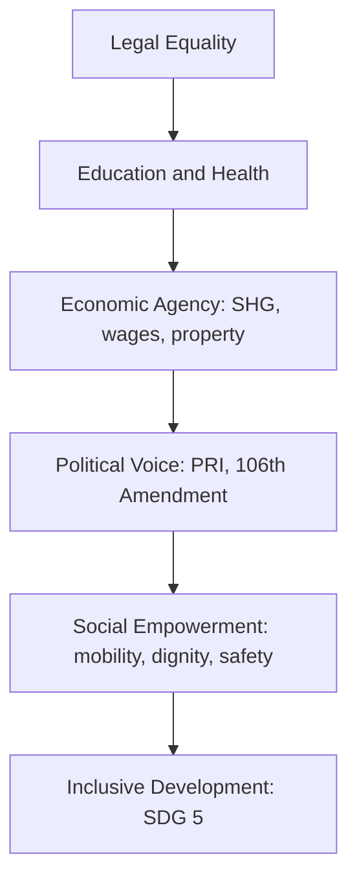

# Women — Status, Organisations & Empowerment

> GS-1 · Topic 07 · Women in society, women's organisations, empowerment, crime

---

## PYQs

| Year | M | Words | Question (EN) | प्रश्न (HI) | ID |
|------|---|-------|---------------|-------------|-----|
| 2024 | 8 | 125 | Explain the contribution of women's organisation in the development of Indian rural society. | भारतीय ग्रामीण समाज के विकास में महिला संगठनों के योगदान का वर्णन कीजिए। | Q1 |
| 2023 | 8 | — | Do you agree with the statement that crime against women in India is increasing? | क्या आप सहमत हैं कि भारत में महिलाओं के प्रति अपराध में वृद्धि हो रही है? | Q2 |
| 2023 | 12 | — | Evaluate the role of woman organisations in woman empowerment. | महिला सशक्तिकरण में महिला संगठनों की भूमिका का मूल्यांकन कीजिए। | Q3 |
| 2021 | 12 | 200 | Why social empowerment of women is necessary for inclusive development? Elaborate in detail. | समावेशी विकास के लिए महिलाओं का सामाजिक सशक्तिकरण क्यों आवश्यक है? विस्तारपूर्वक वर्णन कीजिए। | Q4 |
| 2020 | 8 | 125 | Critically examine the contributions of major women's organisations in contemporary India. | समकालीन भारत में प्रमुख महिला संगठनों के योगदानों का आलोचनात्मक परीक्षण कीजिये। | Q5 |
| 2018 | 8 | 125 | Evaluate the changing status of women in India. | भारत में स्त्रियों की बदलती प्रतिष्ठा का मूल्यांकन कीजिए। | Q6 |

---

## Quick Revision

```
WOMEN STATUS = Legal equality (Constitution) + Persistent social-economic gaps (patriarchy, unpaid care)

HISTORICAL ARC: Purdah/sati reform (Raja Rammohun Roy, Ishwar Chandra Vidyasagar) → Gandhian satyagraha
  (Kasturba, Sarojini Naidu) → Constitution (Art 14/15/16, DPSP 39/42) → 73rd/74th (1/3 PRI seats)
  → 106th Amendment 2023 (33% LS/Assemblies) → still low LFPR (~24% PLFS), son preference (NFHS-5)

EMPOWERMENT DIMENSIONS:
  Economic = wages, property, SHGs, MGNREGA workdays | Political = PRI, reservation, voting
  Social = education, mobility, voice, freedom from violence | Legal = courts, NCW, special laws

MAJOR ORGS:
  AIWC 1927 (Margaret Cousins, Delhi) — education, health, legislative reform
  NFIW 1954 (communist-led federation) — workers, peasants, anti-price rise
  SEWA 1972 (Ela Bhatt, Ahmedabad) — informal sector, union + cooperative + bank
  MKSS 1990s (Aruna Roy, Rajasthan) — RTI, jan sunwai, wage transparency
  Mahila Samakhya (1989, MHRD/now MoWCD) — education for empowerment, collectives
  Kudumbashree 1998 (Kerala) — NHG network, micro-enterprise
  SHG-Bank Linkage (NABARD 1992) — 12+ crore women linked nationally

RURAL DEV CONTRIBUTION: SHGs → credit + livelihood | Mahila mandals → sanitation (Swachh Bharat)
  | Anganwadi/ASHA frontline | Water-user groups | Legal literacy (Protection of Women from DV Act 2005)
  | Panchayat leadership (PRI reservation) | Food security (Annapurna/ration vigilance)

CRIME AGAINST WOMEN (debate Q):
  NCRB registers rise in recorded cases — better reporting + new offences (Sec 498A, POCSO, digital)
  BUT under-reporting in rural/tribal areas persists | Dowry deaths, rape, cruelty by husband still high
  Answer: PARTIAL YES — recorded crimes ↑; also awareness ↑; structural patriarchy remains root

KEY LAWS: Dowry Prohibition 1961 | DV Act 2005 | Vishaka 1997 → POSH 2013 | POCSO 2012
  | Triple Talaq Act 2019 | Sexual Harassment at Workplace | Medical Termination of Pregnancy (amended)

CONSTITUTION: Art 14 equality | Art 15(3) special provisions | Art 16 opportunity | Art 39(a)(d)(e) DPSP
  | Art 42 maternity | Art 51A(e) renounce derogatory practices | Art 243D/243T 1/3 PRI reservation

SCHEMES: Beti Bachao Beti Padhao 2015 | Mission Shakti (2021 umbrella) | Nirbhaya Fund
  | Sukanya Samriddhi | PM Matru Vandana | One Stop Centres | Mahila Police Volunteers

CONTEMPORARY: 106th Amendment (Nari Shakti Vandan Adhiniyam) | Mission Shakti | Digital Shakti
  | NFHS-5 sex ratio at birth improving in some states | Gig/platform worker rights debate

TRAPS: Status improved ≠ full equality | Crime data ↑ ≠ only more crime (reporting effect)
  | SHG ≠ only microcredit — also social capital | Women's org ≠ only urban elite (grassroots strong)
  | Social empowerment ≠ only economic | Reservation ≠ substitute for behavioural change
  | Sati banned 1829 ≠ all practices ended | Legal rights ≠ effective access in courts/police
```

---

## Content

### Context — Women in Indian society

Indian society has historically been patrilineal and patriarchal: property, ritual authority, and public decision-making centred on men, while women's roles were defined through marriage, motherhood, and domestic labour, often under purdah, child marriage, and dowry systems in many regions. The nineteenth century opened a reform arc — Raja Rammohun Roy campaigned against sati (abolished 1829); Ishwar Chandra Vidyasagar pushed the Widow Remarriage Act 1856; Jyotirao and Savitribai Phule opened schools for girls in Pune (1848); Pandita Ramabai worked on women's education; Gandhi mobilized women in nationalist struggle through Kasturba Gandhi, Sarojini Naidu, and Aruna Asaf Ali. Independent India promised formal equality through the Constitution, yet son preference, violence, low workforce participation, unpaid care burden, and under-representation at economic and political apex persist. The central analytical tension is legal progress versus social lag — how constitutional guarantees translate into lived freedom for half the population.

### Changing status of women — continuity and change

**Legal and political gains.** The Constitution guarantees equality (Articles 14, 15, 16), directs the state toward adequate livelihood, equal pay, dignity, and maternity relief (Articles 39(a)(d)(e), 42), and enjoins citizens to renounce practices derogatory to women's dignity (Article 51A(e)). The 73rd and 74th Amendments (1992) reserve not less than one-third of seats and chairpersons for women in Panchayati Raj and urban local bodies — some states adopted 50% voluntarily. The 106th Constitutional Amendment (2023) — Nari Shakti Vandan Adhiniyam — provides 33% reservation for women in Lok Sabha and State Assemblies (implementation phased post-delimitation/census). Personal law reforms include Hindu Marriage Act 1955, Special Marriage Act, and Muslim Women (Protection of Rights on Marriage) Act 2019 criminalizing triple talaq.

| Domain | Milestone | Significance |
|--------|-----------|--------------|
| Constitution | Articles 14, 15, 16 | Equality, non-discrimination, equal opportunity |
| DPSP | Articles 39(a)(d)(e), 42 | Livelihood, equal pay, dignity, maternity |
| Panchayati Raj | 73rd/74th Amendments | ≥33% PRI/ULB seats for women |
| Parliament | 106th Amendment (2023) | 33% LS/Assembly reservation |
| Personal laws | HMA 1955, Triple Talaq Act 2019 | Marriage reform, divorce protection |

**Social and educational indicators.** Female literacy rose from roughly 9% (1951) to about 70% (Census 2011); gender gap narrowed but rural-tribal pockets remain weak. NFHS-5 (2019–21) shows more women with 10+ years schooling; sex ratio at birth improved in several states though son preference persists in Haryana, Punjab, and UP belt historically. MMR declined toward SDG targets; anaemia, nutrition, and reproductive health access remain concerns. Female LFPR stays low (~24%, PLFS 2022–23) versus men — explained by unpaid care work, safety deficits, social norms, and lack of decent work; urban educated women face glass ceilings despite Companies Act provisions.

**Persistent challenges.** Violence spans dowry deaths, domestic cruelty (498A), sexual assault, harassment, acid attacks, trafficking, and cyber crimes — rooted in patriarchal control and economic dependency. Economic gaps include wage disparity, limited land ownership despite HSA 2005, and informal sector vulnerability. PRI reservation created mass grassroots leadership; parliament and corporate apex remained male-dominated until 106th Amendment.



### Major women's organisations — timeline and roles

| Organisation | Founded | Key figures | Primary contribution |
|--------------|---------|-------------|----------------------|
| AIWC | 1927, Delhi | Margaret Cousins, Sarojini Naidu, Kamaladevi Chattopadhyay | Education, health, legislative reform |
| NFIW | 1954 | Left-led federation | Working women, peasants, anti-price rise, legal aid |
| SEWA | 1972, Ahmedabad | Ela Bhatt | Union + cooperative + bank for informal sector |
| MKSS | 1990s, Rajasthan | Aruna Roy, Nikhil Dey | RTI movement, jan sunwai, wage transparency |
| Mahila Samakhya | 1989 | MoWCD | Education for empowerment, rural/tribal collectives |
| Kudumbashree | 1998, Kerala | State mission | NHG network, micro-enterprise, disaster response |
| SHG–Bank Linkage | NABARD 1992 | NABARD, DAY-NRLM | Credit, insurance — 12+ crore women linked |
| NCW | 1992 | Statutory body | Investigate, recommend, review laws |

Typology: national federations (AIWC, NFIW); trade/livelihood unions (SEWA); rights CSOs (MKSS); state missions (Kudumbashree); government programme collectives (Mahila Samakhya, SHGs under DAY-NRLM). NCW is statutory watchdog, not grassroots collective — distinguish in answers.

### Women's organisations and rural development

SHGs under DAY-NRLM provide revolving funds, bank linkage, and skill training — women move from subsistence to dairy, handicrafts (GI-tagged), and petty trade, raising household income and child nutrition spillovers. The 73rd Amendment enables women sarpanches to prioritize water, sanitation, mid-day meals, and ICDS when supported by collectives — visible in Rajasthan, UP, and Bihar. ASHA and Anganwadi workers, backed by Mahila Arogya Samitis, strengthen immunization and nutrition under Poshan Abhiyan. MKSS-style social audits expose MGNREGA and PDS corruption through RTI Act 2005. Grassroots groups train on DV Act 2005, dowry laws, and inheritance rights. Swachh Bharat mahila mandals drove toilet construction and menstrual hygiene. Limits: elite capture in some SHGs, debt distress from commercialized microcredit, pati-panch proxy sarpanches, funding dependence on government schemes.

### Women empowerment — dimensions and inclusive development link

| Dimension | Indicators / tools | Development link |
|-----------|-------------------|------------------|
| Economic | Wages, MGNREGA workdays, property, MSME | Household income, child nutrition/education |
| Political | PRI reservation, voting, 106th Amendment | Voice in water, roads, schools allocation |
| Social | Education, mobility, freedom from violence | Breaks intergenerational poverty |
| Legal | Courts, One Stop Centres, Mahila Police | Converts paper rights to remedies |

Why social empowerment precedes inclusive development: without social voice, credit and property may be controlled by male kin (capabilities remain unrealized per Amartya Sen); education is undermined by early marriage; political reservation becomes ineffective under proxy rule; violence damages mental health and work attendance — imposing development costs of patriarchy. India's demographic dividend requires gender-equal human capital; sidelining half the population undermines SDG 5 and sustainable growth.

### Crime against women — data, debate, root causes

NCRB Crime in India records cruelty by husband/relatives (498A), assault, kidnapping, rape (376), dowry deaths (304B), POCSO offences, acid attacks, and cyber harassment. Registered cases show upward trajectory — multi-causal, not purely rising violence.

| Factor | Explanation |
|--------|-------------|
| Better reporting | Nirbhaya 2012 shock, helplines (181), OSCs, media awareness |
| Legal expansion | POCSO 2012, POSH 2013, IT Act cyber offences codified |
| Persistent patriarchy | Dowry, son preference, alcohol, economic dependency |
| Under-reporting | Rural, migrant, Dalit-Adivasi women; marital rape gap; stigma |

Institutional response: Nirbhaya Fund (2013), Mission Shakti (2021), fast-track courts, POSH Act 2013. Verdict: partially agree — registered crimes increased; both real violence burden and better registration explain trend. Low conviction rates sustain impunity.

### Constitutional and policy framework

Articles 15(3), 39(d), 42, 243D/243T, 106th Amendment; Beti Bachao Beti Padhao (2015); Mission Shakti; Maternity Benefit (Amendment) Act 2017 (26 weeks). Key laws: Dowry Prohibition 1961; DV Act 2005; Vishaka 1997 → POSH 2013; POCSO 2012; Triple Talaq Act 2019.

### 106th Amendment significance

Historically women comprised less than 15% of Lok Sabha. Reservation corrects democratic deficit; female legislators often prioritize health, education, safety; visible leadership inspires girls' education; complements PRI pipeline from 73rd Amendment. Implementation phased — not instantly operational. Needs party democracy, violence-free elections, economic base — avoid tokenism and proxy candidacy.

### SHGs — economic and social empowerment

NABARD SHG–Bank Linkage (1992) and DAY-NRLM: financial inclusion for rural poor women; livelihood diversification; social capital through regular meetings; government last-mile delivery platform; Kudumbashree model at scale. Risks: over-indebtedness, commercial MF abuse, elite capture — livelihood-first design essential.

### Social empowerment of women and inclusive development — elaboration

Social empowerment (education, dignity, freedom from violence, decision-making) is foundational because economic and political empowerment without transformed social norms fails. Girl's education and delayed marriage (NFHS-5 link) improve child health and break intergenerational poverty. Social restrictions on mobility and safety depress LFPR. PRI and 106th Amendment reservation works when women attend meetings and speak freely — not as proxies. Constitution Articles 15(3) and DPSP make inclusion moral and legal obligation, not charity. Violence blocks development through mental health and work attendance costs.

### Historical arc — from reform to constitutional equality

The nineteenth-century reform phase established precedent that social practice could be changed by law and movement combined — Roy's sati abolition (1829) proved scriptural reinterpretation plus colonial legislation could override custom. Phules' girls' school (1848) attacked Brahminical gatekeeping of knowledge. Gandhi's mass mobilization of women in Salt March and Khadi normalized female public political presence — not merely elite club reformism. Post-1950, Constitution promised equality but Nehru-era planning prioritized industrial growth over gender-transformative social policy — women's status improved unevenly: legal rights advanced faster than social practice (proof: dowry deaths persist despite 1961 Act; LFPR fell in some decades despite rising literacy). 1970s–90s autonomous women's movement (Shahada, anti-rape, anti-dowry campaigns) plus global feminist discourse shaped DV Act 2005 and POSH 2013. 73rd Amendment (1992) was watershed — millions of women entered formal political space as PRI members. 106th Amendment (2023) scales this to Parliament — completing arc from reform to representation, though social empowerment gaps remain.

### Contemporary relevance

106th Amendment (2023); Mission Shakti and Mission Vatsalya; Digital Shakti for cyber safety; NFHS-5 for SRB, anaemia, spousal violence; Poshan 2.0, Anaemia Mukt Bharat; gig economy and labour codes debate; SDG 5.

### Integrated synthesis — women, development, and the state

The relationship between women's status and national development is bidirectional. When women gain education and health, household fertility falls, child nutrition improves, and human capital formation accelerates — NFHS-5 documents inverse correlation between women's schooling years and early marriage. When women lack social empowerment, economic assets fail to translate into agency — microcredit reaches SHG accounts controlled by male kin; property titles under Hindu Succession Amendment 2005 remain socially denied in village practice. Political reservation creates visibility — PRI sarpanches deliver water and sanitation in Rajasthan and UP studies — but pati-panch proxy undermines voice. Crime data requires nuanced reading: rising NCRB registration reflects awareness post-Nirbhaya as much as violence burden; under-reporting among Dalit-Adivasi-migrant women persists; conviction rates low. Organisations remain indispensable intermediaries between constitutional promise and lived freedom — AIWC for policy advocacy, SEWA for informal sector, MKSS for transparency, SHGs for scale — but each model carries limits (debt, capture, co-option) requiring accountable design.

### Limits and balanced view

Legal equality ≠ lived equality — police, courts, khap panchayats. Reservation without capacity building and economic base yields tokenism. SHG success uneven — Andhra microfinance crisis caution. NCRB ≠ conviction rates or unreported crime. Credit grassroots Dalit-Adivasi movements alongside elite clubs. Status improved ≠ full equality. Sati banned ≠ all harmful customs ended. POSH covers private sector. Critical examination requires debt distress, elite capture, co-option limits.

---

## Answers

### Q1: Explain the contribution of women's organisation in the development of Indian rural society. (2024, 8M, 125W)

**Introduction:**
> Women's organisations in rural India are **collective platforms** — SHGs, Mahila Samakhya groups, SEWA cooperatives — that convert **individual disadvantage into bargaining power** for livelihood, governance, and dignity.

**Main Characteristics:**
- **Microfinance & Livelihood** — **SHG–Bank Linkage (NABARD)** and **DAY-NRLM** provide **revolving credit, insurance, skill training** for dairy, crafts, petty trade — raising **household income**.
- **Panchayat Leadership** — **73rd Amendment** reservation plus org support enables women **sarpanches** to prioritize **water, roads, anganwadi, sanitation**.
- **Health & Nutrition Frontline** — Collectives back **ASHA/Anganwadi** networks under **Poshan Abhiyan**, **immunization, anaemia reduction**.
- **Transparency in Schemes** — **MKSS-style social audits** with women's groups expose **MGNREGA/PDS leakages** via **RTI and jan sunwai**.
- **Legal Literacy** — Training on **Domestic Violence Act 2005**, **dowry laws, inheritance (HSA 2005)** — reduces **silent exploitation**.
- **Swachh & WASH** — **Mahila mandals** drove **toilet construction, menstrual hygiene** under **Swachh Bharat**.
- **Social Capital** — **Kudumbashree NHGs, Mahila Samakhya** build **solidarity, mobility, voice** beyond pure credit.

**Keywords (underline in exam):** SHG–Bank Linkage · DAY-NRLM · 73rd Amendment · Mahila Samakhya · RTI · Inclusive Development

**Exam diagram (30 sec):**
```
SHG credit → Livelihood ↑
     ↓
PRI leadership → Local infra
     ↓
ASHA/ICDS + legal literacy → Health & rights
     ↓
Rural society development
```

**Conclusion:**
> Supported women's collectives translate **constitutional equality** into **village-level development** — essential for **inclusive rural transformation**.

---

### Q2: Do you agree with the statement that crime against women in India is increasing? (2023, 8M)

**Introduction:**
> **Crime against women** spans **domestic cruelty, dowry deaths, sexual assault, trafficking, cyber harassment** — **NCRB data** shows rising **registered cases**, but the trend is **multi-causal**, not purely rising violence.

**Main Points:**
- **Recorded Cases Have Risen** — **NCRB Crime in India** reports higher **Sec 498A, 376, dowry deaths** over years — partial agreement with statement.
- **Reporting & Awareness Effect** — Post-**Nirbhaya (2012)**, **helplines (181), OSCs, media** — more victims **register FIRs** previously suppressed.
- **Expanded Legal Categories** — **POCSO 2012, POSH 2013, IT Act cyber offences** — statistics capture **more offence types**.
- **Structural Patriarchy Persists** — **Dowry, son preference, alcohol, economic dependency** — root **violence continues** despite laws.
- **Under-Reporting Remains** — **Rural, migrant, Dalit-Adivasi women**, **marital rape gap, stigma** — **true incidence understated**.
- **Weak Deterrence** — **Low conviction rates, delays** — impunity encourages **repeat offences**.
- **Balanced Verdict** — **Agree partially:** registered crimes **increased**; both **real violence burden** and **better registration** explain trend.

**Keywords (underline in exam):** NCRB · Sec 498A · Nirbhaya Fund · One Stop Centres · Patriarchy · Under-reporting

**Exam diagram (30 sec):**
```
Violence (patriarchy)
    + Reporting ↑ + New laws
         ↓
NCRB cases ↑
    ≠ full picture (hidden crime)
```

**Conclusion:**
> Rising **registered** crime reflects **both heightened awareness and unfinished gender justice** — policy must target **prevention, speedy justice, economic autonomy**.

---

### Q3: Evaluate the role of woman organisations in woman empowerment. (2023, 12M)

**Introduction:**
> **Women's organisations** — from **AIWC/SEWA** to **SHGs and MKSS** — advance empowerment by building **economic, social, political, and legal capabilities** beyond individual effort.

**Main Points:**
- **Economic Agency** — **SEWA, SHG–NRLM** provide **credit, cooperatives, skills** — informal workers and rural women gain **income control**.
- **Political Voice** — Organisations train **PRI leaders** post-**73rd Amendment** — women influence **budgets, water, schools**.
- **Social Solidarity** — **Mahila Samakhya, Kudumbashree** create **collective identity**, **mobility, education** — challenge **purdah/isolation**.
- **Legal Rights Campaigns** — **AIWC, NFIW, MKSS** drove **RTI, anti-dowry, DV Act** awareness — **rights into practice**.
- **Health & Nutrition** — Grassroots groups support **ASHA networks, Poshan** — **bodily autonomy and care knowledge**.
- **National Advocacy** — **NCW, federations** press for **better laws, shelters, fast-track courts**.
- **Limitations** — **Elite capture, microcredit debt, pati-panch proxy, funding dependence** — empowerment **uneven**.
- **Net Assessment** — **Indispensable** for scaling **women's agency**; must pair with **state accountability and economic transformation**.

**Keywords (underline in exam):** SEWA · SHG · 73rd Amendment · Mahila Samakhya · RTI · Mission Shakti · SDG 5

**Exam diagram (30 sec):**
```
Orgs → Economic + Political + Social + Legal
              ↓
        Empowerment (agency)
              ↓
     Limits: debt · proxy · capture
```

**Conclusion:**
> Women's organisations are **critical intermediaries** between **constitutional promises and lived freedom** — success depends on **democratic, accountable, livelihood-linked design**.

---

### Q4: Why social empowerment of women is necessary for inclusive development? Elaborate in detail. (2021, 12M, 200W)

**Introduction:**
> **Inclusive development** ensures **growth benefits all sections** — **social empowerment of women** (education, dignity, freedom from violence, decision-making) is foundational because **half of India's population** cannot be economically or politically empowered without **transformed social norms**.

**Main Points:**
- **Agency Precedes Asset Use** — Without **social voice**, **credit/property** may be **controlled by male kin** — **capabilities (Amartya Sen)** remain unrealized.
- **Human Capital Formation** — **Girl's education, delayed marriage** (linked to **NFHS-5**) improve **child health, fertility choices** — intergenerational poverty break.
- **Economic Participation** — Social restrictions on **mobility, safety, unpaid care** depress **LFPR (~24%)** — inclusion needs **norm change + childcare**.
- **Political Inclusion** — **PRI and 106th Amendment** reservation works when women **attend meetings, speak freely** — not as **proxies**.
- **Health & Nutrition Outcomes** — Empowered women prioritize **family nutrition, healthcare** — **Poshan, MMR** gains.
- **Violence as Development Block** — **Domestic/sexual violence** damages **mental health, work attendance** — **development cost** of patriarchy.
- **SDG 5 & Demographic Dividend** — **Gender equality** accelerates **SDG progress**; youth bulge needs **women's skills**.
- **Social Justice Ethic** — Constitution **Art 15(3), DPSP** — inclusion is **moral and legal**, not charity.

**Keywords (underline in exam):** Inclusive Development · Social Empowerment · Capability Approach · NFHS-5 · SDG 5 · Art 15(3)

**Exam diagram (30 sec):**
```
Social empowerment (dignity · voice · safety)
        ↓
Economic + Political participation
        ↓
Inclusive development (no one left behind)
```

**Conclusion:**
> **Social empowerment** converts **legal equality into lived freedom** — without it, **GDP growth remains exclusionary** and **demographic potential underused**.

---

### Q5: Critically examine the contributions of major women's organisations in contemporary India. (2020, 8M, 125W)

**Introduction:**
> Contemporary **women's organisations** span **national federations (AIWC, NFIW), trade unions (SEWA), rights CSOs (MKSS), and SHG federations** — shaping **policy, livelihoods, and accountability** since Independence.

**Main Points:**
- **AIWC (1927)** — Pioneered **education, health, legislative reform**; bridged **nationalist and international feminist** networks.
- **NFIW (1954)** — Mass **working-class and peasant women's** mobilization; **anti-price rise, legal aid**.
- **SEWA (1972, Ela Bhatt)** — **Union + cooperative + bank** for **informal sector** — global model for **economic empowerment**.
- **MKSS (1990s)** — Women-led **RTI campaign, jan sunwai** — **transparency in welfare schemes**.
- **Mahila Samakhya / Kudumbashree / NRLM SHGs** — **Scale outreach** — **credit, enterprise, local governance**.
- **NCW (1992)** — Statutory **redress and law review** — institutionalizes **gender justice discourse**.
- **Critical Limits** — **Urban/elite bias in some clubs; SHG debt distress; co-option by political parties; pati-panch** undermines **PRI gains**.

**Keywords (underline in exam):** AIWC · SEWA · MKSS · RTI · SHG · NCW · Grassroots Empowerment

**Exam diagram (30 sec):**
```
AIWC/NFIW → policy advocacy
SEWA/SHG → economic power
MKSS → transparency
     ↓
Gains + limits (debt · capture)
```

**Conclusion:**
> Major women's organisations **transformed India's empowerment landscape** — sustained impact requires **accountable funding, legal backing, and grassroots leadership**.

---

### Q6: Evaluate the changing status of women in India. (2018, 8M, 125W)

**Introduction:**
> The **status of women** — legal, educational, economic, political — has **transformed since 1950** from **reform-era subordination** toward **constitutional equality**, though **social patriarchy and violence** persist.

**Main Characteristics:**
- **Constitutional Equality** — **Art 14, 15, 16** and **DPSP** guarantee **non-discrimination, equal pay, maternity** — legal foundation strengthened.
- **Educational Advance** — Female literacy **~9% (1951) → ~70% (2011)**; **NFHS-5** shows more **years of schooling**.
- **Political Participation** — **73rd/74th Amendment** **≥1/3 PRI seats**; **106th Amendment (2023)** for **Parliament/Assemblies**.
- **Legal Reforms** — **Hindu Marriage Act 1955, Dowry Act 1961, DV Act 2005, Triple Talaq Act 2019, POSH 2013**.
- **Economic Presence** — **MGNREGA, SHGs, SEWA** raised **income** but **LFPR remains low (~24%)** — **unpaid care burden**.
- **Health Gains** — **MMR decline**, **institutional deliveries** up — yet **anaemia, malnutrition** persist.
- **Continuing Challenges** — **Dowry deaths, sexual violence, son preference, wage gap, glass ceiling** — **status improved, equality incomplete**.

**Keywords (underline in exam):** Art 14 · 73rd Amendment · 106th Amendment · NFHS-5 · LFPR · Gender Equality

**Exam diagram (30 sec):**
```
1950: reform legacy
   ↓
Legal + education + PRI ↑
   ↓
Still: violence · low LFPR · wage gap
```

**Conclusion:**
> Women's status shows **remarkable legal-political progress** — achieving **full equality** demands **economic opportunity, safety, and social norm change**.

---

### Q7: *Likely variant:* Discuss the significance of the 106th Constitutional Amendment (Women's Reservation) for women empowerment. (—, 12M, 200W)

**Introduction:**
> The **106th Constitutional Amendment (2023)** — *Nari Shakti Vandan Adhiniyam* — provides **33% reservation for women** in **Lok Sabha and State Legislative Assemblies**, marking a **structural shift in political empowerment**.

**Main Points:**
- **Representation Gap** — Women historically **<15% in Lok Sabha** — reservation corrects **democratic deficit**.
- **Policy Prioritization** — Female legislators often emphasize **health, education, safety, welfare** — **gender-sensitive budgeting**.
- **Role Model Effect** — **Visible leadership** inspires **girl's education and political aspiration**.
- **Complements PRI Experience** — **73rd Amendment** created **grassroots pipeline** — national reservation **scales impact**.
- **Implementation Framework** — Phased application post **delimitation/census** — answer must note **procedural timeline**.
- **Not a Panacea** — Needs **party democracy, violence-free elections, economic base** — avoid **tokenism**.
- **Inclusive Development Link** — Political voice embeds **women's interests in law-making** — **SDG 5 target**.
- **Constitutional Legitimacy** — Fulfills long **pending demand** since **1990s bills** — **gender justice in governance**.

**Keywords (underline in exam):** 106th Amendment · 33% Reservation · Nari Shakti Vandan · 73rd Amendment · SDG 5 · Political Empowerment

**Exam diagram (30 sec):**
```
PRI 1/3 (local) + LS/MLA 33% (national/state)
              ↓
Policy voice + role models
              ↓
Inclusive governance
```

**Conclusion:**
> **Parliamentary reservation** is a **historic institutional reform** — its empowerment potential depends on **transparent implementation and supportive social change**.

---

### Q8: *Likely variant:* Examine the role of Self Help Groups in women's economic and social empowerment. (—, 8M, 125W)

**Introduction:**
> **Self Help Groups (SHGs)** — institutionalized through **NABARD SHG–Bank Linkage (1992)** and **DAY-NRLM** — are **women-centred collectives** combining **microfinance, livelihood, and social mobilization**.

**Main Characteristics:**
- **Financial Inclusion** — **Bank linkage, interest subvention** — access for **rural poor women** excluded from formal credit.
- **Livelihood Diversification** — Training in **dairy, handicrafts, retail** — reduces **distress migration**.
- **Social Capital** — Regular **meetings build solidarity, confidence, mobility** — precondition for **speaking in public/panchayat**.
- **Government Last-Mile Delivery** — SHGs implement **Swachh Bharat, Poshan, financial literacy** — **convergence platform**.
- **Kudumbashree Model** — **Kerala NHGs** show **enterprise + disaster response** at scale.
- **Risks** — **Over-indebtedness, commercial MF abuse, elite capture** — need **livelihood-first design**.
- **Policy Anchor** — **DAY-NRLM** targets **universal SHG coverage** — links to **Mission Shakti, Aatmanirbhar Bharat**.

**Keywords (underline in exam):** SHG–Bank Linkage · NABARD · DAY-NRLM · Kudumbashree · Financial Inclusion · Social Capital

**Exam diagram (30 sec):**
```
10–20 women → SHG savings
      ↓
Bank credit → enterprise
      ↓
Income + voice + scheme delivery
```

**Conclusion:**
> SHGs are **India's largest women's empowerment platform** — success hinges on **productive livelihoods, not debt alone**.

---

## Traps

| Wrong | Correct |
|-------|---------|
| Women's status = only legal equality today | **Legal + social + economic + political** dimensions all needed; **LFPR, violence** show gaps |
| Crime against women ↑ (NCRB) = only more violence | Also **reporting ↑, new offences, awareness post-Nirbhaya** — give **nuanced partial agreement** |
| Women's organisations = only urban NGOs | Include **SEWA, MKSS, SHGs, Mahila Samakhya, Kudumbashree** — strong **rural grassroots** |
| SHGs = only microcredit | Also **social capital, scheme convergence, PRI training, legal literacy** |
| 73rd Amendment reserves 50% for women | **Not less than one-third (≥33%)** — some states adopted **50%** voluntarily |
| 106th Amendment already fully implemented everywhere | **Phased** — tied to **delimitation/census** — check **timeline nuance** |
| Sati abolished = all harmful customs ended | **Dowry, child marriage, son preference** persist — **NFHS, NCRB** evidence |
| Social empowerment = soft issue unrelated to GDP | **Sen's capabilities** — social norms block **economic/political** empowerment |
| NCW is a women's grassroots organisation | **Statutory national commission** — **investigate/recommend**, not SHG-type collective |
| Female literacy ↑ = automatic workforce parity | **LFPR still low** — **unpaid care, safety, decent work deficit** |
| Reservation alone empowers women | Needs **capacity building, freedom from violence, economic assets** — avoid **tokenism/proxy** |
| Dowry Prohibition Act eliminated dowry deaths | **NCRB still records dowry deaths** — **implementation gap** |
| POSH Act applies only to government offices | Covers **private sector, NGOs, unorganized** workplaces — **Internal Complaints Committee** mandatory |
| All women's org contributions uniformly positive | **Critical examine** = cite **debt distress, elite capture, political co-option** |

---

*Complete.*
