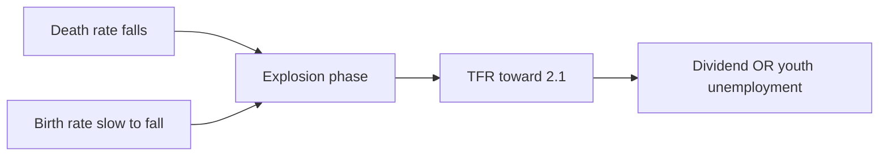

# Population — Explosion, Policy & Stabilization

> GS-1 · Topic 07.2 · Population and associated issues — explosion, policy, demographic dividend

---

## PYQs

| Year | M | Words | Question (EN) | प्रश्न (HI) | ID |
|------|---|-------|---------------|-------------|-----|
| 2024 | 12 | 200 | 'Population explosion is a serious challenge to India's holistic development.' — Examine | 'जनसंख्या विस्फोट भारत के समग्र विकास के लिए गंभीर चुनौती है।' — कथन की समीक्षा कीजिए। | Q1 |
| 2022 | 8 | 125 | Mention the causes of population explosion in India and give suggestions to combat the problem. | भारत में जनसंख्या विस्फोट के कारणों का उल्लेख तथा समस्या से निपटने के सुझाव दीजिए। | Q2 |
| 2021 | 12 | 200 | Discuss the salient features of National Population Policy 2000 and measures for population stabilization. | भारत की जनसंख्या नीति (2000) की मुख्य विशेषताएँ एवं जनसंख्या स्थिरीकरण के उपायों की चर्चा कीजिए। | Q3 |
| 2020 | 8 | 125 | Is growing population the main cause of poverty or is poverty the main cause of population increase? Analyse. | क्या बढ़ती जनसंख्या गरीबी का मुख्य कारण है या गरीबी जनसंख्या वृद्धि का? विश्लेषण कीजिए। | Q4 |

---

## Quick Revision

```
POPULATION EXPLOSION: Phase when death rate falls (medical/public health) but birth rate stays high
  → rapid net growth (India 1950s–1980s peak) · NOT same as today's slower growth

INDIA DATA:
  Census 2011: 121 crore · density 382/km² · urban 31.16%
  NFHS-5 (2019–21): TFR 2.0 (replacement level nationally)
  Still high TFR pockets: Bihar, UP, MP · ageing in Kerala/Tamil Nadu
  Sex ratio 943 (2011) · child sex ratio 919 (son preference concern)
  Working age 15–59 ~62% → demographic dividend window

CAUSES EXPLOSION (2022):
  High birth rate historically · fall in IMR/MMR · better sanitation/vaccines
  · early marriage · preference for sons · lack of contraception access
  · poverty as insurance (more children = labour/security) · cultural norms
  · migration adds to regional concentration (not natural increase alone)

NPP 2000 (2021 PYQ):
  Voluntary · target-free · decentralised · community need-based
  Long-term goal TFR 2.1 · stabilize by 2045 · meet RH needs
  Focus: education (esp. girls) · economic role of women · RH services · spacing

STABILIZATION MEASURES:
  Girls' education · RH/contraception access · economic development
  · late marriage · PM-JANMAN/tribal health · Mission Parivar Vikas (high-fertility districts)
  · NOT coercion (post Emergency sterilisation legacy)

DEMOGRAPHIC DIVIDEND vs BURDEN:
  Dividend = skilled youthful workforce → growth IF jobs + health + education
  Burden = dependency, unemployment, resource strain, environmental pressure

POPULATION ↔ POVERTY (2020):
  Both directions: large family → resource dilution · poverty → high fertility insurance
  Avoid mono-causal answer · development breaks vicious cycle

INSTITUTIONS: Census · NFHS · NITI Aayog · MoHFW · UNFPA · SDG 3

TRAPS: TFR 2.0 ≠ uniform across states | Explosion ≠ current reality everywhere
  | NPP 2000 ≠ two-child coercion | Population ≠ only numbers (age structure matters)
  | Dividend automatic ≠ needs skilling (Skill India)
```

---

## Content

### Context — India's demographic transition

India became the world's most populous country around 2023 when UN estimates placed its population above China's. This demographic fact defines India's development trajectory for decades because the age structure of a society determines whether population is a burden or an asset. Demographic transition theory describes how societies move from a first stage of high birth rates and high death rates, through a second stage where death rates fall sharply while birth rates remain high — producing rapid net growth called population explosion — toward a third stage of low birth and low death rates called stabilization. India entered the explosion phase intensely in the 1950s through 1980s when public health advances outpaced fertility decline; it is now in late transition nationally but uneven regionally.

Census 2011 recorded 121 crore people at a density of 382 persons per km², with 31.16% urban. NFHS-5 (2019–21) reports a national Total Fertility Rate (TFR) of 2.0 — at replacement level — yet high-fertility pockets persist in Bihar, UP, and Madhya Pradesh while Kerala and Tamil Nadu aged earlier. Sex ratio stood at 943 females per 1000 males (2011); child sex ratio of 919 reflects continuing son preference. Working-age population (15–59) comprises roughly 62%, opening a demographic dividend window — but only if health, education, skilling, and jobs keep pace. Otherwise youth unemployment converts dividend into social unrest.

### Population explosion — meaning and causes

Population explosion denotes rapid net growth when birth rates remain substantially above death rates over decades, overwhelming resource and service capacity. What happened in India: post-Independence public health revolution — smallpox eradication, oral rehydration therapy, immunization expansion, malaria control — drove Infant Mortality Rate (IMR) and Maternal Mortality Ratio (MMR) down faster than couples reduced family size. Why it mattered: each surviving child added to net population while cultural norms still favoured large families. How it persisted: poverty made children economic insurance for old age and farm labour; son preference encouraged repeated births until a male heir; early marriage (still visible in NFHS pockets) extended reproductive years; unmet contraceptive need in rural and tribal belts limited spacing.

| Cause | Mechanism | Proof |
|-------|-----------|-------|
| Mortality decline | Immunization, ORS, disease control | IMR/MMR fell faster than birth rate post-1950 |
| High fertility norms | Large family, son preference, early marriage | NFHS child marriage pockets; UP-Haryana son preference belt |
| Economic insecurity | Children as insurance and labour | Poverty-fertility correlation in agrarian economy |
| Low female agency | Literacy/LFPR inversely correlate with TFR | States with higher female education show lower TFR first |
| Limited contraception | Unmet family planning need | Historical RH access gaps in tribal/rural blocks |
| Cultural/religious factors | Opposition to birth control in some groups | Policy must remain voluntary to succeed |

Regional dimension proves uneven transition: UP, Bihar, and MP lagged decades behind Kerala, Tamil Nadu, and Andhra Pradesh — demographic divergence within one nation, not one uniform story.



### National Population Policy 2000

NPP 2000 marked India's decisive shift to voluntary, rights-based, decentralised population stabilization after the coercive Emergency-era sterilisation legacy (1975–77), which discredited target-driven family planning and violated bodily autonomy. What NPP 2000 changed: it rejected quotas and camps; it placed reproductive health within broader human development; it assigned Panchayats and urban local bodies responsibility for community need assessment.

| Feature | Detail |
|---------|--------|
| Voluntary and target-free | Rejects coercive sterilisation — informed consent central |
| Decentralised planning | Panchayat/ULB-level RH planning via community need assessment |
| Long-term goal | TFR 2.1; population stabilization by 2045 |
| Immediate objectives | Universal immunization; 80% institutional deliveries; 100% civil registration of births, deaths, marriage, pregnancy |
| Cross-sectoral | Education, nutrition, women's economic role, adolescent health |
| Rights-based RH | Informed contraceptive choice; quality of care, not quotas |

Stabilization measures operate across domains. Social measures include girls' secondary education (delayed marriage reduces fertility), women's workforce participation (economic agency enables birth spacing), and Prohibition of Child Marriage Act enforcement. Health measures span universal RH services, spacing methods, safe abortion within law, and ASHA/ANM outreach to tribal and remote blocks. Economic measures — poverty reduction through MGNREGA and livelihood schemes — lower "insurance fertility" where poor couples bear more children for security. Governance relies on civil registration, NFHS monitoring, and Mission Parivar Vikas targeting 146 high-fertility districts. Communication uses behaviour change (BCC) promoting small family norms without coercion.

Why NPP succeeded partially: NFHS-5 national TFR 2.0 shows fertility reached replacement level. Why gaps remain: son preference (SRB), regional lag in Purvanchal and Bundelkhand, and tribal RH access deficits require PM-JANMAN (2023) and continued investment in female education.

### Population explosion as development challenge

The statement "population explosion is a serious challenge to India's holistic development" requires examination, not reflex agreement or rejection.

**Why the statement holds (historically and regionally).** Resource pressure: per capita land, water, and forest availability falls as population grows — acute in Gangetic plains and Western Ghats fringe. Employment: roughly 12 million workforce entrants annually need matching job creation; failure produces underemployment and migration stress. Social services: schools, hospitals, and housing deficits emerge when growth outpaces planning — visible in high-growth districts of UP and Bihar. Environment: pollution, waste, and carbon footprint scale with population density in metros. Governance: implementation capacity stretches when demand for public goods rises faster than administrative expansion.

**Why the statement is incomplete today.** NFHS-5 TFR 2.0 indicates explosion phase is easing nationally — India's challenge shifts from sheer numbers to human capital quality. Demographic dividend: a youthful workforce can accelerate GDP if skilled through Skill India and NEP 2020. Market scale: 1.4 billion people provide domestic demand engine for manufacturing and services. Holistic development failure also reflects inequality and governance — Bangladesh reduced fertility without high GDP first; Japan developed with ageing population — population is not sole determinant.

Balanced verdict: statement is partially valid as structural challenge, especially historically and in high-TFR pockets; overstated if it ignores transition progress, dividend potential, and quality focus. Population momentum from young age structure continues absolute growth for decades even at TFR 2.0 — India adds millions annually despite replacement fertility because past high fertility created a large child-bearing cohort.

### Population and poverty — bidirectional causality

| Direction | Mechanism | Illustration |
|-----------|-----------|--------------|
| Population → poverty | Large households dilute per capita land/income; high dependency ratio strains public goods | Landless family with six children on one bigha in eastern UP |
| Poverty → population | Poor rely on children for farm labour and old-age support; low education raises fertility | Insurance fertility where social security absent |
| Third factor | Gender inequality, underemployment, weak RH access cause both simultaneously | Bundelkhand distress belt |

Neither population nor poverty is the sole "main" cause — they form a vicious cycle broken by integrated policy: girls' education, SHGs, MGNREGA wage floor, reproductive health access, and old-age pensions (NSAP) that reduce insurance fertility. Exam answers must reject mono-causality and propose simultaneous human development.

### Demographic dividend versus demographic burden

Demographic dividend is the economic growth potential when the share of working-age population (15–59) rises and dependency ratio (children plus elderly relative to workers) falls. How dividend materializes: more workers per dependent means higher savings potential, larger labour force, and consumer market expansion. Why dividend fails without policy: if health and education are poor, workers remain low-productivity; if female LFPR stays at ~24%, half the potential workforce is sidelined; if formal jobs are scarce, youth unemployment breeds unrest — dividend becomes burden.

UP relevance: Purvanchal and Bundelkhand have large youthful cohorts; without employment, migration to NCR and Mumbai continues, exporting demographic pressure rather than converting it locally. Proof of dividend success elsewhere: Kerala invested early in education and health before prosperity — demographic transition preceded income growth. Proof of dividend risk: many African and South Asian countries saw youth bulges without job creation — political instability followed.

### Historical family planning and Emergency legacy

Pre-NPP India experimented with target-driven sterilisation, culminating in coercive camps during Emergency (1975–77). Why this matters: it created deep mistrust of state family planning, especially among Muslims and poor communities; NPP 2000 explicitly distanced itself from this legacy. Sterilisation remains one contraceptive option but cannot be quota-driven. Two-child norm coercion — proposed by some states — risks repeating Emergency mistakes and disproportionately targeting women. Voluntary, informed choice is both ethical requirement and effective strategy.

### Data anchors for answers

Census 2011: 121 crore, density 382/km², sex ratio 943, child sex ratio 919, urban 31.16%. NFHS-5: TFR 2.0 nationally; Bihar, UP, MP above replacement in pockets; Kerala ageing. Dependency ratio falling as working-age share rises — dividend window open till roughly 2040s if jobs materialize. UNFPA and NITI Aayog projections used when Census 2021 delayed. Mission Parivar Vikas: 146 high-fertility districts. PM-JANMAN: tribal RH gaps. Compare Bangladesh TFR decline without high GDP — proves development and RH access drive fertility more than income alone.

### Contemporary relevance

NFHS-5 national TFR 2.0 signals policy success but son preference (SRB) persists in some states. Mission Parivar Vikas targets 146 high-fertility districts with intensified RH outreach. PM-JANMAN (2023) addresses Particularly Vulnerable Tribal Groups' health and RH gaps. Census 2021 delay means policy relies on NFHS and survey data for fertility monitoring. Ageing debate emerges — Kerala's aged dependency versus youthful north requires different policy (elder care versus skilling). SDG 3 (health), institutions (Registrar General Census, NFHS, NITI Aayog, MoHFW, UNFPA), and Finance Commission devolution to high-population states shape implementation. Urban concentration — 40%+ urban by 2030 — shifts policy from rural fertility alone to urban RH, migration, and slum health.

### Exam synthesis — population as structural and regional challenge

Holistic development requires matching population dynamics to policy: youthful north needs schools, skilling centres, and jobs; ageing Kerala needs elder care and healthcare infrastructure; urbanizing India needs planned cities not slum proliferation. Population explosion statement is strongest when applied to historical burden (1950s–80s) and regional pockets (Purvanchal high TFR) — weakest when applied uniformly today given NFHS-5 TFR 2.0. NPP 2000 ethical framework — voluntary, target-free, decentralised — remains correct approach; any return to coercion would repeat Emergency mistrust. Population-poverty bidirectional link demands integrated answer: neither mono-causal; break via education, women's work, social security, RH access. Demographic dividend is India's largest unused asset if Skill India, NEP 2020, female LFPR rise, and formal job creation succeed — otherwise largest liability through youth unrest and continued distress migration from UP-Bihar belt to metros.

### Limits and balanced view

Population is not destiny — Japan and South Korea developed with ageing; Bangladesh reduced fertility without high GDP first. Coercive policies backfire — China's one-child legacy produced gender imbalance and ageing crisis; India's Emergency lesson warns against targets. Focus shifts to population quality, ageing preparedness, migration management, and urban concentration — not numbers alone. NPP 2000 does not promote two-child coercion — explicitly voluntary and target-free. TFR 2.0 does not mean population stops growing immediately — momentum effect continues for decades. Demographic dividend is not automatic — requires Skill India, NEP 2020, female LFPR rise, and formal job creation. Population policy is not only family planning — education, women's work, poverty reduction, and social security equally determine fertility choices. India is not in explosive growth everywhere — national TFR 2.0 with regional variation is the accurate frame.

---

## Answers

### Q1: 'Population explosion is serious challenge to holistic development.' — Examine. (2024, 12M, 200W)

**Introduction:**
> **Population explosion denotes rapid growth when falling death rates precede fertility decline** — **India experienced this intensely post-1950, straining resources, services, and employment**.

**Main Points:**
- **Challenge dimensions** — **Resource pressure, job creation gap, education-health infrastructure, environmental stress, governance capacity**.
- **Regional persistence** — **Some states/districts still above replacement TFR (UP, Bihar belt)**.
- **Counter-nuances** — **National TFR 2.0 (NFHS-5); demographic dividend potential if youth skilled**.
- **Holistic development** — **Requires education, women's empowerment, RH services, jobs — not coercion**.
- **Verdict** — **Statement valid as structural challenge; overstated if ignores transition progress and quality focus**.

**Keywords (underline in exam):** Population Explosion · TFR · Demographic Dividend · NPP 2000 · NFHS-5 · Dependency Ratio

**Exam diagram (30 sec):**
```
Explosion → strain on jobs/resources
But TFR 2.0 nationally → shift to dividend vs quality
Holistic dev = people-centred policy
```

**Conclusion:**
> **India must convert ** **population weight into human capital advantage** through **education, health, and inclusive employment** — **stabilization achieved, equity unfinished**.

---

### Q2: Causes of population explosion + suggestions. (2022, 8M, 125W)

**Introduction:**
> **India's population explosion resulted from ** **mortality revolution outpacing fertility decline**, reinforced by **socio-economic and cultural factors**.

**Main Points:**
- **Causes** — **IMR/MMR fall, high birth rate, early marriage, son preference, poverty-as-insurance, low contraception access**.
- **Suggestions** — **Girls' education, voluntary family planning, women's economic role, poverty reduction, RH outreach, BCC**.
- **Policy frame** — **NPP 2000 voluntary, target-free approach**.

**Keywords (underline in exam):** Birth Rate · Death Rate · IMR · Family Planning · NPP 2000 · TFR

**Exam diagram (30 sec):**
```
Death ↓ fast + Birth ↓ slow = explosion
Fix: education · RH · women empowerment · development
```

**Conclusion:**
> **Sustainable stabilization follows ** **social development, not demographic coercion**.

---

### Q3: NPP 2000 features + stabilization measures. (2021, 12M, 200W)

**Introduction:**
> **National Population Policy 2000 marked India's shift to ** **voluntary, rights-based, decentralised population stabilization** after coercive Emergency-era legacy**.

**Main Points:**
- **Features** — **Target-free, community-based, TFR 2.1 goal, stabilize by 2045, cross-sectoral (education, RH, women)**.
- **Stabilization measures** — **Universal immunization, institutional delivery, registration, contraceptive choice, adolescent health**.
- **Social measures** — **Female education, late marriage, economic participation, poverty alleviation**.
- **Institutional** — **Panchayat planning, NFHS monitoring, high-fertility district missions**.
- **Ethical limit** — **No sterilisation targets — informed consent central**.

**Keywords (underline in exam):** NPP 2000 · Voluntary · Target-Free · TFR 2.1 · Reproductive Health · Decentralised Planning

**Exam diagram (30 sec):**
```
NPP 2000: voluntary + rights + decentralised
Measures: education · RH · women · economy
Goal: TFR 2.1 · stabilize 2045
```

**Conclusion:**
> **NPP 2000 aligns population policy with ** **democratic rights and human development** — **NFHS-5 TFR 2.0 shows partial success, regional gaps remain**.

---

### Q4: Population cause poverty or poverty cause population? (2020, 8M, 125W)

**Introduction:**
> **Population and poverty interact in a ** **two-way vicious cycle** rather than a single-direction causal chain**.

**Main Points:**
- **Population → poverty** — **Resource dilution, high dependency, pressure on land/jobs/public goods**.
- **Poverty → population** — **Children as economic/security asset, low education, unmet family planning**.
- **Common drivers** — **Gender inequality, underemployment, weak social security**.
- **Break cycle** — **Education, SHGs, MGNREGS, RH access, old-age security schemes**.

**Keywords (underline in exam):** Vicious Cycle · Dependency Ratio · Family Size · Human Development · Women's Education

**Exam diagram (30 sec):**
```
Poverty ↔ high fertility ↔ poverty
Break via: education · jobs · RH · social security
```

**Conclusion:**
> **Neither is sole cause** — **integrated development policy addresses both simultaneously**.

---

## Traps

| Wrong | Correct |
|-------|---------|
| India still in explosive growth everywhere | **National TFR 2.0 — regional variation persists** |
| NPP 2000 promotes two-child coercion | **Explicitly ** **voluntary and target-free** |
| Population explosion = only birth rate | **Death rate decline triggered phase** |
| Demographic dividend automatic | **Needs jobs, skills, health — else youth burden** |
| Population only challenge, not opportunity | **Market scale + workforce potential** |
| Sterilisation camps = current policy | **Emergency legacy — rejected by NPP 2000** |
| TFR 2.0 = population stops growing immediately | **Momentum of young age structure continues growth for decades** |
| Son preference irrelevant today | **SRB concerns persist in some states** |
| Census only source | **NFHS for fertility/health indicators** |
| Population policy = only family planning | **Education, women's work, poverty reduction equally key** |

---

*Complete.*
