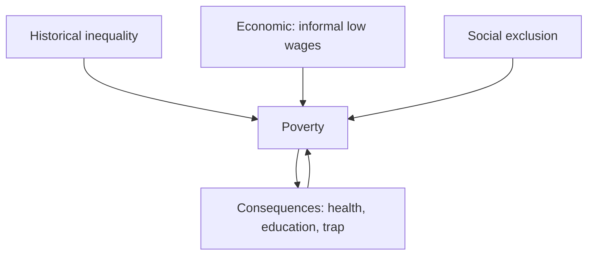

# Poverty — Causes, Consequences & Debates

> GS-1 · Topic 07.3 · Poverty and developmental issues — causes, consequences, multidimensional poverty

---

## PYQs

| Year | M | Words | Question (EN) | प्रश्न (HI) | ID |
|------|---|-------|---------------|-------------|-----|
| 2025 | 8 | 125 | What is the relationship between illiteracy and poverty in rural India? Critically evaluate. | ग्रामीण भारत में विकासात्मक मुद्दों के संदर्भ में निरक्षरता और गरीबी के बीच क्या सम्बन्ध है? आलोचनात्मक मूल्यांकन कीजिए। | Q1 |
| 2024 | 12 | 200 | Discuss the causes and consequences of poverty. | गरीबी के कारणों और परिणामों की चर्चा कीजिए। | Q2 |
| 2023 | 8 | 125 | 'Unemployment is the only cause for prevalent poverty in India.' — Comment. | 'बेरोजगारी भारत में व्यापक निर्धनता का एकमात्र कारण है' — टिप्पणी कीजिए। | Q3 |
| 2022 | 8 | 125 | When poverty transmits over generations it becomes a culture — Elucidate. | जब निर्धनता कई पीढ़ियों तक हस्तांतरित होती है, तो वह संस्कृति का रूप ले लेती है — स्पष्ट कीजिए। | Q4 |
| 2020 | 8 | 125 | Is growing population the main cause of poverty or is poverty the main cause of population increase? Analyse. | क्या बढ़ती जनसंख्या गरीबी का मुख्य कारण है या गरीबी जनसंख्या वृद्धि का? विश्लेषण कीजिए। | Q5 |

---

## Quick Revision

```
POVERTY TYPES:
  Absolute = below poverty line income (Tendulkar/Rangarajan)
  Relative = below societal minimum standard
  Multidimensional (MPI) = health + education + living standard (NITI Aayog)

INDIA DATA:
  MPI poor (NITI 2023): ~14.96% (down from 29.17% in 2013–14)
  Tendulkar line (2011–12 ref): ~₹27/day rural · ~₹33/day urban (approx)
  Employed poor common — informal sector low wages ≠ unemployment only

CAUSES (multi-causal — 2024):
  Historical: colonial drain · zamindari · deindustrialization · landlessness
  Economic: underemployment · informal labour · low agri productivity · shocks
  Social: caste/gender exclusion · illiteracy · disability · tribal isolation
  Demographic: large family · dependency ratio
  Governance: leakage · weak implementation · disaster vulnerability

ILLITERACY ↔ POVERTY (2025):
  Mutual reinforcement: illiteracy → low skills/wage · scheme exclusion
  poverty → child labour · dropout · early marriage
  Break: RTE · NEP · MGNREGS · SHGs · digital literacy

UNEMPLOYMENT ONLY? (2023): NO — employed poor, landless working poor, casual labour
  · disguised unemployment in agriculture · wage stagnation · social exclusion

INTERGENERATIONAL / CULTURE (2022):
  Oscar Lewis "culture of poverty" — attitudes transmitted
  Indian reality: structural trap (assets, nutrition, education, networks) primary
  · avoid deterministic blame on poor · POSHAN · scholarships · MGNREGS assets

CONSEQUENCES:
  Malnutrition/stunting · low human capital · ill health · crime/clientelism
  · gender violence · slums · political exclusion · intergenerational trap

FRAMEWORKS: Amartya Sen capability deprivation · poverty trap · MPI

SCHEMES: MGNREGA · PM-JAY · PMAY · NFSA · NRLM · PM POSHAN · Aspirational Districts

TRAPS: Unemployment ≠ only cause | Culture of poverty ≠ excuse for policy failure
  | MPI decline ≠ no poverty | Income line ≠ full picture (use Sen/MPI)
```

---

## Content

### Context — Poverty in India

Poverty in India is multidimensional — encompassing income, nutrition, education, housing, dignity, and voice — not merely cash shortfall. Amartya Sen's capability approach defines poverty as deprivation of freedoms: the poor lack not only money but health, education, political participation, and bodily integrity. What this means analytically: a household above an income line may still be poor if children are stunted, girls are denied schooling, or adults cannot access courts. NITI Aayog's Multidimensional Poverty Index (MPI, Alkire-Foster method) captures this — measuring health, education, and living standard indicators jointly. MPI declined sharply from 29.17% (2013–14) to 14.96% (2023), yet absolute numbers remain large and regional inequality stark — aspirational districts in UP lag national averages.

The Tendulkar Committee poverty line (2011–12 reference) placed thresholds at roughly ₹27.2/day rural and ₹33.3/day urban — consumption-based and debated as too low; Rangarajan proposed higher thresholds. Employed poor are widespread — casual labourers, domestic workers, and disguised agricultural workers earn wages yet remain below the line. Unemployment alone cannot explain India's poverty profile.

### Definitions and measurement

| Measure | Detail | Use in analysis |
|---------|--------|-----------------|
| Absolute poverty line | Tendulkar ~₹27/day rural, ₹33/day urban (2011–12) | Income/consumption floor |
| Rangarajan line | Higher threshold — debated replacement | Captures near-poor vulnerability |
| MPI (NITI Aayog) | Health, education, living standard — 14.96% poor (2023) | Multi-dimensional deprivation |
| Capability deprivation (Sen) | Denial of freedoms beyond cash | Framework for causes/consequences |

### Causes of poverty — multi-causal analysis

**Historical-structural causes.** Colonial deindustrialization destroyed artisan industries; zamindari and ryotwari land revenue systems concentrated land; unequal land distribution persisted post-Independence. Caste-based exclusion denied SC/ST communities assets, education, and dignified employment — poverty is not random but structurally patterned. Proof: landlessness rates among SCs exceed general population; tribal communities displaced from forests without resettlement remain poorest.

**Economic causes.** Underemployment and disguised unemployment in agriculture mean families work shared plots but income remains insufficient — work without adequate wages. Informal sector dominance — street vendors, domestic workers, casual construction labour — lacks minimum wage enforcement, contracts, and social security (e-Shram registration incomplete). Landlessness and small holdings in UP/Bihar agrarian belts perpetuate distress during drought or price shocks. Economic shocks — drought, COVID-19 reverse migration, medical catastrophe — push near-poor below line overnight; PM-JAY addresses health-shock poverty partially.

**Social causes.** Illiteracy and skill gaps limit non-farm mobility — a landless youth without skills remains trapped in casual labour. Gender discrimination through unpaid care, wage gaps, and property denial traps women economically even when laws grant rights (Hindu Succession Amendment 2005). Tribal/remote geography and forest displacement without adequate resettlement marginalize Adivasis — FRA non-implementation perpetuates asset poverty.

**Demographic and health causes.** Large household size dilutes per capita resources — dependency ratio rises. Malnutrition and stunting (NFHS-5) cause cognitive and productivity loss intergenerationally — poor nutrition today reduces earning capacity tomorrow.

**Governance causes.** Implementation leakage historically plagued PDS and MGNREGA; Aadhaar-DBT improved targeting but exclusion errors persist for migrants and those without documents. Weak local institutions in backward districts slow scheme delivery — aspirational districts programme targets this gap.



### Illiteracy and poverty in rural India — critical evaluation

Illiteracy and poverty form a mutually reinforcing cycle in rural India, though neither alone explains deprivation fully. **Illiteracy → poverty:** illiterate workers command lower wages, cannot navigate welfare schemes (MGNREGA registration, ration cards, PM-KISAN), fall prey to moneylender exploitation and financial fraud, and lack health literacy for preventive care. **Poverty → illiteracy:** poor households send children to work (child labour), cannot afford hidden schooling costs (uniforms, books), marry daughters early (NFHS linkage between poverty and early marriage), and prioritize immediate income over long-term education.

Critical limits for balanced answers: many literate poor exist — underemployed graduates in towns prove literacy without assets or jobs fails; illiteracy is necessary but not sufficient — landlessness, caste, and gender equally causal; digital divide creates new functional illiteracy when e-governance requires smartphone navigation. Way forward: NEP 2020 retention and vocational tracks, girls' secondary education (Beti Bachao Beti Padhao), adult literacy missions, MGNREGA plus skill bridge (PMKVY), SHG financial literacy under DAY-NRLM.

### Unemployment as the only cause? — refuting absolutism

The statement "unemployment is the only cause for prevalent poverty" is an exam trap requiring refutation with evidence.

| Reality | Mechanism | Example |
|---------|-----------|---------|
| Employed poor | Wages below poverty line | Casual labour at ₹150/day for family of five |
| Working poor in agriculture | Disguised unemployment | Family shares farm work; income insufficient |
| Informal urban workers | Employed without security | Street vendors, domestic workers |
| Asset poverty | Landlessness despite seasonal work | SC landless households in UP doab |
| Social exclusion | Markets and resources denied | Manual scavenging, caste-based occupation traps |

Unemployment matters — jobless growth periods worsen poverty — but alongside underemployment, wage stagnation, landlessness, caste/gender exclusion, illiteracy, and health shocks. Poverty is multidimensional; employment quality matters as much as employment quantity.

### Intergenerational poverty as "culture" — elucidate with critique

Oscar Lewis (1960s) argued persistent poverty generates attitudes, aspirations, and behaviours transmitted across generations — fatalism, present-orientation, weak institutional trust — the "culture of poverty" thesis. **What is valid in India:** poor nutrition plus inadequate schooling plus weak social networks cause children to replicate deprivation — poverty trap mechanics are real. Stunting (NFHS-5) reduces cognitive capacity; first-generation learners drop out; debt bondage and lack of collateral block credit access across generations.

**Why "culture" language is dangerous:** it risks blaming victims for structural conditions — landlessness, caste exclusion, and policy failure are primary. Indian mechanisms: inheritance laws partially reformed (HSA 2005) but social practice denies daughters land; caste barriers limit marriage and occupation mobility. Policy response breaks cycle through material change: POSHAN 2.0/ICDS nutrition, pre-matric and post-matric scholarships, MGNREGS asset creation (ponds, roads), property rights enforcement, PM-JAY preventing health-shock descent into poverty. Conclusion: "culture" describes symptoms of prolonged structural poverty — moralizing fails; transforming material conditions succeeds.

### Consequences of poverty

**Human development:** malnutrition, stunting, anaemia, low educational attainment, child labour, early marriage — each reduces lifetime capabilities. **Social:** crime, substance abuse, political clientelism (patronage dependency), gender violence through economic dependency, social stigma and exclusion from public spaces. **Economic:** low productivity trap — poor cannot invest in skills, tools, or seeds; informal housing and slums manifest urban poverty. **Political:** voicelessness — weak bargaining with state and markets; vote-bank vulnerability where short-term welfare substitutes for structural reform. Intergenerational trap closes the loop: poor parents produce stunted, undereducated children who become poor adults.

### Remedies and policy framework

Integrated approach required — not welfare alone. MGNREGA provides wage floor and rural asset creation. PM-JAY prevents medical bankruptcy. PMAY addresses housing deficit. NFSA and PDS ensure food security. NRLM/SHGs build women's economic agency. PM POSHAN targets child nutrition. Aspirational Districts Programme focuses on laggard districts including UP. Sen's capability approach demands simultaneous investment in health, education, assets, and voice — MPI decline proves progress possible but 14.96% poor means unfinished agenda.

### Population and poverty — cross-link

Population growth and poverty reinforce bidirectionally — large families dilute per capita land; poverty drives insurance fertility; gender inequality and weak social security cause both. Integrated human development plus old-age security breaks the cycle — see population policy file for full analysis. Neither is sole "main" cause.

### Scheme integration for remedies answers

MGNREGA: wage floor, rural asset creation (ponds, roads), women's workdays ~50%+ in many states. PM-JAY: ₹5 lakh health cover prevents catastrophic medical poverty. PMAY: rural and urban housing. NFSA: food security legal entitlement. NRLM/SHGs: women's credit and livelihood. PM POSHAN/ICDS: child nutrition against stunting. Aspirational Districts: target 112 laggards including UP districts. Sen capability approach ties remedies to expanding freedoms — not cash alone. MPI 14.96% (2023) proves progress; regional inequality (Bihar, UP aspirational blocks) proves unfinished agenda.

### Contemporary relevance

MPI decline reflects national progress; Aspirational Districts target remaining pockets. PM-JAY prevents health-shock poverty — COVID exposed rural vulnerability when reverse migration occurred. Inflation in food and fuel disproportionately hits the poor. SDG 1 (No Poverty) and SDG 2 (Zero Hunger) monitoring continues. DBT via JAM improved delivery but Aadhaar exclusion errors remain contested. Urban working poor in slums (Kanpur, Lucknow) require urban poverty lens alongside rural.

### Poverty traps and policy — Sen, MPI, and ground reality

Amartya Sen's capability deprivation framework requires exam answers to go beyond income: a household above Tendulkar line may lack sanitation (MPI indicator), school attendance (MPI), or nutrition (NFHS stunting) — multidimensionally poor despite cash. Intergenerational trap mechanics: stunted child → poor cognitive development → low productivity adult → poor parent — POSHAN and ICDS interrupt this chain. Illiteracy-poverty cycle in rural UP: Purvanchal districts show correlated low literacy, high MPI, and seasonal migration — integrated intervention needed. Unemployment-only thesis refuted by employed poor: MGNREGA guarantees wage but not exit from poverty if wage below living cost; informal sector street vendors work 12-hour days yet remain vulnerable. Culture-of-poverty thesis: use Lewis cautiously — describe transmitted deprivation without victim-blaming; structural landlessness and caste exclusion primary. Remedies must combine MGNREGA safety net, PM-JAY shock protection, PMAY housing, NRLM women's agency, and quality non-farm jobs — welfare necessary, structural transformation essential.

### Additional depth — consequences and human capital

Consequences ripple across generations: malnourished child (NFHS stunting) underperforms in school, exits early for labour, earns low wage, cannot invest in own children — intergenerational trap closes. Social consequences include political clientelism where poor depend on patron for ration and loans, weakening demand for structural reform. Gender violence intensifies with economic dependency — dowry demands scale with aspirational consumption even among poor households. Urban slums (Dharavi, Kanpur tannery belt) concentrate poverty spatially — informal sector working poor invisible in unemployment statistics. Political voicelessness means policies designed without poor participation — Aadhaar-DBT exclusion errors hit most vulnerable. Medical poverty remains leading descent route — one hospitalization can erase MGNREGA savings without PM-JAY cover in unregistered facilities. Climate shocks (drought in Bundelkhand, flood in Bihar) push near-poor below line seasonally — poverty is dynamic, not static snapshot. Rangarajan line debate matters because near-poor above Tendulkar remain vulnerable — MPI captures this better than single income threshold.

### Limits and balanced view

Poverty reduction does not equal inequality reduction — top decile gains can coexist with MPI progress. Welfare is necessary but not sufficient — quality jobs and asset redistribution debate continues. Avoid culture-of-poverty determinism — structural reform is central. MGNREGA is safety net, not structural transformation alone. Urban poverty in informal sector and slums equally significant. Tendulkar versus Rangarajan debate continues; MPI complements income lines. Employed poor disprove unemployment-only thesis. Population is not always main poverty driver — bidirectional causality requires integrated policy.

---

## Answers

### Q1: Illiteracy and poverty relationship in rural India — critically evaluate. (2025, 8M, 125W)

**Introduction:**
> **In rural India, illiteracy and poverty form a mutually reinforcing cycle** — **each constrains escape routes from the other**, though **neither alone explains deprivation fully**.

**Main Points:**
- **Illiteracy → poverty** — **Low skills/wages, scheme exclusion, health ignorance, exploitation**.
- **Poverty → illiteracy** — **Child labour, dropout, early marriage, hidden schooling costs**.
- **Critical limits** — **Literate underemployed exist; landlessness, caste, gender equally causal**.
- **Way forward** — **NEP retention, girls' education, SHG literacy, MGNREGS + skilling**.

**Keywords (underline in exam):** Mutual Reinforcement · Capability Deprivation · Child Labour · Multi-causal Poverty · NEP 2020

**Exam diagram (30 sec):**
```
Illiteracy ↔ Poverty (rural cycle)
Break: education + assets + social security
Not single-cause
```

**Conclusion:**
> **Policy must attack ** **both human capital and structural asset deficits** — **literacy alone without livelihoods fails**.

---

### Q2: Causes and consequences of poverty. (2024, 12M, 200W)

**Introduction:**
> **Poverty in India stems from ** **historical inequality, economic informality, social exclusion, and governance gaps**, producing **deep human development and intergenerational costs**.

**Main Points:**
- **Causes** — **Colonial legacy, landlessness, underemployment, caste/gender, illiteracy, health deprivation, demographic pressure, shocks**.
- **Consequences** — **Malnutrition/stunting, low education, ill health, slums, crime/clientelism, gender violence, political voicelessness**.
- **Measurement** — **MPI decline (14.96%) but regional disparities persist**.
- **Framework** — **Sen's capability deprivation beyond income lines**.
- **Remedies pointer** — **MGNREGA, PM-JAY, PMAY, NRLM, POSHAN — integrated approach**.

**Keywords (underline in exam):** MPI · Tendulkar Line · Capability Deprivation · Informal Sector · Intergenerational Trap · MGNREGA

**Exam diagram (30 sec):**
```
Causes: structural + social + economic
Effects: health · education · slums · trap
Multi-dimensional (Sen/MPI)
```

**Conclusion:**
> **Sustainable poverty reduction demands ** **growth with jobs, human development, and social inclusion** — **not welfare alone**.

---

### Q3: Unemployment the only cause of poverty — Comment. (2023, 8M, 125W)

**Introduction:**
> **The statement is ** **overstated** — **unemployment contributes to poverty but India's poor include millions who work for subsistence wages**.

**Main Points:**
- **Refute "only"** — **Employed poor, disguised agricultural unemployment, informal sector**.
- **Other causes** — **Landlessness, caste/gender exclusion, illiteracy, health shocks, low productivity**.
- **Accept partial truth** — **Jobless growth periods worsen poverty**.
- **Policy** — **MGNREGA safety net + skilling + wage enforcement + social security**.

**Keywords (underline in exam):** Employed Poor · Underemployment · Informal Sector · Multi-causal · Disguised Unemployment

**Exam diagram (30 sec):**
```
Poverty ≠ only jobless
Many WORKING poor → wage/asset/exclusion causes
Trap word "only"
```

**Conclusion:**
> **Poverty is ** **multidimensional** — **employment quality matters as much as employment quantity**.

---

### Q4: Intergenerational poverty becomes culture — Elucidate. (2022, 8M, 125W)

**Introduction:**
> **When poverty persists across generations, behavioural patterns and limited aspirations can resemble a "culture," but Indian experience is rooted primarily in ** **structural deprivation of assets, nutrition, and education****.

**Main Points:**
- **Lewis thesis** — **Attitudes/fatalism transmitted in long poverty**.
- **Indian mechanisms** — **Stunting, dropout, debt, weak inheritance, caste barriers**.
- **Critique** — **Avoid blaming poor; structures primary**.
- **Break cycle** — **POSHAN, scholarships, MGNREGS assets, property rights, PM-JAY**.

**Keywords (underline in exam):** Intergenerational Transmission · Poverty Trap · Culture of Poverty · Stunting · Structural Deprivation

**Exam diagram (30 sec):**
```
Generation 1 poor → poor health/education → Generation 2 poor
Structure > blame · Policy breaks cycle
```

**Conclusion:**
> **"Culture" describes ** **symptoms of prolonged structural poverty** — **policy must transform material conditions, not moralize**.

---

### Q5: Population vs poverty causality. (2020, 8M, 125W)

**Introduction:**
> **Population growth and poverty reinforce each other in a vicious cycle** — **neither is the sole "main" cause**.

**Main Points:**
- **Population → poverty** — **Resource dilution, dependency, service strain**.
- **Poverty → population** — **Insurance fertility, low RH access, education gap**.
- **Shared drivers** — **Gender inequality, underdevelopment**.
- **Solution** — **Integrated human development + social security**.

**Keywords (underline in exam):** Vicious Cycle · Dependency Ratio · Family Size · Women's Education · Social Security

**Exam diagram (30 sec):**
```
Poverty ↔ Population (both ways)
Break: education · jobs · RH · security
```

**Conclusion:**
> **Development policy must address ** **both fertility choices and poverty traps simultaneously**.

---

## Traps

| Wrong | Correct |
|-------|---------|
| Unemployment is only poverty cause | **Employed poor widespread — multi-causal** |
| Poverty = only income | **MPI/Sen capability — health, education, living standard** |
| Culture of poverty = poor people's fault | **Structural trap; Lewis thesis debated, don't victim-blame** |
| MPI decline means poverty ended | **14.96% MPI poor; absolute numbers still large** |
| Illiteracy alone causes poverty | **Mutual with landlessness, caste, gender** |
| MGNREGA alone ends poverty | **Safety net, not structural transformation alone** |
| Urban poverty unrelated | **Working poor in informal sector, slums** |
| Poverty line universal truth | **Tendulkar vs Rangarajan debate; MPI complements** |
| Welfare schemes no leakage concern | **DBT improved but exclusion/inclusion errors debated** |
| Population always main poverty driver | **Bidirectional; avoid mono-causality** |

---

*Complete.*
