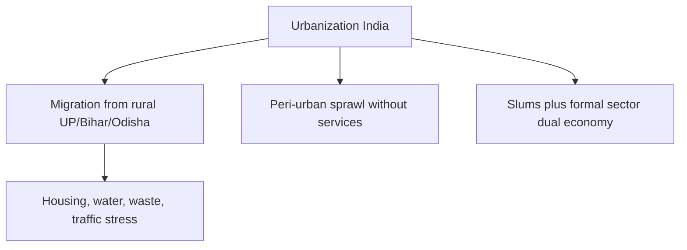

# Urbanization — Problems, Slums & Remedies

> GS-1 · Topic 07.4 · Urbanization — problems, slums, remedies (distinct from Smart Cities Mission — see Topic 15.2)

---

## PYQs

| Year | M | Words | Question (EN) | प्रश्न (HI) | ID |
|------|---|-------|---------------|-------------|-----|
| 2025 | 12 | 200 | Discuss socio-economic problems of urbanization. What structural measures are necessary for sustainable urban development? | नगरीकरण से संबद्ध सामाजिक-आर्थिक समस्याओं की विवेचना कीजिए। सतत शहरी विकास हेतु कौन-से संरचनात्मक उपाय आवश्यक हैं? | Q1 |
| 2023 | 12 | 200 | Is the process of urbanization development or devastation for society? Write your views. | शहरीकरण की प्रक्रिया समाज के लिए विकास या विनाश है — अपना मत लिखिए। | Q2 |
| 2021 | 8 | 125 | Do you agree that urbanization and slums are inseparable? Explain. | क्या आप सहमत हैं कि शहरीकरण और मलिन बस्तियाँ अपृथक्करीय हैं? व्याख्या कीजिए। | Q3 |
| 2021 | 12 | 200 | Examine the nature of urbanization in India and social implications of its fast pace. | भारत में नगरीकरण की प्रवृत्ति का परीक्षण तथा तीव्र गति से बढ़ते नगरीकरण के सामाजिक परिणाम लिखिए। | Q4 |
| 2019 | 8 | 125 | Discuss the role of urban planning for development of basic civic amenities in slums. | मलिन बस्तियों में मूलभूत नागरिक सुविधाओं के विकास हेतु नगर नियोजन की भूमिका की विवेचना कीजिए। | Q5 |
| 2019 | 12 | 200 | Define urbanization. Discuss problems caused by fast pace of urbanization. | नगरीयकरण की परिभाषा। तीव्र गति से नगरीयकरण से उत्पन्न समस्याओं की विवेचना कीजिए। | Q6 |
| 2018 | 8 | 125 | Discuss solutions to urban problems. | शहरी समस्याओं के समाधान की विवेचना कीजिए। | Q7 |

---

## Quick Revision

```
URBANIZATION: Rise in % population in urban areas + growth of urban economic/social character
  Census 2011: 31.16% urban · 377 million · projected ~40%+ by 2030
  Urban areas ~60%+ GDP · migration main driver now (not natural increase)

NATURE IN INDIA (2021):
  Over-urbanization of metros · peri-urban sprawl without services
  · census towns · dual economy (formal IT + informal majority)
  · in-situ slum growth vs planned expansion

SOCIO-ECONOMIC PROBLEMS (2025):
  Housing deficit → slums (~17%+ urban in informal settlements est.)
  · water-sewerage-waste gaps · traffic/pollution/heat islands
  · informal jobs without social security · inequality · crime
  · strain on health/education · loss of community bonds · gender safety

SLUMS INSEPARABLE? (2021): NO — outcome of failed planning, land cost, weak ULB
  · PMAY-U in-situ redevelopment · Singapore/HK planned housing counter-examples

STRUCTURAL MEASURES (2025):
  74th Amendment ULB empowerment · municipal finance (property tax, bonds)
  · master plans + inclusive zoning · transit-oriented development
  · regional planning tier-2 cities · climate-resilient drainage
  · NOT just welfare — institutions + finance + spatial planning

SCHEMES: AMRUT 2.0 · PMAY-Urban · SBM-Urban 2.0 · Metro/MRTS · SCM (see 15.2)
  SDG 11 Sustainable Cities

UP: Kanpur-Lucknow slums · NCR spillover · Smart Cities Lucknow/Varanasi/Kanpur
  · COVID migrant return stress on peri-urban villages

TRAPS: Urbanization ≠ only devastation | Slums ≠ inevitable
  | Smart Cities ≠ full urbanization answer | 74th Amendment weak implementation
  | Urban growth ≠ urbanization (rural growth too)
```

---

## Content

### Context — Urbanization in India

Urbanization is the defining demographic and economic shift of twenty-first-century India. Census 2011 recorded 31.16% urban population (377 million); projections exceed 40% by 2030. What urbanization means: rising proportion of population living in settlements with urban characteristics — non-agricultural economy, density, formal and informal infrastructure needs — not merely city growth. Why it matters: cities generate roughly 60%+ of GDP through services, manufacturing, and trade, yet concentrate inequality, slums, pollution, and governance failures. Uttar Pradesh exemplifies the dual reality — Kanpur, Lucknow, NCR (Noida/Ghaziabad), Varanasi, and Agra combine industrial and service growth with large informal settlements where migrants from Purvanchal and Bundelkhand seek livelihoods.

Indian urbanization is migration-led: rural push (agrarian distress, land fragmentation, drought) plus urban pull (jobs, education, health access) dominate over natural urban birth rate increase. This distinguishes India from Western urbanization driven partly by industrial absorption of rural surplus with planned housing.

### Definition and nature of urbanization in India

| Feature | What it means | Why it matters |
|---------|---------------|----------------|
| Migration-led | Rural distress push + urban job pull | Explains slum formation and peri-urban sprawl |
| Mega-city concentration | Mumbai, Delhi, Bengaluru dominate opportunity | Regional inequality within urbanization |
| Peri-urban sprawl | Village fringes urbanize without ULB services | Governance lag — census towns without municipal status |
| Census towns | Urban by criteria, weak ULB | Service deficit despite urban density |
| Informal dominance | 80%+ non-agri urban jobs informal | No contracts, no social security — working urban poor |
| Dual economy | Formal IT/services + slum-embedded labour | Same city, two worlds |



### Socio-economic problems of urbanization

**Economic problems.** Housing shortage — demand exceeds supply, producing high rents, slums (~17%+ urban in informal settlements), and squatting on public land. Informal employment in construction, domestic work, and street vending carries wage insecurity and no provident fund. Underemployment produces educated unemployed in cities — degree without job. Infrastructure deficit: intermittent water (hours/day supply in many wards), partial sewerage coverage, solid waste landfill crises, and unreliable electricity in slums.

**Social problems.** Anonymity weakens community bonds; nuclear family stress rises without joint support. Slum communities face overcrowding (multiple families per room), poor sanitation, child labour, and school dropout. Gender safety suffers from public harassment, poor street lighting, and inadequate public transport — NFHS-5 spousal violence data contextualizes urban stress. Crime and substance abuse correlate with inequality. Health stress includes respiratory disease from pollution, heat exposure (heat waves hit slum roofs hardest), and epidemic vulnerability — COVID-19 exposed slum density risks when lockdown eliminated daily-wage income.

**Environmental problems.** Air pollution (PM2.5), urban heat islands, and flood vulnerability follow concretization and poor drainage — Chennai 2015, Bengaluru 2022, Delhi monsoon flooding illustrate governance failure. Waste management crisis: single-use plastic and unprocessed MSW fill landfills.

**Governance problems.** Weak ULB finances — property tax collection often below 20% of potential — limits investment. Master plans outdated; illegal construction and encroachment normalize. 74th Amendment (1992) promised devolution but implementation weak in most states including UP.

### Fast pace — social implications

Rapid urbanization drives joint family toward nuclear forms and creates elderly care crises when migrants leave parents in villages. Migration diversifies city culture but raises communal tension potential when son-of-soil politics targets Bihari or UP workers in Mumbai. Slum social capital provides mutual aid amid stigma and tenure insecurity — residents live under constant eviction threat. Child upbringing in hostile built environment — no playgrounds, screen/time poverty for poor children. Politics produces slum vote banks and clientelism — short-term welfare promises over tenure security and in-situ upgrading.

### Urbanization — development or devastation?

**Development case:** cities are GDP engines, innovation hubs, sites of education and health access unavailable in villages, and channels of social mobility for migrants escaping rural caste constraints. Women's mobility (limited but real in metros), demographic opportunity through youth employment, and escape from feudal village hierarchies benefit some migrants.

**Devastation case:** slums, pollution, inequality, mental health stress, crime, unplanned growth destroying wetlands, distress migration replacing rural poverty with urban poverty without uplift — "urbanization of exclusion."

**Balanced verdict:** urbanization is neither purely development nor devastation — outcome depends on planning, inclusion, and livelihood security. Policy determines whether cities become engines of inclusive growth or sites of concentrated deprivation.

### Slums and urbanization — inseparable?

Slums frequently co-occur with rapid urbanization because in-migration plus land scarcity plus low wages produce informal housing when intervention is absent. Partial agreement: historically co-occur in India. Disagree on inevitability: slums reflect policy failure — absent land use planning, affordable housing, tenure security. Counter-examples: Singapore public housing, Curitiba planned density, PMAY-U in-situ upgrading. Slums are symptoms — tenure insecurity, absent services — not criminality of the poor. Verdict: inseparable under current weak planning; avoidable with structural reform including participatory slum planning and regularization with standards.

### Urban planning for slum amenities

Planning must treat slums as formal planning zones, not invisible settlements. Slum surveys and GIS mapping identify population, tenure, and hazard zones. In-situ upgrading delivers water pipes, community toilets, drainage without mass displacement — cheaper and more just than bulldoze cycles. PMAY-U EWS/LIG components and mixed-income housing provide affordable tenure. Regularization with standards — street grids, fire access, open spaces — improves safety. Livelihood linkage through vendor zones (Street Vendors Act 2014) and skill centres near slums integrates economic survival. Participatory planning via slum dweller federations (NSDF model) ensures community consent. Kanpur tannery belt slums illustrate sewage-housing-industrial pollution intersection in UP.

### Structural measures for sustainable urban development

| Measure | What | Why |
|---------|------|-----|
| 74th Amendment implementation | Functional ULBs, mayor authority, ward committees, fund devolution | Local accountability for services |
| Municipal finance reform | Property tax rationalization, user charges, municipal bonds | Revenue for water, waste, roads |
| Spatial planning | Enforced master plans, green belts, TOD, compact cities | Prevents sprawl and flood risk |
| Inclusive zoning | Affordable housing mandates, rental policy, land pooling | Decouples slums from migration |
| Infrastructure missions | AMRUT 2.0, SBM-Urban 2.0, metro expansion | Mission-mode service delivery |
| Regional planning | Invest tier-2/3 cities — reduce mega-city overload | Deconcentrate migration |
| Climate resilience | Urban drainage, flood maps, urban forestry, heat action plans | Protects urban poor from extremes |
| Informal worker security | e-Shram, ONORC, Street Vendors Act | Portable welfare for migrants |

Structural reform means institutions plus finance plus planning — not welfare handouts alone. Schemes: PMAY-Urban, AMRUT 2.0, SBM-Urban 2.0, Smart Cities Mission (area-based, limited — see Topic 15.2), Metro/MRTS, National Urban Digital Mission.

### Solutions to urban problems — integrated summary

Housing through PMAY-Urban, rental policy, slum redevelopment. Water-sanitation through AMRUT 2.0, SBM-Urban 2.0. Transport through Metro, BRT, walkability. Governance through 74th Amendment, municipal finance, digital planning. Inclusion through ONORC (portable ration), e-Shram for migrants, PM SVANidhi for street vendors post-COVID. SDG 11 (Sustainable Cities) provides global benchmark.

### UP-specific urban dynamics

Kanpur: leather tannery pollution, slums along Ganga tributaries, industrial decline versus Lucknow's service growth. Lucknow: admin capital, Smart City pocket, peri-urban Barabanki-Sitapur fringe without ULB services. NCR (Noida, Ghaziabad): Purvanchal migrant influx, gated communities beside unauthorized colonies. Varanasi: heritage tourism, Kashi Vishwanath corridor, slums near ghats. COVID-19: reverse migration from these cities to UP villages exposed urban worker precarity. AMRUT 2.0, PMAY-U, SBM-Urban 2.0 active in UP cities — cite for contemporary answers. 74th Amendment weak in UP — mayor authority limited, property tax collection low — structural reform needed beyond scheme lists.

### Contemporary relevance

COVID-19 migrant exodus exposed slum vulnerability — millions walked highways when lockdown eliminated wages. Heat waves hit urban poor on tin roofs hardest. Climate urban flooding demands drainage reform. PM SVANidhi supports street vendors. Rental housing policy draft addresses migrant tenure. UP: Kanpur-Lucknow slum stress, NCR peri-urban governance gaps, Smart Cities in Lucknow/Varanasi/Kanpur with limited area coverage.

### Sustainable urbanization — integrated structural answer scaffold

Socio-economic problems (housing, water, informal jobs, pollution, gender insecurity) require structural remedies not scheme listing alone: 74th Amendment functional ULBs with mayor authority; municipal finance via property tax and bonds; master plan enforcement; inclusive zoning mandating affordable housing; AMRUT 2.0 and SBM-Urban 2.0 for water-waste; regional tier-2 investment (Amritsar, Jaipur, Coimbatore) to reduce mega-city overload; e-Shram and ONORC for migrant portable welfare; climate-resilient drainage after Chennai-Bengaluru-Delhi flood lessons. Development versus devastation debate: urbanization inevitable — quality is political choice between inclusive planning and exclusionary sprawl. Slums not inseparable: PMAY-U in-situ upgrading, NSDF participatory model, Singapore-Curitiba counter-examples prove policy can decouple migration from informality. Slum planning: GIS mapping, community toilets, vendor zones, tenure security — Kanpur-Lucknow UP examples strengthen state-specific answers. Smart Cities limited coverage — majority wards need AMRUT-scale universal service, not ABCD pocket showcase alone.

### Additional depth — governance, migration, and SDG 11

Urban governance failure explains why migration produces slums: master plans ignore migrant housing need; ULBs lack revenue for sewerage extension to informal settlements; 74th Amendment devolution incomplete — mayor lacks authority in many states including UP; ward committees underutilized. Distress migration differs from voluntary urbanization — push factors (drought, land fragmentation, caste oppression in village) dominate for poorest migrants, not pull of glamour. Peri-urban fringe (Sitapur-Lucknow, Ghaziabad-Meerut) grows without municipal status — people live urban lives with rural governance, worst of both worlds. Gender dimension: urban poor women face double burden — domestic work plus wage labour plus unsafe public transport. Child impact: slum children lack playgrounds, face school dropout for family income, vulnerable to trafficking. SDG 11 targets inclusive, safe, resilient cities — India's performance mixed: smart city pockets amid vast underserved wards. Street Vendors Act 2014 protection often unimplemented — hawker eviction cycles repeat. Climate adaptation: urban heat action plans needed for tin-roof slums; drainage upgrade prevents repeat of 2023 Delhi-Chennai scenes. Regional planning: invest in Kanpur, Varanasi, Agra as tier-2 hubs to absorb UP migration without NCR overload.

Urbanization in India cannot be reduced to Smart Cities Mission showcase pockets — majority urban residents live in wards without piped sewerage, reliable water, or formal tenure. The 2025 PYQ pairing socio-economic problems with structural measures demands institutional analysis: without ULB revenue autonomy and enforced master plans, AMRUT and PMAY disbursements treat symptoms while land speculation and migrant influx recreate slums elsewhere. Inclusive urbanization means portable welfare (ONORC ration, e-Shram registration at destination), vendor legalization, and climate-resilient drainage — not only concrete and metro rails.

### Limits and balanced view

Smart Cities cover limited area — majority wards remain underserved. Slum redevelopment risks gentrification — displacement without resettlement violates justice. Urbanization is inevitable — manage through planning, not prevention; rurban policy balances village investment. Urbanization is not only negative — GDP engine and mobility matter. Slums are not inevitable with affordable housing. 74th Amendment not fully implemented. Slum clearance inferior to in-situ upgrading plus tenure. Urban problems are social, environmental, governance-related — not only economic. Distress migration is push-driven for poor migrants. Metro alone does not fix congestion — needs integrated land use.

---

## Answers

### Q1: Socio-economic problems of urbanization + structural measures. (2025, 12M, 200W)

**Introduction:**
> **Urbanization concentrates economic opportunity but simultaneously generates ** **housing deficits, infrastructure stress, informal labour exploitation, and environmental degradation** unless governed structurally**.

**Main Points:**
- **Socio-economic problems** — **Slums, water-sewage-waste gaps, traffic/pollution, informal jobs, inequality, crime, gender insecurity, health stress**.
- **Indian nature** — **Migration-led, peri-urban sprawl, dual formal-informal economy**.
- **Structural measures** — **74th Amendment ULB empowerment, municipal finance, master plans, inclusive zoning, TOD, regional tier-2 investment**.
- **Infrastructure missions** — **AMRUT 2.0, PMAY-U, SBM-Urban, climate-resilient drainage**.
- **Worker inclusion** — **e-Shram, ONORC, Street Vendors Act**.
- **UP** — **Kanpur-Lucknow slum stress; NCR peri-urban governance gaps**.

**Keywords (underline in exam):** Slums · Informal Sector · ULB · 74th Amendment · AMRUT · PMAY-U · Structural Planning · SDG 11

**Exam diagram (30 sec):**
```
Urbanization problems: housing · infra · informal jobs · pollution
Structural fix: ULB finance + planning + inclusive housing + regional cities
```

**Conclusion:**
> **Sustainable urbanization requires ** **institutional and spatial reform**, not ad hoc slum clearance alone.

---

### Q2: Urbanization — development or devastation? (2023, 12M, 200W)

**Introduction:**
> **Urbanization is neither purely development nor devastation** — **it is a dual process whose outcome depends on planning, inclusion, and livelihood security**.

**Main Points:**
- **Development** — **60%+ GDP, services, education/health access, social mobility, innovation**.
- **Devastation** — **Slums, pollution, inequality, distress migration, weak community, disasters**.
- **Indian evidence** — **Mega-city growth + informal majority workforce**.
- **Policy determinant** — **PMAY-U, AMRUT, ULB reform vs unplanned sprawl**.
- **Balanced view** — **Urbanization inevitable; quality of urbanization is choice**.

**Keywords (underline in exam):** Dual Nature · Informal Sector · Slums · Inclusive Growth · Distress Migration

**Exam diagram (30 sec):**
```
Urbanization = engine (GDP) + crisis (slums/pollution)
Outcome = policy quality
```

**Conclusion:**
> **Cities can be ** **engines of inclusive growth** if structural urban reform prioritizes the working poor.

---

### Q3: Urbanization and slums inseparable? (2021, 8M, 125W)

**Introduction:**
> **Slums frequently accompany rapid urbanization in India, but they are ** **not inherently inseparable** — **they reflect planning failure and housing market exclusion**.

**Main Points:**
- **Why co-occur** — **Migration surge, land cost, low wages, weak ULB capacity**.
- **Not inevitable** — **Planned affordable housing, in-situ upgrading, inclusionary zoning (PMAY-U)**.
- **Slum = symptom** — **Tenure insecurity, absent services, not criminality of poor**.
- **Way forward** — **Participatory slum planning, regularization with standards**.

**Keywords (underline in exam):** Slums · Housing Deficit · PMAY-U · Urban Planning · Tenure Security

**Exam diagram (30 sec):**
```
Rapid migration + no housing plan → slums
Policy can decouple: PMAY · planning · tenure
```

**Conclusion:**
> **Slums are ** **policy outcomes, not natural laws of urban growth**.

---

### Q4: Nature of urbanization in India + fast pace social implications. (2021, 12M, 200W)

**Introduction:**
> **Indian urbanization is ** **migration-driven, uneven, and informal-sector dominated**, **with fast pace straining social fabric and basic services**.

**Main Points:**
- **Nature** — **31.16% urban (2011), mega-city concentration, peri-urban sprawl, census towns, dual economy**.
- **Fast pace drivers** — **Rural distress, LPG-era service growth, demographic youth bulge**.
- **Social implications** — **Nuclear families, slum communities, cultural change, gender risks, political clientelism, weakened traditional support**.
- **Mitigation** — **Regional urban investment, migrant portable welfare, planned density**.

**Keywords (underline in exam):** Migration-led · Peri-urban · Informal Sector · Social Disorganization · Census 2011

**Exam diagram (30 sec):**
```
India: migration → metros/peri-urban
Social: family change · slums · anonymity · inequality
```

**Conclusion:**
> **Managing pace through ** **planned urban expansion and migrant inclusion** determines social sustainability.

---

### Q5: Urban planning for slum civic amenities. (2019, 8M, 125W)

**Introduction:**
> **Urban planning must treat slums as ** **formal planning zones**, not invisible settlements, to deliver water, sanitation, and safety**.

**Main Points:**
- **Slum mapping/GIS surveys** — **evidence-based intervention**.
- **In-situ upgrading** — **water, community toilets, drainage, street access**.
- **PMAY-U linkage** — **affordable tenure without mass eviction**.
- **Participatory planning** — **slum dweller federations, vendor zones, health/education nodes**.
- **UP** — **Kanpur/Lucknow industrial belt slums need sewage-housing integration**.

**Keywords (underline in exam):** In-situ Upgrading · PMAY-U · Slum Survey · Participatory Planning · Civic Amenities

**Exam diagram (30 sec):**
```
Plan slums in master plan → pipes · toilets · roads · tenure
Not bulldoze-only approach
```

**Conclusion:**
> **Slum upgrading is ** **cheaper and more just than recurrent demolition cycles**.

---

### Q6: Define urbanization + fast pace problems. (2019, 12M, 200W)

**Introduction:**
> **Urbanization is the rising share and character of urban population; India's rapid transition produces ** **acute housing, infrastructure, and social inequality challenges**.

**Main Points:**
- **Definition** — **Urban population share increase + non-farm economic dominance in settlements**.
- **Fast pace problems** — **Slums, water-sewage deficit, waste, traffic/pollution, informal poverty, health/education gaps, disasters**.
- **Governance gap** — **ULB weakness, outdated master plans**.
- **Remedies pointer** — **AMRUT, PMAY-U, 74th Amendment, regional planning**.

**Keywords (underline in exam):** Urbanization · Slums · Infrastructure Deficit · Informal Sector · ULB

**Exam diagram (30 sec):**
```
Define urbanization → list fast-growth problems → structural remedies
```

**Conclusion:**
> **Speed of urbanization is manageable only with ** **anticipatory infrastructure and inclusive housing policy**.

---

### Q7: Solutions to urban problems. (2018, 8M, 125W)

**Introduction:**
> **Urban problems require ** **integrated missions plus institutional reform** — **welfare schemes alone insufficient**.

**Main Points:**
- **Housing** — **PMAY-Urban, rental policy, slum redevelopment**.
- **Water-sanitation** — **AMRUT 2.0, SBM-Urban 2.0**.
- **Transport** — **Metro, BRT, walkability**.
- **Governance** — **74th Amendment, municipal finance, digital planning**.
- **Inclusion** — **ONORC, e-Shram for migrants; Street Vendors Act**.

**Keywords (underline in exam):** PMAY-U · AMRUT · SBM-Urban · 74th Amendment · SDG 11

**Exam diagram (30 sec):**
```
Solutions: housing · water · waste · transport · ULB reform · migrant welfare
```

**Conclusion:**
> **Sustainable cities combine ** **hard infrastructure with social inclusion and local self-government**.

---

## Traps

| Wrong | Correct |
|-------|---------|
| Urbanization = only negative | **GDP engine, mobility, services — dual nature** |
| Slums inevitable with cities | **Planning and affordable housing can prevent/upgrad** |
| Smart Cities solve all urban problems | **Limited ABD pockets — see Topic 15.2** |
| Urbanization = urban growth only | **Urbanization is ** **% shift**; both can grow |
| 74th Amendment fully implemented | **Devolution weak in most states** |
| Slum clearance = best solution | **In-situ upgrading + tenure often better** |
| Urban problems only economic | **Social, environmental, governance equally tested** |
| Rural urbanization unrelated | **Peri-urban fringe is hybrid crisis zone** |
| Metro alone fixes congestion | **Needs integrated land use + last mile** |
| Distress migration = voluntary urbanization | **Push factors dominate for poor migrants** |

---

*Complete.*
