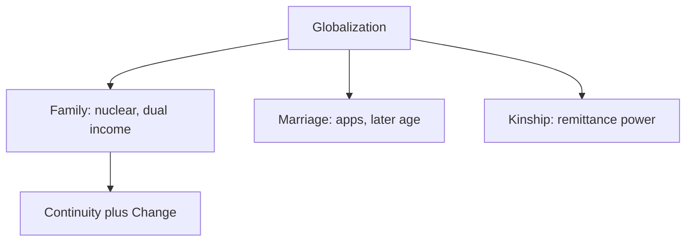

# Globalization & Social Institutions — Family, Marriage, Kinship

> GS-1 · Topic 08 · Globalization effects on family, marriage, kinship in India

---

## PYQs

| Year | M | Words | Question (EN) | प्रश्न (HI) | ID |
|------|---|-------|---------------|-------------|-----|
| 2025 | 12 | 200 | What are the visible effects of globalization on family, marriage and kinship system? Analyse with reference to the Indian society. | परिवार, विवाह एवं नातेदारी व्यवस्था पर वैश्वीकरण का क्या प्रभाव दिखाई देता हैं? भारतीय समाज के सन्दर्भ में इसका विश्लेषण कीजिए। | Q1 |

---

## Quick Revision

```
FAMILY (Indian baseline): Joint/stem family · patrilineal · extended · collectivist · filial piety · authority of elders

GLOBALIZATION CHANNELS: LPG 1991 · migration · remittances · media/OTT · social media · dating apps · MNC work culture
  · nuclear housing in metros · women's employment · consumer weddings

FAMILY CHANGES:
  Joint → nuclear/stem · smaller household size (Census trend)
  · geographically dispersed (Skype/WhatsApp families) · individualism ↑ · privacy demand
  · dual-income households · elderly care crisis · single-parent (rare but rising visibility)
  · live-in relationships (urban, legally debated) · pet families · DINK couples

MARRIAGE CHANGES:
  Arranged → assisted (apps: Shaadi.com, BharatMatrimony) · love-inter-caste/inter-faith ↑ (still contested)
  · rising age at marriage (NFHS-5) · divorce ↑ (urban courts) · dowry persists despite law
  · destination/consumption weddings · cross-border NRI marriages · Special Marriage Act 1954
  · court rulings on privacy (Puttaswamy 2017) affect marital autonomy

KINSHIP CHANGES:
  Bilateral influence (NRI remittance kin) · weakening village exogamy/jati rules in metros
  · functional kinship (who sends money) vs ritual kinship · sibling bonds via digital contact
  · matrilineal pockets (Kerala, Meghalaya) react differently
  · caste endogamy persists — globalization did NOT erase

SOCIOLOGISTS: Irawati Karve (kinship regions) · M.N. Srinivas · A.M. Shah (joint family change)
  · Patricia Uberoi (family in Asia) · Roland Lardinois (Indian family modernity)

POSITIVE: Women voice ↑ · choice in partner (urban) · smaller families + education · rights awareness (DV Act)
NEGATIVE: Marriage commodification · domestic violence under stress · lonely elderly · commercial surrogacy debates

CONTEMPORARY: UPI remittance families · OTT portrayal of relationships · Supreme Court same-sex marriage petition (2023)
  · NEP lifelong learning · migrant worker family separation · COVID return migration stress

TRAPS: Nuclear ≠ no kinship obligation | Apps ≠ love marriage majority yet
  | Divorce ↑ ≠ family collapse | Globalization ≠ Western-only marriage forms
  | Caste endogamy still dominant | Live-in ≠ legally married — different rights
```

---

## Content

### Context — Family, marriage, and kinship

Family is the co-residing unit bound by marriage, blood, or adoption. In India the joint family — multiple generations, common kitchen, patrilineal authority — was the historical norm. Marriage functions as sacramental-social contract linking two kin groups; arranged, endogamous (caste/jati), patrilocal marriage dominated, governed by Hindu Marriage Act 1955, Special Marriage Act 1954, and personal laws. Kinship is the relational network of blood (consanguine), affinal (marriage), and fictive ties. Irawati Karve mapped north versus south versus tribal kinship regional variations. Globalization since LPG 1991 intensifies migration, media, consumer markets, and women's employment — restructuring but not abolishing these institutions. A.M. Shah and Patricia Uberoi emphasize adaptive continuity over wholesale replacement.

### Baseline — traditional Indian family system

| Feature | Traditional pattern | Globalization pressure |
|---------|---------------------|------------------------|
| Structure | Joint/stem family, elder authority | Nuclear units in migrant metros |
| Marriage | Arranged, caste endogamy, early age | Later marriage, apps, inter-caste love |
| Residence | Patrilocal | Neolocal separate home |
| Gender roles | Male breadwinner, female homemaker | Dual-earner couples |
| Kin obligations | Jajmani, lifecycle rituals, dowry | Remittance obligations |
| Decision-making | Collective elder male | Individual/couple autonomy |

### Visible effects on family

**Structural — nuclearization and stem family.** Census household data show declining average size. Urban nuclear common among IT migrants in Bangalore, Pune, Gurugram. Stem family — parents with one co-residing son while siblings migrate — partial jointness. WhatsApp/Skype sustain emotional bonds without daily cooperation.

**Economic — dual income and consumer lifestyle.** LPG enables women's BPO/retail/gig work; budgets tie to global cycles. Housing EMI culture in gated communities imports privacy norms.

**Care crisis.** Elderly alone in villages or old-age homes (rising in metros). Nuclear couples rely on creches or flying-in grandparents.

**Alternative forms.** Live-in relationships (Puttaswamy 2017 privacy context) — legal rights incomplete. Single-parent households less hidden. DINK couples.



### Visible effects on marriage

Matrimonial apps (Shaadi.com, BharatMatrimony) — global tech plus caste filters — hybrid modernity. Love marriages increase in metros; honour crimes in hinterland show conflict. NFHS-5: rising median age at first marriage linked to education. Divorce higher in urban educated cohorts — HMA 1955 mutual consent. DV Act 2005 covers live-in. Destination weddings — dowry persists disguised as gifts. NRI marriages — transnational matchmaking, visa fraud, MEA advisories.

### Visible effects on kinship

Lifecycle rituals shortened, outsourced to event managers. Remittance kin (Gulf, US NRIs) gain authority over land-based elders. Caste endogamy persists — apps reinforce filters. Karve: north exogamy rules loosen via migration; south cross-cousin traditions meet IT partner pools; matrilineal Kerala/Khasi different trajectories. Facebook family groups maintain affinal ties globally.

### Analytical frameworks

Uberoi/Lardinois: institutional adaptation — marriage central but commodified. Gender lens: employment increases leverage; violence persists under stress. Class lens: elite globalized marriages vs child marriage pockets.

| Domain | Positive | Negative |
|--------|----------|----------|
| Family | Planned families; women's fertility voice | Elderly isolation |
| Marriage | Later marriage, choice; legal awareness | Commodification, dowry, honour crimes |
| Kinship | Digital connectivity; remittances | Ritual erosion; online endogamy |

### Migration and remittances on rural family

Male out-migration creates women-headed households in Bihar, UP, Odisha. Remittance houses raise migrant prestige. Women manage farms and SHGs — autonomy plus burden. NRI groom preference — dowry inflation, fraud. COVID reverse migration (2020) stressed budgets. Kinship becomes transactional — rituals funded, daily reciprocity weakens.

### Personal laws table

| Law | Feature | Globalization interaction |
|-----|---------|---------------------------|
| HMA 1955 | Monogamy, divorce | Urban divorce with women's employment |
| Triple Talaq Act 2019 | Reformed Muslim divorce | Global feminist pressure |
| SMA 1954 | Civil inter-faith | Cosmopolitan couples |
| Tribal customs | Community rules | Mining capital disrupts kin-land bonds |

### Joint family continuity and change

Change: nuclear/stem in metros; authority erosion as youth depend on global wages not elder land. Continuity: festival reunions, remittance mutual aid, patrilineal ideals (son preference, HSA 2005 daughters' rights). A.M. Shah: joint family as cultural ideal survives though practice pluralizes. Class divide: elite nuclear vs rural joint.

### Urban marriage under globalization

Apps with caste filters; love-inter-caste via SMA 1954; consumer wedding industry; delayed marriage for career; divorce visibility; live-in and Puttaswamy autonomy; double burden post-marriage unresolved.

### COVID-19 and family structure

Reverse migration reunified families temporarily. WFH renegotiated domestic labour — spousal violence context (NFHS-5). Digital weddings normalized remote kin participation.

### Family — extended analysis of nuclearization

What nuclearization means: married couple establishes separate household (neolocal residence), financial decisions made by conjugal unit rather than joint patriarch, children socialized in urban institutional settings (schools, creches) rather than extended kin network. How globalization drives it: IT and service jobs concentrate in metros requiring geographic mobility; housing costs force smaller units; women's employment makes dual-earner nuclear unit economically rational; global media valorizes privacy and individual choice over collective authority. Why continuity persists: festival reunions (Diwali, Holi, Eid) reassemble dispersed kin; remittances maintain financial obligations; crisis (illness, death) triggers temporary joint co-residence; cultural ideal of joint family survives in popular cinema and parental expectations even when practice is nuclear.

A.M. Shah's research showed stem family as compromise — one son co-resides with parents while siblings migrate — common in Gujarat and Maharashtra villages. Proof from Census trend: average household size declined over decades; yet proportion of elderly living alone rises — care crisis as unintended consequence of successful migration.

### Marriage — extended analysis of assisted arranged marriage

Matrimonial platforms combine global technology with Indian endogamy: users filter by caste, sub-caste, gotra, horoscope, income, NRI status — reinforcing jati boundaries while modernizing search method. Why arranged marriage persists: family approval validates alliance between kin networks (property, status, safety); love marriage still faces honour crime risk in conservative hinterland (Khap panchayats, Haryana-U.P. belt). NFHS-5 documents rising age at first marriage — women marrying later when educated — convergence with global delayed-marriage pattern among elite, not mass. Divorce: urban educated cohorts file mutual consent under HMA 1955; national rate remains moderate — stigma persists in small towns. Commodification: destination weddings in Goa, Udaipur import global luxury norms; dowry disguised as "gifts" evades Dowry Prohibition Act 1961.

### Kinship — Irawati Karve regional models applied

North India (Indo-Aryan): village exogamy, gotra exogamy, patrilineal descent, patrilocal residence — globalization loosens enforcement when youth migrate to metros and marry across regional lines. South India (Dravidian): cross-cousin marriage traditions (marriage to mother's brother's daughter in some communities) — IT migration creates partner pools outside traditional circles. Tribal kinship: clan-based systems, often communitarian land rights — mining and displacement break kin-land bonds (Sixth Schedule areas). Matrilineal pockets (Kerala Nair historically, Khasi-Garo in Meghalaya): women's property rights stronger — globalization affects differently than patrilineal north. Functional kinship: remittance from Gulf NRIs elevates migrant's branch over landholding elders — authority follows money, not ritual seniority alone.

### Contemporary relevance

Same-sex marriage petition (2023); OTT family norms streamed globally; migrant COVID exodus; UPI remittances; SMA for inter-faith under communal pressure.

### Globalization and Indian kinship — comprehensive analysis for 12-mark answers

Introduction frame: LPG 1991 plus migration, media, MNC work culture restructure family-marriage-kinship while retaining institutional centrality — adaptive continuity not Western replacement. Family: nuclearization in metros (Census household size decline); stem family compromise in villages; dual-income couples; elderly care crisis; WhatsApp families sustain emotional ties across continents; live-in and DINK urban visibility. Marriage: assisted arranged via Shaadi.com with caste filters; NFHS-5 later marriage age; urban divorce under HMA 1955; dowry commodification via destination weddings; NRI marriage fraud; Special Marriage Act for inter-faith; Puttaswamy privacy for autonomy incomplete versus marital rights. Kinship: ritual obligations shrink (event managers replace elders' roles); remittance kin gain authority; caste endogamy persists on apps; Karve regional models (north exogamy, south cross-cousin, tribal clan, matrilineal Kerala) react differently to migration. Migration-remittance: Bihar-UP-Odisha outflow; women-headed households; COVID reverse migration 2020. Positive: women's voice, planned families, legal awareness (DV Act). Negative: commodification, honour crimes, elderly isolation. Conclusion: globalization individualizes and commodifies yet marriage-kinship remain central — modified intensity, not disappearance. A.M. Shah, Uberoi, Irawati Karve cite for sociological depth.

### Additional depth — sociologists, laws, and proof for each institution

Irawati Karve's regional kinship geography remains valid despite globalization — marriage rules differ north-south-tribal; migration loosens enforcement but does not erase preference. A.M. Shah documented joint family as ideology persisting after practice nuclearized — ideological continuity matters for ritual and inheritance disputes. Patricia Uberoi analyzed family in Asia under global capital — Indian marriage becomes transaction involving global flows (NRI groom, dollar dowry, foreign education premium). Roland Lardinois on Indian family modernity — conjugality rises but embedded in kin network approval. Hindu Marriage Act 1955 monogamy and judicial divorce enabled urban mutual consent exits. Muslim Women Act 2019 criminalized instant triple talaq — global feminist pressure plus domestic mobilization. Special Marriage Act 1954 enables civil inter-faith union against communal pressure — globalization of cosmopolitan identity meets local majoritarianism. Domestic Violence Act 2005 covers live-in — partial legal recognition of non-marital cohabitation. Puttaswamy 2017 privacy fundamentality supports marital autonomy arguments. Supreme Court same-sex marriage petition 2023 — global LGBTQ human rights discourse meets Indian kinship law — pending institutional adaptation. Proof points: Census household size decline; NFHS later marriage age; Shaadi.com caste filter screenshots in sociological studies; remittance architecture in Kerala and UP villages; COVID digital wedding normalization.

2025 PYQ on family-marriage-kinship requires tri-partite structure with Indian proof in each: family nuclearization (Bangalore IT migrants), marriage apps with caste filters (Shaadi.com), kinship remittance authority (Gulf NRIs in Kerala and UP villages). Cite NFHS-5 for marriage age, HMA 1955 for divorce, DV Act 2005 for live-in, Karve for regional kinship. Conclude adaptive continuity — globalization modifies intensity of kin obligations without dissolving marriage as central institution.

### Positive and negative synthesis — family, marriage, kinship

Positive visible effects include smaller planned families linked to women's education and NFHS-documented fertility decline; urban women's employment in BPO and services increasing voice in household decisions; legal rights awareness through DV Act 2005 and global feminist discourse including POSH 2013; digital connectivity allowing dispersed kin to maintain emotional bonds via WhatsApp family groups; remittances lifting rural household income and children's education investment. Negative visible effects include elderly isolation when children migrate without co-residence; marriage commodification through destination weddings and dowry inflation disguised as gifts; NRI marriage fraud exploiting aspiration for foreign groom; honour crimes when inter-caste or inter-faith love defies community norms; ritual kinship erosion as lifecycle ceremonies shrink and event managers replace elders' roles; caste endogamy reinforced on matrimonial platforms despite globalization rhetoric of choice.

Class lens essential: elite metros experience globalization of marriage as delayed companionate union; rural and small-town India majority still experience arranged endogamous marriage with patriarchal authority — dual India within one analytical frame. Gender lens: double burden of paid work plus domestic roles persists post-marriage; globalization opens employment without redistributing care work. Continuity-change model conclusion: marriage remains central institution organizing property, ritual, and alliance — but its form commodified, delayed, technologized, and individually negotiated among urban educated cohort while tradition persists elsewhere.

### Limits and balanced view

Majority marriages still arranged-endogamous. Nuclearization ≠ kinship death — festivals continue. Rural joint persists with land. Live-in ≠ marriage for inheritance. Apps did not eliminate caste. Divorce rise urban-specific. Dowry persists despite law. Same-sex legal position evolving — avoid false certainty.

---

## Answers

### Q1: What are the visible effects of globalization on family, marriage and kinship system? Analyse with reference to the Indian society. (2025, 12M, 200W)

**Introduction:**
> **Globalization** — through **LPG reforms, migration, media, and global labour markets** — visibly reshapes **Indian family structure, marriage practices, and kin networks** while ** retaining core institutional importance**.

**Logical Analysis:**
- **Family — Nuclearization** — **Migrant IT/service workers** in **metros (Bangalore, Pune)** form **nuclear households**; **Census trend** of **smaller household size**.
- **Family — Dual-Income & Care Crisis** — **Women's BPO/retail jobs** — **dual earners**; **elderly/childcare gaps** as **joint support weakens**.
- **Family — Digital Connectedness** — **WhatsApp/Skype** sustain **dispersed kin** — **emotional ties without co-residence**.
- **Marriage — Assisted Arranged** — **Shaadi.com, BharatMatrimony** — **global tech + caste endogamy filters** — **hybrid modernity**.
- **Marriage — Later Age & Rising Divorce (Urban)** — **NFHS-5** later **first marriage**; **family courts** handle **mutual consent divorce (HMA 1955)**.
- **Marriage — Commodification** — **Destination weddings, luxury spend** — **global consumer wedding industry**; **dowry persists** despite law.
- **Kinship — Functional Remittance Kin** — **Gulf/US NRIs** — **economic authority** shifts to **migrants** over **land-based elders**.
- **Kinship — Endogamy Persists** — **Caste marriage rules** continue on **apps** — globalization **does not erase jati boundaries**.

**Keywords (underline in exam):** Nuclear Family · Joint Family · Arranged Marriage · NFHS-5 · Remittance · Kinship · Endogamy

**Exam diagram (30 sec):**
```
Globalization (migration · media · jobs)
   ├→ Family: nuclear · dual income · digital
   ├→ Marriage: apps · later age · commodified
   └→ Kinship: remittance power · endogamy stays
```

**Conclusion:**
> Globalization **individualizes and commodifies** family life yet **marriage-kinship remain central** — India shows **adaptive continuity**, not ** wholesale Western family replacement**.

---

### Q2: *Likely variant:* Discuss the impact of migration and remittances on rural family and kinship structure in India. (—, 12M, 200W)

**Introduction:**
> **Globalization-driven migration** — **internal (UP→Mumbai) and international (Kerala→Gulf)** — restructures **rural families** through **remittances, absent members, and shifting authority**.

**Main Points:**
- **Stem/Joint Family Modification** — **Male out-migration** — **women-headed de facto households** in **Bihar, UP, Odisha**.
- **Remittance Status** — **Concrete houses, consumer goods** — **migrant's kin prestige** rises over **traditional land elites**.
- **Gender Role Shift** — **Women manage farms, SHGs** — **greater autonomy** with ** added burden**.
- **Marriage Markets** — **NRI groom preference** — **dowry inflation**, ** fraud risk** — **MEA advisories**.
- **Kin Obligation Recalibration** — **Lifecycle rituals funded by remittances** but **physical absence** weakens **daily reciprocity**.
- **Left-Behind Elderly & Children** — **Care deficits**, **schooling in hostels** — **social cost of migration**.
- **Return Migration (COVID 2020)** — **Sudden reunification stress** on **urban-rural family budgets**.
- **Assessment** — **Economic uplift** with ** relational thinning** — **kinship becomes transactional**.

**Keywords (underline in exam):** Remittances · Migration · Stem Family · NRI Marriage · SHG · Left-Behind Families

**Exam diagram (30 sec):**
```
Rural migrant → remittance
     ↓
Status ↑ · women roles ↑ · rituals funded · daily kinship ↓
```

**Conclusion:**
> Migration **globalizes village economies** while **transforming kinship from ritual-co-residence to remittance-supported networks**.

---

### Q3: *Likely variant:* How has globalization affected the institution of marriage in urban India? (—, 8M, 125W)

**Introduction:**
> **Urban India** experiences **globalization most intensely** — marriage shows **later ages, technology mediation, commodification, and rising divorce visibility**.

**Main Characteristics:**
- **Matrimonial Apps** — **Caste-filtered assisted arranged** — **Shaadi.com ecosystem**.
- **Love-Inter-Caste/Inter-Faith** — **Special Marriage Act 1954** — **still socially contested**.
- **Consumer Wedding Industry** — **Destination, themed weddings** — **global luxury norms**.
- **Working Women & Delayed Marriage** — **Career before marriage** — **NFHS-5 age trend**.
- **Divorce & Remarriage Visibility** — **Urban family courts** — **stigma slowly reducing**.
- **Live-In & Privacy Jurisprudence** — **Puttaswamy 2017** — **autonomy discourse** without **full marital rights**.
- **Double Burden Post-Marriage** — **Paid work + domestic roles** — **unresolved gender equity**.

**Keywords (underline in exam):** Assisted Arranged · Special Marriage Act · NFHS-5 · Consumer Wedding · Divorce · Urbanization

**Exam diagram (30 sec):**
```
Urban + global media/jobs
   → apps · late marriage · luxury wedding · divorce visibility
```

**Conclusion:**
> Urban marriage becomes **more individual-choice oriented and commodified** while **family approval and caste endogamy** still **shape outcomes**.

---

### Q4: *Likely variant:* Analyse continuity and change in the Indian joint family system under globalization. (—, 8M, 125W)

**Introduction:**
> The **joint family** — **multi-generational, common property, ritual unity** — ** adapts rather than vanishes** under **globalization-induced migration and nuclear housing**.

**Main Points:**
- **Change — Nuclear/Stem Forms** — **Metros**: **neolocal residence**; villages: **stem family** with **one co-residing son**.
- **Change — Authority Erosion** — **Land-less youth** depend on **global wages**, not ** elder land control**.
- **Continuity — Ritual Unity** — **Festivals, weddings, funerals** reunite **dispersed kin** annually.
- **Continuity — Financial Mutual Aid** — **Remittances, education loans** — **family as social security**.
- **Continuity — Patrilineal Ideals** — **Son preference, inheritance disputes** persist (**HSA 2005** amended daughters' rights).
- **A.M. Shah Insight** — **Joint family as cultural ideal** survives though **practice pluralizes**.
- **Class Divide** — **Elite nuclear** vs **rural joint** — **globalization effects uneven**.

**Keywords (underline in exam):** Joint Family · Stem Family · Nuclearization · Migration · Ritual Kinship · A.M. Shah

**Exam diagram (30 sec):**
```
Practice: nuclear/stem ↑
Ideal + rituals: joint unity persists
```

**Conclusion:**
> Globalization **fragments co-residence** but **preserves kin collective** through **ritual, remittance, and crisis solidarity**.

---

## Traps

| Wrong | Correct |
|-------|---------|
| Globalization destroyed joint family in India | **Nuclearization in metros** + **stem/joint persistence** in **village/rural** |
| Most marriages are love marriages now | **Majority still arranged/assisted** — **apps reinforce endogamy** |
| Dating apps eliminated caste | **Caste filters** common on **matrimonial platforms** |
| Nuclear family = no kin obligations | **Festivals, remittances, crisis support** — **obligations continue** |
| Divorce explosion everywhere | **Higher in urban educated cohorts** — **national rate still moderate** |
| Live-in = same legal status as marriage | **DV Act covers some protection** — **inheritance, maintenance differ** |
| Kinship identical across India | **Irawati Karve regional models** — **north vs south vs tribal** |
| Globalization only Western marriage | Also **NRI, Gulf, diaspora** patterns — **not only American model** |
| Smaller families = only positive | **Elderly care gap, loneliness** — **mention costs** |
| Dowry ended with law | **Persists disguised as gifts** — **consumer weddings** worsen display |
| WhatsApp families = weakened bonds only | **Also strengthens long-distance ties** — **dual effect** |
| Same-sex marriage legalized in India | **Supreme Court heard petitions 2023** — state **legal position evolving** — avoid false certainty |

---

*Complete.*
