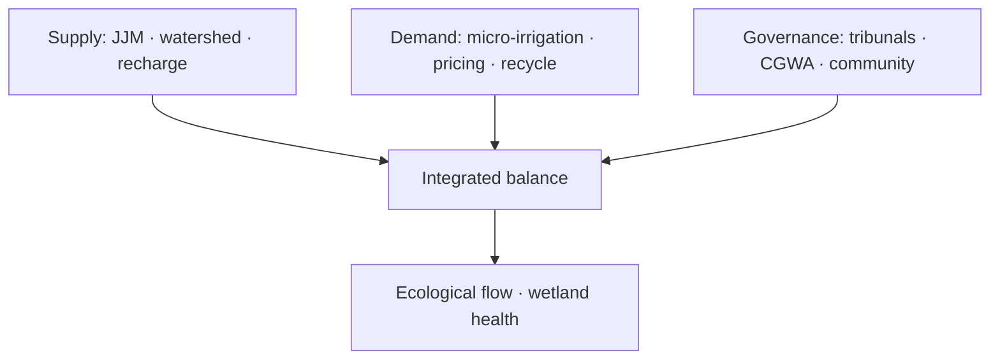

# Water Resources — Crisis, Management & Conservation

> GS-1 · Topic 10 · Water resources, crisis, management, ecological balance (India)

---

## PYQs

| Year | M | Words | Question (EN) | प्रश्न (HI) | ID |
|------|---|-------|---------------|-------------|-----|
| 2021 | 8 | 125 | What is water crisis? Suggest suitable measures for water resource management. | जल संकट क्या है? जल संसाधन प्रबन्धन के लिए उपयुक्त उपाय सुझाइये। | Q1 |

---

## Quick Revision

```
WATER CRISIS = Demand exceeds sustainable supply OR quality unfit OR inequitable access
  Physical scarcity + economic scarcity + ecological degradation

INDIA FACTS: ~4% global freshwater · ~18% population · per capita ↓ (stress <1700 m³)
  Groundwater 40%+ irrigation · 80%+ rural domestic in many states · 60+ districts critical (CGWB)

SOURCES: Rainfall (monsoon-dependent) · rivers (Ganga, Brahmaputra, Godavari…) · glaciers (Himalaya)
  · groundwater · tanks/lakes · desalination (coastal)

SOUTH/SOUTH-EAST ASIA: Monsoon regimes · Mekong, Irrawaddy, Indus basins · shared transboundary waters
  · delta vulnerability (Bangladesh, Vietnam) · India = upstream riparian for several

MANAGEMENT MEASURES:
  Jal Jeevan Mission (Har Ghar Jal) · Atal Bhujal Yojana · PMKSY (micro-irrigation)
  · National Water Mission · watershed (NABARD) · rainwater harvesting · aquifer recharge
  · inter-state tribunals (Cauvery, Krishna) · National Green Tribunal · groundwater rules 2020
  · AMRUT 2.0 · river rejuvenation (Namami Gange) · wastewater recycling · pricing/demand mgmt

ECOLOGICAL BALANCE (link forest-water PYQ):
  Forests = catchment · wetlands = aquifer recharge · mangroves buffer coast
  · biodiversity in rivers (Ganges dolphin) · eutrophication if polluted

TRAPS: Water crisis ≠ only drought | India water-rich in absolute (Himalayan rivers) but maldistributed
  | Groundwater ≠ infinite | Interlinking ≠ silver bullet | JJM = supply not source creation alone
```

---

## Content

### Context — water as a renewable but locally finite natural resource

Water is classified as a renewable natural resource because the hydrological cycle continuously replenishes rivers, lakes, and aquifers through precipitation, runoff, and recharge. That renewal is not uniform in space or time, which is why water behaves as a locally finite resource even at the national scale. India receives roughly four percent of the world's freshwater precipitation while supporting about eighteen percent of global population, creating a structural imbalance between supply and demand before any question of management failure arises. The bulk of India's utilizable water arrives during the four monsoon months, while irrigation, industry, and domestic use require supply across the year; Himalayan rivers such as the Indus, Ganga, and Brahmaputra carry perennial flow from snow and glacier melt, whereas peninsular rivers like the Godavari, Krishna, Cauvery, Mahanadi, Narmada, and Tapi depend primarily on seasonal rainfall and therefore fluctuate sharply between surplus and deficit. Per capita water availability, estimated by NITI Aayog and related agencies using population and utilizable water figures, fell from approximately 5,177 cubic metres in 1951 to about 1,486 cubic metres in 2021, crossing below the internationally cited water-stress threshold of 1,700 cubic metres per person per year and approaching the absolute scarcity band below 1,000 cubic metres. South and South-East Asia share this monsoon-dominated hydrology: the Ganges-Brahmaputra-Meghna, Indus, and Mekong basins cut across national boundaries, and India occupies an upstream position for Pakistan, Bangladesh, and Nepal on several shared rivers, which means domestic water policy cannot be separated from hydro-diplomacy and downstream delta vulnerability in Bangladesh and Vietnam.

### What constitutes a water crisis — and why drought alone is insufficient as a definition

A water crisis exists when available clean freshwater is insufficient to meet drinking, agricultural, industrial, and ecological needs in a sustainable manner. The definition deliberately extends beyond meteorological drought because India simultaneously faces quantity shortfalls, quality degradation, and inequitable access. Quantity stress appears most visibly in groundwater over-extraction: the Central Ground Water Board classifies large numbers of assessment units as critical or over-exploited, especially in Punjab, Haryana, Rajasthan, Uttar Pradesh, and Tamil Nadu, where subsidized electricity and tube-well expansion after the Green Revolution drew down aquifers faster than monsoon recharge could restore them. Quality crisis is documented by the Central Pollution Control Board through polluted river stretches on the Ganga, Yamuna, Hindon, and other channels receiving untreated industrial effluent and municipal sewage. Access inequity persists where rural women walk long distances to fetch water and urban slums remain underserved despite cities concentrating wealth and infrastructure. Inter-sector competition intensifies the crisis because agriculture withdraws roughly seventy-eight percent of India's utilisable water, leaving industry, drinking water, and environmental flows to compete for the remainder. Climate change adds a compounding layer by altering glacier melt timing in the Himalaya, increasing the frequency of extreme floods and droughts, and pushing saline intrusion into coastal aquifers in the Sundarbans and parts of the Kerala coast.

| Dimension of crisis | How it manifests in India | Why it matters |
|---------------------|---------------------------|----------------|
| **Quantity** | Over-exploited groundwater blocks; seasonal peninsular scarcity | Threatens irrigation, drinking supply, and aquifer longevity |
| **Quality** | CPCB-identified polluted stretches on major rivers | Unfit water raises health costs and treatment burden |
| **Access inequity** | Rural fetch distances; urban slum gaps | Water poverty persists despite aggregate national figures |
| **Inter-sector competition** | Agriculture ~78% of withdrawals | Industry and ecology receive residual share |
| **Climate change** | Glacier shift, extremes, coastal salinity | Amplifies existing spatial-temporal mismatch |

### How India's surface and groundwater are distributed — and why storage and recharge differ by region

Surface water in India divides into two broad hydrological regimes. Himalayan rivers are perennial and carry a large share of utilisable flow during monsoon months, yet much of that potential remains unused or disputed across states and countries. Peninsular rivers are rain-fed, carry inter-state disputes resolved through tribunals and authorities such as the Cauvery Water Management Authority, Krishna tribunal awards, and Ravi-Beas adjudication, and depend heavily on reservoir storage because natural flow is insufficient between monsoons. Traditional tanks and lakes—talabs in Rajasthan, eris in Tamil Nadu—once buffered seasonal variability but declined through siltation and encroachment; their revival forms part of supply-side strategy because they recharge local aquifers and support tail-end irrigation. Groundwater supplies more than forty percent of irrigation nationally and over eighty percent of rural domestic water in many states, making it the invisible backbone of India's food and village water security. Hard-rock aquifers of the Deccan trap recharge slowly through fractures, while alluvial aquifers of the Indo-Gangetic plain accept faster recharge but face contamination and overdraft where pumping exceeds natural replenishment. In South-East Asia, upstream dam construction on the Mekong parallels Indian concerns over Teesta and Brahmaputra developments; Bangladesh's delta struggles with salinity and arsenic in groundwater, foreshadowing risks for Indian coastal aquifers if extraction and sea-level rise proceed unchecked.

| Source type | Representative examples | Recharge / utilisation character |
|-------------|-------------------------|--------------------------------|
| **Himalayan rivers** | Indus, Ganga, Brahmaputra | Perennial; monsoon peak flow; transboundary |
| **Peninsular rivers** | Godavari, Krishna, Cauvery | Rain-fed; storage-dependent; inter-state disputes |
| **Traditional tanks** | Tamil eris, Rajasthan talabs | Local recharge; community-managed historically |
| **Alluvial groundwater** | Indo-Gangetic plain | High yield; over-extraction risk |
| **Hard-rock groundwater** | Deccan plateau | Slow recharge; deep drilling common |

### How water resource management works — supply augmentation, demand restraint, and governance

Integrated water resource management treats supply expansion, demand reduction, institutional coordination, and ecological maintenance as mutually reinforcing rather than substitutable. On the supply side, the Jal Jeevan Mission (2019) aims at functional household tap connections under the Har Ghar Jal objective, extending targets beyond 2024 while requiring village-level source sustainability plans so that connection counts do not outlive the springs and borewells that feed them. Atal Bhujal Yojana mobilises community-led groundwater management across seven states covering more than eight thousand gram panchayats, because aquifer recovery requires behavioural change at the local level, not regulation alone. The Pradhan Mantri Krishi Sinchayee Yojana's Per Drop More Crop component subsidises drip and sprinkler micro-irrigation so that the same volume of water produces more crop biomass. Watershed programmes supported by NABARD and the Integrated Watershed Management Programme conserve soil moisture through contour bunding, afforestation, and check dams, which slows runoff and increases infiltration. Rainwater harvesting is mandatory in Tamil Nadu since 2003, incorporated in Delhi building bylaws, and linked to traditional stepwell revival because capturing rooftop and surface runoff reduces pressure on public supply. Inter-linking of rivers, with the Ken-Betwa link as the first major project, transfers surplus basin water to deficit basins but carries ecological and social costs including habitat fragmentation in Panna tiger landscape, which is why it remains contested rather than universally endorsed.

Demand-side and governance measures complement supply because no augmentation programme can keep pace with unrestrained use. The National Water Mission under the National Action Plan on Climate Change (2008) targets a twenty percent improvement in water use efficiency across sectors. The Central Ground Water Authority and state groundwater rules modelled on 2020 central guidelines regulate industrial extraction and mandate recharge obligations in critical blocks. Inter-state tribunals and management authorities translate constitutional water jurisdiction into enforceable sharing formulas, while the National Green Tribunal enforces pollution standards where executive agencies lag. Pricing and user associations—exemplified by Pani Panchayat experiments in Maharashtra and tank user societies in Tamil Nadu—align individual incentive with collective sustainable yield. Wastewater recycling through sewage treatment plants under Namami Gange and urban reuse projects such as Bengaluru supplying treated water to industry reduces freshwater demand for non-potable uses. AMRUT 2.0 strengthens urban water supply and water-body rejuvenation, addressing the concentration of demand in cities.



Community participation through water user associations and local stewardship converts policy into practice because aquifer and river health ultimately depend on decisions taken at the farm, household, and ward level.

### Why water-body biodiversity and forest catchments sustain ecological balance

Rivers, wetlands, lakes, and aquifers host aquatic biodiversity that performs hydrological regulation, water purification, and livelihood support functions essential to regional ecological balance. Ramsar sites including Keoladeo, Chilika, Sundarbans, and Loktak provide habitat for fish and migratory birds while storing floodwater and recharging groundwater, buffering the drought-flood cycle that monsoon climates impose. The Ganges river dolphin (Platanista gangetica) serves as an indicator species for river health; its conservation under Namami Gange signals that chemical pollution and flow alteration threaten entire food webs, not a single charismatic mammal. Forest catchments protect sediment and flow regimes: deforestation in headwaters increases siltation, shortening reservoir life at Tehri and Sardar Sarovar and raising maintenance costs for hydropower and irrigation infrastructure. Eutrophication from fertiliser runoff produces algal blooms and fish kills, which healthy riparian vegetation and functional sewage treatment plants prevent by filtering nutrients before they reach open water. Wetlands sequester carbon and moderate local microclimate, linking water conservation to climate mitigation. Conservation tools include Ramsar designation, Wetlands Rules 2017, river rejuvenation programmes, eco-sensitive zones, and catchment afforestation that connects forest policy with water security.

| Ecosystem service | Mechanism | Indian illustration |
|-------------------|-----------|---------------------|
| **Flood regulation** | Wetlands store excess runoff | Chilika, Loktak buffer monsoon peaks |
| **Groundwater recharge** | Percolation through wetland beds | Tank cascades in Tamil Nadu |
| **Water quality** | Nutrient uptake by aquatic plants | Riparian buffers on Ganga tributaries |
| **Biodiversity habitat** | Food webs, breeding grounds | Dolphin in Ganga; birds at Keoladeo |
| **Livelihoods** | Fisheries, tourism | Sundarbans fisheries economy |

### Contemporary relevance

The Jal Jeevan Mission dashboard records more than ten crore functional tap connections, shifting policy attention from connection coverage to source sustainability so that aquifers and springs are not depleted to meet connection targets. India's commitments at the UN Water Conference 2023 align with the Water Action Decade and reinforce national missions on efficiency and access. Climate-resilient infrastructure—sponge cities that absorb urban runoff, floodplain zoning that keeps encroachment off natural storage areas—addresses intensifying extremes. Promotion of millets (Shree Anna) nudges cropping toward lower water footprints compared with rice and sugarcane in stressed basins. The Ken-Betwa river link, as the first major inter-basin transfer, revives debate over Panna tiger habitat, forest diversion, and whether inter-linking can substitute for demand management in water-scarce regions.

### Limits and balanced view

Jal Jeevan Mission success in connection numbers does not equal national water security if groundwater continues to deplete; without source sustainability plans, taps may run dry in critical blocks within a decade. River inter-linking faces opposition in Kerala and the North-East and cannot resolve quality problems or demand growth on its own—it is a partial tool with ecological, financial, and social costs, not a silver bullet. Virtual water embedded in exports of water-intensive crops such as rice and sugar transfers scarce regional water to distant consumers, raising equity questions between producing and consuming regions. India is not absolutely water-poor—Himalayan rivers carry substantial flow—but maldistribution and inefficiency, not total volume alone, define the crisis. Groundwater is governed under the public trust doctrine and CGWA regulation; treating it as a private unlimited resource contradicts both law and hydrology. South India is not uniformly arid: Kerala and the Konkan receive high rainfall yet face storage and management deficits rather than meteorological drought alone.

---

## Answers

### Q1: What is water crisis? Suggest suitable measures for water resource management. (2021, 8M, 125W)

**Introduction:**
> **Water crisis** arises when **available clean freshwater** is **insufficient** to meet **drinking, agricultural, industrial, and ecological needs** sustainably — **India faces quantity, quality, and equity dimensions**.

**Main Points:**
- **Crisis Definition** — **Over-exploited aquifers, polluted rivers, monsoon dependence, per capita decline (~1,486 m³)**.
- **Supply Augmentation** — **Jal Jeevan Mission, watershed development, rainwater harvesting, aquifer recharge (Atal Bhujal)**.
- **Demand Management** — **PMKSY micro-irrigation, crop diversification (millets), industrial water recycling**.
- **Governance** — **Inter-state tribunals (Cauvery, Krishna), CGWA regulation, NGT enforcement**.
- **Urban & Rural** — **AMRUT, functional tap connections with ** **source sustainability plans**.
- **Ecological Flow** — **Maintain river-wetland health** — **Namami Gange, Ramsar sites**.
- **Community Participation** — **Pani Panchayat, water user associations** — **local stewardship**.

**Keywords (underline in exam):** Water Crisis · Jal Jeevan Mission · Groundwater · PMKSY · Watershed · Inter-state Tribunal

**Exam diagram (30 sec):**
```
Crisis: quantity · quality · equity
Fix: supply ↑ + demand ↓ + governance + ecology
```

**Conclusion:**
> **Integrated water resource management** — **not dams alone** — **secures India's ** **food, health, and ecological balance**.

---

### Q2: *Likely variant:* Elucidate why biodiversity conservation of water bodies is essential for ecological balance. (—, 12M, 200W)

**Introduction:**
> **Water bodies** — **rivers, wetlands, lakes, aquifers** — **host aquatic biodiversity** and **provide ecosystem services** essential for **regional ecological balance**.

**Main Points:**
- **Habitat Services** — **Fish, dolphins, migratory birds (Chilika, Keoladeo)** — **food web stability**.
- **Hydrological Regulation** — **Wetlands store floodwater, recharge groundwater** — **buffer drought-flood cycle**.
- **Water Quality** — **Healthy ecosystems filter nutrients** — **prevent eutrophication**.
- **Climate Regulation** — **Wetlands sequester carbon** — **local microclimate moderation**.
- **Threats** — **Pollution (Ganga-Yamuna), encroachment, dam fragmentation, invasive species**.
- **Conservation Tools** — **Ramsar designation, wetland rules 2017, river rejuvenation, ESZ**.
- **Forest Linkage** — **Catchment forest cover protects ** **sediment and flow regime**.
- **Human Dependence** — **Fisheries, tourism, drinking water** — **collapse harms livelihoods**.

**Keywords (underline in exam):** Wetlands · Ramsar · Ecological Balance · Namami Gange · Aquifer Recharge · Biodiversity

**Exam diagram (30 sec):**
```
Water body biodiversity → flood control · clean water · fisheries
Threat: pollution · encroachment → imbalance
```

**Conclusion:**
> **Water body conservation is ** **non-negotiable for India's monsoon-fed ** **hydrological and food security**.

---

## Traps

| Wrong | Correct |
|-------|---------|
| India has no water — only poor management | **Himalayan rivers abundant** — **maldistribution and inefficiency** |
| Water crisis = only drought years | **Includes pollution, groundwater collapse, inequity** |
| JJM alone solves crisis | **Needs source sustainability + demand management** |
| Groundwater is private unlimited resource | **Public trust doctrine, CGWA regulation** |
| Inter-linking solves all regional deficit | **Ecological, social, financial costs** — **partial tool** |
| South India always water-scarce | **Kerala, Konkan receive high rain** — **storage problem** |
| Industrial use negligible | **Growing share** — **recycling needed** |
| Wetlands wasteland to reclaim | **Ramsar ecological services critical** |
| Water management = only government | **Community watershed, pani panchayat essential** |
| Namami Gange = only Ganga states | **Tributaries, basin approach, industrial belts along river** |

---

*Complete.*
