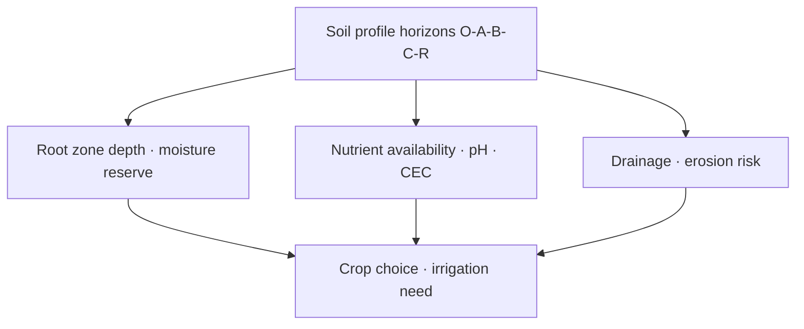

# Soil Resources & Agriculture

> GS-1 · Topic 10 · Soil profile, types, agriculture role (India)

---

## PYQs

| Year | M | Words | Question (EN) | प्रश्न (HI) | ID |
|------|---|-------|---------------|-------------|-----|
| 2023 | 8 | — | Soil profile plays an important role in agriculture. Do you agree? | कृषि में मृदा प्रोफाइल एक महत्त्वपूर्ण भूमिका निभाता है। क्या आप सहमत हैं? | Q1 |

---

## Quick Revision

```
SOIL PROFILE = Vertical section showing horizons from surface to bedrock
  O (organic litter) · A (topsoil, humus, leaching) · B (subsoil, accumulation)
  · C (weathered parent) · R (bedrock)

PROPERTIES FOR AGRI: Texture (sand-silt-clay) · structure · pH · depth · drainage · CEC · organic matter
  · nutrient profile (NPK micronutrients)

INDIA SOIL TYPES (ICAR):
  Alluvial (Indo-Gangetic, coastal) · Black regur (Deccan basalt — cotton)
  · Red (peninsular, ferralitic) · Laterite (high rain — leached) · Desert (Rajasthan)
  · Saline-alkaline (reclamation) · Peaty/Forest mountain · Coastal sandy

SOIL PROFILE → AGRI ROLE:
  Depth → root zone · A horizon fertility · B horizon moisture reserve
  · drainage prevents waterlogging (black cotton cracks) · pH affects nutrient availability
  · organic matter = water retention + microbes

DEGRADATION: Erosion · salinization · chemicalization · deforestation · mining
  POLICY: Soil Health Card Scheme · NMSA · organic/natural farming · crop rotation · contour bunding

SOUTH/SOUTH-EAST ASIA: Alluvial deltas (Ganges-Mekong) · volcanic soils (Java) · laterite (Malaysia)
  · terracing (Philippines, NE India)

TRAPS: Soil profile ≠ only topsoil | Black soil ≠ all Deccan identical | Laterite ≠ infertile always (with inputs)
  | Do you agree = YES with proof | Profile study = pedology not optional for precision farming
```

---

## Content

### Context — soil as a living natural resource formed over geological time

Soil is a dynamic natural body composed of mineral particles, organic matter, water, air, and living organisms, produced through weathering of parent rock and pedogenesis over centuries under the combined influence of climate, vegetation, relief, parent material, and time—the five factors classical pedology identifies. Unlike inert sand or gravel, soil functions as a biological factory where microbes decompose organic residue, fix nitrogen, and release nutrients that crops absorb; it is therefore both a natural resource and an ecosystem in miniature. India's soil diversity mirrors its geological and climatic range: the Indo-Gangetic alluvium, Deccan basalt, peninsular crystalline rocks, desert sands, and Himalayan foothills each generate distinct soil orders mapped through ICAR classification for agricultural planning and agro-climatic zoning. Roughly fifty-eight percent of India's population still depends on agriculture for livelihood, which makes soil health a direct determinant of national food security; the Soil Health Card Scheme (2015) institutionalises periodic testing and balanced nutrient advisory because farmers cannot manage what they do not measure. South and South-East Asia share parallel soil geography—deltaic alluvium in the Ganges, Mekong, and Irrawaddy basins, volcanic ash soils in Indonesia, and lateritic profiles across high-rainfall tropics from Malaysia to the Western Ghats—so Indian soil management lessons resonate regionally through terracing in the Philippines and North-East hills as much as through Punjab's canal commands.

### What a soil profile is — and how vertical horizons determine agricultural behaviour

A soil profile is the vertical section from surface litter to bedrock, exposing horizons that record how materials have accumulated, leached, or transformed. The O horizon consists of organic litter and humus, critical in forest and mountain ecosystems where nutrient cycling depends on decomposition before minerals enter lower layers. The A horizon, or topsoil, is dark, biologically active, and forms the primary seedbed where tillage, root proliferation, and most fertiliser application occur; its organic matter content governs nitrogen supply and cation exchange capacity. An E horizon of leached material appears in some profiles but is less prominent in deep Indian alluvial soils where deposition overwhelms eluviation. The B horizon accumulates clay, iron, and aluminium translocated from above and serves as a subsoil moisture reserve that rainfed crops tap between monsoon showers; a hardpan in B can restrict root penetration regardless of topsoil fertility. The C horizon contains partially weathered parent material that supplies minerals and influences drainage at the base of the solum, while the R horizon of solid bedrock limits depth for deep-rooted crops such as cotton and fruit trees when profiles are shallow. A pedon—the smallest volume displaying all horizons—explains why identical rainfall on adjacent slopes yields different crops: precision agriculture begins with reading this vertical structure, not merely the surface colour.

| Horizon | Physical / chemical character | Agricultural role |
|---------|------------------------------|-------------------|
| **O** | Organic litter, humus | Nutrient cycling in forest/mountain soils |
| **A** | Dark topsoil, high biota | Seedbed, fertility, tillage, nitrogen supply |
| **E** | Leached (where present) | Less common in Indian alluvium |
| **B** | Clay / iron accumulation | Subsoil moisture; hardpan limits roots |
| **C** | Weathered parent material | Mineral source, drainage base |
| **R** | Bedrock | Depth ceiling for deep-rooted crops |

### Major soil types of India — distribution, properties, and cropping logic

ICAR recognises several major soil groups whose distribution follows geology and climate. Alluvial soils cover the Indo-Gangetic plain, Brahmaputra valley, and coastal deltas; they are deep, fertile, and support wheat, rice, and sugarcane as India's primary food bowl. Black regur soils formed on Deccan trap basalt in Maharashtra, Madhya Pradesh, and Gujarat contain high clay content, exhibit self-ploughing cracks on drying, retain moisture for cotton and sorghum, yet risk waterlogging when internal drainage is poor. Red and yellow soils of low-rainfall peninsular tracts in Tamil Nadu, Karnataka, and Odisha derive colour from ferric oxide, carry lower natural nitrogen, and suit millets, pulses, and oilseeds under rainfed management. Laterite soils develop under high rainfall in the Western Ghats, North-East, and Odisha through intense leaching; they are not inherently barren—tea, coffee, and rubber plantations thrive with organic manuring and pH correction. Desert soils of Rajasthan and Kutch support drought-resistant crops such as bajra and guar where irrigation from canals like the Indira Gandhi Canal makes cultivation viable. Saline-alkaline usar soils in Punjab, Haryana, Uttar Pradesh, and the Gujarat coast require reclamation through gypsum application and drainage before yields recover. Peaty and forest soils of Kerala, West Bengal deltas, and Himalayan foothills are rich in organic matter but may need drainage in humid conditions to prevent anaerobic root stress.

| Soil type | Primary region | Key traits | Typical crops |
|-----------|----------------|------------|---------------|
| **Alluvial** | Indo-Gangetic, Brahmaputra, deltas | Deep, fertile | Wheat, rice, sugarcane |
| **Black (Regur)** | Deccan trap | Clay-rich, cracks, moisture-retentive | Cotton, sorghum |
| **Red & Yellow** | Peninsular low rainfall | Ferric oxide, lower N | Millets, pulses, oilseeds |
| **Laterite** | High rainfall tropics | Leached; acidic | Tea, coffee, rubber (with inputs) |
| **Desert** | Rajasthan, Kutch | Sandy, low organic matter | Bajra, guar (irrigated) |
| **Saline-Alkaline** | NW plains, Gujarat coast | High salts / alkalinity | Barren unless reclaimed |
| **Peaty/Forest** | Kerala, WB, Himalaya foothills | High organic content | Horticulture, terraced paddy |

### Why soil profile plays a fundamental role in agriculture — evidence for agreement

The proposition that soil profile plays an important role in agriculture deserves strong agreement because vertical structure constrains root zone depth, nutrient pathways, moisture storage, and erosion vulnerability in ways that inputs alone cannot permanently override. Shallow profiles on laterite plateaus and mountain slopes restrict deep-rooted crops—cotton, fruit trees, and deep-taproot legumes cannot access sufficient volume—while deep alluvial profiles support wheat-rice systems that anchor national food stocks. The A horizon supplies humus and hosts microbial communities responsible for nitrogen fixation and organic decomposition; destroying this layer through erosion removes productivity that centuries of pedogenesis built. The B horizon holds exchangeable cations—calcium, magnesium, potassium—that roots access during dry spells between monsoon rains, which is why subsoil moisture management matters as much as topsoil fertilisation. Texture and structure across horizons determine drainage: black cotton soil retains moisture beneficial for cotton but waterlogs when profile structure compacts; sandy desert horizons leach fertiliser rapidly unless organic matter is maintained. pH varies with horizon and soil type—acidic laterite requires liming for optimal nutrient availability, while alkaline usar soils need gypsum to unlock phosphorus and reduce sodium exchange; without profile-level correction, added fertiliser sits unused. Microbial activity concentrates in topsoil biota; erosion strips both microbes and organic matter simultaneously. Slopes in the Shivalik and Western Ghats with thin A horizons suffer irreversible productivity loss when profile is removed because bedrock or laterite subsoil cannot substitute for lost topsoil. Modern fertiliser and irrigation can mask poor profile health temporarily by supplying nutrients and water externally, but that masking is economically costly and ecologically unsustainable; the underlying profile remains the foundation of long-term productive capacity, which confirms agreement rather than neutral balance.



### How soil degrades — and how conservation restores profile health

Soil degradation reverses pedogenesis through water erosion accelerated by deforestation and overgrazing in the Shivalik hills and Chambal ravines, wind erosion at Thar desert margins, salinisation from canal irrigation without adequate drainage in Punjab and Haryana, and chemical degradation from excessive fertiliser and pesticide use that the Soil Health Card Scheme seeks to correct through balanced recommendations. Conservation measures align with profile protection: contour bunding and terracing in North-East hills slow runoff and preserve A horizon on slopes; cover crops and crop rotation maintain organic matter and break pest cycles; agroforestry and organic farming rebuild carbon stocks; vermicompost and farmyard manure restore microbial habitat. The National Mission for Sustainable Agriculture promotes climate-resilient practices—moisture conservation, integrated nutrient management—that treat soil as a system rather than a chemical medium.

| Degradation type | Cause | Conservation response |
|------------------|-------|----------------------|
| **Water erosion** | Deforestation, overgrazing, slopes | Contour bunding, terracing, vegetative cover |
| **Wind erosion** | Arid margins, bare soil | Shelter belts, surface residue |
| **Salinisation** | Irrigation without drainage | Gypsum, sub-surface drainage |
| **Chemical decline** | Over-fertilisation, monoculture | Soil Health Card, rotation, organic inputs |

### Soil types, regional cropping, and South Asian parallels

Mapping soil type to crop suitability is the basis of agro-climatic planning in India: alluvial plains anchor the wheat-rice system and sugarcane belts; black regur zones concentrate cotton and sorghum; red soils carry rainfed millets, pulses, and oilseeds; laterite highlands support plantation economies when manured; desert tracts grow bajra and guar under canal commands such as the Indira Gandhi Canal; saline-alkaline patches remain barren until gypsum and drainage reclaim them; mountain and forest soils sustain horticulture and terraced paddy in the North-East and Himalaya. South and South-East Asia mirror these patterns—deltaic alluvium along the Mekong and Irrawaddy, volcanic ash soils in Java, and lateritic tropics in Malaysia—so terracing, contour cultivation, and organic replenishment travel as shared solutions across monsoon Asia. Soil-crop matching reduces input waste because fertiliser and irrigation calibrated to profile depth and texture produce higher returns per unit of nutrient and water applied.

| Regional soil-crop pairing | Basis in profile | Policy implication |
|-----------------------------|------------------|-------------------|
| **Indo-Gangetic alluvium → wheat-rice** | Deep A horizon, high water-holding | Minimum support price zones align with natural advantage |
| **Deccan black → cotton** | Clay moisture retention, self-ploughing cracks | Micro-irrigation where waterlogging risk rises |
| **Peninsular red → millets** | Lower N, good drainage | Shree Anna promotion fits soil-water reality |
| **Laterite → plantations** | Acidic surface; responsive to organic inputs | Horticulture export corridors in Western Ghats |
| **Desert → irrigated bajra/guar** | Sandy, fast drainage | Canal command planning essential |

### Contemporary relevance

The Soil Health Card Scheme has distributed approximately fourteen crore cards providing farmers with crop-wise recommendations for nitrogen, phosphorus, potassium, and micronutrients derived from profile-level testing rather than blanket subsidy formulas. Bharatiya Prakritik Krishi Paddhati and natural farming movements emphasise soil organic carbon as the metric of long-term fertility, aligning with global recognition that carbon-rich soils retain water and resist erosion. NMSA integrates drought-proofing and sustainable land use under climate variability. PM-KUSUM solar pump promotion and crop diversification toward less water-intensive and less soil-exhausting alternatives reduce pressure from rice-wheat monoculture in stressed regions. India's commitments under UNCCD toward Desertification and Land Degradation Neutrality (SDG 15.3) frame soil conservation as an international obligation as well as a domestic food-security imperative.

### Limits and balanced view

Soil profile is not uniform within a single field—micro-relief, past land use, and sub-surface variation require precision mapping through remote sensing and grid sampling, tools that are emerging but not yet universal. The Green Revolution raised yields dramatically in Punjab and Haryana but depleted micronutrients and organic matter where profile management lagged behind input intensification; correcting that legacy demands sustained organic replenishment, not merely higher NPK doses. Laterite is frequently mislabelled as permanently infertile when, with organic inputs and acidity correction, it supports valuable plantation economies across the Western Ghats. Black soil suits cotton exceptionally well but is not ideal for every crop because waterlogging risk rises on poorly drained profiles. Agreement with the profile's agricultural importance does not deny the role of irrigation and fertiliser—it asserts that those inputs work best and last longest when matched to profile properties rather than applied generically.

---

## Answers

### Q1: Soil profile plays an important role in agriculture. Do you agree? (2023, 8M)

**Introduction:**
> **Soil profile** — **vertical arrangement of horizons (O, A, B, C, R)** — **determines fertility, moisture, and root environment** — **agree strongly** for **scientific agriculture**.

**Main Points:**
- **Root Zone Depth** — **Shallow profiles restrict deep-rooted crops; deep alluvial supports wheat-rice**.
- **A Horizon Fertility** — **Humus, nitrogen, microbial activity** — **primary production layer**.
- **Texture & Drainage** — **Black cotton soil moisture retention vs waterlogging risk**.
- **pH & Nutrient Availability** — **Laterite acidity, usar alkalinity need correction for yields**.
- **Subsoil (B) Moisture Reserve** — **Critical between monsoon rains for rainfed crops**.
- **Erosion Susceptibility** — **Thin topsoil loss irreversible on slopes**.
- **Precision Inputs** — **Soil Health Card uses profile knowledge for ** **balanced fertilization**.

**Keywords (underline in exam):** Soil Profile · Horizons · Alluvial · Black Soil · Soil Health Card · Organic Matter · Root Zone

**Exam diagram (30 sec):**
```
O-A (fertile topsoil) → B (subsoil moisture) → C/R (depth limit)
         ↓
Determines crop choice + irrigation + fertilizer
```

**Conclusion:**
> **Yes** — **soil profile is the ** **foundation of sustainable agriculture**; **ignoring it leads to ** **input waste and land degradation**.

---

### Q2: *Likely variant:* Describe major soil types of India and their agricultural significance. (—, 12M, 200W)

**Introduction:**
> **India's soil diversity** reflects ** varied geology and climate** — **ICAR major types** **determine regional cropping patterns**.

**Main Characteristics:**
- **Alluvial** — **Indo-Gangetic, deltaic** — **wheat, rice, sugarcane — most productive**.
- **Black (Regur)** — **Deccan basalt** — **cotton, sorghum — moisture-retaining clay**.
- **Red & Yellow** — **Peninsular low rainfall** — **millets, pulses, oilseeds**.
- **Laterite** — **High rainfall zones** — **plantations with manuring**.
- **Desert** — **Rajasthan** — **bajra, guar with irrigation**.
- **Saline-Alkaline** — **Reclamation needed** — **barren if untreated**.
- **Mountain/Forest** — **Horticulture, terraced paddy (NE, Himalaya)**.
- **Agri Significance** — **Soil-crop matching** — **basis of ** **agro-climatic planning**.

**Keywords (underline in exam):** Alluvial · Regur · Laterite · ICAR · Soil Erosion · Crop Suitability

**Exam diagram (30 sec):**
```
Alluvial→food bowl | Black→cotton | Red→millets | Laterite→plantations
```

**Conclusion:**
> **Soil type mapping** underpins **India's food security and ** **regional agricultural policy**.

---

## Traps

| Wrong | Correct |
|-------|---------|
| Soil profile = only surface soil | **Full vertical horizons** — **A and B both matter** |
| Black soil ideal for all crops | **Best for cotton; waterlogging risk for some** |
| Laterite always barren | **Supports tea, coffee, rubber with inputs** |
| Do you agree = write both sides equally | **Agree with proof** — **profile fundamental** |
| Fertilizer replaces soil health | **Masks depletion temporarily** — **profile organic matter key** |
| All red soil same | **Shallow vs deep red varies by region** |
| Desert soil no agriculture | **Irrigated agriculture possible (Indira Gandhi Canal)** |
| Soil Health Card = optional | **Central policy for balanced nutrients** |
| Erosion only wind in India | **Water erosion dominant in ** **hills and deforested slopes** |
| South Asia soils unrelated | **Shared deltaic/lateritic patterns in monsoon Asia** |

---

*Complete.*
