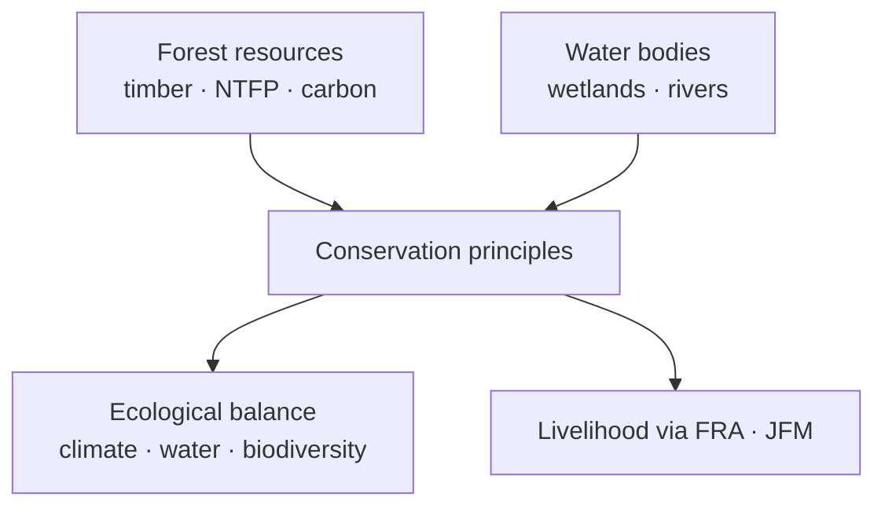

# Forest Resources & Biodiversity Conservation

> GS-1 · Topic 10 · Forest resources, conservation principles, ecological balance (India)

---

## PYQs

| Year | M | Words | Question (EN) | प्रश्न (HI) | ID |
|------|---|-------|---------------|-------------|-----|
| 2025 | 12 | 200 | Examine the forest resources of India and explain the principles of conservation which could be applied to improve the forest wealth of India. | भारत के वन संसाधनों का परीक्षण कीजिये तथा उन संरक्षण सिद्धांतों की समझाइये जिन्हें देश की वन सम्पदा के विकास में प्रयुक्त किया जा सकते है। | Q1 |
| 2024 | 12 | 200 | Biodiversity conservation of forest and water bodies in India is essential to maintain ecological balance. Elucidate in detail. | भारत में वन एवं जल स्रोतों के जैविक विविधता का संरक्षण पारिस्थितिक संतुलन बनाए रखने के लिए आवश्यक है। विस्तार से स्पष्ट कीजिए। | Q2 |

---

## Quick Revision

```
FOREST COVER (ISFR 2023, MoEFCC):
  Total forest + tree cover ~25% land · Forest cover classes: Very Dense · Moderately Dense · Open
  · Tree cover outside forests ( agroforestry, orchards)

TYPES: Tropical evergreen (Western Ghats, NE) · moist/dry deciduous (Madhya Pradesh, Chhattisgarh)
  · thorn (Rajasthan) · montane (Himalaya) · mangrove (Sundarbans, Bhitarkanika) · alpine

BIODIVERSITY HOTSPOTS (4 in India): Himalaya · Indo-Burma (NE) · Western Ghats · Sundaland (Nicobar)

FOREST RESOURCES: Timber · NTFP (tendu, bamboo, mahua) · fuelwood · medicinal plants · carbon sink
  · watershed · tourism · tribal livelihood (FRA 2006)

CONSERVATION PRINCIPLES (2025):
  Sustainable yield · ecosystem approach · participatory (JFM, FRA) · polluter pays
  · precautionary · in-situ (protected areas) + ex-situ (botanical gardens, gene banks)
  · landscape connectivity · invasive species control · fire management

INSTITUTIONS/LAWS: Indian Forest Act 1927 · WPA 1972 · FRA 2006 · CAMPA · NAP 1988 · Green India Mission
  · National Biodiversity Act 2002 · Project Tiger/Elephant · Compensatory afforestation

WATER-FOREST LINK (2024): Catchment protection · recharge · prevent siltation · mangrove-coastal buffer
  · river dolphin, wetland birds · climate regulation

TRAPS: Forest cover ≠ natural forest always (plantations count) | Conservation ≠ only protection — include livelihood
  | FRA vs conservation = integrate not oppose | 33% cover target NAP 1988 — not yet met
```

---

## Content

### Context — forest resources as natural capital in India

Forests supply timber, non-timber forest produce (NTFP), biodiversity reservoirs, carbon sequestration, watershed protection, tourism revenue, and tribal livelihoods, making them among India's most multifunctional natural resources. The India State of Forest Report 2023 published by the Forest Survey of India under the Ministry of Environment, Forest and Climate Change records forest cover at approximately 21.7 percent of geographical area, tree cover outside recorded forests at about 2.9 percent, and combined forest-plus-tree cover near 24.6 percent—still below the National Forest Policy 1988 aspiration of one-third forest cover nationwide. Geographic concentration of forest area lies in North-Eastern states such as Arunachal Pradesh, Mizoram, and Manipur, and in central Indian states including Madhya Pradesh, Chhattisgarh, Odisha, and Maharashtra; mangrove belts, the Western Ghats, and the Himalayan arc carry disproportionate biodiversity value relative to their area. South and South-East Asia share deforestation drivers—agricultural expansion, infrastructure corridors, fuelwood demand—with India positioned within the Indo-Burma biodiversity hotspot and linked to transboundary species movement for elephants and rhinos across the Mekong-Ganges forest mosaic.

### Forest types, resource value, and the NTFP economy

India's forest typology follows rainfall and altitude gradients. Tropical evergreen forests in the Western Ghats, Andaman Islands, and North-East harbour high endemism and protect hydropower catchments. Moist deciduous forests across central India and Odisha yield sal and teak timber while supporting tiger reserves and NTFP collection. Dry deciduous forests of the Deccan, Gujarat, and parts of Uttar Pradesh face greater fuelwood pressure under lower rainfall. Thorn and scrub in Rajasthan and Kutch sustain drought-adapted species such as Prosopis and grazing economies. Montane and alpine forests of the Himalaya provide oak, rhododendron, medicinal plants, and habitat for snow leopard and other high-altitude fauna. Mangrove ecosystems at Sundarbans, Bhitarkanika, Pichavaram, and the Gulf of Kutch deliver coastal storm buffering, fisheries nurseries, blue carbon storage, and in Sundarbans the only mangrove tiger population. Littoral and swamp forests on deltas act as storm buffers and breeding grounds for aquatic species.

| Forest type | Location | Resources and significance |
|-------------|----------|----------------------------|
| **Tropical evergreen** | Western Ghats, Andaman, NE | Endemism, hydropower catchments |
| **Moist deciduous** | Central India, Odisha, Jharkhand | Sal, teak, NTFP, tiger reserves |
| **Dry deciduous** | Deccan, Gujarat, UP | Fuelwood, hardier species |
| **Thorn/scrub** | Rajasthan, Kutch | Grazing, drought adaptation |
| **Montane/alpine** | Himalaya | Medicinal plants, snow leopard habitat |
| **Mangrove** | Sundarbans, Bhitarkanika, Pichavaram | Coastal protection, fisheries, blue carbon |
| **Littoral/swamp** | Coasts, deltas | Storm buffer, breeding grounds |

The NTFP economy—tendu leaves for bidi rolling, bamboo, mahua, lac, honey—supports tribal household income across roughly four hundred million forest-dependent people by conservative estimates used in policy discourse. Timber from teak and sal still enters formal and informal markets, while ecotourism at reserves converts standing forest into recurring revenue when managed sustainably.

### Biodiversity, protected areas, and in-situ versus ex-situ conservation

Four global biodiversity hotspots fall entirely or partly within India: the Himalaya, Indo-Burma (North-East), Western Ghats, and Sundaland (Nicobar). The Wildlife Protection Act 1972 underpins a protected area network of more than one hundred national parks, over five hundred wildlife sanctuaries, and growing numbers of conservation and community reserves. Flagship species programmes—Project Tiger (1973), Project Elephant, Indian Rhino Vision—target umbrella species whose habitat protection benefits wider faunal communities. UNESCO Natural World Heritage sites including Kaziranga, Manas, Keoladeo, Sundarbans, Western Ghats serial sites, Great Himalayan National Park, and Nanda Devi Biosphere Reserve demonstrate internationally recognised conservation value. Ex-situ institutions complement in-situ protection: the Botanical Survey of India and Zoological Survey of India document flora and fauna; the National Bureau of Plant Genetic Resources maintains gene banks; zoos and captive breeding centres rescue species such as gharial and vultures when wild populations collapse. Ex-situ measures cannot replace protected area networks because evolutionary processes, ecological interactions, and landscape-scale migration require wild habitats.

### Principles of forest conservation — how they improve forest wealth

Conservation principles translate abstract sustainability into operational rules that state forest departments, communities, and courts apply.

| Principle | What it means | Application in India |
|-----------|---------------|----------------------|
| **Sustainable yield** | Harvest does not exceed regeneration | Working plans of State Forest Departments |
| **Ecosystem approach** | Manage whole landscapes, not single species | Corridors such as Kanha-Pench |
| **Participatory management** | Local stakeholders co-manage resources | Joint Forest Management, FRA community rights |
| **In-situ conservation** | Protect species in native habitat | National parks, wildlife sanctuaries, ESZ |
| **Ex-situ conservation** | Off-site genetic preservation | Botanical gardens, seed banks, captive breeding |
| **Polluter/user pays** | Those who degrade pay for restoration | CAMPA levies on forest diversion |
| **Precautionary principle** | Prevent irreversible harm when science uncertain | Environmental impact assessment before clearance |
| **Landscape connectivity** | Link fragmented habitats | Tiger corridors, NE elephant routes |
| **Fire and invasive control** | Manage disturbance regimes | Controlled burns; lantana removal in Western Ghats |
| **Climate mitigation** | Maintain carbon stocks | REDD+ discourse; ISFR carbon pool estimates |

The National Forest Policy 1988 sets goals of one-third forest cover, sustainable management, tribal symbiosis with forests, and biodiversity conservation—principles that remain normative even where quantitative targets are unmet.



### Forest and water biodiversity together — why ecological balance requires both

Forests and water bodies form a coupled hydrological system whose biodiversity cannot be conserved in isolation. Forested watersheds regulate runoff in Ganga and Cauvery headwaters, reducing peak flood volumes and recharging aquifers that downstream cities and farms depend upon. Sediment control by intact catchments prevents reservoir siltation at Tehri and Polavaram, proving that deforestation imposes measurable cost on water infrastructure life and maintenance. Riparian forests support fish spawning, otters, and river dolphins by maintaining shade, organic inputs, and bank stability. Wetland-mangrove complexes such as Sundarbans integrate cyclone buffering, tiger habitat, and fisheries within a single conservation unit. Forests and wetlands sequester carbon and recycle moisture regionally, moderating temperature and rainfall patterns. Forest patches within agricultural landscapes support pollination and natural pest control, stabilising crop systems. Sacred groves in Meghalaya and Odisha show how cultural values reinforce community conservation when formal law alone is insufficient.

Threats to this balance include deforestation, dam fragmentation of river connectivity, industrial and municipal pollution, invasive species such as water hyacinth, climate change altering fire and rainfall regimes, and unsustainable NTFP extraction that removes regeneration material. Human dependence on both systems is direct: fisheries and tourism collapse when wetlands degrade; NTFP income falls when forests are cleared without sustainable harvest rules; agricultural landscapes lose pollination and pest-control services when forest patches disappear. Conservation therefore requires integrated instruments—Wildlife Protection Act protected areas for terrestrial habitat, Ramsar designation and Wetlands Rules 2017 for aquatic systems, Namami Gange for river rejuvenation, and Forest Rights Act for community stewardship—not siloed programmes that treat forest and water as separate administrative files.

| Linked service | Forest contribution | Water-body contribution |
|----------------|--------------------|-------------------------|
| **Flood moderation** | Reduced peak runoff from catchments | Wetland storage, mangrove surge dissipation |
| **Aquifer recharge** | Percolation through forest soils | Tank-wetland systems, riparian buffers |
| **Species habitat** | Terrestrial fauna, pollinators | Dolphins, fish, migratory birds |
| **Livelihoods** | NTFP, ecotourism | Fisheries, wetland tourism |
| **Climate regulation** | Carbon sequestration in biomass | Blue carbon in mangroves, wetland carbon stores |

Sacred groves in Meghalaya and Odisha demonstrate that cultural practice can reinforce formal conservation when communities perceive forest and spring integrity as inseparable.

### Policy and institutional framework

The Forest Conservation Act 1980 requires central approval for diversion of forest land and mandates compensatory afforestation when diversion is permitted. The Compensatory Afforestation Fund Management and Planning Authority (CAMPA) channels more than eighty thousand crore rupees from diversion levies toward afforestation and tribal welfare, embodying the user-pays principle. The Scheduled Tribes and Other Traditional Forest Dwellers (Recognition of Forest Rights) Act 2006 recognises individual and community forest rights, integrating tribal stewardship with conservation rather than treating communities as external threats. The Biological Diversity Act 2002 establishes Biodiversity Management Committees and access-and-benefit-sharing rules for genetic resources. The Green India Mission under the National Action Plan on Climate Change targets forest quality improvement and cover expansion; the National Afforestation Programme supports Joint Forest Management committees at village level. Together, the Indian Forest Act 1927, Wildlife Protection Act 1972, Forest Conservation Act 1980, and Project Tiger network create a layered statutory framework where diversion requires central clearance, wildlife habitat receives protected status, and flagship species programmes anchor broader ecosystem protection.

### Mangrove ecosystems and coastal ecological balance

Mangroves at Sundarbans, Bhitarkanika, Pichavaram, and Gulf of Kutch are tidal forests whose roots stabilise sediments and dissipate cyclone energy—Cyclone Amphan in 2020 caused less damage where mangrove belts remained intact. They serve as fish nurseries, crab habitat, and migratory bird stopovers while storing blue carbon at high rates per hectare. Sundarbans hosts the world's largest mangrove tiger population. Threats include shrimp farm encroachment, port and industrial development, and sea-level rise; conservation relies on Ramsar designation, Coastal Regulation Zone norms, dedicated mangrove missions, and community fishing rights that align livelihood with protection.

| Mangrove service | Mechanism | Evidence |
|------------------|-----------|----------|
| **Storm buffer** | Wave energy dissipation | Reduced Amphan damage behind intact belts |
| **Fisheries nursery** | Breeding habitat for fish and crabs | Coastal livelihood dependence |
| **Sediment stabilisation** | Root networks trap silt | Delta accretion, erosion control |
| **Blue carbon** | High organic carbon in soils | Climate mitigation co-benefit |

### Contemporary relevance

ISFR 2023 notes mangrove area increase in some states while flagging concern over shifting cultivation in parts of the North-East. The Kunming-Montreal Global Biodiversity Framework adopted at COP15 sets a thirty-by-thirty protection target to which India has signalled commitment. Project Cheetah's reintroduction at Kuno National Park has reopened debate on reintroduction ecology versus resident predator competition. The Great Nicobar mega-development proposal illustrates tension between infrastructure ambition and Sundaland hotspot integrity. Urban afforestation through Miyawaki method plantations and the Nagar Van scheme attempts to restore ecological balance in cities where forest cover is minimal.

### Limits and balanced view

Compensatory afforestation plantations of single-species eucalyptus or teak do not replicate the biodiversity and watershed functions of natural mixed forests, so forest wealth measured by hectare alone misleads. Forest Rights Act implementation remains uneven; conflict between exclusionary conservation and tribal rights requires community-led models such as Mendha Lekha in Maharashtra rather than zero-sum framing. The thirty-three percent cover target from National Forest Policy 1988 matters less than ecological quality, native species composition, and corridor connectivity between protected areas. Forest cover statistics include open forest and tree cover outside forests—orchards and plantations count in tree cover—so not all green area equals natural forest ecosystem. Conservation is not synonymous with strict exclusion: participatory Joint Forest Management, sustainable NTFP harvest, and FRA-enabled community stewardship can strengthen protection when rights and responsibilities are co-defined. Ex-situ gene banks and zoos complement but never replace in-situ protected area networks as the primary repository of evolutionary processes and landscape-scale ecological interactions.

---

## Answers

### Q1: Examine forest resources of India and explain principles of conservation to improve forest wealth. (2025, 12M, 200W)

**Introduction:**
> **India's forest resources** — **covering ~25% land (forest + tree cover)** — **supply timber, NTFP, biodiversity, and ecosystem services** but **face degradation pressures** requiring **principled conservation for enhanced forest wealth**.

**Main Points:**
- **Resource Examination — Area & Types** — **Evergreen (Western Ghats, NE), deciduous (Central India), mangrove (Sundarbans), thorn (Rajasthan)** — **ISFR 2023 baseline**.
- **Economic Resources** — **Teak, sal, bamboo, tendu, medicinal plants, ecotourism**.
- **Ecological Services** — **Carbon sink, watershed, wildlife habitat (Project Tiger reserves)**.
- **Principle — Sustainable Yield** — **Working plans, harvest ≤ regeneration**.
- **Principle — Participatory Management** — **JFM, FRA 2006 community forest stewardship**.
- **Principle — In-situ + Ex-situ** — **Protected areas + botanical gardens/gene banks**.
- **Principle — Ecosystem & Landscape** — **Corridors, ESZ, CAMPA compensatory afforestation**.
- **Principle — Precautionary & Polluter Pays** — **Forest Conservation Act 1980 clearance, diversion levies**.

**Keywords (underline in exam):** ISFR · NTFP · FRA 2006 · CAMPA · National Forest Policy 1988 · Biodiversity Hotspot · JFM

**Exam diagram (30 sec):**
```
Forest wealth: timber · NTFP · biodiversity · carbon
Conservation: sustainable · participatory · PA · CAMPA · corridors
```

**Conclusion:**
> **Improving forest wealth** means **quantity + quality + justice** — **conservation principles must ** **integrate tribal livelihoods and watershed health**.

---

### Q2: Biodiversity conservation of forest and water bodies is essential to maintain ecological balance. Elucidate in detail. (2024, 12M, 200W)

**Introduction:**
> **Forests and water bodies** form **interlinked ecosystems** — **biodiversity conservation in both** sustains **hydrological cycles, climate stability, and livelihoods** — **ecological balance cannot be achieved in isolation**.

**Main Points:**
- **Forest Biodiversity Role** — **Species habitat, pollination, genetic reservoir** — **four global hotspots in India**.
- **Water Body Biodiversity** — **Rivers (Ganges dolphin), wetlands (Chilika birds), mangroves (Sundarbans)**.
- **Watershed Linkage** — **Forests regulate runoff, recharge aquifers, reduce siltation**.
- **Climate Regulation** — **Carbon sequestration, local rainfall recycling, temperature moderation**.
- **Disaster Buffer** — **Mangroves/wetlands absorb cyclones; forests prevent landslides**.
- **Food & Livelihood** — **Fisheries, NTFP, agro-ecosystem stability**.
- **Threats** — **Deforestation, pollution, encroachment, dams, invasive species**.
- **Conservation Tools** — **WPA protected areas, Ramsar wetlands, Namami Gange, FRA, Biological Diversity Act**.

**Keywords (underline in exam):** Ecological Balance · Biodiversity Hotspot · Watershed · Ramsar · Mangrove · FRA · In-situ Conservation

**Exam diagram (30 sec):**
```
Forests ←→ Water bodies (hydrology · species)
        ↓
Ecological balance: climate · floods · fisheries · agri
```

**Conclusion:**
> **Integrated forest-water conservation** is **foundation of India's ** **monsoon ecology, disaster resilience, and inclusive development**.

---

### Q3: *Likely variant:* Discuss the role of mangrove ecosystems in India's coastal ecological balance. (—, 8M, 125W)

**Introduction:**
> **Mangroves** — **Sundarbans, Bhitarkanika, Pichavaram, Gulf of Kutch** — **unique tidal forests** **critical for coastal ecological balance**.

**Main Characteristics:**
- **Storm & Surge Buffer** — **Amphan 2020 — less damage where mangroves intact**.
- **Biodiversity** — **Fish nurseries, crabs, Sundarbans tiger, migratory birds**.
- **Sediment Stabilization** — **Reduce coastal erosion, delta accretion**.
- **Carbon Sequestration** — **Blue carbon ecosystem**.
- **Threats** — **Shrimp farming, port development, sea level rise**.
- **Conservation** — **Ramsar, CRZ, mangrove mission, community fishing rights**.

**Keywords (underline in exam):** Mangrove · Sundarbans · Blue Carbon · CRZ · Cyclone Protection · Ramsar

**Exam diagram (30 sec):**
```
Mangrove → buffer surge · nursery fisheries · carbon · erosion control
```

**Conclusion:**
> **Protecting mangroves is ** **cost-effective coastal climate adaptation** for **India's densely populated eastern coast**.

---

## Traps

| Wrong | Correct |
|-------|---------|
| India has 33% forest cover | **~25% total forest+tree (ISFR 2023)** — **33% is policy target** |
| All green cover = natural forest | **Plantations, orchards count in tree cover** |
| Conservation = only strict protection | **Participatory JFM, FRA, sustainable NTFP harvest** |
| FRA anti-conservation | **Community stewardship can strengthen conservation (Mendha Lekha)** |
| Forest conservation unrelated to water | **2024 PYQ integrates both** — **watershed essential** |
| CAMPA optional fund | **Statutory compensatory afforestation mechanism** |
| Biodiversity hotspots = only NE | **Also Western Ghats, Himalaya, Nicobar (Sundaland)** |
| Ex-situ replaces in-situ | **Complementary — PA network primary** |
| Mangroves only Bengal | **Odisha, Tamil Nadu, Gujarat, Maharashtra also** |
| Elucidate = one paragraph | **Detailed dimensions — services, threats, tools, examples** |

---

*Complete.*
