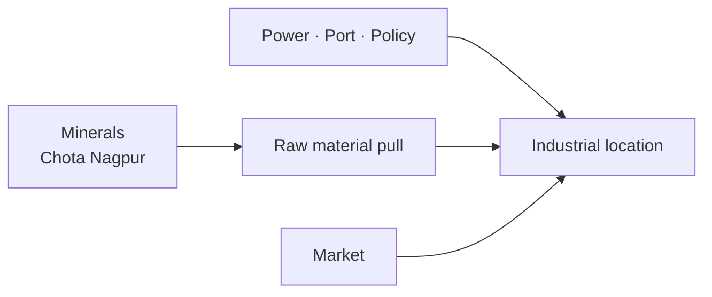

# Minerals & Industrial Location in India

> GS-1 · Topic 10 · Mineral development policy, industrial location factors (India)

---

## PYQs

| Year | M | Words | Question (EN) | प्रश्न (HI) | ID |
|------|---|-------|---------------|-------------|-----|
| 2023 | 12 | — | Discuss India's mineral development policy. | भारत की खनिज विकास नीति की व्याख्या कीजिए। | Q1 |

---

## Quick Revision

```
NATIONAL MINERAL POLICY 2019 (NMP 2019) — replaces 2008
  Objectives: sustainable mining · transparency · private participation · downstream industry
  · regional balance · environmental/social safeguards · critical minerals

MMDR Act 1957 (amended 2015, 2021): Auction regime for major minerals · DMF (District Mineral Foundation)
  · NMET (exploration trust) · decriminalization of minor offences (2023 amendment)

MAJOR MINERALS & ZONES:
  Coal: Jharia/Dhanbad (Jharkhand) · Raniganj (WB) · Singrauli (MP-UP)
  Iron ore: Odisha (Keonjhar, Sundargarh) · Jharkhand · Chhattisgarh · Goa (declining)
  Bauxite: Odisha (Panchpatmali) · Gujarat · AP · Ratnagiri conflicts
  Manganese: Odisha · MP · Balaghat
  Mica: Jharkhand (historical) · Limestone: Rajasthan, MP, AP
  Petroleum: Mumbai High · KG Basin · Assam · Rajasthan (Cairn)
  Uranium: Jaduguda (Jharkhand) · Tummalapalle (AP)

INDUSTRIAL LOCATION FACTORS (Weber/agglomeration):
  Raw material · power · market · transport (ports, rail) · labour · capital
  · government policy (SEZ, PLI, freight corridors) · climate · water

CHOTA NAGPUR PLATEAU = mineral heartland → steel (Jamshedpur Tata) · heavy industry

CONTEMPORARY: Critical minerals policy · lithium auctions (J&K Reasi) · coal gasification
  · PM Gati Shakti · Make in India · auction transparency · mine closure rehabilitation

TRAPS: NMP 2019 ≠ only coal | DMF = local benefit sharing | Location = not raw material alone always
  | Goa iron ore ban lesson — environmental limits | MMDR vs MCR — major vs minor minerals
```

---

## Content

### Context — minerals as non-renewable foundation of industrial geography

Minerals are non-renewable natural resources extracted from geological formations that underpin steel, cement, thermal and nuclear power, electronics, defence manufacturing, and construction. India’s Chota Nagpur plateau spanning Jharkhand, Odisha, and Chhattisgarh forms the country’s richest mineral heartland, historically attracting steel plants and heavy industry to proximity with iron ore and coal. Mining contributes roughly 1.5 to 2 percent of GDP directly but exerts far larger indirect influence through downstream manufacturing chains. In South and South-East Asia, Indonesia supplies nickel and coal, Australia exports iron ore to Asian steel mills, and China dominates rare-earth processing; India participates as a major consumer and an emerging producer seeking supply security in regional chains rather than as a passive buyer. Mineral policy therefore intersects industrial location, tribal rights, environmental clearance, and strategic autonomy for critical minerals needed in electric vehicles and renewable energy equipment.

### India's major mineral resources — distribution and industrial use

| Mineral | Key regions | Industrial use |
|---------|-------------|----------------|
| **Coal** | Jharia (Jharkhand), Odisha, Chhattisgarh, Singrauli (MP-UP), Raniganj (WB) | Thermal power (~70% electricity historically), steel, cement |
| **Iron ore** | Odisha (Keonjhar, Sundargarh), Jharkhand, Chhattisgarh, Karnataka, Goa | Steel at Jamshedpur, Rourkela, Bhilai |
| **Bauxite** | Odisha (Panchpatmali), Gujarat, AP, Ratnagiri (Maharashtra) | Aluminium smelting (NALCO, Hindalco) |
| **Manganese** | Odisha, Balaghat (MP), Karnataka | Steel alloy; emerging battery applications |
| **Limestone** | Rajasthan, MP, Andhra Pradesh | Cement industry clusters |
| **Copper** | Khetri (Rajasthan), Singhbhum (Jharkhand) | Electrical and telecom manufacturing |
| **Crude oil/gas** | Mumbai High, KG Basin (AP), Assam, Rajasthan (Cairn) | Refineries at Jamnagar, Panipat; petrochemicals |
| **Uranium** | Jaduguda (Jharkhand), Tummalapalle (AP) | Nuclear power generation |
| **Critical minerals** | Monazite sands (Kerala, Odisha); lithium (Reasi, J&K) | Electronics, EV batteries, defence |

Coal fires in Jharia have burned underground for decades, illustrating how extraction without rehabilitation creates long-term human and environmental cost. Goa’s iron ore mining restrictions following illegal mining and degradation demonstrate that mineral wealth without governance destroys rather than develops local economies.

### National Mineral Policy 2019 — vision, pillars, and contrast with 2008

The National Mineral Policy 2019 replaced the 2008 policy to align mineral development with transparent allocation, local benefit sharing, downstream value addition, and critical mineral security under amended Mines and Minerals (Development and Regulation) Act frameworks.

| Pillar | What it requires | Why it matters |
|--------|------------------|----------------|
| **Regulatory framework** | Auction-based allocation; lease extension rules; 2023 decriminalisation of minor offences | Reduces discretion and corruption |
| **Exploration** | National Mineral Exploration Trust funding private exploration | India is under-explored relative to geological potential |
| **Local benefit sharing** | District Mineral Foundation receives 30% royalty for coal/lignite, 10% for other minerals | Channels mining rent to affected districts under PMKKKY |
| **Sustainable mining** | Mine closure plans, star-rated mines, progressive reclamation | Prevents abandoned wasteland |
| **Downstream industry** | Promote steel, aluminium, copper processing; curb raw ore export | Captures value addition domestically |
| **Critical minerals** | Strategy for lithium, cobalt, rare earths | EV and renewable supply security |
| **Environmental and social** | Forest clearance, FRA/PESA consent, rehabilitation | Balances extraction with tribal and ecological rights |
| **Private participation** | Commercial coal mining reforms 2020; FDI in mining | Increases competition and investment |

Compared with NMP 2008, the 2019 policy emphasises auction transparency, DMF institutionalisation, critical minerals, and deep-sea exploration ambition in line with Atmanirbhar Bharat objectives. Major minerals—including coal, iron ore, bauxite, and copper—fall under central or state auction regimes; minor minerals such as sand remain under state control where illegal sand mining exposes governance failure. The Indian Bureau of Mines regulates conservation and export policy for iron ore among other functions; the Geological Survey of India generates baseline exploration data.

### District Mineral Foundation — legal mandate and purpose

The District Mineral Foundation created under the MMDR Amendment 2015 is a statutory trust in each mining district funded by ten to thirty percent of royalty—thirty percent for coal and lignite, ten percent for other minerals—with expenditure guided by Pradhan Mantri Khanij Kshetra Kalyan Yojana for drinking water, health, education, and livelihood in mining-affected communities. Gram sabha consultation in Scheduled Areas under PESA integrates tribal voice into spending priorities. DMF is not optional corporate social responsibility; it is a legal benefit-sharing mechanism introduced because mineral wealth historically bypassed districts that bore environmental and social costs of extraction. Underutilisation and diversion of DMF funds in some states remain implementation challenges requiring audit and transparency portals.

### Factors responsible for industrial location — with Indian illustrations

Alfred Weber’s least-cost industrial location theory explains that transport cost of raw materials versus finished products pulls weight-losing industries toward mines and bulk-gaining industries toward markets, but Indian experience adds power, policy, ports, water, and agglomeration as decisive modifiers.

| Factor | Mechanism | Indian example |
|--------|-----------|----------------|
| **Raw material** | Bulk-reducing industries near mines | Tata Steel Jamshedpur; SAIL Rourkela, Bhilai near ore-coal belts |
| **Power/energy** | Electro-intensive processes need cheap electricity | NALCO smelter at Hirakud; Korba power-aluminium linkage |
| **Market** | Bulk or perishable products near consumers | Cement plants balance limestone source and construction demand |
| **Transport** | Ports and rail for import/export | Paradip ore export; Jamnagar refinery; Visakhapatnam steel and petrochemicals |
| **Labour** | Skill pools and industrial culture | Pune-Mumbai auto cluster; Bengaluru IT (services analogy) |
| **Government policy** | SEZ, PLI, freight corridors, tax incentives | Delhi-Mumbai Industrial Corridor; PLI for steel and electronics |
| **Water** | Process and cooling demand | Steel and textile along Ganga at Hardwar, Kanpur; Gujarat textile belt |
| **Agglomeration** | Cluster economies reduce unit cost | Maruti-Suzuki supplier ecosystem in Gurugram |

Iron and steel illustrate weight-losing logic on the Chota Nagpur plateau where iron ore and coking coal historically co-located plants, yet pelletisation and imported coking coal through Paradip and Visakhapatnam ports partially decouple location from coal belt proximity. Electronics assembly is more footloose—Noida and Sriperumbudur attract investment through policy and labour rather than local minerals.

### Iron and steel industrial location — how multiple factors converge

Iron and steel production is among the most location-sensitive heavy industries because iron ore and coking coal are bulk-reducing raw materials whose transport cost dominates when moved long distances. Tata Steel at Jamshedpur was sited to minimise ore and coal haulage within the Chota Nagpur mineral heartland; SAIL plants at Rourkela, Bhilai, and Durgapur followed similar logic linking public-sector expansion to eastern and central ore-coal belts. Continuous casting, electric arc furnaces, and pellet plants increase power demand, pulling investment toward regions with reliable thermal or hydel supply. Steel plants require substantial water for cooling and processing, which explains riverine sites and coastal locations such as Visakhapatnam where port access allows coking coal import and finished steel export simultaneously. Proximity to industrial corridors under the Delhi-Mumbai Industrial Corridor and construction markets in growing urban regions modifies classical Weberian placement. Government policy through SAIL expansion historically shaped location; today Production Linked Incentive schemes for specialty steel encourage modernisation and diversification beyond legacy clusters. Changing technology means not every plant must sit adjacent to both ore and coal: imported coking coal through Paradip and Visakhapatnam, pelletisation near mines, and scrap-based electric arc routes alter but do not abolish raw material geography.

| Plant / cluster | Dominant location factor | Notes |
|-----------------|-------------------------|-------|
| **Jamshedpur (Tata)** | Ore-coal proximity on Chota Nagpur | Classic weight-losing placement |
| **Rourkela, Bhilai (SAIL)** | Public-sector ore belt integration | Power and rail links critical |
| **Visakhapatnam** | Port for imported coal, export dispatch | Coastal steel-petrochemical hub |
| **Durgapur** | Coal-iron belt, eastern market access | Historical Damodar valley cluster |
| **Pellet plants near Odisha mines** | Reduce transport of fines | Decouples smelting from mine mouth |

Historical mica mining in Jharkhand supplied global electrical industries but declined in prominence as synthetic substitutes and governance tightened; the episode illustrates how single-mineral dependence without downstream diversification leaves regions vulnerable when markets or law shift. MMDR distinguishes major minerals under auction from minor minerals under state control—the sand mining crisis shows that "minor" status does not mean minor environmental impact when riverbed extraction destabilises channels and aquifers.



### Environmental and social issues in mineral extraction

Jharia underground coal fires demand permanent rehabilitation of affected settlements. Goa’s mining ban responded to illegal extraction and landscape damage. Niyamgiri bauxite mining was halted after tribal gram sabha veto under Forest Rights Act and PESA, proving that mineral policy cannot override statutory consent in scheduled areas. Sand mafia operations on riverbeds show minor mineral regulation failure with high social cost. Progressive mine closure and reclamation rules emphasised in 2024 frameworks require restoring land capability rather than abandoning pits.

### Contemporary relevance

Lithium block auctions in Jammu and Kashmir’s Reasi district in 2024 mark early steps toward domestic critical mineral supply for battery manufacturing. The coal gasification mission aims to reduce import dependence and lower emissions intensity of coal use. PM Gati Shakti National Master Plan integrates multi-modal connectivity for industrial corridors. Production Linked Incentive schemes for steel, specialty steel, and electronics diversify industrial geography beyond traditional mineral belts. The Ministry of Mines Critical Mineral Strategy 2023 and KABIL joint venture pursue overseas lithium and cobalt assets to secure supply chains. Monazite-bearing coastal sands in Kerala and Odisha hold thorium and rare-earth potential whose extraction remains strategically sensitive because of dual civilian and defence applications. Aluminium smelting at Hirakud and Korba illustrates power-driven location: bauxite may travel farther than cheap electricity because smelting is electro-intensive. Cement clusters in Rajasthan, Madhya Pradesh, and Andhra Pradesh sit near limestone deposits yet also orient toward construction demand corridors, showing how market pull modifies raw-material-first logic. Commercial coal mining reforms of 2020 opened the sector to private bidders, ending historical monopoly and aligning production incentives with efficiency and reclamation obligations under amended MMDR rules. Deep-sea mining exploration mentioned in NMP 2019 remains aspirational, with environmental precaution required before commercial extraction proceeds.

### Limits and balanced view

Geological endowment does not automatically translate into inclusive development when DMF funds remain unspent or misallocated and environmental safeguards are bypassed. Industrial location factors are evolving: renewable energy reduces the pull of coal proximity for new plants, automation reduces labour as a binding constraint, and circular economy policies recover metals from e-waste, lowering primary mineral dependence over time. NMP 2019 covers all major minerals and critical minerals strategy, not coal alone. Goa is no longer the iron ore export powerhouse it was before mining restrictions. Lithium mining at Reasi remains at exploration and auction stage, not yet commercial nationwide production. Private commercial coal mining opened in 2020 contradicts any assumption that public sector monopolies persist across the sector. Not every steel plant today requires both iron ore and coking coal in immediate proximity because pelletisation, scrap-based electric arc furnaces, and imported coal through coastal ports reconfigure—but do not eliminate—the classical Chota Nagpur location advantage. Star-rated mines and progressive closure plans under NMP 2019 signal that environmental compliance is a statutory condition of licence, not voluntary corporate social responsibility alone.

---

## Answers

### Q1: Discuss India's mineral development policy. (2023, 12M)

**Introduction:**
> **National Mineral Policy 2019** guides **sustainable, transparent mineral development** — **replacing 2008 policy** amid **MMDR amendments, auction regime, and critical mineral security needs**.

**Main Points:**
- **Objective — Sustainable Development** — **Mine closure, reclamation, star rating, environmental compliance**.
- **Transparent Allocation** — **MMDR auction system** — **reduce discretion and corruption**.
- **DMF & PMKKKY** — **District Mineral Foundation** — **local affected community development from royalty share**.
- **Exploration Boost** — **NMET funding** — **private sector exploration participation**.
- **Downstream Value Addition** — **Reduce raw ore export; promote steel, aluminium processing**.
- **Critical Minerals Strategy** — **Lithium, cobalt, rare earths for ** **EV and renewable transition**.
- **Commercial Coal Mining** — **2020 reforms — private participation, competition**.
- **Social & Tribal Safeguards** — **Forest clearance, FRA/PESA consent, rehabilitation** — **balance extraction with rights**.

**Keywords (underline in exam):** National Mineral Policy 2019 · MMDR Act · DMF · NMET · Auction · Critical Minerals · Sustainable Mining

**Exam diagram (30 sec):**
```
NMP 2019 → auction · DMF · exploration · downstream · critical minerals
         ↓
Sustainable mineral-led industrial growth
```

**Conclusion:**
> **Effective mineral policy** converts **geological endowment into ** **inclusive growth** — **implementation of DMF and environmental safeguards determines success**.

---

### Q2: *Likely variant:* Explain factors responsible for location of iron and steel industries in India. (—, 12M, 200W)

**Introduction:**
> **Iron and steel** are **weight-losing, power-intensive industries** — **locate considering ** **raw materials, coal, transport, market, and policy**.

**Main Points:**
- **Raw Material Proximity** — **Iron ore + coking coal** — **Jamshedpur (Tata), Rourkela, Bhilai, Durgapur**.
- **Chota Nagpur Plateau** — **Mineral heartland** — **historical cluster logic**.
- **Power Availability** — **Electric arc, continuous casting** — **proximity to thermal/hydel**.
- **Transport & Ports** — **Paradip, Visakhapatnam** — **ore import/export, finished steel dispatch**.
- **Market Access** — **Near industrial corridors (DMIC), construction hubs**.
- **Water Requirement** — **Plant cooling, processing** — **river locations preferred**.
- **Government Policy** — **SAIL public sector expansion, PLI specialty steel**.
- **Changing Factors** — **Pellet plants, imported coking coal** — **some decoupling from coal belt**.

**Keywords (underline in exam):** Weber · Weight-Losing · Chota Nagpur · Coking Coal · Jamshedpur · Port Location · PLI

**Exam diagram (30 sec):**
```
Iron ore + coal + power + port/market
           ↓
Steel plants: Jamshedpur · Rourkela · Bhilai · Vizag
```

**Conclusion:**
> **Steel location reflects ** **least-cost raw material logic modified by ** **ports, policy, and market integration**.

---

### Q3: *Likely variant:* What is DMF and why was it introduced under mineral policy reforms? (—, 8M, 125W)

**Introduction:**
> **District Mineral Foundation (DMF)** — **created under MMDR Amendment 2015** — **channels mining royalty share to ** **mining-affected districts**.

**Main Characteristics:**
- **Legal Mandate** — **MMDR Act** — **trust in each mining district**.
- **Funding** — **10–30% of royalty** — **coal highest share**.
- **Purpose — PMKKKY** — **Drinking water, health, education, livelihood for affected communities**.
- **Local Priority** — **Gram sabha consultation in Scheduled Areas**.
- **Transparency** — **e-Governance, district plans**.
- **Policy Goal** — **Inclusive growth from mineral wealth** — **reduce conflict**.
- **Challenge** — **Underutilization, diversion in some states** — **needs audit**.

**Keywords (underline in exam):** DMF · MMDR Amendment · PMKKKY · Royalty · Mining-Affected Communities

**Exam diagram (30 sec):**
```
Mining royalty → DMF → local development (water · health · skills)
```

**Conclusion:**
> **DMF embodies ** **benefit-sharing principle** — **critical for ** **social licence to mine**.

---

## Traps

| Wrong | Correct |
|-------|---------|
| NMP 2019 only about coal | **All major minerals + critical minerals strategy** |
| All steel plants need both ore and coal adjacent | **Import coking coal, pelletization changes logic** |
| Goa still major iron ore exporter | **Mining restrictions post-illegal mining crackdown** |
| DMF optional CSR | **Statutory under MMDR** |
| Mineral policy ignores environment | **Star rating, closure plans, forest clearance mandatory** |
| Location factors = Weber only | **Add policy, ports, agglomeration, water** |
| Mica still major export today | **Historical — Jharkhand mica; declining prominence** |
| Lithium mining already commercial nationwide | **Reasi discovery — early exploration/auction stage** |
| Private mining banned in India | **Commercial coal mining opened 2020** |
| Chota Nagpur only has coal | **Iron, manganese, copper, bauxite, mica historically** |

---

*Complete.*
