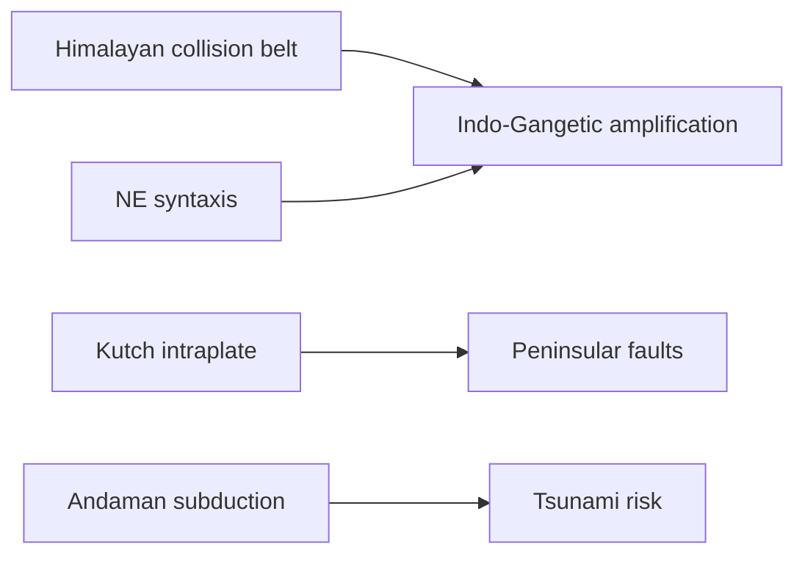

# Earthquakes & Seismic Zones of India

> GS-1 · Topic 11 · Earthquakes, seismic belts, plate tectonics

---

## PYQs

| Year | M | Words | Question (EN) | प्रश्न (HI) | ID |
|------|---|-------|---------------|-------------|-----|
| 2024 | 8 | 125 | Write a note on seismic zones of India. | भारत के भूकंपीय क्षेत्रों पर टिप्पणी लिखिए। | Q1 |
| 2022 | 12 | — | Describe earthquake belts in India. | भारत में भूकंप पेटियों का वर्णन कीजिए। | Q2 |

---

## Quick Revision

```
EARTHQUAKE = Sudden release of energy in crust → seismic waves (P · S · Surface/L)
  Focus (hypocenter) · Epicentre (surface point above focus) · Richter (magnitude) · Mercalli (intensity)

CAUSES: Plate boundaries · fault movement (normal/reverse/strike-slip)
  · isostatic rebound · reservoir-induced · mining · nuclear tests

PLATE CONTEXT (India): Indo-Australian + Eurasian collision → Himalaya
  · transform (Indian Ocean ridge) · subduction (Andaman trench)

INDIA SEISMIC ZONES (BIS/NDMA — 4 zones):
  II Low · III Moderate · IV High · V Very High
  Zone V: Kashmir, Western Himalaya, NE states, Kutch, Andaman-Nicobar
  Zone IV: Delhi, Bihar UP border, Bengal, Gujarat parts, Maharashtra
  Zone II: Stable craton — peninsula interior (parts)

BELTS IN INDIA:
  Himalayan belt (collision) · Indo-Gangetic · NE syntaxis (Shillong plateau)
  · Kutch-Rann · Peninsular (rare — Killari 1993 Latur) · Andaman subduction

MAJOR EVENTS: 2001 Bhuj (Gujarat) · 2005 Kashmir · 2015 Gorkha (Nepal border)
  · 2023 Turkey reminder · 2024 Chamoli not quake — landslide

MITIGATION: NDMA · building codes (IS 1893) · early warning limited · NCS seismograph network
  · tsunami buoys linked for coastal quakes

TRAPS: Zones = hazard map not prediction | Peninsular = stable NOT immune (Latur)
  | Richter ≠ Mercalli | All Himalaya not uniform Zone V | Epicentre ≠ damage always (soft soil Delhi)
```

---

## Content

### Context — what an earthquake is and why India is vulnerable

An earthquake is a sudden release of accumulated strain energy within the Earth's lithosphere, which propagates outward as seismic waves and shakes the ground surface. The lithosphere behaves elastically under tectonic stress: rocks store strain along faults and plate boundaries until the frictional lock breaks, and the stored energy is released in seconds as rupture and wave motion. What we feel at the surface is not the rupture itself but the arrival of P-waves (fastest, push-pull compression), S-waves (slower shear motion), and surface waves (Love and Rayleigh), which typically cause the greatest structural damage because they travel along the crust with large horizontal and vertical displacement.

India occupies one of the world's most complex tectonic settings because the Indian Plate is still moving northward at roughly five centimetres per year after separating from Gondwana and colliding with the Eurasian Plate around fifty million years ago. That collision built the Himalaya and continues to shorten and thicken the crust, making the Himalayan arc and the Indo-Gangetic basin among the most seismically active continental regions outside the Pacific Ring of Fire. The National Disaster Management Authority estimates that roughly fifty-nine percent of India's land area is vulnerable to moderate-to-severe earthquakes; because hundreds of millions of people live in alluvial plains, hill towns, and dense urban clusters on or near active belts, geological hazard translates into disproportionate human and economic loss. Uttar Pradesh sits at the junction of the Himalayan belt, the Indo-Gangetic amplification zone, and Zone IV territory along the Bihar–UP border, so understanding both zonation and belts is essential for describing India's earthquake geography.

### Mechanism — focus, epicentre, faults, and measurement

Every earthquake has a focus (hypocenter)—the point underground where rupture begins—and an epicentre, the point on the surface directly above the focus. News reports and hazard maps usually cite the epicentre, but damage patterns depend equally on focal depth, local geology, and building quality. Shallow-focus earthquakes (typically less than seventy kilometres deep) release energy closer to the surface and therefore produce stronger shaking over a wider area than deep-focus events of the same magnitude.

Fault geometry determines how crustal blocks move. Normal faults form where crust extends and one block drops relative to another. Reverse and thrust faults dominate compressional settings such as the Himalaya, where the Indian Plate is shoved beneath the southern edge of Tibet and large sheets of rock move on low-angle thrust planes like the Main Boundary Thrust (MBT) and Main Central Thrust (MCT). Strike-slip faults involve horizontal displacement; transform segments of the Mid-Indian Ocean Ridge and some intra-plate structures show this motion. The Himalayan belt is dominated by reverse/thrust faulting driven by continental collision, which explains both the frequency of large-magnitude events and the potential for widespread damage far from the mountain front.

| Term | What it measures | How it works | Why it matters |
|------|------------------|--------------|----------------|
| **Focus (hypocenter)** | Underground origin of rupture | Point where fault slip begins | Depth controls surface shaking intensity |
| **Epicentre** | Surface point above focus | Vertical projection to ground | Used in mapping and emergency response |
| **Magnitude (Richter / moment Mw)** | Total energy released | Logarithmic scale; Mw 7 ≈ 32× energy of Mw 6 | Compares event size, not local damage |
| **Intensity (Mercalli / MSK)** | Observed surface effects | Depends on depth, distance, soil, construction | Explains why distant quakes can devastate cities |
| **P-waves** | First arrival | Fastest; compressional | Used in early-warning systems |
| **S-waves & surface waves** | Later arrivals | Shear and rolling motion | Surface waves most destructive to buildings |

Magnitude and intensity must not be conflated. A single earthquake has one magnitude but many intensity values across the affected area. Delhi can experience high Mercalli intensity from a Himalayan epicentre hundreds of kilometres away if thick alluvium amplifies ground motion—a proof that epicentre location alone does not predict damage.

### Causes — plate tectonics, isostasy, human triggers, and hidden faults

Plate tectonics is the primary cause of global seismicity. At convergent boundaries the Indian Plate collides with Eurasia (Himalaya), subducts beneath the Burma microplate (Andaman–Sumatra trench), and at divergent and transform segments of the Mid-Indian Ocean Ridge new crust forms and slips laterally. Each setting stores and releases elastic strain differently: collision produces great thrust earthquakes, subduction can produce the largest megathrust events (including tsunamigenic ruptures), and ridge-transform systems generate frequent moderate earthquakes.

Isostatic adjustment adds secondary stress. Crustal rebound after ice-sheet removal and ongoing uplift of the Himalaya redistribute load and can modulate fault activity over geological time. Human-induced seismicity is documented where large reservoirs load the crust (debates around Koyna after 1967), mining removes subsurface support, fluid injection alters pore pressure, and underground nuclear tests release energy artificially. These mechanisms rarely match plate-boundary magnitudes but prove that "stable" interiors are not inert.

Peninsular India illustrates reactivation of ancient faults. The Deccan craton was long considered stable, yet the 1993 Killari (Latur) earthquake (M 6.4) occurred on a previously unmapped fault in basaltic terrain, and the 1967 Koyna earthquake followed reservoir impoundment. Both events demonstrate that intraplate earthquakes arise when pre-existing weak zones accumulate stress in the absence of obvious active plate margins—breaking the myth that only the Himalaya and Northeast are at risk.

### Seismic zones of India — hazard classification and regional logic

India's seismic zonation map, maintained under Bureau of Indian Standards (BIS) norms and used by NDMA for planning, divides the country into four hazard zones (II through V; Zone I was merged into Zone II). The map is a probabilistic hazard tool: it estimates expected ground acceleration and intensity for structural design, not the calendar date of the next earthquake. Zones are derived from historical seismicity, active fault mapping, tectonic setting, and soil amplification potential.

| Zone | Hazard level | Expected shaking (indicative) | Representative regions |
|------|--------------|-------------------------------|------------------------|
| **V — Very High** | Severest design requirement | MSK IX and above possible | Jammu & Kashmir, Western and Central Himalaya (Uttarakhand, Himachal Pradesh), entire Northeast (Assam, Manipur, Mizoram, etc.), Kutch, Andaman–Nicobar |
| **IV — High** | Major damage possible | Strong shaking in poor construction | Delhi, Chandigarh, Bihar–UP border belt, West Bengal, parts of Gujarat, Maharashtra, Rajasthan |
| **III — Moderate** | Moderate damage | Design needed but lower peak acceleration | Kerala, Goa, Lakshadweep, parts of Madhya Pradesh, Odisha, Andhra Pradesh |
| **II — Low** | Relatively lower hazard | Minimal seismic design in code | Stable craton interiors — parts of Karnataka, Tamil Nadu interior, Odisha stable block |

Zone V reflects proximity to active collision, subduction, or intraplate sources proven by historical great earthquakes. Zone IV captures major cities on thick alluvium or near active belts—Delhi's exposure is geological (distance from Himalaya) plus geotechnical (soft soil amplifies waves). The map is updated periodically, and micro-zonation at city scale (especially Delhi, Mumbai, Chennai) refines blanket zone ratings into neighbourhood-level amplification zones—a necessary step because two buildings in the same administrative zone can behave differently on rock versus alluvium.

### Earthquake belts in India — six linear zones of concentrated seismicity

Earthquake belts are elongated regions where seismic energy release clusters along tectonic structures. India spans six distinct belts, each with a different driving mechanism.

**Himalayan Seismic Belt** stretches roughly 2,500 km from Kashmir to Arunachal Pradesh along the arc of the Indo-Eurasian collision. Thrust faults (MBT, MCT, and related structures) accommodate ongoing convergence; earthquakes here are typically shallow-focus and high-intensity. The 2015 Gorkha earthquake (Nepal, Mw 7.8) ruptured a segment of this belt and was strongly felt across Bihar, Uttar Pradesh, and West Bengal, proving that Himalayan events transmit damage far into the Gangetic plain.

**Indo-Gangetic Belt** is not a plate boundary but a sedimentary trough where thick alluvium sits atop descending Himalayan structures. Seismic waves from distant Himalayan ruptures are amplified in soft, water-saturated sediments, so cities such as Lucknow, Patna, and Delhi face high damage potential even when the epicentre lies in the mountains. Liquefaction—where saturated soil temporarily behaves like fluid—further threatens infrastructure in this belt.

**North-East Syntaxis and Shillong Plateau** mark the eastern hairpin bend where the Himalaya, Burmese arc, and Bengal basin meet. Tectonics here are exceptionally complex; the 1897 Shillong earthquake (Mw ~8.7) ranks among the largest continental earthquakes ever recorded, demonstrating that the syntaxis is a world-class seismic source independent of the main Himalayan arc.

**Kutch–Rann of Kutch Belt** lies in western Gujarat on reactivated intraplate faults within the stable continental block. The 2001 Bhuj earthquake (Mw 7.7) killed approximately twenty thousand people and destroyed vast areas of Kutch, showing that Zone V classification and industrial development without strict code compliance carry catastrophic cost.

**Andaman–Nicobar Subduction Zone** forms the boundary between the Indian Plate and the Burma microplate. Megathrust ruptures here can exceed Mw 9.0; the 2004 Sumatra–Andaman earthquake (Mw 9.1) generated a trans-oceanic tsunami and directly affected India's island territories and eastern mainland coast—linking this belt simultaneously to earthquake, tsunami, and volcanic arc hazards.

**Peninsular (Stable Block) Belt** records rare but significant events on hidden faults in ancient craton rock. Killari (1993) and Koyna (1967) are the textbook proofs that low regional hazard (Zone II–III) does not mean zero risk.



### Effects — primary, secondary, and documented Indian outcomes

Primary effects include ground rupture along faults, landslides in steep terrain (common in Uttarakhand and Himachal Pradesh after moderate shocks), subsidence, and liquefaction in saturated sands. Secondary effects often exceed direct shaking losses: fires triggered by ruptured gas lines (as in the 1906 San Francisco analogue), dam and levee failure, epidemic disease in crowded shelters, and tsunamis when coastal subduction zones rupture vertically.

The 2001 Bhuj earthquake devastated Kutch's towns and villages, disrupted Gujarat's industrial economy, and triggered national revision of building codes and disaster response institutions. The 2005 Kashmir earthquake affected both sides of the Line of Control, illustrating that Himalayan seismicity ignores administrative borders and requires coordinated humanitarian access. The 1934 Bihar–Nepal earthquake demonstrated Indo-Gangetic amplification decades before modern instrumentation, and the 2015 Gorkha event showed Delhi and the UP plains registering strong shaking from a source outside India—confirming that capital cities cannot measure safety by distance alone.

| Year | Event | Belt / zone | Lesson |
|------|-------|-------------|--------|
| **1897** | Shillong | NE syntaxis | Among largest continental earthquakes |
| **1934** | Bihar–Nepal | Himalayan + Gangetic | Alluvial amplification of distant thrust |
| **1993** | Killari (Latur) | Peninsular | Intraplate faulting breaks "stable block" assumption |
| **2001** | Bhuj | Kutch | Zone V exposure + code failure = mass casualty |
| **2005** | Kashmir | Himalayan | Cross-border disaster management challenge |
| **2015** | Gorkha (Nepal) | Himalayan | Major cities far from epicentre still at risk |

### Plate tectonics — why India's seismicity is threefold

The Indian Plate's northward journey after Gondwana breakup created a triple seismic regime. Continental collision with Eurasia drives Himalayan thrust earthquakes. Oceanic subduction along the Andaman–Sumatra trench drives megathrust and arc-related activity, including tsunamigenic ruptures and volcanic islands such as Barren Island. Intraplate reactivation within the Indian craton (Kutch, Latur, Koyna) adds a third category unrelated to present-day plate margins but rooted in ancient structural weaknesses. The Mid-Indian Ocean Ridge adds divergent and transform seismicity along the Carlsberg Ridge system. Together these settings explain why India hosts collision belts, subduction tsunamigenic zones, and peninsular surprises within one national boundary—a diversity unmatched by countries sitting entirely on a single passive margin or a single active arc.

### Mitigation — engineering, institutions, science, and community preparedness

Mitigation converts hazard knowledge into survivable built environments. IS 1893 (Indian Standard for earthquake-resistant design of structures) assigns design forces by seismic zone and building type; hospitals, schools, and lifeline infrastructure must meet higher standards. Retrofitting vulnerable masonry buildings, banning soft-storey designs (heavy upper floors on weak ground columns), and enforcing municipal bye-laws are as important as drawing zone maps. NDMA coordinates national policy; State Disaster Management Authorities implement state plans; the National Centre for Seismology (NCS) operates a real-time seismograph network for rapid location and magnitude determination. Paleoseismology—reading prehistoric ruptures from trench excavations across Himalayan faults—extends the historical record beyond two centuries and improves long-term hazard estimates. Community drills, mapped open spaces, and schemes such as PMAY that incorporate seismic-resistant designs in hazard zones complete the chain from science to behaviour. Early warning for crustal earthquakes remains limited to seconds or minutes (as in Japan), because rupture initiation is detected only after fault slip begins; the 2023 Turkey–Syria disaster renewed global debate on code enforcement versus warning technology.

### Contemporary relevance

India's seismic policy today rests on three operational pillars: mandatory seismic design under IS 1893 for public and multi-storey buildings, continuous monitoring through NCS, and NDMA guidelines for state preparedness and urban planning. Smart-city projects in Delhi and Mumbai incorporate micro-zonation studies that classify local soil types and predict amplification—translating Zone IV labels into block-level engineering data. Himalayan infrastructure expansion (Char Dham road widening, hydropower tunnels, rail links) has intensified debate over slope stability, tunnel portal safety, and environmental impact in active thrust zones. Linkage with INCOIS tsunami buoys for Andaman and eastern coast events integrates offshore subduction monitoring with onshore earthquake response. Post-2023 Turkey, Indian media and policy circles have renewed focus on illegal construction and amnesty schemes that leave millions in non-engineered masonry—often the true driver of death tolls when magnitude is held constant.

### Limits

Seismic zoning maps classify expected hazard; they do not predict the time, date, or exact location of the next earthquake. Probabilistic hazard is not a forecast calendar, and public communication must avoid false precision. The label "peninsular stable block" describes relative frequency, not immunity—Latur and Koyna prove otherwise. Epicentre maps can mislead if readers assume maximum damage occurs at the plotted point; soft soils in Delhi, Lucknow, and Patna routinely amplify distant Himalayan energy. Not every earthquake generates a tsunami: vertical displacement of the seafloor at shallow depth on subduction megathrusts is required; continental collision earthquakes in the Himalaya rarely tsunamigenic. Finally, geology sets potential loss but human factors—poverty of construction, code violation, urban density—determine actual casualties; Bhuj 2001 occurred in Zone V but building failure, not surprise location, explained much of the toll.
---

## Answers

### Q1: Write a note on seismic zones of India. (2024, 8M, 125W)

**Introduction:**
> **Seismic zoning** classifies India by **expected ground shaking hazard** — **BIS/NDMA four-zone map (II–V)** guides **building codes and disaster planning**.

**Main Characteristics:**
- **Zone V (Very High)** — **Western/Central Himalaya, NE states, Kutch, Andaman-Nicobar** — **MSK IX+ possible**.
- **Zone IV (High)** — **Delhi, Indo-Gangetic cities, parts Gujarat, Bengal, Maharashtra** — **major urban exposure**.
- **Zone III (Moderate)** — **Parts of Deccan coast, MP, Odisha** — **moderate design requirements**.
- **Zone II (Low)** — **Stable craton interiors** — **minimal seismic design**.
- **Basis** — **Historical earthquakes, tectonic setting, fault mapping, soil amplification**.
- **Purpose** — **IS 1893 structural design**, **NDMA mitigation**, **insurance risk**.
- **Limitation** — **Zonation not prediction** — **micro-zonation needed for cities (Delhi soft soil)**.

**Keywords (underline in exam):** Seismic Zone V · Indo-Gangetic · Himalaya · BIS Map · Epicentre · IS 1893

**Exam diagram (30 sec):**
```
Zone V: Himalaya · NE · Kutch · Andaman
Zone IV: Delhi · Gangetic plain · parts Gujarat
Zone II-III: Peninsular stable blocks
```

**Conclusion:**
> **~59% India** is seismically vulnerable — **zoning converts geology into actionable building and preparedness policy**.

---

### Q2: Describe earthquake belts in India. (2022, 12M)

**Introduction:**
> **Earthquake belts** are **linear zones of concentrated seismicity** tied to **plate boundaries and reactivated faults** — India spans **multiple active belts**.

**Main Characteristics:**
- **Himalayan Belt** — **Indo-Eurasian collision** — **2500 km thrust arc** — **Kashmir to Arunachal** — **2015 Gorkha-type events**.
- **Indo-Gangetic Belt** — **Alluvial plain amplifies shaking** — **Delhi, Patna, Lucknow high damage risk**.
- **North-East Syntaxis** — **Shillong Plateau, Assam gap** — **1897 great earthquake region**.
- **Kutch–Rann Belt** — **Intraplate reactivation** — **2001 Bhuj Mw 7.7**.
- **Andaman-Nicobar Subduction** — **India–Burma plate boundary** — **2004 tsunamigenic megathrust**.
- **Peninsular Faults** — **Stable block exceptions** — **Killari 1993, Koyna 1967**.
- **Common Mechanism** — **Continental collision + subduction + hidden intraplate faults**.

**Keywords (underline in exam):** Himalayan Belt · Indo-Gangetic · Shillong Plateau · Kutch · Andaman Trench · Intraplate

**Exam diagram (30 sec):**
```
Himalaya (collision) → Gangetic plain
NE syntaxis · Kutch · Andaman (subduction) · Peninsular faults
```

**Conclusion:**
> India's **multi-belt seismicity** demands **region-specific preparedness** — **Himalayan construction standards ≠ peninsular complacency**.

---

### Q3: *Likely variant:* Explain the relationship between earthquakes, volcanoes, and tsunamis. (—, 12M, 200W)

**Introduction:**
> **Earthquakes, volcanoes, and tsunamis** are **linked through plate tectonics** — **energy release at boundaries** can trigger **one or all three hazards**.

**Main Points:**
- **Common Root — Plate Tectonics** — **Collision, subduction, rifting** generate **earthquakes and magma**.
- **Earthquake → Tsunami** — **Undersea thrust (2004 Sumatra-Andaman Mw 9.1)** displaces **water column**.
- **Volcano → Earthquake** — **Magma movement** causes **volcanic tremors** — **Hawaii, Andaman arc**.
- **Volcano → Tsunami** — **Flank collapse, submarine eruption** — **Krakatoa 1883 analogue**.
- **Not All Linked** — **Intraplate quakes (Latur)** no tsunami; **many quakes no eruption**.
- **India Context** — **Andaman zone** all three risks; **Himalaya** mainly **earthquakes/landslides**.
- **Mitigation** — **Integrated early warning** — **seismographs + tsunami buoys (INCOIS)**.

**Keywords (underline in exam):** Plate Tectonics · Subduction · Megathrust · Tsunamigenic · Andaman · Epicentre

**Exam diagram (30 sec):**
```
Subduction zone → EQ + volcano possible
Undersea thrust EQ → tsunami
```

**Conclusion:**
> **Understanding coupled hazards** is essential for **Indian Ocean rim preparedness** — **single-event cascades**.

---

## Traps

| Wrong | Correct |
|-------|---------|
| Peninsular India has no earthquakes | **Killari 1993, Koyna 1967** — **intraplate faults** |
| Seismic zones predict exact time | **Hazard map for design** — **not forecasting calendar** |
| Richter = damage measure | **Magnitude = energy**; **Mercalli = damage intensity** |
| All Himalaya same risk uniformly | **Zones IV and V vary** — **micro-zonation matters** |
| Epicentre = always max damage | **Soft soil (Delhi, Gangetic)** amplifies **distant quakes** |
| Only Zone V needs building codes | **Zone IV cities (Delhi) huge exposure** |
| Earthquakes always cause tsunamis | Need **undersea vertical displacement** — **shallow thrust** |
| Bhuj 2001 = Himalayan event | **Kutch intraplate belt** — **not collision zone** |
| 2004 tsunami without India impact | **Andaman-Nicobar, Tamil Nadu, Andhra** severely hit |
| Belts = only Himalayan | **Six belts** — **NE, Kutch, Andaman, Peninsular** |

---

*Complete.*
