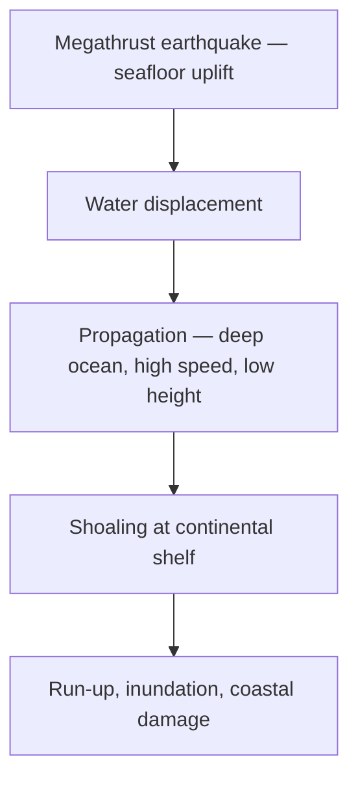

# Tsunami — Characteristics, Causes & Effects

> GS-1 · Topic 11 · Tsunami generation, propagation, Indian Ocean impacts

---

## PYQs

| Year | M | Words | Question (EN) | प्रश्न (HI) | ID |
|------|---|-------|---------------|-------------|-----|
| 2024 | 12 | 200 | Discuss the characteristics, causes and effects of Tsunami with example. | सुनामी की विशेषताओं, कारणों एवं प्रभावों का सविस्तार विवेचन प्रस्तुत कीजिए। | Q1 |
| 2018 | 12 | 200 | How are volcano, earthquake and tsunami related to each other? Highlight all the possible causes for volcanic eruptions. | ज्वालामुखी, भूकम्प और सुनामी आपस में कैसे सम्बद्ध हैं? ज्वालामुखी उद्गार के सम्भावित सभी कारणों पर प्रकाश डालiye। | Q2 |

---

## Quick Revision

```
TSUNAMI = Japanese "harbour wave" — series of long-period ocean waves from water displacement
  NOT wind-driven storm surge (cyclone) | Wavelength 100-500 km · shallow water speeds 700+ km/h

CAUSES: Subduction megathrust EQ (main) · undersea landslide · volcanic collapse · asteroid (rare)
  · submarine volcanic explosion

CHARACTERISTICS: Open ocean — low height (~1 m), ships barely feel | Coastal shoaling — height ↑↑
  · multiple waves · trough may hit first (drawback) · great destructive power

2004 INDIAN OCEAN: Sumatra-Andaman Mw 9.1 · Dec 26 · ~230,000 deaths (global)
  India: Tamil Nadu, Andhra, Puducherry, Andaman-Nicobar · INCOIS established after

PHASES: Generation → propagation (deep ocean) → run-up (coastal flooding) → inundation

EFFECTS: Loss of life · coastal erosion · salinization · ecosystem damage (mangroves/corals)
  · infrastructure · disease · economic (fisheries, tourism)

WARNING: INCOIS · Indian Tsunami Early Warning Centre (Hyderabad) · DART buoys · UNESCO IOC
  · Andaman real-time network

VOLCANO-EQ-TSUNAMI LINK: Subduction zones — magma + seismic + water displacement
  Eruption causes: plate subduction · rifting · hotspot · gas pressure · crustal assimilation

TRAPS: Tsunami ≠ tidal wave | Not all undersea EQ make tsunami | Cyclone surge ≠ tsunami
  | First wave not always biggest | 2004 changed Indian Ocean warning forever
```

---

## Content

### Context — what a tsunami is and how it differs from other coastal hazards

A tsunami is a series of extremely long-wavelength ocean waves produced when a large volume of seawater is displaced suddenly and vertically. The Japanese term means "harbour wave," reflecting how bays and inlets concentrate incoming energy. Unlike wind-driven storm waves, which have periods of seconds and wavelengths of tens of metres, tsunami waves have wavelengths of one hundred to five hundred kilometres and periods of ten to sixty minutes between crests. In the open ocean a tsunami may rise only half a metre to one metre—ships often pass over without noticing—yet the entire water column from seafloor to surface participates in the motion, carrying enormous energy that becomes visible and destructive only when the wave shoals (slows and stacks up) near coastlines.

The Indian Ocean was historically among the least monitored basins for this hazard until 26 December 2004, when the Sumatra–Andaman megathrust earthquake (Mw 9.1) ruptured more than 1,200 km of subduction interface off western Sumatra. The resulting tsunami killed approximately 230,000 people across fourteen countries—the deadliest tsunami in recorded history. India suffered more than ten thousand deaths along the Tamil Nadu, Andhra Pradesh, and Puducherry coasts and in the Andaman–Nicobar Islands, transforming national policy from reactive disaster relief to proactive early warning through INCOIS (Indian National Centre for Ocean Information Services). Understanding tsunami characteristics, causes, and effects requires separating them from storm surge (cyclone wind and pressure pushing water ashore), tidal bores, and ordinary surf—confusion between these hazards has cost lives during evacuations.

### Characteristics — open ocean behaviour, shoaling, drawback, and wave trains

Tsunami physics obey the relationship between water depth and wave speed: in deep water a tsunami travels at roughly the square root of gravitational acceleration times depth, reaching about 800 km/h in the open ocean—comparable to a jet aircraft. Because wavelength is so long, wave height remains low offshore; energy is distributed through the full depth of the water column rather than confined to the surface skin layer as in wind waves.

Near coastlines, decreasing water depth forces the wave to slow. Continuity requires energy to convert from speed into amplitude, so wave height rises dramatically—a process called shoaling. Run-up is the maximum vertical height the water reaches on land above sea level; inundation is the horizontal penetration of flooding. Together they define the destruction zone. Multiple waves arrive over hours, not as a single wall; the first crest is not always the largest, and the third or later wave has destroyed many coastal settlements where survivors mistakenly assumed the danger had passed.

| Feature | Open ocean | Near coast (shoaling / run-up) |
|---------|------------|----------------------------------|
| **Wave height** | ~0.5–1 m; often unnoticed by vessels | 10–30+ m possible in confined bays and estuaries |
| **Wavelength** | 100–500 km | Compresses as depth decreases |
| **Speed** | ~800 km/h in deep water | Slows sharply; energy converts to height |
| **Period** | 10–60 minutes between crests | Multiple waves over several hours |
| **Energy mode** | Whole water column displaced | Massive horizontal and vertical inundation force |

**Drawback** is a critical behavioural signature: before the first wave arrives, the sea may retreat abnormally far, exposing seabed and fish flapping on wet sand. Bystanders who walk onto the exposed floor are killed when the following surge returns at high speed. Drawback is not universal—some coasts receive the crest without prior retreat—but when it occurs it signals imminent danger, not a safe moment.

### Causes — megathrust earthquakes, landslides, volcanoes, and what fails to generate tsunamis

**Subduction zone megathrust earthquakes** cause most destructive tsunamis. When locked plates at a convergent boundary suddenly slip, the overriding and subducting plates move vertically over a large area of seafloor, displacing the water column above. Effective tsunamigenic ruptures are typically shallow (focus less than seventy kilometres), large magnitude (generally Mw greater than 7.0), and involve significant vertical slip on dipping fault planes. The 2004 event exemplifies all conditions: India–Burma plate boundary, Mw 9.1, 1,200 km rupture length, vertical displacement sufficient to set the entire Indian Ocean basin in motion.

**Submarine landslides** displace water when earthquake shaking or sediment overload causes slope failure. The 1998 Papua New Guinea tsunami followed a magnitude 7.0 earthquake that triggered an underwater slide, producing locally catastrophic run-up despite moderate seismic magnitude. Volcanic **flank collapse** and **caldera subsidence** can displace comparable volumes; Krakatoa's 1883 eruption collapsed much of the volcanic edifice into the Sunda Strait and generated deadly waves across the region.

**Submarine explosive eruptions** eject material and collapse cavities, displacing water directly. **Meteorite and asteroid impacts** can theoretically produce basin-scale tsunamis; evidence exists in geological records but no human-era example is documented.

Not every undersea earthquake generates a tsunami. Deep-focus earthquakes release energy too far below the surface to move the seafloor effectively. Strike-slip faults dominated by horizontal motion displace little water unless displacement has a large vertical component or trigger secondary slides. Most continental earthquakes—including the vast majority of Himalayan events—occur under land or involve collision tectonics without oceanic vertical displacement, which is why they shake cities severely but do not produce Indian Ocean tsunamis.



### The 2004 Indian Ocean Tsunami — generation, timeline, and Indian impacts

The earthquake nucleated off the west coast of northern Sumatra at the Sunda–Andaman subduction zone, where the India Plate subducts beneath the Burma microplate—the same arc that includes India's Andaman–Nicobar ridge. Rupture began around 07:58 IST and propagated northward along the trench over several minutes, releasing decades of accumulated plate convergence in a single cascade.

Andaman–Nicobar islands lying above the rupture zone were struck within minutes; Car Nicobar, Hut Bay, and other settlements experienced catastrophic run-up. Mainland India's eastern coast, farther from the epicentre, received waves two to three hours later because tsunami speed across deep ocean still requires time to cross basin distances. Nagapattinam and Cuddalore districts in Tamil Nadu recorded among the highest mainland casualties; Chennai's Marina coast was flooded; Andhra Pradesh and Kerala (minor) also reported damage. Fishing communities suffered disproportionately because boats, nets, and coastal homes were destroyed simultaneously—eliminating both shelter and livelihood in one event.

The aftermath permanently altered Indian Ocean governance: the Indian Tsunami Early Warning System became operational through INCOIS (Hyderabad) by 2007, linked to Deep-ocean Assessment and Reporting of Tsunami (DART) buoys, seismic networks, and UNESCO's Intergovernmental Oceanographic Commission (IOC) Indian Ocean Tsunami Warning System. Community evacuation drills, vertical shelters adapted from cyclone-prone Odisha, and Coastal Regulation Zone (CRZ) setback enforcement gained political urgency that scientific advisories alone had never achieved before 2004.

### Effects — human, economic, environmental, and secondary cascades

Human losses include drowning, trauma from debris impact, and entrapment in collapsed structures. Displacement into temporary camps—Nagapattinam became emblematic of post-tsunami rehabilitation challenges—creates long-term housing and livelihood crises. Infrastructure damage spans ports, roads, bridges, power lines, and freshwater systems; salt contamination of wells persists for years. Fisheries and tourism economies collapse when boats, processing plants, and beach infrastructure are destroyed simultaneously.

Environmental effects include permanent coastal erosion, altered nearshore geomorphology, saltwater intrusion into farmland and aquifers, and damage to mangroves and coral reefs. Paradoxically, intact mangrove belts in some Tamil Nadu and Sundarbans stretches absorbed wave energy and reduced inland penetration—providing empirical proof for post-2004 restoration programmes. Marine ecosystems face sediment smothering and salinity shocks. Secondary effects follow the flood: waterborne disease in crowded camps, psychological trauma, orphan crises, and legal disputes over coastal land ownership under CRZ rules.

### Volcano, earthquake, and tsunami — geological coupling and eruption causes

At convergent plate margins all three hazards share a common root: subduction pulls oceanic lithosphere into the mantle, generating earthquakes on the plate interface; hydrous minerals release water that lowers mantle melting temperature and feeds volcanic arcs (Andaman Islands including Barren Island); and large vertical ruptures on the megathrust displace ocean water to produce tsunamis. The Andaman–Nicobar sector therefore presents integrated earthquake–tsunami–volcanic risk on one tectonic template, whereas the Himalayan collision zone produces great earthquakes and landslides but not tsunamigenic ocean displacement because the boundary is continental, not a submerged megathrust above oceanic lithosphere.

Earthquakes trigger tsunamis only when undersea vertical slip is sufficient. Volcanoes generate local earthquakes through magma movement (harmonic tremors as eruption precursors); submarine eruptions and caldera collapse can independently displace water. The three hazards are not always coupled: intraplate earthquakes such as Latur 1993 produced no tsunami; most earthquakes worldwide never trigger eruptions; most volcanic eruptions never generate trans-oceanic waves.

| Process | Mechanism | Typical setting |
|---------|-----------|-----------------|
| **Subduction melting** | Water from slab lowers melting point; andesitic magma rises | Pacific Ring of Fire, Andaman arc |
| **Rifting / divergence** | Mantle upwelling at mid-ocean ridges | Mid-Indian Ocean Ridge |
| **Hotspot / mantle plume** | Deep plume punctures moving plate | Hawaii, Reunion (Deccan Traps prehistoric) |
| **Gas pressure (H₂O, CO₂)** | Volatile expansion drives explosive eruption | Plinian eruptions, stratovolcanoes |
| **Magma chamber recharge** | New magma influx repressurizes conduit | GPS-measured inflation before eruption |
| **Crustal assimilation** | Magma melts wall rock; changes viscosity and gas content | Mixed explosive-effusive eruptions |

### Tsunami warning architecture in India

| Component | Function |
|-----------|----------|
| **INCOIS (Hyderabad)** | Indian Tsunami Early Warning Centre — 24×7 monitoring and bulletin issuance |
| **DART buoys** | Deep-ocean pressure sensors detect water-column height changes |
| **Seismic network** | Rapid magnitude and hypocentre for tsunamigenic potential assessment |
| **State dissemination** | INCOIS / IMD → District Magistrates → sirens, SMS, radio |
| **Community protocol** | Mapped evacuation routes, vertical shelters, coastal zone drills |

Operational target is to issue a bulletin within ten to twenty minutes of a qualifying earthquake for Indian Ocean events. Evacuation window length depends on distance from epicentre: Andaman has minutes; Tamil Nadu may have two to three hours—but only if last-mile communication and coastal community trust in warnings function under stress.

### Tsunami versus other coastal hazards

| Hazard | Driver | Warning lead time | India agency |
|--------|--------|-------------------|--------------|
| **Tsunami** | Seafloor displacement (seismic, volcanic, slide) | Minutes to hours | INCOIS |
| **Storm surge** | Cyclone low pressure + wind push | Days (track forecast) | IMD |
| **River/coastal flood** | Heavy rainfall, river overflow | Hours | IMD / CWC |
| **Compound surge + high tide** | Cyclone plus astronomical tide | Critical during Amphan-type events | Joint IMD–state response |

Storm surge from Cyclone Fani (2019) and Amphan (2020) flooded coasts through a entirely different mechanism—wind stress and atmospheric pressure over hours—yet visually resembles tsunami inundation. Preparedness protocols differ: cyclone track forecasts allow multi-day evacuation; tsunami warnings demand immediate vertical or inland movement after seismic confirmation.

### Contemporary relevance

INCOIS maintains continuous Indian Ocean monitoring and participates in the UNESCO IOC regional network, replacing the pre-2004 warning void. CRZ rules restrict construction in high-risk intertidal zones; post-2004 mangrove restoration in Tamil Nadu and Sundarbans applies ecological engineering to hazard reduction. Barren Island's ongoing volcanic activity in the Andaman Sea keeps local tsunami and ash-fall awareness alive even when mainland attention fades. Smartphone-based alert dissemination and NDMA coastal community training aim to close the last-mile gap that delayed 2004 evacuations. Climate-driven sea-level rise incrementally raises baseline run-up heights for future tsunamis—a slow amplifier on top of any single event's wave height.

### Limits

Early warning saves lives but cannot prevent coastal exposure where populations live at sea level; minutes to hours of lead time still require functional roads, shelters, and public trust. Tsunami hazard assessment is not binary panic for every coastal earthquake—INCOIS evaluates tsunamigenic potential before issuing alerts, because false alarms erode compliance. Tsunami is not a "tidal wave"; tides are astronomical and predictable; tsunamis are geophysical and episodic. Drawback does not mean the danger is over—it often precedes the largest surge. Not all oceans were equally prepared before 2004, but the Indian Ocean demonstrated that tsunamis are a global basin hazard, not a Pacific-only phenomenon. Finally, mangrove restoration helps but cannot replace setback, building codes, and evacuation planning in densely built coastal corridors.
---

## Answers

### Q1: Discuss the characteristics, causes and effects of Tsunami with example. (2024, 12M, 200W)

**Introduction:**
> **Tsunami** are **long-period ocean waves** from **sudden massive water displacement** — **characteristically low in open ocean, devastating at coast**.

**Main Points:**
- **Characteristics** — **Wavelength 100–500 km**, **open-ocean height ~1 m**, **speed ~800 km/h**; **shoaling raises height** at coast; **multiple wave train**.
- **Causes** — **Subduction megathrust earthquakes (primary)**, **submarine landslides**, **volcanic collapse**, **rare meteorite impact**.
- **Example — 2004 Indian Ocean** — **Sumatra-Andaman Mw 9.1 (Dec 26)** — **India: TN, Andhra, Andaman-Nicobar** — **~10,000+ Indian deaths**.
- **Effects — Human** — **Mass drowning, displacement, fishing community loss**.
- **Effects — Infrastructure** — **Ports, housing, roads destroyed (Nagapattinam, Car Nicobar)**.
- **Effects — Environmental** — **Erosion, salinization, mangrove/coral damage**.
- **Secondary Effects** — **Epidemics, trauma, economic collapse of coastal economy**.
- **Mitigation Post-2004** — **INCOIS early warning**, **coastal drills, CRZ enforcement**.

**Keywords (underline in exam):** Tsunami · Megathrust · Shoaling · 2004 Sumatra · INCOIS · Run-up

**Exam diagram (30 sec):**
```
Undersea EQ → displacement → deep ocean travel → coastal shoaling → inundation
Example: 2004 Indian Ocean
```

**Conclusion:**
> **2004 tragedy** transformed **Indian Ocean from warning void to monitored basin** — **science + evacuation** key to **future resilience**.

---

### Q2: How are volcano, earthquake and tsunami related? Highlight all possible causes for volcanic eruptions. (2018, 12M, 200W)

**Introduction:**
> **Volcanoes, earthquakes, and tsunamis** share **plate boundary settings** — especially **subduction zones** like **Andaman arc** — though **not every event triggers all hazards**.

**Main Points:**
- **Plate Tectonic Nexus** — **Subduction** melts crust → **volcanoes**; **locked plates slip** → **earthquakes**; **undersea thrust** → **tsunami**.
- **Earthquake → Tsunami** — **Vertical seafloor displacement (2004 megathrust)** displaces **water column**.
- **Volcano → Earthquake** — **Magma intrusion** causes **harmonic tremors** — **eruption precursor**.
- **Volcano → Tsunami** — **Caldera/flank collapse, submarine explosion (Krakatoa 1883)**.
- **India Context** — **Andaman-Nicobar**: all three risks; **Himalaya**: mainly **EQ, not tsunami**.
- **Volcanic Eruption Causes — Subduction melting** — **Andesitic arc volcanism**.
- **Volcanic Eruption Causes — Rifting/hotspot** — **MOR, Reunion hotspot (Deccan prehistoric)**.
- **Volcanic Eruption Causes — Gas pressure, magma recharge, crustal assimilation**.

**Keywords (underline in exam):** Subduction · Megathrust · Andaman Arc · Magma · Plate Boundaries · Tsunamigenic

**Exam diagram (30 sec):**
```
Subduction zone
  ├→ Volcano (melt)
  ├→ Earthquake (plate slip)
  └→ Tsunami (if undersea thrust)
```

**Conclusion:**
> **Integrated hazard mapping** at **convergent margins** is essential — **single tectonic event can cascade across all three**.

---

### Q3: *Likely variant:* Distinguish tsunami from cyclone storm surge. (—, 8M, 125W)

**Introduction:**
> **Tsunami** and **storm surge** both **flood coasts** but differ in **origin, warning time, and wave physics**.

**Main Characteristics:**
- **Tsunami Origin** — **Seismic/volcanic water displacement** — **not wind-driven**.
- **Storm Surge Origin** — **Cyclone low pressure + wind push** — **Fani 2019, Amphan 2020**.
- **Tsunami Speed** — **~800 km/h deep ocean** — **crosses basins in hours**.
- **Storm Surge** — **Slower buildup**, **confined to cyclone track**.
- **Warning** — **INCOIS seismic-based** vs **IMD cyclone track**.
- **Duration** — **Tsunami wave train hours** vs **surge tied to cyclone landfall**.
- **Preparedness** — **Different evacuation protocols** — **confusing them kills**.

**Keywords (underline in exam):** Tsunami · Storm Surge · INCOIS · IMD · Cyclone · Megathrust

**Exam diagram (30 sec):**
```
Tsunami = EQ displacement     Storm surge = cyclone wind+pressure
Both flood coast — different cause & warning
```

**Conclusion:**
> **Coastal disaster plans must treat them separately** — **combined cyclone-tsunami rare but possible in Andaman**.

---

## Traps

| Wrong | Correct |
|-------|---------|
| Tsunami = tidal wave | **Not caused by tides** — **tectonic displacement** |
| Tsunami = storm surge | **Cyclone surge is wind-driven** — **different mechanism** |
| All undersea earthquakes cause tsunami | Need **vertical seafloor displacement**, **shallow megathrust** |
| First wave always biggest | **Later waves** may exceed **first crest** |
| Open ocean tsunami looks like big wall | **Low amplitude** — **danger at coast via shoaling** |
| Himalaya quakes cause Indian Ocean tsunami | **Continental collision** — **usually no tsunamigenic displacement** |
| India had tsunami warning before 2004 | **INCOIS system post-2004** |
| Volcanoes always cause tsunami | **Only submarine collapse/explosion** cases |
| Drawback means danger over | **Preceding sea retreat** often **before largest wave** |
| Tsunami only Pacific phenomenon | **2004 Indian Ocean** proved **global all-ocean risk** |

---

*Complete.*
