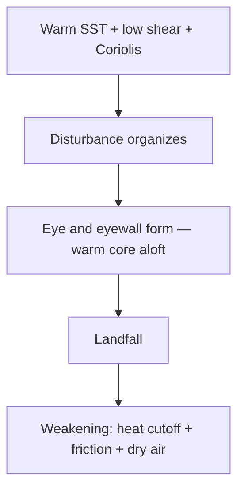

# Cyclones — Tropical & Temperate

> GS-1 · Topic 11 · Tropical cyclones, temperate cyclones, structure, India impact

---

## PYQs

| Year | M | Words | Question (EN) | प्रश्न (HI) | ID |
|------|---|-------|---------------|-------------|-----|
| 2022 | 12 | — | Describe the causes of origin, structure and weather associated with tropical cyclones. | उष्णकटिबंधीय चक्रवातों की उत्पत्ति के कारण, संरचना तथा सम्बद्ध मौसम का वर्णन कीजिए। | Q1 |
| 2023 | 12 | — | Write a short note on temperate cyclones. How it impacts India? | शीत ष्ण चक्रवात पर एक संक्षिप्त टिप्पणी लिखिए। यह भारत को कैसे प्रभावित करता है? | Q2 |
| 2021 | 12 | 200 | What is cyclone? Explain the causes of the origin of temperate cyclones. | चक्रवात क्या है? शीत ष्ण कटिबंधीय चक्रवातों के उत्पत्ति के कारणों की व्याख्या कीजिए। | Q3 |
| 2019 | 8 | 125 | "Tropical cyclones originate on the oceanic parts and as soon as they reach the terrestrial parts, these storms gradually weaken and end." Explain with reasons. | "उष्णकटिबंधीय चक्रवातों की उत्पति सागरीय भागों पर होती है एवं स्थलीय भागों पर पहुँचते ही ये धीरे-धीरे क्षीण होकर खत्म हो जाते हैं।" कारण सहit स्पष्ट करें। | Q4 |

---

## Quick Revision

```
CYCLONE = Large-scale low-pressure system with closed circular winds (general term)
  Tropical = warm-core · over tropics · >32°C SST · Coriolis essential
  Temperate/Extra-tropical = cold-core/warm-front system · mid-latitudes · westerlies belt

TROPICAL CYCLONE FORMATION (Indian Ocean/Bay of Bengal, Arabian Sea):
  Warm SST (≥26-27°C) · low vertical wind shear · Coriolis (not on equator — 5°+ lat)
  · pre-existing disturbance (ITCZ, easterly wave, Madden-Julian Oscillation)
  · high humidity in mid-troposphere

STRUCTURE: Eye (calm, low pressure) · eyewall (strongest winds, heaviest rain)
  · spiral rainbands · warm core aloft · outflow anticyclone at top

WEATHER: Storm surge · torrential rain · gale winds · tornadoes in rainbands
  India names: IMD · Fani 2019 · Amphan 2020 · Yaas 2021 · Biparjoy 2023 · Michaung 2023

WHY WEAKEN OVER LAND:
  Cut off ocean heat/moisture · increased friction · orographic disruption
  · (Exception: if re-enters warm sea — can regenerate)

TEMPERATE CYCLONE (Western Disturbance in India):
  Frontal system — warm moist meets cold dry along subtropical westerly jet
  Origin: Mediterranean/Caspian · travels east via Iran, Afghanistan, Pakistan
  India impact: Winter rain/snow Himalaya · Punjab-Haryana wheat · flash floods
  · cloud cover · temperature drop · sometimes hail

TRAPS: Cyclone ≠ tornado only | BoB more frequent than Arabian Sea (warmer, shallower)
  | WD = temperate cyclone family | Eye ≠ low damage (eyewall worst)
  | Not all landfall = instant death (Amphan maintained some intensity inland)
```

---

## Content

### Context — cyclones as atmospheric heat engines and India's dual exposure

A cyclone, in general meteorological usage, is a large-scale atmospheric system with closed isobars around a low-pressure centre, around which winds circulate cyclonically—anticlockwise in the Northern Hemisphere, clockwise in the Southern Hemisphere. The term spans two fundamentally different families: tropical cyclones, which are warm-core systems fuelled by ocean latent heat over tropical seas, and temperate (extra-tropical) cyclones, which are cold-core or frontal systems driven by horizontal temperature contrasts in mid-latitudes. India experiences both at scale. Tropical cyclones form in the Bay of Bengal and Arabian Sea and threaten Odisha, Andhra Pradesh, West Bengal, Tamil Nadu, Gujarat, and Kerala with wind, rain, and storm surge. Temperate cyclones arrive as Western Disturbances (WDs) in winter, delivering snow to the Himalaya and rainfall to Punjab, Haryana, Uttar Pradesh, and Rajasthan—moisture that the rabi wheat crop depends upon. Treating "cyclone" as synonymous only with tropical storms ignores half of India's seasonal weather architecture.

The Bay of Bengal is among the world's most cyclone-prone basins relative to coastal population density. The Arabian Sea historically saw fewer landfalls but IMD-documented trends suggest increasing frequency and rapid intensification of Arabian Sea cyclones in recent decades—Ockhi (2017), Kyarr (2019), Tauktae (2021), and Biparjoy (2023 Gujarat landfall) illustrate shifting risk toward the western coast. Climate change debates centre on warmer sea surface temperatures extending favourable thermodynamic conditions northward and lengthening post-monsoon seasons conducive to cyclogenesis.

### Tropical cyclones — conditions for origin and seasonal rhythm

Tropical cyclogenesis requires a precise overlap of thermodynamic and dynamic conditions. Warm sea surface temperature of at least 26–27°C must extend to a depth of roughly fifty metres so that wind mixing does not quickly exhaust the heat reservoir; latent heat released during condensation of evaporated water is the engine that sustains the vortex aloft. Low vertical wind shear is essential because high shear tilts the developing tower and ventilates the warm core before it can organize; without a vertically stacked heat engine, disturbances dissipate as ordinary clusters of thunderstorms. The Coriolis force must be sufficient to spin the inflow into a closed circulation, which is why tropical cyclones rarely form within about five degrees latitude of the equator despite warm water there. A pre-existing atmospheric disturbance—monsoon low, Inter-Tropical Convergence Zone (ITCZ) trough, easterly wave from Africa, or a pulse of the Madden–Julian Oscillation—provides the initial vorticity seed. High relative humidity through the mid-troposphere prevents dry air entrainment from choking convection.

| Condition | Why it is required |
|-----------|-------------------|
| **SST ≥ 26–27°C to ~50 m depth** | Supplies continuous latent heat flux from ocean evaporation |
| **Low vertical wind shear** | Allows vertical alignment of convective core and warm anomaly |
| **Coriolis force (typically >5° latitude)** | Organizes inflow into sustained cyclonic rotation |
| **Pre-existing disturbance** | ITCZ, monsoon depression, easterly wave, MJO pulse |
| **High mid-troposphere humidity** | Sustains deep convection without dry-air intrusion |

North Indian Ocean tropical cyclones peak in two seasons: pre-monsoon (April–June) and post-monsoon (October–December). The Bay of Bengal exceeds the Arabian Sea in cyclone frequency because it is shallower, warms further after monsoon withdrawal, and receives moisture-laden remnants of Pacific typhoons and South China Sea systems that re-intensify over warm bay waters. Arabian Sea cyclones, though fewer, can track toward highly populated Gujarat and Maharashtra coasts with less historical preparedness infrastructure than cyclone-hardened Odisha.

### Structure and associated weather — eye, eyewall, rainbands, warm core

A mature tropical cyclone displays a symmetric warm core aloft—temperature anomaly at the centre of the troposphere distinguishes it from cold-core temperate systems. At the surface centre lies the **eye**, typically ten to fifty kilometres wide, where subsidence creates calm winds, clear skies, and the lowest pressure. Surrounding the eye is the **eyewall**, a ring of deep convection where the strongest winds (150–250+ km/h in super cyclonic storms on the IMD scale) and heaviest rainfall occur; this is the zone of maximum destructive potential, not the eye itself—a common public misconception. **Spiral rainbands** extend outward, containing embedded thunderstorms and occasional tornadoes in the outer fringes.

Associated weather includes gale to hurricane-force winds causing structural failure, torrential rainfall producing inland flooding and landslides (especially when systems cross the Western Ghats into Kerala or Karnataka), and **storm surge**—the dome of water raised by low atmospheric pressure and pushed onshore by wind stress. Surge, not wind alone, caused much of the mortality in the 1999 Super Cyclone in Odisha (~10,000 deaths) and devastated the Sundarbans and Kolkata periphery during Amphan (2020). Compound river flooding from rainfall plus surge creates prolonged inundation in deltaic regions.

IMD classifies North Indian Ocean systems by maximum sustained wind speed: Depression → Deep Depression → Cyclonic Storm → Severe Cyclonic Storm → Very Severe → Extremely Severe → Super Cyclonic Storm (threshold at 222 km/h and above for the super category).



### Why tropical cyclones weaken over land — energy logic and exceptions

The statement that tropical cyclones originate over ocean and weaken over land is substantially correct because landfall terminates the system's primary energy supply. Over ocean, continuous evaporation under high wind flux feeds latent heat release in eyewall convection; over land the moisture flux drops sharply and the heat engine stalls. Land surface roughness—trees, buildings, terrain—increases friction and dissipates kinetic energy faster than over relatively smooth ocean. Dry continental air entrained into the circulation suppresses deep convection. Mountain ranges such as the Western Ghats and Eastern Ghats disrupt the symmetric inflow and can tear apart the vortex structure when systems penetrate inland from the Arabian Sea or Bay of Bengal respectively.

Exceptions nuance but do not overturn the rule. A cyclone crossing a narrow landmass such as the Odisha coast may partially survive if it re-enters the warm Bay of Bengal and re-intensifies. Amphan (2020) maintained destructive winds inland for a brief period before rapid decay, producing Kolkata-area damage beyond the immediate coastline. Even when wind weakens quickly, residual rainfall can cause catastrophic inland flooding—post-landfall response must shift from wind sheltering to flood and landslide management. For critical examination answers, affirm the general ocean-origin land-decay principle and cite exceptions as marginal prolongation, not contradiction.

### Temperate cyclones — origin along the polar front and Western Disturbances in India

Temperate or extra-tropical cyclones form in mid-latitudes along the **polar front**, where cold, dry polar air meets warm, moist tropical air. **Frontogenesis**—intensification of the horizontal temperature gradient—creates a wave on the front; the Norwegian cyclone model describes the life cycle from incipient wave through open warm and cold fronts to occluded mature stage and eventual filling as the system moves eastward in the westerly wind belt. Upper-air support from a **jet stream trough** triggers surface low development by enhancing divergence aloft, which draws surface air inward cyclonically. Coriolis deflection closes the circulation around the low centre.

Systems affecting India originate as winter low-pressure cells over the **Mediterranean Sea, Caspian Sea, and Red Sea region**, then propagate east embedded in the **subtropical westerly jet** across Iran, Afghanistan, and Pakistan before reaching **Western Disturbances** over northwest India. WDs are India's temperate cyclone family—not separate physics, but the same frontal wave process observed at the downstream end of the Mediterranean track.

Indian impacts are multidimensional. **Himalayan snow** in Jammu & Kashmir, Himachal Pradesh, and Uttarakhand recharges glaciers and rivers, supports winter tourism, and triggers avalanches in heavy snow years. **Plains rainfall** over Punjab, Haryana, Uttar Pradesh, and Rajasthan provides winter moisture critical for rabi wheat—the crop often called dependent on WD showers when monsoon memory has faded. **Cloud cover** raises minimum night temperatures while suppressing daytime heating, altering frost risk for horticulture. **Hailstorms and thunderstorms** episodically damage standing crops. **Flash floods** in Himalayan river valleys occur when warm WD moisture interacts with steep topography; complex interactions between WD timing and monsoon remnants contributed to the catastrophic 2013 Kedarnath event, though that disaster was not a pure WD case alone.

| Feature | Tropical cyclone | Temperate cyclone (WD) |
|---------|------------------|------------------------|
| **Core structure** | Warm core aloft | Cold/warm frontal system |
| **Season (India)** | Apr–Jun; Oct–Dec | Nov–Feb peak |
| **Region** | Coastal Bay of Bengal, Arabian Sea | North, Northwest, Himalaya |
| **Energy source** | Ocean latent heat | Frontal temperature contrast |
| **Storm surge** | Major coastal hazard | Minimal |
| **IMD tracking** | Cyclone Warning Division | Synoptic / WD bulletins |

### Named cyclones and preparedness landmarks

| Cyclone | Year | Sea | Key impact |
|---------|------|-----|------------|
| **Super Cyclone Odisha** | 1999 | Bay of Bengal | ~10,000 deaths; paradigm shift in evacuation infrastructure |
| **Phailin** | 2013 | Bay of Bengal | Mass evacuation success model |
| **Fani** | 2019 | Bay of Bengal | Odisha zero-casualty evacuation benchmark |
| **Amphan** | 2020 | Bay of Bengal | Sundarbans, Kolkata; intensity and surge debate |
| **Ockhi** | 2017 | Arabian Sea | Kerala–Tamil Nadu fishing fleet tragedy |
| **Biparjoy** | 2023 | Arabian Sea | Gujarat landfall; Arabian Sea trend confirmation |

IMD's Regional Specialized Meteorological Centre (RSMC) in New Delhi names cyclones from a rotating list contributed by Indian Ocean rim countries—regional cooperation symbol as much as forecast utility.

### Contemporary relevance

Post-1999 Odisha, India built cyclone shelters, coastal embankments, NDRF deployment protocols, and IMD's Cyclone Warning Division into a regional model emulated elsewhere. Cyclone Fani (2019) demonstrated that million-person evacuation within ninety-six hours can reduce casualties to single digits when political will and shelter infrastructure align. Amphan (2020) reopened climate change intensity debates and Sundarbans ecological vulnerability. Increasing Arabian Sea cyclogenesis challenges Gujarat and Maharashtra preparedness calibrated historically to lower frequency. Some studies report declining WD frequency with implications for wheat heat and moisture stress in Punjab—temperate cyclone change may quietly threaten food security even as tropical cyclone headlines dominate coastal news. IMD's improved track and intensity forecasting, coupled with mobile-based alerts, forms the operational backbone; residual deaths often reflect fishing community offshore notification gaps (Ockhi lesson).

### Limits

Not every Bay of Bengal cyclone makes Indian landfall—many recurve toward Bangladesh or Myanmar. Temperate cyclone impact is not confined to mountains; the Punjab–Haryana wheat belt is equally strategic. Landfall weakening is a robust rule but brief inland persistence of damaging winds (Amphan) and extreme rainfall after wind decay must be acknowledged in balanced answers. Tropical and temperate cyclones are both "cyclones" but share neither structure nor season; conflating them loses marks in comparative questions. Storm surge is wind-and-pressure driven flooding over hours tied to cyclone track—it is not a tsunami and requires different warning logic (IMD track forecast versus INCOIS seismic bulletin). Coriolis limitation means equatorial genesis is rare, not impossible at slightly higher latitude. Pre-monsoon April–June is a major tropical season, correcting the myth that cyclones occur only after monsoon withdrawal.
---

## Answers

### Q1: Describe the causes of origin, structure and weather associated with tropical cyclones. (2022, 12M)

**Introduction:**
> **Tropical cyclones** are **warm-core intense low-pressure systems** forming over **tropical oceans (≥26°C SST)** — **Bay of Bengal and Arabian Sea** affect **India seasonally**.

**Main Characteristics:**
- **Origin Causes** — **Warm SST, low vertical wind shear, Coriolis (5°+ lat), pre-existing disturbance, high humidity**.
- **Structure — Eye** — **Calm, low-pressure centre**.
- **Structure — Eyewall** — **Most destructive winds and rainfall band**.
- **Structure — Rainbands** — **Spiral outer convection**, **possible tornadoes**.
- **Warm Core** — **Aloft temperature maximum** — **defines tropical system**.
- **Weather — Winds** — **Gale to super cyclonic speeds (IMD categories)**.
- **Weather — Rainfall** — **Torrential precipitation, inland floods**.
- **Weather — Storm Surge** — **Coastal inundation (1999 Odisha, Amphan 2020)**.

**Keywords (underline in exam):** Warm Core · Eyewall · Storm Surge · SST · Bay of Bengal · IMD

**Exam diagram (30 sec):**
```
Warm ocean → low shear → eye/eyewall
         ↓
Wind + rain + storm surge
```

**Conclusion:**
> **Understanding structure locates maximum risk at eyewall/surge zones** — **basis of IMD warning and NDRF evacuation protocol**.

---

### Q2: Write a short note on temperate cyclones. How it impacts India? (2023, 12M)

**Introduction:**
> **Temperate (extra-tropical) cyclones** form along **polar front** in **mid-latitudes** — **Western Disturbances (WD)** reaching **India from Mediterranean track** bring **critical winter weather**.

**Main Points:**
- **Definition** — **Frontal low-pressure system** — **cold dry + warm moist air interaction**.
- **Origin** — **Mediterranean/Caspian**, **eastward via westerly jet over Iran-Afghanistan-Pakistan**.
- **Structure** — **Warm front, cold front, occluded front** — **Norwegian wave model**.
- **India Impact — Himalayan Snow** — **J&K, HP, Uttarakhand** — **snowpack, avalanches**.
- **India Impact — Rabi Agriculture** — **Punjab, Haryana, UP winter rain** — **wheat moisture benefit**.
- **India Impact — Weather** — **Cloudiness, hailstorms, flash floods, temperature modulation**.
- **Season** — **Nov–Feb peak** — **distinct from tropical cyclone season**.

**Keywords (underline in exam):** Temperate Cyclone · Western Disturbance · Polar Front · Rabi Wheat · Subtropical Jet

**Exam diagram (30 sec):**
```
Mediterranean low → westerly jet → NW India
         ↓
Snow (Himalaya) + winter rain (plains) → wheat
```

**Conclusion:**
> **WDs are India's temperate cyclone family** — **vital for ** **winter crops and Himalayan water recharge**.

---

### Q3: What is cyclone? Explain the causes of the origin of temperate cyclones. (2021, 12M, 200W)

**Introduction:**
> A **cyclone** is a **large-scale atmospheric system with closed cyclonic circulation around a low-pressure centre** — **temperate cyclones** arise from **frontal temperature contrasts in mid-latitudes**.

**Main Points:**
- **Cyclone — General Definition** — **Anticlockwise (NH) wind around low pressure** — **tropical and temperate types differ**.
- **Temperate Cyclone Setting** — **Polar front zone**, **subpolar low belt**, **westerlies**.
- **Frontogenesis** — **Strong horizontal temperature gradient** — **cold polar meets warm tropical air**.
- **Upper Air Trough** — **Jet stream wave** triggers **surface low development**.
- **Coriolis Effect** — **Organizes counterclockwise circulation (NH)**.
- **Moisture Supply** — **Warm sector advection** — **feeds precipitation**.
- **Occlusion** — **Mature stage** — **system eventually fills and dies**.
- **India Link** — **Same process drives Western Disturbances** affecting **North India winter**.

**Keywords (underline in exam):** Cyclone · Temperate Cyclone · Frontogenesis · Polar Front · Western Disturbance · Jet Stream

**Exam diagram (30 sec):**
```
Temp contrast → front → surface low + jet support → WD in India
```

**Conclusion:**
> **Temperate cyclones convert ** **latitudinal energy gradients into weather systems** — **WDs essential for ** **Indian winter hydrology and agriculture**.

---

### Q4: "Tropical cyclones originate on oceanic parts and weaken over land." Explain with reasons. (2019, 8M, 125W)

**Introduction:**
> **Tropical cyclones** are **ocean-heat-driven systems** — **landfall generally causes ** **rapid weakening**, though **brief exceptions exist**.

**Main Points:**
- **Ocean Origin Need** — **SST ≥26°C supplies latent heat** — **engine requires ** **continuous evaporation**.
- **Moisture Cutoff on Land** — **No ocean flux** — **convection collapses**.
- **Surface Friction** — **Land roughness** dissipates **wind energy**.
- **Dry Air Entrainment** — **Continental air** suppresses **thunderstorm maintenance**.
- **Orographic Breakup** — **Ghats, Eastern Ghats** disrupt **symmetric circulation**.
- **Partial Exception** — **Narrow landmass crossing or re-entry to warm sea** — **may persist hours (Amphan)**.
- **Overall Validity** — **Statement substantially correct** — **basis for post-landfall relief focus inland on ** **rain/flood not wind**.

**Keywords (underline in exam):** Latent Heat · SST · Landfall · Surface Friction · Storm Decay · Bay of Bengal

**Exam diagram (30 sec):**
```
Ocean heat → cyclone alive
Land → no heat + friction → weaken (usual)
```

**Conclusion:**
> **Coastal preparedness peak at landfall** — **inland threat shifts to ** **flooding as wind rapidly decays**.

---

## Traps

| Wrong | Correct |
|-------|---------|
| Cyclone = only tropical | **Temperate/extra-tropical cyclones exist** — **WDs in India** |
| Eye has worst damage | **Eyewall** surrounding eye — **maximum winds** |
| Cyclones form on equator | **Coriolis too weak within ~5°** — **need latitude** |
| Arabian Sea never gets cyclones | **Increasing trend** — **Ockhi, Biparjoy** |
| WD only affects mountains | **Punjab-Haryana wheat** critically depend on **WD rain** |
| Storm surge = tsunami | **Wind + pressure driven** — **hours-long**, not **seismic** |
| All landfall instant dissipation | **May persist briefly** — **general rule still valid** |
| Tropical = cold core | **Warm core aloft** — **opposite of temperate** |
| BoB and Arabian Sea equal frequency | **BoB more cyclogenetic** — **warmer, shallower post-monsoon** |
| Pre-monsoon cyclones rare | **Apr–Jun is major season** — **Amphan was post-monsoon Oct-Nov origin** |

---

*Complete.*
