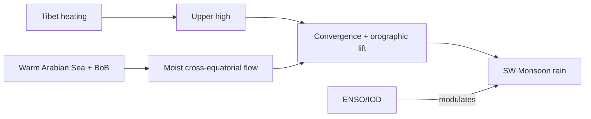

# Monsoon, El Niño, Winds & Related Phenomena

> GS-1 · Topic 11 · Monsoon theories, El Niño, air masses, aeolian landforms, climate-soil-vegetation

---

## PYQs

| Year | M | Words | Question (EN) | प्रश्न (HI) | ID |
|------|---|-------|---------------|-------------|-----|
| 2025 | 8 | 125 | Examine critically the recent theories of the origin of monsoon and discuss the effects of El-nino on monsoon. | मानसून की उत्पति के अभिनव सिद्धांतों का आलोचनात्मक परीक्षण कीजिए तथा मानसून पर एल-निनो के प्रभावों का विवेचन कीजिए। | Q1 |
| 2023 | 12 | — | Discuss the relationship between El Nino and south-west monsoon in India and its impact on agriculture. | भारत में एल नीन और दक्षिण-पश्चिम मानसून के बीच संबंधों की व्याख्या कीजिए और उसके कृषि पर प्रभाव बताइये। | Q2 |
| 2024 | 8 | 125 | Explain the interrelationship between climate, soils and vegetation. | जलवायु, मृदा और वनस्पति के अंतर्संबंधों को स्पष्ट कीजिए। | Q3 |
| 2018 | 12 | 200 | What is an air mass? Describe its chief characteristics. | वायु-पुंज क्या है? इसकी प्रमुख विशेषताओं का उल्लेख कीजिए। | Q4 |
| 2019 | 12 | 200 | Describe the landforms formed by wind erosion and depositional works. | वायु की अपरदनात्मक तथा निक्षेपात्मक क्रिया द्वारा निर्मित भू-आकृतियों का वर्णन कीजिए। | Q5 |
| 2018 | 8 | 125 | Write a note on the Global Warming. | भू-मण्डलीय ऊष्मन पर टिप्पणी लिखिए। | Q6 |

---

## Quick Revision

```
MONSOON = Seasonal reversal of wind (Arabic mausim) — SW summer (Jun-Sep) · NE winter (Oct-Dec)

CLASSICAL THEORIES:
  Halley — thermal (land-sea temp contrast) — incomplete alone
  Ferrel — deflection + thermal
  Flohn — dynamic — Tibet plateau thermal + upper tropospheric high (Tibetan anticyclone)
  Recent/dynamic: cross-equatorial flow · Somali jet · Mascarene high · ITCZ shift
  · Tibetan plateau heating · jet stream position · ENSO modulation

SW MONSOON MECHANISM: Summer — low pressure over heated subcontinent
  → cross-equatorial S-W flow (Somali jet) → picks moisture from Arabian Sea + BoB
  → orographic rain (Western Ghats, Himalaya) · break/active phases (MJO)

EL NINO: Warm eastern Pacific (Peru coast) · Walker circulation weakens
  → shifts convection west→east · Indian Ocean ridge · suppresses SW monsoon India
  La Nina = opposite · often above-normal rain · IOD (Indian Ocean Dipole) modulates

EL NINO AGRI IMPACT: Deficient/delayed monsoon · drought (1987, 2002, 2009, 2015-16)
  · reservoir levels ↓ · kharif sowing delay · MSP procurement stress
  Positive IOD can offset El Nino (1997)

AIR MASS: Large body of uniform temp + humidity (source region: continental/maritime · arctic/tropical)
  cA, cP, mT, mE etc. · fronts form at boundaries · India: mT (Arabian Sea), cT (Thar)

AEOLIAN LANDFORMS:
  Erosion: deflation hollows · ventifacts · yardangs · pedestal rocks · blowouts
  Deposition: sand dunes (barchan, seif, longitudinal) · loess plains

CLIMATE-SOIL-VEGETATION: Climate (temp + rain) → weathering → soil type (laterite, desert, alluvial)
  → vegetation (forest, savanna, desert scrub) — feedback via humus, albedo

GLOBAL WARMING: GHG (CO2, CH4) trap LW radiation · IPCC · India impacts: heatwaves, glacier melt, erratic monsoon

TRAPS: Monsoon ≠ only onshore wind · El Nino ≠ drought always (IOD offset) · Air mass ≠ local breeze
  | SW monsoon ≠ entire India same rain (TN rain-shadow) | GW ≠ only temperature rise
```

---

## Content

### Context — monsoon and Indian climate

The word **monsoon** derives from the Arabic *mausim*, meaning season, and it describes a climate regime in which wind direction reverses between summer and winter while rainfall concentrates in one season rather than spreading evenly through the year. On the Indian subcontinent, the southwest monsoon from June to September delivers roughly seventy percent of annual rainfall, which is why kharif agriculture, reservoir storage, hydropower generation, and rural economic activity remain tightly coupled to its timing, spatial distribution, and intensity. The northeast monsoon from October to December supplements rainfall chiefly along the Tamil Nadu coast and parts of Andhra Pradesh, where the summer southwest flow leaves a rain-shadow zone. Understanding monsoon origin therefore requires tracing how land–sea thermal contrast, high-altitude heating over Tibet, cross-equatorial moisture transport, and ocean-atmosphere oscillations combine into a single integrated system rather than any single cause acting alone.

### Theories of monsoon origin — classical to recent

Early explanations treated the monsoon as essentially a giant sea breeze. **Halley (1686)** argued that intense summer heating over the Indian subcontinent creates a thermal low, which draws onshore winds from the cooler Indian Ocean and thereby produces rain. This thermal theory correctly identifies the land–sea temperature difference as a fundamental driver, but it cannot explain why the monsoon arrives in discrete jumps, why breaks occur mid-season, or why upper-air circulation and ocean temperatures modulate rainfall from year to year. **Ferrel** added Earth's rotation to the thermal framework, acknowledging that Coriolis deflection shapes wind trajectories, yet the model still lacked a complete three-dimensional picture of the atmosphere.

**Flohn's dynamic theory** shifted attention upward to the Tibetan Plateau, which acts as an elevated heat source in summer. Intense surface heating and latent heat release over Tibet generate an upper-tropospheric anticyclone; this high-pressure cell, combined with the thermal low at the surface over northwest India, steepens the pressure gradient that draws in southwesterly winds from the Arabian Sea and Bay of Bengal. The proof lies in observed upper-air data: monsoon strength correlates with Tibetan snow cover depletion and upper-level divergence over the plateau. However, dynamic theory alone cannot account for interannual variability without incorporating ocean coupling.

Modern synthesis integrates several additional mechanisms. The **Inter-Tropical Convergence Zone (ITCZ)** shifts northward over the subcontinent in summer, organizing the monsoon trough—a zone of low pressure and convergence stretching from the heat low over northwest India toward the head Bay of Bengal. **Cross-equatorial flow** brings low-level winds from the Southern Hemisphere; the **Somali jet** along the East African coast and the **Mascarene High** in the southwest Indian Ocean accelerate this flow, which then curves into the Arabian Sea branch of the monsoon. **Jet stream configuration** matters equally: in summer the subtropical westerly jet moves north of the Himalaya while a tropical easterly jet forms over the peninsular south, steering monsoon systems and influencing active and break phases. No single classical theory suffices; the operational understanding is a coupled land–ocean–atmosphere system modulated by ENSO, the Indian Ocean Dipole, and the Madden-Julian Oscillation.

| Theory / scholar | Core idea | Limitation |
|------------------|-----------|------------|
| **Halley (1686)** | Summer heating over India creates a thermal low that draws onshore winds and rainfall | Ignores Coriolis deflection, upper-air dynamics, and ocean-atmosphere coupling |
| **Ferrel** | Combines thermal land–sea contrast with Earth's rotation | Still incomplete without three-dimensional and oceanic feedback |
| **Flohn / Dynamic** | Tibetan Plateau summer heating builds an upper tropospheric high that draws in the southwest monsoon | Requires ocean moisture supply and cross-equatorial flow to complete the picture |
| **Modern ITCZ shift** | ITCZ moves north over the subcontinent; the monsoon trough organizes the rain belt | Explains spatial belt of rain but not all interannual variability |
| **Cross-equatorial flow** | Somali jet and Mascarene High drive low-level cross-equatorial winds carrying moisture | Critical for onset timing but insufficient alone for seasonal totals |
| **Jet stream role** | Subtropical westerly jet north of Himalaya; tropical easterly jet over peninsula in summer | Explains active/break spells and sub-seasonal variability |



### Southwest monsoon — mechanism and spatial pattern

The southwest monsoon establishes when the cross-equatorial flow intensifies, sea surface temperatures in the Arabian Sea and Bay of Bengal rise above approximately 28°C, and the monsoon trough settles over the Indo-Gangetic plain. The India Meteorological Department declares onset over Kerala around 1 June; northward advance occurs in jumps linked to the position of the trough and embedded depressions from the Bay of Bengal. Once established, moisture-laden winds strike the Western Ghats and rise orographically, producing some of the world's highest rainfall totals at Cherrapunji and Mawsynram on the Meghalaya plateau. The southern slopes of the Himalaya receive similarly enhanced precipitation. By contrast, the leeward side of the Ghats and much of interior Tamil Nadu lie in rain shadow during the southwest season, which is why the northeast monsoon becomes critical for the Coromandel coast.

Within the season, rainfall does not fall uniformly. **Active spells** occur when the monsoon trough lies south of its normal position and low-pressure systems track westward from the Bay of Bengal. **Break spells** happen when the trough shifts north toward the Himalaya, suppressing convection over central India while heavy rain may continue along the Himalayan foothills. The **Madden-Julian Oscillation (MJO)**, a 30–60 day pulse of enhanced and suppressed tropical convection propagating eastward, explains many of these sub-seasonal fluctuations and has become a tool for extended-range forecasting.

### El Niño, La Niña, and the Indian monsoon

Under normal conditions, warm water and intense convection sit in the western tropical Pacific while cold upwelled water off Peru suppresses convection in the eastern Pacific; the resulting **Walker circulation** drives upper-level westerlies over the Pacific and supports rising motion over the maritime continent. During **El Niño**, abnormal warming of the eastern equatorial Pacific weakens or reverses this circulation: convection shifts eastward, the Walker cell slackens, and subsidence tendencies strengthen over the Indian Ocean. A subtropical ridge often forms over the Indian Ocean, suppressing monsoon convection over India. Statistically, many El Niño years correlate with deficient southwest monsoon rainfall, delayed onset, or early withdrawal, but the relationship is not deterministic. In 1997, a strong El Niño coincided with a near-normal monsoon because a positive **Indian Ocean Dipole (IOD)**—warmer sea surface in the western Indian Ocean relative to the east—maintained convection over the subcontinent.

**La Niña**, the opposite phase with cooler eastern Pacific waters, often associates with above-normal Indian rainfall, as in 2020, though flooding rather than drought becomes the risk. A negative IOD can compound El Niño-related monsoon failure, while positive IOD can partially or fully offset it. Agriculture feels these teleconnections through shortened growing seasons when sowing is delayed, stress in Maharashtra, Karnataka, Madhya Pradesh, and Gujarat during deficient years, falling reservoir levels that curtail irrigation and drinking water supply, delayed planting of rice, cotton, soybean, and pulses, fodder scarcity, food inflation in pulses and oilseeds, rising crop insurance claims under PMFBY, and increased dependence on MSP procurement and MGNREGA during drought years such as 2002, 2009, and 2015–16.

| Phase | Pacific condition | Indian monsoon tendency | Agriculture note |
|-------|-------------------|-------------------------|------------------|
| **El Niño** | Eastern Pacific abnormally warm | Often deficient southwest monsoon; delayed onset possible | Drought risk; higher insurance claims; reservoir stress |
| **La Niña** | Eastern Pacific abnormally cool | Often above-normal rainfall | Flood risk; pest and disease pressure on standing crops |
| **Neutral** | Near-normal sea surface temperatures | Internal variability and MJO dominate | Forecast uncertainty remains relatively high |
| **+IOD** | Western Indian Ocean warmer than east | Can offset El Niño suppression (e.g., 1997) | Kharif saved in strong positive IOD years |
| **−IOD** | Western Indian Ocean cooler than east | Reinforces monsoon failure when combined with El Niño | Compound stress on rain-fed agriculture |

### Air masses — definition, classification, and Indian context

An **air mass** is a vast body of air—typically extending over hundreds of kilometres—in which temperature and humidity remain horizontally uniform because the air has lingered long enough over a **source region** to acquire that region's properties. Source regions are extensive areas of uniform surface character, either stable continental interiors or warm ocean surfaces. Air masses change character as they move: passing over warmer land they warm and may dry; crossing oceans they pick up moisture.

The Bergeron classification, adapted for tropical settings, distinguishes maritime tropical (mT), continental tropical (cT), continental polar (cP), and maritime polar (mP) types. During the southwest monsoon, **maritime tropical air** from the Arabian Sea and Bay of Bengal dominates, supplying the moisture that fuels orographic and cyclonic rain. Pre-monsoon months over northwest India see **continental tropical air** from the Thar Desert, contributing to the intense heat low of May. **Continental polar air** occasionally penetrates northern India with western disturbances in winter. **Maritime polar air** has limited direct influence on the subcontinent. Where unlike air masses meet, **fronts** form—the boundaries that organize temperate cyclones in mid-latitudes and modulate winter weather over north India.

| Code | Type | Source | India relevance |
|------|------|--------|-----------------|
| **mT** | Maritime Tropical | Warm oceans | Arabian Sea and Bay of Bengal supply monsoon moisture |
| **cT** | Continental Tropical | Hot dry land | Thar Desert feeds pre-monsoon heat low over northwest India |
| **cP** | Continental Polar | Cold continental interiors | Rare winter incursions with western disturbances in extreme north |
| **mP** | Maritime Polar | Cold oceans | Limited direct impact on Indian weather |

### Aeolian landforms — erosion and deposition by wind

In arid and semi-arid regions where vegetation cover is sparse and loose sediment abundant, wind becomes a major geomorphic agent. **Deflation** lifts and removes fine particles, creating hollows and blowouts visible across the Thar Desert. **Abrasion** sandblasts rock surfaces, producing **ventifacts** with polished facets oriented toward prevailing winds. **Yardangs** are streamlined ridges carved in soft rock by persistent wind erosion, analogous to forms in Ladakh and Central Asian deserts. **Pedestal or mushroom rocks** arise when differential erosion removes softer material at the base of boulders while harder caps remain. **Desert pavement** forms when deflation removes fines and leaves a lag of coarse stones armouring the surface.

Depositional aeolian landforms include **sand dunes**, whose shape reflects wind regime: **barchans** are crescentic dunes under unidirectional wind; **seif** dunes are longitudinal ridges parallel to wind corridors; **transverse dunes** lie perpendicular to wind; **parabolic dunes** are U-shaped and often stabilized by vegetation. Mobile dunes migrate across Rajasthan. **Loess plains** consist of fine silt deposited beyond desert margins by wind; their fertility when stabilized supports agriculture, though the contribution of loess to Punjab alluvium remains debated. **Ripples** are small bedforms on dune surfaces reflecting daily wind shifts.

### Climate, soil, and vegetation — interrelationship

Climate—meaning the long-term regime of temperature and precipitation—controls the rate and type of **weathering**, which in turn determines **soil** formation and the **vegetation** communities soils can support. High temperature combined with heavy year-round rainfall leaches bases and silica from soils, producing **laterite** under tropical evergreen forest on the windward Western Ghats. Seasonal monsoon climates with distinct wet and dry periods generate **alluvial**, **black regur** (from Deccan basalt), and **red** soils that support deciduous monsoon forest and savanna across the peninsula. Semi-arid climates with low rainfall produce sandy, saline desert soils under xerophytic scrub and thorn forest in Rajasthan. Alpine cold in the Himalaya yields immature skeletal soils supporting montane conifer forest and alpine meadows at higher elevations.

The relationship runs both ways. Vegetation returns organic matter to soil as humus, improving fertility and water retention. Soil texture and depth constrain which plants can root successfully. Orographic rainfall creates sharp contrasts at the same latitude: windward Ghats carry evergreen forest on lateritic soils while rain-shadow Tamil Nadu carries sparser scrub. Altitude in the Himalaya creates sequential belts of climate, soil, and vegetation from tropical foothills to alpine tundra. Human activity—deforestation, irrigation, terracing—modifies these natural cycles, as the Chipko movement illustrated when forest loss accelerated erosion and altered local hydrology.

| Climate control | Soil outcome | Vegetation outcome |
|-----------------|--------------|-------------------|
| High temperature + heavy rainfall (equatorial/wet) | Laterite with strong leaching | Tropical evergreen forest (Western Ghats windward) |
| Monsoon seasonal (Aw/Am) | Alluvial, black regur, red soils | Deciduous monsoon forest, savanna grassland |
| Semi-arid (BSh/BWh) | Sandy, saline desert soils | Xerophytic scrub, thorn forest (Rajasthan) |
| Alpine cold (Himalaya) | Immature, skeletal mountain soils | Montane conifer forest, alpine meadows |

### Global warming — mechanism, evidence, and Indian impacts

**Global warming** refers to the long-term rise in Earth's average surface temperature driven by the enhanced **greenhouse effect**. Greenhouse gases—carbon dioxide, methane, nitrous oxide, and historically chlorofluorocarbons—trap outgoing longwave radiation that would otherwise escape to space, thereby raising equilibrium temperature. The IPCC Sixth Assessment Report documents approximately 1.1°C of global warming since pre-industrial times, with the trend accelerating as emissions accumulate.

For India, consequences are systemic rather than limited to thermometer readings. Heatwave frequency and intensity have increased over northwest and central India. Himalayan glaciers including Gangotri are retreating, threatening long-term base flow of the Ganga and other rivers. Sea-level rise threatens low-lying coasts and the Sundarbans delta. Monsoon rainfall shows increased spatial and temporal variability rather than a uniform decrease—some regions face drought while others record extreme single-day totals. Tropical cyclones in the Arabian Sea and Bay of Bengal show a tendency toward rapid intensification over warmer sea surface. Policy responses include the Paris Agreement, India's Panchamrit pledges at COP26, the National Action Plan on Climate Change, the International Solar Alliance, Mission LiFE for pro-planet behaviour, and the net-zero-by-2070 target.

### Contemporary relevance

The India Meteorological Department's long-range monsoon forecast now routinely incorporates ENSO phase, IOD state, MJO activity, and Eurasian snow cover as predictors, reflecting the integrated theory described above. El Niño years such as 2023 saw deficient monsoon phases that triggered agricultural monitoring and contingency planning across rain-fed states. Mission LiFE and the net-zero 2070 pledge connect global warming science to domestic mitigation policy. Aeolian landform stabilization through shelter belts and desertification control programmes addresses wind erosion in the Thar. Sub-seasonal forecasting using MJO tracking helps farmers and water managers respond to active and break spells within a single monsoon season.

### Limits and balanced view

El Niño does not automatically produce drought in India; positive IOD, neutral Pacific conditions, and internal atmospheric variability can offset or amplify teleconnections, so any analysis must state probabilities rather than certainties. Monsoon theories each capture part of the truth—thermal, dynamic, and oceanic—and critical examination means weighing strengths and gaps rather than endorsing one model alone. Climate–soil–vegetation relationships describe natural systems that human land use, irrigation, and deforestation substantially modify. La Niña tends toward excess rain but does not guarantee flooding every year. The southwest monsoon does not deliver equal rainfall across India: rain-shadow interiors and the Coromandel coast depend on different seasonal regimes. Global warming encompasses ocean heat content, ice loss, biological shifts, and extreme events, not temperature rise alone.

---

## Answers

### Q1: Examine critically recent theories of monsoon origin and discuss El-nino effects on monsoon. (2025, 8M, 125W)

**Introduction:**
> **Indian monsoon** arises from **multi-scale interactions** — **land-ocean thermal contrast, Tibetan plateau, cross-equatorial flow, and ocean-atmosphere oscillations like ENSO**.

**Main Points:**
- **Halley Thermal Theory** — **Summer low over India draws winds** — **valid but incomplete alone**.
- **Dynamic/Flohn Theory** — **Tibetan plateau upper high** — **critical modern component**.
- **Cross-Equatorial Flow / Somali Jet** — **Low-level moisture transport from Southern Hemisphere**.
- **ITCZ Shift & Monsoon Trough** — **Organizes rain belt over subcontinent**.
- **Critical Gap** — **No single theory suffices** — **need coupled ocean-atmosphere model**.
- **El Niño Mechanism** — **Warm eastern Pacific weakens Walker cell** — **Indian Ocean subsidence tendency**.
- **El Niño Effect** — **Often deficient/delayed SW monsoon** — **not deterministic (1997 exception with +IOD)**.

**Keywords (underline in exam):** Dynamic Monsoon · Tibetan Plateau · Somali Jet · El Niño · Walker Circulation · IOD

**Exam diagram (30 sec):**
```
Thermal + Tibet + cross-equatorial moisture → monsoon
El Niño → Walker weak → monsoon suppress (often)
```

**Conclusion:**
> **Integrated dynamic-ocean theory** replaces **pure thermal explanation** — **ENSO monitoring central to IMD forecasting**.

---

### Q2: Discuss El Nino and south-west monsoon relationship and impact on agriculture. (2023, 12M)

**Introduction:**
> **El Niño** (warm eastern Pacific) **modulates Walker circulation**, **often weakening Indian SW monsoon** with **significant kharif agricultural consequences**.

**Main Points:**
- **Mechanism** — **Convection shifts to Pacific** — **Indian Ocean high-pressure tendency** — **reduced monsoon rainfall**.
- **Statistical Link** — **Many El Niño years correlate with deficiency** — **IOD/MJO can offset**.
- **Onset/Withdrawal** — **Delayed onset or early withdrawal** — **shortens crop window**.
- **Geographic Impact** — **Central India, Maharashtra, Karnataka, Gujarat** often **worst affected**.
- **Reservoir & Irrigation** — **Storage decline** — **rabi dependency increases**.
- **Crop Impact** — **Delayed sowing (rice, cotton, soyabean, pulses)** — **yield loss**.
- **Economic Impact** — **Food inflation**, **PMFBY insurance claims**, **rural demand slowdown**.
- **Mitigation** — **IMD forecast, drought-resistant seeds, MSP buffer, MGNREGA**.

**Keywords (underline in exam):** El Niño · SW Monsoon · Walker Circulation · Kharif · IOD · PMFBY · Deficient Monsoon

**Exam diagram (30 sec):**
```
El Niño → weak monsoon → late sowing · low reservoir → yield/income loss
```

**Conclusion:**
> **El Niño is key agricultural risk factor** — **forecast-based adaptation** reduces **food security shocks**.

---

### Q3: Explain interrelationship between climate, soils and vegetation. (2024, 8M, 125W)

**Introduction:**
> **Climate (temperature + precipitation regime)** drives **weathering and soil formation**, which **supports specific vegetation types** — **mutual feedback loop**.

**Main Characteristics:**
- **Climate → Soil** — **High rainfall leaches nutrients (laterite in Western Ghats)**; **aridity forms ** **desert sandy/saline soils (Thar)**.
- **Climate → Vegetation** — **Tropical wet → evergreen**; **monsoon seasonal → deciduous**; **semi-arid → thorn scrub**.
- **Soil → Vegetation** — **Black regur (Deccan) supports cotton**; **alluvial Gangetic → dense agriculture/forests**.
- **Vegetation → Soil** — **Humus from forest litter improves fertility**.
- **Orographic Climate** — **Windward Ghats vs rain-shadow TN** — **contrasting soil-vegetation in same latitude**.
- **Altitude (Himalaya)** — **Climate zonation → soil immaturity → montane/alpine vegetation belts**.
- **Feedback** — **Deforestation alters local climate and soil erosion (Chipko lesson)**.

**Keywords (underline in exam):** Climate · Laterite · Alluvial · Monsoon Forest · Pedogenesis · Vegetation Belts

**Exam diagram (30 sec):**
```
Climate → weathering → soil type → vegetation
         ↑__________________________| (humus feedback)
```

**Conclusion:**
> **Climate-soil-vegetation form inseparable geographic system** — **basis of Indian natural region classification**.

---

### Q4: What is an air mass? Describe its chief characteristics. (2018, 12M, 200W)

**Introduction:**
> An **air mass** is a ** vast body of air** with ** horizontally uniform temperature and humidity**, acquired from its **source region**.

**Main Characteristics:**
- **Source Region Definition** — **Extensive uniform surface (ocean or continent)** — **stable or maritime**.
- **Uniformity** — **Temperature and moisture consistent over ** **hundreds of km**.
- **Classification — mT** — **Maritime Tropical (warm, moist)** — **Arabian Sea monsoon source**.
- **Classification — cT** — **Continental Tropical (hot, dry)** — **Thar heat low**.
- **Classification — cP/mP** — **Polar types** — **Western Disturbance cold sectors (north India)**.
- **Modification** — **Changes while moving** — **heating, moisture gain/loss**.
- **Frontal Boundaries** — **Air mass collision forms ** **fronts — temperate cyclones**.
- **India Context** — **SW monsoon = mT dominance**; **pre-monsoon = cT over northwest**.

**Keywords (underline in exam):** Air Mass · Source Region · mT · cT · Front · Maritime · Continental

**Exam diagram (30 sec):**
```
Source region → uniform air mass → moves → modifies → front at boundary
```

**Conclusion:**
> **Air mass theory explains ** **monsoon moisture supply and winter frontal weather** over **South Asia**.

---

### Q5: Describe landforms formed by wind erosion and depositional works. (2019, 12M, 200W)

**Introduction:**
> **Aeolian processes** in **arid and semi-arid regions** sculpt **erosional landforms through deflation/abrasion** and **depositional dunes/loess**.

**Main Points:**
- **Deflation Hollows / Blowouts** — **Fine particle removal** — **Thar Desert depressions**.
- **Ventifacts** — **Wind-polished rock facets** — **abrasion by sand grains**.
- **Yardangs** — **Streamlined ridges in soft rock** — **wind erosion parallel to prevailing wind**.
- **Pedestal Rocks** — **Differential erosion** — **mushroom shapes**.
- **Sand Dunes — Barchan** — **Crescent, unidirectional wind** — **Rajasthan mobile dunes**.
- **Sand Dunes — Seif/ Longitudinal** — **Parallel to prevailing wind corridors**.
- **Loess Plains** — **Fine silt deposition beyond desert margin** — **fertile when stable**.
- **Desert Pavement** — **Coarse lag after deflation** — **surface armouring**.

**Keywords (underline in exam):** Aeolian · Deflation · Ventifact · Yardang · Barchan · Loess · Thar Desert

**Exam diagram (30 sec):**
```
Wind erosion: deflation · ventifacts · yardangs
Wind deposit: barchan · seif · loess
```

**Conclusion:**
> **Aeolian landforms dominate ** **Indian desert geography (Thar)** — **understanding them aids ** **combating desertification**.

---

### Q6: Write a note on Global Warming. (2018, 8M, 125W)

**Introduction:**
> **Global warming** is **long-term rise in Earth's average surface temperature** due to **enhanced greenhouse effect** from **anthropogenic GHG emissions**.

**Main Points:**
- **Mechanism** — **CO₂, CH₄, N₂O trap outgoing longwave radiation**.
- **Evidence** — **IPCC: ~1.1°C rise since pre-industrial** — **accelerating trend**.
- **India Impacts** — **Heatwaves, Himalayan glacier melt, sea-level rise (Sundarbans)**.
- **Monsoon & Extremes** — **Increased variability**, **heavy rain events**, **drought pockets**.
- **Cyclone Intensification** — **Warmer SST fuels stronger storms**.
- **Policy Response** — **Paris Agreement, Panchamrit, NAPCC, net-zero 2070 pledge**.
- **Mitigation** — **Renewable energy, ISA, energy efficiency, afforestation**.

**Keywords (underline in exam):** Greenhouse Effect · IPCC · CO₂ · Climate Change · Paris Agreement · Net Zero

**Exam diagram (30 sec):**
```
GHG ↑ → trapped heat → warming → extremes + glacier melt + sea level ↑
```

**Conclusion:**
> **Global warming threatens ** **India's water, agriculture, and coasts** — **mitigation-adaptation both urgent**.

---

## Traps

| Wrong | Correct |
|-------|---------|
| Monsoon = only wind reversal | **Wind reversal + seasonal rainfall regime** |
| Halley alone explains monsoon | **Dynamic + ocean coupling needed** — **critically examine** |
| El Niño always causes drought in India | **IOD/MJO can offset** — **1997 example** |
| La Niña = always flood | **Statistical tendency**, **not rule** |
| Air mass = small local breeze | **Continental-scale uniform body** |
| All dunes same shape | **Barchan, seif, transverse** — **wind direction dependent** |
| Loess = sand dunes | **Fine silt**, **different origin/deposition** |
| Climate determines all without human role | **Irrigation, deforestation modify** soil-vegetation |
| Global warming = only temperature | **Extremes, oceans, ice, biology** — **systemic change** |
| SW monsoon brings rain everywhere equally | **Rain shadow (TN interior), spatial variation** |

---

*Complete.*
