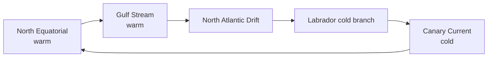

# Ocean Currents — Origin, Atlantic & Indian Ocean

> GS-1 · Topic 11 · Ocean currents, factors, Atlantic currents, India relevance

---

## PYQs

| Year | M | Words | Question (EN) | प्रश्न (HI) | ID |
|------|---|-------|---------------|-------------|-----|
| 2019 | 12 | 200 | Write a systematic essay on the ocean currents of northern Atlantic Ocean with their reasons of origin. | उत्तरी अटलांटिक महासागर की जलधाराओं पर उनके उत्पति के कारण सहित एक क्रमबद्ध लेख लिखिये। | Q1 |
| 2018 | 12 | 200 | Mention the factors responsible for the origins of ocean currents and name the currents of the Atlantic Ocean. | महासागरीय धाराओं की उत्पति के लिए उत्तरदायी कारकों का उल्लेख कीजिए और अन्ध महासागर की जलधाराओं का नाम बताइए। | Q2 |

---

## Quick Revision

```
OCEAN CURRENT = Large-scale persistent horizontal water movement (surface + deep)

FACTORS OF ORIGIN:
  Planetary winds (primary driver) — trade winds · westerlies
  Coriolis deflection (Ekman spiral) · temp/salinity density (thermohaline)
  Earth's rotation · coast shape (deflection, upwelling) · landmass barriers
  Evaporation/precipitation · tides (minor for major currents)

WARM vs COLD: Warm = low→high lat (east coast tropics often) · Cold = high→low (west coast tropics often)
  (Exception: coast geometry modifies — Gulf Stream warm on west Atlantic)

NORTH ATLANTIC GYRE (clockwise):
  North Equatorial Current (warm) → CANARY CURRENT (cold, east) →
  NORTH ATLANTIC DRIFT/Gulf Stream extension (warm, NE Europe) ←
  GULF STREAM (warm, western boundary — US to Europe) ←
  Labrador Current (cold, SW Greenland)

OTHER ATLANTIC: South Equatorial · Brazil Current (warm) · Benguela (cold, SW Africa)
  · Falkland · Antarctic Circumpolar · Equatorial Counter Current

INDIA RELEVANCE: Somali Current (seasonal) · Agulhas · monsoon drift
  · Indian Ocean gyre · affects SST → monsoon · fisheries upwelling (Somalia, Arabian Sea)

THERMOHALINE: Atlantic "conveyor belt" — NADW formation — global climate link

TRAPS: Gulf Stream ≠ same as North Atlantic Drift (connected) | Currents follow wind belts mostly
  | Cold current on west coast of continents (general rule) | Canary = cold not warm
  | Question may ask Atlantic whole vs North Atlantic only — read carefully
```

---

## Content

### Context — what ocean currents are and why they matter

An **ocean current** is a large-scale, more-or-less persistent horizontal movement of seawater through the ocean basins. Currents operate at the surface, driven primarily by wind stress, and at depth, driven by differences in water density created by temperature and salinity—the **thermohaline** circulation. Together they function as the ocean's circulatory system, redistributing heat from tropical latitudes toward the poles, supplying nutrients to surface waters through upwelling, shaping coastal climates, and influencing weather patterns on adjacent continents. Although visibly strong surface flows cover only a small fraction of the ocean surface, the gyres and deep overturning cells move enormous water masses that store and transport heat equivalent to a major fraction of Earth's energy balance. For India, enclosed within the Indian Ocean, currents such as the seasonally reversing Somali Current, the monsoon drift in the Arabian Sea and Bay of Bengal, and the Agulhas Current south of Africa modulate sea surface temperature, monsoon onset, tropical cyclogenesis, and marine fisheries productivity.

### Factors responsible for the origin of ocean currents

Ocean currents arise from the combined action of several physical forces rather than any single cause. **Planetary winds** are the primary driver of surface currents: northeast and southeast trade winds push equatorial water westward, while mid-latitude westerlies drive eastward flow. Friction between wind and water transfers momentum to the surface layer. The **Coriolis force** deflects moving water to the right in the Northern Hemisphere and to the left in the Southern Hemisphere, organizing flow into circular **gyres** and producing the **Ekman spiral**, in which surface water moves at an angle to wind direction and net transport occurs roughly ninety degrees to wind stress. **Temperature differences** matter because warm water is less dense and tends to spread or remain at the surface while cold water sinks. **Salinity differences** arise where evaporation exceeds precipitation, increasing density and driving thermohaline sinking; where rivers or rain freshen the surface, water becomes buoyant and resists mixing downward.

**Earth's rotation** produces **geostrophic balance**, in which currents flow approximately along lines of equal pressure rather than directly downslope. **Coastline shape** deflects and intensifies currents—western boundary currents such as the Gulf Stream are narrow, swift, and warm because water piles up against the continental margin. **Landmass barriers** prevent continuous equatorial circulation around the globe; the Atlantic, for instance, has no uninterrupted circum-equatorial current because the Americas block east–west flow at low latitudes. **Upwelling and downwelling** occur where winds blow parallel to coasts or where water diverges at the surface, bringing cold, nutrient-rich deep water upward—as off Peru and Namibia—or forcing surface water downward.

| Factor | Mechanism |
|--------|-----------|
| **Planetary winds** | Trade winds push equatorial water west; westerlies drive mid-latitude eastward flow—the primary surface driver |
| **Coriolis force** | Deflects currents right in NH, left in SH; forms gyres and Ekman transport |
| **Temperature difference** | Warm water is less dense; creates horizontal and vertical pressure gradients |
| **Salinity difference** | Evaporation increases salinity and density, driving thermohaline sinking |
| **Earth's rotation** | Geostrophic balance makes currents follow pressure contours |
| **Coastline shape** | Deflects and intensifies boundary currents; Gulf Stream pinned along US east coast |
| **Landmass barriers** | Americas separate Atlantic and Pacific gyres; no continuous Atlantic equatorial circuit |
| **Upwelling/downwelling** | Wind-driven divergence lifts nutrient-rich cold water (Peru, Benguela) or forces surface sinking |

Surface wind-driven circulation typically extends to roughly 400 metres depth. Below that, the **global conveyor belt**—also called the Atlantic Meridional Overturning Circulation in the Atlantic sector—depends on formation of **North Atlantic Deep Water (NADW)** in the Greenland and Nordic seas, where cold, salty surface water becomes dense enough to sink, flow south at depth, and eventually upwell in the Pacific and Indian oceans over centuries.

### North Atlantic Ocean currents — systematic account

The **North Atlantic subtropical gyre** circulates clockwise in the Northern Hemisphere, linking warm and cold currents into a integrated system driven by trade winds, westerlies, Coriolis deflection, coastal geometry, and thermohaline processes.

The **North Equatorial Current** is a warm current driven westward by the northeast trade winds from the coast of northwest Africa toward the Caribbean. Wind drag combined with Coriolis deflection organizes this broad east–west flow across the tropical Atlantic. Part of this water enters the Caribbean and Gulf of Mexico, where it accumulates and heats further.

The **Gulf Stream** is the best-known warm western boundary current. It originates in the Gulf of Mexico, exits through the Florida Straits, and flows rapidly northward along the southeastern and eastern United States at speeds among the highest of any ocean current, transporting vast volumes of warm tropical water poleward. Wind pile-up in the Caribbean, coastal constraint along the American seaboard, and thermohaline pressure gradients all contribute to its intensity. Without the Gulf Stream and its extension, northwestern Europe would experience a far colder climate than it does today because much less heat would reach those latitudes.

The **North Atlantic Drift**—also called the North Atlantic Current in some nomenclature—is the northeastward continuation of the Gulf Stream past the Grand Banks of Newfoundland. Carrying residual momentum and driven further by westerlies, it splits into branches that warm the coasts of western Europe, including the British Isles and Norway. Naming varies in textbooks, but Gulf Stream and North Atlantic Drift are segments of one continuous warm current system rather than unrelated flows.

The **Canary Current** is a cold eastern boundary current flowing southward along the northwest African coast past the Canary Islands. It returns cool water equatorward along the eastern flank of the gyre and is associated with **coastal upwelling** off the Sahara, which brings nutrient-rich water to the surface and supports major fisheries while contributing to the aridity of the Namib coast through atmospheric stabilization over cold water.

The **Labrador Current** carries cold, low-salinity water southward from the Arctic and Greenland along the northeastern coast of North America. Where it meets the warm Gulf Stream at the Grand Banks, sharp temperature contrasts produce dense fog, exceptionally productive fishing grounds, and the iceberg hazard zone famously encountered by RMS Titanic.

The **North Atlantic Current** and subpolar gyre links connect the subtropical system to the Nordic seas, where surface water cools, gains salinity through ice formation, and sinks as NADW—completing the Atlantic limb of the global thermohaline conveyor.



### Full Atlantic Ocean — named currents beyond the north

The complete Atlantic basin includes additional major currents that any systematic account must name. In the **South Atlantic**, the **South Equatorial Current** flows west across the equatorial zone. The **Brazil Current** is the warm western boundary current along eastern South America. The **Benguela Current** is the cold eastern boundary current along southwestern Africa, with upwelling that supports rich fisheries off Namibia. The **Falkland Current** brings cold water northward along the Argentine coast. The **Antarctic Circumpolar Current**, also called the West Wind Drift, circles Antarctica and connects the Atlantic, Pacific, and Indian oceans. The **Equatorial Counter Current** flows eastward between the north and south equatorial currents in the doldrum belt. Together these currents complete the Atlantic circulation picture south of the equator.

### Indian Ocean currents and significance for India

Unlike the Atlantic gyres, the Indian Ocean is strongly monsoon-dominated at low latitudes. The **Somali Current** reverses seasonally: during the southwest monsoon it flows northward with intense upwelling off Somalia that cools surface water and supports tuna fisheries; during the northeast monsoon it reverses direction. **Monsoon drift** in the Arabian Sea and Bay of Bengal similarly reverses with seasonal wind shifts. The **Agulhas Current** is a warm western boundary current flowing southward along Africa's east coast; its retroflection into the South Atlantic influences Indian Ocean heat budgets indirectly. Sea surface temperature anomalies linked to these currents affect monsoon strength, Arabian Sea cyclogenesis, and marine productivity across India's Exclusive Economic Zone.

The **Indian Ocean Dipole (IOD)** is an east–west gradient in sea surface temperature across the Indian Ocean that modulates monsoon rainfall independently of Pacific ENSO. Warm western Indian Ocean conditions during positive IOD can sustain convection over India even during Pacific El Niño events. Fishermen along India's west coast track seasonal shifts in upwelling and surface currents because nutrient-rich cold water drives sardine and mackerel abundance on the continental shelf break.

### Cold versus warm currents — coastal climate rule

A useful generalization holds that eastern boundary currents on the western flanks of ocean gyres in trade-wind belts—such as the Canary and Benguela—carry cool water equatorward and promote upwelling, stabilizing the atmosphere and favouring desert coasts like the Namib. Western boundary currents on the eastern flanks of gyres in westerly-dominated latitudes—such as the Gulf Stream—transport warm water poleward and humidify adjacent coasts. India's Arabian Sea experiences monsoon-driven seasonal reversal rather than a permanent cold eastern boundary current, illustrating how regional wind systems modify global rules. Where cold currents meet warm ones, as Labrador water meets the Gulf Stream at the Grand Banks, fog and rich fisheries result from sharp thermal gradients.

| Current type | Typical location | Climate effect |
|--------------|------------------|----------------|
| **Warm western boundary** | Gulf Stream, Brazil Current | Poleward heat transport; milder, moister coasts |
| **Cold eastern boundary** | Canary, Benguela, California | Upwelling; cool stable air; desert coasts possible |
| **Seasonal reversal** | Somali Current, monsoon drift | Summer upwelling cools SST; monsoon coupling |

### Global conveyor belt — thermohaline circulation

The **Atlantic Meridional Overturning Circulation (AMOC)** forms the Atlantic segment of the global conveyor. NADW sinks in the Greenland and Nordic seas because cold, salty water is denser than underlying layers. This deep water spreads southward at abyssal depths, eventually upwelling in the Pacific and Indian oceans. The complete circuit takes centuries. Concern has grown that freshwater input from Greenland ice melt could dilute NADW formation, slowing AMOC—a paradoxical scenario in which global warming might temporarily cool northwestern Europe even as the planet warms overall. India's connection is indirect but real: reorganization of global ocean heat transport affects Indian Ocean sea surface temperatures and monsoon teleconnections.

| General pattern | NH example | Effect on coast |
|-----------------|------------|-----------------|
| West coast of continent (trade-wind side) | Canary Current off northwest Africa | Cold upwelled water; stable atmosphere; desert coast (Namib) |
| East coast of continent (westerlies side) | Gulf Stream off eastern United States | Warm water; humid, milder climate poleward |
| Seasonal reversal (monsoon domain) | Somali Current off East Africa | Summer upwelling and SST cooling; monsoon coupling |

### Contemporary relevance

Debates over **AMOC weakening** feature prominently in IPCC climate assessments because paleoclimate records show abrupt circulation shifts in the past. Monitoring buoy arrays across the Atlantic track NADW formation rates. For India, **IOD forecasting** has joined ENSO as a standard monsoon predictor. The **blue economy** agenda depends on understanding currents for fisheries management, search-and-rescue drift prediction, and oil spill trajectory modelling—the 2020 MV Wakashio grounding off Mauritius illustrated how ocean circulation carries pollutants across Exclusive Economic Zones. Offshore wind and tidal energy siting also requires current and upwelling maps.

### Limits and balanced view

Current nomenclature is not fully standardized: Gulf Stream, North Atlantic Drift, and North Atlantic Current refer to connected segments of one warm current system, and treating them as entirely separate entities misrepresents oceanography. Not all currents maintain constant direction—the Somali Current and monsoon drift reverse seasonally, and equatorial counter-currents shift with the ITCZ. Wind is the primary surface driver, but attributing all ocean motion to wind alone ignores thermohaline density forcing that sustains deep flow. The general rule that west coasts of continents in trade-wind belts experience cold currents holds for the Canary and Benguela systems but requires modification where coast geometry or seasonal monsoon winds dominate, as along India's western seaboard. Coriolis deflection is weak at the equator, yet gyres are organized away from the equatorial band where planetary vorticity increases.

---

## Answers

### Q1: Write a systematic essay on ocean currents of northern Atlantic with reasons of origin. (2019, 12M, 200W)

**Introduction:**
> **North Atlantic Ocean** hosts a **clockwise subtropical gyre** driven by **trade winds, westerlies, Coriolis deflection, and thermohaline processes** — **major currents shape ** **global and European climate**.

**Main Points:**
- **North Equatorial Current (warm)** — **NE trade winds push water west** from **African coast toward Caribbean**.
- **Gulf Stream (warm)** — **Western boundary current** — **Gulf of Mexico origin**, **flows along US east coast** — **wind pile-up + coastal constraint**.
- **North Atlantic Drift (warm)** — **Gulf Stream extension** — **moderates ** **UK, Norway climate**.
- **Canary Current (cold)** — **Eastern boundary return flow** — **trade winds + upwelling off NW Africa**.
- **Labrador Current (cold)** — **Arctic-origin water** southward **along NE North America** — **meets Gulf Stream at Grand Banks**.
- **Coriolis & Gyres** — **Rightward deflection (NH)** organizes **clockwise circulation**.
- **Thermohaline Link** — **NADW formation** in **Nordic seas** — **AMOC global conveyor component**.
- **Systematic Logic** — **Wind-driven surface + density-driven deep** — **integrated Atlantic circulation**.

**Keywords (underline in exam):** Gulf Stream · Canary Current · North Equatorial · Coriolis · Trade Winds · AMOC · Labrador

**Exam diagram (30 sec):**
```
Trades → N. Equatorial → Gulf Stream → N. Atlantic Drift
              ↑                              ↓
         Canary (cold) ←←←←←←←←← Labrador (cold)
```

**Conclusion:**
> **North Atlantic currents** are **wind-thermohaline coupled system** — **Gulf Stream-NAD** **warms Europe**, **Canary-Labrador** **complete gyre balance**.

---

### Q2: Mention factors for origins of ocean currents and name Atlantic currents. (2018, 12M, 200W)

**Introduction:**
> **Ocean currents** originate from **wind stress, Coriolis effect, temperature-salinity density gradients, and coastal geometry** — **Atlantic hosts major named gyre currents**.

**Main Points:**
- **Planetary Winds** — **Trades and westerlies** — **primary surface driver**.
- **Coriolis Force** — **Deflection and gyre formation** — **Ekman transport**.
- **Thermohaline Circulation** — **Salinity-temperature density** — **Atlantic conveyor**.
- **Coastline & Land Barriers** — **Intensify boundary currents (Gulf Stream, Brazil)**.
- **Upwelling** — **Wind divergence** — **Benguela, Canary fisheries**.
- **Atlantic Currents — Gulf Stream, North Atlantic Drift, Canary, Labrador**.
- **Atlantic Currents — North & South Equatorial, Brazil, Benguela, Falkland**.
- **Atlantic Currents — Antarctic Circumpolar, Equatorial Counter Current**.

**Keywords (underline in exam):** Thermohaline · Coriolis · Gulf Stream · Benguela · Brazil Current · Trade Winds

**Exam diagram (30 sec):**
```
Factors: wind · Coriolis · temp/salt · coast
Atlantic: Gulf Stream · Canary · Brazil · Benguela · Equatorial
```

**Conclusion:**
> **Atlantic currents exemplify ** **wind-driven gyres linked to ** **global thermohaline circulation** — **climate and fisheries hinge on them**.

---

### Q3: *Likely variant:* Explain the significance of ocean currents for climate with Indian Ocean examples. (—, 8M, 125W)

**Introduction:**
> **Ocean currents** redistribute **heat globally** — **warming or cooling adjacent continents** — **Indian Ocean currents modulate ** **monsoon and cyclones**.

**Main Characteristics:**
- **Heat Transport** — **Gulf Stream warms Europe analogue; Agulhas carries warm water**.
- **Indian Ocean — Somali Current** — **Seasonal reversal, upwelling** — **SST affects monsoon**.
- **Arabian Sea SST** — **Cyclogenesis and monsoon moisture source**.
- **Upwelling & Fisheries** — **Nutrient-rich cold water** — **Somalian tuna grounds**.
- **IOD** — **East-west SST gradient** — **monsoon rainfall modulator**.
- **Climate Change** — **AMOC/IOD variability** — **extreme weather links**.

**Keywords (underline in exam):** Thermohaline · Somali Current · SST · IOD · Upwelling · Monsoon

**Exam diagram (30 sec):**
```
Currents move heat → coastal climate
Indian Ocean: Somali · monsoon drift → SST → monsoon/cyclone
```

**Conclusion:**
> **Ocean currents are climate system's ** **circulatory system** — **Indian Ocean seasonal currents ** **directly touch Indian agriculture**.

---

## Traps

| Wrong | Correct |
|-------|---------|
| Gulf Stream flows east to west Atlantic | **Generally north/northeast** along **US coast then east as NAD** |
| Canary Current is warm | **Cold eastern boundary current** |
| Only wind causes all currents | **Thermohaline density also critical** — **deep conveyor** |
| Currents cross equator freely in Atlantic | **Equatorial counter-currents and ** **gyre separation** |
| Labrador Current is warm | **Cold Arctic-origin** |
| 2019 essay = whole Atlantic | **North Atlantic specifically** — **focus answer** |
| Brazil Current in North Atlantic | **South Atlantic western boundary** |
| Ocean currents unrelated to India | **Somali, monsoon drift, IOD, SST** — **direct monsoon link** |
| Benguela on east South America | **SW Africa (Namibia)** — **cold current** |
| Coriolis irrelevant near equator | **Weak but gyres organized away from equator** |

---

*Complete.*
