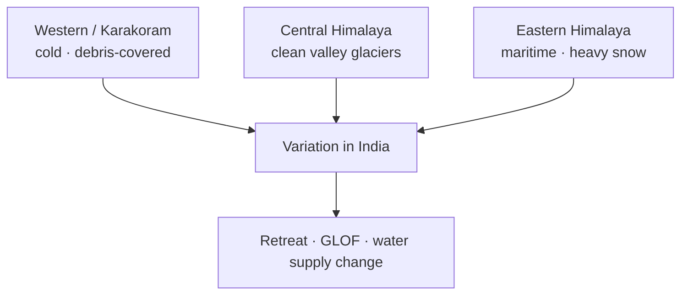

# Glaciers & Glacial Landforms in India

> GS-1 · Topic 11 · Glaciers in India, variations, erosional-depositional landforms

---

## PYQs

| Year | M | Words | Question (EN) | प्रश्न (HI) | ID |
|------|---|-------|---------------|-------------|-----|
| 2025 | 8 | 125 | Examine the variations in nature of glaciers in India. | भारत में हिमनदों की प्रकृति में विभिन्नताओं की समीक्षा कीजिये। | Q1 |
| 2020 | 12 | 200 | Describe the role of Glaciers in shaping the land-forms in high mountain areas. | उच्च पर्वतीय क्षेत्रों में स्थल-रूपों को आकार प्रदान करने में हिमनदों की भूमिका का वर्णन कीजिए। | Q2 |

---

## Quick Revision

```
GLACIER = Persistent body of dense ice on land — formed by accumulation > ablation (snow→firn→glacial ice)

TYPES BY MORPHOLOGY:
  Valley/Alpine — confined to mountain valleys (Himalaya)
  Continental ice sheet — not in India (Greenland/Antarctica analogue only)
  Piedmont — valley glaciers spill to plain (rare)
  Cirque glacier — small, headwall bowl
  Hanging glacier — tributary meets main valley higher (truncated spurs)

INDIA GLACIERS: Himalaya only — ~9,000-10,000+ (GSI/ICIMOD estimates vary)
  Western Himalaya (J&K, HP, Uttarakhand) > Eastern (Sikkim, Arunachal)
  Siachen (longest in Karakoram sector India) · Gangotri (Bhagirathi head) · Milam · Zemu (Sikkim)

VARIATIONS IN NATURE:
  Clean vs debris-covered (moraine mantle insulates — slows melt)
  Surge-type vs normal · maritime (warm-based, high melt) vs continental (cold-based, polar)
  Altitude, aspect (north-facing persist longer in NH) · precipitation regime (western snow vs eastern monsoon-influenced)

EROSIONAL LANDFORMS: Cirque · arête · horn (Matterhorn) · U-shaped valley · hanging valley · truncated spurs
  · roche moutonnée · striations · glacial polish · fiord (drowned U-valley — not India coast)

DEPOSITIONAL: Moraines (lateral, medial, terminal, ground) · drumlins (rare India) · eskers · kames · outwash plain · erratics · till plain

INDIA ZONES: Karakoram/Western Himalaya (cold, dry, debris-covered common) · Central Himalaya (Gangotri)
  · Eastern Himalaya (higher precipitation, maritime influence) · Ladakh cold desert glaciers

CONTEMPORARY: Glacial retreat (Gangotri ~m/yr) · GLOF risk (Chamoli 2021) · HKH climate change
  · NDMA guidelines · ISRO mapping · National Glacier Inventory

TRAPS: Glacier ≠ snowfield always | India has no ice sheets | Debris-covered melts slower at surface
  | All Himalaya glaciers retreating uniformly — spatial variation | Gangotri ≠ only glacier feeding Ganga system
  | Arête/horn need multiple cirques — cite Alpine/Himalayan examples
```

---

## Content

### Context — glaciers as land-based ice systems in India

A **glacier** is a persistent body of dense ice on land that forms when winter snowfall exceeds summer melt over many years, compressing snow through **firn** into polycrystalline glacial ice that flows downslope under gravity. Glaciers are not static ice blocks; they are dynamic systems in which accumulation at the head and ablation at the snout determine whether the glacier advances, retreats, or holds steady. India possesses no continental ice sheets comparable to Greenland or Antarctica; all glacial ice is confined to the Himalaya–Karakoram belt, where estimates from the Geological Survey of India, ICIMOD, and ISRO place the count at roughly nine thousand to ten thousand individual glaciers, though inventories differ by definition and resolution. These glaciers function as **water towers**, storing winter precipitation and releasing meltwater that feeds the Indus, Ganga, and Brahmaputra river systems on which more than 1.3 billion people downstream depend for irrigation, hydropower, and domestic supply. Climate change is accelerating glacial retreat across much of the Himalaya, raising concerns about altered melt timing, reduced base flow in late summer, and rising **Glacial Lake Outburst Flood (GLOF)** hazard.

### Types and variations in the nature of glaciers

Glaciers vary by morphology, thermal regime, surface character, and regional climate setting. No single description captures an "Indian glacier" because spatial heterogeneity across the western, central, and eastern Himalaya produces fundamentally different ice bodies with different melt dynamics and hazard profiles.

**Valley or alpine glaciers** are confined to mountain valleys and display classic tongue-shaped profiles. Gangotri on the Bhagirathi headwaters, Milam in Kumaon, and Pindari in Garhwal exemplify large valley glaciers that erode deep troughs and supply major rivers. **Cirque glaciers** occupy armchair-shaped depressions beneath headwalls at high elevation; they represent early stages of glacial development or residual ice patches. **Piedmont glaciers** form when valley glaciers spread onto plains at mountain fronts; they are rare in India because steep Himalayan topography offers limited piedmont space. **Hanging glaciers** are tributary glaciers whose termini sit above the floor of the main valley, often producing waterfalls at confluence and representing significant GLOF sources when ice or debris avalanches enter proglacial lakes.

Thermal regime distinguishes **cold-based (polar-type)** glaciers, frozen to the bed with minimal basal sliding and slower erosion, from **warm-based (temperate)** glaciers, where basal melting lubricates movement and erosion rates are higher. Lower Himalayan glaciers influenced by monsoon precipitation tend toward temperate behaviour, while Karakoram glaciers in a cold, arid setting often display cold-based characteristics. The **Karakoram anomaly** refers to glaciers in that range that remain stable or advance through **surge** behaviour—periodic rapid flow unrelated to simple climate response—contrasting with widespread retreat elsewhere.

Surface character creates another axis of variation. **Clean ice glaciers** expose blue ice directly to solar radiation and melt at the surface predictably, as at the Gangotri snout. **Debris-covered glaciers** carry a mantle of moraine that insulates the ice surface, slowing melt at the top while promoting subsurface melt, ice cliffs, and supraglacial ponds; debris cover is common in Ladakh and the Nanda Devi region. **Surge-type glaciers** in the Karakoram periodically accelerate without sustained climatic forcing, complicating simple retreat narratives.

| Type | Characteristics | India examples |
|------|-----------------|----------------|
| **Valley (Alpine) glacier** | Confined to valley; tongue-shaped; major erosional agent | Gangotri, Milam, Pindari |
| **Cirque glacier** | Small bowl at headwall; birthplace of valley glaciers | High Himalaya cirques |
| **Piedmont glacier** | Valley glacier spreads at mountain foot | Rare in India |
| **Hanging glacier** | Tributary glacier terminus above main valley floor | Common in steep Himalaya; GLOF source |

| Region | Nature | Distinctive features |
|--------|--------|----------------------|
| **Western Himalaya (J&K, HP, Uttarakhand)** | Large valley glaciers; Indus and Ganga headwaters | Siachen in Karakoram; Gangotri, Milam; mix of clean and debris-covered ice |
| **Ladakh/Karakoram** | Cold, arid climate; debris-covered common | High altitude; lower precipitation; surge glaciers |
| **Central Himalaya (Garhwal-Kumaon)** | Monsoon plus winter snow | Pindari, Kafni, Dokriani; well-documented retreat |
| **Eastern Himalaya (Sikkim, Arunachal)** | Maritime influence; heavy snowfall | Zemu glacier in Sikkim; among largest by area in some inventories |



### Glacial erosion — processes and landforms

Glaciers erode through **plucking (quarrying)**, in which freeze-thaw cycles loosen bedrock blocks that meltwater and ice then extract; **abrasion**, in which embedded rock fragments scour bedrock like sandpaper, producing striations and polish; and **frost shattering** in periglacial zones above glacier heads. The resulting landforms dominate high mountain topography.

A **cirque** is an armchair-shaped depression at the valley head where the glacier originates; steep amphitheatre walls surround a flat or concave floor. An **arête** is a sharp ridge formed when two adjacent cirques erode back-to-back. A **horn** is a pyramidal peak where three or more cirques converge—the Matterhorn in the Alps is the classic form, with Himalayan peaks showing analogous geometry. A **U-shaped valley** results when a glacier deepens and widens a formerly V-shaped river valley, producing a trough with steep sides and a broad floor visible throughout Himalayan river corridors. A **hanging valley** occurs when a tributary glacier erodes less deeply than the main valley glacier, leaving the tributary floor elevated and often producing waterfalls at the confluence after ice withdrawal. **Truncated spurs** are interlocking spurs sheared off by glacial erosion, straightening valley sides. A **roche moutonnée** is a bedrock knob smooth on the up-glacier side and plucked rough on the down-glacier side, indicating ice flow direction. **Striations and glacial polish** are fine scratch marks and smoothed surfaces on bedrock recording abrasive contact.

| Landform | Formation | Himalayan relevance |
|----------|-----------|---------------------|
| **Cirque** | Armchair depression at valley head from rotational erosion | Glacier birthplace; amphitheatre walls |
| **Arête** | Sharp ridge between adjacent cirques | High Himalayan ridges |
| **Horn** | Pyramidal peak from three or more cirques | Analogous to Matterhorn-type peaks |
| **U-shaped valley** | Glacier widens and deepens river valley | Defines major Himalayan troughs |
| **Hanging valley** | Tributary floor higher than main valley | Waterfalls at confluence post-glaciation |
| **Truncated spurs** | Interlocking spurs sheared by ice | Straightened valley sides |
| **Roche moutonnée** | Smooth up-glacier side; plucked down-glacier side | Indicates past ice flow direction |
| **Striations & polish** | Abrasion marks on bedrock | Evidence of glacial movement |

### Glacial deposition — landforms and hazard linkages

Glaciers deposit unsorted material called **till** in distinctive landforms. **Moraines** are ridges of till: **lateral moraines** along valley sides, **medial moraines** where tributary lateral moraines merge, **terminal moraines** at the snout marking maximum advance, and **ground moraines** beneath the ice. Beyond the terminal moraine, meltwater streams sort sediments into **outwash plains** of stratified sand and gravel. **Eskers** are sinuous ridges deposited by sub-glacial meltwater channels. **Kames** are irregular mounds formed at ice margins. **Drumlins** are elongated oval hills aligned with ice flow—common in former ice-sheet terrain but rare in the Himalaya. **Erratics** are boulders transported far from their source and dropped as ice melts.

In India, terminal and lateral moraines frequently **dam valleys**, creating proglacial lakes whose expansion raises GLOF risk. South Lhonak Lake in Sikkim and Chorabari near Kedarnath illustrate how moraine-dammed lakes become hazard points when ice avalanches or heavy rain triggers outburst. The October 2023 Sikkim GLOF damaged the Teesta III hydropower project, demonstrating how depositional landforms interact with infrastructure.

### Role of glaciers in shaping high mountain landforms — synthesis

Glaciers transform valley cross-profiles from V to U shape, determining modern river gradients, landslide zones, and settlement corridors in valleys such as Gangotri and Kedarnath. **Over-deepening** creates basins that fill with water after ice retreat, producing future lake sites and GLOF hazards. Moraine-supplied sediment feeds rivers and can temporarily dam channels. Post-glacial isostatic rebound is minor in the actively uplifting Himalaya compared with Pleistocene mid-latitude examples, but tectonic uplift continues to modify glacially sculpted terrain. Human pilgrimage and tourism routes follow these geomorphologically shaped valleys, which also channel flood and avalanche risk—the 2013 Kedarnath disaster combined heavy rain, moraine-dammed lake failure, and a geomorphologically constrained corridor. Even after glaciers shrink, the legacy landforms they carved—over-steepened valley walls, moraine-dammed lakes, and hanging valleys—continue to shape hazard maps because mass movement and outburst floods exploit topography that ice created over millennia.

### Important Indian glaciers — reference

| Glacier | State/Region | River system | Notes |
|---------|--------------|--------------|-------|
| **Siachen** | Ladakh/Karakoram | Nubra → Indus | Longest in Karakoram sector under Indian control |
| **Gangotri** | Uttarakhand | Bhagirathi → Ganga | Monitored retreat; major pilgrimage site |
| **Milam** | Uttarakhand (Kumaon) | Gori Ganga | Remote valley glacier |
| **Pindari** | Uttarakhand | Pindar river | Accessible trekking route; visible retreat |
| **Zemu** | Sikkim | Teesta | Largest by area in Eastern Himalaya in some inventories |
| **Kolahoi** | J&K | Lidder | Western Himalaya representative |

ISRO/NRSC, GSI, and ICIMOD publish snout positions, area change, and mass balance data that document retreat rates of metres per year at Gangotri and Dokriani while noting stable or advancing patches in parts of the Karakoram. Water supply from Himalayan glaciers follows a paradoxical trajectory: initial warming can increase melt and river flow temporarily, but sustained retreat eventually reduces the ice reservoir and diminishes late-summer base flow on which irrigation in the Indo-Gangetic plains partially depends. Hydropower projects on the Teesta, Bhagirathi, and Chenab rely on glacier-fed regimes whose long-term reliability climate models project as declining without deep emission cuts.

### Contemporary relevance

Gangotri glacier retreat of roughly several metres per year raises long-term concern for Ganga base flow, though immediate flooding from melt is not the primary issue—reduced late-summer supply is. The February 2021 Chamoli disaster involved a rock–ice avalanche rather than a classic GLOF but highlighted hazard in glacially conditioned terrain. The October 2023 Sikkim GLOF from South Lhonak Lake damaged downstream infrastructure. The National Mission on Sustaining Himalayan Ecosystem under India's climate action framework supports adaptation research. ISRO and ICIMOD maintain satellite-based glacier inventories that feed snout-position time series used in hydrological modelling. Paris Agreement commitments and net-zero targets address the long-term warming driver of retreat, though legacy landforms will persist for millennia after ice disappears. Early warning systems for GLOF, promoted under NDMA guidelines, depend on mapping moraine-dammed lakes that glacial deposition created.

### Limits and balanced view

Not all Himalayan glaciers are retreating uniformly: Karakoram surge glaciers and stable patches contradict a simple narrative of universal decline. Debris cover complicates melt assessment because surface appearance may seem intact while the snout retreats through calving and subsurface melt. Glacial landforms intermix with fluvial, mass-movement, and tectonic processes in an actively rising orogen, so not every U-shaped valley or polished knob should be attributed to glaciers alone without corroborating evidence. India has no ice sheets and no fiords—drowned U-valleys on coastlines are absent because post-glacial sea-level rise did not submerge Himalayan troughs. Glacier melt contributes to river flow but does not always cause immediate downstream flooding; hydrological effects unfold over seasonal and decadal timescales. GLOF triggers include moraine dam failure, ice avalanche into lakes, and heavy rainfall—not earthquakes alone. Monitoring snout position, lake volume, and slope stability together yields better hazard assessment than any single indicator.

---

## Answers

### Q1: Examine the variations in nature of glaciers in India. (2025, 8M, 125W)

**Introduction:**
> **Indian glaciers** exist **only in the Himalaya-Karakoram belt** — **varying in type, thermal regime, surface character, and regional climate setting**.

**Main Points:**
- **Valley vs Cirque vs Hanging** — **Gangotri (large valley)**, **cirque headwalls**, **hanging tributaries (GLOF prone)**.
- **Clean vs Debris-Covered** — **Gangotri clean ice** vs **Ladakh debris-mantle (insulated, slow surface melt)**.
- **Western vs Eastern Himalaya** — **Karakoram cold-arid** vs **Sikkim-Arunachal maritime-heavy snow (Zemu)**.
- **Thermal Regime** — **Cold-based Karakoram** vs **warm-based lower Himalayan temperate glaciers**.
- **Surge Glaciers** — **Karakoram anomaly** — **advance despite global retreat trend**.
- **Size Variation** — **Siachen, Gangotri, Milam, Zemu** — **length and area differ by ** **precipitation and aspect**.
- **Examination Verdict** — **No uniform "Indian glacier"** — **spatial heterogeneity** drives **different melt and hazard profiles**.

**Keywords (underline in exam):** Valley Glacier · Debris-Covered · Gangotri · Karakoram · Zemu · GLOF · Himalayan Glaciers

**Exam diagram (30 sec):**
```
West (debris, cold) | Central (clean valley) | East (maritime snow)
         ↓ variation in melt · retreat · hazard
```

**Conclusion:**
> **Variation demands region-specific monitoring** — **water security and GLOF planning cannot use ** **one-size policy**.

---

### Q2: Describe the role of Glaciers in shaping land-forms in high mountain areas. (2020, 12M, 200W)

**Introduction:**
> **Glaciers** are **powerful geomorphic agents** in **high mountains** — **eroding, transporting, and depositing** material to create **distinctive landform assemblages**.

**Main Points:**
- **Erosion — U-Shaped Valleys** — **Glacier deepens/widens river valleys** — **Himalayan trough form**.
- **Erosion — Cirque, Arête, Horn** — **Headwall amphitheatre, sharp ridges, pyramidal peaks**.
- **Erosion — Truncated Spurs & Hanging Valleys** — **Straight valley sides, waterfall confluences**.
- **Erosion — Roche Moutonnée & Striations** — **Directional bedrock sculpting**.
- **Deposition — Moraines** — **Lateral, medial, terminal** — **dam rivers, create lakes**.
- **Deposition — Outwash Plains & Eskers** — **Meltwater sorting beyond snout**.
- **Post-Glacial Legacy** — **Landforms control ** **modern hazards (GLOF lakes, Kedarnath corridor floods)**.
- **Water Towers** — **Melt feeds rivers** — **geomorphic + hydrological role integrated**.

**Keywords (underline in exam):** U-Shaped Valley · Cirque · Moraine · Arête · Plucking · Abrasion · Outwash Plain

**Exam diagram (30 sec):**
```
Glacier erosion: cirque · U-valley · arête
Glacier deposit: moraine · outwash
→ High mountain landscape
```

**Conclusion:**
> **Glacial geomorphology defines ** **Himalayan terrain and hazard geography** — **retreat modifies ** **processes but legacy landforms persist**.

---

### Q3: *Likely variant:* Discuss glacial retreat in Himalaya and its implications for India. (—, 12M, 200W)

**Introduction:**
> **Himalayan glaciers** are **retreating overall** (with **regional exceptions**) due to **warming** — **affecting water, hazards, and ecosystems**.

**Main Points:**
- **Retreat Evidence** — **Gangotri, Dokriani snout shrinkage** — **ISRO/ICIMOD data**.
- **Karakoram Anomaly** — **Some stable/surging** — **not uniform retreat**.
- **Water Supply** — **Initial melt increase then decline** — **Indus/Ganga base flow long-term risk**.
- **GLOF Risk** — **Proglacial lake expansion (South Lhonak 2023)** — **dam/infrastructure damage**.
- **Alpine Ecosystem** — **Vegetation line shift**, **species habitat change**.
- **Tourism/Pilgrimage** — **Snout access, sacred landscape change**.
- **Policy** — **NMSHE, NDMA GLOF guidelines, early warning systems**.
- **Climate Mitigation Link** — **Net-zero needed to slow ** **long-term loss**.

**Keywords (underline in exam):** Glacial Retreat · GLOF · Gangotri · HKH · Climate Change · Water Towers

**Exam diagram (30 sec):**
```
Warming → retreat ↑ → meltwater change + GLOF risk ↑
```

**Conclusion:**
> **Himalayan glacier change is ** **national water-security issue** — **adaptation and global mitigation ** **both required**.

---

## Traps

| Wrong | Correct |
|-------|---------|
| Glaciers exist in Western Ghats | **Himalaya-Karakoram only** in India |
| India has continental ice sheets | **Valley/cirque type only** |
| All glaciers retreating equally | **Karakoram surge/stable patches** |
| Debris-covered melts faster always | **Insulates surface** — **complex melt dynamics** |
| Gangotri = only glacier in India | **Thousands** — **Zemu, Siachen, Milam, Pindari** |
| Fiords common on Indian coast | **Drowned U-valleys** — **Norway/ Chile analogues**, **not Indian coast feature** |
| Glacial landforms = only erosion | **Moraines, outwash = major depositional role** |
| GLOF = only earthquake cause | **Lake dam failure, avalanche into lake** — **multiple triggers |
| Zemu in Arunachal | **Sikkim (Eastern Himalaya)** |
| Glacier melt = immediate Ganga flood always | **Base flow contribution** — **long-term hydrology issue** |

---

*Complete.*
