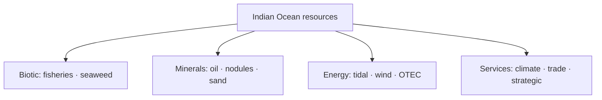

# Oceanic Resources of India & EEZ

> GS-1 · Topic 12 · Ocean resources, uses, energy, ecological problems (Indian Ocean)

---

## PYQs

| Year | M | Words | Question (EN) | प्रश्न (HI) | ID |
|------|---|-------|---------------|-------------|-----|
| 2024 | 8 | 125 | What is the use of oceans for humans? | मनुष्यों के लिए महासागरों का क्या उपयोग है? | Q1 |
| 2023 | 8 | — | 'Oceans are the store-house of resources.' — Write a short note. | 'महासागर संसाधनों का भंडार है।' — संक्षिप्त टिप्पणी लिखिए। | Q2 |
| 2020 | 12 | 200 | Highlight the various ecological problems associated with the exploitation and utilization of resources from the Indian Ocean. | हिंद महासागर के संसाधनों के शोषण और उपयोग से जुड़ी विभिन्न पारिस्थितिकीय समस्याओं पर प्रकाश डालiye। | Q3 |
| 2019 | 12 | 200 | Critically examine the oceanic energy resources and their potentialities on the coast zone of India. | महासागरों में ऊर्जा संसाधन तथा भारत तटीय क्षेत्र में उनकी सम्भावनाओं की समीक्षात्मक व्याख्या कीजिए। | Q4 |

---

## Quick Revision

```
INDIA & INDIAN OCEAN: 7,500+ km coastline · 9 coastal states + UT · 2.4 mn km² EEZ (≈ mainland area)
  · islands: Andaman-Nicobar · Lakshadweep · strategic IOR position

OCEAN USES FOR HUMANS (2024):
  Food (fisheries) · transport/shipping · trade (90%+ global by sea)
  · minerals (offshore oil, polymetallic nodules) · energy ( tidal, wave, OTEC, offshore wind)
  · climate regulation · recreation/tourism · strategic/naval · desalination · carbon sink

RESOURCE STOREHOUSE (2023):
  Biotic: fish, seaweed, mangroves, corals, marine mammals
  Abiotic: oil-gas, sand, tin, gold, manganese nodules, sulphides, salt, freshwater (desal)
  Renewable energy: tidal (Gulf of Kachchh, Gulf of Khambhat) · wave · offshore wind (TN, Gujarat)

OCEANIC ENERGY (2019):
  Offshore oil-gas: Mumbai High · KG Basin · Assam · Rajasthan coast
  Tidal: Gulf of Khambhat highest potential · SWAYAM PRABHA tidal · GIB tidal policy
  Wave, OTEC (Lakshadweep/Kerala concept) · offshore wind (National Offshore Wind Policy 2015)
  Blue economy · Sagarmala

ECOLOGICAL PROBLEMS (2020):
  Overfishing · bottom trawling · pollution (plastic, oil spills — MV Wakashio analogue)
  · coral bleaching · mangrove loss · dredging · port construction · acoustic pollution
  · climate change (SST rise, acidification) · invasive species · deep-sea mining risk

INSTITUTIONS: UNCLOS 1982 · INCOIS · MoEFCC CRZ · National Fisheries Policy · Deep Ocean Mission

TRAPS: EEZ ≠ territorial sea only | Indian Ocean ≠ only BoB+Arabian Sea (includes southern IOR)
  | Energy potential ≠ fully exploited | Blue economy ≠ only fishing | All ocean energy green ≠ true (offshore oil)
```

---

## Content

### Context — India and the Indian Ocean resource domain

India's relationship with the ocean is defined by a coastline of approximately 7,516 kilometres spanning nine coastal states and union territories, more than four thousand fishing villages, and an **Exclusive Economic Zone (EEZ)** of roughly 2.4 million square kilometres—nearly equal to the country's land area. The **Indian Ocean Region** sits at the crossroads of trade routes through the Strait of Malacca and the Strait of Hormuz, hosts monsoon-driven climate systems, and contains biodiversity hotspots from coral atolls to mangrove deltas. Under the **United Nations Convention on the Law of the Sea (1982)**, India exercises sovereign rights to explore and exploit living and non-living resources within the EEZ extending to 200 nautical miles, while the territorial sea extends to 12 nautical miles and the contiguous zone to 24 nautical miles for limited enforcement purposes. Sovereign rights over resources do not equate to full sovereignty over the water column beyond the territorial sea; freedom of navigation for other states continues. Policy frameworks including the Blue Economy vision, Sagarmala port-led development, Deep Ocean Mission launched in 2021, and the Pradhan Mantri Matsya Sampada Yojana for fisheries translate this legal resource base into economic strategy.

### Oceans as storehouse of resources

Oceans contain biotic and abiotic resources distributed across the water column, seabed, and sub-seafloor. **Biotic resources** include finfish, crustaceans, molluscs, seaweed, plankton, and the genetic diversity of marine organisms. India harvests hilsa, mackerel, tuna, and shrimp for domestic consumption and export. **Offshore minerals** include oil, natural gas, construction sand, and **heavy mineral sands** such as monazite, ilmenite, rutile, and zircon along the Kerala and Tamil Nadu coasts processed by IREL. **Deep-sea minerals** lie on abyssal plains and mid-ocean ridges: **polymetallic nodules** rich in manganese, nickel, and cobalt occur in the Central Indian Ocean Basin, where India holds pioneer investor status since 1987; hydrothermal sulphide deposits represent a future frontier. **Renewable ocean energy** includes tidal, wave, ocean thermal energy conversion, and offshore wind. **Desalination** extracts freshwater from seawater for coastal cities such as Chennai and parts of Gujarat. **Ecosystem services**—carbon sequestration by phytoplankton and blue carbon habitats, oxygen production, and climate regulation through ocean heat storage—are resources in the functional sense even when they are not extracted as commodities.

| Category | Resources | Indian examples |
|----------|-----------|-----------------|
| **Biotic** | Fish, crustaceans, seaweed, plankton | Hilsa, mackerel, tuna, shrimp exports |
| **Mineral — offshore** | Oil, natural gas, sand, heavy minerals | Mumbai High, KG Basin, monazite on Kerala/TN coast |
| **Deep-sea minerals** | Polymetallic nodules, hydrothermal sulphides | Central Indian Ocean Basin; India pioneer investor since 1987 |
| **Energy — renewable** | Tidal, wave, OTEC, offshore wind | Gulf of Khambhat tidal potential; Gujarat/TN offshore wind |
| **Water** | Desalination | Chennai, Gujarat coastal plants |
| **Ecosystem services** | Carbon sequestration, oxygen, climate regulation | Phytoplankton; mangrove and seagrass blue carbon |

### Uses of oceans for humans

Oceans serve economic, strategic, scientific, and cultural functions that intersect in coastal India. **Fisheries and aquaculture** provide protein and livelihood to approximately sixteen million fishers and contribute export earnings, particularly from shrimp. **Shipping and trade** move roughly ninety-five percent of India's trade by volume through major ports including Mumbai, Jawaharlal Nehru Port Trust, Chennai, Visakhapatnam, and Kochi. **Offshore hydrocarbons** from ONGC and private operators in the Krishna–Godavari Basin support energy security. **Tourism and recreation** along Goa, Andaman, and Lakshadweep coasts generate revenue from beaches and diving. **Desalination** supplies freshwater where rivers and groundwater are insufficient.

Strategic uses include naval presence for Indian Ocean Region security, anti-piracy patrols in the Gulf of Aden, and maritime domain awareness. Scientific uses encompass ocean research at INCOIS for tsunami early warning, NIOT for technology development, Deep Ocean Mission for manned submersible Samudrayaan, and biodiversity baseline surveys. Oceans regulate climate as a heat sink and as the driver of monsoon circulation through sea surface temperature patterns. Coastal communities maintain cultural identity through fishing festivals and maritime heritage tied to the sea. The storehouse metaphor captures abundance but obscures stewardship: living resources require harvest limits, mineral extraction demands environmental baseline studies, and ecosystem services fail if pollution and warming continue unchecked. India's island territories of Andaman–Nicobar and Lakshadweep extend sovereign resource rights deep into the Indian Ocean, placing India among the largest littoral states in the region and amplifying both opportunity and enforcement responsibility across a shared ocean used by many nations.



### Oceanic energy resources — coastal India

India's coastal zone hosts diverse energy resources at different stages of exploitation. **Offshore oil and natural gas** are the most developed. Mumbai High, discovered in 1974 in the Arabian Sea, historically supplied roughly fifteen percent of domestic oil production and remains iconic of offshore capability. The Krishna–Godavari Basin, including the D6 block operated by Reliance, supplies major natural gas volumes. Additional potential exists in the Assam–Arakan fold belt, Cauvery basin, and Rajasthan offshore linkages, though many fields are maturing and deep-water exploration carries higher cost and environmental risk.

**Tidal energy** exploits the vertical range between high and low tide. The Gulf of Khambhat in Gujarat offers India's highest tidal range at approximately eight to eleven metres, suitable for barrage or tidal-stream turbines; the Gulf of Kachchh and Sundarbans offer moderate potential. Pilot trials and policy support under the National Electricity Plan exist, but India lacks commercial-scale tidal plants comparable to France's La Rance or the UK's Severn proposals.

**Wave energy** harnesses surface swell along the west coast from Kerala through Karnataka and Goa. NIOT has operated pilot devices off Vizhinjam, but commercial scaling has not occurred because technology remains immature relative to offshore wind and solar.

**Ocean Thermal Energy Conversion (OTEC)** uses the temperature difference between warm surface water and cold deep water, requiring at least roughly twenty degrees Celsius difference available in tropical latitudes at Lakshadweep and off Kerala. NIOT's experimental plant at Kavaratti demonstrates feasibility but high capital cost blocks deployment.

**Offshore wind** is governed by the National Offshore Wind Energy Policy of 2015, with MNRE assessments suggesting on the order of seventy gigawatts of potential off Gujarat and Tamil Nadu. Sites in the Gulf of Khambhat and Ramanathapuram district are under survey and auction through SECI, but costs exceed onshore wind and grid connectivity from sea to shore remains a bottleneck.

Critical assessment reveals high aggregate potential but uneven realization: hydrocarbons dominate today's ocean energy supply; tidal, wave, and OTEC remain largely pre-commercial; offshore wind is emerging; environmental impact assessments, fishing community conflict, high capital expenditure, and technology import dependence constrain rapid expansion.

| Energy type | Maturity in India | Key sites | Critical constraint |
|-------------|-------------------|-----------|---------------------|
| **Offshore oil/gas** | Commercial production | Mumbai High, KG Basin | Declining fields; deep-water cost; spill risk |
| **Tidal** | Pilot/pre-commercial | Gulf of Khambhat, Kachchh | High capital; environmental impact of barrages |
| **Wave** | Experimental | Kerala (Vizhinjam pilot) | Technology immaturity |
| **OTEC** | Demonstration | Kavaratti (Lakshadweep) | Cost; deep cold-water pipe |
| **Offshore wind** | Emerging policy/auctions | Gujarat, Tamil Nadu | Grid connection; capital cost |

### Ecological problems of Indian Ocean resource exploitation

Exploiting ocean resources generates ecological costs that threaten the productivity on which exploitation itself depends. **Overfishing and bycatch** from trawlers and illegal, unreported, and unregulated fishing deplete stocks—Bay of Bengal hilsa decline and juvenile catch are documented concerns. **Bottom trawling** destroys benthic habitat and provokes conflict between industrial trawlers and artisanal fishers in Tamil Nadu and Kerala. **Plastic pollution** from land-based waste and microplastics contaminates Mumbai and Chennai beaches and accumulates in open-ocean gyres. **Oil and chemical spills** from shipping and offshore platforms—exemplified by the Ennore port incident of 2017—poison marine life and coastlines.

| Problem | Cause | Indian Ocean / India example |
|---------|-------|-------------------------------|
| **Overfishing & bycatch** | Trawlers, IUU fishing | Bay of Bengal hilsa decline; juvenile catch |
| **Bottom trawling damage** | Benthic habitat destruction | Tamil Nadu, Kerala artisanal–industrial conflict |
| **Plastic pollution** | Land-based waste, microplastics | Mumbai, Chennai beaches; ocean gyres |
| **Oil & chemical spills** | Shipping, offshore platforms | Ennore 2017 port incident |
| **Port/dredging** | Sagarmala, harbour expansion | Sediment plumes; mangrove and breeding ground loss |
| **Coral bleaching** | SST rise, pollution | Gulf of Mannar, Lakshadweep, Andaman |
| **Mangrove destruction** | Shrimp farms, tourism, ports | East coast wetland reclamation |
| **Acoustic pollution** | Sonar, shipping | Marine mammal stranding concerns |
| **Ocean acidification** | CO₂ absorption | Shellfish and coral calcification stress |
| **Deep-sea mining risk** | Nodule extraction planned | Central Indian Ocean biodiversity unknowns |
| **Climate change** | SLR, cyclone intensity | Sundarbans, Lakshadweep inundation risk |

**Port expansion and dredging** under Sagarmala creates sediment plumes, destroys fish breeding grounds, and removes mangroves. **Coral bleaching** from rising sea surface temperature and pollution affects Gulf of Mannar, Lakshadweep, and Andaman reefs. **Mangrove destruction** for shrimp farms, tourism infrastructure, and port reclamation reduces nursery habitat on the east coast. **Acoustic pollution** from sonar and shipping raises marine mammal stranding concerns. **Ocean acidification** from CO₂ absorption stresses shellfish and coral calcification. **Deep-sea mining** of polymetallic nodules, planned under Deep Ocean Mission, poses unknown biodiversity impacts in the Central Indian Ocean. **Climate change** drives sea-level rise threatening Sundarbans and Lakshadweep, and intensifies cyclones hitting coastal ecosystems.

Governance responses include Coastal Regulation Zone notification 2019, fisheries management plans, marine protected areas, Plastic Waste Management Rules, and Deep Ocean Mission environmental baseline studies before mining proceeds. The principle of sustainable yield applies as much to oceans as to forests: extraction without regeneration converts a storehouse into a depleted warehouse, as collapsed cod fisheries in the North Atlantic and localized hilsa declines in the Bay of Bengal demonstrate. Integrated management therefore pairs PMMSY livelihood support with stock assessment, vessel monitoring, and pollution control rather than treating economic use and ecological protection as opposing goals.

### Contemporary relevance

Deep Ocean Mission, budgeted at over ₹4,000 crore, targets manned submersible capability through Samudrayaan, polymetallic nodule mining technology, and deep-ocean biodiversity inventory. Blue Economy 2.0 under the Ministry of Earth Sciences integrates fisheries, minerals, renewable energy, and tourism. Sagarmala modernizes ports but requires balancing with coastal ecology. India–Norway and broader Indian Ocean Region partnerships address sustainable fishing and maritime security. Global Plastic Treaty negotiations involve India's position on marine litter. Offshore wind auctions through SECI mark transition from policy to project pipeline.

### Limits and balanced view

Resource potential is not unlimited: fish stocks collapse under sustained overextraction, as global examples demonstrate. Renewable ocean energy requires grid integration and scale before it replaces hydrocarbons. Blue economy must mean sustainable blue economy because ecological degradation undermines long-term returns—the 2020 ecological problems theme remains valid. EEZ boundaries with neighbours have been settled in various cases with Pakistan, Bangladesh, and Myanmar, but enforcement against IUU fishing and dispute over fishing rights near Kachchativu with Sri Lanka continue. Offshore wind is not yet operational at gigawatt scale despite policy announcements. Not all ocean energy is green: offshore oil and gas remain fossil sources. OTEC requires tropical temperature gradients and is not viable everywhere along India's coast.

---

## Answers

### Q1: What is the use of oceans for humans? (2024, 8M, 125W)

**Introduction:**
> **Oceans** cover **~71% of Earth** — for **humans they provide food, energy, transport, climate stability, and strategic space** — **India's 7,500 km coast makes these uses vital**.

**Main Characteristics:**
- **Food & Livelihood** — **Fisheries, aquaculture, seaweed** — **millions of coastal fishers**.
- **Trade & Transport** — **~95% global trade by sea** — **Indian ports (Mumbai, JNPT, Chennai)**.
- **Energy** — **Offshore oil-gas (Mumbai High, KG Basin), tidal, offshore wind potential**.
- **Minerals** — **Sand, heavy minerals, deep-sea polymetallic nodules**.
- **Climate Regulation** — **Carbon sink, monsoon driver, oxygen production (phytoplankton)**.
- **Tourism & Culture** — **Coastal recreation, maritime heritage**.
- **Strategic & Scientific** — **Naval security, INCOIS research, Deep Ocean Mission**.

**Keywords (underline in exam):** Fisheries · EEZ · Shipping · Offshore Oil · Blue Economy · Climate Regulation

**Exam diagram (30 sec):**
```
Ocean → food · trade · energy · minerals · climate · security
```

**Conclusion:**
> **Oceans are ** **multifunctional life-support and economic systems** — **sustainable use defines India's blue future**.

---

### Q2: 'Oceans are the store-house of resources.' — Write a short note. (2023, 8M)

**Introduction:**
> **Oceans** contain **vast biotic and abiotic resources** — **food, minerals, energy, and ecosystem services** — **justifying the storehouse metaphor**.

**Main Points:**
- **Biotic Resources** — **Fish, crustaceans, marine algae, genetic biodiversity**.
- **Hydrocarbons** — **Offshore oil and natural gas (Mumbai High, KG Basin)**.
- **Minerals** — **Polymetallic nodules (Mn, Ni, Co), heavy mineral sands, salt**.
- **Renewable Ocean Energy** — **Tidal (Gulf of Khambhat), wave, OTEC, offshore wind**.
- **Ecosystem Services** — **Climate regulation, carbon sequestration, coastal protection**.
- **Freshwater** — **Desalination potential for coastal cities**.
- **Caution** — **Storehouse ≠ inexhaustible** — **overexploitation causes ecological collapse**.

**Keywords (underline in exam):** Biotic Resources · Polymetallic Nodules · EEZ · Offshore Hydrocarbons · Tidal Energy · Blue Economy

**Exam diagram (30 sec):**
```
Ocean storehouse:
Biotic | Minerals | Energy | Services
(use sustainably)
```

**Conclusion:**
> **Oceans hold ** **immense resource wealth** — **India's EEZ access demands ** **science-based sustainable extraction**.

---

### Q3: Highlight ecological problems associated with exploitation of Indian Ocean resources. (2020, 12M, 200W)

**Introduction:**
> **Exploitation of Indian Ocean resources** — **fisheries, hydrocarbons, ports, mining** — **generates serious ecological problems** threatening **marine biodiversity and coastal communities**.

**Main Points:**
- **Overfishing & Trawling** — **Stock depletion, bycatch, benthic habitat damage (BoB, Arabian Sea)**.
- **Pollution** — **Plastic microplastics, oil spills (ports), industrial effluents (Ennore-type incidents)**.
- **Coastal Habitat Loss** — **Mangrove and wetland reclamation for ports/shrimp farms**.
- **Coral Degradation** — **Bleaching, sedimentation, destructive fishing (Gulf of Mannar, Lakshadweep)**.
- **Dredging & Port Expansion** — **Sagarmala — turbidity, fish breeding ground loss**.
- **Climate Impacts** — **Sea-level rise, acidification, cyclone intensity on coastal ecosystems**.
- **Deep-Sea Mining Risk** — **Central Indian Ocean nodules — unknown biodiversity impact**.
- **Mitigation Need** — **CRZ, MPAs, fisheries regulation, Deep Ocean Mission baseline studies**.

**Keywords (underline in exam):** Overfishing · Marine Pollution · Coral Bleaching · Mangrove Loss · CRZ · Ocean Acidification

**Exam diagram (30 sec):**
```
Exploitation → overfish · pollute · habitat loss · climate stress
            → need MPAs · CRZ · sustainable blue economy
```

**Conclusion:**
> **Without ecological safeguards**, **short-term resource gains ** **destroy long-term ocean productivity** — **sustainable blue economy imperative**.

---

### Q4: Critically examine oceanic energy resources and their potentialities on India's coast. (2019, 12M, 200W)

**Introduction:**
> **India's coastal zone** hosts **diverse ocean energy resources** — **offshore hydrocarbons (developed), tidal, wave, OTEC, and offshore wind (emerging)** — **potential high but realization uneven**.

**Main Points:**
- **Offshore Oil-Gas — Proven** — **Mumbai High, KG Basin** — **substantial supply but ** **declining fields, deep-water cost**.
- **Tidal Energy — High Potential** — **Gulf of Khambhat/Kachchh** — **limited commercial deployment yet**.
- **Wave Energy — Experimental** — **NIOT pilots (Kerala)** — **technology not scaled**.
- **OTEC — Demonstration** — **Lakshadweep (Kavaratti)** — **tropical suitability, cost barrier**.
- **Offshore Wind — Emerging** — **Gujarat, Tamil Nadu** — **Policy 2015, GW potential, high capital/grid cost**.
- **Critical Limits** — **Environmental impact assessments, fishing conflict, high CAPEX, technology imports**.
- **Policy Enablers** — **National Electricity Plan, green hydrogen linkage, PLI for offshore wind supply chain**.
- **Balanced Verdict** — **Hydrocarbons dominate today**; **renewables critical for ** **long-term blue energy transition**.

**Keywords (underline in exam):** Mumbai High · KG Basin · Tidal Energy · OTEC · Offshore Wind · Gulf of Khambhat · Blue Economy

**Exam diagram (30 sec):**
```
Coastal energy: Oil/Gas (mature) | Tidal/Wave/OTEC/Wind (emerging)
Challenges: cost · environment · grid
```

**Conclusion:**
> **India's ocean energy future** lies in **scaling renewables while ** **managing offshore hydrocarbon decline responsibly**.

---

### Q5: *Likely variant:* Explain India's Exclusive Economic Zone (EEZ) and its resource significance. (—, 8M, 125W)

**Introduction:**
> **EEZ (200 nm under UNCLOS)** gives India **sovereign rights to explore and exploit ** **living and non-living resources** in **~2.4 million km²**.

**Main Characteristics:**
- **Legal Basis** — **UNCLOS 1982** — **not full sovereignty over waters**.
- **Resource Rights** — **Fisheries, oil-gas, minerals, wind energy**.
- **Andaman-Nicobar & Lakshadweep** — **Expand EEZ reach into strategic IOR**.
- **Deep-sea Mining** — **Pioneer investor status in Central Indian Ocean**.
- **Security** — **Naval patrol, anti-piracy, maritime domain awareness**.
- **Challenges** — **IUU fishing, enforcement capacity, ecological sustainability**.

**Keywords (underline in exam):** EEZ · UNCLOS · Sovereign Rights · Deep Ocean Mission · IOR

**Exam diagram (30 sec):**
```
Territorial sea 12nm → EEZ 200nm → resource rights (fish · oil · nodules)
```

**Conclusion:**
> **EEZ is ** **foundation of India's blue economy aspirations** — **requires sustainable governance**.

---

## Traps

| Wrong | Correct |
|-------|---------|
| EEZ = full sovereignty over sea | **Sovereign rights over resources** — **freedom of navigation continues** |
| Ocean energy = only tidal | **Oil-gas dominant; tidal, wind, OTEC, wave all relevant** |
| Indian Ocean = only India's waters | **Shared ocean** — **India largest littoral state in IOR** |
| Oceans inexhaustible | **Overfishing, pollution prove limits** |
| Offshore wind fully operational at scale | **Mostly policy/pilot stage in India** |
| Blue economy = only fisheries | **Minerals, energy, tourism, shipping included** |
| Ecological problems only global | **Ennore spill, trawling conflicts, coral bleaching local** |
| Deep-sea mining already commercial India | **Deep Ocean Mission — R&D and environmental study phase** |
| Mumbai High onshore | **Offshore Arabian Sea** |
| OTEC anywhere in India | **Needs tropical ** **≥20°C surface-deep gradient (Lakshadweep/Kerala best)** |

---

*Complete.*
