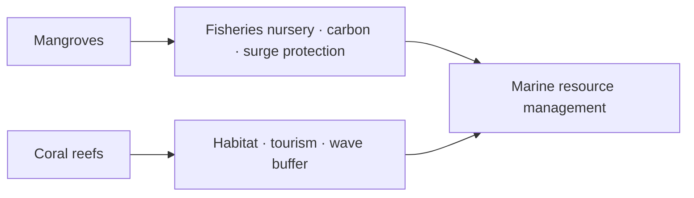

# Mangroves, Coral Reefs & Continental Shelf

> GS-1 · Topic 12 · Marine ecosystems, continental shelf minerals & energy (India)

---

## PYQs

| Year | M | Words | Question (EN) | प्रश्न (HI) | ID |
|------|---|-------|---------------|-------------|-----|
| 2025 | 8 | 125 | How do India's mangroves and coral reefs contribute to marine resource management? | भारत में मैंग्रोव और प्रवाल भित्ति समुद्री संसाधन प्रबन्धन में किस प्रकार योगदान प्रदान करते हैं? | Q1 |
| 2025 | 12 | 200 | "India's continental shelf is a store house of mineral and energy resources". Critically examine this statement with suitable examples. | "भारत का महाद्वीपीय तट खनिज और ऊर्जा का भण्डार है"। उपयुक्त उदाहरणों के साथ इस कथन का आलोचनात्मक परीक्षण कीजिये। | Q2 |

---

## Quick Revision

```
MANGROVES INDIA: ~4,975 km² (ISFR 2023 mangrove cover) · Sundarbans (largest) · Bhitarkanika · Pichavaram
  · Gulf of Kachchh · Andaman · Maharashtra creeks

CORAL REEFS: Gulf of Mannar · Lakshadweep atolls · Andaman-Nicobar · Gulf of Kachchh (patchy)
  · 4 coral reef areas — all on east/west tropical coasts & islands

MARINE RESOURCE MANAGEMENT ROLES:
  Mangroves: nursery grounds · fisheries · blue carbon · storm surge buffer · sediment trap
  · water quality · livelihood (honey, crab, wood sustainably)

  Corals: fish habitat · biodiversity hotspot · tourism/diving · coastal protection (wave energy)
  · indicator of marine health · pharmaceutical genetic resources

CONTINENTAL SHELF: Gentle slope to ~200m (edge of shelf → continental slope)
  India: wide on west (Arabian Sea) · broad on east (BoB) · hydrocarbon basins on shelf-slope

SHELF RESOURCES:
  Oil-gas: Mumbai High · KG · Cauvery · Bombay High basin · Assam shelf
  Heavy minerals: ilmenite, rutile, monazite, zircon (Kerala, TN, Odisha coast)
  Sand, limestone, placer deposits · fishing grounds (upwelling at shelf break)

CRITICAL LIMITS: Not all shelf equally mineral-rich · deep water tech needed · environmental cost
  · coral/mangrove destruction for ports · overfishing on shelf · climate SLR

LAWS: CRZ 2019 · WPA · Mangrove protection in RF · Marine NP (Gulf of Mannar, Mahatma Gandhi MP)
```

---

## Content

### Context — marine ecosystems and the continental shelf

**Marine resource management** means using living and non-living ocean resources in ways that maintain the ecosystem functions—nursery habitat, coastal protection, nutrient cycling, carbon storage—on which those resources depend. Mangroves and coral reefs are not ornamental additions to coastal geography; they are functional infrastructure that sustains fisheries, buffers storms, filters water, and supports biodiversity. The **continental shelf** is the gently sloping submerged extension of the continent from the shoreline to roughly 200 metres depth, where the slope steepens at the shelf break toward the continental slope; under UNCLOS, shelf edge definition can extend up to 350 nautical miles in geologically justified cases. India's wide western shelf in the Arabian Sea and broad eastern shelf in the Bay of Bengal, plus shelves around the Andaman–Nicobar and Lakshadweep islands, host fisheries, hydrocarbon basins, and placer mineral deposits. Both ecosystems and shelf resources face pressure from coastal development, climate change, and extraction industries, making integrated management rather than sector-by-sector exploitation the sustainable path.

### Mangroves in India — distribution and ecological character

Mangroves are salt-tolerant forest ecosystems rooted in intertidal mudflats where freshwater and seawater mix. India supports approximately 4,975 square kilometres of mangrove cover according to the India State of Forest Report 2023, with net increase in some states offset by losses to aquaculture, port reclamation, and urban expansion in others.

The **Sundarbans** in West Bengal form the largest contiguous mangrove forest in the world, harbour the Royal Bengal tiger, and hold UNESCO World Heritage status. **Bhitarkanika** in Odisha supports dense mangrove blocks and one of India's largest saltwater crocodile populations. **Pichavaram** in Tamil Nadu features backwater mangroves popular for tourism. The **Gulf of Kachchh** in Gujarat sustains arid-zone mangroves within a marine national park. **Andaman and Nicobar** islands retain relatively pristine mangrove–coral mosaics. **Mumbai creeks and Goa** face intense urban and reclamation pressure. Mangrove roots trap sediment, stabilize coastlines, and create sheltered nursery habitat for fish, prawns, and crabs. National mangrove cover estimates from ISFR 2023 near 4,975 square kilometres reflect modest net gains in some states alongside continued losses where aquaculture and port expansion encroach on intertidal forest.

| Site | State/UT | Significance |
|------|----------|--------------|
| **Sundarbans** | West Bengal | Largest mangrove forest globally; Royal Bengal tiger; UNESCO World Heritage |
| **Bhitarkanika** | Odisha | Saltwater crocodile; dense mangrove blocks |
| **Pichavaram** | Tamil Nadu | Backwater mangroves; tourism |
| **Gulf of Kachchh** | Gujarat | Arid-zone mangroves; marine national park |
| **Andaman & Nicobar** | UT | Pristine mangrove–coral mosaic |
| **Mumbai creeks, Goa** | Maharashtra, Goa | Urban pressure; reclamation threats |

### Coral reefs in India — distribution and threats

Coral reefs are calcium carbonate structures built by colonial polyps in clear, warm, shallow water. India possesses four major reef regions, all on tropical coasts or islands.

The **Gulf of Mannar** between Tamil Nadu and Sri Lanka contains fringing reefs around twenty-one islands within a marine national park. **Lakshadweep** in the Arabian Sea forms true atolls with ring reefs enclosing lagoons on low-lying islands highly vulnerable to sea-level rise. **Andaman and Nicobar** in the Bay of Bengal support fringing reefs with high biodiversity that recovered substantially after the 2004 tsunami. The **Gulf of Kachchh** hosts patchy reefs tolerant of extreme salinity and temperature fluctuation.

Reefs face **bleaching** during anomalously warm sea surface temperatures, documented in 1998, 2010, and 2016 events, with renewed stress reported in 2024 for Lakshadweep. Additional threats include sedimentation from coastal construction, pollution, destructive fishing, anchor damage from tourism, and long-term climate change. Recovery after bleaching depends on water quality and fishing pressure; reefs adjacent to protected mangrove systems often show faster community resilience because sediment loads remain lower and juvenile fish recruitment continues from nearby nurseries.

| Reef system | Location | Features |
|-------------|----------|----------|
| **Gulf of Mannar** | TN–Sri Lanka gap | Fringing reefs; marine NP; 21 islands |
| **Lakshadweep** | Arabian Sea atolls | Ring reefs; lagoons; climate vulnerability |
| **Andaman & Nicobar** | Bay of Bengal | Fringing reefs; high biodiversity; post-2004 recovery |
| **Gulf of Kachchh** | Gujarat | Patchy reefs; extreme salinity/temperature tolerance |

### Contribution to marine resource management

Mangroves contribute to resource management in seven interconnected ways. First, they serve as **fisheries nurseries** where juvenile fish, prawns, and crabs grow before migrating to open waters, so sustainable catch depends on mangrove health in Sundarbans and Bhitarkanika creeks. Second, they store **blue carbon** in biomass and sediments, linking conservation to climate mitigation and emerging carbon credit frameworks. Third, they provide **coastal protection** by reducing cyclone and storm surge energy—the Sundarbans buffer during events such as Cyclone Amphan in 2020, protecting ports, aquaculture ponds, and settlements landward. Fourth, they **filter water quality** by trapping sediments and absorbing nutrients, protecting downstream seagrass and coral. Fifth, they **stabilize sediment** and reduce erosion, maintaining navigable channels. Sixth, they support **livelihood management** through sustainable non-timber products such as honey and crab harvest under community governance. Seventh, they maintain a **biodiversity reservoir** that buffers fisheries against collapse.

Coral reefs contribute parallel functions. They provide **fish habitat and productivity**—more than twenty-five percent of marine species associate with reefs—supporting food security. They are **biodiversity hotspots** prioritized through marine protected areas as insurance against ecosystem collapse. They **dissipate wave energy**, acting as natural breakwaters that reduce shore erosion and infrastructure cost. **Managed tourism**—diving in Andaman and Lakshadweep—generates revenue as an alternative to destructive extraction. **Bio-prospecting** explores pharmaceutical potential from marine genetic resources. Reefs serve as **monitoring sentinels**: bleaching signals sea surface temperature stress, pollution, or overfishing before fisheries collapse. They support **research and education** that underpins conservation policy. Together, mangroves and reefs form a linked coastal system: mangrove-filtered water and sediment stability protect downstream reefs, while healthy reefs support fish stocks that use mangrove nurseries during juvenile stages. Degrading one subsystem undermines management outcomes in the other, which is why integrated coastal zone planning treats both as co-equal infrastructure rather than competing conservation priorities.

| Ecosystem function | Mangroves | Coral reefs |
|--------------------|-----------|-------------|
| **Fisheries support** | Nursery for juveniles in creeks | Adult habitat; species diversity |
| **Coastal protection** | Storm surge and cyclone buffer | Wave energy dissipation |
| **Climate role** | Blue carbon storage | SST/bleaching sentinel |
| **Livelihood** | Honey, crab, traditional fishing | Ecotourism, diving |
| **Water quality** | Sediment and nutrient filter | Requires clear, low-sediment water |



### Continental shelf — mineral and energy resources

The continental shelf's geological structure concentrates resources accessible with existing or emerging technology. **Oil and natural gas** dominate proven shelf-related production: Mumbai High since 1974, Krishna–Godavari Basin gas fields, Cauvery basin, and Assam shelf extensions supply major domestic energy. **Heavy mineral placers**—ilmenite, rutile, monazite, and zircon—occur in beach sands of Kerala, Tamil Nadu, and Odisha, mined under regulation by IREL; monazite contains thorium, adding radiation management requirements. **Limestone and sand** extraction supplies coastal construction under CRZ regulation. **Shelf fisheries** benefit from upwelling at the shelf break where sardine and mackerel concentrate. **Offshore wind** projects are planned over Gujarat and Tamil Nadu shelf waters as renewable energy potential matures.

| Resource | Shelf / offshore example | Evidence |
|----------|-------------------------|----------|
| **Oil & natural gas** | Mumbai High, KG Basin, Cauvery, Assam shelf | Major historical domestic production |
| **Heavy mineral placer** | Ilmenite, rutile, monazite, zircon — Kerala, TN, Odisha | IREL operations; thorium-bearing monazite regulated |
| **Limestone/sand** | Coastal construction aggregates | CRZ-regulated extraction |
| **Fisheries** | Shelf upwelling zones | Sardine, mackerel, shrimp protein and export |
| **Offshore wind** | Gujarat, TN shelf areas | SECI auctions; GW-scale potential assessments |

Critical limits must accompany any claim that the shelf is a limitless storehouse. **Hydrocarbon endowment is uneven**: many basins are dry or high-risk after exploration. **Deep-water and ultra-deep fields** in KG Basin require capital intensity and technology imports. **Environmental trade-offs** include oil spills, dredging for ports, and reef or mangrove loss from coastal infrastructure. **Renewable ocean energy** on the shelf remains potential rather than exploited wealth at scale. **Heavy mineral mining** causes coastal erosion and generates litigation over monazite radiation and CRZ compliance in Kerala. **Overfishing by trawling** on the shelf depletes living resources faster than geological extraction depletes minerals. **Sea-level rise** from climate change submerges low shelf ecosystems and undermines long-term resource base. **Legal constraints**—CRZ 2019, marine protected areas, international seabed authority rules beyond national jurisdiction—limit unconstrained extraction.

Balanced verdict: the statement that India's continental shelf is a storehouse of mineral and energy resources is substantially true for hydrocarbons and placer minerals with concrete examples, but "storehouse" wrongly implies uniform richness, easy access, and unlimited capacity. Critical analysis requires stressing uneven endowment, ecological cost, technology gaps, and governance necessity. Shelf-break upwelling zones concentrate pelagic fish that support India's marine protein supply, linking geological shelf morphology to living resource management in the same policy frame as Mumbai High hydrocarbons.

### Policy and conservation linkages

Coastal Regulation Zone 2019 regulates activity affecting the shelf–coast interface. Marine protected areas including Gulf of Mannar National Park, Mahatma Gandhi Marine National Park at Wandoor in Andaman, and Gahirmatha in Odisha for olive ridley turtles protect critical habitat. The MISHTI scheme announced in the 2023 Union budget targets mangrove restoration along the mainland coast and islands, directly supporting the management functions described above. Integrated Coastal Zone Management projects in West Bengal, Odisha, and Gujarat attempt coordinated development and conservation. Wildlife Protection Act provisions and mangrove inclusion in reserved forest categories add legal teeth beyond CRZ notifications alone, though enforcement gaps persist where aquaculture and port demand compete with conservation on densely populated coasts.

### Contemporary relevance

MISHTI links mangrove restoration to climate adaptation and fisheries sustainability. Lakshadweep coral bleaching reports in 2024 underscore climate vulnerability of low atolls where reef rim protects freshwater lenses and human settlement. The Great Nicobar holistic development project raises debate over trade-offs between strategic infrastructure and mangrove–coral biodiversity. SECI offshore wind auctions mark evolution of the shelf from hydrocarbon platform toward renewable energy. Gulf of Mannar and Sundarbans continue as living laboratories for community-based mangrove and reef management after cyclone events, demonstrating that ecosystem restoration is operational disaster risk reduction rather than optional green expenditure.

### Limits and balanced view

Mangrove and coral management is not protection alone; sustainable use through regulated fishing, honey collection, and ecotourism remains part of management when communities participate. Continental shelf geological surveys remain incomplete in many sectors; Deep Ocean Mission mapping will refine resource estimates but will also reveal ecological sensitivity. Mumbai High sits in the shelf-to-slope transition zone rather than purely on the shallowest shelf, yet it functions as the archetypal shelf-related energy resource in Indian discourse. Deep-ocean polymetallic nodules lie primarily on abyssal plains beyond the shelf, so conflating shelf resources with deep-seabed mining misstates geography. Reef bleaching arises from combined stress of pollution, sedimentation, and sea surface temperature rise, not natural temperature alone. MISHTI and ICZM projects are recent; outcomes depend on implementation quality, not announcement alone. India possesses four distinct reef regions rather than one continuous barrier system, so conservation strategy must be region-specific.

---

## Answers

### Q1: How do India's mangroves and coral reefs contribute to marine resource management? (2025, 8M, 125W)

**Introduction:**
> **Mangroves and coral reefs** are **living coastal infrastructure** — **they regulate fisheries, protect coasts, and store carbon** — **central to sustainable marine resource management in India**.

**Main Characteristics:**
- **Fisheries Nurseries** — **Mangrove creeks (Sundarbans, Bhitarkanika) and reefs (Gulf of Mannar) breed juveniles** — **sustain catches**.
- **Coastal Protection** — **Reduce cyclone surge and erosion (Amphan — Sundarbans buffer)** — **protects ports and aquaculture**.
- **Blue Carbon** — **Mangroves sequester CO₂** — **climate-linked resource management**.
- **Water Quality & Sediment Trap** — **Filter runoff** — **protects downstream reef and seagrass**.
- **Reef Habitat & Biodiversity** — **Fish stocks, tourism (Lakshadweep, Andaman)** — **managed MPAs**.
- **Early Warning System** — **Coral bleaching signals SST stress** — **fisheries/climate adaptation**.
- **Community Livelihoods** — **Sustainable honey, crab, diving** — **participatory management**.

**Keywords (underline in exam):** Mangroves · Coral Reefs · Sundarbans · Gulf of Mannar · Blue Carbon · Marine Protected Area · Fisheries Nursery

**Exam diagram (30 sec):**
```
Mangroves → nursery · carbon · surge shield
Corals → habitat · tourism · wave break
         ↓
Marine resource management
```

**Conclusion:**
> **Protecting mangroves and reefs is ** **operational marine management** — **not optional conservation**.

---

### Q2: "India's continental shelf is a store house of mineral and energy resources." Critically examine with examples. (2025, 12M, 200W)

**Introduction:**
> **India's continental shelf** — **submerged coastal plain to ~200 m depth** — **hosts significant oil-gas, placer minerals, and fisheries** — **partially validating the storehouse claim**, **with important limits**.

**Main Points:**
- **Support — Offshore Hydrocarbons** — **Mumbai High, KG Basin, Cauvery** — **major energy supply examples**.
- **Support — Heavy Mineral Placers** — **Ilmenite, monazite, zircon (Kerala, TN, Odisha)** — **IREL operations**.
- **Support — Shelf Fisheries** — **Upwelling zones** — **protein and export resource (shrimp)**.
- **Support — Emerging Offshore Wind** — **Gujarat, Tamil Nadu shelf** — **renewable energy potential**.
- **Critical — Uneven Distribution** — **Many basins dry or high-risk** — **not uniformly rich**.
- **Critical — Environmental Cost** — **Spills, dredging, mangrove-reef loss for ports/mining**.
- **Critical — Technology & Cost** — **Deep-water extraction expensive** — **renewables pre-commercial scale**.
- **Critical — Overexploitation Risk** — **Trawling, sand mining** — **storehouse degrades without governance (CRZ, MPAs)**.

**Keywords (underline in exam):** Continental Shelf · Mumbai High · KG Basin · Placer Minerals · Offshore Wind · CRZ · EEZ

**Exam diagram (30 sec):**
```
Shelf resources: oil/gas · placer · fish · wind (potential)
Limits: uneven · costly · ecological damage
```

**Conclusion:**
> **Shelf is ** **important mineral-energy repository** — **critical examination demands ** **sustainable, science-based extraction—not unrestrained exploitation**.

---

### Q3: *Likely variant:* Describe major coral reef regions of India and their conservation status. (—, 8M, 125W)

**Introduction:**
> **India's coral reefs** occur in **four major regions** — **Gulf of Mannar, Lakshadweep, Andaman-Nicobar, Gulf of Kachchh** — **all threatened but ** **protected through MPAs and CRZ**.

**Main Characteristics:**
- **Gulf of Mannar** — **Tamil Nadu; Marine NP; fringing reefs, 21 islands**.
- **Lakshadweep** — **Atoll reefs; low islands; high bleaching vulnerability**.
- **Andaman-Nicobar** — **High diversity; recovery post-2004 tsunami**.
- **Gulf of Kachchh** — **Patchy reefs; extreme environment tolerance**.
- **Threats** — **Bleaching, pollution, tourism, sedimentation, climate change**.
- **Conservation** — **Marine NPs, CRZ, coral transplantation pilots, bleaching monitoring**.
- **Management Link** — **Reefs support fisheries and tourism** — **conservation = resource management**.

**Keywords (underline in exam):** Gulf of Mannar · Lakshadweep · Andaman · Coral Bleaching · Marine National Park · CRZ

**Exam diagram (30 sec):**
```
4 reef regions → MPAs + CRZ → protect fisheries · tourism · coast
Threats: bleaching · pollution
```

**Conclusion:**
> **Reef conservation is ** **economic and ecological necessity** for **India's coastal blue economy**.

---

## Traps

| Wrong | Correct |
|-------|---------|
| Mangroves only in Sundarbans | **Also Bhitarkanika, Pichavaram, Kachchh, Andaman** |
| India has Great Barrier Reef scale | **Reefs limited to 4 regions — smaller but significant** |
| Continental shelf = deep ocean mining | **Shelf = to ~200 m; nodules mainly abyssal beyond shelf** |
| Storehouse = unlimited easy extraction | **Critical examine = uneven, costly, ecological limits** |
| Mumbai High on continental slope only | **Shelf-offshore transition zone — exam as shelf resource** |
| Mangroves unrelated to fisheries management | **2025 PYQ core — nursery function** |
| Coral reefs only for tourism | **Fisheries habitat, coastal protection equally important** |
| Placer mining unrestricted | **CRZ, monazite regulations, coastal erosion concerns** |
| Reef bleaching only natural | **Pollution, sediment, SST rise combined** |
| MISHTI unrelated to exam | **Current mangrove restoration — use in answers** |

---

*Complete.*
