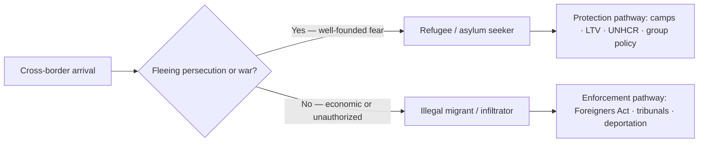

# Refugees & Infiltrators — India & South Asia

> GS-1 · Topic 13.1 · Human migration — refugee problem of the world with focus on India/subcontinent

---

## PYQs

| Year | M | Words | Question (EN) | प्रश्न (HI) | ID |
|------|---|-------|---------------|-------------|-----|
| 2025 | 12 | 200 | Differentiate between refugees and infiltrators. What steps have been taken by the Government of India for the security and assistance of refugees? | शरणार्थियों एवं घुसपैठियों में भेद कीजिए। शरणार्थियों की सुरक्षा और सहायता के लिए भारत सरकार ने कौन-से कदम उठाये हैं? | Q1 |
| 2023 | 8 | — | Throw light on Rohingya refugee in South Asia. | दक्षिण एशिया में रोहिंग्या शरणार्थी पर प्रकाश डालिए। | Q2 |

---

## Quick Revision

```
REFUGEE vs INFILTRATOR (2025):
  Refugee: forced flee · persecution/violence · seeks asylum · int'l protection (1951 Convention)
  Infiltrator: illegal entry · economic/other motive · no asylum claim · violates sovereignty/law

INDIA POSITION: NOT signatory 1951 Refugee Convention · NOT 1967 Protocol
  · governed by: Foreigners Act 1946 · Passport Act 1967 · Registration of Foreigners · FRRO
  · ad hoc "refugee policy" case-by-case · UNHCR limited formal role

MAJOR REFUGEE GROUPS IN INDIA:
  Tibetans (~1959) · Sri Lankan Tamils (1980s–) · Bangladesh 1971 · Afghan (post-Soviet/Taliban)
  · Chakmas (Tripura) · Rohingya (Myanmar) · Nepalese (open border — not refugee category)

ROHINGYA SOUTH ASIA (2023):
  Persecution Rakhine · Aug 2017 exodus · Bangladesh Cox's Bazar (world's largest camp)
  · India ~40,000 est. (Jammu, Hyderabad, Delhi) · Malaysia/Thailand transit
  · India: deportation concerns · SC interim protection · no CAA coverage

GOVT STEPS — SECURITY:
  Border fencing (Bangladesh/Myanmar) · BSF/SSB/Assam Rifles · biometrics · FRRO tracking
  · Foreigners Tribunals (Assam) · NRC discourse · deportation under Foreigners Act
  · CAA 2019 (persecuted minorities from 3 neighbours — NOT Rohingya Muslims)

GOVT STEPS — ASSISTANCE:
  Tibetan Rehabilitation Policy · settlement camps (Dharamshala, Bylakuppe)
  · Sri Lankan Tamil camps (Tamil Nadu) · Long-term visa · work permits (limited groups)
  · UNHCR partner NGOs (health, education for registered refugees)
  · CAA pathway for eligible persecuted minorities

INSTITUTIONS: UNHCR · UN 1951 Convention · IOM · SAARC (limited refugee framework)

TRAPS: India ≠ signatory 1951 Convention | Refugee ≠ all foreigners | CAA ≠ general amnesty
  | Rohingya ≠ covered under CAA | Infiltrator ≠ always security threat (legal distinction matters)
  | Bangladesh 1971 ≠ same as economic migration today
```

---

## Content

### Context — What forced displacement means and why India sits at the centre of South Asia's refugee geography

A refugee is a person who crosses an international border because persecution, war, or systematic violence has destroyed the possibility of safe return home. The legal idea rests on a "well-founded fear" of harm on grounds of identity, belief, or political opinion — not on the wish for better wages or urban opportunity. The 1951 United Nations Convention Relating to the Status of Refugees codified this principle and added non-refoulement: a state must not return a refugee to a territory where life or freedom would be threatened. The 1967 Protocol removed the Convention's original geographic and temporal limits, making the framework global. By 2024, UNHCR estimated that more than 120 million people worldwide were forcibly displaced — a record driven by wars in Ukraine, Sudan, and Gaza, persecution in Myanmar, and growing climate-linked movement that still lacks a dedicated legal category. South Asia carries a disproportionate share of these protracted crises because Partition in 1947, the Bangladesh Liberation War of 1971, ethnic conflict in Sri Lanka, Tibetan flight after China's 1959 consolidation, and Myanmar's treatment of the Rohingya created layered populations whose lives straddle borders drawn through villages, rivers, and kinship networks.

India occupies a paradoxical position in this landscape. It has historically hosted some of the largest refugee influxes in modern history — roughly eight to ten million from East Pakistan/Bangladesh in 1971, tens of thousands of Tibetans since 1959, Sri Lankan Tamils through the 1980s and beyond, Chakmas in Tripura, and smaller Afghan communities after Soviet and Taliban eras — yet it is not a signatory to the 1951 Convention or the 1967 Protocol. Legally, every foreign national on Indian soil, including someone fleeing genocide, is classified as a "foreigner" under the Foreigners Act, 1946, and related rules. Protection therefore depends on executive discretion, bilateral diplomacy, judicial interpretation of fundamental rights, and group-specific policies rather than a uniform asylum law. The subcontinent's porous borders, ethnic continuities across boundaries, and SAARC's silence on refugees mean that humanitarian burden and sovereign security concerns collide daily on India's eastern and northeastern frontiers. Understanding India's approach requires separating the moral fact of forced displacement from the legal fact of how the Indian state chooses to respond — and recognizing that the same border corridor can simultaneously carry asylum seekers and unauthorized economic migrants whose motives differ sharply even when their passports are equally absent.

### Refugees versus infiltrators — intent, law, and why the distinction is not ethnic

The word infiltrator (घुसपैठिया) in Indian public discourse usually denotes a person who enters the country illegally, without authorization, and typically without claiming persecution — often for economic survival, smuggling, or evasion of law. An infiltrator violates the Foreigners Act, 1946, the Passport (Entry into India) Act, 1967, and registration requirements; the state may detain, prosecute, and deport such persons. A refugee, by contrast, seeks protection from harm that the home state cannot or will not prevent. Internationally, that status triggers asylum procedures and, for Convention signatories, standardized rights to work, education, and non-return. India does not operate a formal asylum tribunal, but it has nevertheless extended de facto refuge to several groups through camps, Long-Term Visas (LTV), work permissions in limited cases, and tacit tolerance.

| Dimension | Refugee (शरणार्थी) | Infiltrator (घुसपैठिया) |
|-----------|-------------------|-------------------------|
| Core motive | Escape persecution, war, or violence; cannot safely return | Enter without authorization; often economic or evasive intent |
| International legal anchor | 1951 Convention — asylum, non-refoulement (India not formally bound) | No protection claim; governed by immigration and criminal law |
| Typical documentation | UNHCR registration card where available; asylum seeker status pending | Invalid or absent visa/passport; frequently no identity papers |
| Illustrative groups in India | Tibetans (1959 onward), Sri Lankan Tamils, some Afghans, Chakmas | Unauthorized cross-border migrants on Bangladesh/Myanmar routes; unregistered Rohingya |
| Usual state response | Camps, LTV, settlement policies, NGO partnerships (group-specific) | Detection, detention, Foreigners Tribunals, deportation, border pushback |

The distinction is legal and intent-based, not ethnic or religious. Two people from the same village crossing the same fence on the same night may belong to different categories if one fled arson and killing while the other sought seasonal labour. Policy failure begins when security rhetoric collapses the two into a single undifferentiated threat, or when humanitarian rhetoric ignores genuine illegal entry. India's historical record shows both generosity and hard enforcement: the 1971 camp network and eventual absorption of East Bengali populations contrasts with deportation drives, biometric tracking, and citizenship-filtering debates in Assam and elsewhere. The Citizenship (Amendment) Act, 2019, accelerates citizenship for Hindu, Sikh, Buddhist, Jain, Parsi, and Christian migrants from Afghanistan, Bangladesh, and Pakistan who entered before specified cut-off dates and claim religious persecution — but it is not a general refugee amnesty and explicitly excludes Muslims from those three countries as well as all nationals of other neighbours such as Myanmar.



Proof that the categories overlap geographically but diverge legally appears along the India–Bangladesh border, where BSF patrols intercept both trafficking victims and economic migrants while separate cohorts of persecuted minorities seek CAA-related regularization. Courts have reinforced that Article 21 of the Constitution — the right to life and personal liberty — applies to all persons, not only citizens, requiring fair procedure before deportation of even unregistered migrants. That judicial floor does not grant refugee status, but it prevents purely arbitrary expulsion in cases such as UNHCR-registered Rohingya petitioners who received interim protection from the Supreme Court in 2021 while their pleas were pending.

### Rohingya refugees in South Asia — statelessness, exodus, and regional burden-sharing

The Rohingya are a Muslim minority concentrated in Myanmar's Rakhine State along the Bay of Bengal. Myanmar's 1982 Citizenship Law excluded them from the official list of national ethnic groups, rendering most Rohingya stateless despite generations of residence. Periodic outbreaks of communal violence escalated into a catastrophic "clearance operation" by security forces and allied militias in August 2017, involving mass killing, sexual violence, and village burning. More than 700,000 Rohingya fled to Bangladesh within weeks, joining earlier waves and creating the Kutupalong–Balukhali settlement near Cox's Bazar — now among the world's largest refugee concentrations, hosting over one million people in fragile hillside shelters exposed to monsoon landslides and cyclone risk. Inside Rakhine, roughly 600,000 Rohingya remain under severe movement restrictions, many in internal displacement camps with limited access to livelihoods and healthcare.

India's Rohingya population is far smaller but politically salient. UNHCR and civil-society estimates place the figure near 40,000, with clusters in Jammu and Kashmir, Hyderabad, Delhi, and parts of Haryana. Because India treats them as illegal immigrants rather than refugees, most live without secure legal status; UNHCR registration provides identity documentation but not automatic protection from removal. Official statements cite security concerns — potential radicalization, demographic anxiety in Jammu, and links to document fraud or crime networks — as grounds for deportation. The Citizenship Amendment Act offers no pathway for Rohingya Muslims from Myanmar. Humanitarian agencies and partner NGOs nevertheless deliver health, legal aid, and informal education, though many Rohingya children remain outside formal schooling. Malaysia, Thailand, and Indonesia receive smaller numbers through perilous sea journeys, often involving trafficking and detention, illustrating that the crisis is regional rather than bilateral.

| Country/region | Scale and conditions |
|----------------|---------------------|
| Bangladesh (Cox's Bazar) | 1 million+ in congested camps; aid-dependent; disaster-prone terrain |
| India | ~40,000 estimated; urban and Jammu clusters; legal precarity |
| Malaysia, Thailand, Indonesia | Boat arrivals; detention; transit in irregular migration chains |
| Myanmar (Rakhine) | ~600,000 remain; stateless; restricted to camps and controlled zones |

Bangladesh bears the heaviest humanitarian load while diplomatic pressure on Myanmar through ASEAN has produced limited accountability. India's diplomatic balancing — engagement with Myanmar's military regime for northeastern stability versus condemnation of human-rights abuses — complicates any coordinated regional solution. The Rohingya case thus exposes South Asia's absence of a shared refugee regime: no SAARC framework, uneven bilateral readmission agreements, and domestic laws that prioritize sovereignty over standardized asylum.

### Government steps for security — law, borders, identity, and the citizenship filter

India's security architecture for cross-border movement rests on a stack of statutes and institutions. The Foreigners Act, 1946, empowers the central government to regulate entry, restrict movement, detain foreigners, and order deportation. The Passport (Entry into India) Act, 1967, criminalizes entry without valid travel documents. The Registration of Foreigners Rules require periodic reporting; Foreigners Regional Registration Offices (FRRO) and Foreigners Registration Offices (FRO) maintain records, issue residential permits, and track visa overstays through the e-FRRO portal and biometric enrolment. In Assam, Foreigners Tribunals adjudicate suspected illegal immigration cases, operating alongside National Register of Citizens (NRC) discourse that seeks to distinguish citizens from non-citizens — a process with roots in the Assam Accord but national political reverberations.

On the ground, border security combines physical barriers with surveillance technology. India–Bangladesh border fencing, pursued in phases since the 1980s, now covers roughly ninety percent of the 4,096 km line, supplemented by floodlights, patrol roads, and the Comprehensive Integrated Border Management System (CIBMS) integrating sensors, cameras, and command networks. The Border Security Force (BSF) mans the Bangladesh frontier; the Assam Rifles and Sashastra Seema Bal (SSB) cover Myanmar and Nepal sectors respectively. The India–Myanmar Free Movement Regime, allowing border residents within 16 km to cross with permits, faced review after the 2021 military coup and subsequent migration surges because porous hill routes complicate distinguishing tribal kinship travel from unauthorized settlement. Refugee-specific security measures include camp administration for Tibetans and Sri Lankan Tamils — restricted movement zones, police liaison, and census of registered residents — while unregistered migrants face arrest and removal proceedings. Bilateral readmission talks with Bangladesh proceed more smoothly than with Myanmar for Rohingya, whom Myanmar has largely refused to repatriate despite signed agreements. The CAA and NRC debates together represent an attempt to legislate identity at scale: creating a fast-track citizenship channel for selected persecuted minorities while identifying others for expulsion — a dual-track approach unique among major refugee-hosting countries.

### Government steps for assistance — group-specific generosity within an ad hoc national framework

Absence of a unified refugee law has not prevented substantial assistance to particular communities. Tibetans arriving after the Dalai Lama's escape in 1959 received settlement townships in Himachal Pradesh (Dharamshala), Karnataka (Bylakuppe, Mundgod), and other states under evolving Tibetan Rehabilitation Policy guidelines. These settlements combine housing, agricultural allotments, Tibetan schools, monastic institutions, and Long-Term Visas renewable through FRRO; some Tibetan youth serve in specialised force units, though most residents remain non-citizens on long-term permits rather than automatic Indian nationals. Sri Lankan Tamil refugees, chiefly in Tamil Nadu camps such as Mandapam, receive shelter, rations, and access to health and education within camp constraints; repatriation programmes have operated during lulls in Sri Lanka's conflict, though integration into Indian society remains limited for many camp residents.

The 1971 crisis remains the benchmark of state-led humanitarian response: India housed millions of East Pakistani refugees in camps across the eastern belt, bearing enormous fiscal and epidemiological costs until victory in December 1971 and the emergence of Bangladesh. Subsequent accords and citizenship pathways absorbed many who remained. Smaller Afghan, Somali, and other communities access UNHCR registration in New Delhi, NGO-supported health and education, and case-by-case LTV extensions. The Citizenship Amendment Act, 2019, constitutes assistance of a different kind — not camp-based relief but accelerated naturalization for eligible persecuted non-Muslim minorities from Afghanistan, Bangladesh, and Pakistan who meet entry-date and proof requirements.

| Group | Principal assistance measures |
|-------|--------------------------------|
| Tibetans (since 1959) | Rehabilitation Policy; dedicated settlements; schools; LTV |
| Sri Lankan Tamils | TN refugee camps; rations; shelter; periodic repatriation |
| 1971 Bangladesh refugees | Mass relief camps; post-war absorption and citizenship pathways |
| Afghans and others (small numbers) | UNHCR registration; NGO services; discretionary LTV |
| CAA-eligible minorities | Accelerated citizenship from Afghanistan, Bangladesh, Pakistan |

Institutional roles divide between the Ministry of Home Affairs (foreigners and citizenship divisions), the Ministry of External Affairs (rare diplomatic asylum), UNHCR's India office (registration and advocacy without camp management), and state governments that administer camps and land allotments. The pattern is consistent: generosity correlates with geopolitical alignment, duration of presence, and domestic political acceptability — not with a single statutory entitlement.

### Humanitarian tradition versus security sovereignty — the policy tension and judicial mediation

India's refugee policy oscillates between two defensible imperatives. The humanitarian track reflects cultural and historical openness: sheltering Tibetans as a civilizational gesture, absorbing 1971 refugees as a strategic and moral act, maintaining Tamil camps for decades, and allowing UNHCR presence despite non-accession to the Convention. The security track responds to legitimate fears — cross-border militancy in Punjab and Kashmir histories, demographic change anxieties in northeastern states, smuggling economies along Bangladesh border districts, and the challenge of verifying identity among document-less arrivals. The inconsistency — generous Tibetan settlement versus contested Rohingya removal — flows directly from ad hoc executive choice rather than codified criteria. Reform advocates argue for a domestic asylum law defining status determination, work rights, and appeal mechanisms; security advocates warn that formal asylum channels attract fraudulent claims and constrain deportation. The Supreme Court has partially bridged the gap by applying Articles 14 and 21 to foreign nationals, demanding procedural fairness in deportation and occasionally halting removals pending review. Non-refoulement is not explicitly in the Constitution, but deporting someone to likely persecution would violate Article 21's substantive content as interpreted in cases such as NHRC interventions and Rohingya interim orders. India's participation in the Global Compact on Refugees (2018) signaled diplomatic engagement without binding commitment — consistent with selective multilateralism.

### Contemporary relevance

Myanmar's post-2021 military coup renewed displacement in Chin State and Sagaing, adding pressure on India's northeastern states where ethnic kinship ties and the Free Movement Regime create migration pathways distinct from the Rohingya crisis but equally unmanaged by refugee law. Afghanistan's 2021 Taliban takeover triggered a modest influx of Hindus and Sikhs seeking CAA-related regularization while Muslim Afghans lacked comparable pathways, reviving debates about religious filters in citizenship policy. Climate-linked displacement from the Sundarbans delta and coastal Bangladesh — where salinity intrusion and cyclone damage erode habitable land — produces migrants who fit neither the Refugee Convention's persecution criterion nor standard economic migration categories, previewing a legal vacuum India will face on its eastern flank. Supreme Court jurisprudence continues to expand procedural rights for non-citizens even as executive policy hardens border enforcement, creating a living tension between court and government. Internationally, India's hosting of displaced populations while refusing Convention obligations influences negotiations on global burden-sharing and South-South solidarity claims.

### Limits and balanced view

Non-signatory status preserves policy flexibility — India avoids mandatory asylum quotas and UNHCR oversight of domestic camps — but produces inconsistent protection without transparent criteria, undermining predictability for both refugees and border communities. Security concerns about infiltration, radicalization, and demographic change are empirically grounded in specific corridors, yet conflating all unauthorized entrants with national-security threats risks collective punishment of genuine asylum seekers including women and children. Group-specific generosity toward Tibetans and CAA beneficiaries alongside Rohingya vulnerability demonstrates that religion and geopolitics shape outcomes as much as persecution severity — a moral inconsistency critics highlight and defenders explain as sovereign prerogative. SAARC's paralysis leaves bilateralism as the only regional tool; Bangladesh cannot indefinitely host one million Rohingya without India and international support sharing responsibility. A codified domestic refugee law would not eliminate border controls but could reconcile India's humanitarian tradition with uniform minimum standards — distinguishing infiltrator from refugee on evidence rather than rhetoric, and aligning constitutional morality with foreigner administration. Until then, South Asia's largest democracy will continue hosting millions without calling them refugees, and the world's most densely populated subcontinent will manage displacement through fences, camps, citizenship amendments, and court orders rather than through a shared regional treaty.

---

## Answers

### Q1: Differentiate refugees and infiltrators; Govt steps for security and assistance. (2025, 12M, 200W)

**Introduction:**
> **Refugees flee persecution or war seeking protection; infiltrators enter illegally, typically without asylum claims** — **India hosts both phenomena on its borders but governs them primarily under the Foreigners Act, not the 1951 Refugee Convention**.

**Main Points:**
- **Refugee** — **Forced displacement, well-founded fear, seeks safety** — **examples: Tibetans, Sri Lankan Tamils, Afghans**.
- **Infiltrator** — **Unauthorized border crossing, economic or illegal intent, no protection claim** — **dealt under Foreigners Act**.
- **Security Steps** — **Border fencing (Bangladesh), BSF/Assam Rifles, FRRO tracking, biometrics, Foreigners Tribunals, deportation powers**.
- **Assistance Steps** — **Tibetan Rehabilitation Policy, Tamil refugee camps, LTV, UNHCR-NGO support, CAA for persecuted minorities from three neighbours**.
- **Legal Frame** — **Non-signatory to Refugee Convention** — **Article 21 protection via courts for fair procedure**.

**Keywords (underline in exam):** Refugee · Infiltrator · Foreigners Act 1946 · UNHCR · CAA 2019 · Non-refoulement · LTV

**Exam diagram (30 sec):**
```
Refugee = persecution + protection seeker
Infiltrator = illegal entry + no asylum
India: security (border · FRRO) + selective assistance (Tibetans · CAA)
```

**Conclusion:**
> **India balances sovereignty with selective humanitarianism** — **clear legal differentiation and uniform minimum protection remain policy gaps**.

---

### Q2: Throw light on Rohingya refugee in South Asia. (2023, 8M)

**Introduction:**
> **Rohingya Muslims of Myanmar's Rakhine State face statelessness and persecution** — **2017 exodus made South Asia, especially Bangladesh and India, a major theatre of the crisis**.

**Main Points:**
- **Cause** — **1982 citizenship denial, communal violence, 2017 military operations** — **~700,000+ fled to Bangladesh**.
- **Bangladesh** — **Cox's Bazar mega-camps — world's largest refugee settlement** — **aid dependency, disaster risk**.
- **India** — **~40,000 estimated, clusters in Jammu, Hyderabad** — **illegal immigrant classification, deportation concerns**.
- **Legal/policy** — **India not Refugee Convention signatory; CAA excludes Rohingya; SC interim against arbitrary deportation**.
- **Regional** — **Boat people to Malaysia/Thailand; ASEAN pressure on Myanmar limited**.

**Keywords (underline in exam):** Rohingya · Rakhine · Cox's Bazar · Stateless · UNHCR · CAA · Article 21

**Exam diagram (30 sec):**
```
Myanmar persecution → Bangladesh (1M+) · India (~40k)
Policy: humanitarian crisis vs border security
```

**Conclusion:**
> **Rohingya crisis exposes South Asia's absence of a coherent refugee regime** — **humanitarian burden falls heavily on Bangladesh**.

---

### Q3: *Likely variant:* Examine India's refugee policy — humanitarian vs security. (—, 12M, 200W)

**Introduction:**
> **India is a major refugee host historically but not a party to international refugee law** — **policy oscillates between humanitarian accommodation and border security**.

**Main Points:**
- **Humanitarian track** — **1971 Bangladesh, Tibetan settlements, Sri Lankan camps, NGO-UNHCR support**.
- **Security track** — **Foreigners Act, deportation, border fencing, CAA-NRC discourse**.
- **Inconsistency** — **Group-specific policies (Tibetans generous; Rohingya contested)**.
- **Judicial check** — **Article 21 fair procedure for deportation**.
- **Reform need** — **Domestic refugee law, SAARC cooperation, distinguish economic migration from asylum**.

**Keywords (underline in exam):** 1951 Convention · Foreigners Act · Tibetan Policy · CAA · Article 21 · UNHCR

**Exam diagram (30 sec):**
```
Humanitarian (camps · LTV) ↔ Security (fence · deport)
Need: national asylum law
```

**Conclusion:**
> **A codified refugee policy would reconcile India's humanitarian tradition with sovereign border control**.

---

## Traps

| Wrong | Correct |
|-------|---------|
| India signatory to 1951 Refugee Convention | **Not signatory** — **Foreigners Act governs** |
| Refugee = any foreigner | **Forced displacement + protection need** — **legal category** |
| Infiltrator = only Bangladeshi | **Any illegal entrant** — **nationality-neutral term** |
| CAA covers all refugees | **Only persecuted non-Muslim minorities from Afg/BD/Pak** |
| CAA covers Rohingya | **Rohingya Muslims from Myanmar excluded** |
| UNHCR runs camps in India | **Limited role** — **govt/NGO partner model** |
| All Tibetans are citizens | **Most on LTV/residence permits** — **not automatic citizenship** |
| Rohingya only in Bangladesh | **India, Malaysia, Thailand also host** |
| Refugee policy uniform | **Ad hoc, group-specific (Tibetan Policy vs Rohingya deportation)** |
| Security measures violate all refugee rights | **Courts apply Article 21** — **non-refoulement de facto in some cases** |

---

*Complete.*
