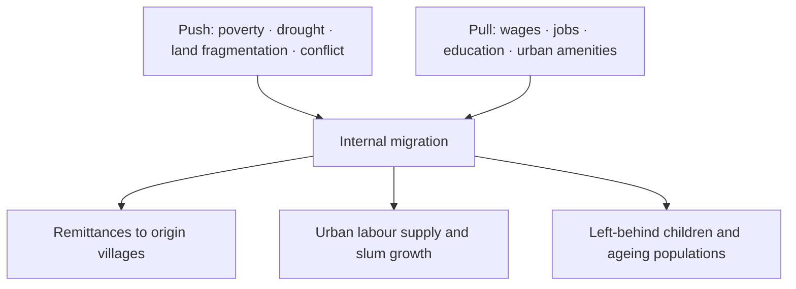

# Internal Migration & Reverse Migration — India

> GS-1 · Topic 13.2 · Internal human migration — causes, consequences, reverse migration (COVID-19 / UP focus)

---

## PYQs

| Year | M | Words | Question (EN) | प्रश्न (HI) | ID |
|------|---|-------|---------------|-------------|-----|
| 2023 | 12 | — | Discuss the causes and consequences of internal human migration in India. | भारत में आंतरिक मानव प्रवास के कारणों एवं परिणामों की व्याख्या कीजिए। | Q1 |
| 2020 | 12 | 200 | What is 'reverse migration'? What was its impact on the economy and social order of Uttar Pradesh during the COVID-19 Lockdown? | 'विपरीत प्रवास' क्या है? COVID-19 लॉकडाउन के दौरान उत्तर प्रदेश की अर्थव्यवस्था और सामाजिक व्यवस्था पर इसका क्या प्रभाव पड़ा? | Q2 |

---

## Quick Revision

```
INTERNAL MIGRATION INDIA (2023):
  Scale: Census 2011 — ~45% Indians migrants (lifetime) · major rural→urban
  Push: poverty · land fragmentation · drought/flood · unemployment · conflict · distress
  Pull: wages · jobs (manufacturing/services) · education · urban amenities
  Types: permanent · seasonal · circular (R→U · R→R · U→U)

CAUSES (structured):
  Economic: agrarian crisis · MNREGA insufficient · wage differential
  Social: marriage · education · caste/network migration
  Environmental: drought (Marathwada) · floods · cyclones · climate stress
  Political/conflict: Naxalism · ethnic violence displacement

CONSEQUENCES:
  + remittances · urban labour supply · cultural exchange · women's agency (some cases)
  − slums · pressure on urban infra · brain drain villages · left-behind children/elderly
  · political (voter portability) · epidemiological (COVID spread vector)

REVERSE MIGRATION (2020):
  Definition: return movement from destination to origin (often crisis-triggered)
  COVID lockdown March 2020: factories shut · no wages/shelter · migrants walked home

UP IMPACT — ECONOMY:
  Sudden remittance collapse (Mumbai/Delhi/Gujarat earnings lost)
  Village wage depression (labour surplus) · MGNREGS demand spike
  Skill Mapping Portal · ODOP · rural employment push · Shramik Special Trains

UP IMPACT — SOCIAL ORDER:
  Quarantine centres · stigma of "virus carriers" · family reunification
  Strain on village food/housing · psychological distress · child education disruption
  Community solidarity + panchayat role · later "son of soil" local job preference discourse

STATES: UP · Bihar · Jharkhand — major OUT-migration · Maharashtra · Delhi · Gujarat — IN-flow
  UP: Gorakhpur · Azamgarh · Bundelkhand · Purvanchal — high outflow belts

INSTITUTIONS: Census migration tables · NITI Aayog · Interstate Migrant Workmen Act 1979
  · One Nation One Ration Card (portable PDS) · e-Shram portal

TRAPS: Internal migration ≠ only rural-urban | Reverse migration ≠ only COVID
  | All migration ≠ distress (also aspirational) | Remittances ≠ always positive net (depends)
  | UP impact ≠ only negative (MGNREGS · local employment later)
```

---

## Content

### Context — Internal migration as India's silent demographic engine

Internal migration is the movement of people within national borders to new places of residence, distinct from cross-border refugee flows governed by foreigner law. Article 19(1)(d) of the Indian Constitution guarantees all citizens the right to move freely throughout the territory of India and to reside and settle in any part — making internal migration a legal expression of economic agency and social aspiration, not an administrative offence. Census 2011 recorded approximately 450 million internal migrants when measured by place of birth or last residence criteria — roughly forty-five percent of the population — placing India among the world's largest internal migration systems. These flows reshape labour markets, family structures, electoral geography, and epidemic pathways without appearing in international displacement statistics. The dominant image is rural-to-urban movement from distressed agrarian belts toward industrial and service clusters in Delhi-National Capital Region, Maharashtra, Gujarat, Karnataka, and Tamil Nadu, but the reality includes rural-to-rural seasonal labour, circular migration between village and city, urban-to-urban job upgrading, and marriage-linked redistribution of women across districts. Policy historically treated migrants as invisible: the Inter-State Migrant Workmen (Regulation of Employment and Conditions of Service) Act, 1979, existed on paper with weak enforcement until the COVID-19 lockdown of March 2020 exposed millions of interstate workers stranded without wages, shelter, or portable welfare. Understanding internal migration requires push-pull analysis not as abstract theory but as household survival calculus — why a family from Gorakhpur or Azamgarh sends members to Mumbai construction sites, what they gain in remittances, and what villages lose when able-bodied adults depart seasonally or permanently.

### Causes of internal migration — push, pull, and the channels that connect them

Migration theory organizes causes into push factors that expel people from origin areas and pull factors that attract them toward destinations. In India, push and pull operate simultaneously and often reinforce each other across generations through chain migration — early migrants from a village establish lodging and job contacts that lower the cost and risk for later kin.

Economic push factors dominate the Hindi heartland and eastern plateau. Agricultural stagnation on fragmented holdings — average farm sizes below two hectares in much of Uttar Pradesh and Bihar — produces disguised unemployment where too many workers share too little productive land. Crop failure from drought in Bundelkhand and Marathwada, or flood damage in Assam and north Bihar, destroys savings and triggers distress exit. Farmer indebtedness linked to input costs and volatile prices pushes household members toward urban wage labour as an alternative income stream. Rural non-farm employment remains insufficient despite Mahatma Gandhi National Rural Employment Guarantee Scheme (MGNREGS) demand, which guarantees hundred days of wage work per rural household but cannot substitute for year-round urban earnings in construction or textiles.

Economic pull factors concentrate in urban-industrial nodes. Wage differentials between a village day-labour rate and Delhi or Surat construction pay can exceed three to one, enough to justify migration costs even when work is informal and unprotected. Industrial clusters — textiles in Surat, diamond polishing in Gujarat, automobile ancillaries in Pune and Chennai, gig-economy delivery platforms in metros — absorb low-skilled and semi-skilled workers. Educated youth migrate aspirationaly toward Bengaluru, Hyderabad, and Pune IT corridors, representing mobility driven by opportunity rather than distress.

Social factors add structural depth. Marriage migration, predominantly patrilocal, moves women permanently to husbands' villages or cities, redistributing population without labour-market logic alone. Education migration sends youth to coaching hubs like Kota or Delhi for competitive examinations, creating temporary but intense urban concentration. Kinship networks reduce information asymmetry: a Purvanchal village may channel workers exclusively to specific Mumbai neighbourhoods where dialect-speaking contractors offer trust and credit.

Environmental and conflict drivers produce both temporary and permanent displacement. Assam and Bihar floods, Odisha cyclones, Sundarbans salinity intrusion, and landslides in Himalayan states destroy assets and habitations. Naxal-affected districts in Jharkhand and Chhattisgarh generate security-driven outmigration. Climate stress is intensifying push pressure in Bundelkhand and coastal belts, though legal frameworks still classify such movers as migrants rather than climate refugees because borders are not crossed.

| Migration type | Pattern | Illustrative example |
|----------------|---------|----------------------|
| Rural → Urban | Permanent or semi-permanent settlement in cities | UP/Bihar workers in Delhi-NCR construction |
| Rural → Rural | Seasonal agricultural labour | Bihar/Odisha harvest workers in Punjab |
| Seasonal / circular | Repeated return to origin | Odisha brick-kiln workers returning for sowing |
| Urban → Urban | Job or housing upgrade | Tier-2 to metro IT sector mobility |
| Marriage-linked | Predominantly female | Patrilocal relocation across districts |



Proof of migration as rational strategy appears in remittance-dependent villages of Purvanchal and Mithilanchal where pucca houses, school fees, and marriage expenses are financed by Mumbai or Gulf earnings — households would be poorer without outmigration even after accounting for separation costs and informal-sector exploitation at destination.

### Consequences of internal migration — gains, costs, and the policy gap

Positive consequences begin with remittances. Internal remittances — estimated in tens of thousands of crores annually though poorly measured — finance rural consumption, housing construction, agricultural inputs, and children's education in origin districts of UP, Bihar, Odisha, and Rajasthan. Urban labour supply sustains construction booms, MSME workshops, domestic service, and logistics sectors that metropolitan middle classes depend upon; without migrant workers, NCR and Mumbai building activity would stall. Poverty reduction through earned urban income often exceeds what village agriculture alone provides for landless and marginal farmer families. Social mobility — exposure to urban norms, women's workforce participation in domestic and garment work, and hybrid cultural identities — accompanies physical movement even when jobs are precarious.

Negative consequences concentrate at both ends of the corridor. Destination cities face slum proliferation — Dharavi-scale densities with shared toilets, water theft, and fire risk — and infrastructure overload on water supply, transport, and housing. Origin villages experience "empty village" syndrome: working-age adults absent, elderly and children left behind, schools with declining enrollment in some belts, and feminization of agriculture where women manage fields alone. Informality means no written contracts, no provident fund, no paid leave — conditions the e-Shram portal (2021) and Labour Codes (2020) attempt to address by consolidating inter-state migrant worker protections, though implementation remains uneven. Health and epidemiology links proved devastating during COVID-19 when crowded dormitories and long-distance travel spread infection nationally. Political economy effects include voter registration portability problems — migrants often cannot vote where they work — and clientelistic politics in slum settlements where broker networks deliver services in exchange for loyalty.

A balanced assessment treats migration as a household portfolio decision, not purely as developmental failure or unqualified success. Distress migration deserves reduction through rural job creation and social protection; aspirational migration deserves facilitation through portable ration cards, health access, and housing dignity rather than prevention.

### Reverse migration — definition, types, and the COVID-19 shock

Reverse migration denotes movement from a migrant's destination back toward place of origin. It is normal in seasonal agriculture when Punjab-bound harvest workers return for sowing, and abnormal when crises eliminate destination livelihoods overnight. The COVID-19 nationwide lockdown announced on 24 March 2020 created the largest distress reverse migration since Partition in scale and visibility. Factories, construction sites, and informal service establishments halted immediately; dormitory landlords evicted workers who could not pay rent; interstate bus and train services stopped. Millions walked hundreds of kilometres along highways — images from Delhi toward UP and Bihar, Mumbai toward Madhya Pradesh and Odisha — became symbols of policy blindness toward the migrant workforce. Government response, initially delayed, scaled up Shramik Special Trains, shelter camps, and food distribution, but suffering in the first eight weeks was extensive and documented.

| Reverse migration type | Trigger | Example |
|------------------------|---------|---------|
| Seasonal | Agricultural calendar, festivals | Harvest workers returning for planting |
| Crisis-induced | Lockdown, recession, disaster, hostility | COVID-19 March–August 2020 exodus |
| Life-cycle | Retirement or accumulated savings | Return to village after urban working years |

Reverse migration is not COVID's invention — circular migrants reverse every year — but COVID converted a rhythmic pattern into a simultaneous national shock when every corridor reversed at once.

### Impact on Uttar Pradesh — economy during the lockdown exodus

Uttar Pradesh, India's most populous state, is simultaneously the largest sender of interstate migrants and the largest receiver during crisis reverse flows. Purvanchal districts — Gorakhpur, Azamgarh, Deoria, Ballia — and Bundelkhand send workers to Mumbai, Delhi, Surat, and Gulf destinations; when those earnings stopped in March 2020, village economies lost their external income valve.

Immediate economic shocks included remittance collapse affecting household consumption and loan repayment capacity. Labour surplus in villages depressed local agricultural wages because returning workers competed for scarce MGNREGS and farm jobs simultaneously. MGNREGS demand exploded to record person-days as the primary fallback employer. Urban UP — Noida, Kanpur, Lucknow industrial belts — simultaneously lost incoming migrant labour, stalling construction and manufacturing that depended on Bihar and eastern UP workers. Medium-term policy responses included migrant skill mapping and registration portals for re-employment databases, One District One Product (ODOP) schemes promoting local manufacturing, enhanced MGNREGS and state rural livelihood missions, Garib Kalyan Rojgar Abhiyan's 125-day village employment push, and Atmanirbhar Bharat MSME credit lines for partial labour absorption. Structural lesson: UP's economy is dual — exporting labour in normal times and reabsorbing it in crisis without adequate diversified rural non-farm employment at scale.

### Impact on Uttar Pradesh — social order during the lockdown exodus

Social disruption accompanied economic shock. Quarantine centres established at block and district levels generated fear and stigma — returnees labelled as virus carriers despite many having walked from unaffected workplaces. Family reunification brought emotional relief but increased mouths to feed on depleted incomes. Village food stocks, housing space, and drinking water systems strained under sudden population influx. Psychological trauma from humiliation of highway walks, police enforcement, and uncertainty left lasting marks documented by civil-society reports. Children's education disrupted when city school mid-term returns left rural schools unprepared for reintegration.

Solidarity mechanisms partially compensated. Panchayats, gurudwaras, temples, and NGOs operated food shelters along UP entry routes from Delhi. Caste and community networks arranged temporary lodging. Political discourse afterward shifted toward "sons of the soil" local job reservation demands in some states, reflecting post-COVID sensitivity to migrant vulnerability. Gender dimension remained underreported: women in domestic work lost jobs silently with less media coverage than male construction exodus. Rural primary health centres faced screening burdens beyond capacity.

By 2021–22 many migrants returned to cities as lockdowns eased, resuming circular patterns — proof that reverse migration during COVID was crisis pause rather than permanent ruralization unless accompanied by local job creation.

### Contemporary relevance

One Nation One Ration Card (ONORC) allows migrant workers to draw subsidized food grains from any fair price shop nationwide using Aadhaar authentication — partial fix for welfare exclusion that left migrants starving during COVID. e-Shram portal registers unorganised workers including migrants for future scheme targeting. Labour Codes consolidate inter-state migrant worker registration, journey allowance, and accommodation obligations on contractors. Climate stress in Bundelkhand and coastal Odisha may generate future reverse migration cycles when city opportunities shrink simultaneously with village habitability. Post-COVID urban recovery restored migration corridors, confirming that structural dependence on remittance economies persists until rural diversification succeeds.

### Limits and balanced view

Not all internal migration is distress-driven — preventing aspirational mobility would harm national productivity and individual freedom guaranteed under Article 19. Reverse migration during COVID carried temporary benefits (family presence, village social capital) alongside severe income loss — net assessment depends on household assets and social safety net access. UP's population size magnifies any shock in absolute numbers; policies must scale accordingly. Data gaps — no real-time national migrant registry before COVID — caused planning failure acknowledged in NITI Aayog and parliamentary committee reports. MGNREGS supplements but cannot replace urban wage premiums; ONORC improves food access but not housing, health, or education portability. Internal migration will remain India's primary urbanization pathway; policy should secure dignified mobility rather than romanticize village retention or ignore slum conditions at destination.

---

## Answers

### Q1: Causes and consequences of internal human migration in India. (2023, 12M)

**Introduction:**
> **Internal migration reshapes India's demographic and economic map** — **driven by rural distress and urban opportunity, it produces both remittance-led development and urban crisis**.

**Main Points:**
- **Causes — Push** — **Poverty, land fragmentation, drought/flood, rural unemployment, conflict**.
- **Causes — Pull** — **Higher wages, industrial jobs (Surat, NCR), education, urban amenities**.
- **Types** — **Rural-urban permanent, seasonal (agriculture), circular, marriage migration**.
- **Positive Consequences** — **Remittances, poverty reduction, urban labour supply, social mobility**.
- **Negative Consequences** — **Slums, infra pressure, left-behind villages, informal exploitation, health risks (COVID)**.
- **Policy** — **Inter-State Migrant Workmen Act, ONORC, e-Shram, need portable social security**.

**Keywords (underline in exam):** Push-Pull · Rural-Urban · Remittances · Circular Migration · MGNREGS · Slums · ONORC

**Exam diagram (30 sec):**
```
Push (village distress) + Pull (city wages) → Migration
→ + remittances | − slums · left-behind families
```

**Conclusion:**
> **Migration is India's silent urbanization engine** — **policy must reduce distress while securing dignified migrant rights**.

---

### Q2: Reverse migration — impact on UP economy and social order during COVID lockdown. (2020, 12M, 200W)

**Introduction:**
> **Reverse migration denotes return movement from workplaces to native places** — **COVID-19 lockdown triggered one of history's largest distress reverse migrations into Uttar Pradesh**.

**Main Points:**
- **Definition** — **Crisis-induced return of interstate migrants when destination jobs vanish**.
- **Economy — Negative** — **Remittance collapse, village labour surplus, construction halt, MGNREGS spike**.
- **Economy — Response** — **Shramik trains, skill mapping, ODOP, Garib Kalyan Rojgar, rural employment push**.
- **Social — Strain** — **Quarantine stigma, family reunification burden, PHC stress, education disruption**.
- **Social — Solidarity** — **Panchayat/NGO relief, community kitchens along UP entry routes**.
- **Lesson** — **Invisible migrant workforce needs portable welfare (ONORC, e-Shram)**.

**Keywords (underline in exam):** Reverse Migration · Shramik Special Trains · Remittances · MGNREGS · Quarantine · Skill Mapping · Article 19

**Exam diagram (30 sec):**
```
Lockdown → jobs lost → walk/train home to UP
Economy: − remittances · + MGNREGS demand
Social: stigma + solidarity
```

**Conclusion:**
> **COVID reverse migration exposed UP's dependence on outbound labour** — **diversified local employment is structural imperative**.

---

### Q3: *Likely variant:* Explain types of internal migration in India with examples. (—, 8M, 125W)

**Introduction:**
> **Internal migration in India spans permanent, seasonal, and circular forms** — **each shaped by economic and social logic**.

**Main Points:**
- **Rural → Urban** — **UP/Bihar workers in Delhi-Mumbai construction (permanent/semi-permanent)**.
- **Rural → Rural seasonal** — **Bihar/Odisha labour in Punjab harvest**.
- **Circular** — **Brick kilns, post-harvest return, festival cycles**.
- **Urban → Urban** — **IT sector mobility Bengaluru-Hyderabad**.
- **Marriage migration** — **Predominantly women — demographic redistribution**.

**Keywords (underline in exam):** Seasonal · Circular · Rural-Urban · Chain Migration · Census 2011

**Exam diagram (30 sec):**
```
Types: R→U | R→R seasonal | circular | U→U | marriage
```

**Conclusion:**
> **Recognizing migration types is essential for targeted welfare — one-size policy fails seasonal workers**.

---

## Traps

| Wrong | Correct |
|-------|---------|
| Internal migration = only rural to urban | **Also R→R, U→U, seasonal, circular** |
| All internal migration is distress | **Also aspirational (IT, education)** |
| Reverse migration invented in COVID | **Seasonal return normal; COVID = crisis scale** |
| UP only sends migrants, never receives | **Noida/Kanpur attract migrants; COVID received returnees** |
| Remittances always benefit origin | **Depends on migration cost, debt bondage, left-behind care burden** |
| Shramik trains solved crisis fully | **Partial relief; initial suffering massive** |
| Lockdown impact only economic | **Social stigma, mental health, education equally important** |
| MGNREGS replaces migration | **Supplement, not substitute for urban wages** |
| Inter-State Migrant Act fully enforced | **Historically weak — Labour Codes aim to fix** |
| ONORC solves all migrant welfare | **Health, housing, education portability still gaps** |

---

*Complete.*
