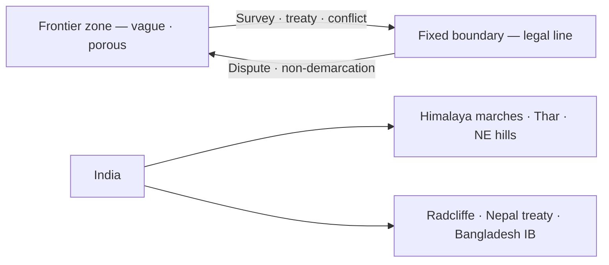

# Frontiers vs Boundaries — Indian Subcontinent

> GS-1 · Topic 14.1 · Frontiers and boundaries with reference to Indian subcontinent

---

## PYQs

| Year | M | Words | Question (EN) | प्रश्न (HI) | ID |
|------|---|-------|---------------|-------------|-----|
| 2025 | 12 | 200 | Differentiate between frontiers and boundaries and present a detailed account on the types of boundaries giving suitable examples from Indian subcontinent. | सीमांत और सीमाओं में अंतर स्पष्ट कीजिए और भारतीय उपमहाद्वीप से उपयुक्त उदाहरण देते हुए सीमाओं के प्रकारों पर विस्तृत विवरण प्रस्तुत कीजिए। | Q1 |
| 2020 | 8 | 125 | Explain the difference between the frontier and the boundary with special reference to India. | भारत के विशेष संदर्भ में सीमांत (फ्रंटियर) और सीमा (बाउंडरी) का अंतर स्पष्ट कीजिए। | Q2 |

---

## Quick Revision

```
FRONTIER vs BOUNDARY:
  Frontier: outer zone · vague · expanding/settling · cultural transition · weak govt control
  Boundary: fixed line · legal · surveyed · sovereign jurisdiction · treaties/maps

INDIA FRONTIERS (2020):
  Himalaya north (Ladakh to Arunachal) · Thar desert west · NE hills · maritime zones
  · colonial legacy still converting frontier → boundary (McMahon, Radcliffe)

TYPES OF BOUNDARIES (2025):
  1. Natural/Physical — mountains, rivers, deserts, forests
  2. Geometric/Artificial — lat/long straight lines (Radcliffe)
  3. Ethnic/Cultural — language/religion (imperfect in South Asia)
  4. Military/fortified — LoC, IB fencing
  5. Maritime — territorial sea, EEZ baselines

INDIAN SUBCONTINENT EXAMPLES:
  Natural: Himalaya (India-China/Nepal) · Himalaya watershed · Rann of Kutch
  River: Radcliffe used rivers (Punjab/Bengal) — Beas, Ravi, Padma distortions
  Geometric: Radcliffe Line (Punjab, Bengal) · Durand Line (Afghan-Pak, 1893)
  Cultural: imperfect — Hindu-Muslim partition line cut through Punjab/Bengal villages
  Military: LoC (1972 Simla) · AGPL (Siachen) · IB fencing Bangladesh
  Maritime: Nine Degree Channel (Lakshadweep-Minicoy) · Sir Creek · EEZ

CONCEPTS: Hartshorne · Spykman · Mackinder · median line · boundary evolution
  · antecedent · subsequent · superimposed · relict

TRAPS: Frontier ≠ only international | Boundary ≠ always peaceful
  | Natural boundary ≠ always stable (rivers shift) | Radcliffe ≠ natural boundary
  | LoC ≠ international boundary (de facto)
```

---

## Content

### Context — Political geography begins with the difference between margin and line

Every sovereign state must know where its authority ends and another's begins, yet the Indian subcontinent spent centuries with wide transitional zones — frontiers — before colonial and post-colonial cartography converted many of them into fixed boundaries. A frontier is a broad margin or belt where settlement, culture, and political control thin out toward the periphery; it is geographically vague, often expanding as pioneers, traders, or armies move outward, and historically characterized by overlapping influence rather than exclusive jurisdiction. A boundary, by contrast, is a precise line — delimited on maps and demarcated on ground through pillars, fences, or surveyed coordinates — that legally separates sovereignty, administration, taxation, and citizenship. Hartshorne's political geography distinguished the frontier as a pre-political geographic zone of contact from the boundary as a political-legal construct imposed when states mature enough to require exact limits. India shares land borders with seven countries across roughly 15,000 kilometres; only about thirty percent follows unmistakable natural barriers — the rest consists of treaty lines, ceasefire lines, and disputed alignments born from empire collapse, Partition, and decolonization. The subcontinent therefore offers textbook cases of every boundary type alongside surviving frontier characteristics in the Himalaya, Thar desert fringes, and northeastern hill tracts where Inner Line Permit regimes still signal incomplete consolidation.

### Frontier versus boundary — how the distinction works in theory and on Indian ground

The functional difference matters because frontiers invite exchange, expansion, and ambiguity while boundaries demand regulation, exclusion, and documentation. Frontiers were once zones of tribal autonomy, trans-Himalayan trade, and imperial anxiety. Boundaries freeze those dynamics into law — passports at Wagah, customs at Petrapole, and BSF fences along Bangladesh.

| Dimension | Frontier (सीमांत) | Boundary (सीमा / बाउंडरी) |
|-----------|-------------------|---------------------------|
| Nature | Wide transitional belt | Precise line on map and ground |
| Definition | Vague, shifting, expanding | Legally delimited and demarcated |
| Function | Settlement expansion, cultural contact | Separates sovereignty and jurisdiction |
| Control | Weak, porous, overlapping | Patrolled, fenced, documented |
| Indian examples | Historical NWFP marches; inner Himalaya passes; NE tribal belts pre-1873 | Radcliffe Line; India–Nepal treaty border; fenced Bangladesh IB |
| Geographic logic | Hartshorne — pre-political zone | Political-legal construct |

Colonial India institutionalized frontier governance through mechanisms that persist today. The Inner Line notified under the Bengal Eastern Frontier Regulation, 1873, restricted movement into tribal hill areas of present-day Arunachal Pradesh, Nagaland, Mizoram, and parts of Himachal — not because the border with Tibet or Burma was settled, but because the hills were frontier zones of incomplete assimilation. Inner Line Permit (ILP) systems continue in Arunachal, Nagaland, Mizoram, and Manipur, demonstrating frontier governance surviving into the boundary era. The North-West Frontier Province was literally named for its character — a marchland between Mughal, Afghan, and British spheres — before becoming Khyber Pakhtunkhwa in Pakistan with a Durand Line boundary still contested by Afghanistan.

Post-1947 Partition converted fuzzy cultural frontiers into hard boundaries overnight. The Radcliffe Line through Punjab and Bengal — drawn in weeks by a London barrister who never visited the ground — bisected villages, canals, markets, and sacred sites, producing the bloodiest boundary-making episode in modern history. The Himalayan sector never completed the transition: India claims the McMahon Line in the east from the 1914 Simla Convention; China rejects it; the Line of Actual Control (LAC) marks military positions without treaty finality — a frontier-like zone managed by patrol protocols rather than mutually agreed maps.



India–Nepal illustrates overlap: an open border allowing free movement of people reflects frontier-style cultural continuity across a legally treaty-defined boundary (Sugauli 1816 and subsequent map exchanges). India–Bangladesh contrasts with roughly ninety percent fencing of the 4,096 km border — boundary securitization at frontier-level porosity. Understanding India requires holding both images simultaneously.

### Types of boundaries — classification with subcontinent proof

Geographers classify boundaries by how they were drawn and what features they follow. The Indian subcontinent displays every major type, often stacked on the same border segment.

#### Natural or physical boundaries

Natural boundaries follow physiographic features — mountain watersheds, rivers, deserts, forests, lakes, or coastlines — on the assumption that terrain itself separates populations and restricts movement. The Himalaya forms India's northern limit with Nepal and Bhutan along ridge lines and high passes such as Nathu La and Shipki La, though passes remain strategic corridors rather than impermeable walls. The Thar Desert partially separates India and Pakistan in Rajasthan-Sindh sector. River boundaries use channels as lines: the Indus system after the Indus Waters Treaty, Padma-Meghna segments between India and Bangladesh — but rivers migrate, avulse, and create chars whose sovereignty shifts with seasonal erosion. Sundarbans mangrove forests form an ecological boundary porous to fishing communities. Maritime coastlines separate India from Sri Lanka and Maldives across open sea.

| Physical feature | Subcontinent example | Stability note |
|------------------|---------------------|----------------|
| Mountain watershed | Himalaya — India/Nepal, India/Bhutan | Contested in China sectors; passes remain open |
| Desert | Thar — India/Pakistan (Rajasthan-Sindh) | Partial barrier; smuggling routes persist |
| River | Indus basin; Padma-Meghna (Bangladesh) | Rivers shift — Teesta, Chambal disputes |
| Forest/ecology | Sundarbans (India-Bangladesh) | Porous for fishing communities |
| Coast/sea | Indian Ocean — Sri Lanka, Maldives | Maritime limits under UNCLOS |

Kargil (1999) and Siachen (since 1984) prove that mountain boundaries do not guarantee peace when military logic overrides geographic barriers.

#### Geometric or artificial boundaries

Geometric boundaries follow latitude, longitude, or arbitrary azimuth without regard to terrain, settlement, or culture. The Radcliffe Line (1947) cut Punjab and Bengal with straight segments on small-scale maps. The Durand Line (1893) between British India and Afghanistan — now Pakistan's western border — divided Pashtun tribal territory; Afghanistan has never fully accepted it. India–Sri Lanka maritime boundaries use median-line geometry and historical agreements such as Kachchativu (1974). These lines are visible proof that cartographic decisions outlive empires: communities live with lines drawn for metropolitan convenience.

#### Ethnic, cultural, and linguistic boundaries

Ethnic boundaries attempt to separate nationalities, religions, or languages — rarely clean on ground in South Asia's mixed landscapes. The 1947 Partition line intended Hindu-Muslim majorities on respective sides but left millions of minorities trapped in Punjab and Bengal. Bangladesh's 1971 separation followed Bengali linguistic nationalism against Urdu-dominated West Pakistan. India–Nepal shares Hindu cultural continuity across a sovereign treaty line — proof that culture and statehood diverge. South Asia's lesson: ethnic boundaries without consent, minority protection, and economic integration produce violence rather than stability.

#### Military and fortified boundaries

Military boundaries arise from war, ceasefire, or deliberate fortification rather than geographic or ethnic logic. The Line of Control (LoC) in Jammu and Kashmir stems from the 1972 Simla Agreement — a ceasefire line, not a final international boundary. The Actual Ground Position Line (AGPL) marks the Siachen Glacier sector. The Line of Actual Control (LAC) separates Indian and Chinese forces across roughly 3,488 km of differing perceptions. India–Bangladesh border fencing represents deliberate fortification of an otherwise riverine and cultural boundary.

| Military line | Parties | Legal status |
|---------------|---------|--------------|
| LoC | India–Pakistan (J&K) | Ceasefire line — Simla 1972 — not final border |
| AGPL | India–Pakistan (Siachen) | Military ground line — highest battlefield |
| LAC | India–China | De facto positions — maps differ |
| IB fencing | India–Bangladesh | Fortified international boundary |

#### Maritime boundaries

Maritime boundaries extend sovereignty into territorial sea (12 nautical miles), contiguous zone, exclusive economic zone (200 nm), and continental shelf under UNCLOS. India–Sri Lanka Palk Strait disputes involve Kachchativu island cession, fishing rights, and International Maritime Boundary Line. India–Pakistan Sir Creek dispute hinges on whether the boundary follows the channel's thalweg or horizontal bank line. Nine Degree Channel separates Lakshadweep island groups; Ten Degree Channel separates Andaman from Nicobar. India–Bangladesh Bay of Bengal delimitation received a 2014 Permanent Court of Arbitration award resolving overlapping EEZ claims.

### Boundary evolution — antecedent, subsequent, superimposed, and relict

Academic classification adds temporal dimension. Antecedent boundaries precede substantial settlement — rare in densely populated South Asia except some Himalayan ridgelines before intensive valley farming. Subsequent boundaries evolve as settlement fills in — northeastern tribal boundaries gradually formalized as administration extended. Superimposed boundaries are imposed by external powers ignoring existing geography and culture — Radcliffe, Durand, and McMahon lines are canonical South Asian examples whose consequences include Partition violence, cross-border terrorism, and refugee flows seventy-five years later. Relict boundaries are obsolete lines leaving cultural imprints — princely state borders, Punch-Rawalakot divisions — visible in dialect and kinship without current legal force.

| Evolution type | Meaning | Indian subcontinent example |
|----------------|---------|----------------------------|
| Antecedent | Boundary before dense settlement | Some Himalayan ridgelines |
| Subsequent | Evolves with settlement spread | NE tribal boundary formalization |
| Superimposed | External imposition | Radcliffe, Durand, McMahon |
| Relict | Former line, cultural remnant | Princely state borders |

### India's frontier-to-boundary journey across cardinal directions

Northwest trajectory: Mughal-Afghan frontier → British NWFP and Durand Line → Radcliffe → fortified International Border with Pakistan including Thar and Punjab sectors. North: Tibetan plateau trade frontier → 1962 war → LAC management and infrastructure race — BRO border roads, Sela Tunnel, Arunachal highway expansion converting military presence into settled control. East: Ahom-Burma frontier → McMahon Line claim → Arunachal dispute with China and NE insurgency corridors along Myanmar border. West: Thar desert transition zone → defined IB with Pakistan. Maritime: from vague fishing ranges to EEZ claims, blue economy planning, and naval domain awareness including island territories.

### Contemporary relevance

Border Infrastructure push through Border Roads Organisation accelerates frontier consolidation in Ladakh and Arunachal — tunnels and all-weather roads change strategic geography by enabling rapid troop and supply movement. Citizenship debates linking CAA and NRC tie boundary enforcement to identity politics — who belongs inside the boundary line. Smart borders deploy CIBMS, laser walls, and drones on the Bangladesh IB — technology converting porous segments into surveilled boundaries. Climate change alters effective frontiers: Himalayan glacier retreat shifts watershed logic; Sundarbans erosion redraws where habitation is possible regardless of treaty maps. Border haats in northeast and India–Nepal open trade points attempt cooperative frontier management without full boundary dissolution.

### Limits and balanced view

No boundary type is inherently stable — rivers migrate, populations mix, militaries reposition, and climate rewrites terrain. Frontier zones can become creative economic corridors when managed cooperatively — India–Nepal open border facilitates pilgrimage and remittance economies — but become conflict zones when securitized without development. Over-securitization imposes trade costs and divides families — pre-1965 Punjab and Kashmir openness contrasts with today's fortified lines. Superimposed boundaries cannot be "solved" by cartography alone; they require political consent, minority rights, and cross-border institutions South Asia largely lacks. LAC and LoC prove that de facto military lines can persist decades without becoming de jure boundaries — management may be the realistic goal rather than final delimitation. India's simultaneous frontier heritage and boundary modernity defines its geopolitical condition: a civilization-state still drawing lines through mountains where empires once faded into mist.

---

## Answers

### Q1: Differentiate frontiers and boundaries; types with Indian subcontinent examples. (2025, 12M, 200W)

**Introduction:**
> **A frontier is a broad transitional zone of expansion and weak control; a boundary is a fixed legal line separating sovereign states** — **South Asia's partition history illustrates painful conversion from frontier to boundary**.

**Main Points:**
- **Frontier vs Boundary** — **Zone vs line; vague vs surveyed; cultural transition vs jurisdiction**.
- **Natural boundaries** — **Himalaya watershed (India-Nepal), Thar desert (India-Pakistan), Sundarbans forests**.
- **Geometric/artificial** — **Radcliffe Line (Punjab/Bengal), Durand Line (Pak-Afghan)**.
- **Ethnic/cultural** — **1947 partition logic; imperfect on ground — minority traps**.
- **Military/fortified** — **LoC (Simla 1972), LAC (India-China), Bangladesh IB fencing**.
- **Maritime** — **Sir Creek, Palk Strait/Kachchativu, Nine Degree Channel, EEZ delimitation**.
- **India context** — **ILP states show lingering frontier governance; BRO infra consolidates boundaries**.

**Keywords (underline in exam):** Frontier · Boundary · Radcliffe Line · Natural · Geometric · LoC · LAC · Superimposed Boundary

**Exam diagram (30 sec):**
```
Frontier (zone) → treaty/survey → Boundary (line)
Types: natural | geometric | ethnic | military | maritime
India: Himalaya · Radcliffe · LoC · Sir Creek
```

**Conclusion:**
> **India manages diverse boundary types born of colonial superimposition** — **stable borders demand legal clarity plus humane cross-border ties**.

---

### Q2: Difference between frontier and boundary — special reference to India. (2020, 8M, 125W)

**Introduction:**
> **In India's geography, frontiers are outer margins like the Himalaya and NE hills where control was historically thin; boundaries are legal lines such as Radcliffe and treaty borders with Nepal and Bangladesh**.

**Main Points:**
- **Frontier** — **Expanding zone, porous, ILP areas (Arunachal, Nagaland), pre-1947 NW marches**.
- **Boundary** — **Delimited sovereignty, maps, passports, customs — Radcliffe, India-Nepal Sugauli line**.
- **India's shift** — **Colonial inner lines → Partition hard borders → ongoing LAC/LoC militarization**.
- **Contrast** — **Open India-Nepal border (cultural frontier elements) vs fenced Bangladesh IB**.

**Keywords (underline in exam):** Frontier · Boundary · Radcliffe · Inner Line · LAC · Sovereignty

**Exam diagram (30 sec):**
```
Frontier = Himalaya/NE transition zone
Boundary = Radcliffe · Nepal treaty · Bangladesh IB
```

**Conclusion:**
> **India still converts Himalayan frontiers into agreed boundaries** — **1962 and 2020 Galwan underline unfinished work**.

---

### Q3: *Likely variant:* What are superimposed boundaries? Give Indian subcontinent examples. (—, 8M, 125W)

**Introduction:**
> **Superimposed boundaries are imposed by external powers without regard to existing settlement or physiography** — **colonial South Asia is the classic case**.

**Main Points:**
- **Definition** — **Forced cartographic line over diverse peoples/terrain**.
- **Examples** — **Radcliffe Line (1947), Durand Line (1893), McMahon Line (1914 Simla)**.
- **Consequences** — **Partition violence, enclaves, cross-border terrorism, refugee flows**.
- **Contrast** — **Antecedent/subsequent boundaries evolve with geography — rare in dense South Asia**.

**Keywords (underline in exam):** Superimposed · Radcliffe · Durand · McMahon · Partition · Decolonization

**Exam diagram (30 sec):**
```
Colonial power draws line → ignores villages/rivers → lasting conflict
```

**Conclusion:**
> **Superimposed boundaries explain much of subcontinental geopolitical tension** — **demarcation without consent fails long-term**.

---

## Traps

| Wrong | Correct |
|-------|---------|
| Frontier = only India-China border | **Any transitional zone — Thar, NE hills, historical NWFP** |
| Boundary always natural in Himalaya | **Much is ** **claimed treaty line (McMahon) vs LAC** — **not fully demarcated** |
| Radcliffe Line is natural boundary | **Artificial/geometric — used some rivers but essentially imposed** |
| LoC = international boundary | **Ceasefire line under Simla — de facto, not de jure final border** |
| River boundaries never change | **Rivers shift — Sir Creek tidal, Teesta, Padma chars dispute** |
| Ethnic boundaries always stable | **Partition shows ** **mixed populations make ethnic lines violent** |
| Maritime boundary = coastline only | **EEZ, continental shelf, channels (Nine Degree) matter** |
| Frontier and boundary mutually exclusive | **Zones can overlap during transition; LAC is frontier-like** |
| All India-Nepal border is open frontier | **Open for people, but ** **legal treaty boundary exists** |
| Durand Line accepted by Afghanistan | **Contested — Pakistan administers, Afghanistan historically rejected** |

---

*Complete.*
