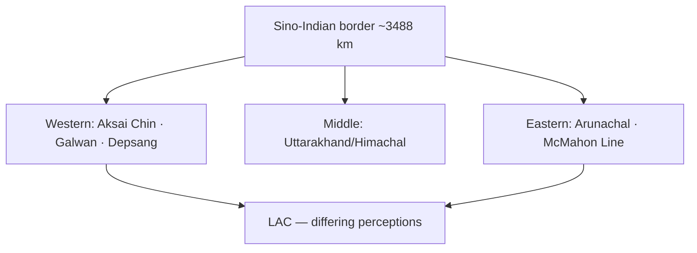

# Sino-Indian Border & Strategic Channels

> GS-1 · Topic 14.2 · Border disputes and strategic maritime channels — Indian subcontinent focus

---

## PYQs

| Year | M | Words | Question (EN) | प्रश्न (HI) | ID |
|------|---|-------|---------------|-------------|-----|
| 2025 | 8 | 125 | Examine the origin, dimensions and implications of Sino-Indian border dispute. | चीन-भारत सीमा विवाद के उद्भव, विस्तार और निहितार्थ का परीक्षण कीजिए। | Q1 |
| 2023 | 8 | — | Write a short note on Nine Number channel and its strategic importance. | नौ नम्बर चैनल के सामरिक महत्व पर एक संक्षिप्त टिप्पणी लिखिए। | Q2 |

---

## Quick Revision

```
SINO-INDIAN DISPUTE ORIGIN (2025):
  Colonial cartography: Johnson Line (1865 Aksai Chin) · McDonald/Macartney Line
  · 1914 McMahon Line (Simla) — Tibet factor · China rejects
  1954 Panchsheel · 1959 Dalai Lama asylum · 1962 War · 1967 Nathu La · 1975 Tulung La

THREE SECTORS:
  Western (Ladakh/Aksai Chin): ~38,000 km² India claims · China controls Aksai Chin · Depsang · Galwan
  Middle (Uttarakhand/Himachal): relatively settled but patrol friction
  Eastern (Arunachal / South Tibet): McMahon Line · Tawang · Asaphila · fish-tail I/II

KEY LINES:
  LAC (Line of Actual Control) — de facto · not mutually agreed maps everywhere
  ≠ IB · ≠ McMahon Line (India claim) · ≠ claim line

POST-1962 DIPLOMACY:
  1993 Agreement · 1996 CBMs · 2005 Political Parameters · Special Representatives (2003+)
  · 2017 Doklam (Bhutan tri-junction) · 2020 Galwan clash · 2022 disengagement phases (partial)

IMPLICATIONS:
  Security: troop buildup · infra race · nuclear backdrop · Pakistan two-front calculus
  Economic: border trade (Nathu La, Lipulekh) limited · investment uncertainty
  Diplomatic: Russia balance · Quad context · BRICS continuity despite friction
  Water: Brahmaputra (Yarlung Tsangpo) · Sutlej · Indus tributaries — data sharing issues

NINE DEGREE CHANNEL (2023):
  Location: 9°N latitude · Arabian Sea · separates Minicoy (southernmost Lakshadweep) from rest
  Width ~200 km · deep-water lane between Lakshadweep atolls and Maldives (Huvadhoo/Kardiva)
  · shipping route Mumbai-Arabian Gulf · Malabar-Suez corridor

STRATEGIC IMPORTANCE:
  Sea lane control · India EEZ surveillance · Androth-Kavaratti-Minicoy chain
  · proximity Maldives (80 nm) — China "String of Pearls" · maritime domain awareness
  · naval patrol · anti-piracy · HADR · submarine transit concern
  · Lakshadweep infra (Minicoy airport, port) — strategic outpost

INSTITUTIONS: WMCC · Special Representatives · ITBP/Army · Indian Navy · Coast Guard · UNCLOS

TRAPS: LAC ≠ agreed boundary | 1962 ≠ only sector | McMahon ≠ accepted by China
  | Nine Degree ≠ Palk Strait | Aksai Chin ≠ Arunachal same dispute type
  | Doklam ≠ in Arunachal (Bhutan tri-junction)
```

---

## Content

### Context — Land disputes and maritime chokepoints as strategic geography

Borders are not merely lines on maps but arenas where history, military capability, trade routes, and environmental change intersect. The Indian subcontinent sits at the junction of continental collision zones and Indian Ocean sea lanes, producing two distinct but related geographies: unsettled Himalayan land boundaries with China and Pakistan, and maritime channels where island territories control access to broader ocean spaces. The Sino-Indian border dispute — among the longest unresolved borders globally at roughly 3,488 kilometres by Indian estimate — originates in colonial cartographic ambiguity and the Tibet question, manifesting across western, middle, and eastern Himalayan sectors with implications for security, diplomacy, water sharing, and local livelihoods. Separately, the Nine Degree Channel in the Arabian Sea separates Minicoy from the northern Lakshadweep archipelago, forming a deep-water gap near the Maldives whose surveillance value complements land-border concerns in comprehensive national security thinking. Understanding both requires tracing how lines were drawn without consent, how military facts on ground replaced treaties, and why management rather than final settlement may be the realistic near-term outcome.

### Sino-Indian border dispute — historical origins and why ambiguity persisted

The dispute is not a single disagreement but a layered inheritance of British survey lines, Tibetan sovereignty questions, and post-colonial state-building on both sides. In the western sector, the Johnson Line of 1865 placed Aksai Chin within Jammu and Kashmir princely state cartography, while alternative MacDonald or Macartney lines further north reflected British indecision about whether to concede the barren plateau to a weak Qing empire or a expanding Russian sphere. British India never unified these claims before 1947, leaving independent India and the People's Republic of China — established in 1949 and consolidating Tibet by 1950–51 — to inherit contradictory maps.

The 1914 Simla Convention between British India, Tibet, and China attempted to demarcate the McMahon Line separating Tibet from northeastern British India (now Arunachal Pradesh). China repudiated the convention; Tibet's participation and subsequent Chinese absorption of Tibet in 1951 made the eastern alignment permanently contested. The 1950s began with Panchsheel (1954) and Nehru-Zhou Enlai bonhomie while India recognized Tibet as part of China without settling the border — a diplomatic trade that deferred cartography until trust collapsed. The 1959 Dalai Lama asylum in India and clashes at Longju and Khizrabe passes marked the turning point. The 1962 Sino-Indian War saw Chinese offensives in both Aksai Chin and the North-East Frontier Agency (now Arunachal Pradesh), followed by unilateral ceasefire and withdrawal to positions that became the Line of Actual Control (LAC). Post-1962 skirmishes — Nathu La 1967, Tulung La 1975 — confirmed that patrol friction would persist episodically for decades.

| Phase | Event | Significance |
|-------|-------|--------------|
| Colonial cartography | Johnson Line (1865) for Aksai Chin; McDonald/Macartney alternatives | British never unified claim — inherited confusion |
| 1914 Simla Convention | McMahon Line demarcating Tibet–NE India | China repudiated — Tibet participation contested |
| 1950s | PRC control of Tibet; Panchsheel (1954) | India recognized Tibet as part of China — border unsettled |
| 1959 | Dalai Lama asylum; border clashes | Trust collapse |
| 1962 | War in Aksai Chin and NEFA (Arunachal) | Status quo largely frozen post-ceasefire |
| Post-1962 | Nathu La 1967; Tulung La 1975 | Patrol clashes continue episodically |

Why the dispute persisted: no mutually accepted treaty delimits the entire line; Aksai Chin is strategically vital to China as link between Xinjiang and Tibet via Highway G219 while India claims it on Johnson Line basis; China claims Arunachal as "South Tibet" especially Tawang with its Buddhist monastery significance; and the border remains entangled with Tibet sovereignty and Dalai Lama presence in India — issues neither side can decouple from cartography without domestic political cost.

### Dimensions — three sectors and the terminology of lines

#### Western sector (Ladakh / Aksai Chin)

India claims approximately 38,000 square kilometres of Aksai Chin; China administers the plateau and connects it to Tibet through infrastructure India matched only after 2014 with DS-DBO road, bridges, and forward airfields. Disputed pockets include Depsang Plains — where Chinese patrols have blocked Indian access to traditional patrolling points — Demchok, and Galwan Valley where the June 2020 clash killed twenty Indian soldiers and an unknown number of Chinese troops, the first fatalities in forty-five years, fundamentally altering border management doctrine toward permanent deployment, restriction of buffer zones, and accelerated infrastructure race. Multiple LAC segments exist with differing perceptions on maps and ground — patrol points, "finger" features on Pangong Tso, and buffer zones negotiated in disengagement talks.

#### Middle sector (Uttarakhand, Himachal Pradesh)

Relatively quiet compared to west and east but not settled. Barahoti plains in Uttarakhand saw historical grazing disputes; patrol face-offs occur with less media attention but demonstrate that the LAC is continuous, not confined to Ladakh headlines.

#### Eastern sector (Arunachal Pradesh)

India administers the state along McMahon Line alignment; China periodically issues stapled visas to Arunachal residents, denying Indian sovereignty symbolically. Disputed pockets include Asaphila, Yangtse, Fish Tail 1 and 2, and historical Sumdorong Chu standoff (1987). Monpa Buddhist Tawang carries cultural symbolism for both sides beyond strategic ridges.



| Term | Meaning |
|------|---------|
| Claim Line | Maximal legal claim on official maps |
| McMahon Line | India's eastern alignment (1914 Simla) |
| LAC | Actual military positions post-1962 — not fully demarcated on ground/maps |
| IB | Not applicable India–China — no agreed international boundary |

### Implications — security, economy, diplomacy, water, and local communities

Security and military implications dominate public discourse. Both sides maintain permanent troop deployments at high altitude requiring acclimatization regiments, airlift capability, and winter stocking. Nuclear weapons backdrop introduces crisis stability concerns — limited tactical hotlines historically weak compared to US-Soviet models. Pakistan dimension adds two-front collusion calculus, intensified post-Galwan with force reorientation debates. Confidence-Building Measures (CBMs) from 1993 and 1996 agreements — no-use of force, prior notification of military exercises, patrol norms, flag meetings — were tested severely in 2020 though not entirely discarded.

Economic and connectivity implications include limited but symbolically important border trade at Nathu La, Shipki La, and Lipulekh passes — volumes remain small relative to potential. BCIM (Bangladesh-China-India-Myanmar) economic corridor remains stalled by trust deficit, blocking trans-Himalayan integration that could benefit northeastern and eastern India. Investment climate in border states carries uncertainty premium affecting tourism and industry.

Diplomatic track runs through Special Representative mechanism established 2003 — twenty-three plus rounds seeking political parameters and framework agreement — with slow progress despite simultaneous BRICS, RIC, and climate cooperation. Quad alignment adds external pressure without replacing bilateral negotiation. Partial disengagement at Galwan, Pangong Tso, and Gogra-Hot Springs (2020–2022) contrasts with pending Depsang and Demchok issues — management not resolution.

Environmental and water dimensions grow in salience. Brahmaputra (Yarlung Tsangpo upstream) dam and diversion concerns trigger lower riparian anxiety in Assam. Sutlej and Indus tributaries originate in middle sector glacial zones. Climate change melts glaciers, alters patrol terrain, and increases disaster risk — 2023 Sikkim glacial lake outburst illustrated Himalayan fragility.

Human and local implications affect border villages in Chushul, Demchok, and Arunachal valleys where grazing rights curtailed, dual-use infrastructure prioritized, and development balanced against environmental fragility and strategic sensitivity.

| Implication domain | Key dynamics |
|--------------------|--------------|
| Security | Troop buildup; infra race; nuclear backdrop; two-front calculus |
| Economy | Limited border trade; stalled BCIM; investment uncertainty |
| Diplomacy | Special Representatives; partial disengagement; BRICS continuity |
| Water/climate | Brahmaputra anxiety; glacial retreat; disaster risk |
| Local | Grazing rights; village development vs militarization |

### Nine Degree Channel — geography and why the name matters

The Nine Degree Channel (also called Nine Number Channel in some sources) lies at approximately nine degrees North latitude in the Arabian Sea / Laccadive Sea. It separates Minicoy Island — the southernmost inhabited island of Lakshadweep union territory — from the main Lakshadweep archipelago chain (Kavaratti, Agatti, Andrott to the north). Roughly 200 kilometres of open deep water lie between these atoll groups, forming a natural maritime passage. Maldives' Huvadhoo Atoll and Kardiva Channel lie approximately eighty nautical miles south of Minicoy — close enough that maritime traffic, surveillance, and geopolitical competition in the Indian Ocean Region (IOR) treat the channel as part of a broader Lakshadweep–Maldives gap rather than an isolated domestic strait.

Do not confuse with Ten Degree Channel separating Andaman from Nicobar Islands in the Bay of Bengal, or with Palk Strait between India and Sri Lanka. Eight Degree Channel terminology sometimes appears for Maldives–Minicoy separation in older texts — the standard reference for Lakshadweep internal separation plus Maldives proximity is Nine Degree Channel.

### Nine Degree Channel — strategic importance and India's maritime response

The channel is not a Hormuz-scale global oil chokepoint but a maritime sentinel zone for India's western island territories with cumulative strategic value across several dimensions.

Sea lanes of communication (SLOC) from Mumbai and Kochi toward Arabian Gulf and Suez corridor pass near the Lakshadweep chain; the channel enables north-south naval movement between Arabian Sea sectors and controls approach routes to Minicoy from both mainland India and Maldives direction. Maritime surveillance depends on monitoring surface and sub-surface traffic through the Lakshadweep–Maldives gap — critical for illegal fishing enforcement in Lakshadweep's EEZ of roughly 400,000 square kilometres, anti-piracy patrol boxes linked to Operation Sankalp in Gulf of Aden transit routes, and humanitarian assistance/disaster response (HADR) to cyclone-vulnerable atolls.

Minicoy functions as southern sentinel with airport and helipad upgrades, communication towers, and potential naval outpost development controlling southern approach to India's western island territories. Maldives proximity intensifies salience as China's Indian Ocean engagement — port visits, infrastructure loans, diplomatic influence episodes including 2024 tensions — raises Indian Navy patrol priority. Deep water suits submarine transit, creating anti-submarine warfare (ASW) coverage requirements. Blue economy — sustainable fishing, tourism at Agatti and Bangaram — depends on secure seas without external threat or poaching collapse.

| Dimension | Strategic importance |
|-----------|---------------------|
| SLOC | Mumbai–Arabian Gulf shipping; north-south naval movement |
| Surveillance | Surface/sub-surface traffic through Lakshadweep–Maldives gap |
| Lakshadweep defence | Minicoy southern outpost; EEZ ~400,000 km² |
| Maldives proximity | IOR geopolitical competition; patrol priority |
| ASW / fishing | Deep-water submarine transit; illegal fishing control |
| HADR / blue economy | Cyclone response; tourism and fisheries security |

India's responses include INS Dweeprakshak at Kavaratti, patrol craft, MRCC Lakshadweep, Minicoy infrastructure upgrades, mission-based deployments linked to Arabian Sea routes, and Comprehensive Integrated Maritime Domain Awareness with coastal radar chain including islands.

### Other strategic channels — comparative context

| Channel | Location | Significance |
|---------|----------|--------------|
| Ten Degree Channel | Andaman–Nicobar | Connects Bay of Bengal to Andaman Sea — Tri-services ANC HQ Port Blair |
| Palk Strait | India–Sri Lanka | Shallow — fishing disputes; Sethusamudram debate |
| Malacca Strait | Outside subcontinent but vital | ~80% Japan/China oil transit — Indian Navy forward presence |

### Contemporary relevance

2020 Galwan permanently altered Ladakh infrastructure and border regiment posture including Agnipath-era reforms. 2023–24 standardized toponyms in Arunachal signal sovereignty assertion. Border trade reopening talks post-COVID closure continue episodically. Lakshadweep tourism and infrastructure push amid 2024 Maldives diplomatic episode raises Nine Degree Channel security salience. China's Western Theatre Command aligns against India's Northern Command across the same Himalayan geography where Special Representatives meet in parallel with friction.

### Limits and balanced view

Sino-Indian dispute unlikely to see quick territorial settlement — management through CBMs, disengagement protocols, and SR talks is realistic near-term goal rather than final boundary award. Economic interdependence exceeding $100 billion trade coexists with border friction — relationship is competitive-cooperative, not pure adversary. Nine Degree Channel importance is regional surveillance and IOR presence, not global energy gate like Hormuz — overstating or understating both mislead. Local island communities depend on safe seas for fishing and tourism — security policy must include livelihoods, not only warships. Partial Galwan disengagement does not mean full resolution — Depsang and Demchok remain active friction points. Confusing LAC with LoC blurs entirely different dispute histories — LAC is India–China Himalayan line; LoC is India–Pakistan Simla 1972 ceasefire in Jammu and Kashmir only.

---

## Answers

### Q1: Origin, dimensions and implications of Sino-Indian border dispute. (2025, 8M, 125W)

**Introduction:**
> **The Sino-Indian border dispute originates in colonial-era cartographic ambiguity and the Tibet question**, **manifesting across western, middle, and eastern Himalayan sectors with enduring strategic implications**.

**Main Points:**
- **Origin** — **Johnson/McMahon lines, 1914 Simla rejection by China, 1959 asylum crisis, 1962 War**.
- **Dimensions** — **Western: Aksai Chin/Galwan; Eastern: Arunachal/McMahon Line; Middle: Uttarakhand pockets**.
- **LAC** — **De facto line, differing perceptions, 2020 Galwan fatalities**.
- **Implications** — **Military buildup, partial disengagement talks, two-front security calculus, stalled BCIM trade**.
- **Non-traditional** — **Brahmaputra water anxiety, climate impacts on glaciated border**.

**Keywords (underline in exam):** LAC · Aksai Chin · McMahon Line · 1962 War · Galwan · Special Representatives · CBMs

**Exam diagram (30 sec):**
```
Origin: colonial maps + Tibet → 1962
Sectors: W (Aksai Chin) · E (Arunachal)
Impact: security · diplomacy · water
```

**Conclusion:**
> **Dispute management through CBMs and SR talks remains imperative** — **unsettled border constrains Asian stability and Indian developmental peripheries**.

---

### Q2: Nine Degree Channel and strategic importance. (2023, 8M)

**Introduction:**
> **The Nine Degree Channel in the Arabian Sea separates Minicoy from the northern Lakshadweep islands**, **forming a strategic maritime gap near the Maldives**.

**Main Points:**
- **Location** — **~9°N latitude, ~200 km open sea between Lakshadweep groups**.
- **SLOC** — **Western shipping routes, Mumbai-Arabian Sea connectivity**.
- **Defence** — **Minicoy southern outpost, naval/coast guard surveillance, EEZ protection**.
- **Geopolitical** — **Maldives proximity, IOR power competition, anti-piracy/HADR**.
- **Sub-surface & fishing control** — **ASW concern, illegal fishing monitoring**.

**Keywords (underline in exam):** Nine Degree Channel · Minicoy · Lakshadweep · EEZ · SLOC · Arabian Sea · Maritime Domain Awareness

**Exam diagram (30 sec):**
```
Lakshadweep north — Nine Degree Channel — Minicoy — near Maldives
→ Navy patrol · shipping · EEZ
```

**Conclusion:**
> **Channel is a ** **maritime sentinel zone for India's western islands** — **vital for IOR security amid growing external presence**.

---

### Q3: *Likely variant:* Line of Actual Control (LAC) vs Line of Control (LoC) — distinguish. (—, 8M, 125W)

**Introduction:**
> **Both are military lines, but LAC separates India-China forces while LoC separates India-Pakistan forces in Jammu & Kashmir**.

**Main Points:**
- **LAC** — **India-China, post-1962 ceasefire, not fully demarcated, Galwan-type clashes**.
- **LoC** — **India-Pakistan, 1972 Simla Agreement, UNMOGIP legacy in PoK context**.
- **Legal status** — **Neither is agreed final international boundary**.
- **Sectors** — **LAC: Ladakh-Arunachal; LoC: J&K only**.

**Keywords (underline in exam):** LAC · LoC · Simla 1972 · 1962 Ceasefire · CBMs

**Exam diagram (30 sec):**
```
LAC = India-China (Himalaya)
LoC = India-Pakistan (J&K)
Both ≠ final boundary
```

**Conclusion:**
> **Confusing the two lines blurs entirely different dispute histories and diplomatic tracks**.

---

## Traps

| Wrong | Correct |
|-------|---------|
| LAC = mutually agreed boundary | **De facto military line — maps differ** |
| McMahon Line accepted by China | **China rejects — claims Arunachal as South Tibet** |
| 1962 war only in one sector | **Chinese offensives in ** **Aksai Chin and NEFA (Arunachal)** |
| Aksai Chin and Arunachal same package deal | **Different sectors, different tactical logic** |
| Doklam in Arunachal | **Bhutan-China-India tri-junction near Sikkim** |
| Nine Degree Channel = Palk Strait | **Arabian Sea Lakshadweep; Palk Strait is India-Sri Lanka** |
| Nine Degree = Ten Degree Channel | **Nine: Lakshadweep-Minicoy; Ten: Andaman-Nicobar** |
| Minicoy part of Maldives | **Indian UT Lakshadweep — near Maldives** |
| Galwan resolved fully | **Partial disengagement; Depsang/Demchok issues remain** |
| Border dispute blocks all trade | **Limited border trade at Nathu La etc. continues episodically** |

---

*Complete.*
